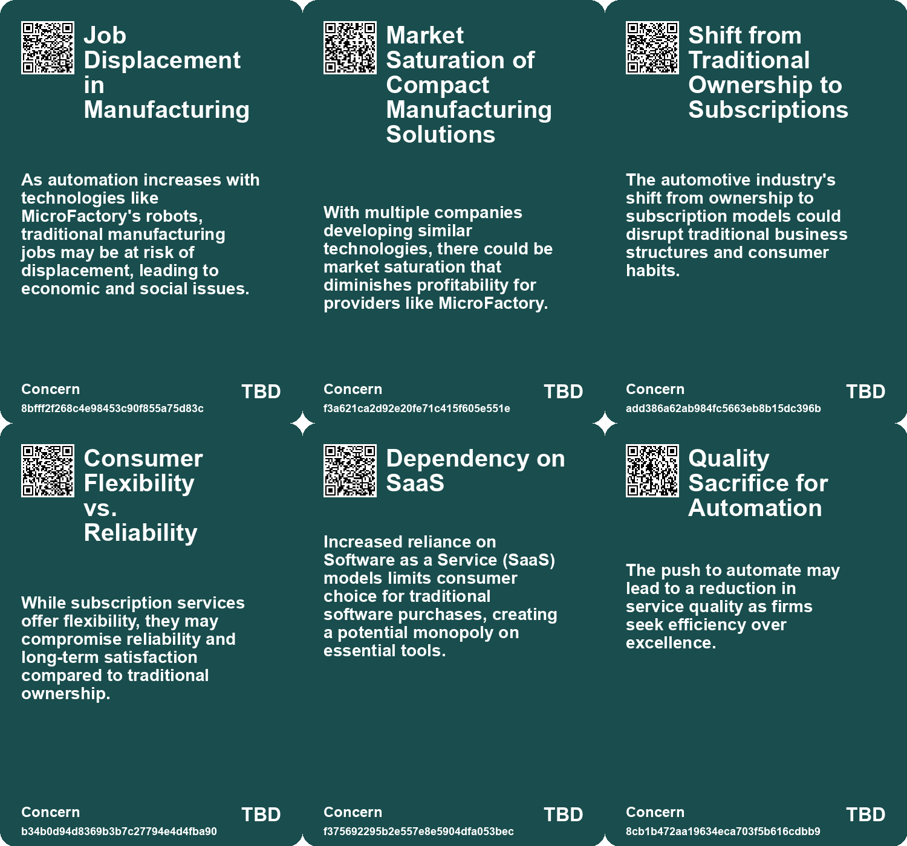
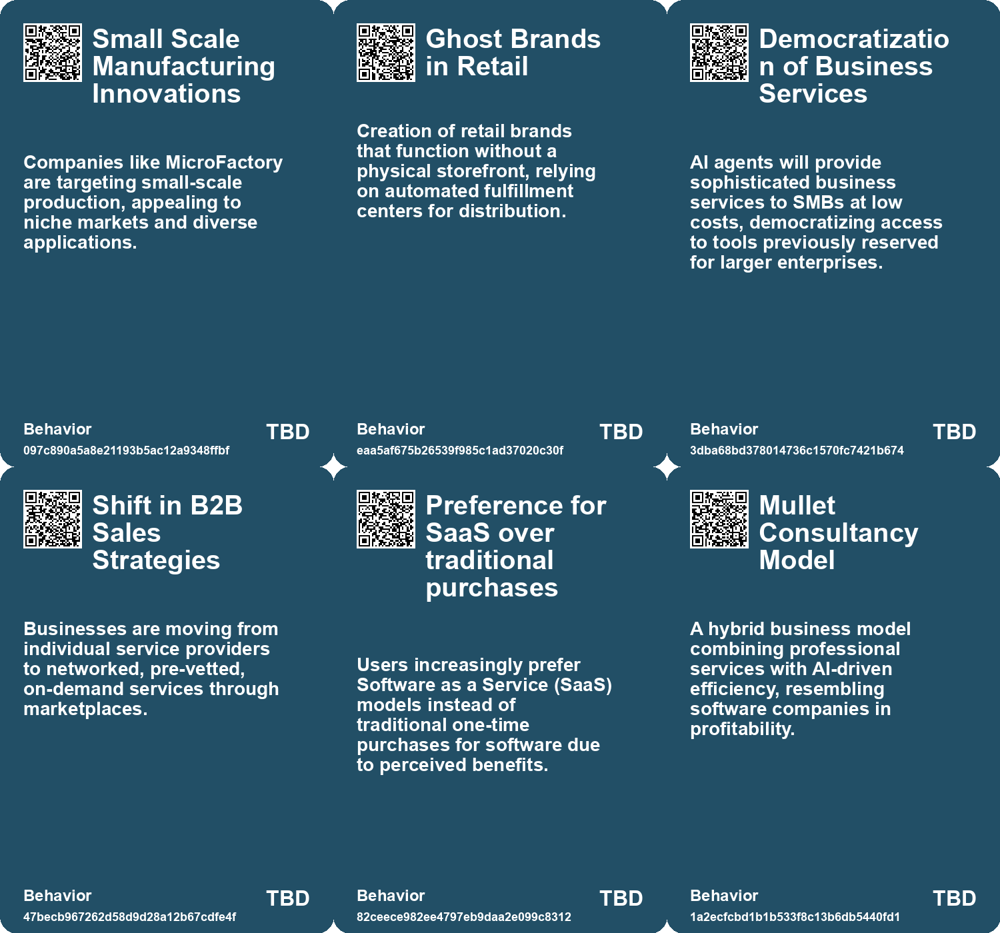
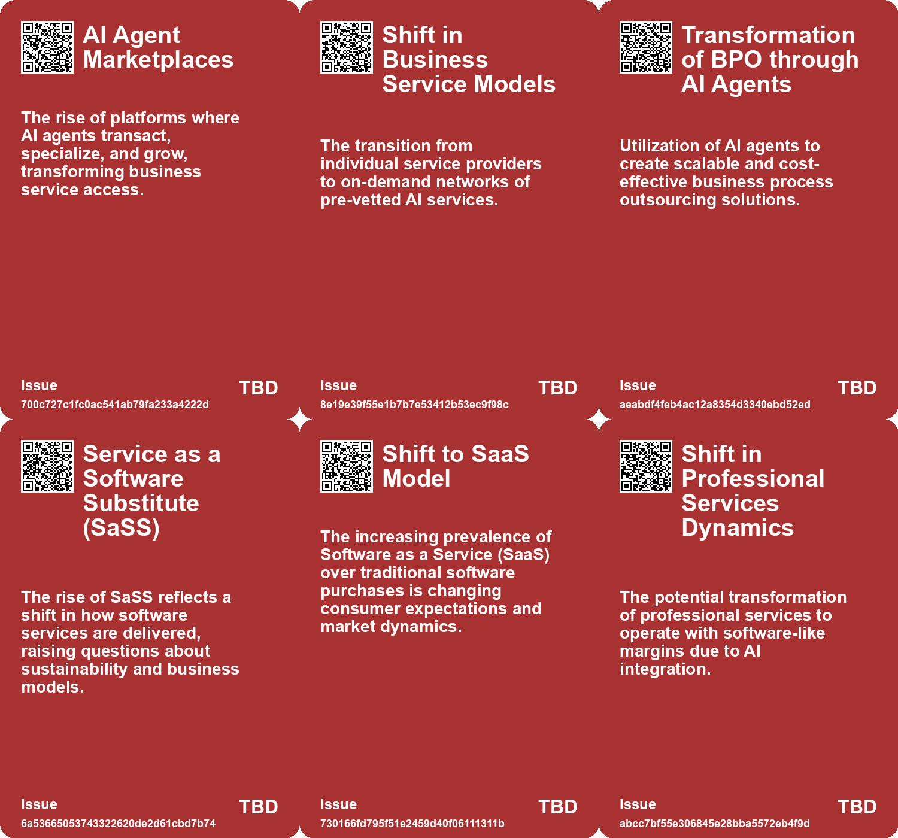
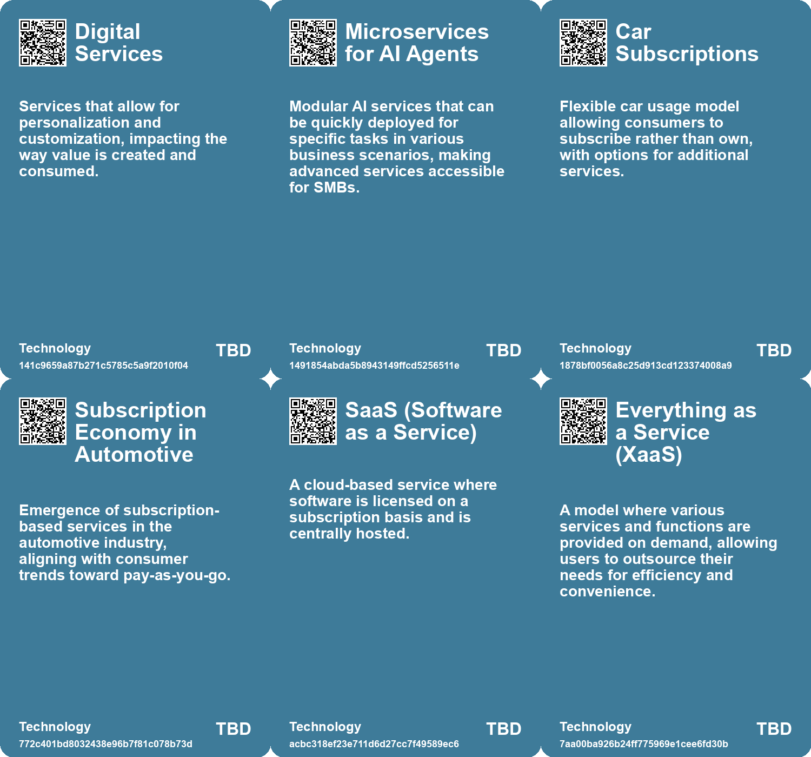

# *Topic*: Factory-as-a-Service

# Summary

The labor market is undergoing a significant transformation driven by advancements in artificial intelligence (AI). The rise of AI workers is reshaping traditional business models, particularly in the software sector, where Service-as-a-Software is emerging. This shift presents opportunities for founders and leads to margin expansion as AI services replace human-centric roles. While some jobs may vanish, AI is also expected to create new opportunities and facilitate rapid workforce re-skilling.

The automotive industry is experiencing a major shift as well, with direct distribution methods and digital sales replacing traditional dealership models. The growing acceptance of electric vehicles (EVs) in Europe, alongside the introduction of car subscription services, is changing consumer behavior. These subscription models appeal to younger generations and are expected to lower barriers to EV adoption, while non-traditional players enter the market to capitalize on this evolving landscape.

In the realm of professional services, a new model is emerging where agencies recruit talent to train AI, ultimately phasing out human roles. This approach raises questions about employment contracts and compensation structures, as companies seek to leverage AI for scalability and improved margins. The implications of this model could transform how professional services operate, emphasizing the need for high-quality training data.

The concept of Agentic Business Objects (ABOs) is gaining traction, advocating for data records that actively manage themselves. This shift could revolutionize workflows across various sectors by eliminating inefficiencies caused by data silos. As companies adapt to this new paradigm, employees will need to develop skills focused on oversight and systems design.

Results as a Service (RaaS) is another innovative model that delivers specific outcomes through automated processes and AI agents. RaaS offers cost efficiency and scalability across industries, but it also presents challenges such as data security and integration. The potential for RaaS to improve customer satisfaction and drive economic implications is significant, particularly as businesses navigate the transition to this model.

In manufacturing, companies like MicroFactory and Xiaomi are pushing the boundaries of automation. MicroFactory is developing a compact manufacturing kit that simplifies robotics, while Xiaomi's fully automated smart factory in Beijing exemplifies the future of production without human workers. These advancements highlight the ongoing evolution of manufacturing processes and the role of AI in optimizing production.

The architecture, engineering, and construction (AEC) industry is also evolving, with trends like sustainability integration and AI-driven solutions reshaping project management. As digital tools become more prevalent, the industry is moving towards a more connected and data-driven future, addressing challenges of fragmentation and inefficiency.

Finally, the emergence of AI agents is democratizing access to sophisticated business solutions, particularly for small and medium-sized businesses. Companies are increasingly recognizing the potential of AI agents to streamline operations and enhance service accessibility. However, the gap between technological advancements and market adoption remains a challenge, necessitating the establishment of reliable infrastructure and tools for widespread implementation.

# Seeds

|    | name                                        | description                                                                                        | change                                                                                         | 10-year                                                                                                   | driving-force                                                                                             |
|---:|:--------------------------------------------|:---------------------------------------------------------------------------------------------------|:-----------------------------------------------------------------------------------------------|:----------------------------------------------------------------------------------------------------------|:----------------------------------------------------------------------------------------------------------|
|  0 | Subscription Model in Defense Procurement   | F-35 is marketed as a subscription service, changing military procurement dynamics.                | Countries transition from outright purchases to ongoing service models for military hardware.  | Future defense acquisitions may increasingly adopt subscription models, complicating ownership and usage. | The tech industry's success with subscription models influences shifts in defense procurement strategies. |
|  1 | Non-traditional Players Entering the Market | Companies from outside the automotive sector are launching subscription services.                  | From traditional automakers to diverse players offering mobility solutions.                    | The automotive landscape could include diverse providers of mobility services.                            | Competition and innovation from various sectors drive new offerings.                                      |
|  2 | Shift to SaaS Model                         | Increasing trend of software products transitioning to subscription-based SaaS models.             | From one-time purchases to continuous subscription payments for software.                      | More software will only be available through subscription models, limiting ownership options.             | Companies seeking sustainable revenue streams and providing continuous updates.                           |
|  3 | Mullet Consultancy Model                    | Professional services firms adopting a hybrid model of visible services and backend AI automation. | Moving from traditional consulting to a software-like margin profile.                          | Consulting firms will heavily rely on AI, leading to significant operational changes and efficiencies.    | The pursuit of higher margins and scalability in an increasingly competitive market.                      |
|  4 | Changing Nature of Professional Services    | AI enabling the transformation of professional services into productized offerings.                | From bespoke services to standardized, AI-driven solutions.                                    | Professional services will be more commoditized, affecting pricing and quality perception.                | The need for businesses to innovate and offer scalable solutions in a competitive landscape.              |
|  5 | Reversal of SaaS acronym                    | Shift from Software-as-a-Service to Service-as-a-Software due to AI advancements.                  | The focus is moving from software tools to fully automated services.                           | We might see a complete overhaul of the SaaS model, emphasizing service delivery via AI.                  | The rise of AI capabilities that can execute tasks traditionally done by humans.                          |
|  6 | Affordable RaaS for Small Businesses        | Small businesses are finding tailored RaaS solutions within budget.                                | From costly service models to affordable, outcome-driven solutions for small enterprises.      | Small businesses may thrive through cost-effective RaaS, leveling the competitive landscape.              | The need for small businesses to innovate and compete in a cost-effective manner.                         |
|  7 | Mullet Consultancy Model                    | Professional services firms adopting a hybrid model of visible services and backend AI automation. | Moving from traditional consulting to a software-like margin profile.                          | Consulting firms will heavily rely on AI, leading to significant operational changes and efficiencies.    | The pursuit of higher margins and scalability in an increasingly competitive market.                      |
|  8 | Changing Nature of Professional Services    | AI enabling the transformation of professional services into productized offerings.                | From bespoke services to standardized, AI-driven solutions.                                    | Professional services will be more commoditized, affecting pricing and quality perception.                | The need for businesses to innovate and offer scalable solutions in a competitive landscape.              |
|  9 | Self-Perception in Manufacturing            | The factory's platform has self-perception and decision-making capabilities.                       | Move towards factories that can independently diagnose and resolve issues without human input. | Manufacturing systems may achieve higher levels of autonomy, leading to new operational efficiencies.     | The push for smarter manufacturing solutions that integrate advanced AI capabilities.                     |

# Concerns

|    | name                                                 | description                                                                                                                                                                 |
|---:|:-----------------------------------------------------|:----------------------------------------------------------------------------------------------------------------------------------------------------------------------------|
|  0 | Job Displacement in Manufacturing                    | As automation increases with technologies like MicroFactory's robots, traditional manufacturing jobs may be at risk of displacement, leading to economic and social issues. |
|  1 | Market Saturation of Compact Manufacturing Solutions | With multiple companies developing similar technologies, there could be market saturation that diminishes profitability for providers like MicroFactory.                    |
|  2 | Shift from Traditional Ownership to Subscriptions    | The automotive industry's shift from ownership to subscription models could disrupt traditional business structures and consumer habits.                                    |
|  3 | Consumer Flexibility vs. Reliability                 | While subscription services offer flexibility, they may compromise reliability and long-term satisfaction compared to traditional ownership.                                |
|  4 | Dependency on SaaS                                   | Increased reliance on Software as a Service (SaaS) models limits consumer choice for traditional software purchases, creating a potential monopoly on essential tools.      |
|  5 | Quality Sacrifice for Automation                     | The push to automate may lead to a reduction in service quality as firms seek efficiency over excellence.                                                                   |
|  6 | Commoditization of Professional Services             | As more companies adopt AI-driven models, the unique value of professional services may diminish, leading to price wars.                                                    |
|  7 | Data Privacy and Security Risks                      | With fully digital and automated factories, there may be increased risks of data breaches and cyber-attacks on manufacturing systems.                                       |
|  8 | Environmental Concerns from Increased Production     | The rapid production capabilities of smart factories could lead to increased resource consumption and waste generation.                                                     |
|  9 | Erosion of Human Skills in Manufacturing             | As factories become more automated, human skills in manufacturing may deteriorate, affecting future workforce capabilities.                                                 |

# Cards

## Concerns

## Behaviors

## Issue

## Technology

# Links

* [Bridging the Gap: The Potential and Challenges of AI Agents in Adoption and Implementation](https://futures.kghosh.me/728f32241b93317ba4df36c8cd0004c9)
* [Empowering Artisanal Labor through Technology and Community Collaboration in Detroit](https://futures.kghosh.me/9069cc46631b516b7780b893c126086e)
* [The Interplay of Democracy, Work, and Economic Justice in Modern Society](https://futures.kghosh.me/43aa6ac3d82bbc19f0d66d5b2bb37897)
* [Exploring Cookies, Supply Chains, and Future Challenges in Technology and Consumption](https://futures.kghosh.me/fa27e27bdec01712d582ab0f61c95bac)
* [Exploring the Impact of Results as a Service (RaaS) and AI Agents on Business Efficiency](https://futures.kghosh.me/efe7fe774d7f110b747eddbc2fca6c8d)
* [The F-35 Fighter Jet: A Subscription Model with Geopolitical Implications](https://futures.kghosh.me/d91c1cc223fe90432a76b4dcd2067798)
* [The Rise of AI Agent Marketplaces: A New Era for Small Businesses](https://futures.kghosh.me/3f3f736e1a4c0cb5bb016e789bcdc445)
* [Exploring the Dangers of Outsourcing Happiness and Personal Fulfillment in Modern Society](https://futures.kghosh.me/a5c0ba498382a4edc0f2bf0d9653ad16)
* [Xiaomi's New Smart Factory Revolutionizes Smartphone Production with AI Automation](https://futures.kghosh.me/948e20ea69e584eebf7f1e9278d8d21f)
* [The Promise and Risks of Automation: Creating Jobs While Navigating Challenges](https://futures.kghosh.me/7e84b45a4f5f2bdecec14572bc5fe323)
* [Frustration with Software Subscription Models and the Loss of Ownership](https://futures.kghosh.me/62f0c80f0091e9b15465cd516137b05e)
* [The Shift in Automotive Sales: Embracing Car Subscriptions and Electric Vehicles](https://futures.kghosh.me/b9a5b69113b7ca17b6493414799b0e6e)
* [Revolutionizing Employment: Training AI While Retaining Salary and Profit Shares](https://futures.kghosh.me/cb1de23b85f5c592ad2f8e720a7811a0)
* [Transforming Business Processes: The Rise of Agentic Business Objects (ABOs) and AI Integration](https://futures.kghosh.me/3284928cf2598cdbd55d0bb8efda5d42)
* [Revolutionizing Employment: Training AI While Retaining Salary and Profit Shares](https://futures.kghosh.me/4c4b77ce3fed145489176ff8cff80dca)
* [MicroFactory's Innovative Compact Robots Redefine Manufacturing Efficiency](https://futures.kghosh.me/b848dc9a8845c26c4fadc2d508abdb3b)
* [Rethinking Jobs: From Manufacturing Nostalgia to Thriving Service Economies and Future Work](https://futures.kghosh.me/c13f2cb6cfa1728ffddc82e36c0d126d)
* [Exploring the Disconnection Between AI Promises and Reality at CES 2023](https://futures.kghosh.me/761a3d9b508c2a1db7a6c60d1be5ec98)
* [Pipedream Labs Unveils Revolutionary Delivery System with Underground Pipelines](https://futures.kghosh.me/51534ef934bcdf387ed80f8162389ff7)
* [The 2025 Transformation of the AEC Industry: Embracing Innovation and Sustainability](https://futures.kghosh.me/7b28983e661f02dd4b79aa866889d2a4)
* [Costco Enters Modular Housing Market Amid California’s Regulatory Landscape](https://futures.kghosh.me/063a963cbb987f6e1ab9ff5bcd6f30bd)
* [The Impact of AI on B2B SaaS: From Software-as-a-Service to Service-as-a-Software](https://futures.kghosh.me/608530bf4c83aae76cccb8a3e7383b6d)
* [Fiverr Empowers Freelancers with Custom AI Model Training and Tools](https://futures.kghosh.me/803d70f56f2a5bf094043fb0eb878fb4)
* [TSMC to Produce 30% of Advanced Chips in the U.S. with Arizona Expansion Plans](https://futures.kghosh.me/374f9a6147e5681f7b93d5e426277b74)