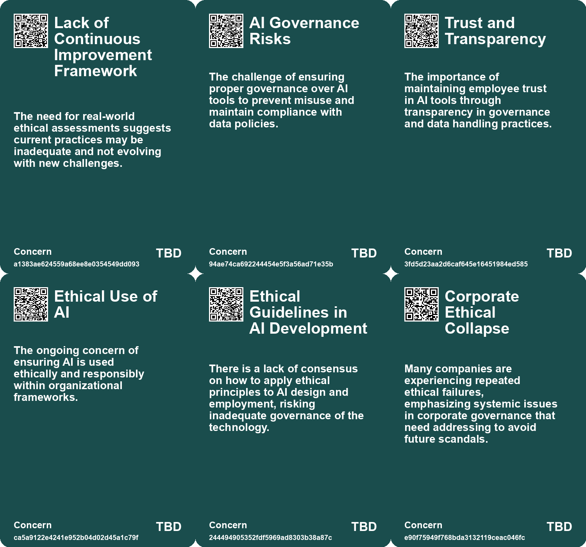
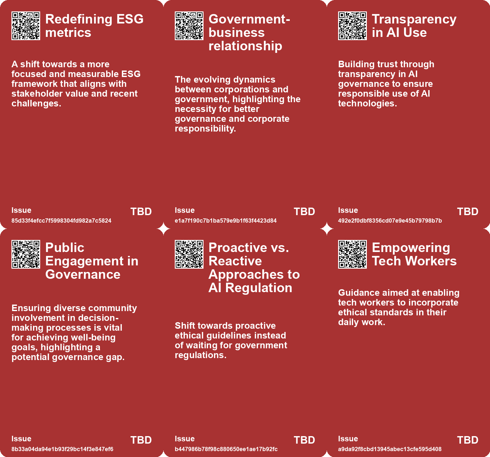
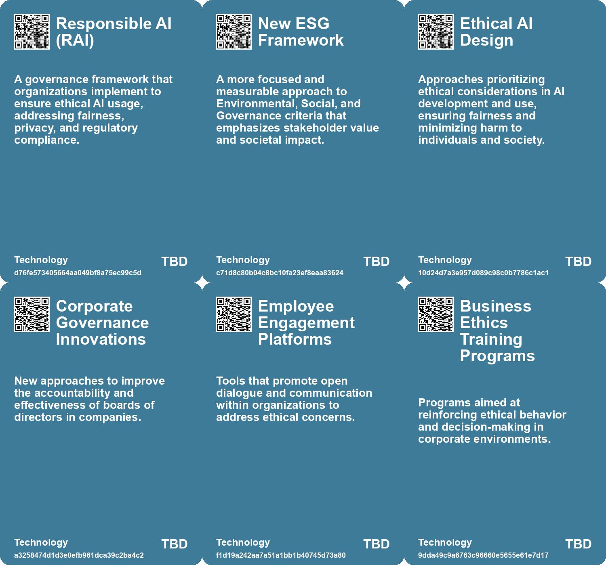

# *Topic*: Focus on Ethical Governance

# Summary

The rapid advancement of artificial intelligence (AI) has sparked a critical conversation about governance and ethical considerations. Organizations are increasingly urged to establish robust AI governance frameworks to mitigate risks such as bias, privacy violations, and cybersecurity threats. The Responsible AI Institute emphasizes the need for oversight, recommending that companies develop principles and policies to ensure responsible AI deployment. This includes compliance with existing laws and adapting to emerging regulations.

Ethical considerations extend beyond AI governance to corporate culture. Marianne Jennings highlights the symptoms of ethical collapse in organizations, pointing to factors like pressure to perform and weak leadership. She advocates for long-term thinking and open dialogue to foster a strong ethical culture, which is essential in preventing corporate scandals. Effective leadership is crucial in creating an environment where ethical practices can thrive.

The emergence of generative AI presents both opportunities and challenges. While it can enhance productivity, it also necessitates careful governance to protect data and ensure responsible use. Microsoft is actively addressing these challenges by implementing guardrails and focusing on data hygiene. Their framework for AI governance encompasses processes, people, and technology, aiming to empower employees while fostering trust in AI tools.

The evolving landscape of Environmental, Social, and Governance (ESG) frameworks is also a focal point. A new, more focused ESG model emphasizes the importance of employee well-being, societal impact, and collaboration with government entities. This shift aims to move beyond checkbox compliance to a more meaningful integration of ESG principles into business practices.

Design and governance play a significant role in enhancing customer experience. Poor design choices can lead to customer frustration, whether in physical spaces or digital products. The concept of Calm Technology is introduced as a design philosophy that prioritizes user self-governance, aiming to create products that provide long-term value.

The future of work is anticipated to be shaped by emerging technologies and cultural transformations. Experts predict a demand for new skills, emphasizing the importance of adaptability and creativity. Public and private sectors are encouraged to collaborate in preparing individuals for the evolving job landscape, focusing on sustainable economic models and collective well-being.

Regulating AI remains a complex challenge. The fragmented regulatory landscape complicates efforts to address risks associated with AI development. Proposals for regulation include licensing processes and iterative governance, highlighting the need for a flexible approach to navigate the benefits and risks of AI.

Finally, the ethical implications of AI are gaining attention globally. The Vatican's collaboration with Santa Clara University on a handbook for AI ethics underscores the importance of values in technology development. This initiative aims to guide the tech industry in addressing ethical dilemmas, emphasizing the common good and the need for proactive measures in AI governance.

# Seeds

|    | name                                        | description                                                                                               | change                                                                                                              | 10-year                                                                                                               | driving-force                                                                                                          |
|---:|:--------------------------------------------|:----------------------------------------------------------------------------------------------------------|:--------------------------------------------------------------------------------------------------------------------|:----------------------------------------------------------------------------------------------------------------------|:-----------------------------------------------------------------------------------------------------------------------|
|  0 | Ethics in Military AI Development           | A growing emphasis on ethical frameworks in the military AI sector due to lack of prior exposure.         | Shift from AI development focused solely on technical aspects to a comprehensive approach including ethics.         | In ten years, military AI developers will have a robust understanding of ethics integrated into their work processes. | The necessity to align AI development with ethical principles to prevent misuse and ensure responsible deployment.     |
|  1 | Integration of AI with Corporate Governance | Connecting AI governance with existing corporate governance structures is becoming essential.             | Moving from isolated AI initiatives to integrated governance that aligns with corporate values and risk management. | Organizations may see a more holistic approach to governance, enhancing overall decision-making processes.            | The recognition that AI impacts all aspects of business operations necessitates integration with corporate governance. |
|  2 | Shift towards measurable ESG                | Emerging focus on quantifiable ESG metrics instead of vague goals.                                        | From vague ESG goals to specific, measurable criteria for employee, societal, and governmental impact.              | In 10 years, ESG criteria will be standardized and measurable, influencing corporate strategies globally.             | Growing pressure from consumers and investors for accountability and transparency in corporate ESG practices.          |
|  3 | Government's role in business ethics        | Recognition of government’s importance in corporate governance and accountability.                        | Shift from viewing government as an obstacle to seeing it as a crucial partner in societal health.                  | Companies will engage more constructively with governments to ensure public good and infrastructure support.          | COVID-19 revealed the critical role of government in society and business operations.                                  |
|  4 | Iterative Governance Concept                | The call for a flexible and adaptive governance model to address rapid technological changes.             | Transition from static regulatory approaches to more adaptive, iterative governance frameworks.                     | Governance structures may evolve to better accommodate fast-paced technological advancements.                         | The mismatch between technological innovation speed and regulatory response speed.                                     |
|  5 | Growing Demand for Ethical AI Practices     | An increasing focus on ethical considerations in AI development and use.                                  | From a technology-first approach to prioritizing ethics and social implications.                                    | Ethical AI will become a standard expectation, influencing AI development and deployment.                             | The need to balance innovation with societal impacts and ethical responsibilities.                                     |
|  6 | Focus on Long-term Needs                    | Emphasis on balancing short-term needs with long-term sustainability.                                     | Shift from reactive to proactive governance in public service planning.                                             | A cultural shift in public policy prioritizing long-term impacts over short-term gains.                               | Growing awareness of climate change and its long-term effects.                                                         |
|  7 | Emergence of ITEC                           | A new organization formed to guide ethical technology practices.                                          | Development of dedicated organizations focused on technology ethics.                                                | In ten years, more specialized organizations may emerge to tackle technology's ethical challenges.                    | Increased demand for accountability and ethical standards in technology.                                               |
|  8 | Ethical AI Awareness                        | Increased focus on ethical considerations in AI deployment within organizations.                          | Shifting from unregulated AI use to a framework emphasizing ethics and responsibility.                              | Organizations may adopt robust ethical frameworks governing AI use and oversight.                                     | The growing need for accountability and ethical standards in technology.                                               |
|  9 | Weak board oversight                        | Many companies have boards that lack experience and oversight capacity, contributing to ethical failures. | From weak oversight to boards that are more engaged, diverse, and accountable in their governance practices.        | In ten years, boards may evolve to include members with diverse experiences and a stronger commitment to ethics.      | The demand for better governance and ethical accountability is pushing companies to reform their boards.               |

# Concerns

|    | name                                     | description                                                                                                                                                   |
|---:|:-----------------------------------------|:--------------------------------------------------------------------------------------------------------------------------------------------------------------|
|  0 | Lack of Continuous Improvement Framework | The need for real-world ethical assessments suggests current practices may be inadequate and not evolving with new challenges.                                |
|  1 | AI Governance Risks                      | The challenge of ensuring proper governance over AI tools to prevent misuse and maintain compliance with data policies.                                       |
|  2 | Trust and Transparency                   | The importance of maintaining employee trust in AI tools through transparency in governance and data handling practices.                                      |
|  3 | Ethical Use of AI                        | The ongoing concern of ensuring AI is used ethically and responsibly within organizational frameworks.                                                        |
|  4 | Ethical Guidelines in AI Development     | There is a lack of consensus on how to apply ethical principles to AI design and employment, risking inadequate governance of the technology.                 |
|  5 | Corporate Ethical Collapse               | Many companies are experiencing repeated ethical failures, emphasizing systemic issues in corporate governance that need addressing to avoid future scandals. |
|  6 | Inexperienced Board Members              | Weak and inexperienced boards may foster environments where ethical issues are overlooked, impacting corporate governance.                                    |
|  7 | Conflicts of Interest in Leadership      | Conflicts of interest, particularly among board members, can compromise decision-making and lead to ethical breaches.                                         |
|  8 | Governance Blind Spots                   | Designers may overlook the behavioral aspects of governance, resulting in alienating structures that do not meet diverse user needs.                          |
|  9 | Ethical Behavior Concerns                | Issues in ethical behavior can arise when integrating sustainability into business practices, leading to reputational risks.                                  |

# Cards

## Concerns

## Behaviors

## Issue

## Technology

# Links

* [Design as Governance: Lessons from a Coffee Shop Experience on User-Centric Design](https://futures.kghosh.me/2587a142b15645727d2adbee3539d4de)
* [Empowering EY Professionals Through the Masters in Sustainability Program](https://futures.kghosh.me/fcb03e94b8239b410a79996496599390)
* [Overview of the Well-being of Future Generations (Wales) Act 2015 and Its Implications](https://futures.kghosh.me/3938700a79bbde32972657f9eb7b1b69)
* [Shifting from Jobs to Tasks: Embracing Generative AI in the Workplace](https://futures.kghosh.me/7b32746090d30efbc45247539e3ec1da)
* [Navigating AI Governance: Building Trust and Compliance in a Complex Landscape](https://futures.kghosh.me/ae5781502d3793bed9753abfaaae817c)
* [Connecting Local Economies to Global Markets: Insights from Rosabeth Moss Kanter's Analysis](https://futures.kghosh.me/b0f9303688b3f36feafd21625c5d3461)
* [The Urgent Need for Ethical AI Regulations Amid Rapid Development and Deployment](https://futures.kghosh.me/382e9ebc1e518ee49e541da1e6b5f8af)
* [Navigating the Complex Regulatory Landscape of Generative AI: Risks and Strategies for Organizations](https://futures.kghosh.me/43eafc183f7cc060f7cb7fed455e20a7)
* [Future of Work: Embracing Opportunities and Adapting to Change Over the Next 50 Years](https://futures.kghosh.me/a601d356f6c81dbc065229f13e92c3f8)
* [Free 'Agentic AI Governance Breakdown' Offers Key Insights for Effective Governance in AI](https://futures.kghosh.me/477fe069fada8abbc9715b5b648e5c1f)
* [Establishing Responsible AI Governance: A Guide for Organizations in an Evolving Landscape](https://futures.kghosh.me/fab122d29aed97045e0cc1ea77bdef44)
* [Navigating the Challenges of Regulating Artificial Intelligence in a Rapidly Evolving Landscape](https://futures.kghosh.me/58612e45effab1e47df9a86b14dfae85)
* [The Call for a New, Focused ESG: Prioritizing Employees, Society, and Government](https://futures.kghosh.me/022335f24a4ab2580a4b1fb2dbb53fac)
* [Understanding Corporate Ethical Collapse: Key Signs and Preventive Measures](https://futures.kghosh.me/45854362019860740951c83df1c7122e)
* [Balancing Creativity and Safety: Microsoft's Approach to Generative AI Governance](https://futures.kghosh.me/d4390e62256a0c3c19306c1ebc3ffb5b)
* [The Vatican's Handbook on AI Ethics: A Guide to Responsible Technology Development](https://futures.kghosh.me/994781edb78a36cd547b86f570716280)
* [Future of Work: Embracing Opportunities and Adapting to Change Over the Next 50 Years](https://futures.kghosh.me/56ddb45deabcdc8b707c7647270e101d)
* [Graduating in Bioethics: A Shift Towards Biotech and Health Policies at KU Leuven](https://futures.kghosh.me/04f3076662c51df8c7a975137fdec213)
* [Transforming Wealth Management: Strategies for Engaging Inheritors and Ensuring Legacy](https://futures.kghosh.me/18fc966e24c3f498471d55b81c483b22)
* [The Knowledge Tree: A Flexible Learning Tool for AI Ethics in Military Contexts](https://futures.kghosh.me/7788db31bd344bae4cb0eb7c77e36b16)