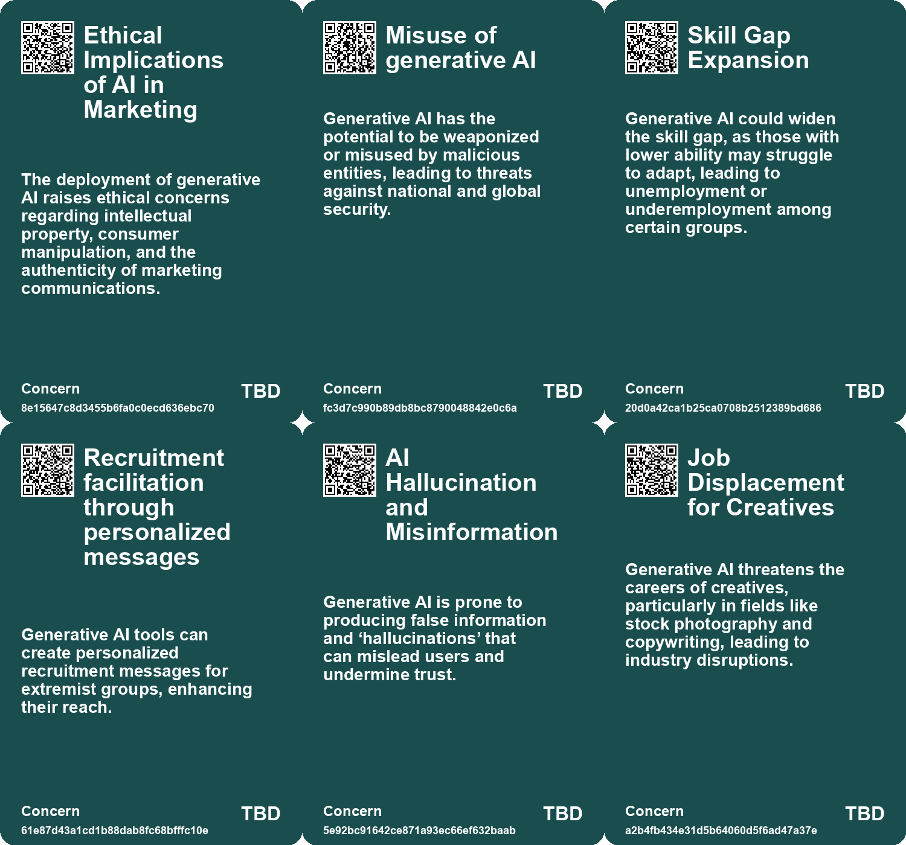
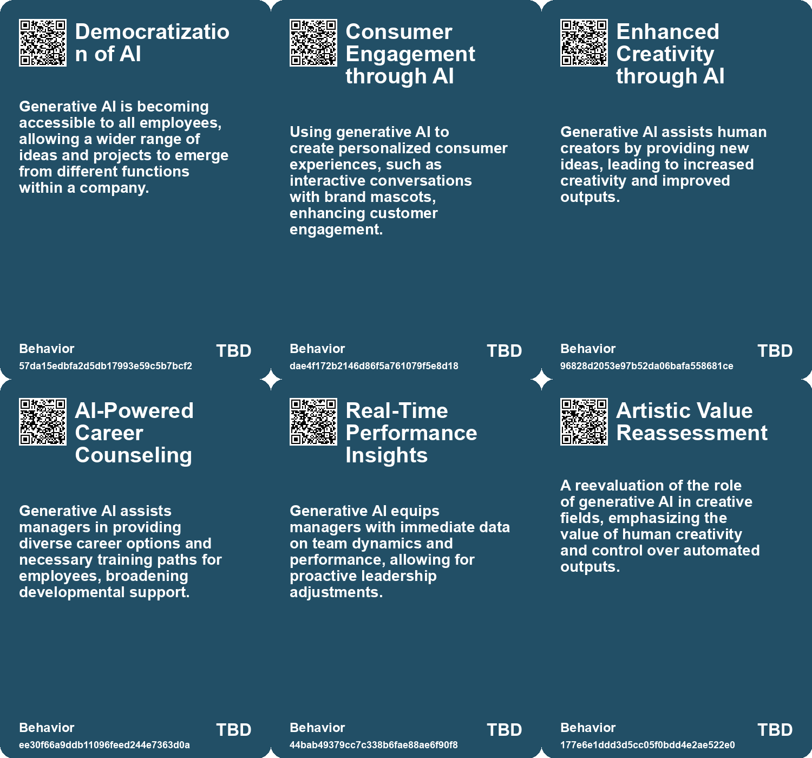
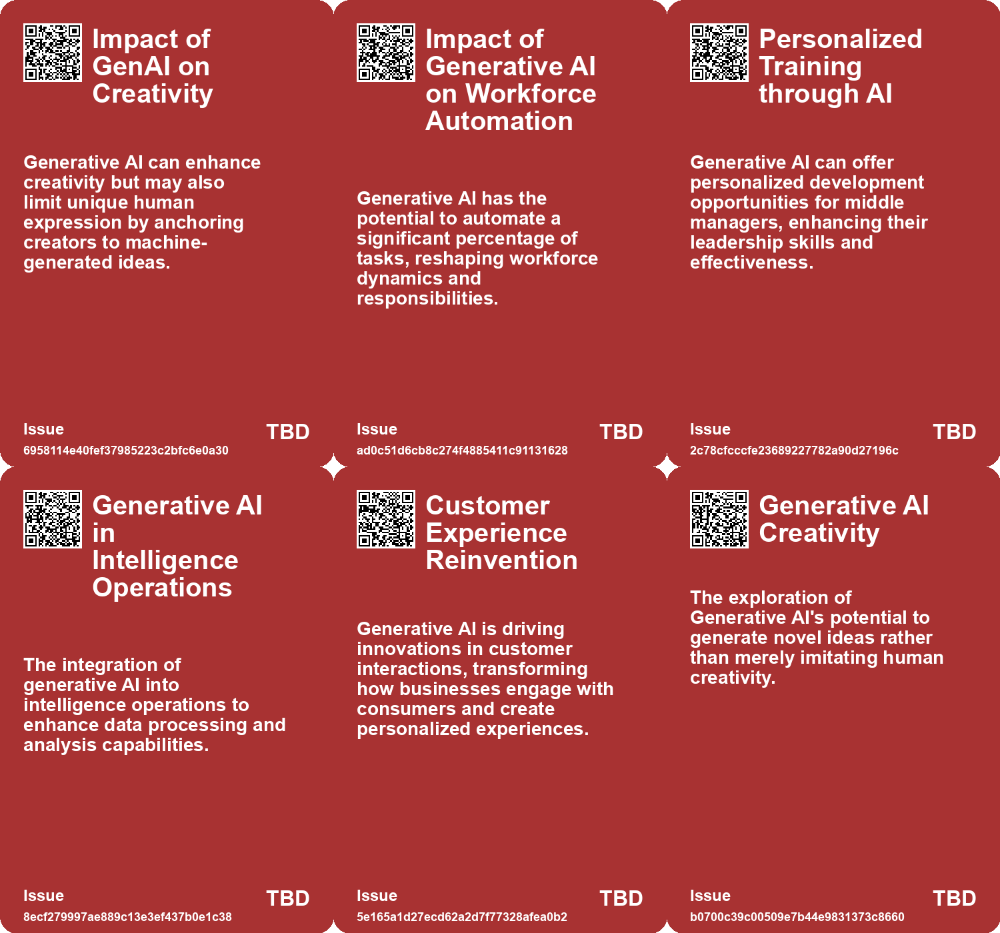
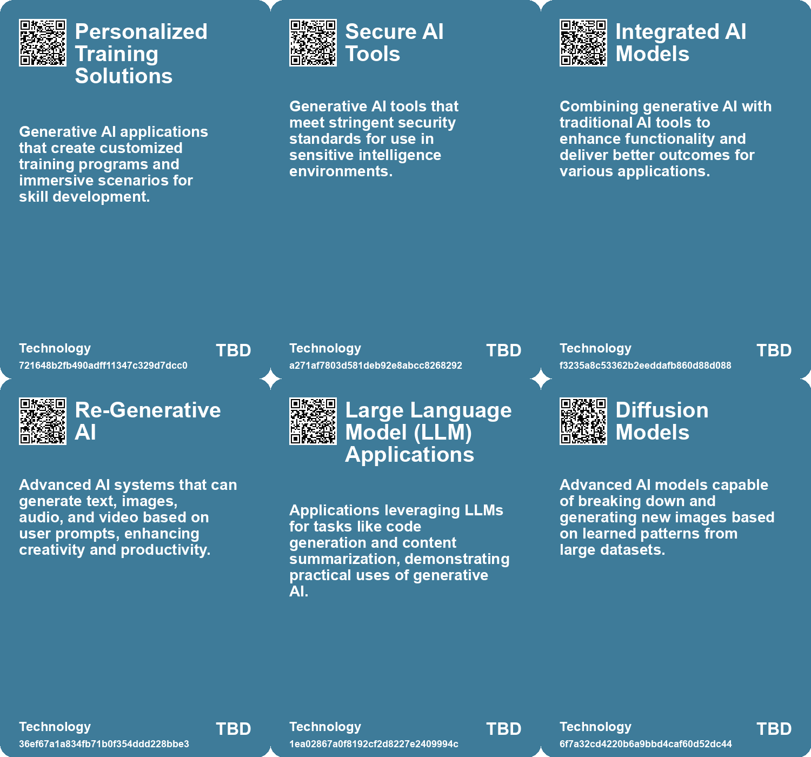

# *Topic*: Generative AI

# Summary

Generative artificial intelligence (GenAI) is reshaping creativity, productivity, and security across various sectors. Research indicates that GenAI can enhance human creativity, particularly in writing. Studies show that writers using GenAI ideas experience an increase in creativity and produce more enjoyable stories. However, there are concerns that reliance on GenAI may limit the originality of the work, as stories tend to reflect similarities to the initial AI-generated ideas.

In the business realm, GenAI is being integrated into workflows, with autonomous agents capable of executing tasks independently. These agents can significantly reduce labor costs and improve efficiency. However, companies must prepare for the transformative impact of GenAI by addressing technology architecture and workforce planning. The potential for GenAI to automate a large portion of tasks raises questions about the future of work, particularly for middle managers, who may find their roles evolving as routine tasks become automated.

The intelligence community is also exploring the use of GenAI for data analysis and content generation. While it offers valuable insights, there are significant risks associated with inaccuracies and potential security breaches. The CIA has developed a secure, air-gapped AI model to analyze classified data, highlighting the need for responsible deployment in sensitive environments.

Despite the excitement surrounding GenAI, there are economic concerns. The technology has not yet generated substantial revenue, and its limitations, such as producing false information, could lead to disillusionment. The hype surrounding GenAI may not match its practical applications, prompting calls for a more realistic approach to its integration into business and society.

The impact of GenAI extends to the creative arts, where it presents both opportunities and challenges. While it can enhance artistic processes, it also threatens traditional creative professions by potentially exploiting artists' work without consent. The need for new frameworks to protect artists' rights is becoming increasingly urgent.

In the realm of security, GenAI is being used by extremist groups to create propaganda, raising alarms about the potential for misinformation and manipulation. The use of AI-generated content by these groups complicates efforts to combat online extremism. However, there are also initiatives to leverage AI in countering these threats, demonstrating the dual-edged nature of this technology.

As GenAI continues to evolve, its influence on identity security is notable. The rise of AI-driven identity management systems is transforming how organizations protect against cyber threats. These systems are becoming essential in addressing vulnerabilities that traditional methods struggle to manage.

The future of GenAI is marked by both promise and peril. Its integration into specific domains may yield the most significant benefits, but the challenges it presents cannot be overlooked. As businesses and individuals navigate this rapidly changing landscape, the balance between innovation and caution will be crucial.

# Seeds

|    | name                                          | description                                                                                        | change                                                                                                       | 10-year                                                                                                              | driving-force                                                                                             |
|---:|:----------------------------------------------|:---------------------------------------------------------------------------------------------------|:-------------------------------------------------------------------------------------------------------------|:---------------------------------------------------------------------------------------------------------------------|:----------------------------------------------------------------------------------------------------------|
|  0 | GenAI's Role in Enhancing Creativity          | Generative AI is being used to augment human creativity, especially in creative writing.           | Transition from traditional creativity methods to AI-assisted creativity.                                    | In ten years, GenAI may be a standard tool for writers and artists, fundamentally changing creative processes.       | The demand for innovative and diverse creative output in a competitive landscape.                         |
|  1 | Generative AI's Impact on Industries          | Generative AI is transforming various industries, indicating its growing significance.             | From niche applications to widespread integration across multiple sectors.                                   | In 10 years, generative AI will be a foundational technology across all major industries.                            | The demand for innovation and efficiency in business processes and services.                              |
|  2 | GenAI's Role in Enhancing Creativity          | Generative AI is being used to augment human creativity, especially in creative writing.           | Transition from traditional creativity methods to AI-assisted creativity.                                    | In ten years, GenAI may be a standard tool for writers and artists, fundamentally changing creative processes.       | The demand for innovative and diverse creative output in a competitive landscape.                         |
|  3 | Real-time Performance Insights                | Generative AI could offer managers real-time insights into team performance and dynamics.          | From static to dynamic performance assessments, enabling timely interventions by managers.                   | Managers may rely heavily on AI for real-time data to optimize team performance and collaboration.                   | The pursuit of improved team performance and collaboration will drive the adoption of real-time insights. |
|  4 | Emergence of New Business Models              | Generative AI is enabling companies to create new services and offerings.                          | Evolving from traditional business models to innovative, AI-powered models that enhance customer engagement. | New business models will dominate the market, driven by AI capabilities and personalized customer experiences.       | The quest for competitive advantage and enhanced customer value propositions.                             |
|  5 | Niche Focus of Generative AI                  | Generative AI is expected to become more specialized rather than generalized.                      | Shift from general-purpose AI tools to domain-specific applications tailored for unique contexts.            | In ten years, generative AI may predominantly serve niche industries with tailored solutions enhancing productivity. | The need for organizations to utilize AI for specific tasks and improve efficiency drives this change.    |
|  6 | Ambivalence Towards AI                        | Generative AI evokes mixed feelings of promise and peril among creators and users.                 | Shift from excitement about AI's potential to concern over its risks and job displacement.                   | In 10 years, a more balanced perspective on AI, focusing on collaboration and ethical use, may emerge.               | Growing awareness of AI's impact on jobs and personal well-being is driving this ambivalence.             |
|  7 | Generative AI in Healthcare                   | Generative AI is poised to significantly impact healthcare by enhancing doctor productivity.       | Change from traditional healthcare delivery to AI-assisted services that increase patient access and care.   | In ten years, healthcare may be revolutionized by AI, providing broader access and more personalized care.           | The demand for efficient healthcare solutions and improved patient outcomes is pushing AI integration.    |
|  8 | AI's Role in Education                        | Generative AI could provide individualized tutoring, impacting education accessibility.            | Shift from limited access to education to personalized learning experiences facilitated by AI.               | In a decade, AI may help close educational gaps, providing quality learning to millions previously excluded.         | The need for universal access to education drives the adoption of AI as a learning tool.                  |
|  9 | Shift from knowledge-based to action-based AI | Generative AI is evolving from chatbots to agentic systems capable of executing complex workflows. | Moving from simple knowledge-based interactions to more complex, action-oriented systems.                    | In 10 years, AI agents might seamlessly handle complex tasks across industries, much like human coworkers.           | The drive for efficiency and automation in business processes is pushing this transformation forward.     |

# Concerns

|    | name                                                   | description                                                                                                                                                              |
|---:|:-------------------------------------------------------|:-------------------------------------------------------------------------------------------------------------------------------------------------------------------------|
|  0 | Ethical Implications of AI in Marketing                | The deployment of generative AI raises ethical concerns regarding intellectual property, consumer manipulation, and the authenticity of marketing communications.        |
|  1 | Misuse of generative AI                                | Generative AI has the potential to be weaponized or misused by malicious entities, leading to threats against national and global security.                              |
|  2 | Skill Gap Expansion                                    | Generative AI could widen the skill gap, as those with lower ability may struggle to adapt, leading to unemployment or underemployment among certain groups.             |
|  3 | Recruitment facilitation through personalized messages | Generative AI tools can create personalized recruitment messages for extremist groups, enhancing their reach.                                                            |
|  4 | AI Hallucination and Misinformation                    | Generative AI is prone to producing false information and ‘hallucinations’ that can mislead users and undermine trust.                                                   |
|  5 | Job Displacement for Creatives                         | Generative AI threatens the careers of creatives, particularly in fields like stock photography and copywriting, leading to industry disruptions.                        |
|  6 | Sustainability Risks                                   | The increasing reliance on generative AI tools may lead to unaddressed sustainability concerns related to resource usage, energy consumption, and environmental impacts. |
|  7 | Bias and Fairness Issues                               | Generative AI could perpetuate or exacerbate biases present in training data, posing challenges for fair and equitable outcomes.                                         |
|  8 | Data Leakage Risks                                     | Concerns regarding the potential leakage of intellectual property and sensitive data when using generative AI.                                                           |
|  9 | Impact on Human Relationships                          | Generative AI could alter the way people form relationships, potentially leading to increased loneliness or reliance on virtual companionship.                           |

# Cards

## Concerns

## Behaviors

## Issue

## Technology

# Links

* [Navigating the Dual Impact of Generative AI on Business and Society](https://futures.kghosh.me/aa811fcb765939e9ead9542accd38a5b)
* [Microsoft Unveils Air-Gapped AI Model for U.S. Intelligence Services to Enhance Data Security](https://futures.kghosh.me/4c2c25b1e6fe59720b8220e3b1a21ba4)
* [The Impact of Generative AI and Autonomous Agents on Business Value Creation and Trust Issues](https://futures.kghosh.me/15d4ec180189ca1739398f516844cefb)
* [Thriving in an AI Era: Embracing, Adapting, and Complementing Technology](https://futures.kghosh.me/23a3410059759ba4214235628d4ebd4b)
* [The Impact of Generative AI on Creative Professions and the Need for New Data Rights Frameworks](https://futures.kghosh.me/858dac884c8fe7dfa6fc0c2cf093e97f)
* [The Rising Threat of Generative AI in Extremist Propaganda and Child Exploitation](https://futures.kghosh.me/4aae935ffedd7227301fe1eb6647d69f)
* [Transforming Work: The Impact of Generative AI on Software Development and Task Allocation](https://futures.kghosh.me/edb0e0cf3a686780a6e12d15b5ba4d5c)
* [Addressing the Risks of AI Companionship: Addiction, Regulation, and Human Dignity](https://futures.kghosh.me/4611565d14a05789e2efc6fafc563f58)
* [Generative AI: Transforming Identity Security and Governance Amidst Rising Threats](https://futures.kghosh.me/06af6687242788a345b934758b3a0705)
* [Unlocking Creativity Through Rhizomatic Thinking in Generative AI](https://futures.kghosh.me/33238862b7d7aebca1575d5d5d704f5c)
* [Unlocking the Potential of Generative AI: Strategies for Business Impact](https://futures.kghosh.me/cff1a5331e2a0947c902edfd1aa39f6a)
* [Exploring Opportunities and Challenges in the Generative AI Landscape](https://futures.kghosh.me/deafb4c92084e4427bcf71f62b00ae70)
* [Transforming Work: The Impact of Generative AI on Software Development and Task Allocation](https://futures.kghosh.me/e1e6faa41ee9a3845a0530464bd12e90)
* [The Future of Generative AI: From Tools to Intelligent Agents Transforming Business Workflows](https://futures.kghosh.me/e1baf6b4cdd1160dd2264fe6fd2e24ab)
* [Coca-Cola's Pioneering Journey with Generative AI in Marketing Campaigns](https://futures.kghosh.me/3d916d077334a1ce71d60e0186891709)
* [The Niche Future of Generative AI: Beyond Generalized Chatbots](https://futures.kghosh.me/8dd10f0dc4f44fa3a381c7f37fbcb8fc)
* [The Current Landscape of Generative AI Adoption in Businesses and Its Challenges](https://futures.kghosh.me/767b74c90576473294b2c47568c0e355)
* [Generative AI in 2023: Hype, Setbacks, and Future Challenges Ahead in 2024](https://futures.kghosh.me/cab076719e173aa2eee9c4773a4559cd)
* [Navigating the Challenges and Opportunities of Generative AI in Business](https://futures.kghosh.me/6a8633d1148eb442435b9f6bca735ad3)
* [The Impact of Generative AI on Human Creativity in Story Writing](https://futures.kghosh.me/e2006a4269f097491cc98583df08a47d)
* [The Uncertain Future of Generative AI: Hype vs. Reality and Its Implications](https://futures.kghosh.me/f35afe43c2e3b465b8ed4b00023cb0ac)
* [U.S. Intelligence Community's Integration of Generative AI for Enhanced Operations](https://futures.kghosh.me/dc6864119c8835a3637517b2a4fe9fbb)
* [The Impact of Generative AI on Human Creativity in Story Writing](https://futures.kghosh.me/de55bd2afb2b9bfadae84d2a0fb8b4e8)
* [The Transformative Impact of Generative AI on Middle Management and Work Efficiency](https://futures.kghosh.me/4427e1d7ce3ce8d0a6f40cb808f69b6a)