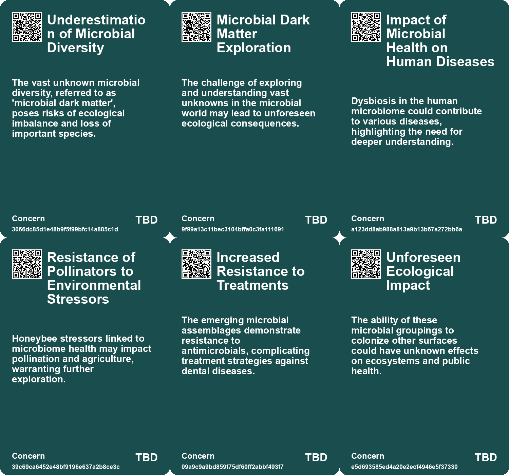
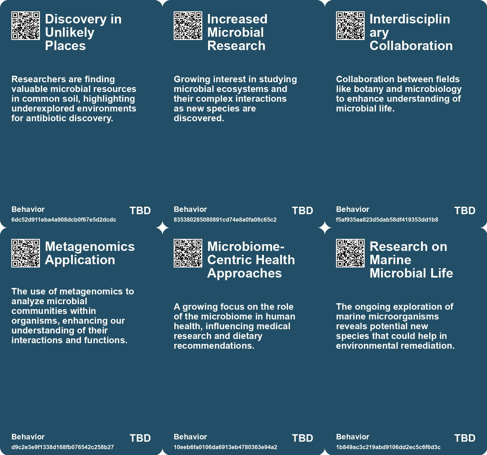
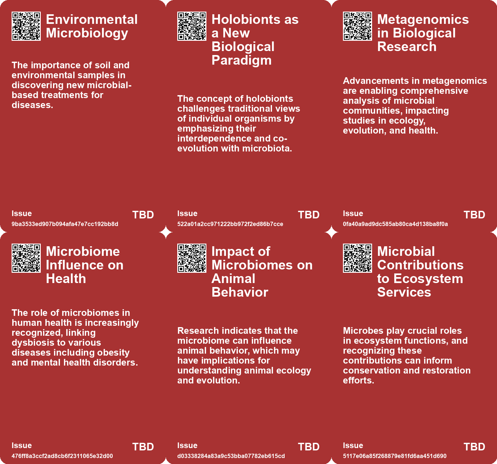
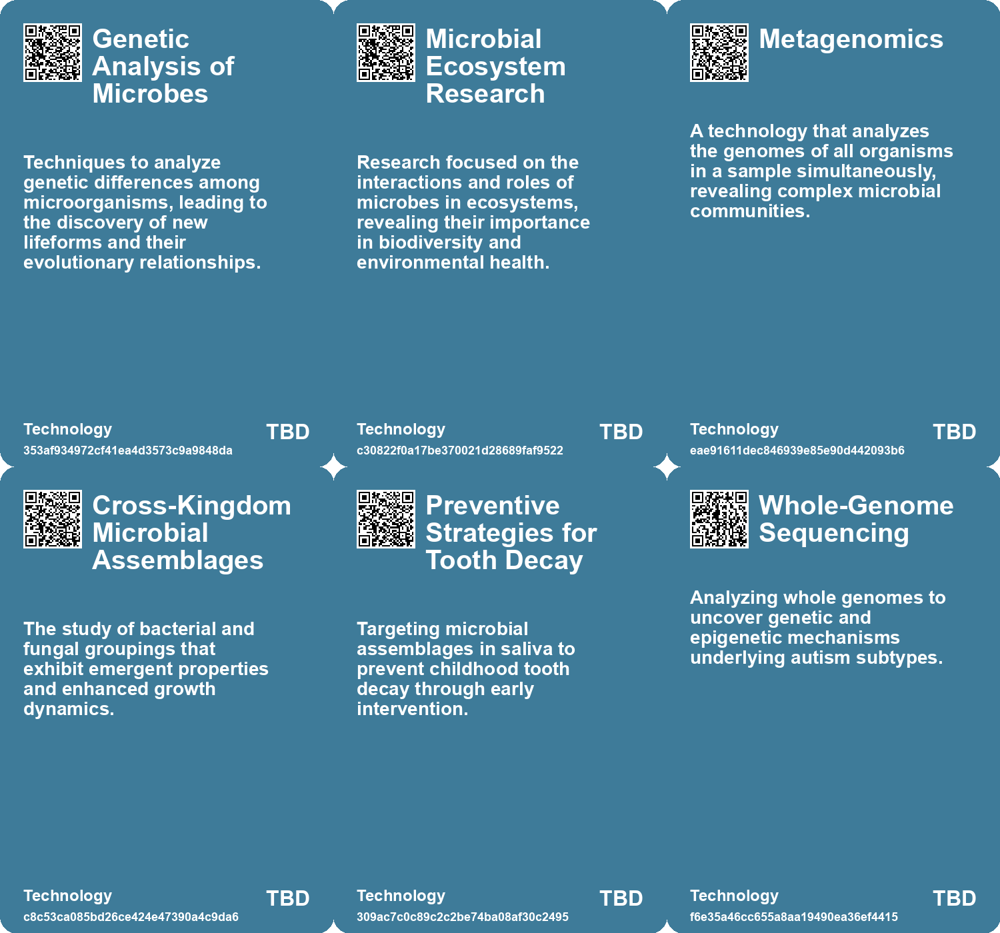

# *Topic*: Genetic Microbiome Studies

# Summary

Recent advancements in microbial research reveal the complex relationships between microorganisms and their environments, highlighting their potential applications in health, ecology, and technology. A study from the University of Pennsylvania School of Dental Medicine uncovered a partnership between bacteria and fungi in the saliva of toddlers with severe tooth decay, forming a resilient "superorganism." This finding could lead to new strategies for preventing childhood dental issues.

In the realm of space exploration, researchers are exploring microbial mining techniques inspired by cyanobacteria in extreme environments like Chile's Atacama Desert. This approach could enable the colonization of the Moon and Mars by utilizing microorganisms to extract valuable minerals and produce materials in harsh conditions.

The search for new antibiotics continues as scientists have identified a novel molecule from soil samples that effectively targets a range of harmful bacteria, including those resistant to existing treatments. This discovery underscores the urgent need for new antibacterial therapies amid rising antibiotic resistance, which claimed approximately 1.1 million lives in 2021.

The concept of "holobionts" is gaining traction, emphasizing the interconnectedness of organisms and their microbiomes. This paradigm shift suggests that understanding these relationships is crucial for advancements in medicine, agriculture, and ecology. Researchers are investigating the genetic relationships within holobionts to better comprehend their impact on health and the environment.

In a significant finding, a link between the bacteria Fusobacterium and endometriosis was established, suggesting that the microbiome may influence this painful condition. Antibiotic treatment in mice showed promise in reducing endometriotic lesions, indicating a potential avenue for future therapies.

Artificial intelligence is making strides in synthetic biology, with AI models successfully creating tiny genomes for viruses that can target E. coli. This innovation could pave the way for new phage therapies to combat antibiotic-resistant infections, although further testing is necessary to ensure safety.

The discovery of a new class of virus-like entities, termed Obelisks, adds to our understanding of the human microbiome. These unique RNA molecules may represent a transitional form between simple genetic materials and complex viruses, prompting further investigation into their role in microbial ecosystems.

Research into glacier ecology reveals the critical role of microbial activity in carbon cycling and the impact of climate change on these ecosystems. As glaciers retreat, understanding the biodiversity within them becomes increasingly important for addressing broader climate issues.

The emergence of a new strain of E. coli, engineered to function with fewer codons, opens new avenues for exploring genetic efficiency and alternative genetic codes. This research challenges existing notions of life's complexity and adaptability.

In the cheese industry, the decline of genetic diversity among key fungal strains poses a threat to traditional blue cheese production. A previously unknown population of Penicillium roqueforti offers hope for revitalizing the industry by reintroducing genetic diversity.

The potential of fungi in bioremediation is highlighted by a nature-based technique developed to restore brownfield sites. This method utilizes fungi and native plants to break down toxins, offering a sustainable solution to pollution in marginalized communities.

The WHO's Global Antibiotic Resistance Surveillance Report emphasizes the growing threat of antimicrobial resistance, calling for enhanced national surveillance systems to inform public health strategies. This report underscores the urgency of addressing antibiotic resistance on a global scale.

Profluent, a biotech company, has harnessed AI to design novel antimicrobial proteins that show promise in laboratory settings. This innovative approach could lead to new treatments for bacterial infections, showcasing the intersection of AI and biotechnology.

Recent discoveries in glacier ecosystems and the ancient fungus Prototaxites reveal the intricate relationships between microbes and their environments. Understanding these dynamics is essential for addressing the challenges posed by climate change and preserving biodiversity.

# Seeds

|    | name                                      | description                                                                               | change                                                                                                  | 10-year                                                                                                      | driving-force                                                                                        |
|---:|:------------------------------------------|:------------------------------------------------------------------------------------------|:--------------------------------------------------------------------------------------------------------|:-------------------------------------------------------------------------------------------------------------|:-----------------------------------------------------------------------------------------------------|
|  0 | Resilience of Soil Microorganisms         | Microbes in soil contain potential antibiotic properties previously unknown.              | From underestimating soil microbiota to recognizing them as significant sources of medicinal compounds. | New drug discoveries from natural sources, enhancing biopharmaceutical development.                          | Growing evidence of the untapped ecological potential for medical applications.                      |
|  1 | Metagenomics Technology                   | The use of metagenomics to analyze diverse biological samples is revolutionizing biology. | From limited microbial knowledge to comprehensive insights into complex biological systems.             | In 10 years, metagenomics may enable personalized medicine and agriculture through microbiome understanding. | Technological progress and the need for better ecological and health solutions.                      |
|  2 | Microbiome's Role in Health               | The understanding that the microbiome significantly affects human health and disease.     | From isolated medical treatments to considering microbiomes in health strategies.                       | In 10 years, healthcare may routinely integrate microbiome analysis in diagnostics and treatment.            | Rising chronic diseases and a shift towards preventive healthcare.                                   |
|  3 | Real-time Microscopy Advancements         | New microscopy techniques allow for observation of live microbial behavior.               | Transition from static imaging to dynamic, real-time observation of microbial interactions.             | In a decade, real-time imaging could revolutionize our understanding of microbial ecology and interactions.  | Advancements in imaging technology and the need to understand complex biological processes.          |
|  4 | Preventive Strategies Against Tooth Decay | Targeting microbial assemblages could prevent early childhood tooth decay.                | Shift from reactive dental treatments to proactive prevention based on microbial behaviors.             | Preventive dental care might prioritize disrupting harmful microbial assemblages before they cause decay.    | Increased awareness of childhood dental health and the need for innovative prevention methods.       |
|  5 | Exploration of Mutualism Evolution        | Study of microbial partnerships could reveal insights into the evolution of cooperation.  | From viewing microbes as solitary to recognizing their cooperative interactions and benefits.           | Understanding microbial mutualism may lead to advances in biotechnology and ecosystem management.            | Curiosity about evolutionary processes and their implications for biology and medicine.              |
|  6 | Personalized Medicine                     | Growing knowledge of genomes allows for more personalized healthcare solutions.           | Transition from one-size-fits-all medicine to tailored health treatments based on individual genetics.  | In a decade, personalized medicine could significantly improve treatment efficacy and patient outcomes.      | Advancements in genomics and biotechnology enable customized healthcare approaches.                  |
|  7 | Discovery of Obelisks                     | New class of virus-like entities discovered within human microbiomes.                     | Shift from understanding viruses to exploring a new class of genetic entities.                          | Potentially revolutionizing our understanding of microbial interactions and genetics within human health.    | Advancements in genetic sequencing technologies enabling discovery of previously unnoticed entities. |
|  8 | Role of Microbes in Health                | Exploration of the role of newly discovered entities within human microbiomes.            | From viewing microbes as pathogens to recognizing them as complex entities influencing health.          | Potential for new health treatments based on microbiome manipulation.                                        | Growing awareness of the microbiome's impact on human health and disease.                            |
|  9 | Microbiome's Role in Endometriosis        | Growing evidence suggests a link between the microbiome and endometriosis.                | Shifting focus from genetic understanding to microbial influences in endometriosis.                     | Potential new therapies targeting microbiome modulation for treating endometriosis.                          | Increased awareness of the microbiome's impact on various health conditions.                         |

# Concerns

|    | name                                                 | description                                                                                                                                                 |
|---:|:-----------------------------------------------------|:------------------------------------------------------------------------------------------------------------------------------------------------------------|
|  0 | Underestimation of Microbial Diversity               | The vast unknown microbial diversity, referred to as 'microbial dark matter', poses risks of ecological imbalance and loss of important species.            |
|  1 | Microbial Dark Matter Exploration                    | The challenge of exploring and understanding vast unknowns in the microbial world may lead to unforeseen ecological consequences.                           |
|  2 | Impact of Microbial Health on Human Diseases         | Dysbiosis in the human microbiome could contribute to various diseases, highlighting the need for deeper understanding.                                     |
|  3 | Resistance of Pollinators to Environmental Stressors | Honeybee stressors linked to microbiome health may impact pollination and agriculture, warranting further exploration.                                      |
|  4 | Increased Resistance to Treatments                   | The emerging microbial assemblages demonstrate resistance to antimicrobials, complicating treatment strategies against dental diseases.                     |
|  5 | Unforeseen Ecological Impact                         | The ability of these microbial groupings to colonize other surfaces could have unknown effects on ecosystems and public health.                             |
|  6 | Potential for Environmental Contamination            | Similar microbial assemblages in other environments could enhance infectious diseases or cause ecological disruptions.                                      |
|  7 | Climate Change Implications of Soil Microbiology     | The study's findings link microbial processes to CO2 emissions, highlighting potential effects on global climate change.                                    |
|  8 | Impact on Microbiome Functionality                   | The presence of Obelisks in human microbiomes may alter microbial functionality, which could have broader implications for health and disease.              |
|  9 | Potential Misunderstanding of Disease Mechanisms     | The complex interactions between microbiomes and endometriosis necessitate deeper understanding to avoid misdiagnosis and ineffective treatment strategies. |

# Cards

## Concerns

## Behaviors

## Issue

## Technology

# Links

* [Discovery of a Microbial Superorganism Reveals New Insights into Tooth Decay and Microbial Interactions](https://futures.kghosh.me/2af3e931e394e21223d8e983e2dd43b7)
* [Microbes as Active Engineers in Earth's Critical Zone and Their Role in Soil Formation](https://futures.kghosh.me/8a76baaa6df38b98c48c0635d103a5a0)
* [The Risks and Ethical Considerations of Research on Mirror Bacteria in Synthetic Biology](https://futures.kghosh.me/e2cc8f6f19604a6a1553d9a871ad03a1)
* [Exploring the Interconnections of Glaciers, Microbial Life, and Climate Change](https://futures.kghosh.me/4b6734ef8815047f0eb71a170c13af9d)
* [Study Reveals Four Distinct Subgroups of Autism Based on Genetic Variants](https://futures.kghosh.me/8223fe537c137ca8ad5a141ff30c46fc)
* [AI Successfully Designs Working Genomes for Viruses to Combat Antibiotic-Resistant Bacteria](https://futures.kghosh.me/3d592e06f3ba6280f84cb18be989f1fa)
* [Discovery of Plastic-Eating Fungus Offers Hope but Not a Solution to Ocean Pollution](https://futures.kghosh.me/bc70fd3103590c44b95f146323f8c0d9)
* [Study Highlights Variability in Ecological Data Analysis Among Biologists](https://futures.kghosh.me/6ca0eb61f6679e513cde2fa1b3637de7)
* [Termignon Blue Cheese: A Potential Lifeline for the Blue Cheese Industry and Beyond](https://futures.kghosh.me/159da51824bd2447c69245e7e92205e6)
* [New Insights into the Feeding Habits of the Giant Fungus Prototaxites from 400 Million Years Ago](https://futures.kghosh.me/efaa22c5d9c4de47968141f83774d19a)
* [Overview of the WHO Global Antibiotic Resistance Surveillance Report 2025: Key Findings and Recommendations](https://futures.kghosh.me/fcc27565caf28be920757fa8c883ae03)
* [Scientists Create Syn57: A Revolutionary Strain of E. coli with Fewer Codons](https://futures.kghosh.me/baa851a48441903a61269df057166abd)
* [Innovative Fungal Solutions for Restoring Contaminated Brownfields in the U.S.](https://futures.kghosh.me/666f5297ceb142394ebf30d39f1d9bc3)
* [Exploring the Bio Revolution: Opportunities, Risks, and Future Implications](https://futures.kghosh.me/62a5bae52266a680c6a13bd3ef8dc48c)
* [Nibblerids: Newly Discovered Micro-Predators Revealing a New Branch of Life](https://futures.kghosh.me/279ad1b21581f6a15ca206621c443c6d)
* [Yale Team Discovers Protein Nanowires in Bacteria That May Help Fight Climate Change](https://futures.kghosh.me/b9bff2b9003a2ceb046c598703e0c939)
* [Exploring the Evolution of Music Through Digital Experimentation](https://futures.kghosh.me/6fcf93f676767f11743d7d42d09ae8e8)
* [Discovery of New Class of Virus-like Entities in Human Microbiomes: The Obelisks](https://futures.kghosh.me/c0a6671804e9b07281f0c3030d72b5f1)
* [Urgent Call to Ban Research on Potentially Dangerous Mirror Cells by Biologists](https://futures.kghosh.me/ebc9a424cf40d54bf27fe0287b648be3)
* [Breakthrough Discovery of New Antibiotic Molecule from Soil Samples](https://futures.kghosh.me/fa6115ae1686f345d64fa1c0c3dfafd5)
* [AI-Powered Profluent Develops Bacteria-Killing Proteins with Novel Designs](https://futures.kghosh.me/851488841bb139d3ed24048269cd0b9b)
* [Link Between Fusobacterium Bacteria and Endometriosis: Promising New Research Findings](https://futures.kghosh.me/6df4f7525be593be2a48f96ee7e49dd2)
* [AI-Driven Gene Editing: Introducing OpenCRISPR-1 for Enhanced Precision in Human Genomes](https://futures.kghosh.me/fb983ad12b687b393f0bdc2a54ef0c03)
* [Microbial Mining: A Sustainable Approach for Colonizing the Moon and Mars](https://futures.kghosh.me/a67f9e7de0ac3ab7399e7e056c0f8883)
* [Understanding Holobionts: A New Perspective on Organisms and Their Microbial Partners](https://futures.kghosh.me/99e803820e0c09fbc3163a5a26ff49bb)
* [Innovative Scientific Breakthroughs in Health and Sustainability: From Mini-Brains to Microplastics](https://futures.kghosh.me/893f7fa4d1fb919258d3e90b77babab5)