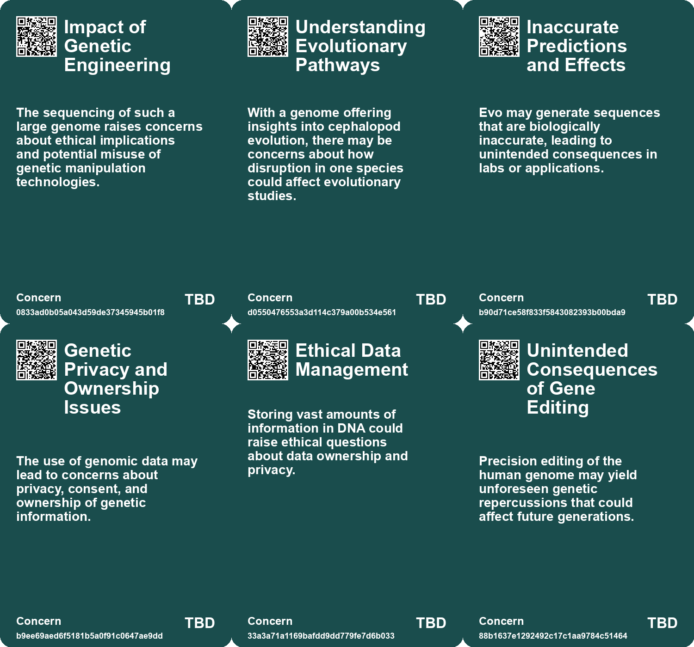
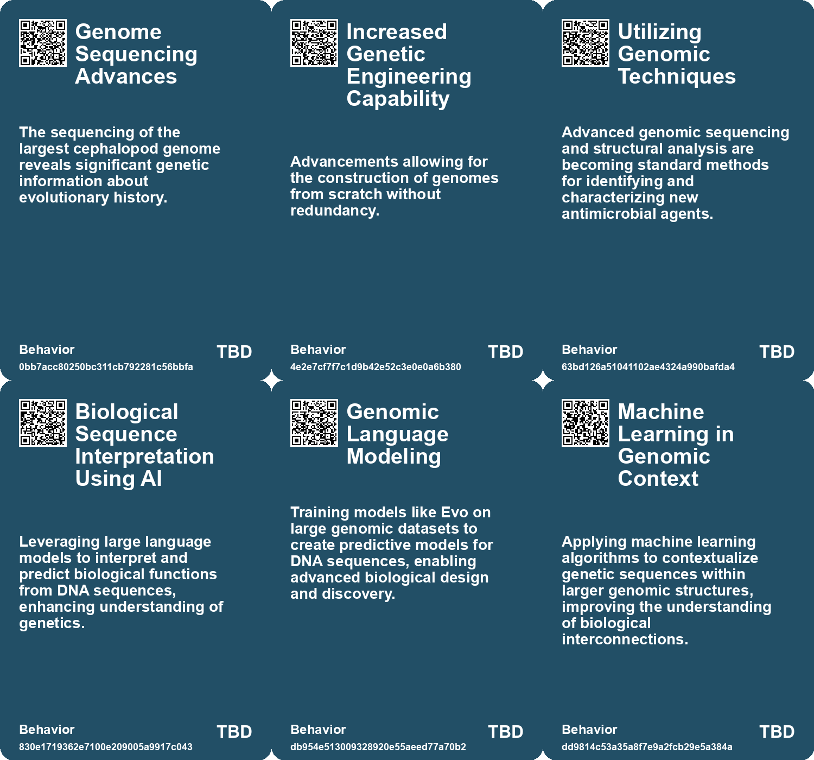
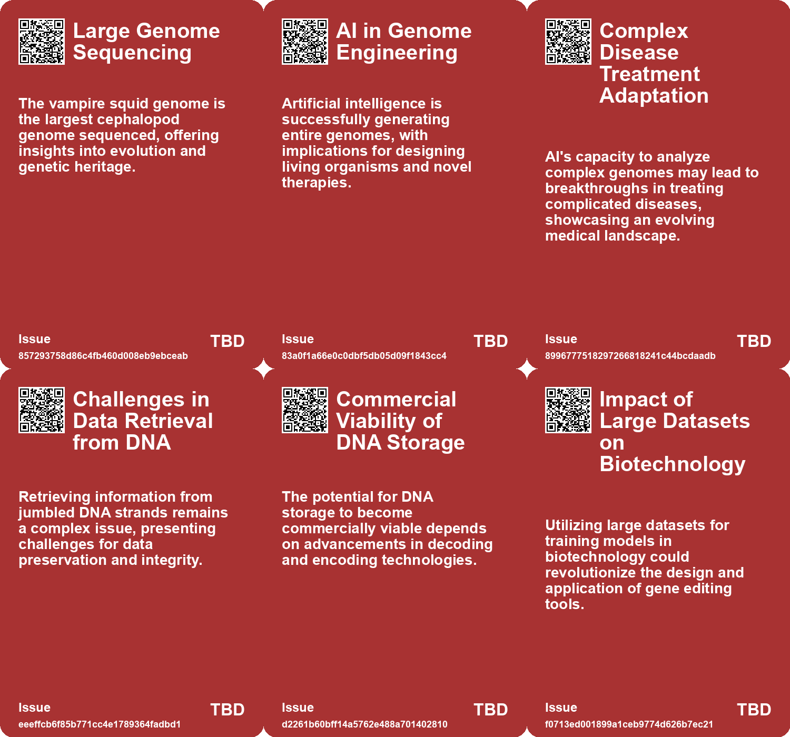
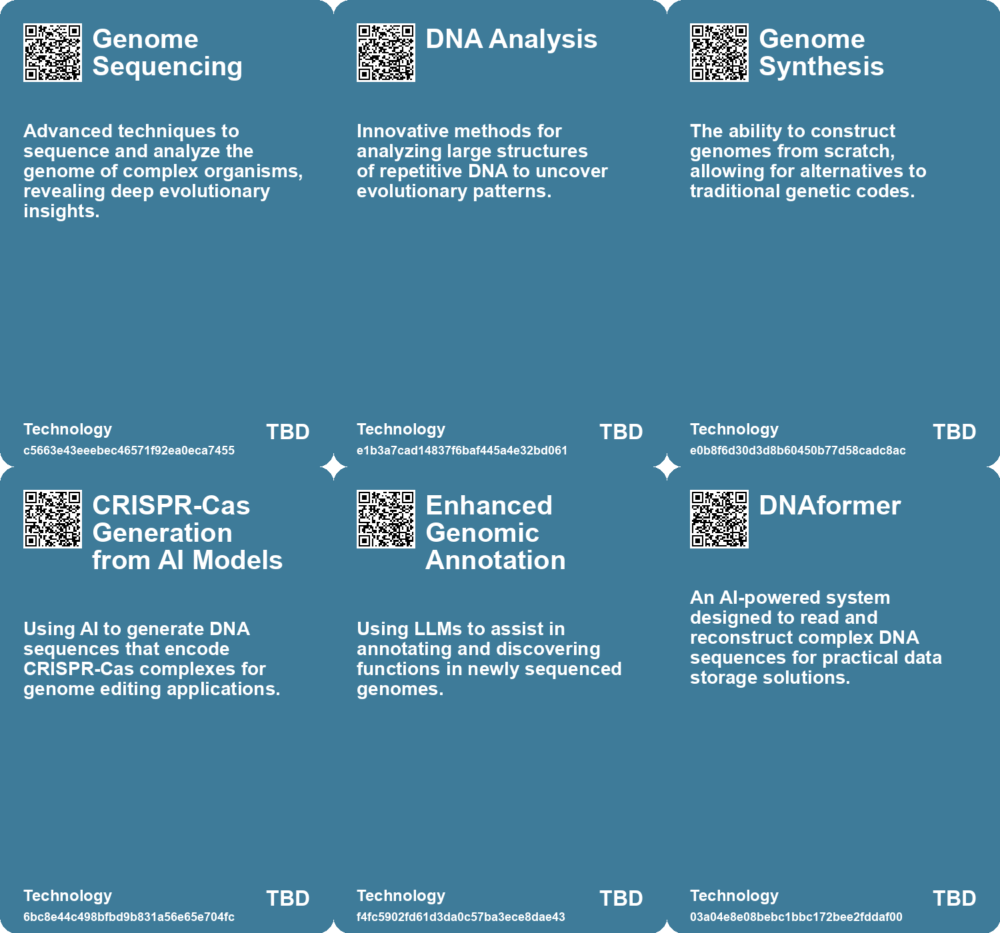

# *Topic*: Genome Sequencing

# Summary

Recent advancements in genetic research and artificial intelligence are reshaping our understanding of biology and its applications. Gene editing technologies, particularly CRISPR, have shown promise in various fields, including agriculture and human health. However, challenges remain when applying these technologies in complex environments like human cells. Researchers have developed OpenCRISPR-1, an AI-designed gene editor that demonstrates improved precision and compatibility with existing editing techniques. This innovation is now available for ethical use in research and commercial applications.

In parallel, the development of Evo, a genomic large language model, aims to decode DNA sequences more effectively. Inspired by natural language processing, Evo can predict mutation effects and generate new DNA sequences, although it currently focuses on simpler organisms. This tool represents a significant step in biological design and understanding.

The exploration of genetic material extends to the vampire squid, which has revealed the largest cephalopod genome ever sequenced. This genome offers insights into the evolutionary history of cephalopods and could enhance our understanding of related species. Similarly, researchers have utilized AI to create tiny working genomes for bacteriophages that target antibiotic-resistant E. coli, marking a potential breakthrough in phage therapy.

Synthetic biology continues to push boundaries, as demonstrated by the engineering of a highly efficient strain of E. coli that operates with fewer codons than any known life form. This research opens new avenues for understanding genetic efficiency and the limits of life. Additionally, advancements in DNA data reading have been achieved, with AI enabling rapid decoding of DNA sequences, significantly improving data storage and retrieval methods.

The ethical implications of genetic research are increasingly scrutinized. Concerns about genetic discrimination are rising, as insurance companies may deny coverage based on genetic predispositions. The potential misuse of genetic data highlights the need for stronger privacy protections. Meanwhile, the convergence of biological science and AI is driving a Bio Revolution, promising transformative impacts across various sectors while also posing risks that require careful management.

Innovations in data storage technology have emerged, with researchers developing indestructible 5D memory crystals capable of preserving the entire human genome for billions of years. This advancement could play a crucial role in safeguarding genetic information for future applications. 

The exploration of new antibiotic molecules from soil samples underscores the ongoing battle against antibiotic resistance. These discoveries highlight the importance of natural resources in developing effective treatments. 

As the landscape of genetic research evolves, the implications for health, agriculture, and ethics continue to unfold. The intersection of technology and biology presents both opportunities and challenges that society must navigate carefully.

# Seeds

|    | name                                  | description                                                                                       | change                                                                                                   | 10-year                                                                                                 | driving-force                                                                                          |
|---:|:--------------------------------------|:--------------------------------------------------------------------------------------------------|:---------------------------------------------------------------------------------------------------------|:--------------------------------------------------------------------------------------------------------|:-------------------------------------------------------------------------------------------------------|
|  0 | Vampire Squid Genome Discovery        | The sequencing of the vampire squid genome reveals deep evolutionary insights.                    | Shifting from conventional understanding of cephalopod evolution to a focus on genetic heritage.         | Potential new era in understanding cephalopod evolution, leading to discovery of new species.           | Advancements in genomic sequencing technology enabling detailed studies of previously elusive species. |
|  1 | Metagenomic Techniques on Bycatch     | DNA sequencing of bycatch specimens, like the vampire squid, provides new research opportunities. | Transitioning from selective species sampling to utilizing bycatch for broader genomic studies.          | Increased biodiversity understanding through analysis of previously neglected specimens in research.    | Emerging methodologies in metagenomics and a shift toward ecological study integration.                |
|  2 | Synthetic Biology Breakthroughs       | Recent advancements enable complete synthesis of genomes with tailored characteristics.           | Transitioning from replicating natural forms to creating entirely novel life forms chemically.           | In 10 years, synthetic organisms might become integral to industries like healthcare and biotechnology. | The push for innovative solutions to complex biological challenges.                                    |
|  3 | Importance of Genetic Screening       | Genome sequencing and structural analysis were crucial in discovering the new antibiotic.         | Transition from simple microbial isolation methods to advanced genomic techniques in drug discovery.     | More rapid identification of novel drugs from microbial sources using genomic technologies.             | Advancements in genomic and sequencing technologies enhancing research capabilities.                   |
|  4 | Exploration of Synthetic Biology      | Creating new, viable DNA sequences that can function in organisms.                                | from relying solely on natural selection to engineered biological solutions.                             | Synthetic biology could revolutionize medicine, agriculture, and environmental management.              | The potential to engineer beneficial biological systems for various applications.                      |
|  5 | AI-Powered DNA Decoding               | Utilization of AI to decode jumbled DNA sequences swiftly and accurately.                         | Transition from traditional error-prone decoding methods to AI-driven accurate ones.                     | AI may enable the routine use of DNA for reliable long-term data storage and recovery.                  | The integration of AI technology in various fields is fueling advancements in DNA data decoding.       |
|  6 | AI in Gene Editing                    | Utilizing AI to design programmable gene editors for precision genome editing.                    | Shift from traditional CRISPR methods to AI-designed genomic tools for efficiency and specificity.       | In ten years, gene editing may be predominantly driven by AI, enhancing precision and reducing errors.  | The need for more efficient and precise gene editing technologies in various fields.                   |
|  7 | 5D Memory Crystal for Genomic Storage | A breakthrough in storing human and species genomes with unprecedented durability.                | Shifting from traditional data storage methods to a long-lasting, stable medium for genomic information. | In a decade, we may have extensive genomic databases for species preservation and revival.              | Advancements in synthetic biology and the need for long-term data preservation.                        |
|  8 | Synthetic Biology Advancements        | Recent breakthroughs in synthetic biology pave the way for genomic applications.                  | From theoretical possibilities to practical applications in creating living organisms.                   | We may see new organisms created synthetically using stored genomic data.                               | The pursuit of creating sustainable solutions in agriculture and ecosystem restoration.                |
|  9 | Personalized Medicine                 | Growing knowledge of genomes allows for more personalized healthcare solutions.                   | Transition from one-size-fits-all medicine to tailored health treatments based on individual genetics.   | In a decade, personalized medicine could significantly improve treatment efficacy and patient outcomes. | Advancements in genomics and biotechnology enable customized healthcare approaches.                    |

# Concerns

|    | name                                                    | description                                                                                                                                             |
|---:|:--------------------------------------------------------|:--------------------------------------------------------------------------------------------------------------------------------------------------------|
|  0 | Impact of Genetic Engineering                           | The sequencing of such a large genome raises concerns about ethical implications and potential misuse of genetic manipulation technologies.             |
|  1 | Understanding Evolutionary Pathways                     | With a genome offering insights into cephalopod evolution, there may be concerns about how disruption in one species could affect evolutionary studies. |
|  2 | Inaccurate Predictions and Effects                      | Evo may generate sequences that are biologically inaccurate, leading to unintended consequences in labs or applications.                                |
|  3 | Genetic Privacy and Ownership Issues                    | The use of genomic data may lead to concerns about privacy, consent, and ownership of genetic information.                                              |
|  4 | Ethical Data Management                                 | Storing vast amounts of information in DNA could raise ethical questions about data ownership and privacy.                                              |
|  5 | Unintended Consequences of Gene Editing                 | Precision editing of the human genome may yield unforeseen genetic repercussions that could affect future generations.                                  |
|  6 | Data Misinterpretation                                  | Future intelligences accessing genomic data may misinterpret or misuse it, leading to unintended consequences or ethical violations.                    |
|  7 | Survival of Data                                        | The long-term survival of data poses a concern if future intelligences lack the capability to understand or utilize the genomic information.            |
|  8 | Data Gaps in Cell Biology Research                      | Lack of comprehensive genomic and kinetic data hampers the understanding and advancement of cellular modeling.                                          |
|  9 | Evolving Threats from AI with Nucleic Acid Technologies | Advancements in AI-driven nucleic acid technologies may lead to new biological risks that require ongoing vigilance and regulation.                     |

# Cards

## Concerns

## Behaviors

## Issue

## Technology

# Links

* [The Los Angeles Project: Genetic Engineering for Exotic Pets and Ethical Dilemmas](https://futures.kghosh.me/a14802d50bd16235be4acda9fec4b168)
* [Scientists Create Syn57: A Revolutionary Strain of E. coli with Fewer Codons](https://futures.kghosh.me/baa851a48441903a61269df057166abd)
* [How African Farmers Are Leveraging Satellite Data to Enhance Crop Yields and Combat Climate Change](https://futures.kghosh.me/3c4f4b0832ff414899cf292220127e16)
* [How Google's AI Co-Scientist Enhanced Understanding of Bacteriophages and PICIs](https://futures.kghosh.me/a9a2a536524123cc7d448a6c9aa546fb)
* [The Troubling Future of 23andMe and Customer Genetic Data Privacy](https://futures.kghosh.me/c0420b6b9397d9b1d827755ca35b91ec)
* [Tom Ray's Journey from Evolutionary Biology to Artificial Life Creation](https://futures.kghosh.me/d569dcc750762a88b0b75c3ee925c4d4)
* [Breakthrough Discovery of New Antibiotic Molecule from Soil Samples](https://futures.kghosh.me/fa6115ae1686f345d64fa1c0c3dfafd5)
* [AI-Driven Gene Editing: Introducing OpenCRISPR-1 for Enhanced Precision in Human Genomes](https://futures.kghosh.me/fb983ad12b687b393f0bdc2a54ef0c03)
* [AI Revolutionizes DNA Data Retrieval, Making Storage Practical for Computing](https://futures.kghosh.me/45e4b4d018bb53e590026f7650a46e04)
* [Urgent Call to Ban Research on Potentially Dangerous Mirror Cells by Biologists](https://futures.kghosh.me/ebc9a424cf40d54bf27fe0287b648be3)
* [Simulating a Minimal Cell: Insights from TypeScript and Cell Biology](https://futures.kghosh.me/c95c67faf6b15cb5595e1d7caa1b8e48)
* [Exploring Sweat Samples for Breast Cancer Screening Using Gas Chromatography-Mass Spectrometry](https://futures.kghosh.me/0c92eaabe3945e7b15eea4b98e970a96)
* [Uncovering the Genetic Secrets of the Vampire Squid and Cephalopod Evolution](https://futures.kghosh.me/72860f7792ccad5ac45bedb026008103)
* [Understanding Genetic Discrimination: The Legal Risks of Genetic Testing and Insurance Denials](https://futures.kghosh.me/da334348e9ff0da68d996316deb0f20e)
* [AI Successfully Designs Working Genomes for Viruses to Combat Antibiotic-Resistant Bacteria](https://futures.kghosh.me/3d592e06f3ba6280f84cb18be989f1fa)
* [Discovery of New Class of Virus-like Entities in Human Microbiomes: The Obelisks](https://futures.kghosh.me/c0a6671804e9b07281f0c3030d72b5f1)
* [The Risks and Ethical Considerations of Research on Mirror Bacteria in Synthetic Biology](https://futures.kghosh.me/e2cc8f6f19604a6a1553d9a871ad03a1)
* [Evo: The Large Language Model Revolutionizing DNA Reading and Writing](https://futures.kghosh.me/45d34ce40d5974664e5ea44a7d14f104)
* [A Comprehensive Taxonomy for Artificial General Intelligence Development Over 25 Years](https://futures.kghosh.me/848ae6771411e76eb554d6d4d2c8f07f)
* [Navigating the Challenges and Opportunities of Generative AI in Business](https://futures.kghosh.me/6a8633d1148eb442435b9f6bca735ad3)
* [Unlocking the Business Potential of Generative AI: Insights from C-Suite Executives](https://futures.kghosh.me/7aa756b506cb8ac4c5031d9699509681)
* [The Challenges and Advances in Simulating the C. elegans Brain Over 25 Years](https://futures.kghosh.me/32e91a01ba181534d1578186bfcc240a)
* [Exploring the Bio Revolution: Opportunities, Risks, and Future Implications](https://futures.kghosh.me/62a5bae52266a680c6a13bd3ef8dc48c)
* [Breakthrough in Genetic Preservation: Human Genome Stored on 5D Memory Crystal](https://futures.kghosh.me/95c3193946ea889c35e9737579133194)
* [Recent Developments in AI Regulation and Technology: A Review of Key Initiatives and Critiques](https://futures.kghosh.me/a009ccdffaa59f53de56887aa19e6239)