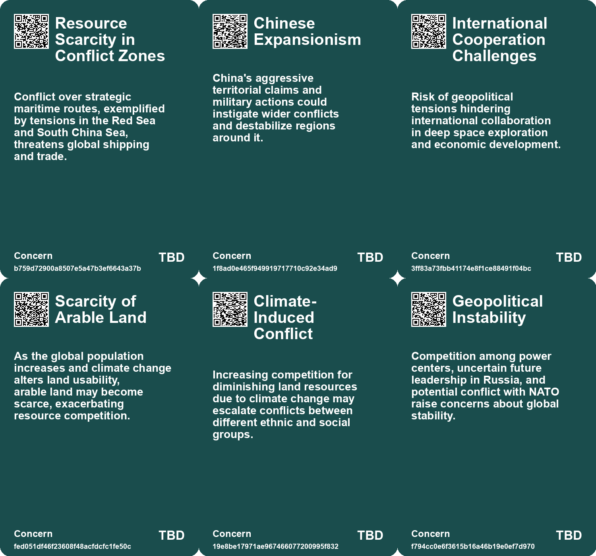
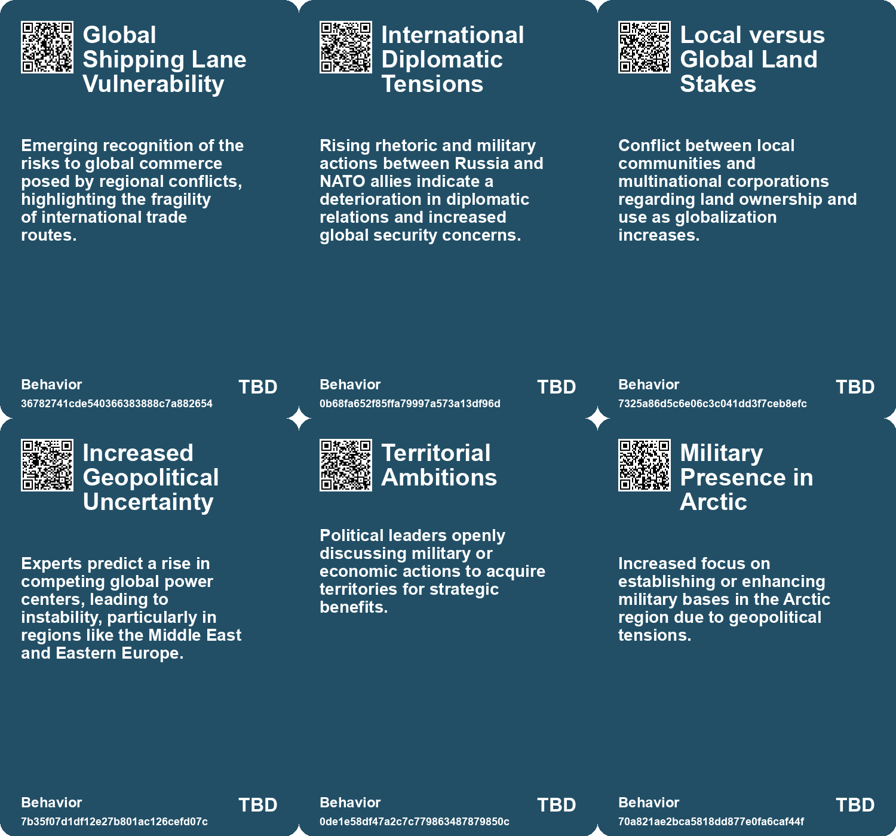
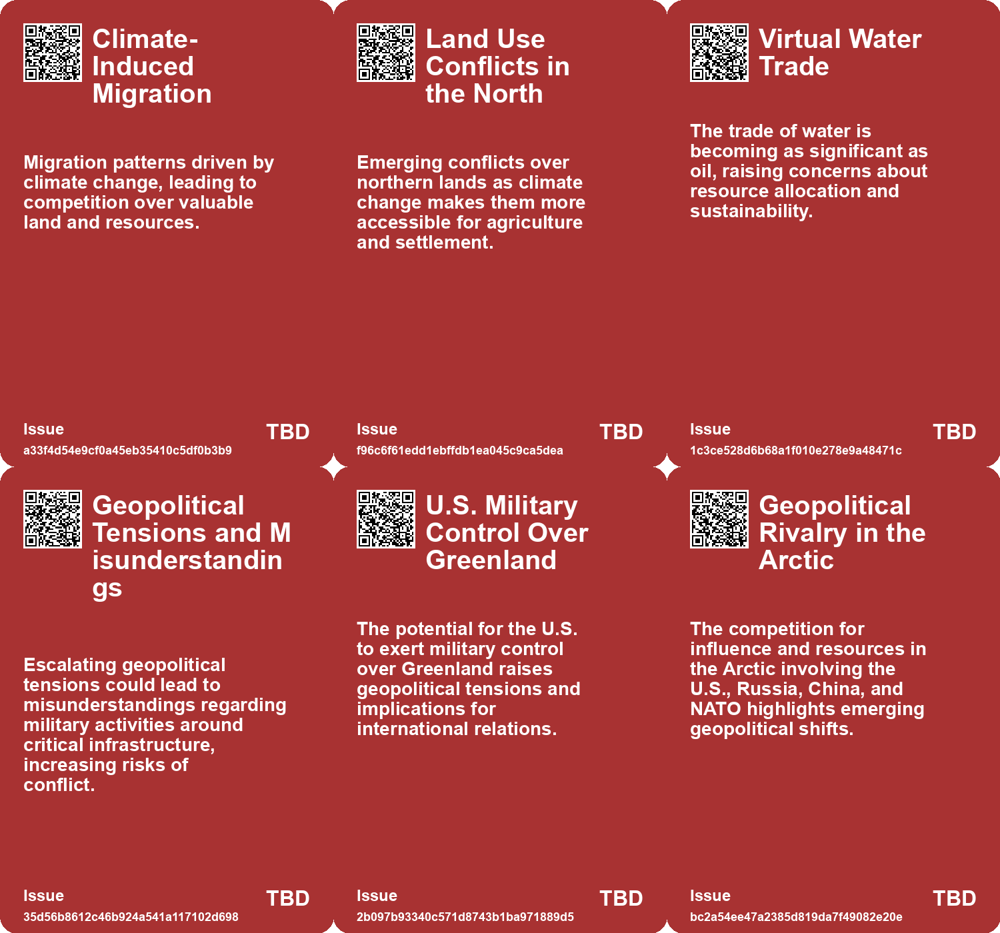
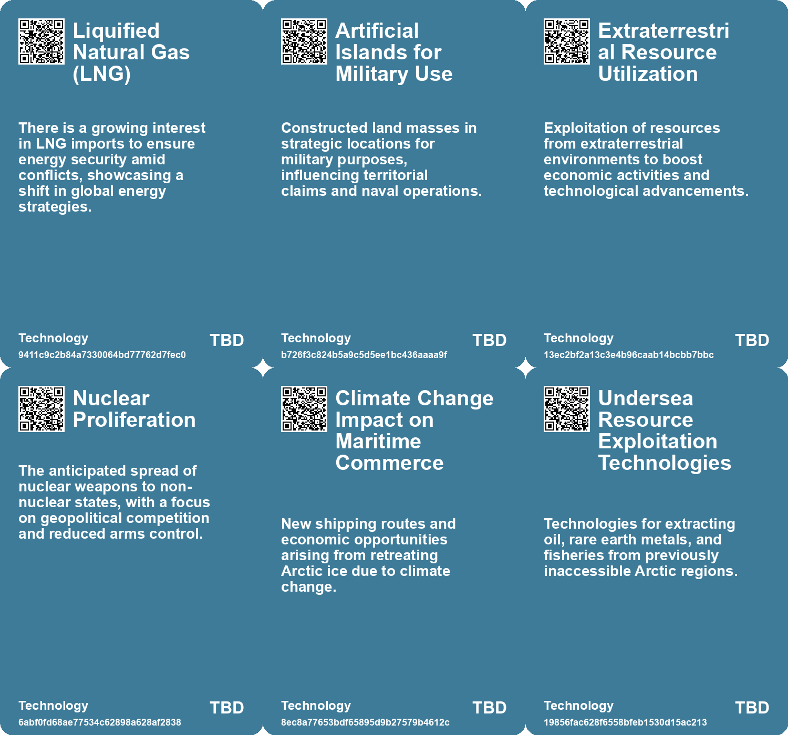

# *Topic*: Geopolitical Tensions Over Resources

# Summary

The geopolitical landscape is increasingly shaped by competition over resources and territory. Former President Donald Trump's interest in Greenland highlights the strategic significance of the Arctic, especially amid rising tensions with Russia and China. Greenland's melting ice sheet presents both opportunities and environmental concerns, particularly regarding the extraction of sand, which could provide economic independence but risks ecological damage. Meanwhile, the ongoing conflict in Ukraine underscores the urgency of energy security in Europe, as nations scramble to secure gas supplies amid fears of Russian aggression.

Climate change emerges as a critical theme, affecting various aspects of society and the environment. The impact of climate change on food systems is alarming, with studies indicating that simultaneous harvest failures in major breadbaskets could lead to food insecurity and civil unrest. Communities are becoming increasingly uninhabitable, emphasizing the need for social trust and cooperation to address these challenges. The importance of sustainable infrastructure is also highlighted, as degradation can exacerbate the effects of climate change and perpetuate social inequality.

The global economy faces significant challenges, particularly regarding water scarcity. Freshwater resources are depleting rapidly, with projections indicating that demand will outstrip supply by 2040. This crisis threatens economic stability, with trillions of dollars at risk if urgent action is not taken. The concept of "degrowth" is gaining traction as an alternative to the relentless pursuit of economic expansion, advocating for a focus on human needs and sustainable development.

The rise of China as a global power is reshaping international relations, with implications for military dynamics and economic competition. Concerns about China's military preparations regarding Taiwan reflect broader geopolitical tensions, as the U.S. and its allies reassess their strategies in response to China's growing influence. The potential for conflict is heightened by the obsolescence of traditional military strategies, as seen in the South China Sea.

Deep-sea mining is emerging as a controversial solution to the demand for critical minerals, particularly for clean energy technologies. While proponents argue it may have fewer environmental impacts than land-based mining, significant concerns remain about the potential destruction of fragile marine ecosystems. The International Seabed Authority is grappling with the need for regulations to protect these environments while addressing the growing interest in resource extraction.

The "war for talent" in the business sector highlights the increasing importance of skilled individuals in driving company success. As the demand for talent rises, companies face challenges in recruitment and retention, particularly among mid-level employees. This competition for talent underscores the need for organizations to adapt their strategies and foster a culture of development to remain competitive.

Finally, the interconnectedness of global challenges is evident in the discussions surrounding energy security, climate change, and economic stability. The ongoing crises in Europe, particularly related to natural gas shortages, serve as a reminder of the fragility of energy supplies and the need for solidarity among nations. As countries navigate these complex issues, the importance of international collaboration and innovative solutions becomes increasingly clear.

# Seeds

|    | name                                            | description                                                                                                    | change                                                                                                                       | 10-year                                                                                                                | driving-force                                                                                                         |
|---:|:------------------------------------------------|:---------------------------------------------------------------------------------------------------------------|:-----------------------------------------------------------------------------------------------------------------------------|:-----------------------------------------------------------------------------------------------------------------------|:----------------------------------------------------------------------------------------------------------------------|
|  0 | Global Shipping Insecurity                      | Rising threats to shipping lanes due to geopolitical tensions and local conflicts.                             | Increased threats to global trade routes affecting international commerce stability.                                         | Trade patterns may be disrupted, leading to economic consequences globally as tensions rise.                           | The growing uncertainty of military engagements and territorial disputes in crucial waterways.                        |
|  1 | Northern Land Liberation                        | Increasing temperatures are making northern lands more arable and contested.                                   | From icy tundra to viable agricultural land, ownership debates are intensifying.                                             | In 10 years, Canada and Russia could emerge as agricultural powerhouses due to climate change.                         | Demand for food production driven by global population growth and climate change.                                     |
|  2 | Emerging Land Conflicts                         | Climate change is generating new conflicts over land ownership and use.                                        | Rising tensions between landlords, communities, and governments over land access.                                            | In 10 years, expect increased land-based conflicts exacerbated by resource scarcity.                                   | Competition for dwindling resources and land driven by climate change effects.                                        |
|  3 | Social Fissures from Energy Inequality          | Energy consumption disparities are creating social divides and tensions.                                       | From equitable energy access to significant disparities based on consumption and resources.                                  | In 10 years, energy policies may prioritize equity and sustainability in access.                                       | Growing awareness of energy equity and its impact on social cohesion.                                                 |
|  4 | Economic Integration vs. Conflict               | The assumption that economic ties prevent conflict is being questioned, especially between the U.S. and China. | From a belief in economic interdependence as a conflict deterrent to recognizing potential for conflict despite integration. | In 10 years, the understanding of global economic relationships may shift, redefining international conflict dynamics. | Historical examples showing that economic integration does not guarantee peace, especially under political pressures. |
|  5 | Arctic Resource Competition                     | Countries are competing for access to undersea resources in the Arctic region.                                 | From unexploited resources to active competition for Arctic natural resources.                                               | Intensified geopolitical tensions over resource claims in the Arctic.                                                  | Economic interests in natural resources and energy security.                                                          |
|  6 | NATO's Arctic Focus                             | NATO identifies the Arctic as a region of great power competition.                                             | Shift from Cold War focus to contemporary geopolitical competition in the Arctic.                                            | NATO could evolve into a more militarized presence in the Arctic region.                                               | Rising tensions with Russia and the need for collective defense.                                                      |
|  7 | Global Supply Chain Risks                       | Conflict in Taiwan could disrupt global supply chains, especially in technology.                               | The world is moving from stable to uncertain supply chains reliant on Taiwan's semiconductor industry.                       | Global economies could face significant disruptions and a shift in manufacturing bases.                                | The increasing interconnectedness of global economies and reliance on Taiwanese technology.                           |
|  8 | Resentment Towards Germany's Energy Policy      | Eastern European countries express resentment towards Germany's energy decisions.                              | From collective EU energy initiatives to growing nationalistic sentiments and distrust.                                      | Potential fragmentation of EU energy policy and increased bilateral tensions among states.                             | Historical grievances from previous crises and perceived German energy dominance.                                     |
|  9 | Potential for Increased Conflict Over Resources | Tensions rise over resource allocation and aid during energy shortages.                                        | From cooperative EU solidarity to potential conflict over energy resources among member states.                              | Increased regional conflicts and competition for energy resources in Europe.                                           | Competition for limited energy supplies exacerbated by external pressures and crises.                                 |

# Concerns

|    | name                                 | description                                                                                                                                     |
|---:|:-------------------------------------|:------------------------------------------------------------------------------------------------------------------------------------------------|
|  0 | Resource Scarcity in Conflict Zones  | Conflict over strategic maritime routes, exemplified by tensions in the Red Sea and South China Sea, threatens global shipping and trade.       |
|  1 | Chinese Expansionism                 | China's aggressive territorial claims and military actions could instigate wider conflicts and destabilize regions around it.                   |
|  2 | International Cooperation Challenges | Risk of geopolitical tensions hindering international collaboration in deep space exploration and economic development.                         |
|  3 | Scarcity of Arable Land              | As the global population increases and climate change alters land usability, arable land may become scarce, exacerbating resource competition.  |
|  4 | Climate-Induced Conflict             | Increasing competition for diminishing land resources due to climate change may escalate conflicts between different ethnic and social groups.  |
|  5 | Geopolitical Instability             | Competition among power centers, uncertain future leadership in Russia, and potential conflict with NATO raise concerns about global stability. |
|  6 | Arctic Geopolitical Tensions         | Heightened military presence of Russia and strategic competition for Arctic resources poses risks of conflicts.                                 |
|  7 | Escalation of Cold War-like Tensions | Renewed focus on military footing in the Arctic may mirror Cold War dynamics, increasing risks of confrontation.                                |
|  8 | Climate Change Impact on Geopolitics | Retreat of Arctic ice due to climate change opens new trade routes and resources, raising competition risks.                                    |
|  9 | Inequitable Access to Resources      | Differences in countries' abilities to secure gas could exacerbate inequalities within the EU, leading to political tension.                    |

# Cards

## Concerns

## Behaviors

## Issue

## Technology

# Links

* [Putin's Military Recruitment Surge Signals Potential NATO Conflict Amid Tensions](https://futures.kghosh.me/295482a81133d3b07fbb57a9b31cd3c6)
* [Exploring the Historical and Future Transformations of Land Ownership Worldwide](https://futures.kghosh.me/68a769f0b8d15a4efd8f8136482b9660)
* [Navigating Climate Change: The Need for Community Resilience and Social Trust](https://futures.kghosh.me/efa36dc9bd5ddc890866d4ab1e68e71f)
* [The War for Talent: Navigating the Competitive Landscape for Skilled Professionals](https://futures.kghosh.me/34196ff9f6a0d4a9b32a79610ae2a976)
* [Greenlanders Support Sand Extraction Amid Climate Change: A New Economic Opportunity?](https://futures.kghosh.me/6c6a5e8d50e3045323cf202ba5b17ea9)
* [Exploring the Importance of Semiconductors in Modern Warfare and U.S.-China Rivalry](https://futures.kghosh.me/328434477c31995b44102949d5341006)
* [Rethinking Economic Growth: The Case for Degrowth in a Sustainable Future](https://futures.kghosh.me/d18185596b0ee658ac31e9c3003c6d92)
* [Freshwater Crisis: World Risks Depletion by 2040 Amid Soaring Consumption Rates](https://futures.kghosh.me/dc4897041e178e21d79a6f99d545758d)
* [Global Experts' Pessimistic Outlook for the Next Decade: Key Survey Findings](https://futures.kghosh.me/7c5704fc7ced135231421044eed7ec4b)
* [The UK's Declining Geopolitical Relevance and Elite Inaction: A Historical Perspective](https://futures.kghosh.me/ca555520973a0e8519ff854da1de4d88)
* [Global Experts' Pessimistic Outlook for the Next Decade: Key Survey Findings](https://futures.kghosh.me/4c1d4c91735e960e46ac534d9a90fc60)
* [Ukraine Accuses Russia of Sabotage with Oil Tankers; Ongoing Conflict Highlights Energy Issues and International Dynamics](https://futures.kghosh.me/86ab9450f1e2636214c83a9c67e259ad)
* [The Potential and Risks of Deep-Sea Mining: A Complex Debate Over Environmental Impact and Resource Demand](https://futures.kghosh.me/3d02bc01f88471d79643d8fe2ed79ec7)
* [China's Rise and the Prevention of a 21st Century Thucydides Trap](https://futures.kghosh.me/e35fed87b0c84188965e5323af1a8e57)
* [Trump's Ambitions for Greenland: Strategic Importance and Military Implications](https://futures.kghosh.me/209f8117ee90a9f43ad969632cd69ef0)
* [Germany Leads EU's Push for Gas Solidarity Amidst Looming Shortages](https://futures.kghosh.me/1e78d32ea623267ea92d5316f969d1ca)
* [Navigating the Climate Crisis: The Importance of Community and Social Trust in Adapting to Change](https://futures.kghosh.me/d1e5dc8cd0f7c34dede43f5429dded3d)
* [Reimagining Infrastructure: Towards a Redistributive and Ecologically Sound Future](https://futures.kghosh.me/177a0857ffe0d07d48cd99a269f28a02)
* [Future Prospects of Deep Space Economy Discussed at International Conference](https://futures.kghosh.me/4f6eeb75244ea4eafde4d72a40dd9b2c)
* [China's 2028 Invasion Plan for Taiwan: A Potential Global Conflict Ignored by the West](https://futures.kghosh.me/5ef6dd39c0b5eeaebb8dd1e1eb77a4c5)
* [US Alarmed by Russian Naval Activity Near Undersea Cables and Potential Sabotage Plans](https://futures.kghosh.me/3c468ac4c9f4d478a02b19e757939012)
* [Study Highlights Underestimated Risks of Simultaneous Harvest Failures Due to Climate Change](https://futures.kghosh.me/9bebaea9ed2c74b635c7ffbedc039556)
* [Exploring the Dangers and Riches of Deep-Sea Mining and the Role of the ISA](https://futures.kghosh.me/1523ecbc5ef88eb02b806424189aa7f3)
* [Economic Turmoil in Britain Signals Broader Crisis for Europe Due to Energy War](https://futures.kghosh.me/eab98729272b0f85f67258553c6590c7)