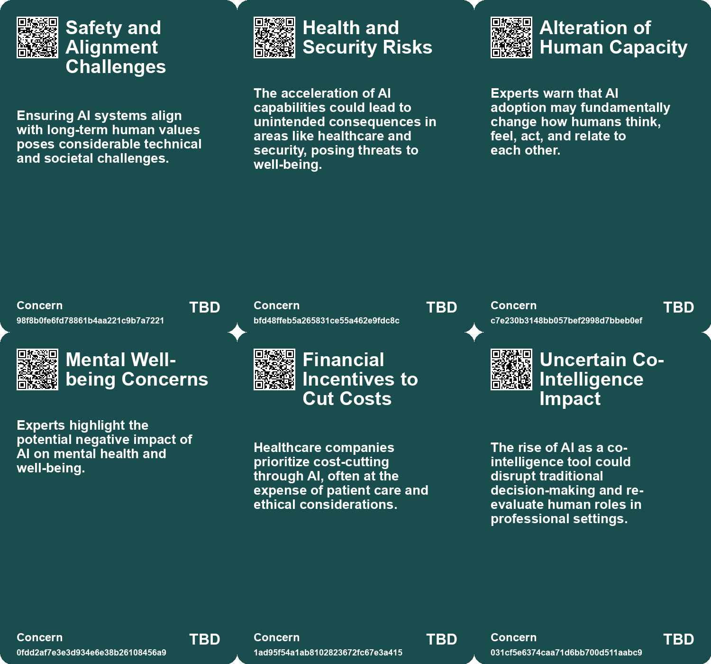
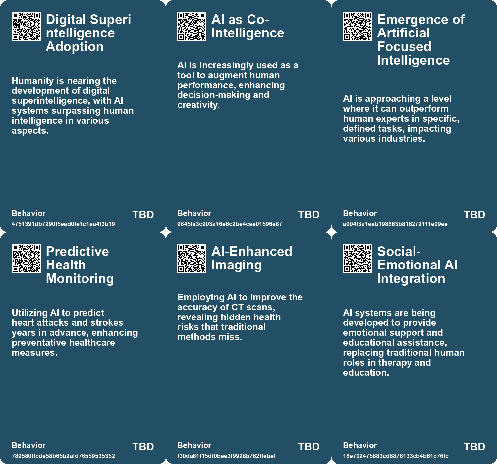
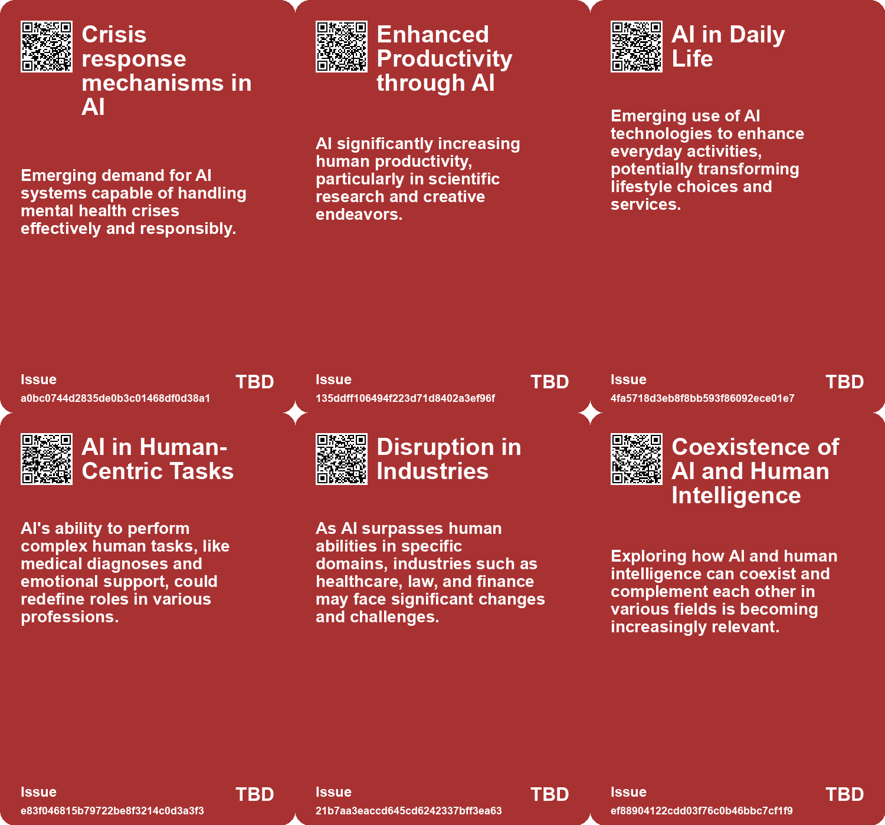
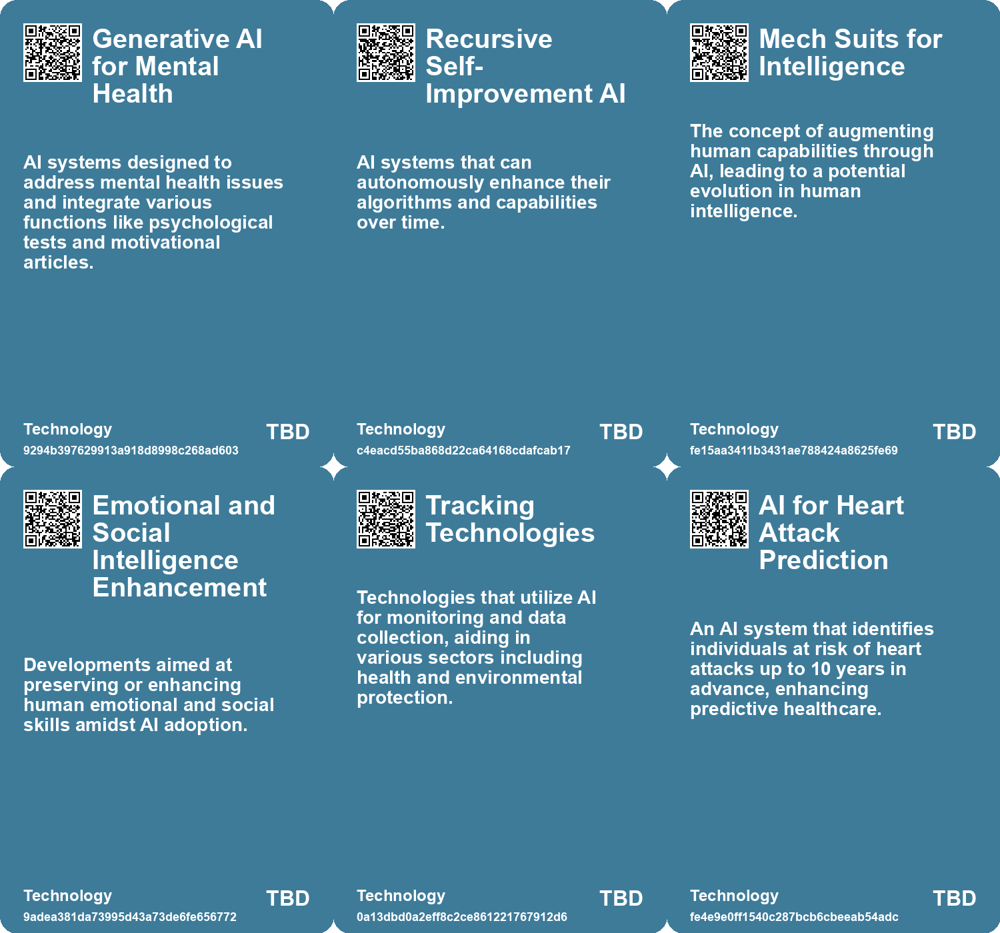

# *Topic*: Health AI

# Summary

The rise of artificial intelligence (AI) is reshaping various sectors, with significant implications for human interaction, ethics, and productivity. One prominent theme is the integration of social-emotional AI in fields like education and mental health. While these technologies aim to provide support, they also risk exacerbating inequalities, as those with fewer resources may rely more heavily on AI for emotional assistance. This raises ethical concerns about the depersonalization of care and the need for a balanced approach that combines AI with human interaction.

As AI continues to evolve, the importance of adapting to this new landscape becomes clear. Individuals and organizations are encouraged to embrace AI, focusing on human-inspired skills such as creativity, communication, and collaboration. The emergence of "out skills," which enhance human capabilities through AI, highlights the necessity of continuous adaptation in a rapidly changing work environment.

In healthcare, the potential of AI is tempered by concerns over its misuse. Instances of flawed AI systems leading to critical errors in patient care underscore the need for competent regulation and reform. The healthcare industry must navigate the challenges of integrating AI while ensuring patient safety and quality of care.

The ethical implications of AI development are also a significant concern. Calls for a pause in the advancement of AI systems reflect fears about losing control over technology that could surpass human capabilities. Experts emphasize the need for preparation and regulation to mitigate risks associated with AI, including algorithmic discrimination and the potential for job displacement.

Generative AI is transforming workplace dynamics, particularly in marketing and management roles. Professionals are evolving into strategic orchestrators, leveraging AI to synthesize information and generate content while maintaining the human element of empathy and ethical reasoning. This shift necessitates a redefinition of roles and a focus on uniquely human skills.

The potential for AI to enhance human capabilities is accompanied by warnings about its addictive qualities, particularly in the realm of companionship. As individuals increasingly turn to AI for emotional support, the need for innovative regulatory approaches becomes apparent. Addressing underlying issues such as loneliness is crucial to ensure that AI serves as a beneficial tool rather than a harmful substitute for human connection.

Finally, the impact of AI on global challenges, such as the United Nations Sustainable Development Goals, highlights its potential for positive social change. However, disparities in funding and the risks of bias and misinformation must be addressed to harness AI effectively for social good. Collaboration among stakeholders is essential to navigate the complexities of AI's integration into society and to ensure equitable access to its benefits.

# Seeds

|    | name                                         | description                                                                                             | change                                                                                      | 10-year                                                                                                                                 | driving-force                                                                                                |
|---:|:---------------------------------------------|:--------------------------------------------------------------------------------------------------------|:--------------------------------------------------------------------------------------------|:----------------------------------------------------------------------------------------------------------------------------------------|:-------------------------------------------------------------------------------------------------------------|
|  0 | Digital Superintelligence Development        | Humanity is close to building digital superintelligence, marking a significant leap in AI capabilities. | From limited AI systems to advanced AI that can perform complex cognitive work.             | In ten years, digital superintelligence could lead to transformative changes in numerous fields, enhancing productivity and creativity. | The pursuit of scientific progress and technological innovation drives the development of superintelligence. |
|  1 | AI and Community Building                    | Potential for AI to enhance human creativity and community sharing.                                     | Shift from individualistic to community-focused approaches leveraging AI.                   | More robust community platforms where AI facilitates creativity instead of stifling it.                                                 | Desire for meaningful exchange and cooperation in creative endeavors among humans.                           |
|  2 | Universal AI Agents                          | Development of AI that can assist in everyday life tasks.                                               | Transition from specialized AI tools to general-purpose AI agents.                          | In a decade, AI may handle complex planning and decision-making tasks seamlessly.                                                       | The goal of increasing AI's utility and ease of use in daily life.                                           |
|  3 | Co-Intelligence with AI                      | Humans and AI collaborating to achieve better outcomes than either could alone.                         | Shift from independent AI systems to collaborative AI-human partnerships.                   | Professional environments will increasingly integrate AI as essential collaborators in decision-making processes.                       | The recognition of AI as a tool to augment human intelligence and capabilities.                              |
|  4 | Integration of AI in Cardiovascular Medicine | AI systems are being integrated into standard medical practices for heart health assessment.            | Transitioning from traditional diagnostic methods to AI-enhanced imaging and analysis.      | Standard practice will include AI tools, improving early detection and treatment of heart conditions.                                   | Desire for more accurate diagnostics and better patient outcomes.                                            |
|  5 | AI Companions for Mental Health              | AI tools are being used to track and support mental health, especially in underserved areas.            | From traditional mental health services to AI-driven support systems for mental well-being. | AI companions could become common in mental health support, though effectiveness may vary widely.                                       | Rising mental health issues combined with a shortage of human therapists and support.                        |
|  6 | AI in Healthcare                             | AI can improve productivity of healthcare workers and help in triaging patients.                        | Shift from traditional healthcare practices to AI-driven solutions in underserved regions.  | AI-driven healthcare solutions will bridge the gap in medical access for impoverished communities.                                      | The need to reduce healthcare inequities and improve medical access for the poor.                            |
|  7 | AI in Wearable Technology                    | Integration of AI into wearable devices for health and lifestyle management.                            | Evolving from simple wearables to smart devices that actively assist users.                 | Wearable tech that actively manages health and wellness through AI insights.                                                            | Growing health consciousness and reliance on technology for personal well-being.                             |
|  8 | Co-Intelligence with AI                      | Humans and AI collaborating to achieve better outcomes than either could alone.                         | Shift from independent AI systems to collaborative AI-human partnerships.                   | Professional environments will increasingly integrate AI as essential collaborators in decision-making processes.                       | The recognition of AI as a tool to augment human intelligence and capabilities.                              |
|  9 | Improving AI Understanding of Human Emotions | AI models are becoming better at tasks measuring human mental states.                                   | AI performance shifts from basic interaction to nuanced understanding of human emotions.    | In 10 years, AI could provide more empathetic interactions, resembling human emotional understanding.                                   | The drive to create more human-like AI for better user experiences and applications.                         |

# Concerns

|    | name                                                | description                                                                                                                                               |
|---:|:----------------------------------------------------|:----------------------------------------------------------------------------------------------------------------------------------------------------------|
|  0 | Safety and Alignment Challenges                     | Ensuring AI systems align with long-term human values poses considerable technical and societal challenges.                                               |
|  1 | Health and Security Risks                           | The acceleration of AI capabilities could lead to unintended consequences in areas like healthcare and security, posing threats to well-being.            |
|  2 | Alteration of Human Capacity                        | Experts warn that AI adoption may fundamentally change how humans think, feel, act, and relate to each other.                                             |
|  3 | Mental Well-being Concerns                          | Experts highlight the potential negative impact of AI on mental health and well-being.                                                                    |
|  4 | Financial Incentives to Cut Costs                   | Healthcare companies prioritize cost-cutting through AI, often at the expense of patient care and ethical considerations.                                 |
|  5 | Uncertain Co-Intelligence Impact                    | The rise of AI as a co-intelligence tool could disrupt traditional decision-making and re-evaluate human roles in professional settings.                  |
|  6 | Over-reliance on AI                                 | Dependency on AI for decision-making in critical areas like healthcare and law may diminish human oversight and judgement, impacting outcomes negatively. |
|  7 | Existential Reflection on Human Intelligence        | As AI becomes superhuman, a cultural shift towards enhancing human capacities and intelligence may become necessary to retain relevance.                  |
|  8 | Existential Risk from AI                            | The potential for AI to outsmart, replace, or even pose existential threats to humanity, as expressed by notable AI experts and technologists.            |
|  9 | Potential for AI-Assisted Errors in Critical Fields | The use of AI in fields like healthcare could lead to erroneous outcomes if human oversight is neglected or diminished.                                   |

# Cards

## Concerns

## Behaviors

## Issue

## Technology

# Links

* [Effective Change Management Strategies for AI Integration in Organizations](https://futures.kghosh.me/7eff1fa6b2dda89fa9c1470272891080)
* [AI Models Show Improved Performance in Theory of Mind Tests Compared to Humans](https://futures.kghosh.me/25cdc8c55ebb70b51b85134dc01e6efd)
* [Exploring the Future: How AI Will Transform Our Lives by 2041](https://futures.kghosh.me/1621aeb7941f2df0feefc2de14851249)
* [Innovative AI Hardware in 2024: Exploring New Form Factors and Applications](https://futures.kghosh.me/1f0a208e60ca217eb543648a46fe44ad)
* [Thriving in an AI Era: Embracing, Adapting, and Complementing Technology](https://futures.kghosh.me/23a3410059759ba4214235628d4ebd4b)
* [The Quest for AGI: Current AI Capabilities and Future Implications](https://futures.kghosh.me/eef4f83910b733e34ce5d57218a46d32)
* [The Urgent Need for Ethical AI Regulations Amid Rapid Development and Deployment](https://futures.kghosh.me/382e9ebc1e518ee49e541da1e6b5f8af)
* [The Rise of AI Chatbots in China's Mental Health Landscape: Opportunities and Risks](https://futures.kghosh.me/70e9fcd5fc1d2dd04ae1df8b2628194d)
* [Addressing the Risks of AI Companionship: Addiction, Regulation, and Human Dignity](https://futures.kghosh.me/4611565d14a05789e2efc6fafc563f58)
* [Advancements in AI: The Promise and Limitations of Interactive Models like GPT-4o and Astra](https://futures.kghosh.me/f98dab2817789f549215229135f086d0)
* [Understanding the Real Risks of AI Beyond Superintelligence and Scalability](https://futures.kghosh.me/ff7f7a51f925c273449a8648a18b7df8)
* [Harnessing AI for Social Good: Opportunities and Challenges in Achieving the UN SDGs](https://futures.kghosh.me/0d88d49818819d335d12f792275fde97)
* [The Rise of Augmented Humans: Embracing AI in a Transformative Era](https://futures.kghosh.me/a8f2b9b3c07bd0f1d91784ff8b5ee5fc)
* [Navigating the Promises and Perils of Artificial Intelligence Development](https://futures.kghosh.me/7fcef9a240c0738d2390c83f9713dc98)
* [The Transformative Potential of AI: Revolutionizing Education, Healthcare, and Global Equity](https://futures.kghosh.me/2449c2fc4b8afc7e268db4987fa821e5)
* [Exploring the Future of Superintelligence and Its Impact on Humanity](https://futures.kghosh.me/8a7f0b887d1b9b17fc4f72a0815ec849)
* [Experts Predict Dramatic Changes in Human Nature Due to AI by 2035](https://futures.kghosh.me/aedfc5daa90ddd6bccac686585173933)
* [AI's Potential to Enhance Human Evolution and Self-Actualization](https://futures.kghosh.me/8893f2e58b95e1993a5f8a1af090eedd)
* [Reflections on AI: Balancing Human Essence and Technological Advancement as the Year Ends](https://futures.kghosh.me/67e5f63a5ea04ad81ae4e5ef192811be)
* [The Role of Social-Emotional AI: Bridging or Widening the Gap in Human Connection?](https://futures.kghosh.me/8e191b6221caa8d9f27b19268ab8a048)
* [AI System Aims to Predict Heart Attack Risks and Save Lives in the UK](https://futures.kghosh.me/dead7bfcd66251606f35ea6015f2447c)
* [Exploring AI's Implications: Insights from a Discussion in New Zealand on Artificial Intelligence and Society](https://futures.kghosh.me/7bdbb32950c9d265f6ec455d964973fe)
* [The Dangers of AI Misuse in the U.S. Healthcare System and Its Impact on Elderly Care](https://futures.kghosh.me/5f91e2d433a76b5d40c649100da24318)
* [The Transformative Role of Generative AI in Supply Chain and Marketing Management](https://futures.kghosh.me/1b46caa07ff58af58c2e1cf51b86402d)
* [The Quest for AGI: Current AI Capabilities and Future Implications](https://futures.kghosh.me/77c5c92357a7aeff1c388c1eb79b7259)
* [The Integration of AI in Business School Curriculums to Enhance Graduate Competitiveness](https://futures.kghosh.me/bc232b227c806ac26adf2b99fa4cff9d)
* [Recent Developments in AI Regulation and Technology: A Review of Key Initiatives and Critiques](https://futures.kghosh.me/a009ccdffaa59f53de56887aa19e6239)