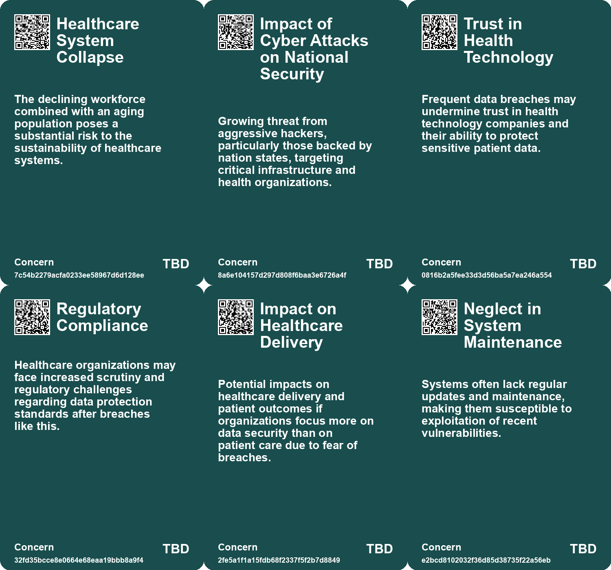
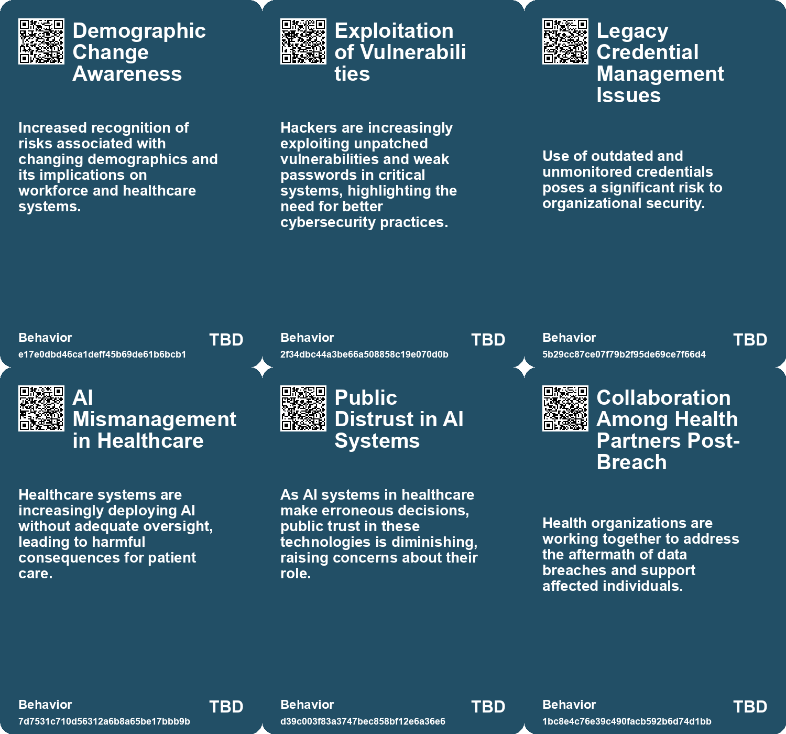
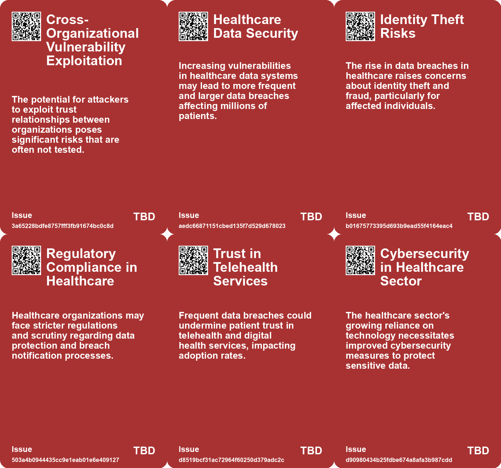
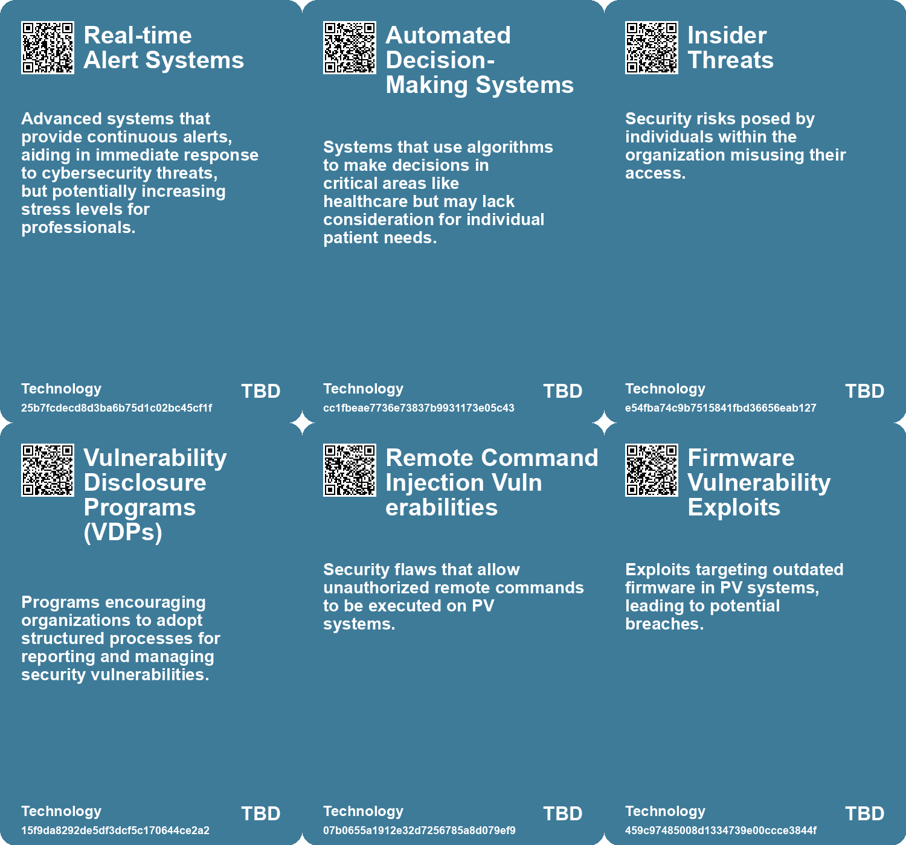

# *Topic*: Healthcare System Vulnerabilities

# Summary

The water sector is facing increasing cyber threats, with significant breaches reported in both the UK and the US. Incidents involving utilities like Southern Water and American Water have raised alarms about vulnerabilities in operational technology. Government agencies are responding with warnings and recommendations to enhance security measures. Legislative efforts are underway to protect vital water infrastructure, emphasizing the need for collaboration and resource allocation among various entities.

U.S. cyber agencies, including the FBI and NSA, have issued urgent warnings about potential cyberattacks from Iranian-affiliated hackers targeting critical infrastructure. Organizations in sectors such as energy, water, and healthcare are advised to bolster their defenses amid regional unrest. The advisory highlights the risks faced by Defense Industrial Base companies, particularly those linked to Israeli operations, and recommends best practices for protection.

In the healthcare sector, HealthEC has reported a data breach affecting approximately 4.5 million customers, involving unauthorized access to personal information. This incident underscores the ongoing challenge of safeguarding personal health information in an industry increasingly reliant on digital systems. The need for vigilance against identity theft and fraud is emphasized for affected individuals.

The evolving nature of risk in disaster management is also a pressing concern. Major events like wildfires and hurricanes are interconnected, creating a complex risk landscape. Traditional models that treat these disasters as isolated incidents are outdated. A modernized risk framework is needed, focusing on local resilience and systemic support to effectively address these challenges.

The UK government is at high risk of a catastrophic ransomware attack due to inadequate planning and investment in cybersecurity. A parliamentary report warns that the country's critical national infrastructure is vulnerable, with recent attacks on public services like the NHS highlighting the severity of the threat. The report criticizes the government for failing to prioritize cybersecurity measures.

The use of artificial intelligence in healthcare presents both opportunities and risks. While AI has the potential to innovate, its misuse can lead to significant errors in patient care. For instance, UnitedHealthcare's use of AI to determine Medicare benefits resulted in premature denials of care. This situation underscores the need for competent regulation and reform in the deployment of AI technologies.

Cybersecurity vulnerabilities extend beyond healthcare and water utilities. Over 130,000 solar energy monitoring systems have been found exposed online, making them potential targets for hackers. The risk is exacerbated by outdated firmware and neglected maintenance. System administrators are urged to implement strong security measures to protect these systems.

The Future Risks Report 2025 highlights the increasing complexity of global risks, with climate change remaining the top concern. Geopolitical instability and cybersecurity threats follow closely behind. The report emphasizes the importance of addressing misinformation and the role of the insurance sector in mitigating emerging risks.

In the realm of software security, the Biden administration has unveiled a national cybersecurity strategy aimed at strengthening the country's defenses. This includes legislation to hold companies accountable for the security of their software products. The administration also plans to enhance the security of open-source software, which is vital for the digital economy.

The cybersecurity job market is experiencing challenges due to economic uncertainty, leading to layoffs and budget cuts. Despite this, there are still many open positions in top cybersecurity companies. Job seekers are encouraged to network and seek accurate data to identify promising opportunities.

Recent incidents, such as a data breach involving the VW Group and Toyota's exposure of customer data through a public GitHub repository, highlight the vulnerabilities in the automotive industry. These breaches emphasize the need for improved cybersecurity measures as vehicles become increasingly connected.

Burnout is becoming a significant issue in the cybersecurity sector, affecting professionals' mental health due to high stress and long hours. Initiatives like Cybermindz aim to address these challenges, calling for better regulatory frameworks to protect cybersecurity workers from burnout.

# Seeds

|    | name                                             | description                                                                                                         | change                                                                                                       | 10-year                                                                                                                  | driving-force                                                                                                                         |
|---:|:-------------------------------------------------|:--------------------------------------------------------------------------------------------------------------------|:-------------------------------------------------------------------------------------------------------------|:-------------------------------------------------------------------------------------------------------------------------|:--------------------------------------------------------------------------------------------------------------------------------------|
|  0 | Healthcare System Under Strain from Demographics | Changing demographics, including an aging population, threaten healthcare sustainability.                           | From stable healthcare systems to potential collapse under demographic pressures.                            | In a decade, healthcare systems could be overwhelmed, leading to widespread service failures.                            | A declining workforce supporting an increasingly elderly population exacerbating healthcare burdens.                                  |
|  1 | Default Password Risks                           | Insecure software and default passwords contribute to cybersecurity vulnerabilities.                                | Shift from acceptance of default passwords to a culture of secure software practices.                        | In 10 years, secure coding practices will be standard, reducing vulnerabilities from default settings.                   | Growing awareness of cybersecurity risks will drive the push for secure software development.                                         |
|  2 | Inadequate Cybersecurity Measures                | Sellafield's ongoing cybersecurity vulnerabilities indicate a systemic issue in critical infrastructure protection. | Transitioning from a reactive to a proactive cybersecurity approach is urgently needed.                      | In 10 years, we may see stricter cybersecurity regulations for critical infrastructure in the UK.                        | Rising global cyber threats from state actors necessitate stronger defenses for national security.                                    |
|  3 | Healthcare Data Breaches                         | Increasing incidents of data breaches in healthcare impacting millions of individuals.                              | Shift from a secure data environment to one increasingly vulnerable to breaches.                             | Healthcare organizations may adopt more robust cybersecurity measures and regulations.                                   | Growing reliance on digital records and the interconnectedness of healthcare systems.                                                 |
|  4 | Patient Privacy Concerns                         | Rising concerns among patients regarding the security of their personal health information.                         | Transition from trust in healthcare providers to skepticism about data handling.                             | Patients may demand greater transparency and control over their health data.                                             | Increased awareness of data privacy issues and personal data exploitation.                                                            |
|  5 | Regulatory Changes in Data Security              | Potential for new regulations governing data security in healthcare due to breaches.                                | Move from minimal regulations to stricter enforcement and compliance requirements.                           | Healthcare organizations may face more stringent legal obligations regarding data protection.                            | Pressure from consumers and advocacy groups for better data protection laws.                                                          |
|  6 | Insider Threats to Cybersecurity                 | Insider breaches highlight vulnerabilities in cybersecurity management within organizations.                        | Shift from focusing solely on external threats to acknowledging significant risks from within organizations. | Organizations will implement more rigorous internal security measures to mitigate insider threats effectively.           | Increased incidents of insider threats will compel companies to strengthen internal monitoring and access protocols.                  |
|  7 | Increased Cyber Threats to Water Sector          | Growing incidents of cyberattacks on water utilities indicate heightened vulnerability.                             | The water sector is shifting from underestimating cyber risks to prioritizing cybersecurity measures.        | In 10 years, water utilities will adopt advanced cybersecurity frameworks and technologies to safeguard against threats. | The increasing sophistication and frequency of cyberattacks drive the need for enhanced security measures in critical infrastructure. |
|  8 | Legacy Systems in Healthcare                     | NHS relies on outdated IT systems, making it a prime target for ransomware attacks.                                 | From reliance on legacy systems to a push for modernization and support for healthcare IT.                   | In 10 years, the NHS may have updated systems reducing vulnerability and improving service delivery.                     | The need for efficient healthcare delivery and patient safety drives modernization efforts.                                           |
|  9 | Potential for Cyber-Physical Attacks             | Emerging risks of cyber-physical attacks on critical infrastructure could threaten safety.                          | From traditional cyber threats to potential physical harm through cyber-attack vectors.                      | In 10 years, there may be stricter regulations and protections for cyber-physical systems.                               | The need for safety and security in critical infrastructure drives advancements in cybersecurity.                                     |

# Concerns

|    | name                                           | description                                                                                                                                              |
|---:|:-----------------------------------------------|:---------------------------------------------------------------------------------------------------------------------------------------------------------|
|  0 | Healthcare System Collapse                     | The declining workforce combined with an aging population poses a substantial risk to the sustainability of healthcare systems.                          |
|  1 | Impact of Cyber Attacks on National Security   | Growing threat from aggressive hackers, particularly those backed by nation states, targeting critical infrastructure and health organizations.          |
|  2 | Trust in Health Technology                     | Frequent data breaches may undermine trust in health technology companies and their ability to protect sensitive patient data.                           |
|  3 | Regulatory Compliance                          | Healthcare organizations may face increased scrutiny and regulatory challenges regarding data protection standards after breaches like this.             |
|  4 | Impact on Healthcare Delivery                  | Potential impacts on healthcare delivery and patient outcomes if organizations focus more on data security than on patient care due to fear of breaches. |
|  5 | Neglect in System Maintenance                  | Systems often lack regular updates and maintenance, making them susceptible to exploitation of recent vulnerabilities.                                   |
|  6 | Fragmentation of Patient Records               | Disparate systems may lead to fragmented patient information, making it harder for healthcare providers to deliver cohesive care.                        |
|  7 | Insufficient Cybersecurity Measures            | Many water systems fail to meet critical security standards, exposing them to potential breaches and disruptions.                                        |
|  8 | Reliance on Legacy Infrastructure              | The NHS's outdated IT systems could exacerbate the impact of a cyber-attack, risking patient care and operational integrity.                             |
|  9 | Human Safety Risks from Cyber-Physical Attacks | Potential physical harm could arise from hacks that manipulate critical operations, such as transportation or healthcare systems.                        |

# Cards

## Concerns

## Behaviors

## Issue

## Technology

# Links

* [HealthEC Data Breach Affects 4.5 Million Customers: Key Details and Response](https://futures.kghosh.me/5496017492babc1c86e79e4087a514b7)
* [Biden Administration Unveils New Cybersecurity Strategy to Combat Growing Threats](https://futures.kghosh.me/1eaefdcf11b24d5f443b5f4e7645e0a5)
* [Belgium Implements Comprehensive Legal Protections for Ethical Hackers, Leading EU in Cybersecurity Policy](https://futures.kghosh.me/8ae26b7eeafce0d7e88a3f1e7cadcfd7)
* [VW Group Data Breach Exposes 800,000 EV Owners' Sensitive Information, Raising Cybersecurity Concerns](https://futures.kghosh.me/74093ff7c82ad21987f693911e97634c)
* [Challenges and Opportunities in the 2023 Cybersecurity Job Market: Insights and Strategies](https://futures.kghosh.me/0ab36af538bf262c85b73fa7e7bd657f)
* [Understanding the Growing Burnout Crisis in Cybersecurity Professions](https://futures.kghosh.me/c87f31ea7f919c966942a4169f2f5a72)
* [Emerging Global Risks: Climate Change, Geopolitical Tensions, and Technological Threats in 2025](https://futures.kghosh.me/c279f12eda98e732755a0f730b9d4d4b)
* [Understanding the Financial Motivations Behind Maritime Cyber Security Threats](https://futures.kghosh.me/af7a13a1e97a8ebff3d521dabea087ce)
* [Urgent Warning: Threats from Iranian Cyber Hackers to U.S. Critical Infrastructure](https://futures.kghosh.me/605e2654bd3bbaa502827084ca7a44be)
* [White House Launches Initiative to Secure Open Source Software in Critical Infrastructure](https://futures.kghosh.me/925e58163f39d747785e0e85eeea0f25)
* [Toyota's Data Exposure Incident: Lessons on Security Practices and Risks in Software Development](https://futures.kghosh.me/823b6ca2e6861cc96e8c98c723234600)
* [Future Risks Report 2025: Increasing Global Crises and Emerging Risks Analysis](https://futures.kghosh.me/c5ecb012c90eddae1d46c1137e384c86)
* [Future Risks Report 2024: Key Findings on Emerging Global Challenges](https://futures.kghosh.me/caf29de5522a914887f9653f8edfd0a6)
* [Publicly Accessible PV Monitoring Systems Pose Cybersecurity Risks](https://futures.kghosh.me/3ac657f7b32d24bb43bddca058e2db25)
* [Addressing Threats to Democracy: Strategies for Resilience Against Misinformation and Manipulation](https://futures.kghosh.me/56d1a28746cd95ebaa3d62a4e1f91c3a)
* [Overview of Cyber Threats in the UK: Insights from the 2023 Cyber Security Breaches Survey](https://futures.kghosh.me/576f8cf76f713e057b075e2424ea709c)
* [Overview of the US DoD's 2023 Cyber Strategy: Enhancing Cyber Defense and Partnerships](https://futures.kghosh.me/f88aebcf579dffa42fc0dbe74de919c4)
* [UK Faces High Risk of Catastrophic Ransomware Attack Due to Poor Cybersecurity Investment](https://futures.kghosh.me/3de8b64ba20eb613a72b0479350b5e5b)
* [Growing Cybersecurity Threats to Water Infrastructure Demand Immediate Action and Collaboration](https://futures.kghosh.me/fb9b2211d0fcea8245837d9b34379d9f)
* [CISA's Red Team Exercise Uncovers Major Security Flaws in Federal Agency After Five Months Undetected](https://futures.kghosh.me/8ce2e3c9b07df17c316a67b21e7397a9)
* [Transforming Water Utilities: Addressing Security and Sustainability Challenges through Innovation](https://futures.kghosh.me/d54442ea6fe7853d0f8674688c9b7064)
* [Evolving Perspectives on Risk Management in the Context of Modern Disasters](https://futures.kghosh.me/cd4f6f65b2486d56699138cd2270044d)
* [CISA Adds High-Severity Adobe Acrobat Reader Vulnerability to KEV Catalog](https://futures.kghosh.me/089706e00a9c0d142049a6a6c557e3e7)
* [The Dangers of AI Misuse in the U.S. Healthcare System and Its Impact on Elderly Care](https://futures.kghosh.me/5f91e2d433a76b5d40c649100da24318)
* [Investigation Reveals Cybersecurity Breaches at Sellafield Nuclear Site Linked to Foreign Hackers](https://futures.kghosh.me/052e0aef0ae4e13f4e2cd7de90495330)
* [Cyber Attack on UK Train Stations Highlights Public WiFi Security Vulnerabilities](https://futures.kghosh.me/94c1456af1955d62efd074577c67b4e8)
* [The Consequences of Poor Software Design in Healthcare: A Specialist's Perspective](https://futures.kghosh.me/976f66dccf4086981111e810d0160229)
* [Exploring Cookies, Supply Chains, and Future Challenges in Technology and Consumption](https://futures.kghosh.me/fa27e27bdec01712d582ab0f61c95bac)