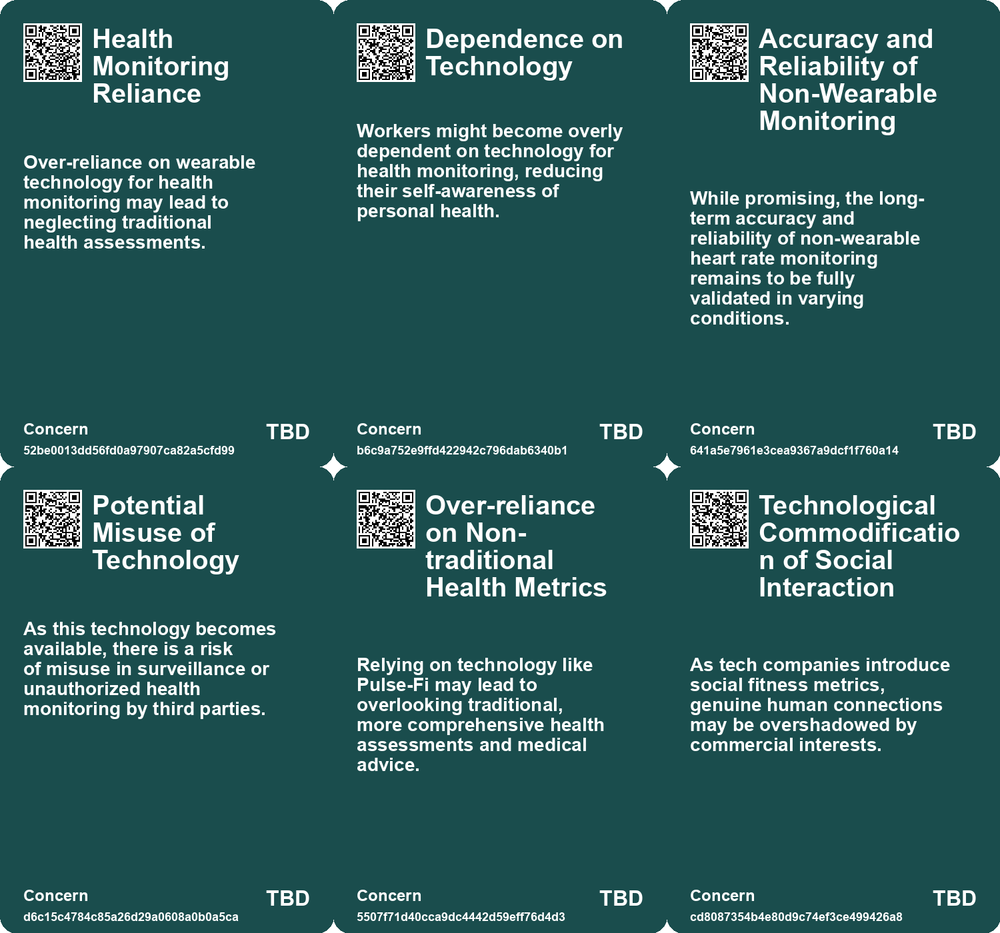
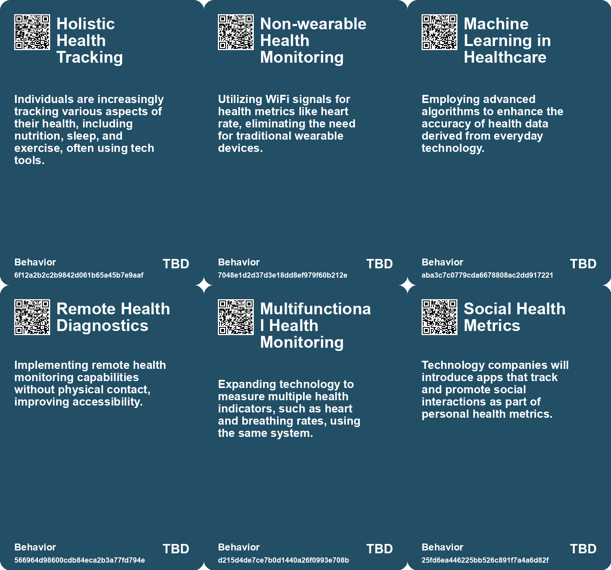
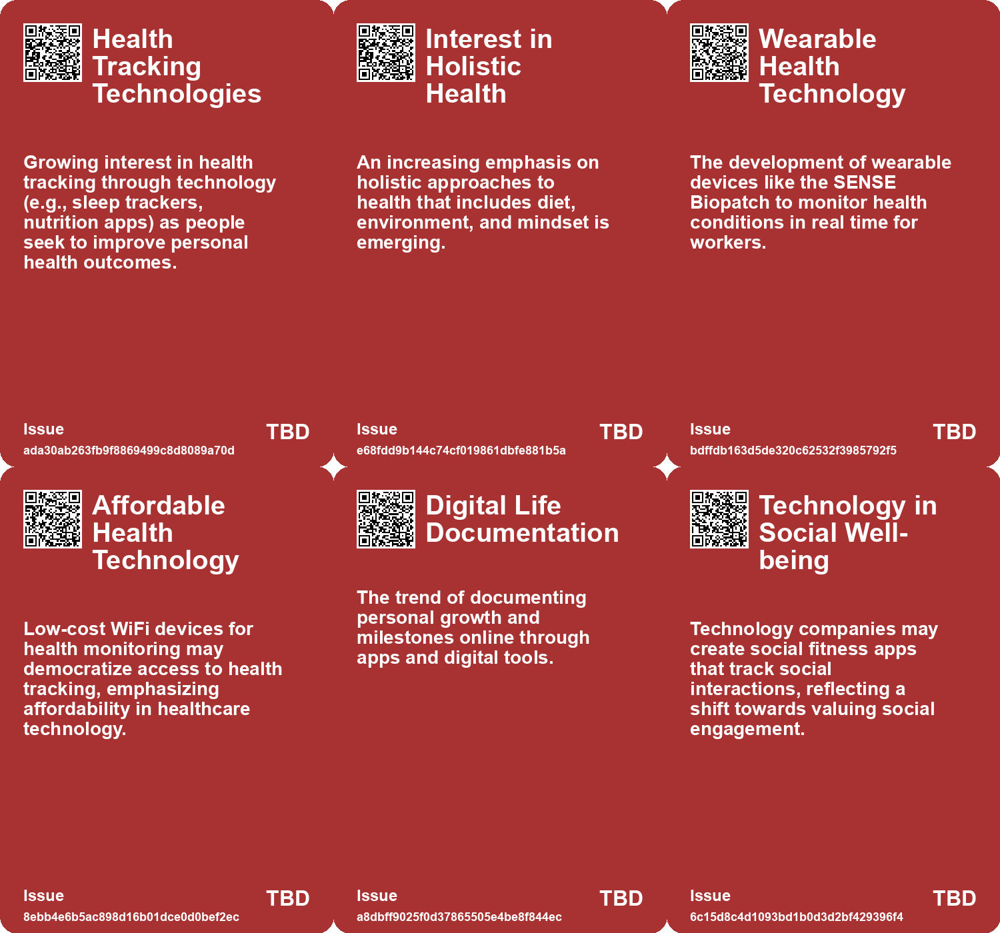

# *Topic*: Holistic Health Tracking

# Summary

Loneliness and Mental Health

A growing public health crisis of loneliness is affecting many Americans, with 58% reporting feelings of isolation. This issue is particularly pronounced among younger generations and has significant implications for mental and emotional well-being. In Denmark, teachers are using apps to monitor students' moods, raising concerns about the potential negative effects of quantifying emotions. In China, young people are increasingly turning to AI chatbots for mental health support, which, while accessible, may inadvertently reinforce harmful thoughts. The rise of menopause retreats also highlights a growing demand for community support among women navigating significant life transitions.

Technology and Surveillance

The integration of technology into daily life is raising questions about privacy and autonomy. The concept of "luxury surveillance" is emerging, where individuals willingly adopt devices that track their lives, often at the expense of their privacy. In the realm of education, apps designed to monitor student well-being are also under scrutiny for their potential to invade privacy. Meanwhile, the proliferation of cameras in society, including those used by police, is leading to an overwhelming amount of video data, prompting the use of AI for analysis. This raises concerns about accountability and the adequacy of existing legal frameworks.

Health Innovations

Innovative health technologies are making strides in monitoring and improving well-being. The SENSE Biopatch, developed for outdoor workers, tracks vital signs and detects early signs of heat exposure. Similarly, the AI-based early warning system Chartwatch has shown promise in reducing unexpected deaths in hospitals. Researchers at UC Santa Cruz have created Pulse-Fi, a system that accurately monitors heart rate using low-cost WiFi devices, eliminating the need for wearables. Forward Health's CarePod offers a self-contained medical station for various tests, emphasizing privacy and data security.

Biohacking and Alternative Medicine

The trend of biohacking is gaining traction, with spaces like the Longevity House in Toronto catering to those seeking to optimize their health through unconventional methods. This includes treatments like cryotherapy and fecal transplants, which raise questions about efficacy and safety. The menopause economy is also emerging, with retreats offering tailored solutions for women, reflecting a growing interest in alternative medicine and a desire for personalized care.

Cultural Reflections on Technology

The impact of technology on society is a recurring theme, with discussions around the negative effects of digital tools on human connection and memory. The importance of user input in software design, particularly in healthcare, is emphasized to ensure that technology serves its intended purpose. A cultural shift towards prioritizing attention over availability is suggested as a remedy for the polarization exacerbated by social media.

Community and Data Empowerment

Community initiatives are increasingly leveraging technology to advocate for urban improvements. The Traffic Monitor device, designed for local use, empowers neighborhoods with data to support non-motorized transportation. This democratization of technology aims to enhance community engagement and influence city planning. The importance of social connections and community care is echoed in various contexts, from mental health support to the need for intergenerational dialogue.

Emerging Trends and Future Directions

The landscape of technology and health is rapidly evolving, with emerging trends in cybersecurity, business models, and community resilience. The concept of "weak signals" serves as a reminder to remain vigilant about future changes and risks. As society navigates these developments, the balance between technological advancement and ethical considerations remains a critical conversation.

# Seeds

|    | name                                        | description                                                                                              | change                                                                                            | 10-year                                                                                                    | driving-force                                                                                |
|---:|:--------------------------------------------|:---------------------------------------------------------------------------------------------------------|:--------------------------------------------------------------------------------------------------|:-----------------------------------------------------------------------------------------------------------|:---------------------------------------------------------------------------------------------|
|  0 | Shift towards personalized health solutions | Consumers seeking tailored health recommendations based on personal data.                                | Transition from generic health advice to personalized health solutions driven by individual data. | Personalized health regimens based on individual needs will be prevalent and widely accepted.              | Technological advancements in health data and personalization fuel this shift.               |
|  1 | AI in Real-Time Health Monitoring           | Integration of AI to analyze physiological signs for preventive health alerts.                           | Transition from reactive healthcare to proactive, real-time monitoring and intervention.          | AI could dominate personal health management with advanced predictive analytics.                           | Increasing demand for preventive healthcare solutions and personalized health management.    |
|  2 | Customization and Personalization           | Rising demand for personalized life tracking experiences.                                                | From generic life documentation to fully customizable experiences.                                | More individuals will seek tailored platforms for documenting their life stories.                          | Desire for unique, individualistic expression of personal journeys.                          |
|  3 | Technological Integration in Social Health  | Technology companies may start developing apps focused on social fitness metrics.                        | Transition from solely fitness tracking to social interaction and engagement tracking.            | Widespread use of tech-based metrics that encourage social interactions as part of overall fitness.        | The increasing need for digital solutions to combat social isolation and loneliness.         |
|  4 | Normalization of Surveillance               | Normalization of surveillance technologies for public safety and health monitoring.                      | Change from privacy to acceptance of surveillance for perceived safety.                           | In ten years, societies may fully embrace surveillance as a standard safety measure.                       | Public fear of pandemics leading to acceptance of invasive technologies.                     |
|  5 | Behavioral Data Utilization                 | Growing acceptance of using behavioral data for health interventions.                                    | Change from general health approaches to personalized, data-driven health tactics.                | In the future, health interventions will be tailored through extensive behavioral data analysis.           | The quest for personalized healthcare driven by technological advancements.                  |
|  6 | Ethical Dilemmas in Health Tech             | Emerging ethical concerns surrounding health monitoring technologies.                                    | Shift from uncritical adoption of health tech to scrutiny of privacy and ethical implications.    | In ten years, there will be established frameworks for ethical use of health technologies.                 | Public awareness and advocacy for privacy rights and ethical standards.                      |
|  7 | Rise of Individual Health Optimizers        | A growing number of individuals are seeking personalized health optimization strategies.                 | Shift from one-size-fits-all healthcare to tailored health solutions for individuals.             | Personalized health management tools and strategies may become commonplace, changing health care dynamics. | The desire for better health outcomes and self-optimization in personal health management.   |
|  8 | Patient Monitoring Technology Evolution     | Advancements in technology for monitoring patient health are becoming more sophisticated and integrated. | From basic monitoring to dynamic, predictive monitoring of patient conditions using AI.           | Patient monitoring could become fully automated and predictive, enhancing timely interventions.            | Desire for improved patient safety and outcomes through technological advancements.          |
|  9 | Integration with Apple Health               | Health data from earbuds can be sent to Apple Health for monitoring.                                     | Integration of health data into a unified platform for user convenience.                          | A holistic health management ecosystem may emerge, centralizing health data from various devices.          | The push for seamless health data integration and user-friendly health management solutions. |

# Concerns

|    | name                                                | description                                                                                                                                        |
|---:|:----------------------------------------------------|:---------------------------------------------------------------------------------------------------------------------------------------------------|
|  0 | Health Monitoring Reliance                          | Over-reliance on wearable technology for health monitoring may lead to neglecting traditional health assessments.                                  |
|  1 | Dependence on Technology                            | Workers might become overly dependent on technology for health monitoring, reducing their self-awareness of personal health.                       |
|  2 | Accuracy and Reliability of Non-Wearable Monitoring | While promising, the long-term accuracy and reliability of non-wearable heart rate monitoring remains to be fully validated in varying conditions. |
|  3 | Potential Misuse of Technology                      | As this technology becomes available, there is a risk of misuse in surveillance or unauthorized health monitoring by third parties.                |
|  4 | Over-reliance on Non-traditional Health Metrics     | Relying on technology like Pulse-Fi may lead to overlooking traditional, more comprehensive health assessments and medical advice.                 |
|  5 | Technological Commodification of Social Interaction | As tech companies introduce social fitness metrics, genuine human connections may be overshadowed by commercial interests.                         |
|  6 | Ethical Concerns in Genetic Profiling               | The implications of genomic testing and health profiling on privacy, mental health, and societal standards of 'optimal' health.                    |
|  7 | Manipulation of Behavior through Tracking           | Devices that monitor personal metrics can subtly pressure users to change their behaviors, raising ethical concerns about autonomy.                |
|  8 | Data Accuracy and Reliability                       | Potential inaccuracies in heart rate monitoring and disease detection may result in users receiving misleading health information.                 |
|  9 | Over-Reliance on Technology                         | Users may become overly dependent on technology for health monitoring, potentially neglecting traditional medical advice and consultations.        |

# Cards

## Concerns

## Behaviors

## Issue

## Technology

# Links

* [The Consequences of Poor Software Design in Healthcare: A Specialist's Perspective](https://futures.kghosh.me/976f66dccf4086981111e810d0160229)
* [Exploring Emerging Trends and Insights in the 135th Issue of 'Weak Signals and other Trends'](https://futures.kghosh.me/19c48ba4705a7ccf677aa57459d927f1)
* [AI Early Warning System Reduces Unexpected Hospital Deaths by 26% in Canadian Study](https://futures.kghosh.me/2626f231f7df229a68e93bd2a129f234)
* [Denmark's Digital Mood Monitoring: A Boon or a Burden for Student Well-being?](https://futures.kghosh.me/17ac55c1f87675e075557fa4fa5ba14e)
* [Addressing the Social Fitness Crisis: The Need for Connection in Modern Society](https://futures.kghosh.me/9aeeedec876dadd7664c8ac15af0b90e)
* [Exploring the Modern Entertainment Landscape and Its Societal Implications](https://futures.kghosh.me/c5c2c794f1426e6e307a9df3f9ff61f6)
* [Roxana Chicas Develops SENSE Biopatch for Monitoring Heat Exposure in Workers](https://futures.kghosh.me/ce7b7677f5653a48b32d06a6b7413c2b)
* [The Rise of AI Chatbots in China's Mental Health Landscape: Opportunities and Risks](https://futures.kghosh.me/70e9fcd5fc1d2dd04ae1df8b2628194d)
* [Matt Zajack's Traffic Monitor: A Tool for Community Empowerment in Urban Planning](https://futures.kghosh.me/17422ac4cb4c6319175571620097e9e0)
* [Apple's Future AirPods to Feature Heart Rate Monitoring and Health Sensors](https://futures.kghosh.me/f7229c01fb766aa114a98baf4b918ae9)
* [Visualize Your Life Journey: Create a Personal Timeline in Weeks](https://futures.kghosh.me/ba7c3eaa35fe44a60998f6d7c891756a)
* [Essential Guide to Healthy Living: Recommendations for Diet, Sleep, and Toxin-Free Products](https://futures.kghosh.me/33d5bd130de3ed4bcee56e22497a8b4b)
* [The Impact of Ubiquitous Surveillance Cameras on Society and Accountability](https://futures.kghosh.me/7790ecd5c227bae024a54ac5725ac978)
* [The Dangers of Luxury Surveillance: How Consumer Tech Compromises Privacy and Autonomy](https://futures.kghosh.me/382ab5700ea4e7c189a438c6e024ef18)
* [Exploring Biohacking and the Quest for Eternal Youth at Longevity House in Toronto](https://futures.kghosh.me/1877ad2c0ed4b7803dde21574102284a)
* [The Emotional Impact of Virtual Reality and AI in Grieving Process](https://futures.kghosh.me/f97f969e4aadfbae3dee287de4ab721d)
* [The Emergence of Menopause Retreats: Addressing Women's Health Needs and Wellness Solutions](https://futures.kghosh.me/045add002e344d1657fe658e0ebe6b41)
* [Technologies of Hope: Navigating Pandemic Innovations and Their Societal Implications](https://futures.kghosh.me/d44d0c046d2ee3330a2d40cfccdfc0d3)
* [Understanding Polarization: Healing Our Relationship with Technology and Embracing Diverse Perspectives](https://futures.kghosh.me/c1bb890337ef382bfaa5720c9fd05134)
* [Exploring RADAR's Resolutions: Ten Transformative Visions for 2023](https://futures.kghosh.me/0159774192872e1fdb6ebd7c80dbb9de)
* [Innovative Heart Rate Monitoring Using Low-Cost WiFi Technology: The Pulse-Fi System](https://futures.kghosh.me/e6b0687a268cd9adaf2dd0c5457b9eb3)
* [HealthEC Data Breach Affects 4.5 Million Customers: Key Details and Response](https://futures.kghosh.me/5496017492babc1c86e79e4087a514b7)
* [OHMNI: The Fashion Revolution for Privacy and Autonomy in a Digital Age](https://futures.kghosh.me/6014545e533ca07e1307fbc35740f55a)
* [Adrian Aoun's Forward Health Launches CarePods to Transform Healthcare Accessibility](https://futures.kghosh.me/0642d77dbd0d230050715266b4a86a0e)
* [Enhanced Games: Merging Science and Safety in Athletic Competitions](https://futures.kghosh.me/9786ba9f5842c13525de5cff9ee70d53)