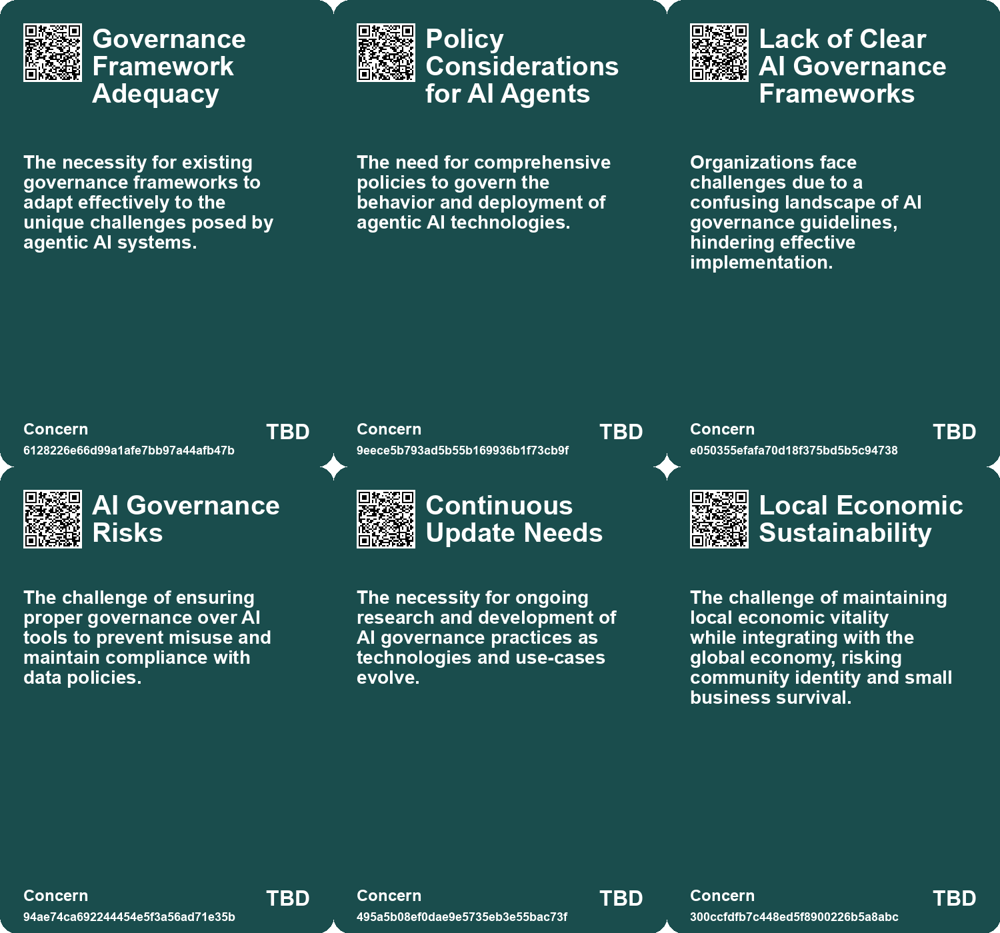
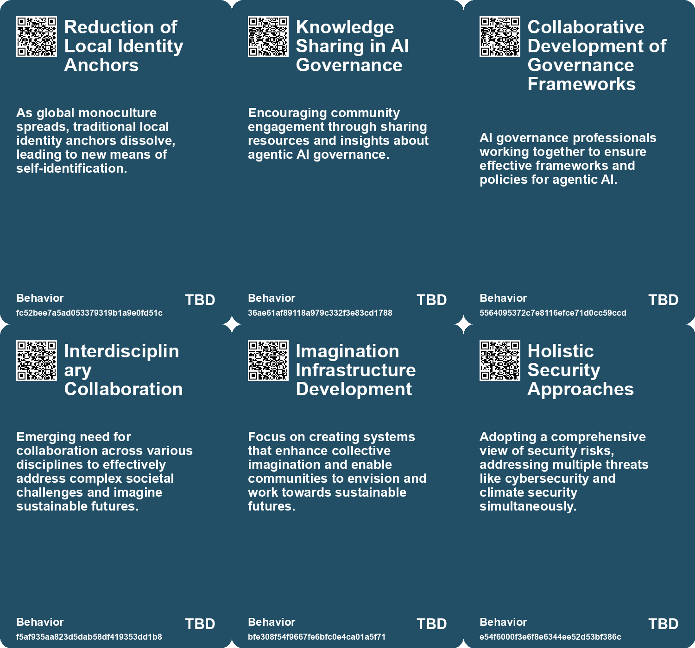
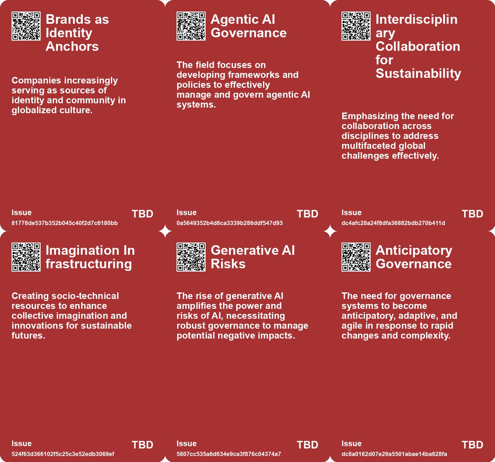
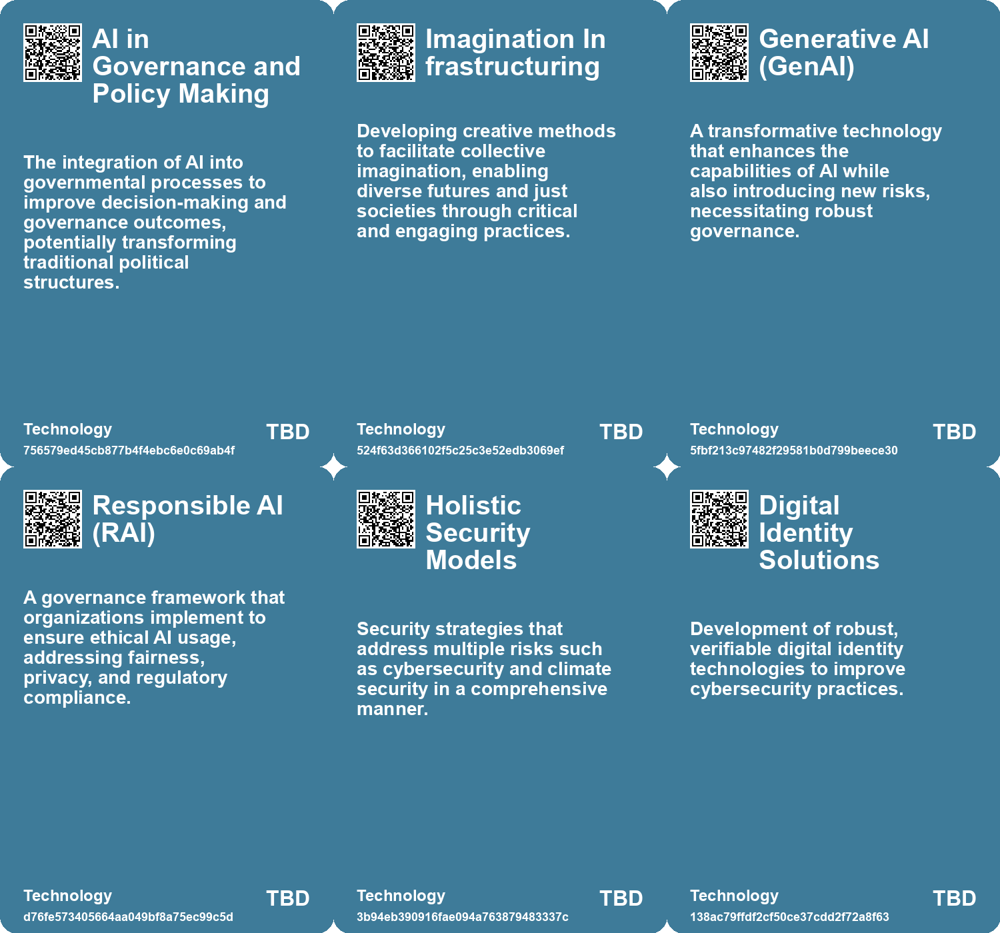

# *Topic*: Holistic Identity Governance

# Summary

The evolving landscape of artificial intelligence (AI) governance is a central theme across various discussions. Organizations are increasingly urged to establish robust AI governance frameworks to address concerns such as bias, privacy, and cybersecurity. The Responsible AI Institute emphasizes the need for oversight and compliance with emerging regulations, while companies like Microsoft are implementing governance measures to ensure safe AI adoption. Best practices in AI governance include CEO involvement and monitoring high-risk applications, which can help organizations navigate the complexities of AI technology.

Design and governance also play a crucial role in shaping customer experiences, both in physical spaces and digital platforms. The concept of Calm Technology advocates for design choices that prioritize user self-governance, enhancing usability and functionality. This approach is essential as organizations strive to create products that provide long-term value to customers, reflecting a growing awareness of the impact of design on user interactions.

The future of work is another significant theme, with experts predicting a shift towards a care-based economy and regenerative industries. Building new skills will be vital for individuals to thrive in this evolving landscape. Public and private sector collaboration is essential to maximize opportunities, emphasizing the importance of adaptability, creativity, and lifelong learning. Governments are encouraged to support future-ready talent through dialogue and problem-solving initiatives.

The emergence of the 'symbolic economy' highlights a shift in consumer behavior, where purchases reflect personal values rather than mere utility. Brands are increasingly seen as moral authorities, shaping identities and communities in a world where trust in traditional institutions is waning. This trend underscores the importance of narratives and brand engagement in modern consumption.

Technological innovation, particularly in AI, raises concerns about individual autonomy and the potential for manipulation. Critics argue for a balanced approach to AI development that prioritizes human well-being and dignity. The discourse around AI governance must consider the ethical implications of technology and its impact on society.

Local government devolution and data sharing are critical for improving community services. The potential of data collaboration can drive positive change, particularly in areas like care and sustainability. Policymakers are encouraged to rethink operating models and safeguard personal data to enhance service delivery.

Finally, the challenges posed by cybersecurity are increasingly pressing. The Biden administration's national cybersecurity strategy aims to strengthen the country's defenses against cyber threats, particularly from adversaries like China. Legislation to hold companies accountable for software security is a key component of this strategy, reflecting a growing recognition of the need for robust cybersecurity measures in an interconnected world.

# Seeds

|    | name                                            | description                                                                                          | change                                                                                                              | 10-year                                                                                                     | driving-force                                                                                                          |
|---:|:------------------------------------------------|:-----------------------------------------------------------------------------------------------------|:--------------------------------------------------------------------------------------------------------------------|:------------------------------------------------------------------------------------------------------------|:-----------------------------------------------------------------------------------------------------------------------|
|  0 | Cultural Monoculture                            | A globally connected culture is leading to a uniformity in consumer behavior and identity signaling. | Transition from local cultural identities to global monocultural consumption patterns.                              | Global brands will become the primary identity anchors for individuals in diverse cultures.                 | The accessibility of information and products worldwide diminishes regional distinctions.                              |
|  1 | Increased Focus on Agentic AI Governance        | A rise in awareness and resources dedicated to agentic AI governance.                                | Transition from general AI governance to specific frameworks for agentic AI.                                        | Potentially distinct and comprehensive governance frameworks regulating diverse AI agents emerge.           | The rapid advancement of autonomous AI capabilities necessitating new governance frameworks.                           |
|  2 | Emerging Educational Resources in AI Governance | Creation of accessible materials for understanding agentic AI governance.                            | Shift from complex academic literature to user-friendly educational resources.                                      | Widespread educational resources supporting informed decision-making within AI governance.                  | The need for broader understanding of AI governance among professionals and the public.                                |
|  3 | Collaboration Among AI Governance Entities      | Increased collaboration among various institutions and organizations in AI governance.               | Emerging partnerships between academia, industry, and governments in AI governance efforts.                         | Stronger alliances lead to cohesive, global standards for agentic AI governance.                            | The complexity of AI governance issues prompting multi-disciplinary solutions.                                         |
|  4 | Integration of AI with Corporate Governance     | Connecting AI governance with existing corporate governance structures is becoming essential.        | Moving from isolated AI initiatives to integrated governance that aligns with corporate values and risk management. | Organizations may see a more holistic approach to governance, enhancing overall decision-making processes.  | The recognition that AI impacts all aspects of business operations necessitates integration with corporate governance. |
|  5 | Holistic Security Approaches                    | A comprehensive view of security addressing multiple threats simultaneously.                         | Moving from siloed security measures to integrated strategies that consider diverse risks.                          | In 10 years, holistic security will be essential for businesses, creating new job roles in risk management. | The evolving landscape of global risks necessitating a unified approach to security.                                   |
|  6 | Digital Identity Solutions                      | Efforts to implement robust digital identity solutions are part of the strategy.                     | Shift from traditional identity verification methods to more secure digital identity frameworks.                    | Digital identity solutions may become standard, enhancing security and trust online.                        | The need for secure and verifiable identities in an increasingly digital world.                                        |
|  7 | Holistic Security Approaches                    | A comprehensive view of security addressing multiple threats simultaneously.                         | Moving from siloed security measures to integrated strategies that consider diverse risks.                          | In 10 years, holistic security will be essential for businesses, creating new job roles in risk management. | The evolving landscape of global risks necessitating a unified approach to security.                                   |
|  8 | Data Integration and Governance                 | Governments are improving data integration and governance practices.                                 | Transitioning from siloed data to integrated data for better decision-making.                                       | In 10 years, data integration may enable real-time insights and proactive governance.                       | The necessity for informed policy-making and operational efficiency motivates this shift.                              |
|  9 | Citizen Assemblies for Long-Term Thinking       | Use of citizen assemblies to incorporate long-term perspectives in policy-making.                    | Shift from traditional political processes to more inclusive, long-term focused decision-making.                    | Citizen assemblies may become a standard practice for addressing complex issues like climate change.        | Desire for more democratic and participatory governance models.                                                        |

# Concerns

|    | name                                   | description                                                                                                                                             |
|---:|:---------------------------------------|:--------------------------------------------------------------------------------------------------------------------------------------------------------|
|  0 | Governance Framework Adequacy          | The necessity for existing governance frameworks to adapt effectively to the unique challenges posed by agentic AI systems.                             |
|  1 | Policy Considerations for AI Agents    | The need for comprehensive policies to govern the behavior and deployment of agentic AI technologies.                                                   |
|  2 | Lack of Clear AI Governance Frameworks | Organizations face challenges due to a confusing landscape of AI governance guidelines, hindering effective implementation.                             |
|  3 | AI Governance Risks                    | The challenge of ensuring proper governance over AI tools to prevent misuse and maintain compliance with data policies.                                 |
|  4 | Continuous Update Needs                | The necessity for ongoing research and development of AI governance practices as technologies and use-cases evolve.                                     |
|  5 | Local Economic Sustainability          | The challenge of maintaining local economic vitality while integrating with the global economy, risking community identity and small business survival. |
|  6 | Data Privacy and Protection            | Sharing personal data across local authorities raises significant privacy concerns, requiring robust safeguards to protect citizen identities.          |
|  7 | Digital Feudalism                      | User autonomy is compromised in digital platforms due to implicit governance that prioritizes engagement over usability and customer needs.             |
|  8 | Governance Blind Spots                 | Designers may overlook the behavioral aspects of governance, resulting in alienating structures that do not meet diverse user needs.                    |
|  9 | Representation of Future Generations   | The challenge of ensuring that the interests of future generations are represented in today's political and decision-making processes.                  |

# Cards

## Concerns

## Behaviors

## Issue

## Technology

# Links

* [The Rise of the Symbolic Economy: Identity Through Consumption in a Globalized World](https://futures.kghosh.me/f836699644240599a4284c78b9ade0e1)
* [Recent Developments in AI Regulation and Technology: A Review of Key Initiatives and Critiques](https://futures.kghosh.me/a009ccdffaa59f53de56887aa19e6239)
* [Connecting Local Economies to Global Markets: Insights from Rosabeth Moss Kanter's Analysis](https://futures.kghosh.me/b0f9303688b3f36feafd21625c5d3461)
* [Balancing Creativity and Safety: Microsoft's Approach to Generative AI Governance](https://futures.kghosh.me/d4390e62256a0c3c19306c1ebc3ffb5b)
* [The UK's Declining Geopolitical Relevance and Elite Inaction: A Historical Perspective](https://futures.kghosh.me/ca555520973a0e8519ff854da1de4d88)
* [Unlocking the Potential of Local Data in UK Government Devolution for Enhanced Services](https://futures.kghosh.me/715753b68e3f5ba36be643d1ded0de93)
* [The Threat of Authoritarian Intelligence: A Call for Responsible AI Development](https://futures.kghosh.me/0ba4fa557cd2aae4760bd7a2abca844e)
* [Transforming Warfare: The Role of Uncrewed Systems in Modern Military Strategy](https://futures.kghosh.me/df83d0064f88153a92b016bc412f6b97)
* [Establishing Responsible AI Governance: A Guide for Organizations in an Evolving Landscape](https://futures.kghosh.me/fab122d29aed97045e0cc1ea77bdef44)
* [Future of Work: Embracing Opportunities and Adapting to Change Over the Next 50 Years](https://futures.kghosh.me/a601d356f6c81dbc065229f13e92c3f8)
* [Biden Administration Unveils New Cybersecurity Strategy to Combat Growing Threats](https://futures.kghosh.me/1eaefdcf11b24d5f443b5f4e7645e0a5)
* [Institute for Sustainable Worlds: A Catalyst for Social Change and Imagination](https://futures.kghosh.me/08e55fc0d90249b2ec84db7f4da5a0a0)
* [Free 'Agentic AI Governance Breakdown' Offers Key Insights for Effective Governance in AI](https://futures.kghosh.me/477fe069fada8abbc9715b5b648e5c1f)
* [Navigating Decision-Making Challenges in an AI-Driven World: The Need for AAA Traits](https://futures.kghosh.me/c474eac8117547a89cac2c805652df9c)
* [The Role of Future Generations Commissioners in Climate Action and Policy Making](https://futures.kghosh.me/32228bbf929d81d39a1808dd9b7c4493)
* [Navigating AI Governance: Building Trust and Compliance in a Complex Landscape](https://futures.kghosh.me/ae5781502d3793bed9753abfaaae817c)
* [Understanding Polarization: Healing Our Relationship with Technology and Embracing Diverse Perspectives](https://futures.kghosh.me/c1bb890337ef382bfaa5720c9fd05134)
* [Exploring Cookies, Supply Chains, and Future Challenges in Technology and Consumption](https://futures.kghosh.me/fa27e27bdec01712d582ab0f61c95bac)
* [From Household Gods to Machine Gods: The Evolution of Human Dependence on Idols and AI](https://futures.kghosh.me/fb6ff31e43cd6fac10f799bcee562946)
* [Russell Vought's Ideological War Against Government and the Rise of the Addiction Economy](https://futures.kghosh.me/619829bd081d7da919912e4f63d2549c)
* [Future of Work: Embracing Opportunities and Adapting to Change Over the Next 50 Years](https://futures.kghosh.me/56ddb45deabcdc8b707c7647270e101d)
* [Design as Governance: Lessons from a Coffee Shop Experience on User-Centric Design](https://futures.kghosh.me/2587a142b15645727d2adbee3539d4de)
* [Global Government Reforms: Advancements in Efficiency through Digital Transformation and AI](https://futures.kghosh.me/3f295c6c0c9af1ecd24bfa22b6ef6b47)