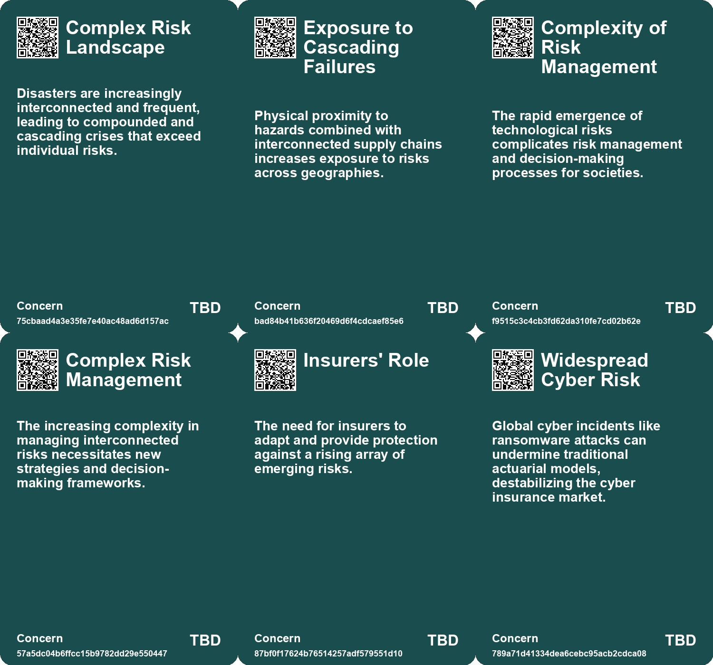
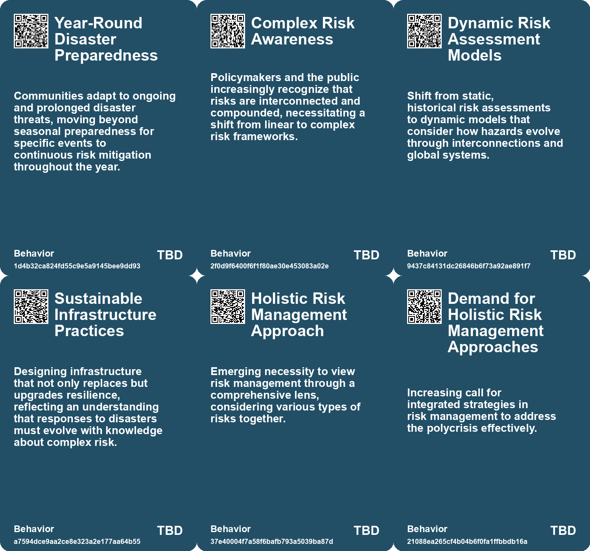
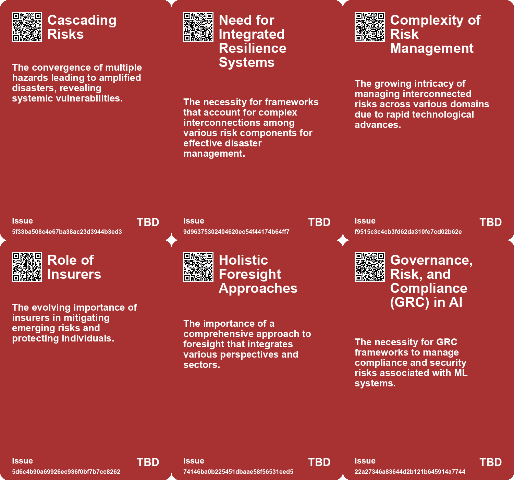
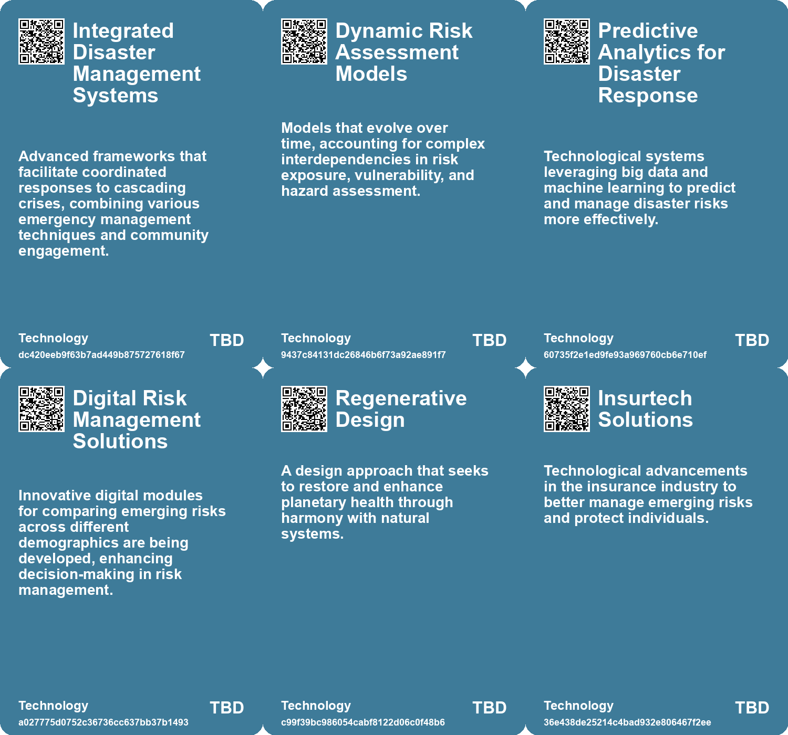

# *Topic*: Holistic Risk Management

# Summary

The evolving nature of global risks is increasingly complex, with climate change consistently identified as the foremost concern. Reports indicate that climate change, alongside geopolitical instability and cybersecurity threats, is reshaping the risk landscape. Social fragmentation is intensifying vulnerabilities, leading to a decline in public confidence regarding authorities' preparedness to manage these challenges. The insurance sector is recognized as a critical player in mitigating these risks, emphasizing the need for a holistic approach to risk management that prioritizes local solutions.

Technological advancements, particularly in artificial intelligence, are both a source of concern and a potential solution. Organizations are adopting strategic foresight methodologies, such as scenario planning, to navigate uncertainties driven by climate change and rapid technological shifts. Generative AI is emerging as a tool to enhance contingency planning, addressing traditional shortcomings in scenario development. However, the responsible use of AI is paramount, with organizations employing red teams to assess risks and ensure compliance with security standards.

The climate crisis is further exacerbated by human activities, particularly in the context of wildfires and food security. Increasing temperatures and prolonged dry spells are heightening the risk of wildfires, especially in regions like California and southeast Australia. Simultaneously, climate change poses significant threats to global food systems, with the potential for simultaneous harvest failures leading to price spikes and food insecurity. The need for better preparation and understanding of these risks is critical.

Water management is another pressing issue, with projections indicating that 3.5 billion people will live in water-scarce areas by 2025. Technological solutions, such as early warning systems and process automation, are being deployed to enhance water efficiency and promote a circular economy. Strategic planning and real-time data access are essential for effective resource management.

The future of work is anticipated to be shaped by emerging technologies and cultural transformations. Experts predict abundant opportunities for individuals, emphasizing the importance of building new skills to thrive in the evolving economy. Sectors such as regenerative industries and localized knowledge exchanges are expected to create significant job potential. Governments and organizations are encouraged to prioritize collaboration, lifelong learning, and tech literacy to support future-ready talent.

Ethical considerations in corporate governance are increasingly under scrutiny. The prevalence of corporate scandals highlights the need for strong ethical cultures and effective leadership to prevent moral failures. Organizations are urged to foster open dialogue and implement robust ethics programs to maintain integrity.

Finally, the concept of regenerative design is gaining traction as a means to restore planetary health. This approach emphasizes the need for ethical responsibility in ecological actions and promotes harmonious coexistence between human and natural systems. Nature-based solutions are being recognized as vital in addressing the climate crisis, particularly in preserving natural capital and mitigating emissions. The integration of these principles into urban planning and development is essential for fostering a sustainable future.

# Seeds

|    | name                                    | description                                                                                        | change                                                                                                             | 10-year                                                                                                            | driving-force                                                                                                                           |
|---:|:----------------------------------------|:---------------------------------------------------------------------------------------------------|:-------------------------------------------------------------------------------------------------------------------|:-------------------------------------------------------------------------------------------------------------------|:----------------------------------------------------------------------------------------------------------------------------------------|
|  0 | Cascading Complex Risks                 | Interconnected disasters are increasingly leading to combined crises that amplify overall risks.   | Shift from isolated disaster responses to comprehensive strategies addressing interconnected crises.               | Developed regions will adapt frameworks to manage and mitigate cascading risks effectively.                        | Global systems' interdependence intensifies impacts from natural and human-made hazards.                                                |
|  1 | Failures in Traditional Risk Management | Current disaster management practices fail to account for the interrelated nature of modern risks. | Transition from fragmented responses to holistic, multi-hazard management strategies.                              | Policy shifts will integrate risk management across federal, state, and local levels for better outcomes.          | Increased frequency and severity of disasters demand updated management frameworks and methodologies.                                   |
|  2 | Recognition of Polycrisis Phenomenon    | The increasing interconnection of risks is seen as a new trend.                                    | Government and expert focus is shifting toward holistic management of intertwined risks rather than isolated ones. | In a decade, there may be systemic approaches to risk assessment that incorporate multiple, interconnected crises. | The acknowledgment of complex interrelations among various global threats drives the need for comprehensive risk management strategies. |
|  3 | Role of Insurers in Risk Management     | Insurers are increasingly seen as key players in managing emerging risks.                          | Transition from traditional views of insurance to proactive risk management roles.                                 | In ten years, insurance models may evolve to address new global risks comprehensively.                             | Growing need for protection against complex emerging risks and crises.                                                                  |
|  4 | Holistic Future Planning                | A comprehensive approach to future planning that considers long-term impacts of current decisions. | Move from short-term to long-term planning in organizational strategies.                                           | Organizations will prioritize long-term sustainability in all aspects of business planning.                        | The urgency of addressing future challenges compels businesses to adopt holistic planning.                                              |
|  5 | Framework for ML Security Assessment    | A structured framework for assessing risks in ML systems is being developed.                       | From ad-hoc assessments to a formalized framework guiding ML security evaluations.                                 | In 10 years, organizations will have comprehensive frameworks for continuous ML security assessments.              | The need for standardized security practices in the rapidly evolving field of machine learning.                                         |
|  6 | Complex Risk Modelling                  | The complexity of modelling wildfire risk due to various factors is increasing.                    | From simpler models to advanced, multifactorial risk assessments.                                                  | Development of sophisticated AI-based models for predicting wildfire behavior.                                     | Need for better risk assessment tools in insurance and disaster management.                                                             |
|  7 | Holistic Security Approaches            | A comprehensive view of security addressing multiple threats simultaneously.                       | Moving from siloed security measures to integrated strategies that consider diverse risks.                         | In 10 years, holistic security will be essential for businesses, creating new job roles in risk management.        | The evolving landscape of global risks necessitating a unified approach to security.                                                    |
|  8 | Evidence-Based Decision Making          | The emphasis on using data and evidence to inform investment decisions for flood risk management.  | Moving from intuition-based decisions to data-driven strategies for climate resilience.                            | Ten years from now, investment decisions may be predominantly based on comprehensive data analytics and modelling. | The increasing availability of data and technology to support informed decision making in environmental management.                     |
|  9 | Holistic Security Approaches            | A comprehensive view of security addressing multiple threats simultaneously.                       | Moving from siloed security measures to integrated strategies that consider diverse risks.                         | In 10 years, holistic security will be essential for businesses, creating new job roles in risk management.        | The evolving landscape of global risks necessitating a unified approach to security.                                                    |

# Concerns

|    | name                                         | description                                                                                                                          |
|---:|:---------------------------------------------|:-------------------------------------------------------------------------------------------------------------------------------------|
|  0 | Complex Risk Landscape                       | Disasters are increasingly interconnected and frequent, leading to compounded and cascading crises that exceed individual risks.     |
|  1 | Exposure to Cascading Failures               | Physical proximity to hazards combined with interconnected supply chains increases exposure to risks across geographies.             |
|  2 | Complexity of Risk Management                | The rapid emergence of technological risks complicates risk management and decision-making processes for societies.                  |
|  3 | Complex Risk Management                      | The increasing complexity in managing interconnected risks necessitates new strategies and decision-making frameworks.               |
|  4 | Insurers' Role                               | The need for insurers to adapt and provide protection against a rising array of emerging risks.                                      |
|  5 | Widespread Cyber Risk                        | Global cyber incidents like ransomware attacks can undermine traditional actuarial models, destabilizing the cyber insurance market. |
|  6 | Real-Time Risk Assessment Costs              | High costs and lengthy processes for real-time risk assessments can deter organizations from pursuing necessary insurance.           |
|  7 | Divided Preparedness for Divergent Scenarios | Lack of direction for preparing for multiple highly divergent scenarios simultaneously can leave organizations vulnerable.           |
|  8 | Integration Challenges                       | Tightly integrated ML systems may amplify risks if one component is compromised, affecting others in the pipeline.                   |
|  9 | Inadequate Risk Assessment Practices         | Organizations may not have sufficient methodologies to identify and mitigate risks associated with ML, leading to potential losses.  |

# Cards

## Concerns

## Behaviors

## Issue

## Technology

# Links

* [Navigating Information Overload: The Role of Knowledge Management and AI in Decision-Making](https://futures.kghosh.me/3e292858cf09bb02c3e254ede24744f6)
* [Resilience 2.0: A Strategic Foresight Report for the EU's Future Security and Growth](https://futures.kghosh.me/a4b221bd40d351c2ed13fa1bbbc74056)
* [Exploring Regenerative Design for Harmonious Coexistence with Nature](https://futures.kghosh.me/a1acb04c0f65f709ad6c8ce2f0946a51)
* [NVIDIA's AI Red Team Philosophy: Ensuring Responsible Machine Learning Development and Security Risks Assessment](https://futures.kghosh.me/f87bcfb74a4a1db0ac38bd573144fd59)
* [Enhancing Cyber Insurance Accessibility and Affordability Through AI Innovations](https://futures.kghosh.me/724dfbad882cc57ee4e3526f4f43327b)
* [Key Challenges and Innovations in Water Management for 2023 and Beyond](https://futures.kghosh.me/bb8e4477e434a4bdb0fc5236abd68436)
* [Emerging Global Risks: Climate Change, Geopolitical Tensions, and Technological Threats in 2025](https://futures.kghosh.me/c279f12eda98e732755a0f730b9d4d4b)
* [Navigating AI Governance: Building Trust and Compliance in a Complex Landscape](https://futures.kghosh.me/ae5781502d3793bed9753abfaaae817c)
* [Future of Work: Embracing Opportunities and Adapting to Change Over the Next 50 Years](https://futures.kghosh.me/a601d356f6c81dbc065229f13e92c3f8)
* [Future Risks Report 2025: Increasing Global Crises and Emerging Risks Analysis](https://futures.kghosh.me/c5ecb012c90eddae1d46c1137e384c86)
* [Future Risks Report 2024: Key Findings on Emerging Global Challenges](https://futures.kghosh.me/caf29de5522a914887f9653f8edfd0a6)
* [Enhancing Scenario Planning with Generative AI: Overcoming Traditional Limitations](https://futures.kghosh.me/eb3b989221a954bad78ff582adfacdba)
* [Navigating Decision-Making Challenges in an AI-Driven World: The Need for AAA Traits](https://futures.kghosh.me/c474eac8117547a89cac2c805652df9c)
* [Establishing Responsible AI Governance: A Guide for Organizations in an Evolving Landscape](https://futures.kghosh.me/fab122d29aed97045e0cc1ea77bdef44)
* [RIBA Launches Horizons 2034 to Foster Future-Focused Thinking in Architecture](https://futures.kghosh.me/c2abad74235592be57f8c06ae6f217d9)
* [Understanding Corporate Ethical Collapse: Key Signs and Preventive Measures](https://futures.kghosh.me/45854362019860740951c83df1c7122e)
* [Five Emerging Trends Transforming Business in the Coming Year](https://futures.kghosh.me/55bac03899915f25bf0b47fa4342472c)
* [Environment Agency Launches £52.5M Framework to Combat Climate Change and Flooding Risks](https://futures.kghosh.me/25ee4c74a450de58a35fc35c4e808f8f)
* [The Rising Threat of Wildfires and Bushfires Due to Climate Change and Human Activity](https://futures.kghosh.me/685e1aa9e1db8a94a4bb04cd27a1db86)
* [Reimagining Natural Capital: A Stock Option Approach for Ecological Sustainability](https://futures.kghosh.me/bf06142acab0ca8fd2ed4e9231f0c279)
* [Evolving Perspectives on Risk Management in the Context of Modern Disasters](https://futures.kghosh.me/cd4f6f65b2486d56699138cd2270044d)
* [Transforming Warfare: The Role of Uncrewed Systems in Modern Military Strategy](https://futures.kghosh.me/df83d0064f88153a92b016bc412f6b97)
* [Scaling Nature-based Solutions in Scotland: A Pathway to Climate Resilience](https://futures.kghosh.me/c7d3021c1b6298e7c47bc455cd7d8391)
* [Study Highlights Underestimated Risks of Simultaneous Harvest Failures Due to Climate Change](https://futures.kghosh.me/9bebaea9ed2c74b635c7ffbedc039556)
* [Future of Work: Embracing Opportunities and Adapting to Change Over the Next 50 Years](https://futures.kghosh.me/56ddb45deabcdc8b707c7647270e101d)