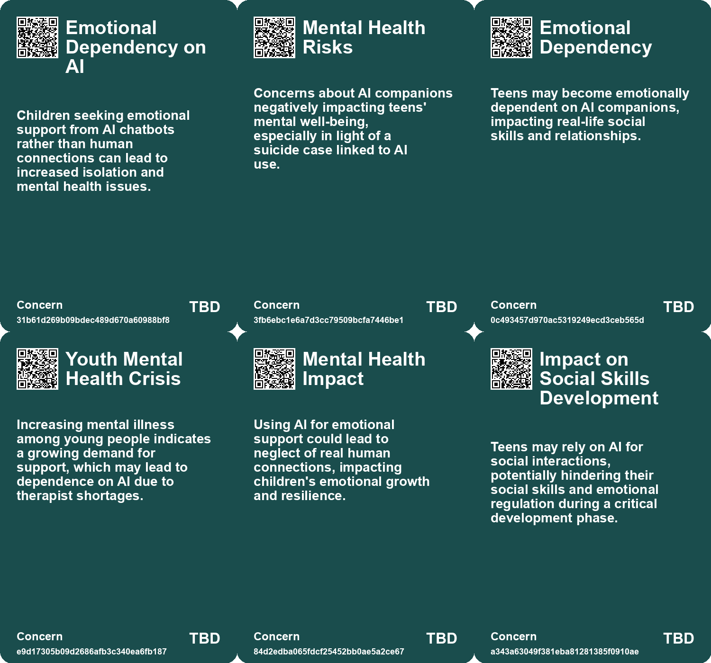
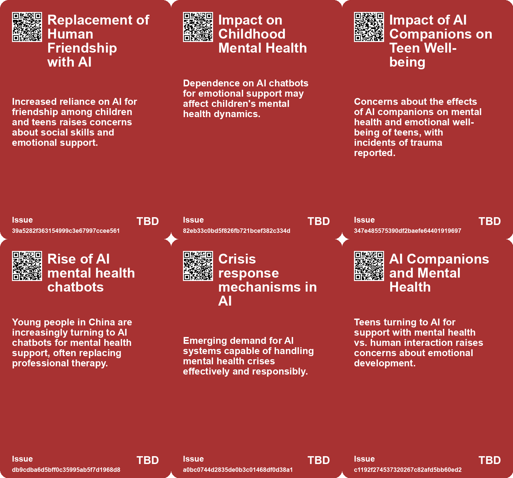
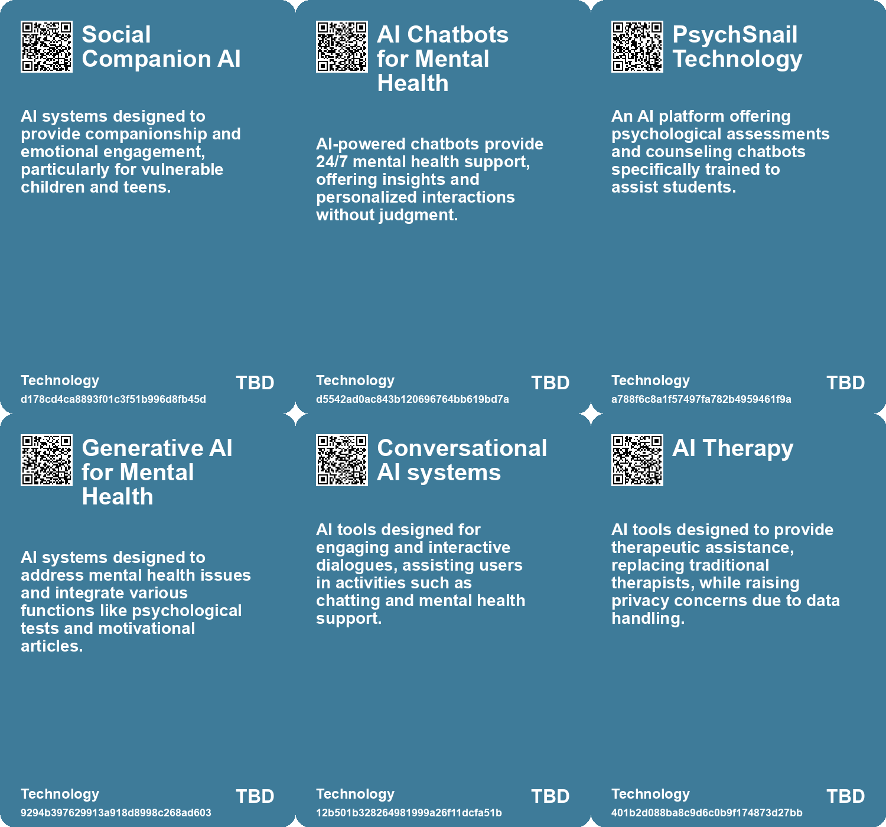

# *Topic*: Impact of AI on Youth Mental Health

# Summary

The integration of artificial intelligence (AI) into daily life is raising significant concerns about mental health and social interaction. Studies indicate that heavy usage of chatbots can lead to increased loneliness and emotional dependence, particularly among power users. This trend mirrors earlier findings related to social media, where individuals seeking emotional connections may turn to AI for companionship. Experts advocate for responsible design in chatbot technology to promote healthier user relationships and warn against business models that exploit loneliness.

In the realm of education and mental health, AI is being adopted to fill gaps left by budget cuts and labor shortages. While AI applications can provide support, they also risk depersonalizing care, particularly for those who cannot afford personalized human services. The reliance on AI for emotional support is growing, especially among young people in countries like China, where societal stigma and high therapy costs push them toward chatbots. However, the lack of regulatory frameworks raises ethical concerns about the potential for harm.

Children and teens are increasingly using AI chatbots for companionship, with many reporting that these interactions can feel as real as conversations with friends. This reliance on AI for social interaction raises alarms about the ability of young users to distinguish between human and machine interactions. Surveys show that while many teens enjoy using AI companions, they still prefer human relationships, indicating that technology is not entirely replacing real-life connections.

The impact of AI on the job market is complex and evolving. Recent studies reveal a decline in employment for young workers in roles heavily exposed to AI, suggesting that entry-level positions are being automated. While some analysts argue that AI creates new opportunities, the need for retraining in more complex roles is becoming evident. Business schools are adapting by integrating AI into their curriculums, preparing graduates for a workforce increasingly influenced by technology.

Public opinion on AI is shifting, with growing concern about its implications for privacy, creativity, and personal relationships. Surveys indicate that a majority of Americans are more worried than excited about AI's rise, particularly regarding its impact on job security and social connections. This skepticism is echoed by experts who call for increased regulation and transparency in AI development to address biases and ensure responsible use.

The cognitive effects of AI reliance are also under scrutiny. Studies suggest that overdependence on AI tools may lead to cognitive atrophy, diminishing critical thinking skills among users. This trend raises concerns about the long-term implications for younger generations who are increasingly exposed to AI from an early age. Experts recommend promoting skepticism towards AI to mitigate cognitive decline and encourage independent problem-solving.

Finally, the potential of AI to drive social good is being explored, particularly in relation to the United Nations Sustainable Development Goals. While AI has the capacity to address issues like poverty and education, challenges such as funding disparities and biases must be addressed to harness its full potential. Collaboration among stakeholders is essential to ensure that AI initiatives contribute positively to society and do not exacerbate existing inequalities.

# Seeds

|    | name                                        | description                                                                                                                     | change                                                                                                           | 10-year                                                                                                                       | driving-force                                                                                          |
|---:|:--------------------------------------------|:--------------------------------------------------------------------------------------------------------------------------------|:-----------------------------------------------------------------------------------------------------------------|:------------------------------------------------------------------------------------------------------------------------------|:-------------------------------------------------------------------------------------------------------|
|  0 | AI Companions as Emotional Support          | The use of AI companions for emotional support is a growing trend among teens.                                                  | A shift from seeking emotional support from peers to AI-driven solutions.                                        | AI may become a normalized source of emotional support, altering traditional support mechanisms.                              | Increased emotional needs among teens in a fast-paced, digitally connected world.                      |
|  1 | Rise of AI Chatbots for Mental Health       | Young people in China are increasingly opting for AI chatbots over professional therapists for mental health issues.            | Shift from traditional therapy to AI chatbot-based solutions for mental health support.                          | AI chatbots could become standard practice for mental health assistance, potentially reducing the stigma of seeking help.     | The rising prevalence of mental health issues and the accessibility of AI technology drive this shift. |
|  2 | Inequity in Mental Health Access            | Rural areas in China have significantly fewer mental health professionals compared to urban centers, increasing reliance on AI. | Growing disparity in mental health service availability between urban and rural populations met by AI solutions. | AI might provide critical access to mental health resources where traditional options remain lacking.                         | Inequities in healthcare access drive innovation towards AI as a solution for underserved populations. |
|  3 | AI for Emotional Support in Children        | AI tools like chatbots being used to provide emotional support and companionship to children.                                   | Shifting from direct parental support to reliance on AI for emotional companionship.                             | Children may prefer interactions with AI over peers or adults, affecting their social development.                            | The need for companionship in single-child families and busy parental schedules drives this trend.     |
|  4 | Normalizing AI therapy                      | People are increasingly using AI chatbots for mental health support.                                                            | Shift from traditional therapist consultations to reliance on AI for mental health help.                         | AI chatbots might become the primary tool for millions seeking mental health support.                                         | The growing demand for accessible mental health resources and affordability.                           |
|  5 | Avoidance of AI Trust in Children Education | Younger users exhibit more dependency on AI, risking critical thinking skill development.                                       | Shift from traditional learning methods to reliance on AI, especially among children and teens.                  | Schools may adopt stricter guidelines on personal AI use to encourage independent learning for students.                      | Parental concerns over children’s dependency on AI tools shaping educational policies.                 |
|  6 | AI's impact on cognitive development        | Uncertainty about how AI tools affect children's cognitive skills and learning processes.                                       | From established educational practices to new, untested methods involving AI.                                    | Long-term studies may reveal both positive and negative effects of AI usage on cognitive development.                         | The rapid advancement of AI technologies outpacing our understanding of their effects on learning.     |
|  7 | Social-Emotional AI in Education            | AI is now being integrated into educational systems to assist with emotional connections.                                       | Shift from human-led emotional support in education to AI-assisted emotional and educational guidance.           | Ten years from now, AI will play a central role in educational emotional support, with varying accessibility.                 | The increasing need for personalized education and support, especially in under-resourced areas.       |
|  8 | AI Companions for Mental Health             | AI tools are being used to track and support mental health, especially in underserved areas.                                    | From traditional mental health services to AI-driven support systems for mental well-being.                      | AI companions could become common in mental health support, though effectiveness may vary widely.                             | Rising mental health issues combined with a shortage of human therapists and support.                  |
|  9 | Generative AI in Therapy                    | Generative AI is increasingly being integrated into therapeutic practices for personalized mental health support.               | Transitioning from rule-based therapy tools to dynamic, generative AI-driven therapeutic conversations.          | Mainstream therapy could incorporate generative AI, providing tailored support and better access for underserved populations. | The need for more accessible and personalized mental health resources.                                 |

# Concerns

|    | name                                       | description                                                                                                                                                               |
|---:|:-------------------------------------------|:--------------------------------------------------------------------------------------------------------------------------------------------------------------------------|
|  0 | Emotional Dependency on AI                 | Children seeking emotional support from AI chatbots rather than human connections can lead to increased isolation and mental health issues.                               |
|  1 | Mental Health Risks                        | Concerns about AI companions negatively impacting teens' mental well-being, especially in light of a suicide case linked to AI use.                                       |
|  2 | Emotional Dependency                       | Teens may become emotionally dependent on AI companions, impacting real-life social skills and relationships.                                                             |
|  3 | Youth Mental Health Crisis                 | Increasing mental illness among young people indicates a growing demand for support, which may lead to dependence on AI due to therapist shortages.                       |
|  4 | Mental Health Impact                       | Using AI for emotional support could lead to neglect of real human connections, impacting children's emotional growth and resilience.                                     |
|  5 | Impact on Social Skills Development        | Teens may rely on AI for social interactions, potentially hindering their social skills and emotional regulation during a critical development phase.                     |
|  6 | Generational Dependency on AI              | Younger individuals may develop dependency on AI for critical tasks, impacting their learning and retention of information.                                               |
|  7 | Cognitive Development Effects              | The unknown impact of AI usage on children's cognitive development raises significant concerns.                                                                           |
|  8 | Deterioration of Mental Health Among Youth | The intersection of social media and AI chatbot usage might contribute to an overall decline in youth mental well-being, as highlighted by rising mental health concerns. |
|  9 | Loneliness and Vulnerability               | Underlying issues like loneliness could drive individuals toward addictive AI, creating a cycle that exacerbates mental health problems.                                  |

# Cards

## Concerns

## Behaviors

## Issue

## Technology

# Links

* [Navigating the Dual Impact of Generative AI on Business and Society](https://futures.kghosh.me/aa811fcb765939e9ead9542accd38a5b)
* [The Cognitive Costs of AI: Are We Sacrificing Our Mental Abilities for Convenience?](https://futures.kghosh.me/09e7abde98ff0c5590320545c5b20679)
* [Rising Use of AI Chatbots Among Children Sparks Concerns Over Friendship and Mental Health Risks](https://futures.kghosh.me/7a05cd6af09dd8274d14be8e04717bac)
* [The Future of Jobs in Advertising: Impact of AI and Automation by 2030](https://futures.kghosh.me/54491b49e9fd2c6eab777dca0ba67e76)
* [AI's Impact on Society: Job Displacement and the Need for Retraining](https://futures.kghosh.me/cf119665e47c7434e3e3c54dbbc585e3)
* [The Disruption of Education by AI: An Intellectual Crisis](https://futures.kghosh.me/9457c5541dba02968735056f18b53dc3)
* [Americans' Concerns Over AI: A Survey on Awareness and Impact](https://futures.kghosh.me/5520519c298548d844b7b95efa18ca81)
* [The Rise of AI Chatbots in China's Mental Health Landscape: Opportunities and Risks](https://futures.kghosh.me/70e9fcd5fc1d2dd04ae1df8b2628194d)
* [The Impact of AI on Employee Workload and Burnout: A Global Study's Findings and Recommendations](https://futures.kghosh.me/24919a630ace2f95d7dc1ec6e455b419)
* [Addressing the Risks of AI Companionship: Addiction, Regulation, and Human Dignity](https://futures.kghosh.me/4611565d14a05789e2efc6fafc563f58)
* [The Dangers of Relying on AI Chatbots for Companionship and Connection](https://futures.kghosh.me/729afaa8f8699c39b8d4b175d032fa41)
* [Harnessing AI for Social Good: Opportunities and Challenges in Achieving the UN SDGs](https://futures.kghosh.me/0d88d49818819d335d12f792275fde97)
* [The Impact of AI in Chinese Education: Promise and Concerns](https://futures.kghosh.me/5374f9d1b84138f1c928c0e7fd727877)
* [Contrasting Views on AI: Public Concerns vs. Expert Optimism and Advocacy for Regulation](https://futures.kghosh.me/e2ce30b29c24272c98349d7a121be360)
* [Exploring the Risks of Heavy Chatbot Use on Mental Health and Social Interactions](https://futures.kghosh.me/424dd84488f34cb7d735777fe34b584e)
* [The Transformative Impact of AI on Jobs, Reality, and Economic Value Distribution](https://futures.kghosh.me/17cff4adea214f71c7a5eed15307b0e7)
* [Exploring Emotional Connections with Future Selves Through AI Chatbots: Insights from MIT's Future You Project](https://futures.kghosh.me/65cf4789fa6df6abeb1b059b62894622)
* [Study Reveals Teens Use AI Companions but Prefer Real Human Interaction](https://futures.kghosh.me/43924b182fd09138a38642c6f8ecb9d8)
* [Lawsuit Filed Against Character.AI Over Harmful Chatbot Interactions with Minors](https://futures.kghosh.me/3c9ee72ba2741eaef9d4b922a8dd4670)
* [Exploring the Transformative Impact of AI on Education and Children's Learning Experiences](https://futures.kghosh.me/adf886a1b9fd74281e0a43c3e7c70def)
* [Unraveling AI's Impact on Young Job Seekers: A Complex Debate](https://futures.kghosh.me/e32d04126d9c10f116be0ec272bd7a20)
* [The Role of Social-Emotional AI: Bridging or Widening the Gap in Human Connection?](https://futures.kghosh.me/8e191b6221caa8d9f27b19268ab8a048)
* [Understanding Teen Engagement with AI Companions: Insights from a Common Sense Media Study](https://futures.kghosh.me/fae9ccaa96ac4f072579a8b1dee9fa4a)
* [Public Concern About Artificial Intelligence Grows Amid Mixed Opinions on Its Impact](https://futures.kghosh.me/c3876ee8e1b4e0d9e38edf15caaa5521)
* [The Dangers of AI Reliance: Cognitive Atrophy and Critical Thinking Decline in Knowledge Workers](https://futures.kghosh.me/682e04f0b543e67738d8ffbb84fc50dd)
* [The Privacy Risks of AI Therapy in a Surveillance State](https://futures.kghosh.me/2a493a65f2f08559abd0c9f29816530b)
* [How AI Could Transform Work-Life Balance and Job Dynamics in Various Industries](https://futures.kghosh.me/bc5ff4c170f1f63b34eb7ca70775d8d7)
* [The Integration of AI in Business School Curriculums to Enhance Graduate Competitiveness](https://futures.kghosh.me/bc232b227c806ac26adf2b99fa4cff9d)