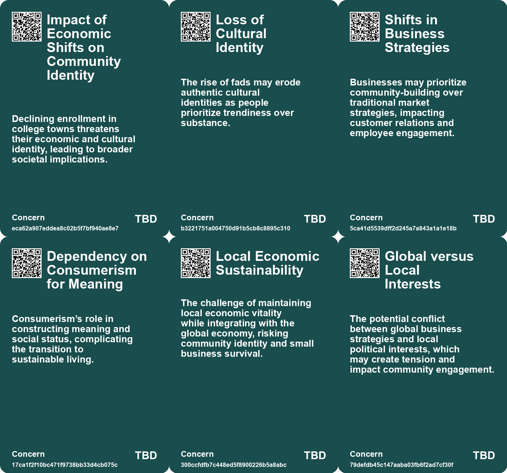
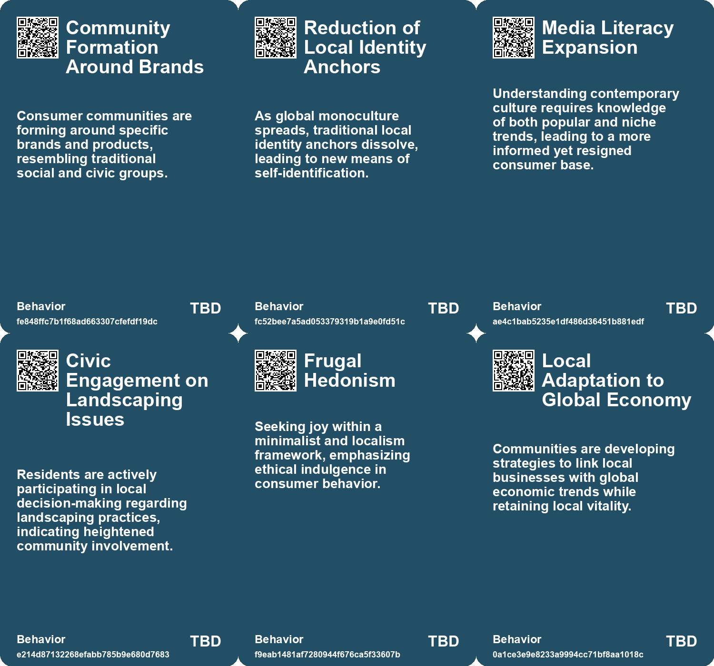
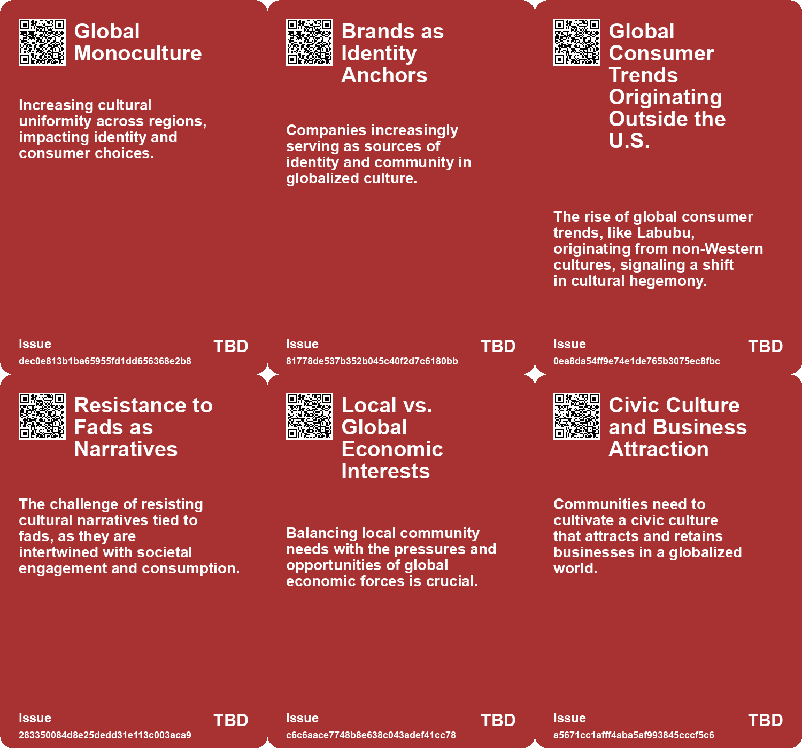
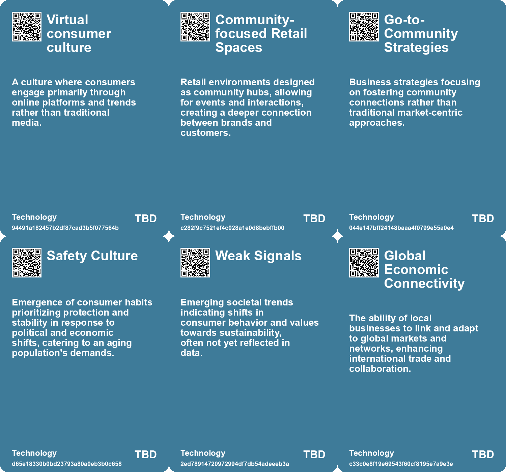

# *Topic*: Impact of Consumer Culture on Local

# Summary

The intersection of local and global economies is a recurring theme, emphasizing the need for businesses to adapt to both global standards and local community needs. Successful regions are those that connect effectively to the global economy while fostering local vitality. This balance is crucial for cities and states aiming to thrive in an increasingly interconnected world.

Cultural shifts are evident as society grapples with the implications of technology and changing consumer behaviors. The rise of short-lived trends, particularly those influenced by social media, reflects a broader cultural stagnation. These trends often prioritize trendiness over substance, leading to a fragmented identity among consumers. As younger generations push back against established systems, grassroots movements are expected to gain momentum, signaling a desire for authenticity and deeper connections.

The evolution of public spaces in urban environments highlights a decline in social interactions over the past few decades. Factors such as technology and demographic changes have led to faster-paced lifestyles, reducing opportunities for meaningful socialization. Urban design that encourages diverse interactions is essential for fostering community cohesion and social capital.

The concept of alternative hedonism emerges as a response to the challenges posed by consumer capitalism and climate change. This approach advocates for lifestyle changes that prioritize well-being and shared consumption over materialism. The need for a cultural shift towards sustainability and the reclamation of public spaces is emphasized as a way to combat the negative effects of excessive consumption.

The rise of the symbolic economy illustrates how consumption is increasingly tied to identity performance. Brands are now seen as moral authorities, shaping personal values and community identities. This shift reflects a broader trend where traditional institutions are losing trust, and consumers are seeking deeper narratives and engagement with brands.

Retail is undergoing a transformation as Gen Z consumers prefer physical shopping experiences that offer social engagement. Malls are evolving into vibrant social hubs, integrating dining and entertainment to attract younger shoppers. This shift underscores the importance of creating immersive experiences that cater to the desires of a generation seeking connection amid digital fatigue.

The phenomenon of loneliness is emerging as a significant public health crisis, particularly among younger generations. The need for social connections is paramount for mental and emotional well-being. Initiatives aimed at fostering community interactions, such as campaigns in supermarkets, highlight the potential for businesses to play a role in addressing social isolation.

As the landscape of land ownership continues to evolve, the implications for social equity and development are profound. Historical shifts in land tenure reflect broader societal changes, necessitating innovative approaches to land reform. Addressing these challenges is crucial for promoting equitable outcomes in a rapidly changing world.

The concept of "greenhindering" reveals how societal agents can perpetuate unsustainable practices, complicating efforts to foster sustainability. This contrasts with greenwashing, as the normalization of wasteful behaviors poses a significant challenge to environmental progress. Accountability from media, companies, and influencers is essential to shift social norms towards more sustainable practices.

# Seeds

|    | name                              | description                                                                                            | change                                                                                            | 10-year                                                                                            | driving-force                                                                                  |
|---:|:----------------------------------|:-------------------------------------------------------------------------------------------------------|:--------------------------------------------------------------------------------------------------|:---------------------------------------------------------------------------------------------------|:-----------------------------------------------------------------------------------------------|
|  0 | Cultural Monoculture              | A globally connected culture is leading to a uniformity in consumer behavior and identity signaling.   | Transition from local cultural identities to global monocultural consumption patterns.            | Global brands will become the primary identity anchors for individuals in diverse cultures.        | The accessibility of information and products worldwide diminishes regional distinctions.      |
|  1 | Revival of Traditional Values     | A cultural movement emphasizing family values and regional pride.                                      | Shift from modern individualism to a collective focus on traditional values.                      | Future society might prioritize community and traditional values over individualism.               | A response to chaos and uncertainty, seeking grounding in tradition.                           |
|  2 | Shift in Cultural Production Base | Cultural production is moving away from the U.S. to online-first trend-driven cultures.                | A transition from U.S.-centric cultural production to global, primarily online-driven production. | Expect to see a diverse range of cultural outputs originating from non-Western countries.          | The rise of social media platforms promoting rapid trend cycles and global connectivity.       |
|  3 | Shift in Business Strategies      | Businesses adopting community-focused strategies over traditional market tactics.                      | Move from transactional relationships to fostering community and connection.                      | Companies prioritizing community engagement will enhance brand loyalty and customer satisfaction.  | Recognition of the importance of authentic relationships between brands and consumers.         |
|  4 | Local-Global Business Linkages    | Communities are adapting to connect local businesses with global markets.                              | Shift from isolated local economies to integrated global networks.                                | In ten years, local economies may thrive through global partnerships and collaborations.           | The need for local businesses to compete on a global scale drives this change.                 |
|  5 | Civic Culture Development         | Communities are focusing on creating cultures that attract global companies.                           | Transition from prioritizing local interests to fostering a global business-friendly environment. | In ten years, cities may be designed to cater to global businesses while retaining local identity. | The competition for global investment pushes communities to enhance their civic appeal.        |
|  6 | Greenhindering in Advertising     | Companies normalize unsustainable practices in advertising, reinforcing wasteful consumer culture.     | Transition from responsible advertising to promoting unsustainable products as the norm.          | Advertising may continue to reflect and reinforce unsustainable consumer behaviors as acceptable.  | Profit maximization drives companies to use familiar, yet unsustainable, imagery in marketing. |
|  7 | Impact of Social Norms            | Social norms are influenced by media and socialization agents, affecting behaviors around consumption. | Changing from critical awareness of consumption to accepting it as a societal norm.               | Social norms may perpetuate unsustainable behaviors, hindering progress toward sustainability.     | Agents of socialization shape public attitudes toward consumption and sustainability.          |
|  8 | Community-Centric Retail Spaces   | Brands are expected to collaborate with local artists and communities.                                 | Transition from generic store designs to community-focused, unique retail experiences.            | Retail spaces will be local art and culture hubs, reflecting community values and identity.        | Gen Z's increasing awareness of social responsibility and community involvement.               |
|  9 | Influencer Culture Impact         | Influencers are increasingly shaping retail choices and driving foot traffic to malls.                 | Retail experiences are now designed to be visually appealing for social media sharing.            | Influencers will play a central role in marketing strategies and mall designs.                     | The rise of social media and the desire for shareable experiences.                             |

# Concerns

|    | name                                            | description                                                                                                                                             |
|---:|:------------------------------------------------|:--------------------------------------------------------------------------------------------------------------------------------------------------------|
|  0 | Impact of Economic Shifts on Community Identity | Declining enrollment in college towns threatens their economic and cultural identity, leading to broader societal implications.                         |
|  1 | Loss of Cultural Identity                       | The rise of fads may erode authentic cultural identities as people prioritize trendiness over substance.                                                |
|  2 | Shifts in Business Strategies                   | Businesses may prioritize community-building over traditional market strategies, impacting customer relations and employee engagement.                  |
|  3 | Dependency on Consumerism for Meaning           | Consumerism’s role in constructing meaning and social status, complicating the transition to sustainable living.                                        |
|  4 | Local Economic Sustainability                   | The challenge of maintaining local economic vitality while integrating with the global economy, risking community identity and small business survival. |
|  5 | Global versus Local Interests                   | The potential conflict between global business strategies and local political interests, which may create tension and impact community engagement.      |
|  6 | Civic Culture Development                       | The need for communities to foster a civic culture that attracts and retains businesses, which is crucial for local resilience in a globalized economy. |
|  7 | Community Engagement Expectations               | Gen Z expects brands to connect with their local communities and understand their social impact.                                                        |
|  8 | Cultural Loss and Memory                        | The fading of community memories, traditions, and cultural landmarks as rural populations decrease poses a social concern.                              |
|  9 | Shifts in Retail Experience                     | Malls transforming into experiential destinations raises concerns about sustainability and maintaining authenticity.                                    |

# Cards

## Concerns

## Behaviors

## Issue

## Technology

# Links

* [The Impact of Urban Design on Public Space Usage and Social Interaction](https://futures.kghosh.me/2f31d87f3801765f9645d092cadf513a)
* [The Revival of Malls: How Gen Z is Reshaping Shopping Destinations](https://futures.kghosh.me/3c27a71013ec18bf55a80ae739105bd7)
* [Understanding 'Failure to Launch': The Cultural and Economic Struggles of Young American Men](https://futures.kghosh.me/c6a3cc9fe503779d0ad2ec2c66aa7fb8)
* [Exploring the Modern Entertainment Landscape and Its Societal Implications](https://futures.kghosh.me/c5c2c794f1426e6e307a9df3f9ff61f6)
* [The Cultural Clash Over Lawns: Conformity Versus Biodiversity in Suburban America](https://futures.kghosh.me/8cdf7f73ff6f9ea3a14a213a28f8b25e)
* [Oma's Soep Launches Campaign to Combat Loneliness Through Grocery Store Interactions](https://futures.kghosh.me/d73cef2dc5d458ba6b4a61dff2997181)
* [Addressing the Social Fitness Crisis: The Need for Connection in Modern Society](https://futures.kghosh.me/9aeeedec876dadd7664c8ac15af0b90e)
* [Understanding Greenhindering: A Greater Challenge Than Greenwashing for Sustainability](https://futures.kghosh.me/9c017d08a10b9c2409d54a3113acfe44)
* [Exploring the Cultural and Economic Impact of Fads Like Labubu in the 21st Century](https://futures.kghosh.me/be6b5b1f64e2a032cdef6417b4b84a7e)
* [Connecting Local Economies to Global Markets: Insights from Rosabeth Moss Kanter's Analysis](https://futures.kghosh.me/b0f9303688b3f36feafd21625c5d3461)
* [Exploring the Consequences of Abandonment in Rural Bulgaria and Nature's Response](https://futures.kghosh.me/9ab2903416b01dac618d7f3b93ab6dfa)
* [Understanding Gen Z Shopping Preferences: The Shift Towards Community and Experience in Retail](https://futures.kghosh.me/adc1258885aa937c5350875662ee892f)
* [Unlocking the Potential of Local Data in UK Government Devolution for Enhanced Services](https://futures.kghosh.me/715753b68e3f5ba36be643d1ded0de93)
* [Exploring Kate Soper’s Vision for Sustainable Living in 'Post-Growth Living'](https://futures.kghosh.me/71cbf82b85b58a6675d05308f8e1759e)
* [Exploring Urban Change and Psychological Responses in Austin's Transformation](https://futures.kghosh.me/e825171606432c71606dc78b9bf86eee)
* [The Rise of Cultural Oligopoly: A Call for Diversity in Media](https://futures.kghosh.me/317aa39c987f1d5e3509dbc5e50c8bb3)
* [The Rise of the Symbolic Economy: Identity Through Consumption in a Globalized World](https://futures.kghosh.me/f836699644240599a4284c78b9ade0e1)
* [Nostalgia for Simplicity: The Burden of Infinite Choice in Modern Life](https://futures.kghosh.me/7b316ebe449187b79e519a8c6d12a2cd)
* [Evolving Perspectives on Risk Management in the Context of Modern Disasters](https://futures.kghosh.me/cd4f6f65b2486d56699138cd2270044d)
* [Exploring the Cultural Trends Shaping Consumer Behavior in 2026](https://futures.kghosh.me/05be870bd93b19dc0390539dc923ae7b)
* [Exploring the Historical and Future Transformations of Land Ownership Worldwide](https://futures.kghosh.me/68a769f0b8d15a4efd8f8136482b9660)
* [The Impact of Conservation Areas on Climate Action and Housing Energy Efficiency in England](https://futures.kghosh.me/fc01cd22da2aa0a185a6c1bb2a7e1145)
* [Future Trends Post-2024: Declining Democracies and Emerging Cultural Shifts](https://futures.kghosh.me/bd1b01636b1360716b5951e1cac42724)
* [Understanding the Casino Economy: How Financialization Shapes Our Lives and Beliefs](https://futures.kghosh.me/f4ca03eca53c5d3b3ccc3dd5b1a9aeb4)
* [The Shift from E-commerce to In-Person Retail Experiences in Fashion](https://futures.kghosh.me/2db44f1091d08697f6f525dbe8740189)