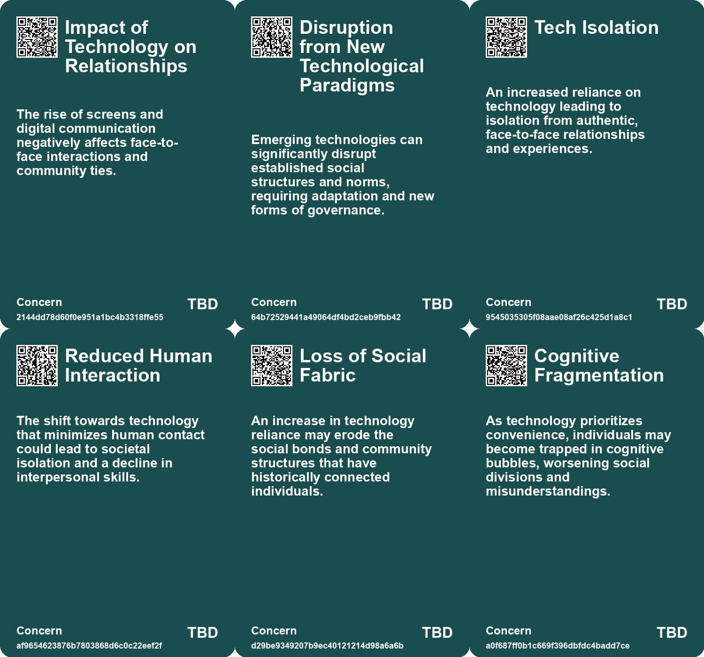
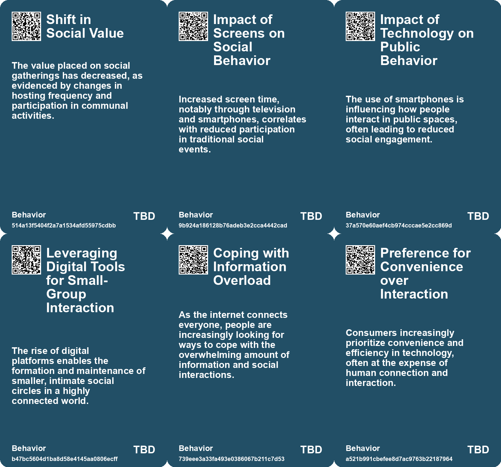
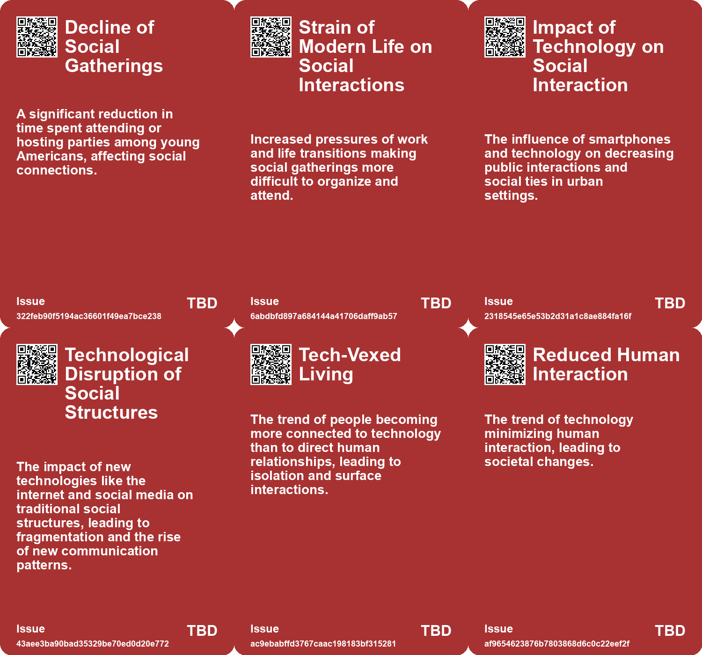
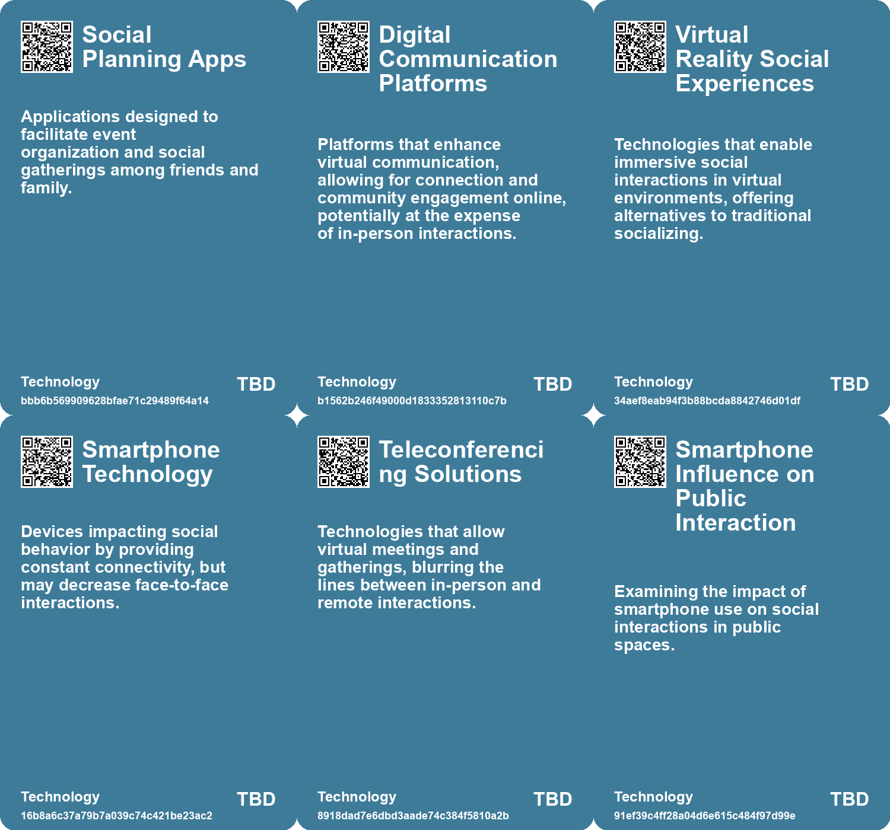

# *Topic*: Impact of Technology on Gatherings

# Summary

A significant decline in socializing among Americans, particularly among young people, has been observed over the past two decades. Participation in parties has dropped by 70% for those aged 15 to 24, with only 4.1% of Americans attending or hosting parties in 2023. This trend reflects broader social changes, including increased solitude, changing family dynamics, and the pervasive influence of technology. The rise of smartphones and screens has altered social interactions, leading to fewer gatherings and a decline in alcohol consumption among youth.

Technology's role in reducing human interaction is becoming increasingly evident. Innovations such as online shopping, AI, and automated services are designed to eliminate human contact, raising concerns about empathy and understanding in society. While these advancements offer convenience, they risk undermining the essence of human connection and cooperation.

The rapid pace of technological change is striking, with transformative technologies like artificial intelligence poised to reshape society. The importance of being informed about these technologies and their implications is emphasized, as is the need for active participation in discussions about their future. The nostalgia for simpler times, where socializing relied on limited options, highlights the drawbacks of constant connectivity and limitless choices. The author reflects on the value of curated experiences and the need for deeper engagement with fewer distractions.

In the workplace, the rise of meetings has replaced creativity as the essential skill. Despite remote work increasing connectivity, productivity has suffered due to the overwhelming number of meetings. This paradox raises questions about whether advancements in communication technology have truly made work more efficient or simply intensified the time spent discussing work rather than accomplishing it.

A growing public health crisis of loneliness has emerged, with 58% of Americans reporting feelings of isolation. This crisis has significant implications for mental and emotional well-being, comparable to smoking and obesity. The need for social connections is paramount, prompting calls for technology companies to create apps focused on social health metrics and for businesses to implement community-centric strategies.

The impact of technology on society is multifaceted, with both negative and positive aspects. While technology has contributed to climate change, it is also seen as a key to addressing the crisis. A shift towards qualitative growth, rather than mere quantity, is necessary as the global population begins to decline. This transition aligns technological advancement with environmental health.

The integration of augmented reality into urban life presents both opportunities and challenges. While it can enhance citizen engagement and accessibility, risks such as privacy erosion and social inequities must be managed through proactive governance. The future of wearable technology also promises to revolutionize social interactions, blending seamlessly into daily routines and creating new hybrid realities.

As governments strive to boost efficiency and productivity, the role of artificial intelligence becomes increasingly significant. AI technologies are being utilized to streamline processes and improve performance, but challenges remain in scaling these applications and addressing talent shortages. The combination of technology, policy, and process tools has the potential to drive deep productivity improvements in government.

Finally, the concept of Dunbar's Number suggests that humans can maintain stable social relationships with about 150 individuals. As communities grow beyond this limit, maintaining social cohesion becomes challenging. Modern technologies disrupt social structures, often eroding trust. This prompts a retreat to smaller, high-trust communities as a potential solution for sustaining social connections in the digital age.

# Seeds

|    | name                                     | description                                                                                               | change                                                                                                | 10-year                                                                                                      | driving-force                                                                                   |
|---:|:-----------------------------------------|:----------------------------------------------------------------------------------------------------------|:------------------------------------------------------------------------------------------------------|:-------------------------------------------------------------------------------------------------------------|:------------------------------------------------------------------------------------------------|
|  0 | Technological Influence on Relationships | Smartphones and social media reshape social interactions, prioritizing virtual over physical connections. | Shift from in-person gatherings to online interactions and parasocial relationships.                  | In a decade, social media may dominate social lives, diminishing face-to-face relationships.                 | Digital connectivity alters the nature of community engagement and personal interactions.       |
|  1 | Impact of Technology on Public Life      | Technology, particularly smartphones, affects social interactions in public spaces.                       | From engaged socialization in public spaces to distracted and isolated individuals.                   | Potentially, public spaces could turn into areas less conducive to social interaction and engagement.        | The integration of technology into daily life detracts from in-person interactions.             |
|  2 | Tech-vexed Living                        | The rise of technology leads to isolation from real human connections.                                    | Shift from physical social interactions to technology-mediated relationships.                         | Greater emotional disconnection in relationships, leading to societal challenges.                            | Increased reliance on technology for communication and entertainment.                           |
|  3 | Collective Awareness of Isolation        | Increased understanding of the isolation brought by technology.                                           | Shift from a connected world through technology to recognizing its isolating effects.                 | A society increasingly striving to counteract the isolating effects of technology.                           | Desire for authentic connections in a digital age.                                              |
|  4 | Decline of Traditional Social Norms      | Technology reduces the necessity for understanding and navigating social niceties.                        | Shift from complex social interactions to simplified, technology-mediated experiences.                | Future generations may struggle with basic social skills due to reduced human interaction.                   | The convenience of technology diminishes the need for interpersonal skills and interactions.    |
|  5 | Rise of Virtual Collaboration Tools      | Increased reliance on digital communication platforms for work-related discussions.                       | Shift from face-to-face interactions to virtual meetings and communications.                          | Virtual collaboration tools will dominate, potentially reducing the need for physical office spaces.         | The ongoing evolution of technology facilitating remote work and communication.                 |
|  6 | Artificial Intelligence in Work Culture  | Anticipation of AI tools reducing unnecessary meetings and increasing productivity.                       | From traditional meeting-heavy culture to an AI-enhanced workflow.                                    | AI may streamline communications, leading to a more efficient work environment.                              | Advancements in AI technology and its integration into workplace practices.                     |
|  7 | Cyborg Lifestyles                        | Society is increasingly blending physical and digital identities through technology.                      | Transition from individual identities to interconnected, technology-enhanced lifestyles.              | Social interactions will evolve as digital identities and real-life personas merge.                          | The desire for deeper connections in a hyper-connected world.                                   |
|  8 | Social Acceptance of Surveillance        | Increased comfort with technology being omnipresent in our lives.                                         | Society moving from apprehension about surveillance to acceptance of it as a norm.                    | Surveillance technology will blend into daily life, raising ethical questions.                               | The normalization of technology in personal and public spaces.                                  |
|  9 | Citizen Surveillance                     | Individuals are increasingly using personal devices to record and document events around them.            | Recording and sharing personal experiences is shifting from private to public, increasing visibility. | In ten years, citizen-led documentation may become a norm, affecting social interactions and accountability. | The rise of social media encourages individuals to document and share their lives in real time. |

# Concerns

|    | name                                        | description                                                                                                                                      |
|---:|:--------------------------------------------|:-------------------------------------------------------------------------------------------------------------------------------------------------|
|  0 | Impact of Technology on Relationships       | The rise of screens and digital communication negatively affects face-to-face interactions and community ties.                                   |
|  1 | Disruption from New Technological Paradigms | Emerging technologies can significantly disrupt established social structures and norms, requiring adaptation and new forms of governance.       |
|  2 | Tech Isolation                              | An increased reliance on technology leading to isolation from authentic, face-to-face relationships and experiences.                             |
|  3 | Reduced Human Interaction                   | The shift towards technology that minimizes human contact could lead to societal isolation and a decline in interpersonal skills.                |
|  4 | Loss of Social Fabric                       | An increase in technology reliance may erode the social bonds and community structures that have historically connected individuals.             |
|  5 | Cognitive Fragmentation                     | As technology prioritizes convenience, individuals may become trapped in cognitive bubbles, worsening social divisions and misunderstandings.    |
|  6 | Social Dependency on Tech                   | As society becomes more dependent on wearable technologies, there may be adverse effects on social interactions and personal relationships.      |
|  7 | Technological Dependency                    | The growing reliance on technology may diminish critical thinking, focus, and personal autonomy, leading to a 'sickness' in human relationships. |
|  8 | Rapid Innovation Fatigue                    | The fast pace of technological advancements may lead to public fatigue or dismissal of the importance of these changes.                          |
|  9 | Loss of Authentic Interactions              | The prevalence of technology has diminished authentic, spontaneous social interactions and reliance on personal connections.                     |

# Cards

## Concerns

## Behaviors

## Issue

## Technology

# Links

* [The Impact of Urban Design on Public Space Usage and Social Interaction](https://futures.kghosh.me/2f31d87f3801765f9645d092cadf513a)
* [Exploring Technology's Impact: Insights from Michael Harris on Life Before and After the Internet](https://futures.kghosh.me/357214f864be2592efced782b93b25b3)
* [Design as Governance: Lessons from a Coffee Shop Experience on User-Centric Design](https://futures.kghosh.me/2587a142b15645727d2adbee3539d4de)
* [Navigating Climate Change: The Role of Technology and the Shift from Quantity to Quality Growth](https://futures.kghosh.me/e44687e103abb436ad5980ac2d518f47)
* [The Augmented City: Balancing Innovation and Challenges in Urban AR Integration](https://futures.kghosh.me/79a156bc6b74667af8c3e7309844d739)
* [Technologies of Hope: Navigating Pandemic Innovations and Their Societal Implications](https://futures.kghosh.me/d44d0c046d2ee3330a2d40cfccdfc0d3)
* [Addressing the Social Fitness Crisis: The Need for Connection in Modern Society](https://futures.kghosh.me/9aeeedec876dadd7664c8ac15af0b90e)
* [The Future of Wearable Technology: Merging Cyborg Lifestyles with Daily Life](https://futures.kghosh.me/a81c4775b91ccd0db3e1b84da893ac6f)
* [Google's Transition to Remote Work and the Evolution of Information Security](https://futures.kghosh.me/7a34820852cf03cbbdb1fb75ca3b629c)
* [Exploring Future Construction Technologies: Key Innovations Transforming the Industry](https://futures.kghosh.me/e1b7298d69221a6360cc9325c1096933)
* [The Rise of Meetings Over Creativity in White-Collar Work](https://futures.kghosh.me/32eca597c052201ad0a6a0907cf127d2)
* [The Impact of the Internet and AI on Human Cognition and Productivity](https://futures.kghosh.me/652fc7ec1f422e931bc5a9ba8011650a)
* [Understanding the 70% Decline in Socializing Among Young Americans and Its Implications](https://futures.kghosh.me/1a5b8b25f7be96861c5704e6a36429e4)
* [Global Government Reforms: Advancements in Efficiency through Digital Transformation and AI](https://futures.kghosh.me/3f295c6c0c9af1ecd24bfa22b6ef6b47)
* [The Diminishing Role of Human Interaction in Modern Technology and Its Societal Implications](https://futures.kghosh.me/31491f2b50e77cc7c45e541a9b2915d7)
* [Embracing Technology and Talent in the Age of AI: Key Insights from Rishad Tobaccowala](https://futures.kghosh.me/338c551fe29e9fb73aa8d412dc77788e)
* [The Unprecedented Pace of Technological Change and Its Future Implications](https://futures.kghosh.me/9d6464c96612c9edb19cf4f53bd26faf)
* [The Impact of Ubiquitous Surveillance Cameras on Society and Accountability](https://futures.kghosh.me/7790ecd5c227bae024a54ac5725ac978)
* [Teens Embrace Older Tech Amid School Smartphone Bans, Sparking Nostalgia and Socialization](https://futures.kghosh.me/2c00b2575d94795c1ea258a68f0cf8ea)
* [Exploring the Integration of AI in Daily Life and Business Innovations in Tech Trends 2025](https://futures.kghosh.me/0b0e772667a3f74d6364a71eb20bc913)
* [Five Emerging Trends Transforming Business in the Coming Year](https://futures.kghosh.me/55bac03899915f25bf0b47fa4342472c)
* [Nostalgia for Simplicity: The Burden of Infinite Choice in Modern Life](https://futures.kghosh.me/7b316ebe449187b79e519a8c6d12a2cd)
* [Emerging Signals for the Future: Trends in Play, Community, and Science](https://futures.kghosh.me/e5ff0f0fff5787f47270376cae318af3)
* [Understanding Dunbar's Number: The Limits of Human Social Relationships and Modern Technology's Impact](https://futures.kghosh.me/a93d70ec87432da167666ebc18542edd)
* [The Importance of Authentic Experiences and Awe in a Tech-Dominated World](https://futures.kghosh.me/ce43c884bb8eefce9268368190014a48)
* [Understanding Polarization: Healing Our Relationship with Technology and Embracing Diverse Perspectives](https://futures.kghosh.me/c1bb890337ef382bfaa5720c9fd05134)