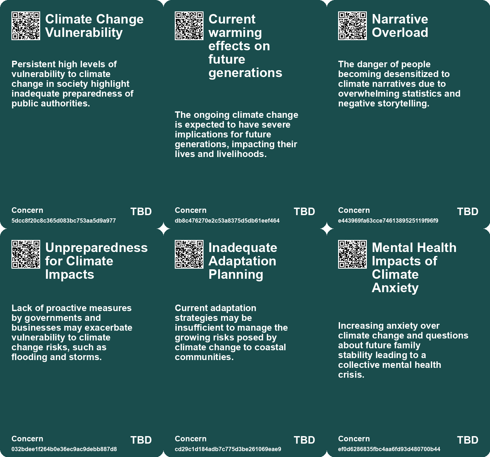
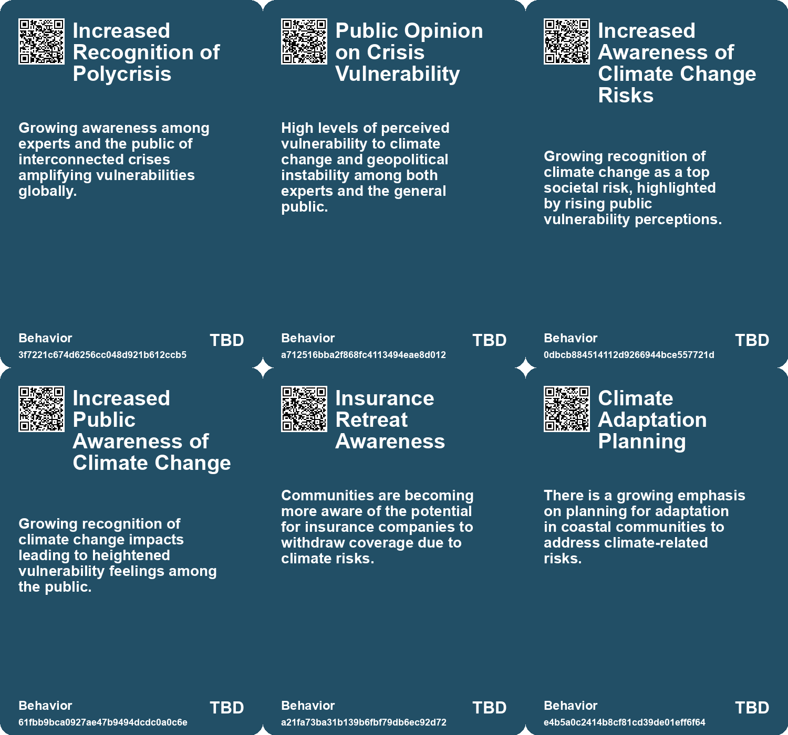
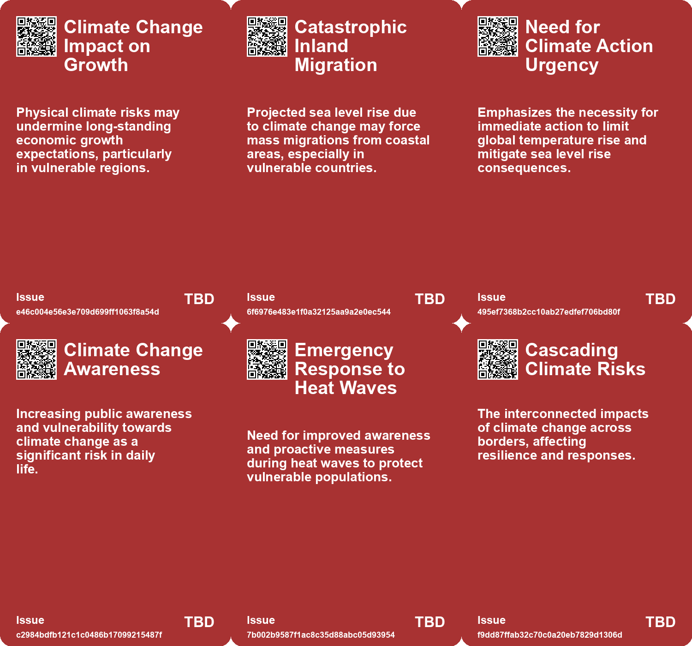
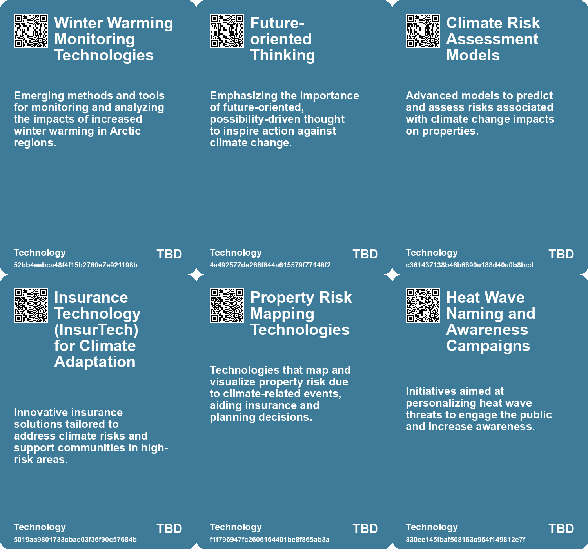

# *Topic*: Increased Awareness of Climate Risks

# Summary

Climate change remains a dominant theme, consistently highlighted as the leading global risk. Reports indicate that its effects are increasingly severe, impacting food systems, health, and urban environments. Studies show that climate change is linked to rising temperatures, extreme weather events, and the potential for catastrophic harvest failures in major food-producing regions. The urgency to address these challenges is underscored by warnings about the consequences of inaction, including food insecurity and civil unrest.

The interconnectedness of risks is another critical theme. Disasters such as wildfires and hurricanes are no longer seen as isolated events but as part of a complex risk landscape. This perspective emphasizes the need for a modernized risk framework that considers the interdependence of systems and the vulnerabilities of communities. The cascading effects of climate change, including social fragmentation and increased migration, further complicate the situation, necessitating a holistic approach to risk management.

Technological advancements, particularly in artificial intelligence, present both opportunities and challenges. While AI has the potential to drive economic growth, it also raises concerns about job displacement and ethical governance. The tech sector's environmental impact is significant, with calls for companies to adopt sustainable practices and evaluate their carbon footprints. The rise of "greenhushing," where companies refrain from publicizing climate goals, reflects a growing tension between transparency and the fear of backlash over greenwashing.

Urban resilience is increasingly vital as cities face the dual challenges of climate change and population growth. Initiatives to plant trees in urban heat islands, such as those in Las Vegas, aim to mitigate extreme temperatures and improve community well-being. The importance of local solutions is echoed in discussions about enhancing healthcare systems to cope with changing demographics and the aging population.

The role of public authorities and institutions is under scrutiny as trust in their ability to manage these complex risks declines. Reports indicate a significant sense of vulnerability among the public, with calls for stronger leadership and proactive strategies to address emerging threats. The insurance sector is identified as a crucial player in risk mitigation, emphasizing the need for collaboration between various stakeholders.

Economic implications of climate change and technological advancements are also a focal point. Scenarios predicting future economic growth highlight the potential for both positive and negative outcomes, depending on how society navigates these challenges. The concept of natural capital is introduced as a way to internalize the value of ecosystems in economic decision-making, suggesting a shift towards more sustainable practices.

Finally, the importance of community resilience and social trust is emphasized throughout the discourse. Building strong community ties is essential for adapting to climate-related challenges. Personal narratives and relatable stories are seen as powerful tools for inspiring action and fostering a collective response to the climate crisis. The need for solidarity and cooperation is paramount as societies confront the multifaceted repercussions of a warming world.

# Seeds

|    | name                                                  | description                                                                                         | change                                                                                                           | 10-year                                                                                                                  | driving-force                                                                                                         |
|---:|:------------------------------------------------------|:----------------------------------------------------------------------------------------------------|:-----------------------------------------------------------------------------------------------------------------|:-------------------------------------------------------------------------------------------------------------------------|:----------------------------------------------------------------------------------------------------------------------|
|  0 | Erosion of Trust in Public Authorities                | Public confidence in authorities' ability to manage risks like climate change is declining.         | Declining public trust from a view of competent governance to growing skepticism.                                | In a decade, this erosion may lead to increased civil unrest and demand for alternative governance structures.           | Recurring failures in crisis management contributing to public distrust.                                              |
|  1 | Growing Public Vulnerability to Climate Change        | Increased public awareness of vulnerability to climate change impacts.                              | Shift from low awareness to higher public concern regarding climate change.                                      | In ten years, climate change may drive significant policy changes and lifestyle adaptations.                             | Increased visibility of climate-related disasters and scientific communication.                                       |
|  2 | Rising Awareness of Climate Risks                     | Growing awareness of climate risks is influencing property values and insurance availability.       | Public perception of coastal property risks is shifting from undervalued to recognized as high-risk investments. | Property values in coastal areas may decline significantly as awareness of climate risks increases over the next decade. | Media coverage and research on climate impacts are raising awareness about the vulnerabilities of coastal properties. |
|  3 | Adaptation Planning Imperatives                       | Communities are being urged to focus on adaptation planning in light of climate risks.              | The focus is shifting from reactionary measures to proactive adaptation strategies for coastal communities.      | In the next ten years, we may see comprehensive adaptation plans implemented in vulnerable areas to mitigate risks.      | The need for sustainable and resilient community planning in the face of climate change is becoming critical.         |
|  4 | Rising Tech Emissions Awareness                       | Increased awareness of tech sector's contribution to global emissions.                              | Shift from neglecting tech's environmental impact to actively addressing and reducing it.                        | Tech companies will prioritize sustainability in their operations and product designs.                                   | Growing public and regulatory pressure to mitigate climate change and reduce carbon footprints.                       |
|  5 | Cascading climate impacts                             | Recognition of interconnected climate risks affecting multiple regions simultaneously.              | Shift from isolated climate responses to integrated, cross-border strategies.                                    | Increased collaboration between countries to manage transboundary climate challenges.                                    | Urgent need for countries to address shared climate vulnerabilities collaboratively.                                  |
|  6 | Arctic security concerns                              | Growing awareness of security implications due to climate change in the Arctic region.              | From neglect of Arctic issues to proactive international policies addressing climate impact.                     | Development of comprehensive Arctic governance frameworks focused on climate resilience.                                 | Geopolitical interests and environmental changes prompting a reevaluation of Arctic policies.                         |
|  7 | Vulnerability scenarios in the Euphrates-Tigris basin | Exploration of different vulnerability conditions for climate-affected regions.                     | From a one-size-fits-all approach to tailored strategies for specific regional vulnerabilities.                  | Enhanced resilience strategies based on specific conditions and opportunities in the basin.                              | Need for targeted responses to diverse impacts of climate change on local communities.                                |
|  8 | Crisis response and development partnerships          | Emerging strategies combining crisis management with sustainable development in climate risk areas. | Shift from reactive crisis management to proactive development partnerships.                                     | Sustainable development integrated into climate crisis response frameworks across regions.                               | Recognition that development and climate resilience are interconnected for long-term stability.                       |
|  9 | Growing Awareness of Climate Havens                   | Places previously considered safe are now facing their own climate challenges.                      | From the perception of certain areas as climate havens to recognizing vulnerability everywhere.                  | Many areas previously thought of as climate havens may face new, severe climate threats.                                 | The unpredictable nature of climate change affecting even historically stable regions.                                |

# Concerns

|    | name                                          | description                                                                                                                                 |
|---:|:----------------------------------------------|:--------------------------------------------------------------------------------------------------------------------------------------------|
|  0 | Climate Change Vulnerability                  | Persistent high levels of vulnerability to climate change in society highlight inadequate preparedness of public authorities.               |
|  1 | Current warming effects on future generations | The ongoing climate change is expected to have severe implications for future generations, impacting their lives and livelihoods.           |
|  2 | Narrative Overload                            | The danger of people becoming desensitized to climate narratives due to overwhelming statistics and negative storytelling.                  |
|  3 | Unpreparedness for Climate Impacts            | Lack of proactive measures by governments and businesses may exacerbate vulnerability to climate change risks, such as flooding and storms. |
|  4 | Inadequate Adaptation Planning                | Current adaptation strategies may be insufficient to manage the growing risks posed by climate change to coastal communities.               |
|  5 | Mental Health Impacts of Climate Anxiety      | Increasing anxiety over climate change and questions about future family stability leading to a collective mental health crisis.            |
|  6 | Insufficient Time for Transformation          | The urgency of the climate crisis necessitates immediate action; there is a risk of running out of time to implement critical changes.      |
|  7 | Crisis Response Integration                   | The need for integrating crisis response strategies with development initiatives to effectively tackle climate-related challenges.          |
|  8 | Increased Natural Disasters and Their Impact  | More frequent floods and extreme weather events signal escalating climate-related risks to urban and rural communities.                     |
|  9 | Unpredictable Side Effects of Climate Change  | Many unexpected consequences of climate change may emerge, impacting diverse aspects of life, like sports and leisure.                      |

# Cards

## Concerns

## Behaviors

## Issue

## Technology

# Links

* [Navigating the Climate Crisis: The Importance of Community and Social Trust in Adapting to Change](https://futures.kghosh.me/d1e5dc8cd0f7c34dede43f5429dded3d)
* [Project 2025's Threat to Free Weather Reporting and Climate Research in the U.S.](https://futures.kghosh.me/ea467a1851497f22b27624b1247d00e9)
* [Study Reveals Urban Heat Islands Cause Over 4% of Summer Deaths in Europe](https://futures.kghosh.me/ec1c43b587aed9d39c32678429620ce2)
* [Enhancing Airport Resilience to Climate Change: Strategies and Solutions for the Future](https://futures.kghosh.me/a6add16457f9bca667941b2ec045b485)
* [Reimagining Natural Capital: A Stock Option Approach for Ecological Sustainability](https://futures.kghosh.me/bf06142acab0ca8fd2ed4e9231f0c279)
* [Evolving Perspectives on Risk Management in the Context of Modern Disasters](https://futures.kghosh.me/cd4f6f65b2486d56699138cd2270044d)
* [The Cascading Consequences of Climate Change: A Call for Awareness and Resilience](https://futures.kghosh.me/7f30f2f7549b14f00211791717a8a342)
* [The Rising Threat of Wildfires and Bushfires Due to Climate Change and Human Activity](https://futures.kghosh.me/685e1aa9e1db8a94a4bb04cd27a1db86)
* [2023 Roadshow Highlights: Addressing Cascading Climate Risks and Policy Responses in Europe and Beyond](https://futures.kghosh.me/589c2c554219a6d4ae1ad0c9d1d75a21)
* [The Rise of 'Greenhushing': Companies Retreat from Public Climate Commitments](https://futures.kghosh.me/a808b73a65a5a8140b4fc5dd5845679b)
* [Insurance Companies Retreat as Climate Risks Increase in New Zealand Coastal Communities](https://futures.kghosh.me/7c4551fb2f96cce7c0264d6b1f50b669)
* [Future Economic Scenarios Shaped by AI and Climate Change: Insights from PwC](https://futures.kghosh.me/ff491e399856ef66ae24c238fd28e735)
* [Future Risks Report 2025: Increasing Global Crises and Emerging Risks Analysis](https://futures.kghosh.me/c5ecb012c90eddae1d46c1137e384c86)
* [Unprecedented Winter Warming in the Arctic: Svalbard's Transformation into the New Arctic](https://futures.kghosh.me/649b806947fd341124721c68c912c242)
* [Navigating Climate Change: The Need for Community Resilience and Social Trust](https://futures.kghosh.me/efa36dc9bd5ddc890866d4ab1e68e71f)
* [Exploring the Link Between Creativity and Climate Optimism for a Sustainable Future](https://futures.kghosh.me/1803433f32d1db4b39c9b6041650b939)
* [Resilience 2.0: A Strategic Foresight Report for the EU's Future Security and Growth](https://futures.kghosh.me/a4b221bd40d351c2ed13fa1bbbc74056)
* [Las Vegas Tackles Rising Temperatures with Tree Planting Initiatives](https://futures.kghosh.me/00fb56e6b838a604657866f51461c61a)
* [Impending Catastrophe: Sea Level Rise Risks Under 1.5°C Global Heating](https://futures.kghosh.me/b9805c17e75dff389bb77d2731848612)
* [The Importance of Sustainability in the Tech Sector: A Call to Action for Companies](https://futures.kghosh.me/763a73de80e3ade3d3a068da6ce48182)
* [Future Risks Report 2024: Key Findings on Emerging Global Challenges](https://futures.kghosh.me/caf29de5522a914887f9653f8edfd0a6)
* [Study Highlights Underestimated Risks of Simultaneous Harvest Failures Due to Climate Change](https://futures.kghosh.me/9bebaea9ed2c74b635c7ffbedc039556)
* [Cities Face Rising Threats from Extreme Heat and Climate Change.](https://futures.kghosh.me/710e9a3c41782fc31bfafc8ebb8f5996)
* [Emerging Global Risks: Climate Change, Geopolitical Tensions, and Technological Threats in 2025](https://futures.kghosh.me/c279f12eda98e732755a0f730b9d4d4b)