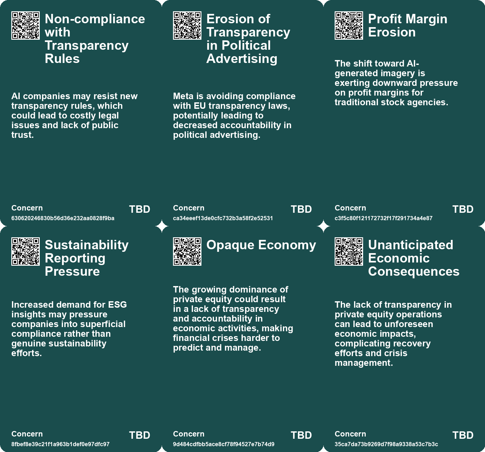
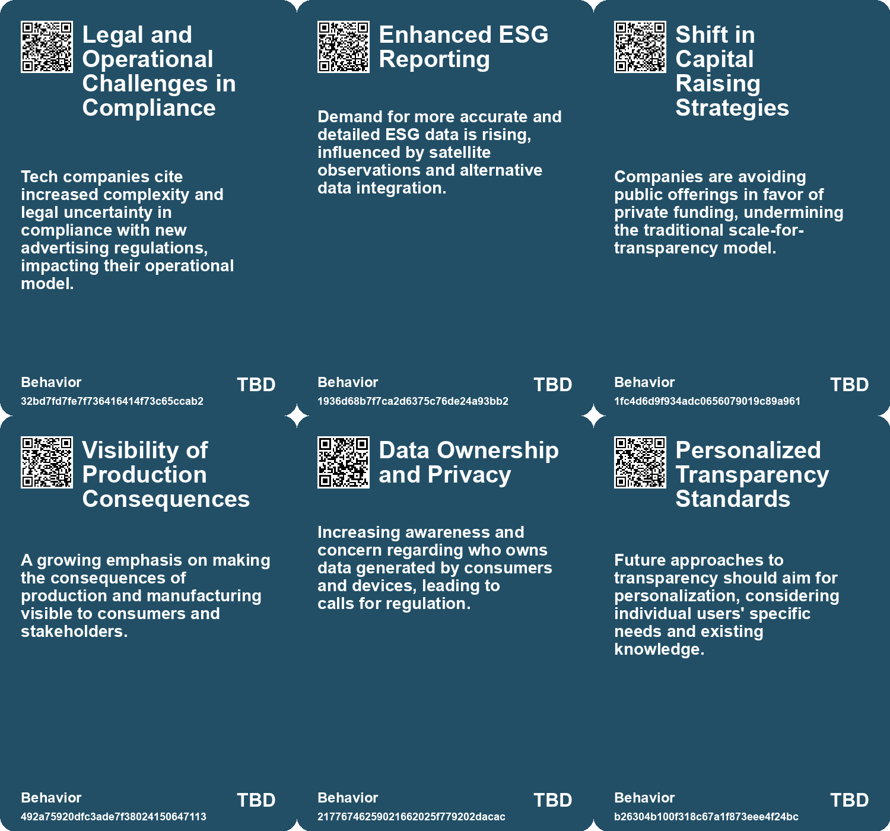
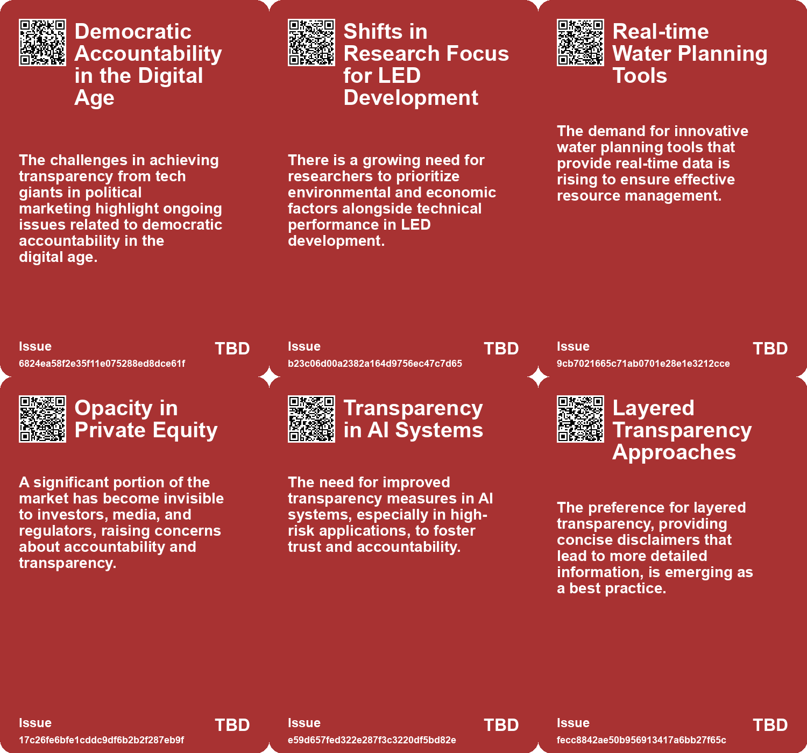
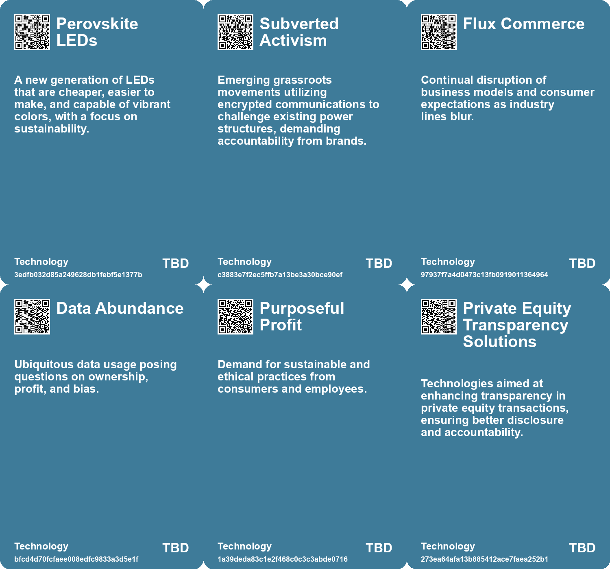

# *Topic*: Increased Transparency Demand

# Summary

The landscape of artificial intelligence and its regulation is evolving rapidly. The European Union is set to implement a new code of practice aimed at enhancing transparency among AI companies, with a focus on copyright protections and public safety. This initiative comes as the EU prepares for the AI Act, which will take effect in 2026. Companies like Google and Meta are under pressure to avoid using pirated materials for AI training and to disclose their training data and model design choices. However, Meta has announced it will halt political advertising in the EU rather than comply with new transparency regulations, raising concerns about accountability in the digital space.

In the realm of business, transformative shifts are anticipated, driven by technological advancements and changing demographics. The rise of agentic AI is reshaping human interactions with software, potentially altering organizational hierarchies. Additionally, the trend of de-materialization is leading to the elimination of physical devices, while localized trade relations signal a move toward de-globalization. The entertainment and media industries are also adapting, with a slowdown in growth prompting companies to explore generative AI for productivity and new revenue streams.

Environmental sustainability remains a pressing concern, particularly in water management. The World Economic Forum warns that by 2025, two-thirds of the global population will face increased water stress. Digital transformation is essential for addressing these challenges, with technology playing a crucial role in improving water management systems. Innovations in wastewater treatment and smart irrigation are highlighted as vital for sustainability in both urban and agricultural contexts.

The practice of "greenhushing," where companies refrain from publicizing climate goals, is on the rise as a response to increased scrutiny over greenwashing. This trend complicates the ability to hold companies accountable for their environmental commitments. Meanwhile, the Federal Trade Commission is investigating major companies for their use of customer data in dynamic pricing practices, raising questions about privacy and consumer protection.

The cybersecurity job market is experiencing turbulence due to economic uncertainty, leading to layoffs and budget cuts. Despite this, there remains a disconnect between job market forecasts and the reality of finding new opportunities in cybersecurity. Networking is becoming increasingly important for job seekers in this field.

Technological advancements are also impacting the automotive industry, particularly regarding the reliability of chips used in electrified vehicles. Rising global temperatures are affecting the lifespan of these chips, prompting companies to focus on monitoring and predictive maintenance to ensure safety and performance.

Finally, the integration of augmented reality into urban life presents both opportunities and challenges. While it can enhance citizen engagement and accessibility, there are risks related to privacy and social equity. Proactive governance is necessary to navigate the complexities of this technological shift.

As these themes intersect, they highlight the ongoing challenges and opportunities presented by technological advancements, regulatory changes, and environmental concerns in today's society.

# Seeds

|    | name                                           | description                                                                                                        | change                                                                                                | 10-year                                                                                                              | driving-force                                                                                              |
|---:|:-----------------------------------------------|:-------------------------------------------------------------------------------------------------------------------|:------------------------------------------------------------------------------------------------------|:---------------------------------------------------------------------------------------------------------------------|:-----------------------------------------------------------------------------------------------------------|
|  0 | Concerns Over Data Transparency                | Debates over the adequacy of ad review systems and their transparency.                                             | Move towards more conditional and scrutinized ad placements and reviews.                              | Systems may be developed or refined for improved accuracy in detecting political ads.                                | Demand for transparency and accuracy in ad targeting within digital platforms.                             |
|  1 | Pricing Pressure on Traditional Images         | AI's unique advantages causing pricing pressures and margin erosion for traditional visuals.                       | Traditional pricing models in photography and illustrations under threat from AI price competition.   | Pricing structures in visual content markets may radically change due to AI efficiency.                              | Client demand for instant and customizable visual solutions at lower costs.                                |
|  2 | Growing Public Vulnerability to Climate Change | Increased public awareness of vulnerability to climate change impacts.                                             | Shift from low awareness to higher public concern regarding climate change.                           | In ten years, climate change may drive significant policy changes and lifestyle adaptations.                         | Increased visibility of climate-related disasters and scientific communication.                            |
|  3 | Enhanced ESG Reporting                         | Stakeholders demand more robust environmental, social, and governance reports.                                     | Shift from basic to detailed and actionable ESG reporting requirements.                               | In ten years, ESG reporting will be data-driven and standardized across industries.                                  | Increased awareness of sustainability and accountability drives the demand for ESG transparency.           |
|  4 | Opaque Economy                                 | A significant portion of the U.S. economy is becoming less transparent due to private equity.                      | The shift from public to private ownership reduces transparency in corporate operations and finances. | In 10 years, corporate accountability may be severely weakened, leading to financial instability.                    | The desire for increased profits drives companies to operate without public scrutiny.                      |
|  5 | Emerging Transparency Standards                | Best practices for transparency requirements under the EU AI Act are evolving based on stakeholder feedback.       | From vague transparency requirements to clearly defined best practices for AI systems.                | A standardized framework for transparency in AI systems, tailored to various use cases and audiences.                | The increasing demand for accountability and trust in AI technologies among users and regulators.          |
|  6 | Personalized Transparency                      | The concept of personalized transparency based on individual needs is gaining recognition.                         | From generic transparency measures to personalized approaches catering to user needs.                 | Transparency measures that dynamically adapt to users' knowledge and requirements, fostering trust.                  | The expectation of tailored experiences in digital interactions, driven by user-centric design principles. |
|  7 | New Use Cases for AI Regulation                | Emerging use cases such as emotion recognition and synthetic media require additional transparency considerations. | From limited use case testing to a broader scope of AI applications in regulatory frameworks.         | Comprehensive transparency regulations that cover a wider array of AI applications, including emerging technologies. | Rapid advancements in AI technologies prompting the need for updated and relevant regulatory frameworks.   |
|  8 | Technological Accountability                   | Calls for systems ensuring accountability in surveillance practices are increasing.                                | The demand for transparency in surveillance is growing as technology becomes more intrusive.          | In ten years, transparent systems may be established to ensure accountability for both surveillance and its users.   | Public concern over misuse of surveillance technology fuels demand for accountability measures.            |
|  9 | Regulatory Scrutiny on Pricing Practices       | Increased investigation into how companies use data for pricing.                                                   | Shift from unregulated dynamic pricing to a more scrutinized approach by regulators.                  | More transparent pricing models and regulations may emerge, impacting consumer trust and corporate practices.        | Growing public concern over privacy and fair pricing practices in a data-driven economy.                   |

# Concerns

|    | name                                             | description                                                                                                                                                                     |
|---:|:-------------------------------------------------|:--------------------------------------------------------------------------------------------------------------------------------------------------------------------------------|
|  0 | Non-compliance with Transparency Rules           | AI companies may resist new transparency rules, which could lead to costly legal issues and lack of public trust.                                                               |
|  1 | Erosion of Transparency in Political Advertising | Meta is avoiding compliance with EU transparency laws, potentially leading to decreased accountability in political advertising.                                                |
|  2 | Profit Margin Erosion                            | The shift toward AI-generated imagery is exerting downward pressure on profit margins for traditional stock agencies.                                                           |
|  3 | Sustainability Reporting Pressure                | Increased demand for ESG insights may pressure companies into superficial compliance rather than genuine sustainability efforts.                                                |
|  4 | Opaque Economy                                   | The growing dominance of private equity could result in a lack of transparency and accountability in economic activities, making financial crises harder to predict and manage. |
|  5 | Unanticipated Economic Consequences              | The lack of transparency in private equity operations can lead to unforeseen economic impacts, complicating recovery efforts and crisis management.                             |
|  6 | Accessibility of Transparency Measures           | Disclaimers and transparency measures may not be fully accessible to individuals with disabilities, limiting their ability to understand AI interactions.                       |
|  7 | Relative Nature of Transparency                  | Understanding of transparency varies by individual, complicating the establishment of universally effective transparency measures.                                              |
|  8 | Market Opaqueness                                | The lack of transparency in pricing strategies can undermine consumer trust and market fairness, complicating price comparisons.                                                |
|  9 | Digital Advertising Saturation                   | Increased competition in digital advertising may lead to a market saturated with players, making it harder for companies to secure ad revenue.                                  |

# Cards

## Concerns

## Behaviors

## Issue

## Technology

# Links

* [The Impact of Rising Temperatures on Automotive Chip Lifespan and Reliability](https://futures.kghosh.me/e161cf68ccd4b5722cc0dc045ca6a2e1)
* [Meta Halts Political Ads in EU to Avoid New Transparency Regulations](https://futures.kghosh.me/014ce3100d6fcc7d160362d608f5c6fe)
* [Key Challenges and Innovations in Water Management for 2023 and Beyond](https://futures.kghosh.me/bb8e4477e434a4bdb0fc5236abd68436)
* [Challenges and Opportunities in the 2023 Cybersecurity Job Market: Insights and Strategies](https://futures.kghosh.me/0ab36af538bf262c85b73fa7e7bd657f)
* [Harnessing Satellite Data and AI for Enhanced Economic and Environmental Insights](https://futures.kghosh.me/2c79a113d206a8ec8ec147422fcea12c)
* [Emerging Global Risks: Climate Change, Geopolitical Tensions, and Technological Threats in 2025](https://futures.kghosh.me/c279f12eda98e732755a0f730b9d4d4b)
* [2025 Water Management: The Crucial Role of Digital Transformation in Addressing Global Water Challenges](https://futures.kghosh.me/a374b5aaabba03451c8c0ebd32edd833)
* [The Vision of Ultraprosperity: A Future of Economic Growth and Change](https://futures.kghosh.me/719500bc852b3f2db19af6d9280207bf)
* [The Augmented City: Balancing Innovation and Challenges in Urban AR Integration](https://futures.kghosh.me/79a156bc6b74667af8c3e7309844d739)
* [The Rise of 'Greenhushing': Companies Retreat from Public Climate Commitments](https://futures.kghosh.me/a808b73a65a5a8140b4fc5dd5845679b)
* [The Impact of Generative AI on Traditional Stock Photography and Licensing Markets](https://futures.kghosh.me/966eddc4698e68b47bc5a9c33fe2afbd)
* [FTC Investigates Major Firms Over Surveillance Pricing Practices and Consumer Privacy Concerns](https://futures.kghosh.me/ff0593173e75f7c7e19b150fa4081609)
* [Future Risks Report 2025: Increasing Global Crises and Emerging Risks Analysis](https://futures.kghosh.me/c5ecb012c90eddae1d46c1137e384c86)
* [Future Risks Report 2024: Key Findings on Emerging Global Challenges](https://futures.kghosh.me/caf29de5522a914887f9653f8edfd0a6)
* [Cloud Services Pricing Trends and the Impact of AI and ARM Architectures in 2023](https://futures.kghosh.me/7741be218ebd9775f72342aa31da2a39)
* [The Entertainment and Media Industry's Shift: Growth Challenges and Opportunities Ahead](https://futures.kghosh.me/c18691583943e0d2d1e217558293d06b)
* [The Impact of Ubiquitous Surveillance Cameras on Society and Accountability](https://futures.kghosh.me/7790ecd5c227bae024a54ac5725ac978)
* [Five Emerging Trends Transforming Business in the Coming Year](https://futures.kghosh.me/55bac03899915f25bf0b47fa4342472c)
* [EU's New Code of Practice Aims to Enhance Transparency and Compliance in AI Industry](https://futures.kghosh.me/b4018274e2792c9e4e374ad3ce424478)
* [Best Practices for Transparency in AI Under the EU AI Act: Insights from a Prototyping Project](https://futures.kghosh.me/d88cbb54d9e2d462585c4d515dd32067)
* [Future Trends Post-2024: Declining Democracies and Emerging Cultural Shifts](https://futures.kghosh.me/bd1b01636b1360716b5951e1cac42724)
* [The Rise of Private Equity and Its Threat to Economic Transparency in the U.S.](https://futures.kghosh.me/86944a8ff63c9744c1d3cfb858bae3da)
* [Advancements and Sustainability in Perovskite LED Technology for Future Applications](https://futures.kghosh.me/3434e9315c934a4922e82b89644e989d)
* [Exploring Cookies, Supply Chains, and Future Challenges in Technology and Consumption](https://futures.kghosh.me/fa27e27bdec01712d582ab0f61c95bac)
* [Non-Obvious Megatrends: Insights for Predicting the Future](https://futures.kghosh.me/53c5550484135e9581500f193d2e8a0f)