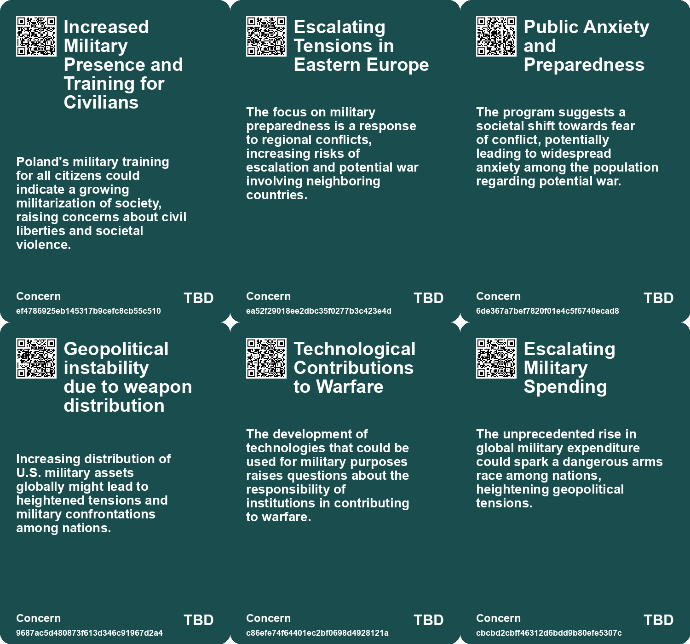
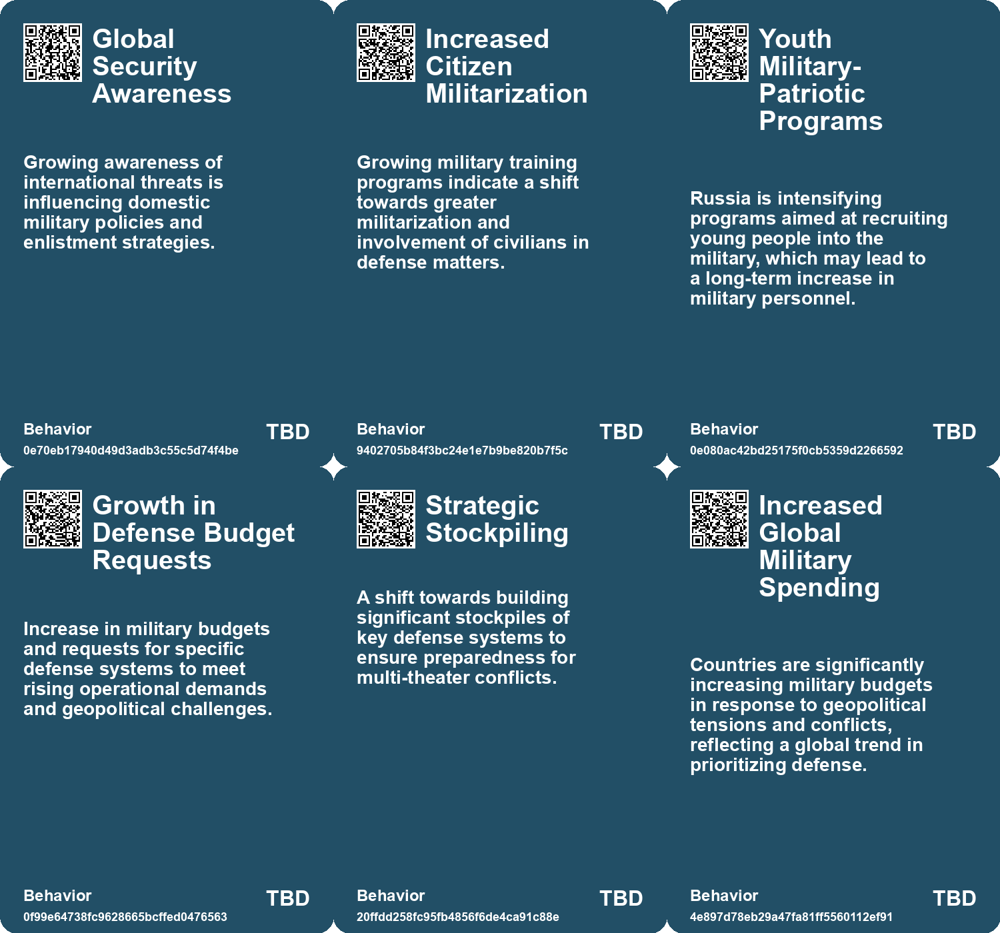
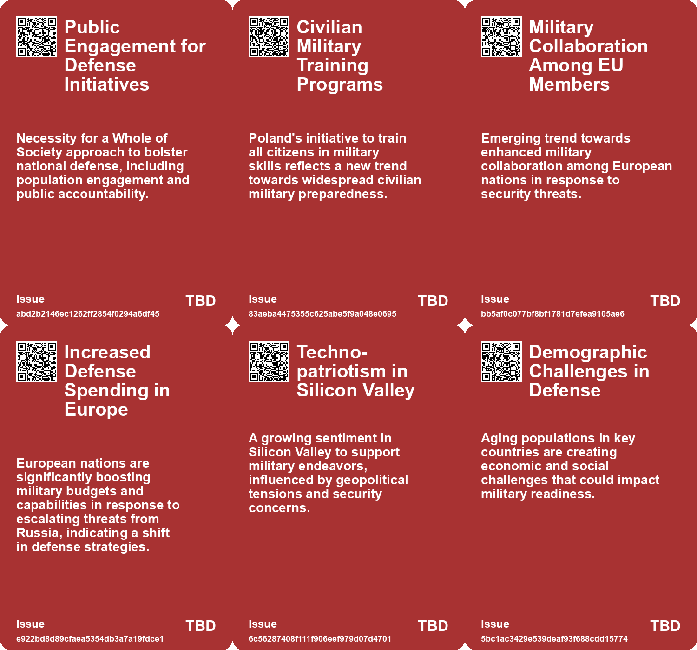
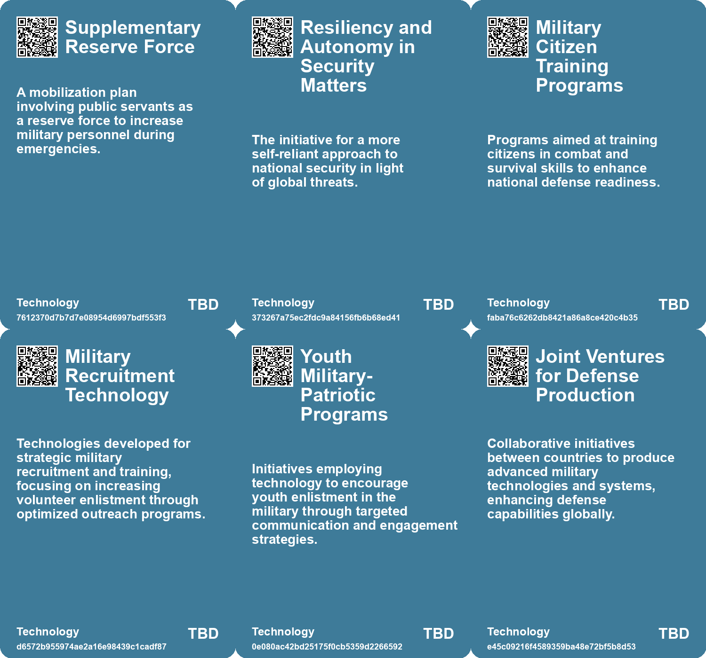

# *Topic*: Increasing Militarization of Society

# Summary

Global military spending has surged to a record high of $2.44 trillion, marking a 6.8% increase from the previous year. This rise reflects a worldwide emphasis on military strength, with the United States and China accounting for nearly half of the total expenditure. The increase is driven by rising tensions and conflicts across various regions, prompting nations to prioritize defense capabilities.

Artificial intelligence (AI) is emerging as a critical factor in modern warfare, particularly in the competition between the U.S. and China. The U.S. is urged to adapt to AI's transformative potential in military operations, while China continues to invest heavily in AI technologies for defense. The integration of AI into military strategies raises questions about command structures and the ethical implications of autonomous weapons.

Ukraine is actively developing its domestic arms industry, focusing on land robots for various military applications. The country seeks investments to enhance its defense capabilities amid ongoing conflict with Russia. Collaborations with U.S. companies are underway, and there is a push to refine drone production and incorporate AI into military operations. Meanwhile, the production capacity of munitions from Ukraine's allies remains inconsistent, highlighting the need for improved long-term planning.

Russia is ramping up military recruitment, with nearly 300,000 new recruits joining its ranks. This surge indicates preparations for potential conflict with NATO rather than a resolution to the ongoing war in Ukraine. Recent incidents, such as airspace violations, have heightened tensions, prompting NATO to reinforce its eastern defenses and issue warnings to Russia.

In Poland, a new military training program aims to prepare 400,000 citizens by 2026, reflecting heightened security concerns following Russia's actions. The initiative emphasizes basic security and survival skills, aiming to strengthen military reserves and community resilience. Similar efforts are seen in Canada, where the military plans to expand its ranks by training federal public servants in essential military skills.

The Israeli Ministry of Defense's funding of research at MIT has sparked protests advocating for Palestinian rights, raising ethical questions about military collaborations in academia. As protests grow, calls for divestment from military ties with Israel highlight the ongoing violence in Gaza and the implications of such partnerships.

The U.S. Army's deployment of Patriot missiles in response to Iranian threats underscores the challenges in meeting air defense demands. The Pentagon is facing difficulties in maintaining adequate supplies, prompting proposals to increase the Patriot arsenal significantly. As global tensions rise, particularly in Asia and the Middle East, the need for effective air defense strategies becomes increasingly critical.

The emergence of lethal autonomous weapons (LAWs) has sparked debates about their implications on the battlefield. Nations are investing heavily in AI-equipped drones, raising concerns about the ethical ramifications of machines making life-and-death decisions. The United Nations is considering regulations on LAWs, aiming to establish a ban on weapons that operate without human oversight by 2026.

The Atlantic Council's survey reveals a generally pessimistic outlook among global strategists regarding the next decade, though some areas show promise, such as potential normalization of relations between Israel and Saudi Arabia. The survey emphasizes the importance of addressing climate change as a significant threat to global prosperity and highlights the need for international collaboration.

As surveillance technology becomes more pervasive, the implications for privacy and accountability are increasingly scrutinized. The rise of cameras and AI in monitoring activities raises questions about societal norms and legal frameworks, which have yet to adapt to this new reality. The growing awareness among technology workers about the militarization of surveillance further complicates the discourse surrounding these technologies.

# Seeds

|    | name                                                | description                                                                                             | change                                                                                                              | 10-year                                                                                                               | driving-force                                                                                                     |
|---:|:----------------------------------------------------|:--------------------------------------------------------------------------------------------------------|:--------------------------------------------------------------------------------------------------------------------|:----------------------------------------------------------------------------------------------------------------------|:------------------------------------------------------------------------------------------------------------------|
|  0 | Involvement of Public Servants in Military Training | Public servants are being trained to support military roles as part of a mobilization plan.             | Shift from a traditional military recruitment model to involving civilian public servants in defense roles.         | Expand public servants' roles in military operations and disaster response, changing perceptions of military service. | Heightened security challenges drive the need for rapid mobilization of military resources.                       |
|  1 | Whole of Society Approach                           | The Defence Mobilization Plan promotes a societal-wide engagement for enhancing military readiness.     | A transition from military-only recruitment to an inclusive approach involving civilians across sectors in defense. | Potential for a societal shift where military service is viewed as a collective responsibility of all citizens.       | Growing security concerns force a communal response to defense and military readiness.                            |
|  2 | Global Security and Strategic Competition           | Increased focus on global security threats from states like China and Russia evokes military readiness. | Shift from peacetime operations to a heightened state of readiness for potential conflicts involving global powers. | A permanent shift in military posture towards preparedness for large-scale conflicts.                                 | Rising geopolitical tensions among nations compel countries to enhance their military readiness and capabilities. |
|  3 | Enhanced European Defense Spending                  | European nations responding to threats by increasing defense budgets significantly.                     | Transition from underfunded military to robust defense capabilities in Europe.                                      | European countries may achieve military self-sufficiency against threats.                                             | Growing awareness of Russian ambitions leads to increased military investment.                                    |
|  4 | Youth Military-Patriotic Programs in Russia         | Russia is intensifying programs to recruit youth into military service.                                 | From limited recruitment efforts to a systematic approach targeting younger demographics.                           | Russia's military may increasingly reflect the ideologies of younger generations, impacting national policies.        | Aimed at fostering a sense of nationalism and military readiness among youth in Russia.                           |
|  5 | Impact on U.S. Military Readiness                   | Concerns arise about U.S. military readiness as inventories dwindle amidst high demand.                 | From ensuring readiness to potentially facing reduced military responsiveness.                                      | U.S. may rethink its military supply chain and production strategies to address gaps.                                 | The recognition of escalating military conflicts affecting supply and demand for defense systems.                 |
|  6 | Military Adaptation to Technological Change         | The need for militaries to quickly adapt to technological advancements.                                 | From slow adaptation to a proactive stance on technological integration.                                            | Militaries will continuously evolve their strategies based on emerging technologies.                                  | The fast-paced nature of technological evolution in warfare.                                                      |
|  7 | Militarization of Technology                        | The increasing intertwining of civilian technology development with military applications.              | Shift from purely commercial tech development to a focus on military and surveillance applications.                 | A tech industry heavily influenced by military contracts and surveillance needs, altering the nature of innovation.   | Government contracts and funding directing technological innovation towards military applications.                |
|  8 | Rising Global Military Expenditure                  | Global military spending reached a record high, reflecting increasing geopolitical tensions.            | A shift from peacetime spending to increased military readiness and capabilities.                                   | In 10 years, military budgets may continue to rise, impacting global peace and security dynamics.                     | The ongoing geopolitical conflicts and the perceived need for stronger military deterrence.                       |
|  9 | Shift in US Military Focus                          | The US is pivoting towards advanced weapon systems amidst changing warfare dynamics.                    | A transition from counter-insurgency to preparing for conflicts with advanced military capabilities.                | In ten years, military strategies may heavily incorporate technology and advanced weaponry.                           | The need to address threats from nations with advanced military capabilities like China and Russia.               |

# Concerns

|    | name                                                   | description                                                                                                                                                    |
|---:|:-------------------------------------------------------|:---------------------------------------------------------------------------------------------------------------------------------------------------------------|
|  0 | Increased Military Presence and Training for Civilians | Poland's military training for all citizens could indicate a growing militarization of society, raising concerns about civil liberties and societal violence.  |
|  1 | Escalating Tensions in Eastern Europe                  | The focus on military preparedness is a response to regional conflicts, increasing risks of escalation and potential war involving neighboring countries.      |
|  2 | Public Anxiety and Preparedness                        | The program suggests a societal shift towards fear of conflict, potentially leading to widespread anxiety among the population regarding potential war.        |
|  3 | Geopolitical instability due to weapon distribution    | Increasing distribution of U.S. military assets globally might lead to heightened tensions and military confrontations among nations.                          |
|  4 | Technological Contributions to Warfare                 | The development of technologies that could be used for military purposes raises questions about the responsibility of institutions in contributing to warfare. |
|  5 | Escalating Military Spending                           | The unprecedented rise in global military expenditure could spark a dangerous arms race among nations, heightening geopolitical tensions.                      |
|  6 | Unintended Conflagration Risk                          | Increased military readiness may lead to misunderstandings and unintended conflicts, putting global peace in jeopardy.                                         |
|  7 | Focus on Advanced Weaponry                             | Shift in military focus towards high-tech warfare might lead to escalation of conflicts with advanced military capabilities.                                   |
|  8 | Regional Conflict Escalation                           | Countries like India and Ukraine are significantly increasing military spending due to regional tensions, which could lead to further escalation.              |
|  9 | Use of Military for Domestic Issues                    | The trend of using military forces to combat domestic issues like gang violence raises concerns about human rights and governance.                             |

# Cards

## Concerns

## Behaviors

## Issue

## Technology

# Links

* [The Urgent Need for AI Dominance in Warfare: A Call to Action for America](https://futures.kghosh.me/220b8fb679dd137a4d58458d0db85b46)
* [NATO's Rapid Response to Russian Drone Incursion: Insights from General David Petraeus](https://futures.kghosh.me/6b405be6129d8ac61889729438da48f9)
* [Poland Launches Nationwide Military Training Program Amid Rising Security Concerns](https://futures.kghosh.me/6ee91b0c5794d53f4c2d18a376160f9c)
* [The Interplay of Democracy, Work, and Economic Justice in Modern Society](https://futures.kghosh.me/43aa6ac3d82bbc19f0d66d5b2bb37897)
* [Putin's Military Recruitment Surge Signals Potential NATO Conflict Amid Tensions](https://futures.kghosh.me/295482a81133d3b07fbb57a9b31cd3c6)
* [Biden Administration Unveils New Cybersecurity Strategy to Combat Growing Threats](https://futures.kghosh.me/1eaefdcf11b24d5f443b5f4e7645e0a5)
* [Ukraine's Strategic Shift: Investing in Land Robots and Domestic Arms Production](https://futures.kghosh.me/6860a1a22c22dc8bdb8a95d66320925b)
* [Exploring the Importance of Semiconductors in Modern Warfare and U.S.-China Rivalry](https://futures.kghosh.me/328434477c31995b44102949d5341006)
* [U.S. Army's Deployment of Patriot Missiles Amid Heightening Global Tensions and Demand](https://futures.kghosh.me/e7d130a11e7f432efd9d3c5bcbcad482)
* [Global Experts' Pessimistic Outlook for the Next Decade: Key Survey Findings](https://futures.kghosh.me/7c5704fc7ced135231421044eed7ec4b)
* [China's Rise and the Prevention of a 21st Century Thucydides Trap](https://futures.kghosh.me/e35fed87b0c84188965e5323af1a8e57)
* [The Rise of Lethal Autonomous Weapons: Ethical and Regulatory Challenges in Modern Warfare](https://futures.kghosh.me/7f25552b9124a4dc3833e782ef331275)
* [AI's Impact on Society: Job Displacement and the Need for Retraining](https://futures.kghosh.me/cf119665e47c7434e3e3c54dbbc585e3)
* [OpenAI's Shift in Policy: Collaborating with the Pentagon on AI Projects Amid Safety Concerns](https://futures.kghosh.me/e625a640f3cfddf1f648256a243cb214)
* [Canadian Military Plans to Expand Ranks with Trained Public Servants Amid Global Security Concerns](https://futures.kghosh.me/fdd17216cc4c080da6ff606fbcbc8530)
* [The Impact of Ubiquitous Surveillance Cameras on Society and Accountability](https://futures.kghosh.me/7790ecd5c227bae024a54ac5725ac978)
* [EU and NATO Mobilize for Enhanced Drone Defense Amid Ongoing Russian Threats in Ukraine](https://futures.kghosh.me/3e4c925ac500834d9f4d986e418bcc26)
* [The Decline of Political Maturity in America: A Call for Responsible Citizenship](https://futures.kghosh.me/ec5b543a174bedb5387b497cc449e5b9)
* [Taiwan Prepares Citizens for Cyber Warfare Amid Chinese Threat](https://futures.kghosh.me/e99358609284de847f0d590948f5b265)
* [Exploring the Ordinary Origins of Surveillance: Insights from Hochman and González's New Books](https://futures.kghosh.me/ccdebc20efc0694474f1c64e2835e260)
* [Transforming Warfare: The Role of Uncrewed Systems in Modern Military Strategy](https://futures.kghosh.me/df83d0064f88153a92b016bc412f6b97)
* [Global Experts' Pessimistic Outlook for the Next Decade: Key Survey Findings](https://futures.kghosh.me/4c1d4c91735e960e46ac534d9a90fc60)
* [European Leaders Address Drone Threats and Strengthen Defense Strategies Against Hybrid War](https://futures.kghosh.me/38f4bf649d0757debecb51a159c59887)
* [MIT's Controversial Ties to Israeli Military Funding and Student Protests](https://futures.kghosh.me/0d4171563ade773e41ab3c5949dccb52)
* [Understanding Polarization: Healing Our Relationship with Technology and Embracing Diverse Perspectives](https://futures.kghosh.me/c1bb890337ef382bfaa5720c9fd05134)
* [Record Global Military Spending Reaches $2440 Billion Amid Rising Geopolitical Tensions](https://futures.kghosh.me/a6e51bf195e812183ab4fdb51df506a1)