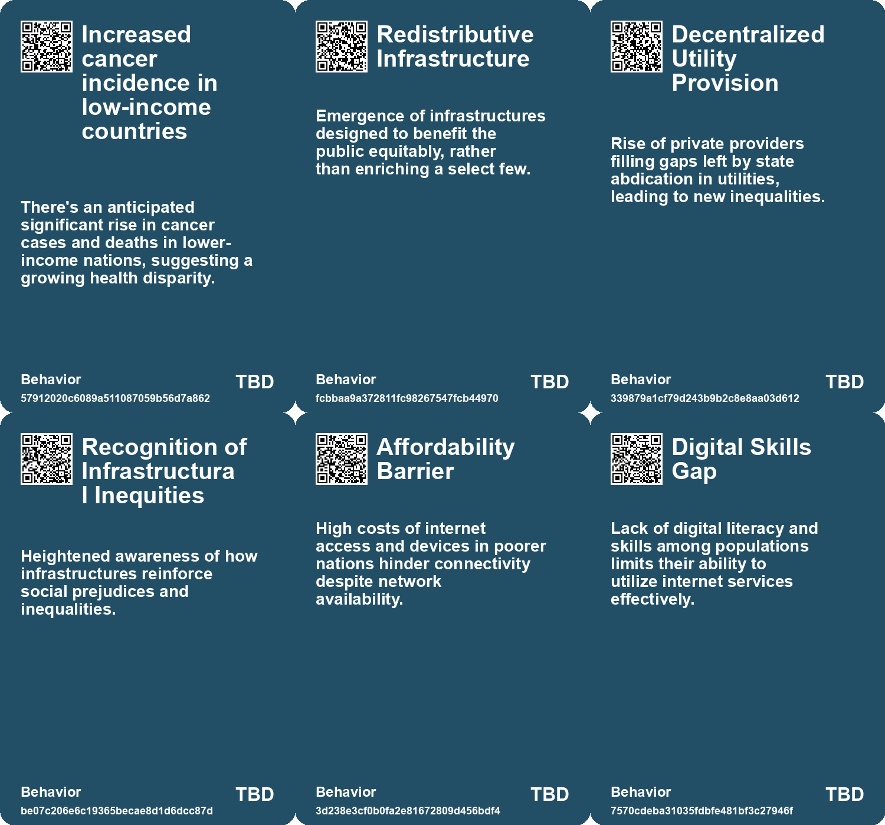
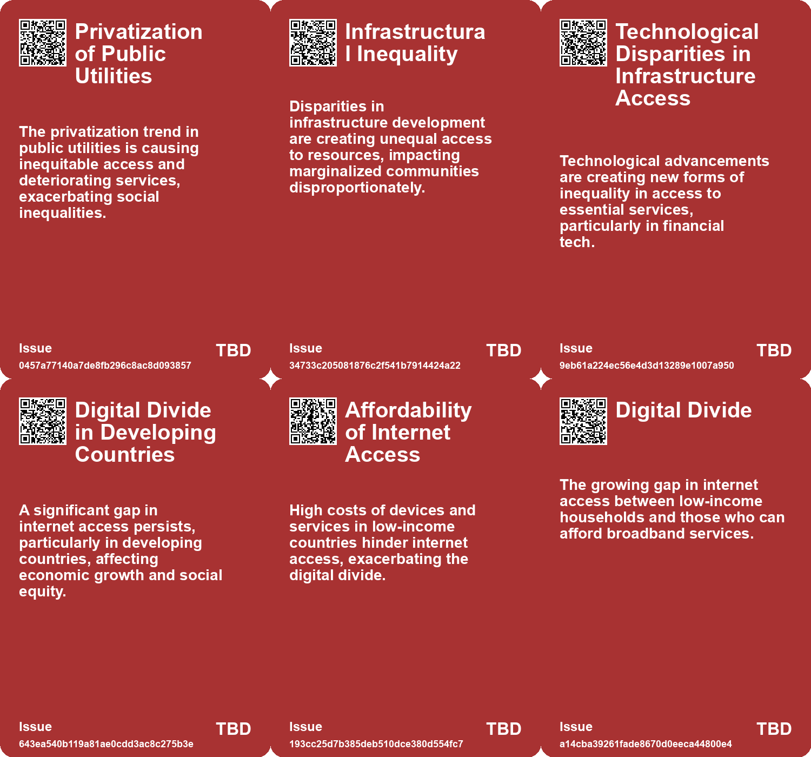
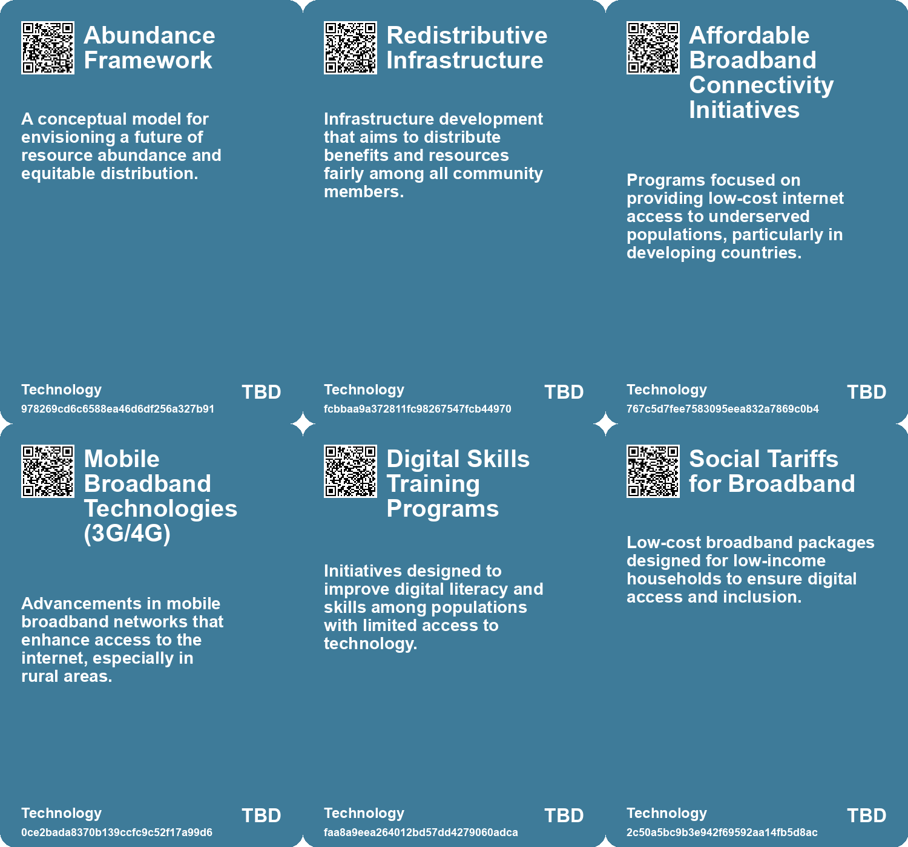

# *Topic*: Inequality in Access

# Summary

Access to essential services remains a pressing global issue, particularly in the realm of sanitation and digital connectivity. The lack of public toilets significantly impacts marginalized groups, including women and those with health issues, highlighting the urgent need for universal access to quality sanitation facilities. Similarly, the digital divide persists, with millions lacking internet access, particularly in developing countries. The COVID-19 pandemic has exacerbated this issue, emphasizing the necessity for affordable internet and digital skills to ensure equitable access to information and services.

Economic disparities are increasingly evident, with the concentration of wealth among billionaires raising concerns about inequality and its societal implications. The influence of the super-rich in politics and the economy often hinders progress on critical issues like climate change. Proposed solutions include higher taxes on the wealthy and systemic economic reforms aimed at redistributing wealth and addressing the negative consequences of extreme wealth concentration.

The challenges of the gig economy are also highlighted, as ride-hailing drivers in countries like South Africa and India face rising costs and inflation. Despite minor concessions from companies, many drivers struggle to make ends meet, revealing the vulnerabilities of gig workers in an increasingly transactional economy. This precariousness is compounded by the broader economic landscape, where traditional industries face pressures while progressive politics grapple with the realities of material needs.

The concept of "ultraprosperity" presents a vision of sustained economic growth, yet it raises questions about sustainability and the search for meaning beyond material wealth. As society becomes more transactional, the importance of self-actualization and personal fulfillment is underscored. The commodification of social issues and the outsourcing of personal agency challenge individuals to find purpose in a world driven by consumption.

Land ownership and its implications for social equity are also critical themes. Historical and ongoing shifts in land tenure affect development trajectories worldwide. The need for innovative land reform is emphasized to address future challenges, particularly in the context of climate change and population dynamics.

Public-private partnerships in the field of artificial intelligence reveal the complexities of innovation in a rapidly evolving industry. The consolidation of resources by large tech companies raises concerns about the lack of diversity in AI development and its societal impact. The proposed National Artificial Intelligence Research Resource aims to promote public-minded innovation, but its effectiveness remains to be seen.

Finally, the looming cancer crisis, particularly in lower-income countries, highlights the urgent need for improved healthcare access and preventive measures. Modifiable risk factors contribute significantly to cancer fatalities, underscoring the importance of targeted interventions to prevent new cases and improve treatment outcomes. Without action, the predicted rise in cancer cases and deaths could lead to a public health disaster.

# Seeds

|    | name                                        | description                                                                                      | change                                                                                          | 10-year                                                                                                           | driving-force                                                                                     |
|---:|:--------------------------------------------|:-------------------------------------------------------------------------------------------------|:------------------------------------------------------------------------------------------------|:------------------------------------------------------------------------------------------------------------------|:--------------------------------------------------------------------------------------------------|
|  0 | Crisis of Scarcity vs. Abundance            | Escalating debate on scarcity and the inequities it breeds in society.                           | Moving from a scarcity mindset to embracing potential paths to abundance for all.               | Future discussions will revolve around equitable distribution and sustainability rather than mere survival.       | Economic inequality prompting demand for fair resource allocation and shared prosperity.          |
|  1 | Privatization of Utilities                  | Privatization of public utilities leads to inequitable access to essential services.             | Transition from public to privatized utility services, affecting affordability and access.      | In 10 years, there may be a push for re-nationalization or regulation of essential services.                      | Growing awareness of social inequalities resulting from privatization.                            |
|  2 | Rise of Alternative Financial Technologies  | New financial technologies are emerging in unregulated spaces, affecting infrastructure access.  | Shift from traditional banking to mobile financial services in underserved areas.               | In 10 years, mobile financial services may dominate in areas with limited bank access.                            | The need for accessible financial solutions in underserved populations.                           |
|  3 | Social Fissures from Energy Inequality      | Energy consumption disparities are creating social divides and tensions.                         | From equitable energy access to significant disparities based on consumption and resources.     | In 10 years, energy policies may prioritize equity and sustainability in access.                                  | Growing awareness of energy equity and its impact on social cohesion.                             |
|  4 | Connectivity Chasm in LDCs                  | A vast gap remains in Internet access among Least Developed Countries.                           | From growing global connectivity to persistent exclusion in LDCs, particularly affecting women. | Increased focus on bridging the digital divide, particularly in marginalized communities in LDCs.                 | Global efforts to achieve SDGs may drive initiatives to enhance digital connectivity in LDCs.     |
|  5 | Affordability Barrier for Connectivity      | High costs hinder Internet access in developing countries.                                       | From potential access to actual exclusion based on affordability.                               | Increased efforts to make Internet access affordable could lead to higher global connectivity rates.              | Global initiatives for affordable digital access, especially in low-income nations, drive change. |
|  6 | Digital Inequality                          | Households without broadband face greater challenges in job applications and accessing services. | A shift from equitable internet access to a more divided population based on income.            | In ten years, digital skills and job opportunities may significantly favor those with consistent internet access. | The essential nature of the internet for daily life and job market participation.                 |
|  7 | Increased Awareness of Digital Poverty      | Campaigns highlight the importance of internet access for low-income individuals.                | A shift from ignorance of digital poverty to recognition as a critical issue.                   | In ten years, digital poverty may lead to dedicated policies and programs to bridge the digital divide.           | Rising advocacy for equity in internet access and its implications for society.                   |
|  8 | Gender-based disparities in restroom access | Women and marginalized groups face more challenges with public restroom access.                  | From gender-neutral assumptions to a recognition of specific needs in public restroom design.   | In 10 years, public restrooms may be designed with gender inclusivity and safety as priorities.                   | Increased advocacy for gender equity and awareness of diverse needs in public spaces.             |
|  9 | Print Deserts                               | Communities with limited access to books or educational resources.                               | Shift from resource-rich environments to 'print deserts' impacting literacy.                    | In 10 years, initiatives may emerge to address print deserts and improve community resources.                     | Recognizing the importance of access to reading materials for literacy improvement.               |

# Concerns

|    | name                                        | description                                                                                                                                                        |
|---:|:--------------------------------------------|:-------------------------------------------------------------------------------------------------------------------------------------------------------------------|
|  0 | Healthcare Disparities                      | Disparities in cancer care between wealthy and lower-income countries may widen, leading to unequal outcomes in cancer diagnosis and treatment.                    |
|  1 | Inequitable Distribution of Resources       | There’s a danger that abundance may only benefit a few, exacerbating social inequalities and tensions.                                                             |
|  2 | Extreme income inequality                   | The possibility of widening wealth gaps as millions become millionaires but not all benefit equally from economic growth.                                          |
|  3 | Digital Divide in Access to Internet        | A significant portion of the global population remains offline, particularly in developing countries, hindering equitable access to information and opportunities. |
|  4 | Gender Inequality in Internet Usage         | Women in Least Developed Countries (LDCs) face significant challenges in accessing the Internet, affecting their opportunities and rights.                         |
|  5 | Urban-Rural Connectivity Gap                | Urban dwellers have much higher Internet access than rural populations, exacerbating existing inequalities between these communities.                              |
|  6 | Affordability of Internet Services          | High costs of Internet access and devices in poorer nations hinder connectivity, perpetuating the digital divide.                                                  |
|  7 | Digital Exclusion                           | Growing number of households unable to afford broadband, leading to increased digital inequality.                                                                  |
|  8 | Impact on Marginalized Groups               | Inadequate access to public restrooms disproportionately affects marginalized groups, increasing their vulnerabilities and health risks.                           |
|  9 | Impact of Financialization on Public Health | The financialization of the economy threatens equitable access to healthcare, potentially leading to social injustice.                                             |

# Cards

## Concerns

## Behaviors

## Issue

## Technology

# Links

* [Public-Private Partnerships in AI: Risks and Societal Implications](https://futures.kghosh.me/6264095641147fe54800b8f03723f381)
* [Urgent Need for Global Food Systems that Prioritize Human Rights and Security](https://futures.kghosh.me/c21f7a31bf1c99ef78e154ae4249e712)
* [The Interplay of Democracy, Work, and Economic Justice in Modern Society](https://futures.kghosh.me/43aa6ac3d82bbc19f0d66d5b2bb37897)
* [Examining the Political Landscape: A Reflection on Ezra Klein and Derek Thompson's 'Abundance'](https://futures.kghosh.me/b7820dcd25b4e5b36ef678f56602f4c4)
* [The Vision of Ultraprosperity: A Future of Economic Growth and Change](https://futures.kghosh.me/719500bc852b3f2db19af6d9280207bf)
* [Understanding Homelessness: The Critical Role of Housing Affordability in Addressing the Crisis](https://futures.kghosh.me/697dba113f3330775a4a451a3a663cb4)
* [Rising Living Costs Lead to One Million Broadband Cancellations in the UK](https://futures.kghosh.me/f71e17c8d36e6dbced874ff9a319e733)
* [The Illusion of Digital Ownership: Amazon's Kindle Policy and the Future of Media Consumption](https://futures.kghosh.me/e1616df02a40343d004044a2bc18c0d6)
* [Exploring the UK’s Economic Crisis Rooted in Housing and Energy Shortages](https://futures.kghosh.me/14c9e2a7976b48f09c3e0cdf3c054c0a)
* [Understanding Economic Termites: Hidden Monopolies Driving Up Costs and Eroding Trust](https://futures.kghosh.me/ff9fdda9334a55cda4fd1788668b3e15)
* [Global Internet Connectivity Report: 2.9 Billion People Remain Offline in 2021](https://futures.kghosh.me/b36e3d58a4e33abd3eaacf9c3de03588)
* [Global Gig Economy Workers Face Rising Costs and Unsustainable Conditions Amid Inflation Crisis](https://futures.kghosh.me/d5620f5b1f4a80563ac4f5d523804658)
* [The Crisis of Public Toilets: A Human Dignity Issue Through Health and Accessibility](https://futures.kghosh.me/e3d312c1261887ba7be9287581f002e3)
* [Designing for Invisible Disabilities: The Importance of Inclusivity in Product Development](https://futures.kghosh.me/28af1e3d007d49741667ce0c19401620)
* [Overcoming Uniqueness Bias: A Path to Leadership Growth and Change](https://futures.kghosh.me/d58cdfa2239c4073bde09c04e7751eeb)
* [Reimagining Infrastructure: Towards a Redistributive and Ecologically Sound Future](https://futures.kghosh.me/177a0857ffe0d07d48cd99a269f28a02)
* [The Crisis of Low Literacy in America: Funding Disparities and Economic Impacts](https://futures.kghosh.me/0b19a85d823e25919d360051c2e63a21)
* [The Unraveling of Progressive Politics: Economic Shifts and Growing Conflicts](https://futures.kghosh.me/f4ea5244ccafd654e5955673b0ee3976)
* [Exploring the Historical and Future Transformations of Land Ownership Worldwide](https://futures.kghosh.me/68a769f0b8d15a4efd8f8136482b9660)
* [Examining the Billionaire Problem: Wealth Inequality and Its Societal Impact](https://futures.kghosh.me/4ef8cee75515da28d5c6ad986ee83030)
* [Projected Surge in Global Cancer Cases and Deaths: Focus on Lower-Income Countries](https://futures.kghosh.me/44a892a126d54424ddd21d7e27976b85)
* [The Rise of Private Equity and Its Threat to Economic Transparency in the U.S.](https://futures.kghosh.me/86944a8ff63c9744c1d3cfb858bae3da)
* [The Impact of Poverty on Cognitive Performance: Understanding the Links between Finances and Intelligence](https://futures.kghosh.me/2e671c014ba53b8b49159c3c5143c526)
* [Exploring the Dangers of Outsourcing Happiness and Personal Fulfillment in Modern Society](https://futures.kghosh.me/a5c0ba498382a4edc0f2bf0d9653ad16)