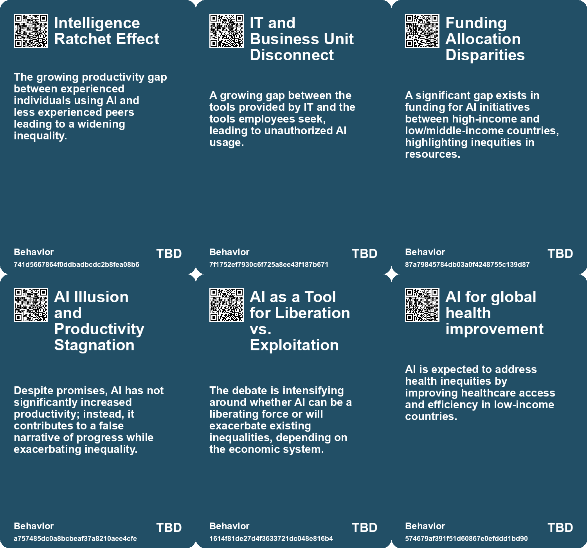
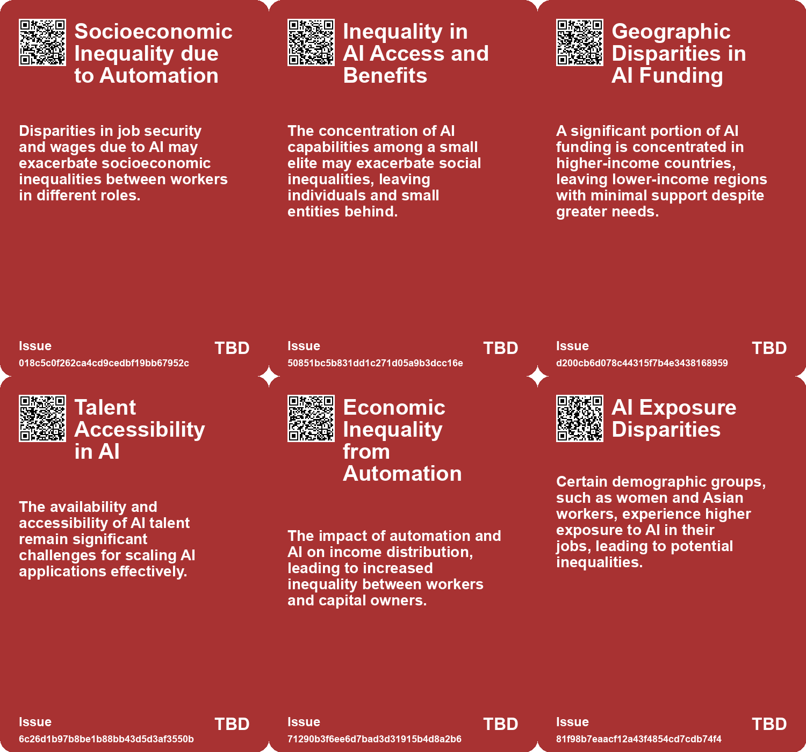
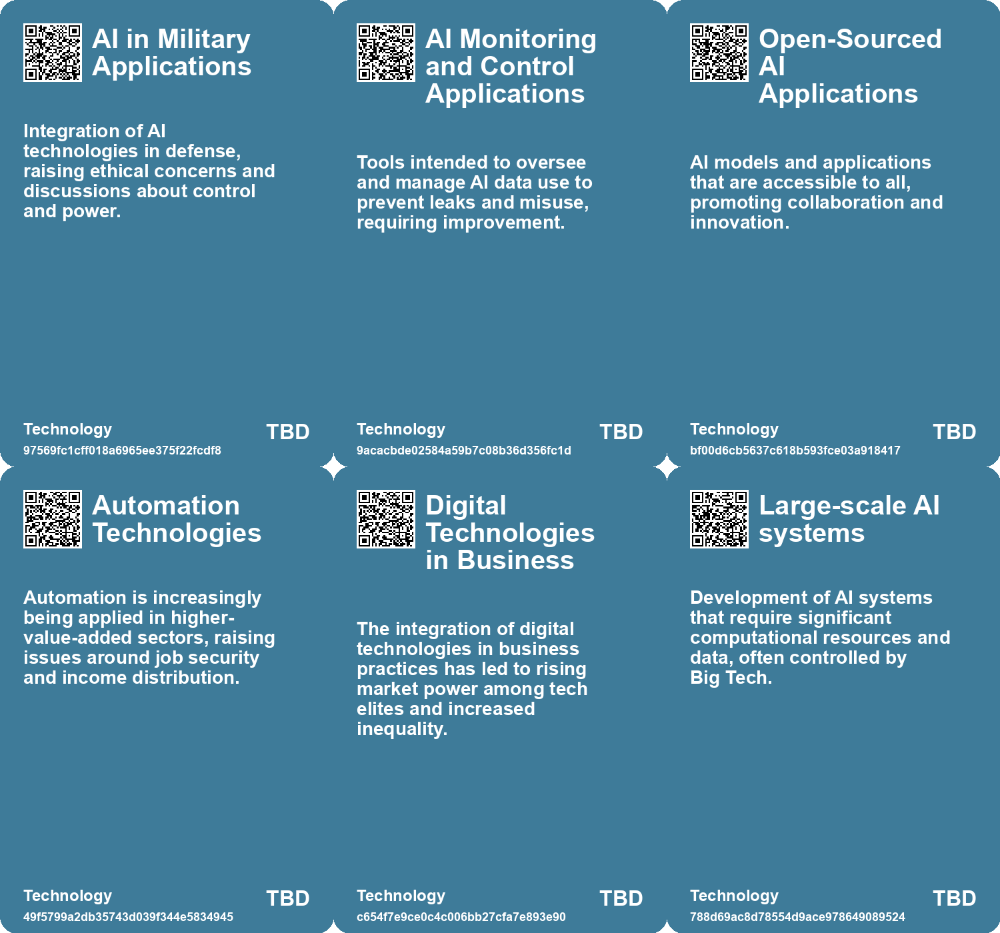

# *Topic*: Inequality in AI Access

# Summary

The intersection of artificial intelligence (AI) and society reveals a complex landscape marked by both promise and peril. A significant concern is the impact of AI on the labor market, particularly for early-career workers. Research indicates a 13% decline in employment for younger workers in AI-exposed fields since the rise of generative AI, highlighting the disproportionate effects on entry-level positions. This trend raises alarms about job displacement and the need for retraining as AI continues to evolve.

The consolidation of AI development within large tech companies poses another challenge. The dominance of firms like Microsoft and Amazon creates a dependency that threatens innovation and public interest. Critics argue that this concentration of power undermines democracy and individual agency, calling for regulatory measures to ensure accountability and prioritize societal benefits over corporate profits.

Diversity in AI development is also a pressing issue. The contributions of women and marginalized communities in the field are often overlooked, perpetuating a narrative that centers on a few prominent figures. Recognizing these contributions is essential for fostering a more inclusive and equitable AI landscape. The ethical implications of AI, including bias and the need for responsible implementation, are critical to ensuring that technology serves the broader public good.

The potential of AI to enhance productivity and creativity is evident, with studies showing that AI can elevate the skills of lower performers and improve outcomes in various professional tasks. However, the integration of AI is not without its challenges. For instance, while AI can augment consulting work, it may also lead to lower quality results in tasks beyond its capabilities. This duality underscores the importance of thoughtful AI integration that balances efficiency with human creativity.

Concerns about the societal implications of AI extend to issues of misinformation and trust. The rapid advancement of generative AI raises questions about the blurring of reality and the potential for misuse, such as deepfakes. As AI technologies become more pervasive, the need for transparency and ethical considerations in their deployment becomes increasingly urgent.

The relationship between AI and capitalism is another focal point. Critics argue that the current economic system exacerbates the risks associated with AI, leading to exploitation and inequality. A transformative approach to the economy is suggested, one that leverages AI for liberation rather than as a tool of oppression. This perspective emphasizes the potential for AI to foster a reciprocal economy where individuals can thrive as creators rather than mere workers.

Finally, the global competition over AI development, particularly between the United States and China, highlights the geopolitical stakes involved. Export controls aimed at limiting access to advanced AI technologies raise concerns about unintended consequences and the need for a balanced approach to regulation. As nations grapple with the implications of AI, the focus must remain on harnessing its potential for positive social change while addressing the risks it poses.

# Seeds

|    | name                                   | description                                                                               | change                                                                                                            | 10-year                                                                                                      | driving-force                                                                             |
|---:|:---------------------------------------|:------------------------------------------------------------------------------------------|:------------------------------------------------------------------------------------------------------------------|:-------------------------------------------------------------------------------------------------------------|:------------------------------------------------------------------------------------------|
|  0 | Inequality in AI-Enhanced Productivity | A gap in AI productivity advantage emerges across industries.                             | Shift from equal opportunities for productivity to disparities based on AI access.                                | In 10 years, industries may see entrenched disparities between those who leverage AI and those who do not.   | The unequal distribution of AI resources and knowledge can enhance existing inequalities. |
|  1 | AI and Job Displacement                | AI technologies are biased against workers, leading to wage decreases and job losses.     | From a labor-friendly environment to one where AI diminishes worker demand and wages.                             | In the next decade, job markets may shift significantly, with many roles automated.                          | The push for efficiency and cost-cutting through automation technologies.                 |
|  2 | Educational Impact on AI Exposure      | Workers with higher education levels report greater exposure to AI.                       | Move from low educational attainment jobs to high educational attainment jobs being more exposed to AI.           | Educational systems may adapt to better prepare students for AI-influenced job markets.                      | The demand for skilled labor in AI-driven industries incentivizes educational reforms.    |
|  3 | Global AI Collaboration                | Emerging partnerships between governments and tech companies for equitable AI use.        | Shift from isolated tech development to collaborative efforts for global impact.                                  | Global frameworks will ensure that AI benefits are distributed equitably across regions.                     | Recognition of AI's potential to address global challenges and inequities.                |
|  4 | Impact on Smaller AI Developers        | Export controls may limit smaller organizations' access to AI technologies and resources. | From open collaboration in AI development to restricted access for smaller developers due to regulatory measures. | Smaller AI firms could struggle to innovate, leading to a consolidation of power among major tech companies. | Regulatory changes favoring larger firms, reducing competition in the AI landscape.       |
|  5 | Consolidation Threatens Innovation     | Market concentration in AI raises concerns about the future of public-minded innovation.  | Shift from a diverse innovation landscape to one dominated by a few large tech companies.                         | In 10 years, innovation may be stifled, resulting in AI developments that do not address public needs.       | The pursuit of profit and market dominance by a few large corporations.                   |
|  6 | AI for Social Good Conflict            | Tensions between public investment goals and AI firms' interests may arise.               | Possible shift from alignment of AI development with public good to conflicting interests.                        | In 10 years, public trust in AI may decline if firms fail to demonstrate societal benefits.                  | The need for accountability and transparency in AI's societal impacts.                    |
|  7 | Emerging AI Arms Race                  | Control and access to high-quality data becomes a critical factor in AI competition.      | Shift from collaborative research to competitive data monopolization by large firms.                              | In a decade, data ownership may further entrench power imbalances in AI development.                         | The race among tech firms to dominate AI capabilities through data access.                |
|  8 | Global AI Collaboration                | Emerging partnerships between governments and tech companies for equitable AI use.        | Shift from isolated tech development to collaborative efforts for global impact.                                  | Global frameworks will ensure that AI benefits are distributed equitably across regions.                     | Recognition of AI's potential to address global challenges and inequities.                |
|  9 | Inequality and Economic Polarization   | Concerns about rising inequality and its societal impacts due to automation.              | Shift from wealth creation benefiting shareholders to a more equitable distribution model.                        | A society where economic equality is a priority, reducing polarization and social strife.                    | Recognition of the negative effects of unchecked technological advancement on society.    |

# Concerns

|    | name                                        | description                                                                                                                                                 |
|---:|:--------------------------------------------|:------------------------------------------------------------------------------------------------------------------------------------------------------------|
|  0 | Economic Disparity                          | The transition to an AI-driven economy might widen the gap between individuals who can leverage AI resources and those who cannot.                          |
|  1 | Inequality in AI access and benefits        | Concentration of powerful AIs in the hands of a few may exacerbate existing inequalities and create a new class of 'AI elites' with control over resources. |
|  2 | Geographic disparities in AI implementation | The unequal distribution of AI benefits, favoring high-income countries over low and middle-income ones.                                                    |
|  3 | Inequality Growth                           | Increasing automation and AI may lead to greater economic inequality as high-income tech elites benefit at the expense of lower-income workers.             |
|  4 | Inequality in Job Exposure to AI            | Disparities in AI exposure, especially among different racial and educational groups, could exacerbate economic inequality.                                 |
|  5 | Inequality in AI Skill Acquisition          | Top performers may become less adaptive to AI, while lower performers excel, creating a new inequality based on interaction with AI tools.                  |
|  6 | Inequity in AI Access                       | There is a risk that AI will benefit the wealthy more than the poor, exacerbating social and economic inequities.                                           |
|  7 | Inequality in AI Development                | Limited diversity in AI developers results in biased technology that may not serve all societal needs equally, reinforcing existing inequalities.           |
|  8 | Underfunding Compared to Big Tech           | Public investment in AI is significantly lower than that of private firms, creating an imbalanced playing field that hampers effective innovation.          |
|  9 | Widening Inequality                         | The potential for AI to exacerbate economic inequality as the gap between shareholders' profits and workers' wages increases.                               |

# Cards

## Concerns

## Behaviors

## Issue

## Technology

# Links

* [A Timeline of Women's Contributions to AI Ethics and Advocacy from 2014 to 2023](https://futures.kghosh.me/2b3dffe867d32d85c04baf149e2444ea)
* [Examining the Effects of AI on Knowledge Worker Performance: A Study with Boston Consulting Group](https://futures.kghosh.me/c63bd059cb529b72b00ecbdcd2f85268)
* [Exploring the Impact of Technology on Inequality and Labor in 'Power and Progress'](https://futures.kghosh.me/997c962feb825d066ca4dc6e4742e8a9)
* [Pew Research Study Highlights AI Exposure Among American Workers and Their Perspectives](https://futures.kghosh.me/293548cd25437541d9a043d6f9e07d47)
* [Rising Tensions in U.S.-China AI Development and Regulatory Challenges Ahead](https://futures.kghosh.me/3c87907a359edc6a80187a597d0c3074)
* [Cognitive Scientist Hagen Blix Explores AI's Threat to Wages and Worker Dignity](https://futures.kghosh.me/0ff8f989fd5684e52777251c8cafcb6e)
* [Preparing for AI Job Displacement: The Case for Universal Basic Income](https://futures.kghosh.me/550efa34f0d3da2d8dc49d97f98859d9)
* [The Impact of AI on Workplace Performance: Leveling Skills and Shaping Future Work Dynamics](https://futures.kghosh.me/217aa25bfccb56bceb69db3a0b5667f5)
* [Reimagining Work and Economy in an AI-Driven Future: A New Era of Individual Creativity](https://futures.kghosh.me/a839236b3565b219ecc8d9622d55dc55)
* [The Transformative Potential of AI: Revolutionizing Education, Healthcare, and Global Equity](https://futures.kghosh.me/2449c2fc4b8afc7e268db4987fa821e5)
* [AI's Impact on Society: Job Displacement and the Need for Retraining](https://futures.kghosh.me/cf119665e47c7434e3e3c54dbbc585e3)
* [The Threat of Big Tech Dominance in the AI Landscape: A Call for Regulation and Accountability](https://futures.kghosh.me/d130f601121a2b6afde583e5960ed783)
* [Enterprise Risks of Data Leaks Through Generative AI Applications: Insights and Recommendations](https://futures.kghosh.me/8db2a36589f876d68d47c64440d9b91c)
* [The Transformative Impact of AI on Jobs, Reality, and Economic Value Distribution](https://futures.kghosh.me/17cff4adea214f71c7a5eed15307b0e7)
* [The Impact of AI on Labor in a Capitalist Society and the Need for Economic Reformation](https://futures.kghosh.me/cc3c2afb44e50f74152fd58c92f5b418)
* [Harnessing AI for Social Good: Opportunities and Challenges in Achieving the UN SDGs](https://futures.kghosh.me/0d88d49818819d335d12f792275fde97)
* [Exploring the Future of AI in Knowledge Ecosystems and Global Challenges](https://futures.kghosh.me/a9266018b458295480a07167310458a9)
* [The Transformative Potential of AI: Revolutionizing Education, Healthcare, and Global Equity](https://futures.kghosh.me/8acafe1fbe51c2de3cd689956b25b39f)
* [Impact of Generative AI on Early-Career Employment: A Study](https://futures.kghosh.me/6286563cae4851c1c414fffd13d908c2)
* [The Threat of Authoritarian Intelligence: A Call for Responsible AI Development](https://futures.kghosh.me/0ba4fa557cd2aae4760bd7a2abca844e)
* [Understanding the Real Risks of AI Beyond Superintelligence and Scalability](https://futures.kghosh.me/ff7f7a51f925c273449a8648a18b7df8)
* [Rethinking the Role of AI: From Political Tool to Ethical Design Options](https://futures.kghosh.me/c25cae2b8d72e7634d591247d9ac96d2)
* [Analyzing AI's Impact on Wages and Employment: Two Diverging Pathways in the Future of Work](https://futures.kghosh.me/ef65b4ec6a48bf076171480f9ec6c8cc)
* [Public-Private Partnerships in AI: Risks and Societal Implications](https://futures.kghosh.me/6264095641147fe54800b8f03723f381)
* [Exploring AI's Implications: Insights from a Discussion in New Zealand on Artificial Intelligence and Society](https://futures.kghosh.me/7bdbb32950c9d265f6ec455d964973fe)