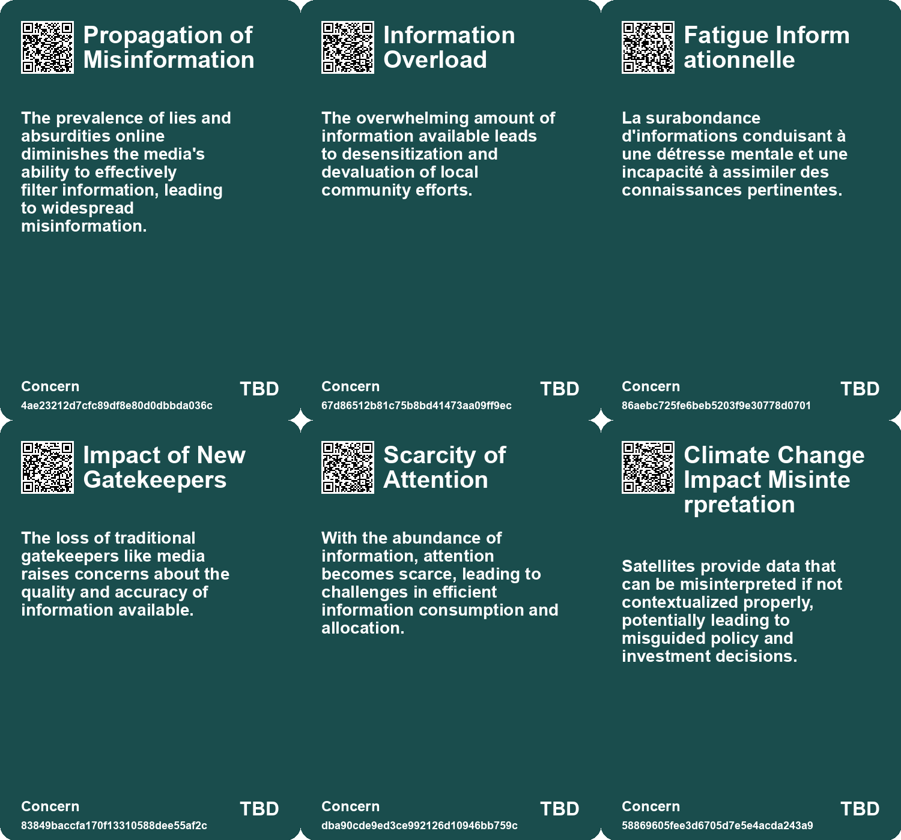
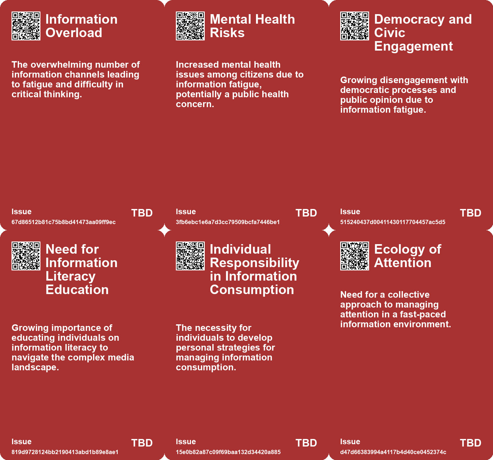
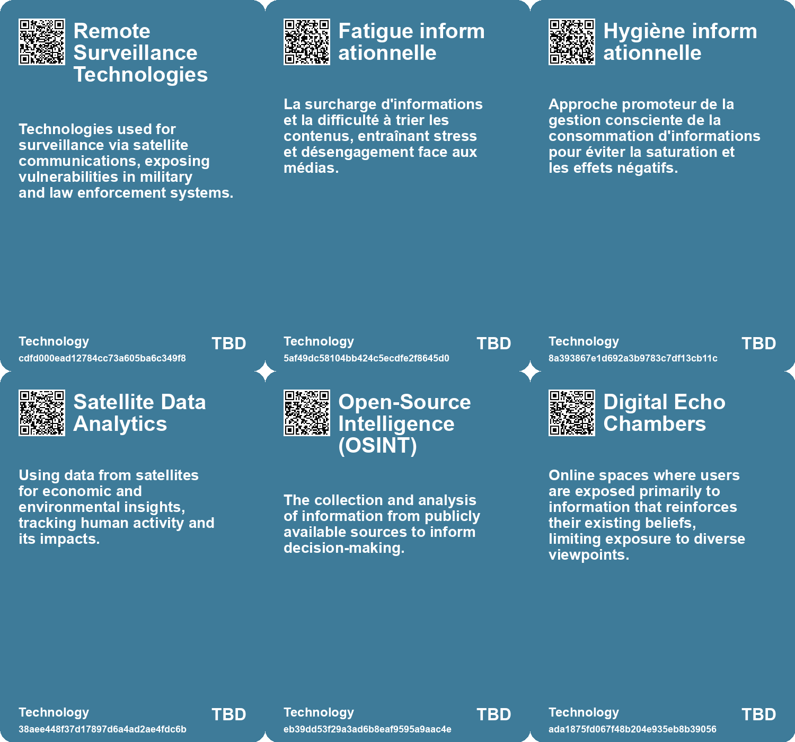

# *Topic*: Information Saturation

# Summary

The increasing complexity of information management is a central theme across various sectors. Citizens in France are experiencing information fatigue due to the overwhelming amount of content available through continuous media and social networks. This fatigue has implications for mental health and democratic engagement, prompting calls for more mindful consumption of information. Similarly, organizations are recognizing the need for curated knowledge bases to enhance decision-making. By integrating advanced technologies like retrieval-augmented generation, businesses can better manage information overload and improve accountability.

In the realm of technology and security, vulnerabilities in satellite communications have been exposed, revealing that many signals remain unencrypted and accessible to eavesdroppers. This raises significant concerns about the protection of sensitive data, highlighting the urgent need for enhanced encryption measures. The discussion extends to the broader implications of digital technologies, where the concept of "enshittification" in social media platforms points to a decline in quality driven by a lack of competition and regulation. This decline emphasizes the necessity for regulatory frameworks to protect user experiences.

The educational landscape is also evolving in response to misinformation. Finland's innovative approach to integrating digital literacy and fact-checking into its curriculum aims to equip students with critical thinking skills necessary for navigating the digital world. This proactive strategy contrasts with the challenges posed by the digital age, where the preservation of data is increasingly at risk. The potential for a "Digital Dark Age" looms as digital files become obsolete, underscoring the importance of sustainable data preservation efforts.

The impact of artificial intelligence on information dissemination is profound. AI is reshaping how users access and process information, often surpassing traditional search engines in providing tailored responses. However, the rise of AI also brings challenges, including concerns about trust and the potential for misinformation. The need for responsible AI usage is paramount, as organizations strive to balance innovation with ethical considerations.

In the context of communication, the limitations of tools like PowerPoint and digital whiteboards are critiqued for prioritizing form over substance. This shift can lead to fragmented ideas and hinder effective communication. The emphasis on visual appeal over content quality raises questions about the effectiveness of these tools in fostering meaningful dialogue.

Finally, the exploration of cultural and historical contexts reveals how deep studies in various subjects can yield insights into broader societal issues. The Talmud's teachings, for instance, encourage a multifaceted approach to understanding complex problems, suggesting that embracing diverse perspectives can help counteract the negative effects of technology on society. This holistic view is essential as we navigate the challenges of the modern information landscape.

# Seeds

|    | name                                           | description                                                                                      | change                                                                                                        | 10-year                                                                                                                        | driving-force                                                                                            |
|---:|:-----------------------------------------------|:-------------------------------------------------------------------------------------------------|:--------------------------------------------------------------------------------------------------------------|:-------------------------------------------------------------------------------------------------------------------------------|:---------------------------------------------------------------------------------------------------------|
|  0 | Holographic Learning Principle                 | Deep study of one subject reveals insights about the entire reality.                             | Shift from superficial learning to deep, interconnected understanding of knowledge.                           | Education systems may adopt more interdisciplinary approaches, emphasizing deep study of singular subjects.                    | Growing recognition of interconnectedness in knowledge and the need for holistic understanding.          |
|  1 | Information Post-Scarcity                      | AI reduces content production costs to zero, leading to a surplus of information.                | Shifting from scarcity in content production to a state of abundance and overproduction.                      | A future where content is produced in excess, creating new dynamics in consumption and attention.                              | Advancements in AI technology enabling mass content generation and transformation.                       |
|  2 | Attention Economy                              | Amidst information abundance, the attention of users becomes increasingly scarce.                | Transitioning from content scarcity to a critical shortage of user attention.                                 | New strategies and tools will emerge to capture and retain user attention in a saturated market.                               | The overwhelming influx of information necessitating efficient attention allocation.                     |
|  3 | Emergence of New Aggregators                   | The superabundance of content may lead to rapid creation and collapse of aggregators.            | Transitioning from stable, entrenched aggregators to a fast-paced innovation cycle.                           | A marketplace characterized by transient aggregators rapidly emerging and failing, increasing competition.                     | The fluidity of content availability and the necessity for aggregation in an oversaturated market.       |
|  4 | Holographic Learning Principle                 | Deep study of one subject reveals insights about the entire reality.                             | Shift from superficial learning to deep, interconnected understanding of knowledge.                           | Education systems may adopt more interdisciplinary approaches, emphasizing deep study of singular subjects.                    | Growing recognition of interconnectedness in knowledge and the need for holistic understanding.          |
|  5 | Advanced Data Analytics in Resource Management | Implementing sophisticated analytics for evaluating resource volumes based on satellite imagery. | Shift from manual estimation to automated, data-driven analysis for resource monitoring.                      | Data analytics may provide real-time insights into resource levels, improving decision-making processes.                       | The increasing availability of big data and the demand for real-time information in resource management. |
|  6 | Midinformation Concept                         | The emergence of 'midinformation' characterized by ambiguity and incomplete data.                | From clear, concise information to a reality where ambiguity is increasingly common in knowledge acquisition. | In 10 years, systems may evolve to better handle complex and ambiguous information rather than just providing certainty.       | The complex nature of knowledge and the limitations of current information systems to address it.        |
|  7 | Digital Information Systems Opacity            | Concerns about the lack of transparency in modern information retrieval systems.                 | From clear, accessible information to systems that are often opaque and difficult to understand.              | In 10 years, there may be a push for transparency and accountability in information retrieval processes, enhancing user trust. | Growing awareness and concern over data privacy and the complexities of algorithms.                      |
|  8 | Cognitive Overload from Information            | The volume of information produced is causing cognitive overload for individuals.                | Shift from manageable information processing to overwhelming amounts of data.                                 | In 10 years, cognitive overload may lead to burnout and reduced productivity.                                                  | The ease of generating content leads to an exponential increase in information available.                |
|  9 | Critique of Infinite Choices                   | Concern about the overwhelming nature of endless choices in media and consumer goods.            | From abundance of choices leading to dissatisfaction to a focus on quality and depth.                         | A cultural shift towards valuing limited options that enhance satisfaction and creativity.                                     | Fatigue from constant curation and the search for meaningful experiences.                                |

# Concerns

|    | name                                       | description                                                                                                                                                              |
|---:|:-------------------------------------------|:-------------------------------------------------------------------------------------------------------------------------------------------------------------------------|
|  0 | Fatigue Informationnelle                   | La surabondance d'informations conduisant à une détresse mentale et une incapacité à assimiler des connaissances pertinentes.                                            |
|  1 | Impact of New Gatekeepers                  | The loss of traditional gatekeepers like media raises concerns about the quality and accuracy of information available.                                                  |
|  2 | Scarcity of Attention                      | With the abundance of information, attention becomes scarce, leading to challenges in efficient information consumption and allocation.                                  |
|  3 | Climate Change Impact Misinterpretation    | Satellites provide data that can be misinterpreted if not contextualized properly, potentially leading to misguided policy and investment decisions.                     |
|  4 | Data Overload and Processing Challenges    | The exponential growth of digital data can overwhelm traditional OSINT methods, risking valuable insights being missed.                                                  |
|  5 | Information Overload                       | The transition from physical filing systems to digital formats has led to an overwhelming influx of information, making it challenging to discern quality and relevance. |
|  6 | Ethical Implications of Information Access | The system of information retrieval may perpetuate biases and inequities, leading to ethical concerns regarding access to knowledge and representation.                  |
|  7 | Dependence on Curation                     | Over-reliance on curated knowledge bases may hinder adaptability and the exploration of diverse information sources.                                                     |
|  8 | Overemphasis on Form vs. Content           | The trend prioritizes aesthetic and format in communication over substantial content, undermining the efficacy of information exchange.                                  |
|  9 | Overwhelm from Infinite Choices            | The abundance of choice in media and entertainment leads to decision fatigue and dissatisfaction with experiences.                                                       |

# Cards

## Concerns

## Behaviors

## Issue

## Technology

# Links

* [Finland's Innovative Approach to Combating Fake News Through Education](https://futures.kghosh.me/ad15fbe04bbe50ec3436c61403d19fca)
* [New Study Reveals Alarming Vulnerabilities in Satellite Communications Security](https://futures.kghosh.me/ffd300364e8c6c6447392262d1fdd37a)
* [Harnessing Satellite Data and AI for Enhanced Economic and Environmental Insights](https://futures.kghosh.me/2c79a113d206a8ec8ec147422fcea12c)
* [Exploration de la Fatigue Informationnelle en France : Enquête et Impacts](https://futures.kghosh.me/ce346e8425de00a86fef1d4b7e1f9eaf)
* [Exploring Grade Inflation and Compression at Harvard: Challenges to Academic Risk-Taking](https://futures.kghosh.me/add3440e907f0e4e9cbb7fbbdd544a90)
* [Exploring the Impact of AI and LLMs on Content Creation and Information Scarcity](https://futures.kghosh.me/f87ae242f79a85b180657a74b814aa0f)
* [Google's Transition to Remote Work and the Evolution of Information Security](https://futures.kghosh.me/7a34820852cf03cbbdb1fb75ca3b629c)
* [Exploring the Holographic Theory of Learning and Its Implications for Understanding the World](https://futures.kghosh.me/73c303cb31ea7790cfe52c4684ba3cd5)
* [Exploring the Ordinary Origins of Surveillance: Insights from Hochman and González's New Books](https://futures.kghosh.me/ccdebc20efc0694474f1c64e2835e260)
* [Exploring the Holographic Theory of Learning and Its Implications for Understanding the World](https://futures.kghosh.me/6b0e547f46a73fe12e4fcfd5d9125ea7)
* [The Impact of the Internet and AI on Human Cognition and Productivity](https://futures.kghosh.me/652fc7ec1f422e931bc5a9ba8011650a)
* [Exploring the Modern Entertainment Landscape and Its Societal Implications](https://futures.kghosh.me/c5c2c794f1426e6e307a9df3f9ff61f6)
* [Innovative Satellite Technology for Monitoring Oil Reserves Efficiently](https://futures.kghosh.me/4adef1b6dbfef196be400697e52a2160)
* [The Shift from SEO to AI: Enhancing User Experience and Information Retrieval](https://futures.kghosh.me/b109d3163c90428c0a67504bd2878adf)
* [Nostalgia for Simplicity: The Burden of Infinite Choice in Modern Life](https://futures.kghosh.me/7b316ebe449187b79e519a8c6d12a2cd)
* [The Legacy of the Filing Cabinet: From 19th Century Innovation to Modern Information Management](https://futures.kghosh.me/b074eff3e846c24db97af8524929939a)
* [Navigating Information Overload: The Role of Knowledge Management and AI in Decision-Making](https://futures.kghosh.me/3e292858cf09bb02c3e254ede24744f6)
* [Understanding Polarization: Healing Our Relationship with Technology and Embracing Diverse Perspectives](https://futures.kghosh.me/c1bb890337ef382bfaa5720c9fd05134)
* [The Limitations of Digital Whiteboards in Effective Communication](https://futures.kghosh.me/0427292acb53be01ba35b3b5b561cb59)
* [Richard Feynman's Insight on Essential Knowledge for Future Generations](https://futures.kghosh.me/f74cce891f9a28209838900562566179)
* [Preserving Our Digital Future: The Challenge of Avoiding a Digital Dark Age](https://futures.kghosh.me/86e67181c4dcbce08848023aa2929bcb)
* [Exploring Enshittification, Futures Thinking in Architecture, and the Decline of Urban Scenius](https://futures.kghosh.me/4c0323220b8e42ef6b79dd4d720ce80a)
* [Transforming Open-Source Intelligence: The Role of AI and Machine Learning in Modern Data Analysis](https://futures.kghosh.me/a9c9a0993041b8d05c670c511de99d6b)