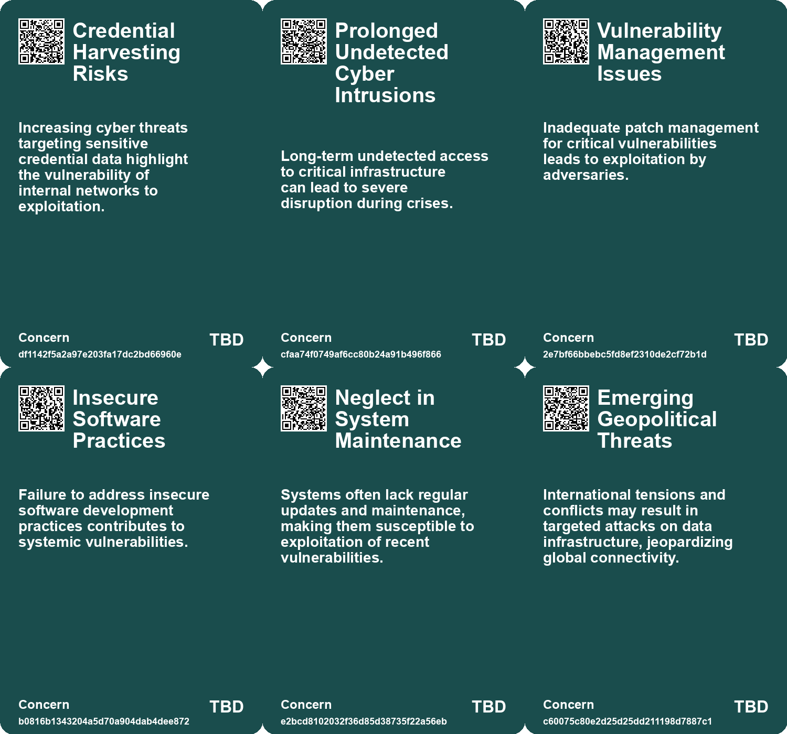
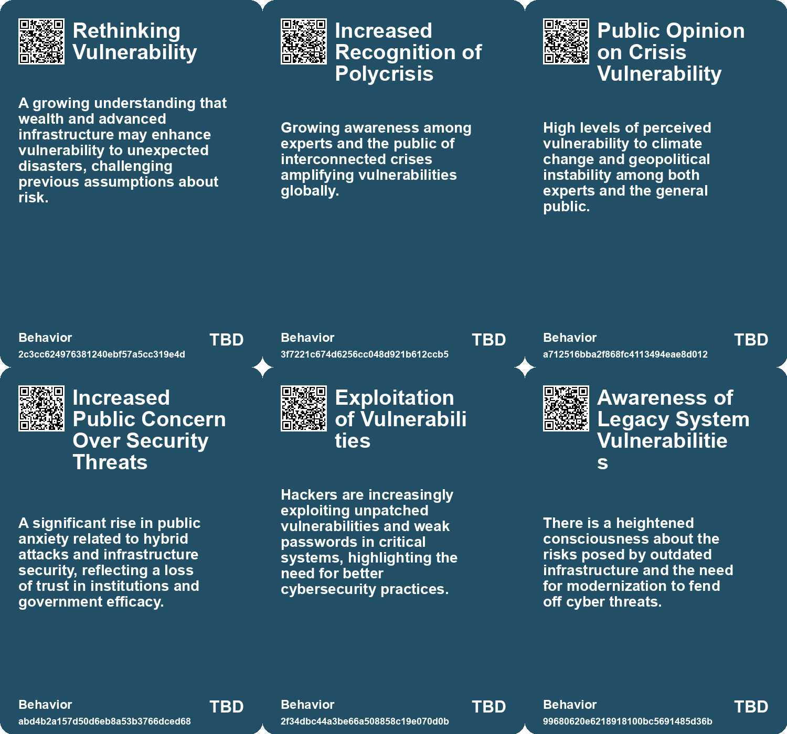
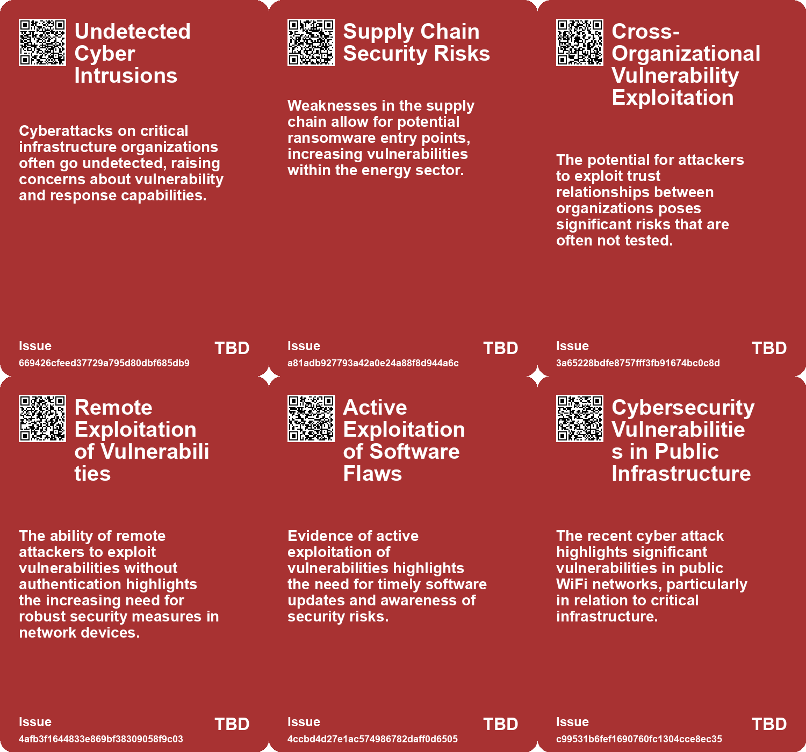
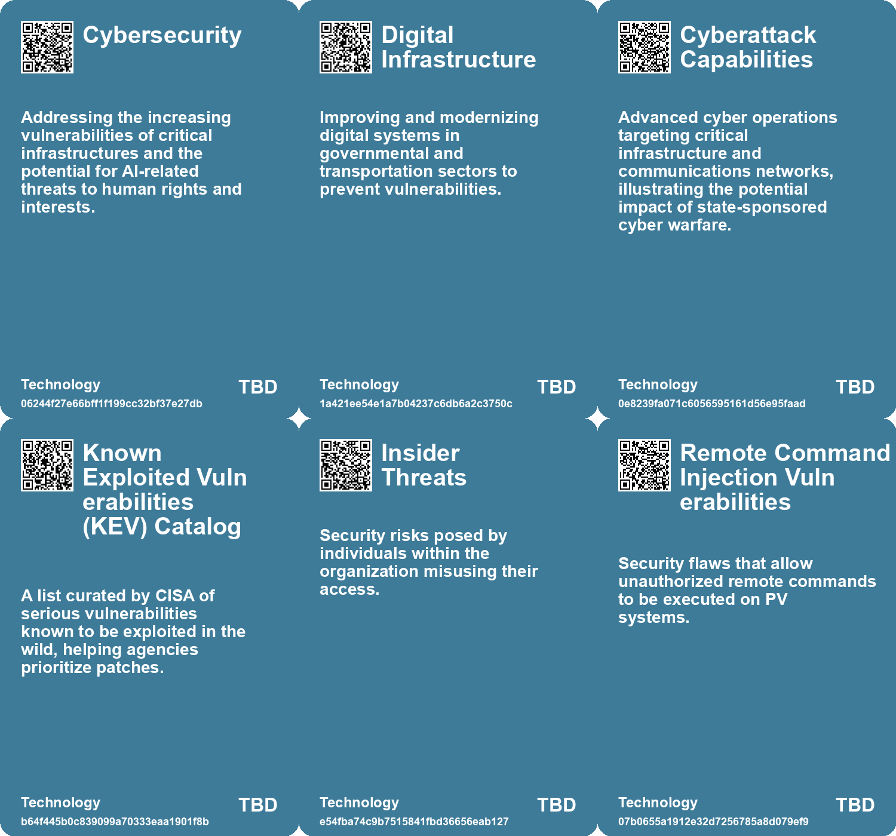

# *Topic*: Infrastructure Vulnerability

# Summary

Cybersecurity threats are escalating across various sectors, with significant warnings issued by U.S. cyber agencies regarding potential attacks from Iranian-affiliated hackers targeting critical infrastructure. Organizations in energy, water, and healthcare are urged to enhance their defenses, particularly those linked to Israeli operations. The advisory highlights the risk of ransomware and destructive attacks driven by political motives.

The water sector is particularly vulnerable, as evidenced by recent breaches in the UK and the US. These incidents have raised alarms about the security of operational technology in water utilities. Government agencies are responding with recommendations for improved security measures and legislative efforts to protect vital water infrastructure. Proactive investments and collaboration are deemed essential for resilience against evolving cyber threats.

Infrastructure degradation poses significant risks, as seen in the flash flood in the Indian Himalayas. The impact of climate change on infrastructure is profound, perpetuating social inequality and necessitating a shift towards sustainable development. The interconnectedness of disasters, such as wildfires and hurricanes, calls for a modernized risk framework that emphasizes local resilience supported by systemic measures.

Public safety concerns have emerged following a cyber attack on UK train station WiFi networks, attributed to an insider threat. This incident underscores the vulnerabilities of public infrastructure and the need for stronger internal security measures. As public WiFi becomes more common, the balance between convenience and security must be reevaluated to protect critical transportation systems.

Airports are increasingly susceptible to extreme weather and climate change effects. Strategies for resilience include designing new structures to withstand harsh conditions and retrofitting existing assets. The need for a holistic approach to resilience is emphasized, with examples of upgrades at major airports to manage flooding and enhance sustainability.

Cybercrime remains a pressing issue in the UK, with phishing attacks being the most common threat. Organizations face significant risks from impersonation, malware, and ransomware attacks, highlighting the need for robust cybersecurity measures. The UK government is particularly vulnerable to ransomware attacks due to outdated infrastructure and insufficient investment in cybersecurity.

Germany is experiencing a rise in attacks on its critical infrastructure, including cyberattacks and sabotage targeting airports and rail services. Security experts warn of the destabilizing effects of these attacks on public trust and call for decisive government action. The involvement of organized crime and potential extremist sabotage raises concerns about the security landscape.

The energy sector in the UK faces heightened cybersecurity threats amid a push for AI integration. Legacy systems increase vulnerability, and ransomware attacks are surging, particularly through supply chain weaknesses. Energy providers must modernize their security measures to protect critical infrastructure and ensure resilience against cyber adversaries.

Emerging risks, particularly related to climate change, geopolitical instability, and cybersecurity, are highlighted in the Future Risks Report 2025. The report emphasizes the need for a holistic approach to risk management, with local solutions prioritized. The insurance sector is identified as a crucial player in addressing these complex challenges.

In the automotive industry, a significant data breach involving the VW Group exposed sensitive information of electric vehicle owners, underscoring the need for improved cybersecurity measures. Similarly, the maritime sector faces growing cyber threats, with hackers targeting businesses for financial gain. The potential for conflicts of interest arises when market investors may benefit from breaches.

Chinese state hackers have compromised critical tools, raising security concerns and prompting calls for better defenses. The U.S. Cybersecurity and Infrastructure Security Agency has identified vulnerabilities in various systems, emphasizing the importance of timely patching and robust security practices. As cyber threats evolve, organizations must remain vigilant and proactive in safeguarding their infrastructure.

# Seeds

|    | name                                                | description                                                                                                     | change                                                                                                                     | 10-year                                                                                                                  | driving-force                                                                                                                         |
|---:|:----------------------------------------------------|:----------------------------------------------------------------------------------------------------------------|:---------------------------------------------------------------------------------------------------------------------------|:-------------------------------------------------------------------------------------------------------------------------|:--------------------------------------------------------------------------------------------------------------------------------------|
|  0 | Increased Cybersecurity Threats                     | Heightened risks from Iranian-affiliated hackers targeting U.S. critical infrastructure.                        | Shift from low-level to high-stakes cyber threats against essential services.                                              | More sophisticated cyber defenses and international cybersecurity coalitions emerge.                                     | Geopolitical tensions and enhanced hacking capabilities motivate cyber aggression.                                                    |
|  1 | Aging Infrastructure Vulnerabilities                | Energy sector's reliance on outdated systems increases susceptibility to cyberattacks.                          | Transition from old, vulnerable systems to modern, secure infrastructures.                                                 | A more resilient energy sector with updated technical defenses against evolving cyber threats.                           | Necessity for modernization to meet contemporary cybersecurity standards.                                                             |
|  2 | Supply Chain Cybersecurity Risks                    | Attackers targeting suppliers lead to increased vulnerability across energy sector.                             | From isolated security protocols to interdependence in supply chain security measures.                                     | More stringent supply chain cybersecurity frameworks established across industries due to dependency risks.              | Evolving tactics of ransomware groups necessitate a holistic supply chain security approach.                                          |
|  3 | Default Password Risks                              | Insecure software and default passwords contribute to cybersecurity vulnerabilities.                            | Shift from acceptance of default passwords to a culture of secure software practices.                                      | In 10 years, secure coding practices will be standard, reducing vulnerabilities from default settings.                   | Growing awareness of cybersecurity risks will drive the push for secure software development.                                         |
|  4 | Cybersecurity Vulnerabilities in Public WiFi        | Recent cyber attacks expose risks in public WiFi networks used by critical infrastructure.                      | Shift from underestimating public WiFi security to recognizing it as a critical risk factor.                               | Public WiFi networks will likely see enhanced security measures and regulations, improving overall cybersecurity.        | Growing awareness of cyber threats and their impact on public safety will drive demand for better security protocols.                 |
|  5 | Insider Threats to Cybersecurity                    | Insider breaches highlight vulnerabilities in cybersecurity management within organizations.                    | Shift from focusing solely on external threats to acknowledging significant risks from within organizations.               | Organizations will implement more rigorous internal security measures to mitigate insider threats effectively.           | Increased incidents of insider threats will compel companies to strengthen internal monitoring and access protocols.                  |
|  6 | Increased Cyber Threats to Water Sector             | Growing incidents of cyberattacks on water utilities indicate heightened vulnerability.                         | The water sector is shifting from underestimating cyber risks to prioritizing cybersecurity measures.                      | In 10 years, water utilities will adopt advanced cybersecurity frameworks and technologies to safeguard against threats. | The increasing sophistication and frequency of cyberattacks drive the need for enhanced security measures in critical infrastructure. |
|  7 | Increased Awareness of Infrastructure Vulnerability | Rising incidents raise awareness about the vulnerabilities of water infrastructure to cyber threats.            | Awareness is shifting from ignorance about vulnerabilities to a proactive stance on cybersecurity in water infrastructure. | In a decade, water infrastructure will be designed with built-in cybersecurity measures as a standard practice.          | Incidents of cyberattacks and their potential impacts prompt a reevaluation of existing infrastructure vulnerabilities.               |
|  8 | Increased Vulnerability of Critical Infrastructure  | UK's critical national infrastructure is increasingly vulnerable to cyber-attacks due to inadequate investment. | From underinvestment in cybersecurity to a recognition of the urgent need for significant upgrades.                        | In 10 years, critical infrastructure may have robust cybersecurity measures, reducing attack risks significantly.        | Growing awareness of cyber threats and the necessity for secure national infrastructure investments.                                  |
|  9 | Potential for Cyber-Physical Attacks                | Emerging risks of cyber-physical attacks on critical infrastructure could threaten safety.                      | From traditional cyber threats to potential physical harm through cyber-attack vectors.                                    | In 10 years, there may be stricter regulations and protections for cyber-physical systems.                               | The need for safety and security in critical infrastructure drives advancements in cybersecurity.                                     |

# Concerns

|    | name                                                  | description                                                                                                                                                   |
|---:|:------------------------------------------------------|:--------------------------------------------------------------------------------------------------------------------------------------------------------------|
|  0 | Credential Harvesting Risks                           | Increasing cyber threats targeting sensitive credential data highlight the vulnerability of internal networks to exploitation.                                |
|  1 | Prolonged Undetected Cyber Intrusions                 | Long-term undetected access to critical infrastructure can lead to severe disruption during crises.                                                           |
|  2 | Vulnerability Management Issues                       | Inadequate patch management for critical vulnerabilities leads to exploitation by adversaries.                                                                |
|  3 | Insecure Software Practices                           | Failure to address insecure software development practices contributes to systemic vulnerabilities.                                                           |
|  4 | Neglect in System Maintenance                         | Systems often lack regular updates and maintenance, making them susceptible to exploitation of recent vulnerabilities.                                        |
|  5 | Emerging Geopolitical Threats                         | International tensions and conflicts may result in targeted attacks on data infrastructure, jeopardizing global connectivity.                                 |
|  6 | Cybersecurity Vulnerabilities in Public WiFi          | Increased reliance on public WiFi exposes vulnerabilities that can lead to unauthorized access to sensitive systems, particularly in critical infrastructure. |
|  7 | Insecure IoT Devices                                  | Continued reliance on poorly secured IoT devices could lead to widespread vulnerabilities and attacks on personal and national infrastructure.                |
|  8 | Cyber Vulnerability of Water Infrastructure           | Water utilities are increasingly vulnerable to cyberattacks that compromise operational technology systems.                                                   |
|  9 | Longevity of Vulnerabilities in Open Source Ecosystem | Prevalent use of outdated vulnerable software versions, like Log4J, continues to expose critical infrastructure to risks.                                     |

# Cards

## Concerns

## Behaviors

## Issue

## Technology

# Links

* [Chinese State Hackers Exploit ArcGIS to Establish Long-Term Network Access](https://futures.kghosh.me/ab99b2dbdb9bfaebc0171005df052979)
* [Overview of Cyber Threats in the UK: Insights from the 2023 Cyber Security Breaches Survey](https://futures.kghosh.me/576f8cf76f713e057b075e2424ea709c)
* [CISA Adds High-Severity Adobe Acrobat Reader Vulnerability to KEV Catalog](https://futures.kghosh.me/089706e00a9c0d142049a6a6c557e3e7)
* [Future Risks Report 2025: Increasing Global Crises and Emerging Risks Analysis](https://futures.kghosh.me/c5ecb012c90eddae1d46c1137e384c86)
* [China's Secret Admission of Cyberattacks on U.S. Infrastructure Linked to Taiwan Conflict](https://futures.kghosh.me/bd6bd379c3077d9f3768f20a111f7fe6)
* [Future Risks Report 2024: Key Findings on Emerging Global Challenges](https://futures.kghosh.me/caf29de5522a914887f9653f8edfd0a6)
* [Evolving Perspectives on Risk Management in the Context of Modern Disasters](https://futures.kghosh.me/cd4f6f65b2486d56699138cd2270044d)
* [The Urgent Need for Enhanced Protection of Undersea Cables for National Security](https://futures.kghosh.me/f421780e31dc53b35c17a72026b14814)
* [Enhancing Airport Resilience to Climate Change: Strategies and Solutions for the Future](https://futures.kghosh.me/a6add16457f9bca667941b2ec045b485)
* [CISA's Red Team Exercise Uncovers Major Security Flaws in Federal Agency After Five Months Undetected](https://futures.kghosh.me/8ce2e3c9b07df17c316a67b21e7397a9)
* [Addressing Threats to Democracy: Strategies for Resilience Against Misinformation and Manipulation](https://futures.kghosh.me/56d1a28746cd95ebaa3d62a4e1f91c3a)
* [Understanding the Financial Motivations Behind Maritime Cyber Security Threats](https://futures.kghosh.me/af7a13a1e97a8ebff3d521dabea087ce)
* [Safeguarding the UK's Energy Sector: The Cybersecurity Challenge in an AI Era](https://futures.kghosh.me/58871ce6d54ebbaf1ac529fa1376eb2a)
* [Increasing Threats to German Infrastructure: Drones, Cyberattacks, and Sabotage](https://futures.kghosh.me/d045d8b5ced2f8d16cc811c965dee5e2)
* [Biden Administration Unveils New Cybersecurity Strategy to Combat Growing Threats](https://futures.kghosh.me/1eaefdcf11b24d5f443b5f4e7645e0a5)
* [Growing Cybersecurity Threats to Water Infrastructure Demand Immediate Action and Collaboration](https://futures.kghosh.me/fb9b2211d0fcea8245837d9b34379d9f)
* [Cyber Attack on UK Train Stations Highlights Public WiFi Security Vulnerabilities](https://futures.kghosh.me/94c1456af1955d62efd074577c67b4e8)
* [Challenges and Opportunities in the 2023 Cybersecurity Job Market: Insights and Strategies](https://futures.kghosh.me/0ab36af538bf262c85b73fa7e7bd657f)
* [Critical Vulnerability in Cisco Emergency Responder Allows Unauthorized Remote Access](https://futures.kghosh.me/639e90afedd3746239c783332a0da15c)
* [Emerging Global Risks: Climate Change, Geopolitical Tensions, and Technological Threats in 2025](https://futures.kghosh.me/c279f12eda98e732755a0f730b9d4d4b)
* [White House Launches Initiative to Secure Open Source Software in Critical Infrastructure](https://futures.kghosh.me/925e58163f39d747785e0e85eeea0f25)
* [Reimagining Infrastructure: Towards a Redistributive and Ecologically Sound Future](https://futures.kghosh.me/177a0857ffe0d07d48cd99a269f28a02)
* [UK Faces High Risk of Catastrophic Ransomware Attack Due to Poor Cybersecurity Investment](https://futures.kghosh.me/3de8b64ba20eb613a72b0479350b5e5b)
* [Transforming Water Utilities: Addressing Security and Sustainability Challenges through Innovation](https://futures.kghosh.me/d54442ea6fe7853d0f8674688c9b7064)
* [VW Group Data Breach Exposes 800,000 EV Owners' Sensitive Information, Raising Cybersecurity Concerns](https://futures.kghosh.me/74093ff7c82ad21987f693911e97634c)
* [Publicly Accessible PV Monitoring Systems Pose Cybersecurity Risks](https://futures.kghosh.me/3ac657f7b32d24bb43bddca058e2db25)
* [Urgent Warning: Threats from Iranian Cyber Hackers to U.S. Critical Infrastructure](https://futures.kghosh.me/605e2654bd3bbaa502827084ca7a44be)