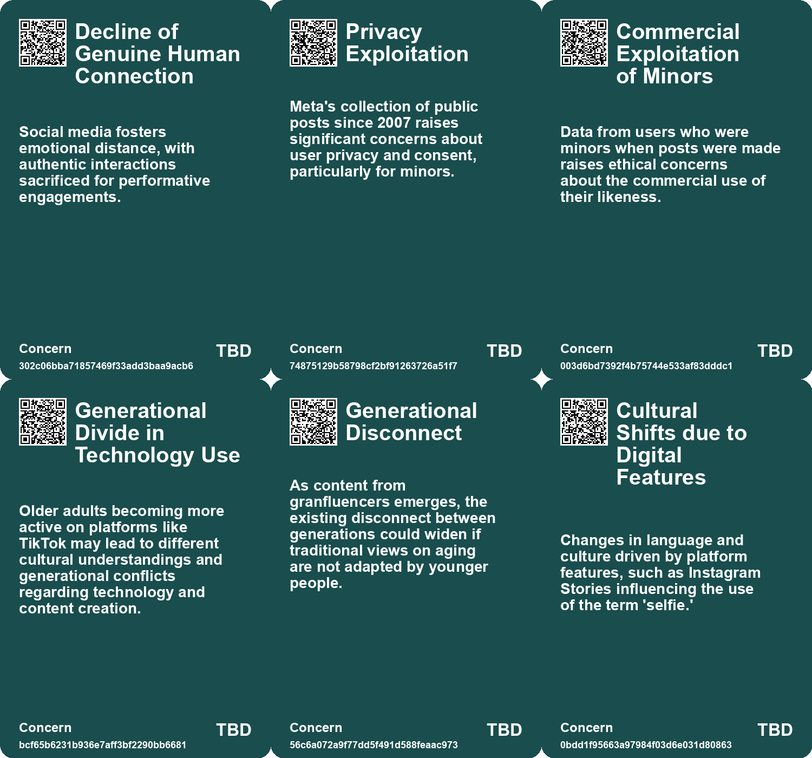
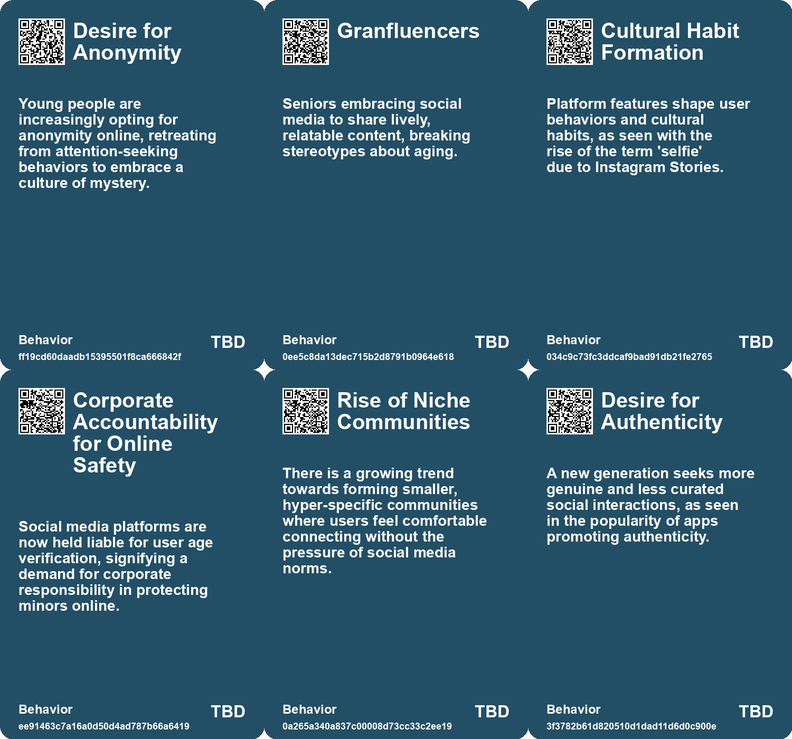
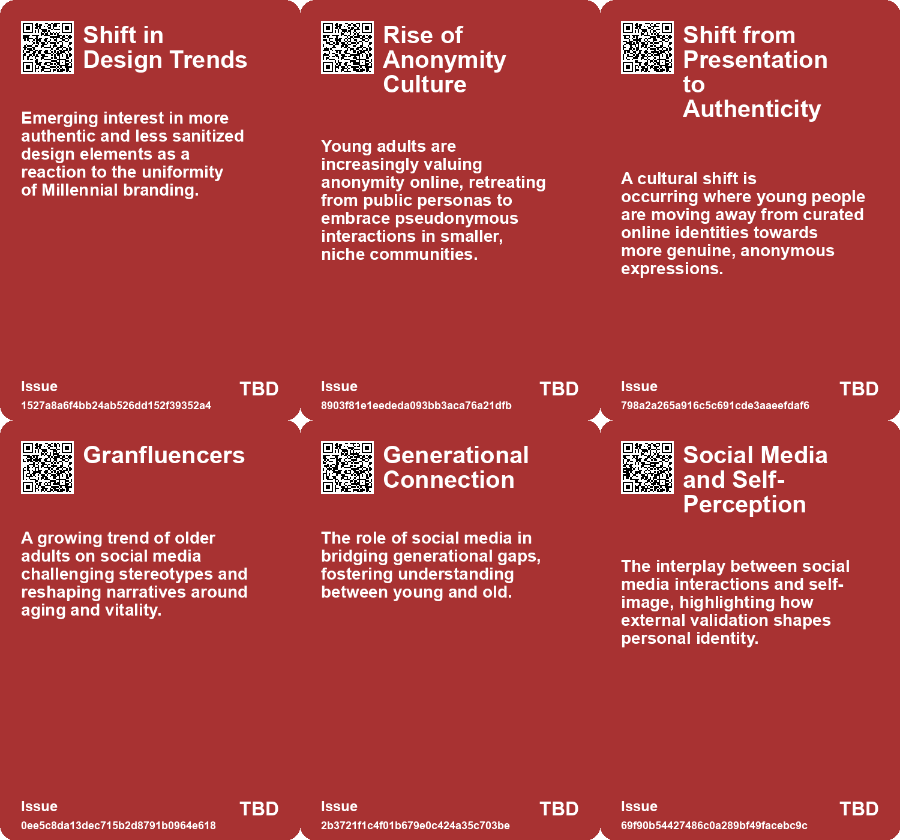
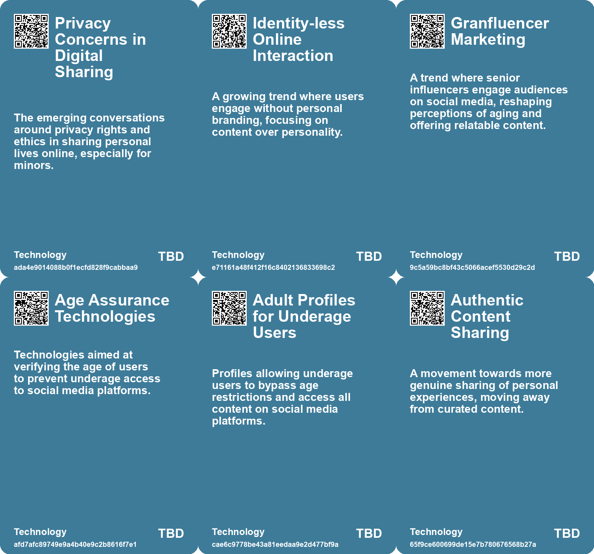

# *Topic*: Instagram-style Maturity

# Summary

The landscape of social media is undergoing significant transformation, marked by a growing desire for authenticity and privacy. Users are increasingly frustrated with platforms like Instagram, which have shifted from personal sharing to a curated space dominated by influencers and professional content. This has led many to seek refuge in private groups and alternative apps that prioritize genuine connections over public validation. The rise of "granfluencers," older individuals who share their lives on platforms like TikTok, challenges stereotypes about aging and offers a refreshing perspective on later life, emphasizing joy and connection.

Amid these changes, concerns about the impact of social media on mental health, particularly among children, are intensifying. New legislation in Utah and Australia aims to regulate minors' access to social media, reflecting a growing recognition of the potential dangers posed by platforms like TikTok. The addictive nature of these apps, driven by algorithms that promote rapid consumption, raises alarms about the long-term effects on young users' mental well-being.

The pressure on individuals to cultivate personal brands has also escalated, particularly for artists and creators. As the entertainment industry becomes increasingly corporate, the need for self-promotion often overshadows artistic integrity. This trend is compounded by the rise of targeted advertising and algorithmic profiling, which shape users' online experiences and influence their perceptions. The psychological impact of tailored content raises questions about privacy and the commodification of personal data.

Anonymity is emerging as a response to these pressures, particularly among Gen Z users who seek to escape the burdens of personal branding. Platforms like Discord and Tumblr are gaining popularity for their focus on privacy and community, reflecting a shift away from the influencer culture that has dominated social media. This desire for anonymity also intersects with the use of "algospeak," a coded language developed to evade content moderation systems, highlighting the lengths users will go to maintain their freedom of expression.

The hidden economy of spam on social media platforms reveals another layer of complexity. This shadow economy thrives on the exploitation of users and the challenges faced by platforms in managing fraudulent activities. As spam becomes more sophisticated, it underscores the need for integrated solutions that address not just the content but the actors behind it.

Finally, the decline of maturity in political discourse is evident in the behavior of public figures, which often mirrors the juvenile antics seen in social media interactions. This trend raises concerns about the erosion of civic responsibility and the standards expected from leaders. The call for a return to dignity in governance emphasizes the importance of personal choices and civic engagement in restoring a sense of maturity in public life.

# Seeds

|    | name                                  | description                                                                                      | change                                                                                                | 10-year                                                                                                                | driving-force                                                                                                        |
|---:|:--------------------------------------|:-------------------------------------------------------------------------------------------------|:------------------------------------------------------------------------------------------------------|:-----------------------------------------------------------------------------------------------------------------------|:---------------------------------------------------------------------------------------------------------------------|
|  0 | Millennial Rebrand Fatigue            | A growing skepticism towards clichéd Millennial packaging designs.                               | Shift from innovative branding to fatigued responses to designs that pander to Millennial aesthetics. | Consumers might demand authenticity in branding, seeking unique, less commercial aesthetics.                           | Desire for originality and meaningful connections with products, leading to a backlash against superficial branding. |
|  1 | Rise of Anonymity Culture             | Younger generations are increasingly valuing anonymity over personal branding online.            | Shift from valuing personal branding and visibility to preferring anonymity and privacy.              | A future where online identities are predominantly anonymous, fostering different social interactions and communities. | Young people's frustration with surveillance and the pressures of attention-seeking behavior.                        |
|  2 | Nostalgia for Pre-Influencer Internet | Younger users are gravitating towards platforms reminiscent of earlier internet cultures.        | From modern, influence-driven platforms to older, more anonymous formats like IRC and forums.         | A resurgence of older internet cultures that prioritize community and anonymity over visibility.                       | A longing for a simpler, less commercialized online experience.                                                      |
|  3 | Rise of Granfluencers                 | Older adults are gaining popularity on social media, redefining aging stereotypes.               | Shift from negative portrayals of aging to positive, vibrant representations of seniors.              | Granfluencers will become mainstream, influencing societal views on aging and lifestyle choices.                       | Desire for authentic representation and connection across generations in digital spaces.                             |
|  4 | Changing Perspectives on Aging        | Granfluencers challenge traditional views of aging by showcasing active and joyful lives.        | Transition from viewing aging as decline to seeing it as an opportunity for growth and enjoyment.     | Society will embrace a more positive and diverse narrative around aging, impacting policy and marketing.               | Cultural shifts towards acceptance of aging and the celebration of life experiences.                                 |
|  5 | Evolving Beauty Standards             | Older individuals are challenging conventional beauty standards through social media.            | Changing beauty ideals from youth-centric to inclusive of all ages, celebrating aging.                | Beauty industry will adapt to include products and representations catering to older demographics.                     | Growing awareness of diverse beauty and the influence of aging populations on market trends.                         |
|  6 | Challenging Age Stereotypes           | Age-related stereotypes are diminishing, prompting brands to rethink their marketing strategies. | Transitioning from age-defining stereotypes to a more nuanced understanding of consumer behavior.     | In 10 years, marketing will reflect a diverse understanding of consumer behavior across ages, ignoring stereotypes.    | Cultural shifts towards inclusivity and acceptance of varied interests across age groups are behind this change.     |
|  7 | Make Instagram Instagram Again        | A campaign advocating for more authentic and less curated content on Instagram.                  | Shift from curated content to more authentic, everyday sharing on social media.                       | In 10 years, social media could prioritize authentic interactions over curated aesthetics.                             | A growing fatigue among users with the pressure to curate perfect content.                                           |
|  8 | Influencer Fatigue                    | Users feel overwhelmed by professionalized content and influencers on social media.              | Transition from influencer-driven content to more grassroots, user-generated content.                 | Influencer culture may shift towards more genuine and relatable content creators.                                      | User disillusionment with the curated perfection of influencer lifestyles.                                           |
|  9 | Growth of Alternative Platforms       | New social media apps are emerging to cater to users' desire for authenticity and privacy.       | Emergence of platforms like BeReal that focus on more genuine sharing.                                | Diverse social media platforms may thrive based on authenticity and community.                                         | The search for alternatives to mainstream social media giants like Instagram.                                        |

# Concerns

|    | name                                    | description                                                                                                                                                                    |
|---:|:----------------------------------------|:-------------------------------------------------------------------------------------------------------------------------------------------------------------------------------|
|  0 | Decline of Genuine Human Connection     | Social media fosters emotional distance, with authentic interactions sacrificed for performative engagements.                                                                  |
|  1 | Privacy Exploitation                    | Meta's collection of public posts since 2007 raises significant concerns about user privacy and consent, particularly for minors.                                              |
|  2 | Commercial Exploitation of Minors       | Data from users who were minors when posts were made raises ethical concerns about the commercial use of their likeness.                                                       |
|  3 | Generational Divide in Technology Use   | Older adults becoming more active on platforms like TikTok may lead to different cultural understandings and generational conflicts regarding technology and content creation. |
|  4 | Generational Disconnect                 | As content from granfluencers emerges, the existing disconnect between generations could widen if traditional views on aging are not adapted by younger people.                |
|  5 | Cultural Shifts due to Digital Features | Changes in language and culture driven by platform features, such as Instagram Stories influencing the use of the term 'selfie.'                                               |
|  6 | Privacy Risks                           | The requirement for increased age verification may compromise user privacy and data protection for all social media users.                                                     |
|  7 | Misplaced Responsibility                | The legislation may undermine parental authority by placing responsibility for age verification on social media platforms instead.                                             |
|  8 | Loss of Authenticity in Social Media    | The shift towards curated content and professionalization dilutes genuine interactions among users, leading to disconnection from the platform's original purpose.             |
|  9 | Nostalgia for Simplicity                | There is a growing sentiment that the past simplicity of social interactions and media consumption was more fulfilling and less stressful.                                     |

# Cards

## Concerns

## Behaviors

## Issue

## Technology

# Links

* [The Psychological Impact of Algorithmic Profiling and Surveillance on Self-Identity in the Digital Age](https://futures.kghosh.me/70ebc812b72117e2ce11248d77ec7d37)
* [Exploring the Future: How Technology Will Transform Society by 2034](https://futures.kghosh.me/8ef50cfd87ff3eedbc028932b07520b3)
* [Critique of Millennial Branding in Consumer Packaging and Its Impact](https://futures.kghosh.me/15c3e276ff4d0cdae6da27cb3d8431c5)
* [Granfluencers: Redefining Aging with Humor and Positivity on Social Media](https://futures.kghosh.me/11ceca954d07bbec1f31e6690744ac77)
* [The Burden of Self-Promotion: Navigating Art in the Age of Personal Branding](https://futures.kghosh.me/2306b74e2c380b5208c7752bd78c4e12)
* [The Rise of Anonymity: Gen Z's Shift from Personal Branding to Privacy Online](https://futures.kghosh.me/52a829c92d96543f396d37b44440c475)
* [The Rise of Industrialized Sentiment Manipulation and the Need for Digital Identity Verification](https://futures.kghosh.me/344ece8d21b6241ead5160fe9a38742f)
* [The Rise of Algospeak: A Response to Social Media Moderation Challenges in America](https://futures.kghosh.me/fe5ece17d1050e9097bd9a2e6e0ef50c)
* [Brands Embrace Age Diversity: Engaging Consumers Across Generations](https://futures.kghosh.me/f7a0c499386ab051f0f92f3f4749c73d)
* [Exploring the Chaos and Creativity of TikTok: A Deep Dive into Its Culture and Impact](https://futures.kghosh.me/d610f62898f523fa08175f31fb406ea2)
* [Australia Enacts Historic Law to Ban Social Media for Under-16s Amid Controversy](https://futures.kghosh.me/58b47322e3d3eb8da49e7d66fcea28f5)
* [The Decline of Political Maturity in America: A Call for Responsible Citizenship](https://futures.kghosh.me/ec5b543a174bedb5387b497cc449e5b9)
* [Exploring the Modern Entertainment Landscape and Its Societal Implications](https://futures.kghosh.me/c5c2c794f1426e6e307a9df3f9ff61f6)
* [Exploring the Complex Underground Economy of Spam on Social Media Platforms](https://futures.kghosh.me/624824a70a2ff3ab1c5aaafdfbf293e7)
* [Nostalgia for Simplicity: The Burden of Infinite Choice in Modern Life](https://futures.kghosh.me/7b316ebe449187b79e519a8c6d12a2cd)
* [Meta's Shift to AI: A New Era of Engagement or Manipulation?](https://futures.kghosh.me/00fc141d850089c669b0fbd1de4cdb80)
* [The Alarming Rise of TikTok Use Among Young Children and Its Impact on Mental Health](https://futures.kghosh.me/86de953915dd0ccbcfe0909f371f9f70)
* [Utah Enacts Strict Social Media Regulations for Teenagers to Enhance Online Safety](https://futures.kghosh.me/3f7f68f94d44849513156aae48ee013f)
* [Declining Intelligence: A Widespread Trend Across Generations in the Age of Social Media](https://futures.kghosh.me/76bc01451eb69c84d19e73fa1ed386a7)
* [Nostalgia for Pre-Smartphone Era: A Reflection on Simpler Times](https://futures.kghosh.me/06ca8cfe66a96c99e2830d74b7493668)
* [The Dangers of Living Life as Entertainment in the Social Media Age](https://futures.kghosh.me/b5f05d364d78d7c80ea7e9d40e9831a2)
* [Meta Confirms Use of Public Facebook and Instagram Data for AI Training Since 2007](https://futures.kghosh.me/d39ec90910c047d0471d5f8e1f4d0ad4)
* [Exploring RADAR's Resolutions: Ten Transformative Visions for 2023](https://futures.kghosh.me/0159774192872e1fdb6ebd7c80dbb9de)
* [Understanding Digital Liveness: Key Indicators and User Engagement on Social Media](https://futures.kghosh.me/4d99da5c2a48b37588b98182eb31478a)
* [The Urgent Need for Decentralized Social Media Amidst Political Turmoil](https://futures.kghosh.me/b8ae24e6d0683d0069e0ee250a9d21f0)
* [Reflections on Unconventional Paths and Creative Fulfillment in Life](https://futures.kghosh.me/8a01dfcc1e72828381a84487c32bd572)
* [The Grief of Losing TikTok: Reflections on Digital Community and Corporate Control](https://futures.kghosh.me/7c4e3bc9d5d97f1002eb9e002ccda1c8)
* [The Shift from Public Instagram to Private Community Sharing: A New Era in Social Media](https://futures.kghosh.me/73a2bffc6e94204086528949ae1205e7)