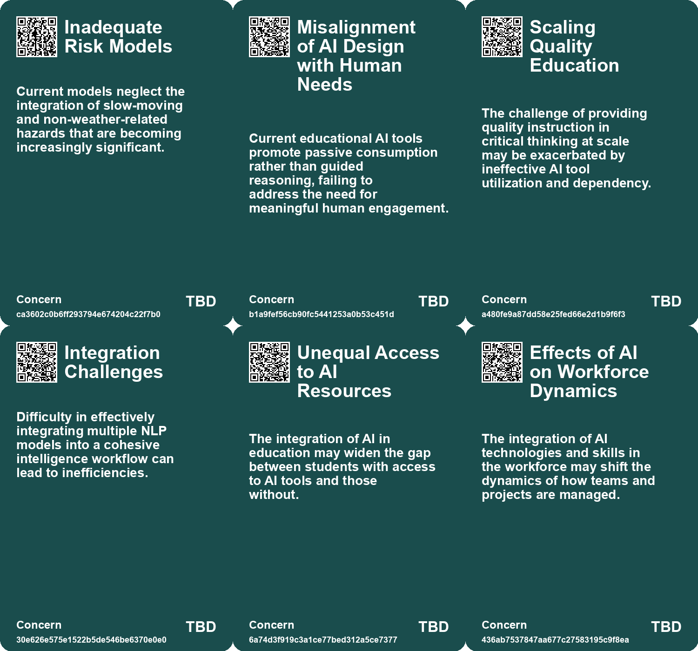
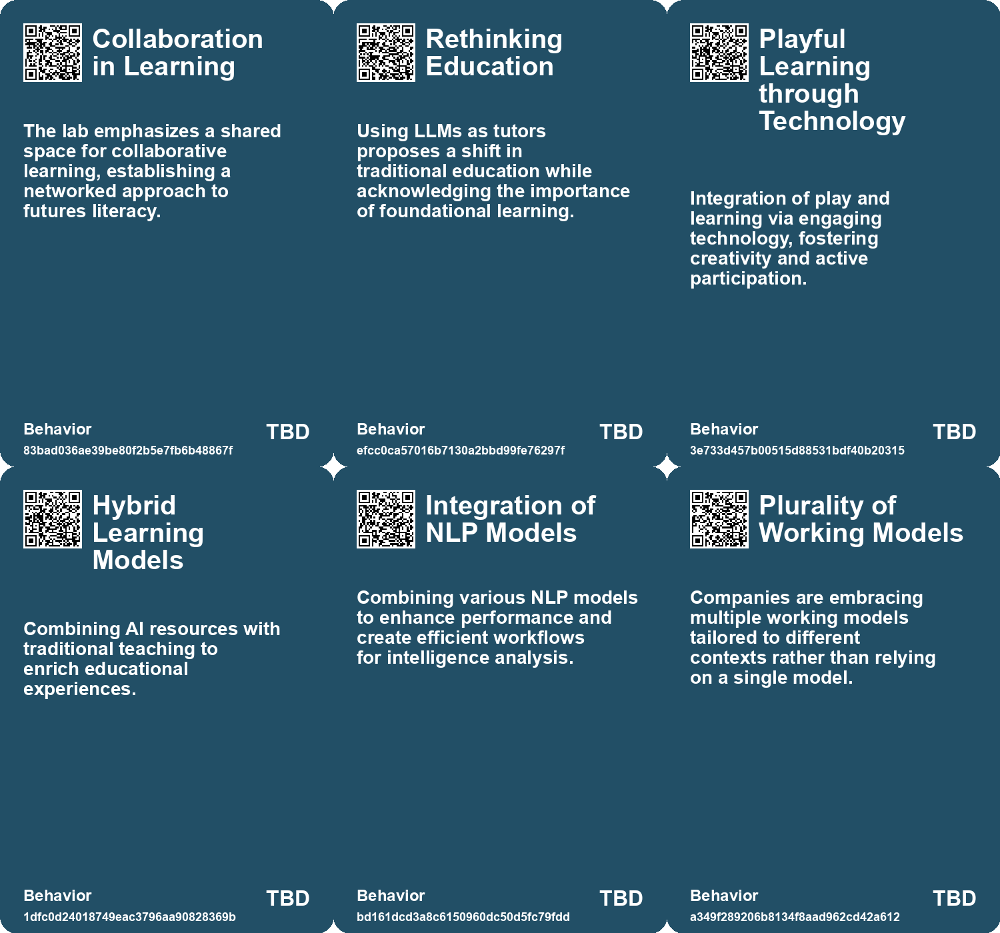
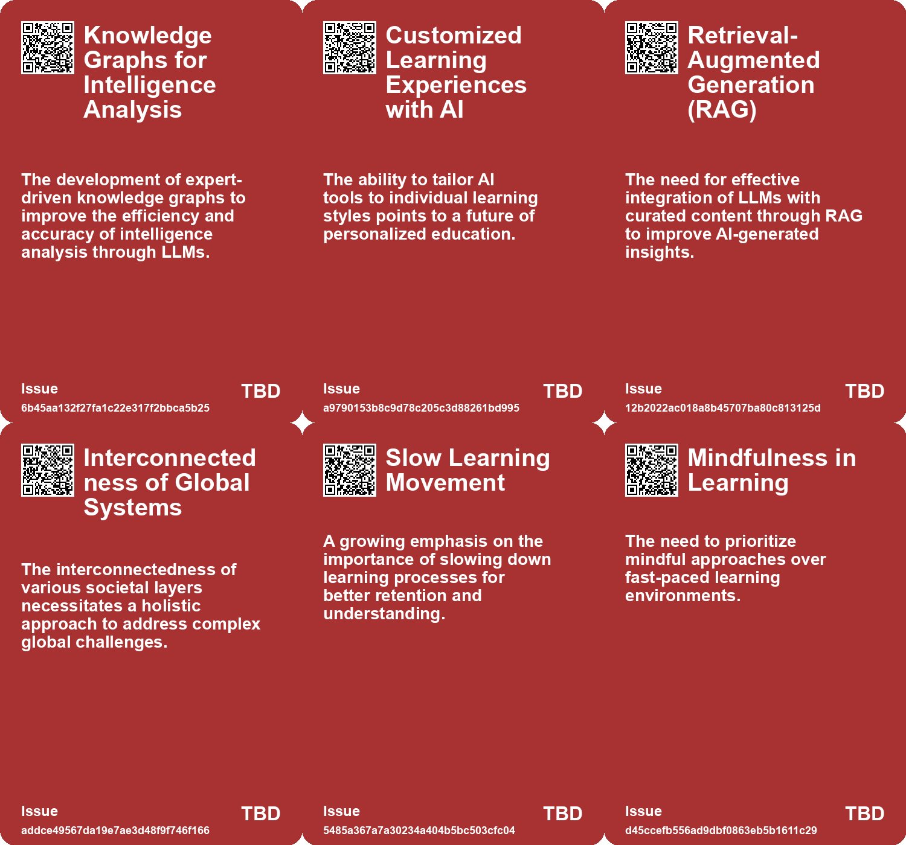
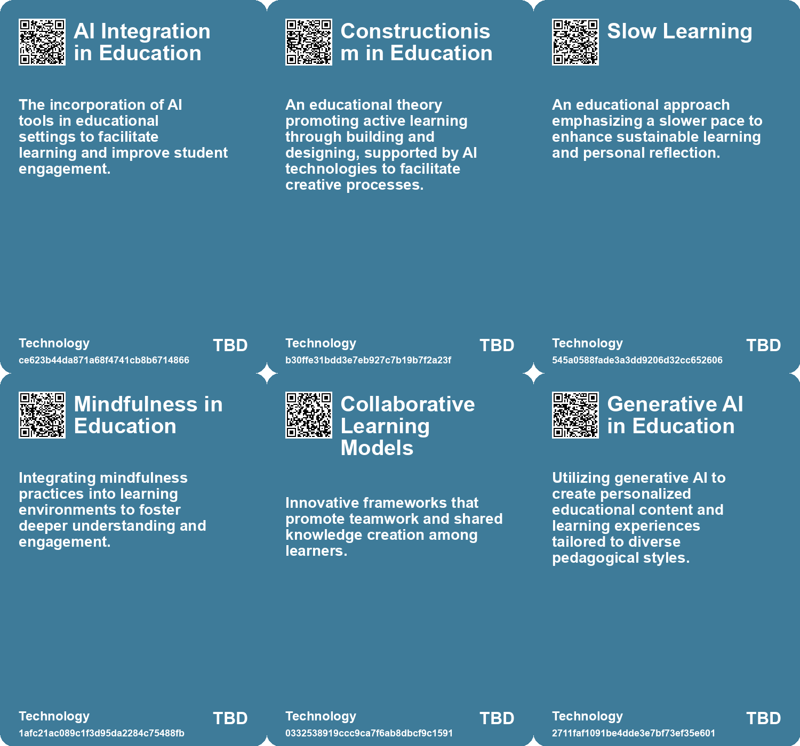

# *Topic*: Integrative Learning Models

# Summary

The landscape of education is undergoing a significant transformation, driven by the integration of artificial intelligence (AI) and personalized learning approaches. Personalized learning is gaining traction, as seen in micro-schools that reject traditional methods in favor of active, tailored experiences. AI models are emerging as valuable tools, acting as tutors and assistants to enhance interactive learning. This shift towards personalized education is complemented by the need for slow and mindful learning, emphasizing continuous reskilling and self-reflection in a fast-paced world.

In the realm of business education, schools are adapting to the demands of the job market by incorporating AI into their curricula. This includes the development of specialized AI chatbots to teach soft skills and enhance leadership training. The focus is on equipping graduates with the necessary technology skills while fostering a broader understanding of AI's implications for the future of work.

The potential of AI extends beyond education into various sectors, including intelligence analysis. Large language models (LLMs) are being explored for their ability to support knowledge extraction and generate expert insights. However, the use of LLMs raises concerns about the need for safeguards and verification processes to ensure accuracy and reliability. The integration of LLMs with knowledge graphs is seen as a promising approach to enhance reasoning capabilities and improve decision-making.

As organizations face escalating uncertainties from climate change and technological advancements, strategic foresight methodologies like scenario planning are becoming essential. Traditional approaches are being challenged by generative AI, which offers new ways to navigate complex scenarios and prepare for divergent futures. This shift highlights the importance of adaptability and resilience in decision-making processes.

The evolving nature of risk in disaster management underscores the interconnectedness of major events, necessitating a modernized risk framework. Local resilience is crucial, but systemic support is needed to address the complexities of contemporary risks effectively. This perspective aligns with the growing recognition of the importance of collaboration and communication skills in talent development, as organizations seek to recruit and nurture individuals who can thrive in a rapidly changing environment.

In the digital age, the abundance of information presents challenges for decision-making. Both humans and machines can struggle with information overload, emphasizing the need for curated knowledge bases. By integrating structured knowledge management practices, organizations can enhance their ability to leverage information effectively while prioritizing privacy and responsible AI usage.

Finally, the emergence of small language models (SLMs) is challenging the dominance of larger models. SLMs offer advantages in efficiency, customization, and privacy, presenting new opportunities for various industries. As the digital landscape continues to evolve, the focus on designing environments that promote critical thinking and autonomy becomes increasingly important. This includes fostering digital competences and creating architectures that encourage informed decision-making and democratic discourse online.

# Seeds

|    | name                                          | description                                                                                | change                                                                                                               | 10-year                                                                                                             | driving-force                                                                                                     |
|---:|:----------------------------------------------|:-------------------------------------------------------------------------------------------|:---------------------------------------------------------------------------------------------------------------------|:--------------------------------------------------------------------------------------------------------------------|:------------------------------------------------------------------------------------------------------------------|
|  0 | AI-enhanced learning                          | The integration of AI in educational settings for personalized learning experiences.       | Shift from traditional, one-size-fits-all education to personalized, AI-driven learning methods.                     | In 10 years, education could be highly personalized, with AI tutors adapting to each child's unique learning style. | The desire for tailored educational experiences that cater to individual needs and preferences.                   |
|  1 | Playful technology in education               | The merging of play and learning through interactive, technology-based tools for children. | Transition from passive learning to engaging, playful educational technologies.                                      | Educational tools may become more gamified, making learning a fun, interactive process for children.                | The understanding that learning is most effective when it is engaging and enjoyable for children.                 |
|  2 | Integration of Practical Examples in Learning | Blending theoretical knowledge with practical real-world applications in courses.          | Move from purely theoretical education to experiential learning approaches.                                          | Learning environments may heavily incorporate real-life scenarios and case studies.                                 | Demand for applicable skills in the workforce pushes educational reform.                                          |
|  3 | Mindfulness in Education                      | The integration of mindfulness practices into learning environments.                       | Transitioning from traditional educational models to those incorporating mindfulness.                                | Mindfulness practices could become standard in classrooms, enhancing student well-being and focus.                  | Increased awareness of mental health issues related to fast-paced learning environments.                          |
|  4 | Collaboration in Learning                     | Emerging collaborative efforts to redefine learning paradigms.                             | Moving from isolated learning experiences to community-driven, collaborative learning.                               | Learning may become a more social, community-oriented process, enhancing engagement.                                | The need for collective problem-solving in a rapidly changing world.                                              |
|  5 | AI as a Learning Assistant                    | AI models are being integrated as tutors for personalized student engagement.              | The role of AI in education is transitioning from supplementary to essential in personalized learning.               | In the future, AI will be a commonplace tutor in classrooms, enhancing student interaction and understanding.       | The need for scalable, effective educational support drives the integration of AI into learning environments.     |
|  6 | Emphasis on Active Learning                   | A growing recognition of the importance of active, exploratory learning methods.           | Education is moving from passive learning environments to active, engaging educational experiences.                  | Active learning will dominate classrooms, fostering critical thinking and creativity in students.                   | Educational research supports active learning as a more effective method for knowledge retention and application. |
|  7 | Reduction of Teacher-Centric Models           | Shift away from traditional teacher-led instruction towards collaborative learning.        | Educational models are changing from teacher-centric to student-centered, focusing on collaboration and exploration. | In a decade, collaborative, student-led learning will be the norm, reducing teacher-centric methodologies.          | The recognition of diverse learning styles and the need for engagement drives this change in teaching paradigms.  |
|  8 | Integration of Multi-Sensory Learning         | Growing interest in multi-sensory approaches to education for better engagement.           | The focus is shifting from rote learning to rich, multi-sensory experiences in education.                            | In 10 years, multi-sensory learning will be a standard practice in classrooms worldwide, improving engagement.      | Research shows that multi-sensory learning enhances memory retention and understanding among students.            |
|  9 | Focus on Generative Learning                  | Increased emphasis on generative learning that encourages creativity and exploration.      | Education is evolving from rote memorization to fostering creativity and generative learning.                        | In the future, generative learning will be integral to curricula, promoting innovation and critical thinking.       | The need for creative problem-solving skills in the modern world is driving this shift in educational focus.      |

# Concerns

|    | name                                       | description                                                                                                                                                       |
|---:|:-------------------------------------------|:------------------------------------------------------------------------------------------------------------------------------------------------------------------|
|  0 | Limited Futures Literacy Progress          | Despite the success of Futures Lab, not all students initially develop confidence in shaping the future, indicating ongoing educational gaps in futures literacy. |
|  1 | Inadequate Risk Models                     | Current models neglect the integration of slow-moving and non-weather-related hazards that are becoming increasingly significant.                                 |
|  2 | Misalignment of AI Design with Human Needs | Current educational AI tools promote passive consumption rather than guided reasoning, failing to address the need for meaningful human engagement.               |
|  3 | Scaling Quality Education                  | The challenge of providing quality instruction in critical thinking at scale may be exacerbated by ineffective AI tool utilization and dependency.                |
|  4 | Integration Challenges                     | Difficulty in effectively integrating multiple NLP models into a cohesive intelligence workflow can lead to inefficiencies.                                       |
|  5 | Unequal Access to AI Resources             | The integration of AI in education may widen the gap between students with access to AI tools and those without.                                                  |
|  6 | Effects of AI on Workforce Dynamics        | The integration of AI technologies and skills in the workforce may shift the dynamics of how teams and projects are managed.                                      |
|  7 | Slow Learning Practices                    | A lack of emphasis on slow learning could undermine the development of sustainable knowledge acquisition methods.                                                 |
|  8 | Standardization of Learning Approaches     | Using AI might push towards a one-size-fits-all model, disregarding individual learning preferences and styles.                                                   |
|  9 | Complexity of Reasoning Approaches         | The complexity of combining various reasoning frameworks with LLMs could lead to implementation difficulties and unforeseen consequences.                         |

# Cards

## Concerns

## Behaviors

## Issue

## Technology

# Links

* [Navigating Information Overload: The Role of Knowledge Management and AI in Decision-Making](https://futures.kghosh.me/3e292858cf09bb02c3e254ede24744f6)
* [Revolutionizing Education: The Role of AI Tutors in Personalized Learning](https://futures.kghosh.me/8f4d495f94113bef7aed043ebceafebb)
* [Enhancing Large Language Models with Knowledge Graphs for Structured Data Processing](https://futures.kghosh.me/69aa55d97023850224f4426e6782bb8b)
* [Reimagining Learning: Embracing Slow Learning in an Accelerated World](https://futures.kghosh.me/042cf62855760b54fa5a194db9e6cf11)
* [Navigating Talent Development and Recruitment in a Rapidly Changing World](https://futures.kghosh.me/14935a7eab6d6c1d8a5ce2f25d3b54bb)
* [Evaluating the Effectiveness of Living Labs: Research Findings and Insights](https://futures.kghosh.me/21110afd93356cd60bb66cf8f6ffdfdb)
* [Enhancing Knowledge Graphs and LLMs with Reasoning Capabilities for Improved AI Applications](https://futures.kghosh.me/54d1cf4ed6ca6edd6ccf6e30622d91a8)
* [Enhancing Digital Competences: Strategies for Navigating Online Challenges](https://futures.kghosh.me/0770afeb444e4bbb336cdc72c07d6688)
* [Understanding Pace Layering: The Resilience of Complex Systems and Civilizations](https://futures.kghosh.me/d8dac76e8ee03a934c18e53570b3a0f8)
* [Understanding LLM Agent Orchestration: Key Components and Strategies](https://futures.kghosh.me/62a60fa0c519e5d7d0b4e480f231f163)
* [Anticipating the Future: A Course on Strategic Foresight and Adaptation](https://futures.kghosh.me/40a99c098bad8dda821b757d8d88a80a)
* [Enhancing Scenario Planning with Generative AI: Overcoming Traditional Limitations](https://futures.kghosh.me/eb3b989221a954bad78ff582adfacdba)
* [Navigating Decision-Making Challenges in an AI-Driven World: The Need for AAA Traits](https://futures.kghosh.me/c474eac8117547a89cac2c805652df9c)
* [Redesigning Organizational Structures for a Rapidly Changing Future](https://futures.kghosh.me/a6112c31b538ae6e0d92d0e186d5c5f0)
* [The Shift from Large to Small Language Models in AI Development and Applications](https://futures.kghosh.me/77fe6ce5d0591184b3fb41b6d2ef042a)
* [Empowering Futures Literacy Through a Collaborative Learning Journey in Futures Lab](https://futures.kghosh.me/212a668a5e92b7c79844e3e49dc00f0b)
* [Innovative AI Tool Strives to Enhance Critical Thinking in Education](https://futures.kghosh.me/f85228a2d6ec8d60e7772fa6cdf8edd3)
* [The Dilemma of Learning vs. Efficiency in the Age of LLMs](https://futures.kghosh.me/d70de2a91caaafb093aebcad6ed8160f)
* [Exploring the Transformative Impact of AI on Education and Children's Learning Experiences](https://futures.kghosh.me/adf886a1b9fd74281e0a43c3e7c70def)
* [Evolving Perspectives on Risk Management in the Context of Modern Disasters](https://futures.kghosh.me/cd4f6f65b2486d56699138cd2270044d)
* [The Integration of AI in Business School Curriculums to Enhance Graduate Competitiveness](https://futures.kghosh.me/bc232b227c806ac26adf2b99fa4cff9d)
* [Exploring the Impact of Large Language Models on OSINT Analysis and Workflows](https://futures.kghosh.me/5cf4407dc6fa3889e047c658e27c4ccf)