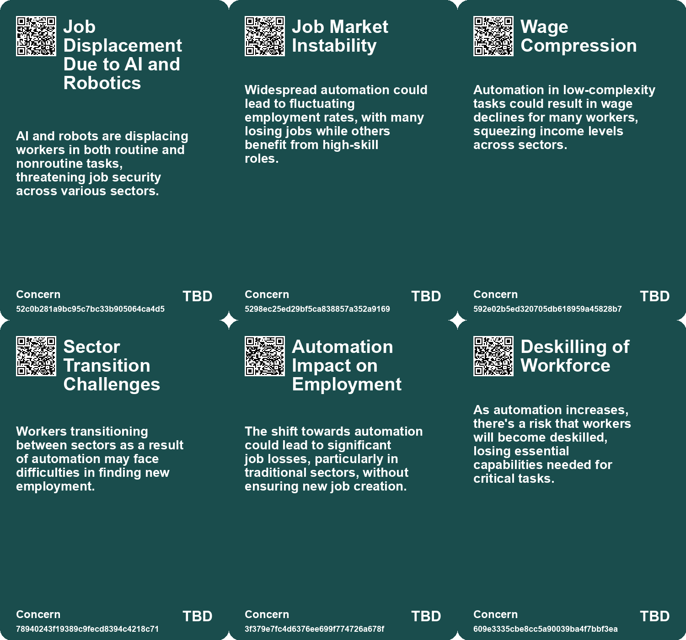
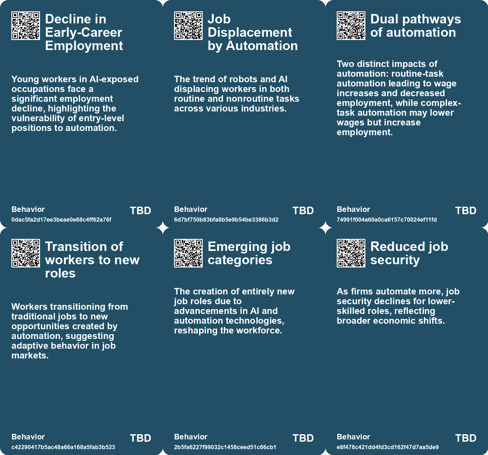
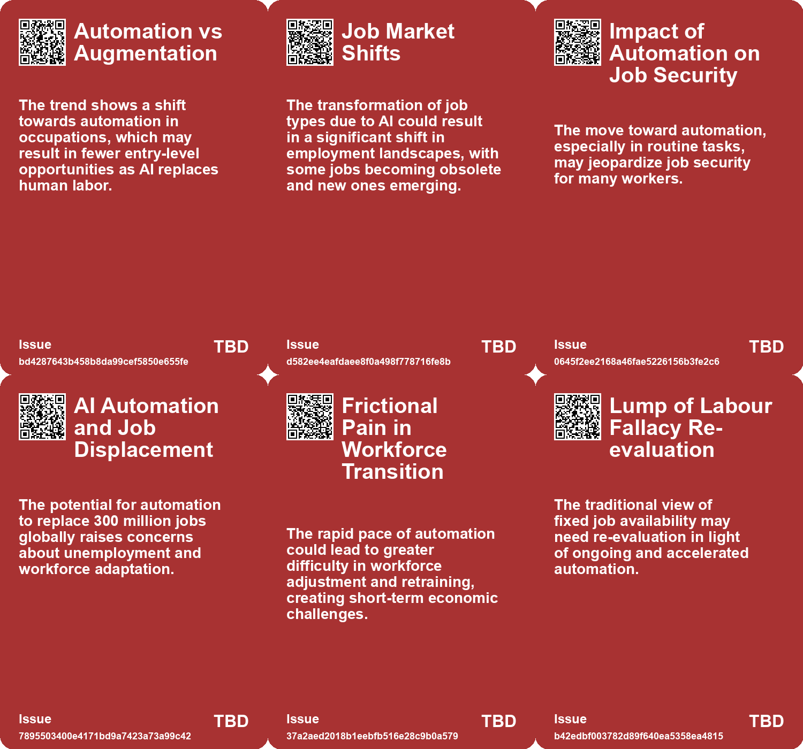
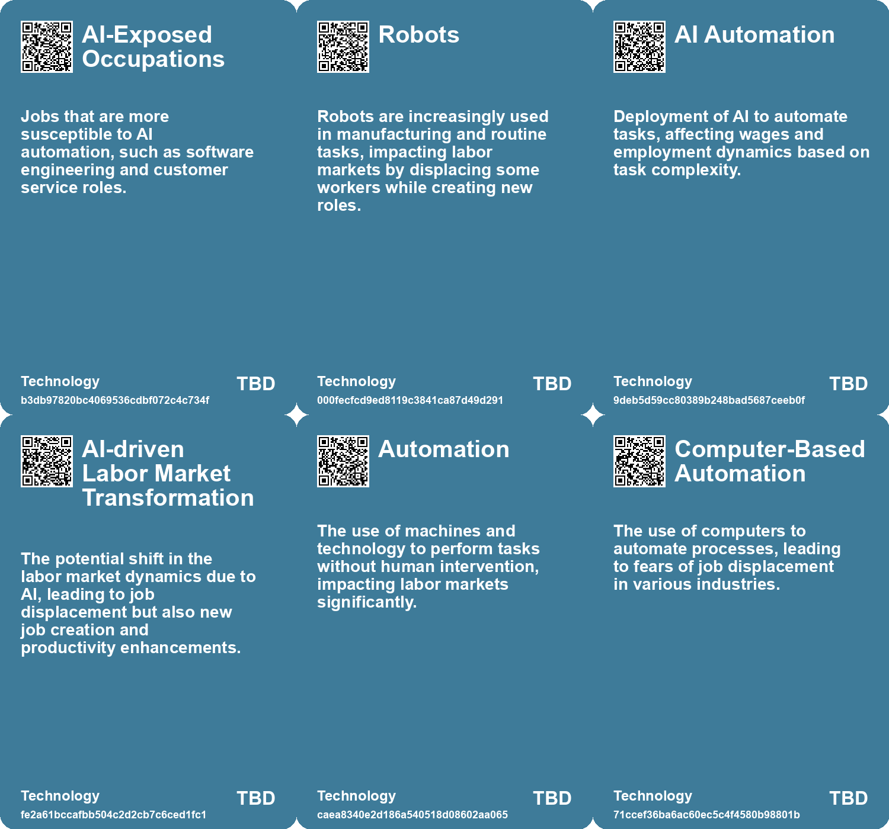

# *Topic*: Job Displacement Due to Automation

# Summary

The impact of automation and artificial intelligence (AI) on the labor market is a pressing concern, with varying perspectives on its implications for employment. Historical examples illustrate that automation has often led to job transformation rather than outright loss. The Luddites and the introduction of household appliances like dishwashers serve as reminders that technological advancements can create new opportunities alongside job displacement. 

Research indicates that the effects of AI on wages and employment depend significantly on the nature of the tasks being automated. Automating complex tasks may lower wages while increasing employment, as seen with roles like telephone operators and Uber drivers. In contrast, routine task automation can reduce employment but raise wages for remaining workers, highlighting a complex relationship between technology and job dynamics.

In regions like East Asia and the Pacific, the adoption of robots primarily displaces routine manual jobs, raising concerns about regional vulnerabilities. While job displacement is evident, there is potential for overall manufacturing employment to increase, benefiting skilled workers more than low-skilled ones. The need for digital and advanced technical skills is emphasized as the job landscape evolves, necessitating social protection schemes for gig workers.

Generative AI has shown a significant impact on early-career workers, particularly in AI-exposed occupations, with a notable decline in employment for younger workers. This trend raises alarms about the future of entry-level positions, suggesting that while AI may create new roles, it also automates many traditional jobs. The potential for job loss is echoed in predictions that AI could replace millions of jobs globally, particularly in white-collar sectors.

Despite fears of mass unemployment, historical evidence suggests that technological advancements often lead to job creation. The U.S. labor market remains stable, with low unemployment rates, indicating that other economic factors also play a role in job availability. The narrative that AI will fundamentally change work dynamics in the short term is met with skepticism, as many experts argue that jobs will continue to adapt rather than disappear.

The debate extends to the quality of jobs in the service sector, where low-quality positions are prevalent. Experts advocate for improving existing frontline jobs rather than solely focusing on reviving manufacturing. Emotional intelligence and interpersonal skills are increasingly recognized as vital in the evolving job market, with digital technologies and gig economies offering new opportunities for meaningful work.

As AI continues to advance, the potential for disruption in white-collar jobs is significant. The integration of AI tools in various sectors, such as banking and healthcare, is seen as a way to enhance efficiency. However, concerns about the ethical implications of AI deployment and its economic repercussions remain. The need for proactive regulation and collective action is emphasized to ensure that technological development leads to equitable outcomes.

The conversation around AI and automation is ongoing, with a consensus that while challenges lie ahead, there is also potential for innovation and new job creation. The historical context of automation suggests that, despite fears, the future may hold opportunities for growth and transformation in the labor market.

# Seeds

|    | name                                         | description                                                                                          | change                                                                                                    | 10-year                                                                                                       | driving-force                                                                                                |
|---:|:---------------------------------------------|:-----------------------------------------------------------------------------------------------------|:----------------------------------------------------------------------------------------------------------|:--------------------------------------------------------------------------------------------------------------|:-------------------------------------------------------------------------------------------------------------|
|  0 | Displacement of Industrial Workers by Robots | Robots are increasingly displacing manual labor in industrial sectors.                               | Shift from human manual labor to robotic automation in industrial jobs.                                   | Industrial sectors may see a predominant use of robots for various manual tasks.                              | Advancements in robotics technology and cost-effectiveness of automation.                                    |
|  1 | Labor Market Adaptation                      | Workers are adapting to automation rather than facing mass job loss.                                 | Change in perception from mass unemployment fears to job transformation and adaptation.                   | 10-year outlook may show continued adaptation of job roles rather than replacement by automation.             | Historical resilience of labor markets and ability of workers to evolve roles amidst technological change.   |
|  2 | Emergence of New Job Categories              | Automation technology is likely to create jobs that currently don't exist.                           | Shift from traditional roles to newly created positions driven by automation trends.                      | The job market may see a burgeoning of roles focused on managing and developing AI technologies.              | Rapid technological advancements driving the necessity for new job roles and skills.                         |
|  3 | Disparity in Job Impact                      | White-collar jobs are at a higher risk of automation compared to manual labor jobs.                  | Increased automation in office roles while manual jobs remain relatively safe from AI.                    | Employment landscape may favor manual labor roles over white-collar positions due to automation.              | The nature of tasks performed in white-collar versus manual labor jobs.                                      |
|  4 | Changing Perception of Roles                 | Job titles are disappearing as automation reshapes roles and responsibilities in various fields.     | From traditional role definitions to new hybrid roles that emphasize creativity and strategic thinking.   | Job roles will be more fluid, emphasizing skill bundles and adaptability over fixed titles.                   | The need for businesses to stay competitive in an AI-driven economy creates demand for versatile skill sets. |
|  5 | Automation as a Job Creator                  | Automation could lead to the creation of new job categories, offsetting losses in traditional roles. | Transition from viewing automation solely as a job threat to recognizing its potential for job creation.  | In ten years, new job roles may emerge that focus on managing and maintaining automated systems.              | The need for efficiency and productivity in various sectors pushing for more automation.                     |
|  6 | AI in Non-Paying Roles                       | Use of AI for tasks that were previously unpaid highlights a shift in job nature due to automation.  | From relying on human labor for all tasks to incorporating AI for previously unfilled roles.              | By 2033, many roles may utilize AI for efficiency, creating a new norm in job expectations and workflows.     | The drive for cost efficiency and high-quality outputs in business operations.                               |
|  7 | Changing Perception of Undesirable Jobs      | Jobs previously viewed as undesirable may gain value as automation takes over harder roles.          | Shift from stigmatization of certain jobs to recognition of their importance in a balanced economy.       | In a decade, societal views on jobs like fast food work may evolve, leading to better pay and respect.        | Economic shifts and the realization of the value of all work types in a functioning society.                 |
|  8 | Job Vulnerability for White-Collar Workers   | Higher-paid and creative white-collar jobs are now highly exposed to automation.                     | White-collar jobs are becoming more vulnerable to automation, a shift from traditional views on job loss. | In ten years, many white-collar professions may be significantly reduced or transformed due to AI automation. | Advancements in AI capabilities, including LLMs, are rapidly changing the job landscape.                     |
|  9 | Cultural Shift in Work Perception            | Changing societal views on the value of work amidst rising automation.                               | From valuing traditional employment to recognizing alternative contributions to society.                  | A society that prioritizes well-being and fulfillment over conventional job roles.                            | The need to adapt to a future where traditional jobs are less available.                                     |

# Concerns

|    | name                                     | description                                                                                                                                               |
|---:|:-----------------------------------------|:----------------------------------------------------------------------------------------------------------------------------------------------------------|
|  0 | Job Displacement Due to AI and Robotics  | AI and robots are displacing workers in both routine and nonroutine tasks, threatening job security across various sectors.                               |
|  1 | Job Market Instability                   | Widespread automation could lead to fluctuating employment rates, with many losing jobs while others benefit from high-skill roles.                       |
|  2 | Wage Compression                         | Automation in low-complexity tasks could result in wage declines for many workers, squeezing income levels across sectors.                                |
|  3 | Sector Transition Challenges             | Workers transitioning between sectors as a result of automation may face difficulties in finding new employment.                                          |
|  4 | Automation Impact on Employment          | The shift towards automation could lead to significant job losses, particularly in traditional sectors, without ensuring new job creation.                |
|  5 | Deskilling of Workforce                  | As automation increases, there's a risk that workers will become deskilled, losing essential capabilities needed for critical tasks.                      |
|  6 | Job Displacement Due to Automation       | Rapid advancements in AI and automation could lead to significant job losses without adequate replacement opportunities, increasing economic dislocation. |
|  7 | Shifts in Job Nature                     | The transformation of jobs due to automation could create a mismatch in skill sets and employment opportunities.                                          |
|  8 | Job Displacement of White-Collar Workers | High exposure of white-collar jobs to automation may lead to significant unemployment among educated professionals.                                       |
|  9 | Impact on Job Market                     | The shift to automation and AI may create a mismatch between job availability and the skills of the workforce.                                            |

# Cards

## Concerns

## Behaviors

## Issue

## Technology

# Links

* [MIT Study Challenges AI Job Displacement Fears with Economic Viability Insights](https://futures.kghosh.me/89ee61cc0d9fa77ecb1eb4100622a53f)
* [The Impact of AI on Wages and Human Adaptation in the Workforce](https://futures.kghosh.me/faa0e4de05145c04c5d22a8449a70d95)
* [The Impact of AI on Employment: A Shift in Vulnerability from Blue-Collar to White-Collar Jobs](https://futures.kghosh.me/ce379c62e35a93a1d93fce2061cabb74)
* [The Role of AI Copilots in Transforming White-Collar Workflows and Opportunities for Startups](https://futures.kghosh.me/fb3e9547ab9dcd19c85e551ae3230a30)
* [The Future of Corporate America: AI's Role in Replacing Middle Management and Transforming Retail Workforces](https://futures.kghosh.me/95ddb5a9e335a7f5f977a4ff7b1d17e3)
* [Preparing for AI Job Displacement: The Case for Universal Basic Income](https://futures.kghosh.me/550efa34f0d3da2d8dc49d97f98859d9)
* [The Impact of AI on Employment: Predictions, Layoffs, and the Future of Work](https://futures.kghosh.me/b0e031972e42be984d1309170155800e)
* [The Promise and Risks of Automation: Creating Jobs While Navigating Challenges](https://futures.kghosh.me/7e84b45a4f5f2bdecec14572bc5fe323)
* [The Impending Shift in Job Markets Due to AI Automation and Its Implications](https://futures.kghosh.me/089ff2f5d42f901983cb8fdc4f213ced)
* [A Historical Overview of Fears Surrounding Technological Unemployment from 1920s to 2020s](https://futures.kghosh.me/722403da2630fcd2d36f3eb46d87e276)
* [The Future of Work: Navigating Deskilling in an Automated World](https://futures.kghosh.me/ad98d6b30beed537d0d8b01d9db6491b)
* [The Impact of New Technologies on Labor Markets: Insights and Challenges](https://futures.kghosh.me/096459a1ab888f94f55ea8ac6d15235f)
* [AI's Impact on Society: Job Displacement and the Need for Retraining](https://futures.kghosh.me/cf119665e47c7434e3e3c54dbbc585e3)
* [How AI Could Transform Work-Life Balance and Job Dynamics in Various Industries](https://futures.kghosh.me/bc5ff4c170f1f63b34eb7ca70775d8d7)
* [Unraveling AI's Impact on Young Job Seekers: A Complex Debate](https://futures.kghosh.me/e32d04126d9c10f116be0ec272bd7a20)
* [The Impact of Generative AI on Automation and Employment: Opportunities and Challenges Ahead](https://futures.kghosh.me/897ed4ea5ae6173e4397f1091ddb7e7e)
* [The Future of AI: Challenging the Optimistic Narrative of Transformation and Equality](https://futures.kghosh.me/aa208a5edc5bcaddb6081ee6ca8bb7d3)
* [Rethinking Jobs: From Manufacturing Nostalgia to Thriving Service Economies and Future Work](https://futures.kghosh.me/c13f2cb6cfa1728ffddc82e36c0d126d)
* [Analyzing the Impact of AI on Job Markets: A Historical Perspective](https://futures.kghosh.me/0e88862a1eff3e62cb08365a90a37f70)
* [Impact of Generative AI on Early-Career Employment: A Study](https://futures.kghosh.me/6286563cae4851c1c414fffd13d908c2)
* [The Future of Jobs in Advertising: Impact of AI and Automation by 2030](https://futures.kghosh.me/54491b49e9fd2c6eab777dca0ba67e76)
* [Goldman Sachs Report: 300 Million Jobs Could Be Automated by AI Innovations](https://futures.kghosh.me/8bf628f811052831ab699f75caeb0205)
* [Analyzing AI's Impact on Wages and Employment: Two Diverging Pathways in the Future of Work](https://futures.kghosh.me/ef65b4ec6a48bf076171480f9ec6c8cc)
* [Navigating Job Transitions: Embracing AI and Automation with Confidence](https://futures.kghosh.me/b0d2ee7f12089094cc1ccbe512130503)
* [Global Talent Shortage: A Looming Crisis for Industries by 2030](https://futures.kghosh.me/a2de650354976b7bc4c6442255f91931)