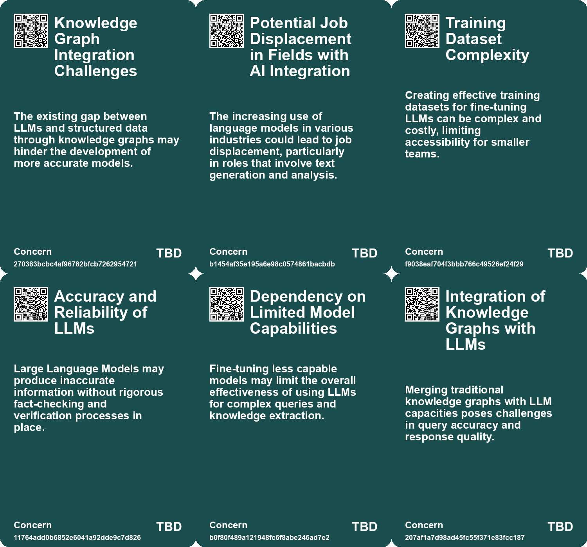
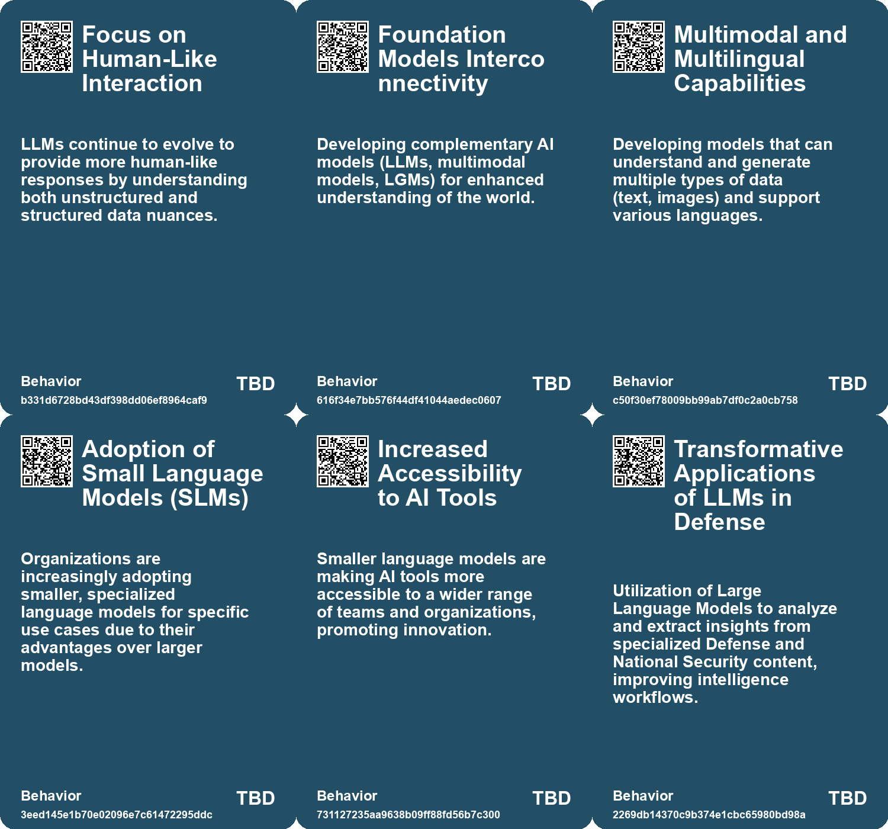
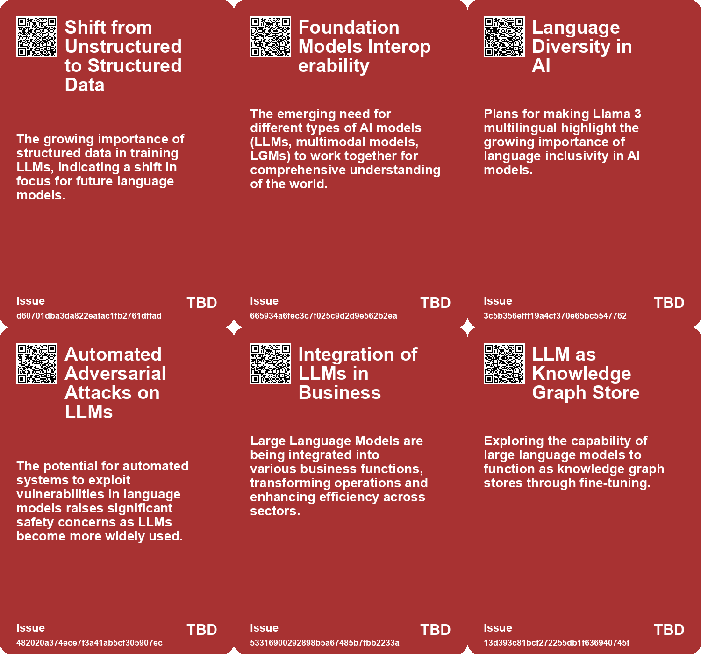
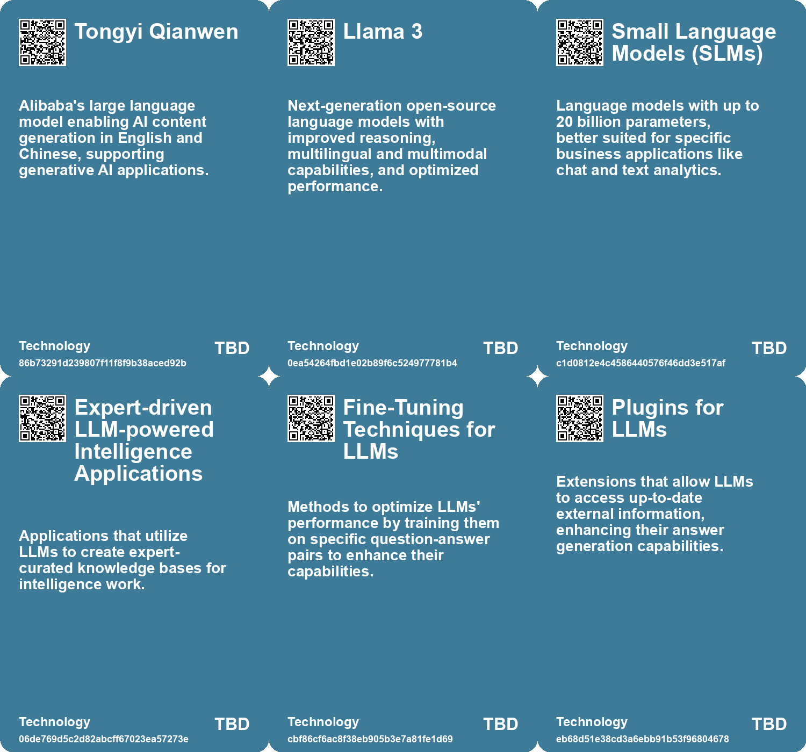

# *Topic*: Large Language Models (LLMs)

# Summary

The landscape of artificial intelligence is rapidly evolving, with a notable shift towards small language models (SLMs) that challenge the dominance of large language models (LLMs). SLMs are gaining traction due to their efficiency, lower costs, and ability to be customized for specific applications. They offer advantages such as reduced hallucinations and enhanced privacy, making them appealing for businesses, especially startups. Companies like Google are exploring the potential of SLMs to transform various industries through faster development cycles and improved efficiency.

In the realm of document processing, JPMorgan has introduced DocLLM, a lightweight model designed to handle complex document layouts. This model leverages spatial information to enhance document analysis, providing a more efficient alternative to traditional image encoders. Such innovations highlight the growing need for specialized models that can address specific challenges in data processing.

The accessibility of LLMs has also expanded, with advancements allowing them to run on personal hardware like Raspberry Pi. This democratization of technology brings both excitement and challenges, including concerns about vendor lock-in and the potential for hallucination errors in outputs. As LLMs become more integrated into everyday applications, from proofreading to creative writing, users must navigate these complexities.

Educational initiatives are emerging to address the implications of LLMs in society. Courses are being offered to explore the capabilities and risks associated with these models, fostering critical thinking and practical skills among students. Topics include evaluating human-model interactions and the societal impacts of language models, emphasizing the importance of responsible usage.

The integration of LLMs with knowledge graphs is another area of focus. Knowledge graphs enhance LLMs by providing structured data that can improve reasoning and query capabilities. This combination aims to bridge the gap between unstructured and structured data, enabling more human-like responses and better performance in knowledge-intensive applications.

Safety concerns surrounding LLMs are also prominent. Research indicates that adversarial attacks can exploit vulnerabilities in these models, raising questions about their reliability and the challenges of ensuring safe deployment. As LLMs become more autonomous, understanding these risks is crucial for responsible use.

Finally, the competitive landscape of AI is intensifying, with companies like Alibaba launching their own LLMs to capture market share. The introduction of models like Tongyi Qianwen aims to facilitate AI content generation in multiple languages, positioning Alibaba as a key player in the technology sector. As the global race for AI development heats up, regulatory frameworks are also evolving, particularly in countries like China, which has rapidly approved numerous AI models for public use. This regulatory approach reflects a balance between fostering innovation and maintaining control over AI technology.

# Seeds

|    | name                                                | description                                                                   | change                                                                                  | 10-year                                                                                                           | driving-force                                                                                      |
|---:|:----------------------------------------------------|:------------------------------------------------------------------------------|:----------------------------------------------------------------------------------------|:------------------------------------------------------------------------------------------------------------------|:---------------------------------------------------------------------------------------------------|
|  0 | Increased Accessibility of LLMs                     | LLMs are democratizing access to advanced NLP tools for non-experts.          | Transition from specialized knowledge to general accessibility in defense intelligence. | In 10 years, a broad range of professionals will use LLMs for complex analysis without extensive training.        | The drive for efficiency and rapid insights in defense and intelligence sectors.                   |
|  1 | Emergence of tailored NLP applications              | New, specialized NLP applications for defense are being developed using LLMs. | Transition from generic to specialized applications for targeted intelligence needs.    | In 10 years, there will be a suite of custom NLP tools tailored for specific defense tasks.                       | The increasing complexity of defense data necessitates specialized analysis tools.                 |
|  2 | Widespread Adoption of LLMs                         | Growing use of LLMs in various applications, including autonomous systems.    | Transitioning from experimental use to mainstream adoption of LLMs in critical systems. | LLMs may be integral to daily life, influencing decisions in healthcare, finance, and more.                       | Demand for automation and AI-assisted decision-making in many sectors drives LLM adoption.         |
|  3 | Cost-effective Dataset Creation using LLMs          | Using LLMs to generate training datasets for fine-tuning processes.           | Shift from manual dataset creation to automated processes using LLMs for efficiency.    | Training datasets might be predominantly generated by LLMs, reducing costs and time.                              | Need for scalable and cost-effective solutions in AI training.                                     |
|  4 | LLM Accessibility on Low-End Hardware               | Large Language Models can now run on inexpensive hardware like Raspberry Pi.  | Transitioning from cloud-based LLM services to local execution on personal devices.     | Widespread accessibility of powerful AI tools on everyday devices, democratizing technology.                      | The desire for privacy, control, and independence from vendor lock-in.                             |
|  5 | LLM as Knowledge Graph Store                        | Exploring the potential of using LLMs as effective knowledge graph stores.    | Shifting from conventional data storage to integrating LLMs as knowledge graph stores.  | Widespread adoption of LLMs for dynamic knowledge graph storage and retrieval across industries.                  | Increasing demand for intelligent data interaction and query capabilities in various applications. |
|  6 | Shift from LLMs to SLMs                             | Growing trend towards small language models as LLMs show signs of plateauing. | Moving from reliance on large models to more efficient, specialized small models.       | In 10 years, small language models could dominate AI development, enabling widespread and efficient applications. | Desire for efficiency, reduced costs, and specialized applications in AI.                          |
|  7 | Decentralized AI Development                        | Rise of edge computing with small language models.                            | Moving from centralized cloud models to decentralized, edge-based AI applications.      | In 10 years, AI interactions will be more personalized and localized, improving user experience.                  | Advancements in edge computing technology and user demand for real-time solutions.                 |
|  8 | Emergence of Lightweight LLMs                       | The rise of lightweight language models tailored for specific document types. | Shift from traditional heavy LLMs to efficient, task-specific models like DocLLM.       | In 10 years, lightweight LLMs could dominate specialized document processing markets.                             | Demand for efficient processing of complex documents in various industries.                        |
|  9 | Performance Benchmarking Against Established Models | DocLLM surpassing established models like GPT-4 in specific tasks.            | Move towards specialized models outperforming general-purpose models in niche areas.    | Specialized models could redefine benchmarks for AI performance in document handling.                             | The quest for higher efficiency and accuracy in document-related AI applications.                  |

# Concerns

|    | name                                                     | description                                                                                                                                                  |
|---:|:---------------------------------------------------------|:-------------------------------------------------------------------------------------------------------------------------------------------------------------|
|  0 | Knowledge Graph Integration Challenges                   | The existing gap between LLMs and structured data through knowledge graphs may hinder the development of more accurate models.                               |
|  1 | Potential Job Displacement in Fields with AI Integration | The increasing use of language models in various industries could lead to job displacement, particularly in roles that involve text generation and analysis. |
|  2 | Training Dataset Complexity                              | Creating effective training datasets for fine-tuning LLMs can be complex and costly, limiting accessibility for smaller teams.                               |
|  3 | Accuracy and Reliability of LLMs                         | Large Language Models may produce inaccurate information without rigorous fact-checking and verification processes in place.                                 |
|  4 | Dependency on Limited Model Capabilities                 | Fine-tuning less capable models may limit the overall effectiveness of using LLMs for complex queries and knowledge extraction.                              |
|  5 | Integration of Knowledge Graphs with LLMs                | Merging traditional knowledge graphs with LLM capacities poses challenges in query accuracy and response quality.                                            |
|  6 | Performance Plateau of LLMs                              | As the performance gap between LLMs narrows, reliance on larger models may stall innovation in AI development.                                               |
|  7 | Performance Benchmarking                                 | DocLLM outperforms existing models on certain tasks, suggesting potential disruptions in AI model rankings and expectations in document processing.          |
|  8 | Dependency on Text Corpora                               | LLMs are restricted by their reliance on text corpora, affecting their reasoning and conceptual understanding.                                               |
|  9 | Validation of AI Outputs                                 | Ensuring LLM outputs are valid against logic-based reasoners is crucial for maintaining accuracy in AI applications.                                         |

# Cards

## Concerns

## Behaviors

## Issue

## Technology

# Links

* [Meta Launches Llama 3: Next-Gen Language Models with Enhanced Capabilities and Open-Source Access](https://futures.kghosh.me/68e7b200c5a0cca0bf92e4f1303a85a0)
* [Exploring the Use of LLMs as Knowledge Graph Stores Through Fine-Tuning Techniques](https://futures.kghosh.me/1e080fc96c467f596f5555f74332267b)
* [Exploring the Rapid Evolution and Practical Use Cases of Large Language Models](https://futures.kghosh.me/0908980035e5e50ea0225f797b762635)
* [Exploring the Advantages of Small Language Models in AI Applications](https://futures.kghosh.me/15fc0056b0626400c8c4a874249e7f27)
* [Enhancing Large Language Models with Knowledge Graphs for Structured Data Processing](https://futures.kghosh.me/69aa55d97023850224f4426e6782bb8b)
* [The Rise of New AI Models: GPT-4, Claude 3, and Gemini Advanced](https://futures.kghosh.me/9aebbe43e0bb54a691d261c20e7aa969)
* [Alibaba Opens AI Model to Third-Party Developers to Boost Cloud Computing and Technology Leadership](https://futures.kghosh.me/705bb257b4c899939cc0c550f0b9d2fa)
* [Enhancing Knowledge Graphs and LLMs with Reasoning Capabilities for Improved AI Applications](https://futures.kghosh.me/54d1cf4ed6ca6edd6ccf6e30622d91a8)
* [China Approves Over 40 AI Models Amid Race with U.S. for AI Development](https://futures.kghosh.me/180b400e2ff14c1358c95031138bbe47)
* [Generative AI's Impact on Scientific Writing: Opportunities and Concerns](https://futures.kghosh.me/60f3a64993d5e355561c59e5d641bec9)
* [Rethinking Marketing Strategies in the Age of Large Language Models](https://futures.kghosh.me/fd41a4c0c492bbb77535e0a54ee09619)
* [Understanding LLM Agent Orchestration: Key Components and Strategies](https://futures.kghosh.me/62a60fa0c519e5d7d0b4e480f231f163)
* [The Shift from Large to Small Language Models in AI Development and Applications](https://futures.kghosh.me/77fe6ce5d0591184b3fb41b6d2ef042a)
* [Exploring Fine-Tuning and Retrieval-Augmented Generation for LLMs' Limitations](https://futures.kghosh.me/9fd8c7460fe2d17a54694de66ebd64ca)
* [OLMo: A Groundbreaking Open Language Model Framework for AI Research](https://futures.kghosh.me/51e3ea62151b1423eeea4393a4ab7abc)
* [Exploring the Transformative Impact of Generative AI: Key Use Cases and Insights](https://futures.kghosh.me/1444e93f4885b7537dc295249cf8403b)
* [JPMorgan's DocLLM: A New Lightweight Model for Complex Document Processing](https://futures.kghosh.me/d754710be61a44192e7426d916a9e803)
* [Examining Automated Adversarial Attacks on Large Language Models and Their Implications for Safety](https://futures.kghosh.me/74c58b0ca359725b4a116ff765656c7c)
* [Niantic's Vision for a Large Geospatial Model to Revolutionize AR and Spatial Computing](https://futures.kghosh.me/65e4c914b47f88920bb9442d4d102b67)
* [Harnessing LLMs for Defense Analysis: Understanding Their Strengths and Limitations](https://futures.kghosh.me/6335d1cfa75abf9650361efd7b529149)
* [Exploring the Impact of Large Language Models on OSINT Analysis and Workflows](https://futures.kghosh.me/5cf4407dc6fa3889e047c658e27c4ccf)