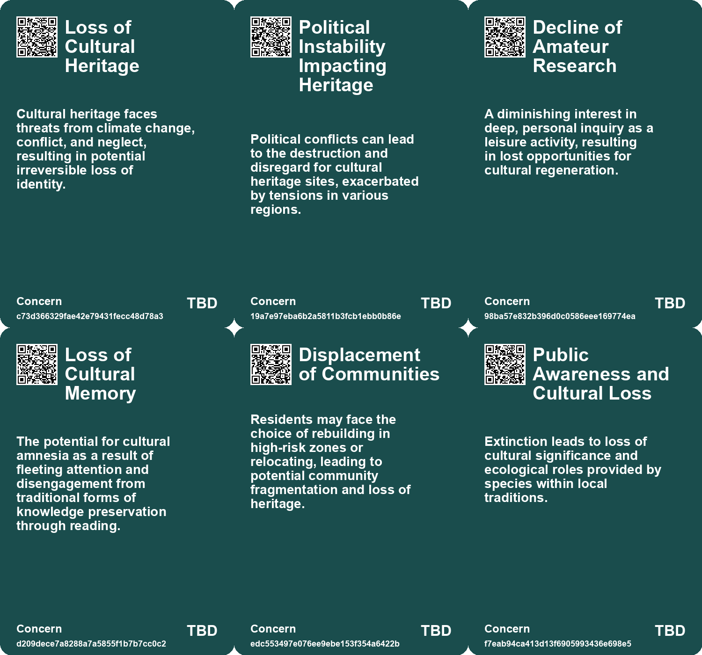
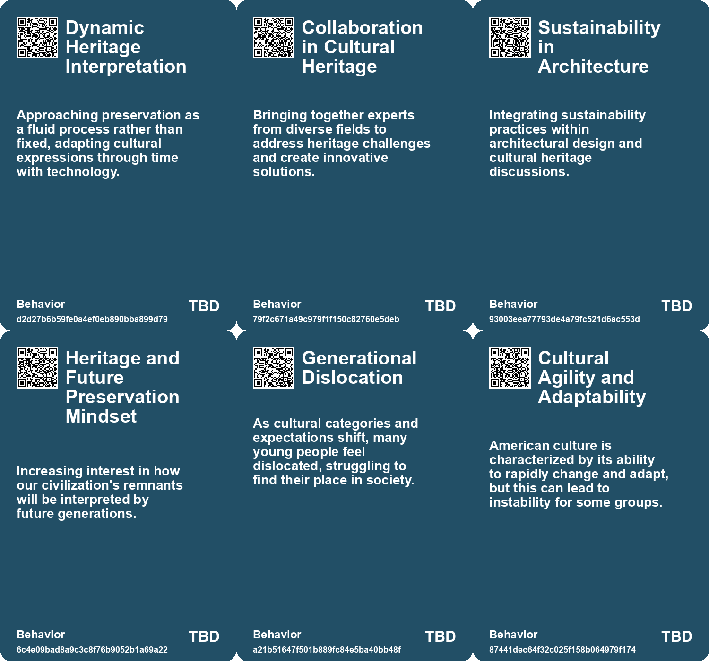
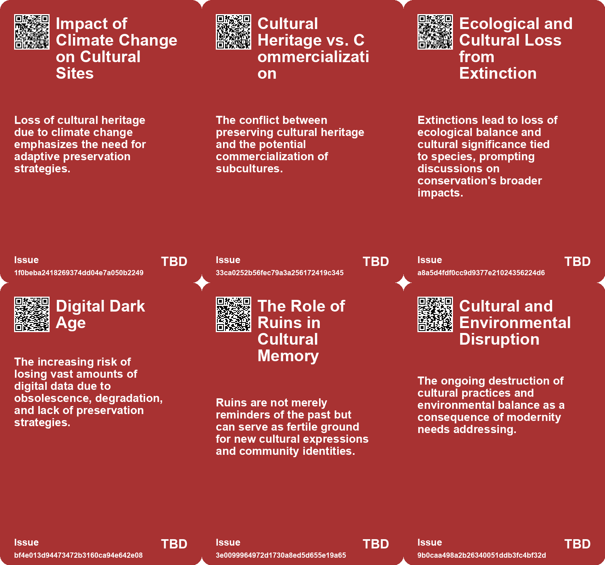
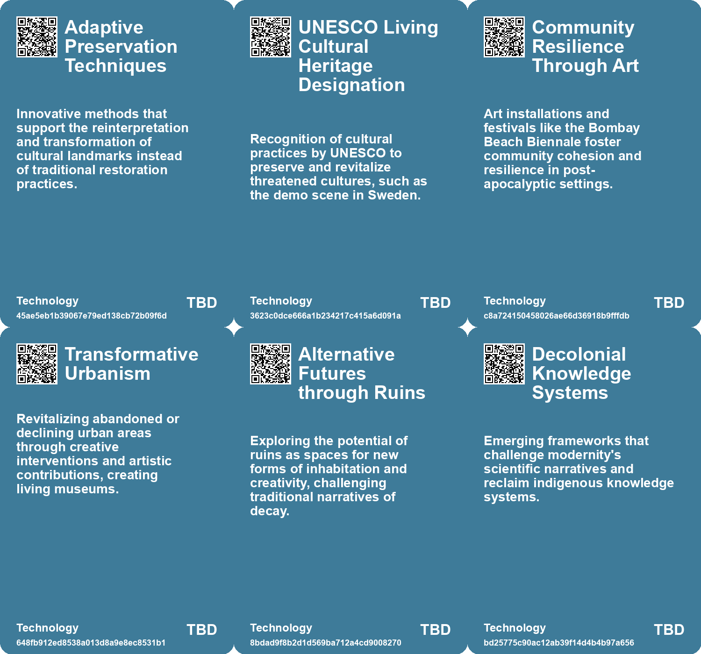

# *Topic*: Loss of Cultural Heritage

# Summary

The phenomenon of abandonment in rural areas is becoming increasingly evident, as seen in the drastic population decline in villages like Tyurkmen, Bulgaria. This trend reflects a global demographic shift, with many people migrating to urban centers. The relationship between human absence and environmental change raises questions about the future of abandoned lands and their ecological outcomes.

Infrastructure plays a crucial role in society, impacting everything from social inequality to climate change. Recent events, such as flash floods in the Indian Himalayas, highlight the destructive consequences of infrastructure degradation. A call for sustainable and equitable infrastructure planning is essential to address these challenges.

Data preservation in the digital age presents significant obstacles. Unlike physical artifacts, digital files risk becoming obsolete, leading to a potential "Digital Dark Age." The need for collective efforts to ensure the longevity and accessibility of digital information is paramount, emphasizing sustainability and equity in data preservation.

The decline of democratic institutions and the rise of autocratic governance are reshaping global power dynamics. Emerging cultural movements, such as Decorp Culture, challenge traditional corporate values, while younger generations are expected to rise against existing systems through grassroots movements. This shift will influence economic models and consumer behaviors, necessitating adaptation from brands.

Land ownership and tenure are undergoing significant changes worldwide, influenced by political and social upheaval. The complexities of land rights shape societal structures and development trajectories. Innovative and equitable land reform is essential to address future challenges, particularly in the context of climate change and population dynamics.

Cultural identity is increasingly tied to reading and research, which are foundational to civilization. The shift from deep engagement with texts to superficial consumption of information in the digital age raises concerns about cultural fragmentation. Reclaiming research as a leisurely pursuit can foster a deeper connection to knowledge and community.

The transformation of spaces, such as the adaptive reuse of buildings and the revitalization of towns like Bombay Beach, illustrates the potential for creativity in the face of decline. These efforts highlight the importance of sustainability and community resilience, while also raising concerns about gentrification and the preservation of local identity.

The impact of technology on society is profound, with issues like the "Failure to Launch" phenomenon among young men reflecting broader cultural shifts. The polarization of societies, exacerbated by digital technologies, calls for a cultural shift towards embracing multiple perspectives and prioritizing attention over availability.

Environmental concerns are underscored by the concept of "technofossils," which represent the enduring remnants of human civilization. The implications of our consumption patterns and waste on future generations raise critical questions about environmental responsibility and sustainability.

The rediscovery of lost species offers hope amid growing concerns about biodiversity loss. However, the increasing number of species declared lost highlights the urgent need for conservation efforts. The economic consequences of demographic decline further complicate the landscape, as shrinking workforces threaten innovation and growth.

The evolving nature of risk in disaster management emphasizes the interconnectedness of events like wildfires and hurricanes. A modernized risk framework is necessary to address these complex challenges, with local resilience being crucial for effective disaster management.

The preservation of cultural heritage through innovative approaches, such as the use of AI in architecture, showcases the potential for technology to enhance our understanding of history. This dialogue between tradition and modernity invites a rethinking of cultural identity and preservation strategies.

The issue of brownfields in the United States highlights the environmental injustices faced by low-income communities. Innovative bioremediation techniques, such as those developed by Danielle Stevenson, offer promising solutions for restoring contaminated land while empowering affected communities.

The ongoing crises in the UK reveal a structural decline in productivity and growth, driven by a lack of technical expertise and intergenerational failure. The need for a productive social order is critical to address these challenges and rebuild trust within society.

The loss of online content poses significant risks to historical records and public trust in the internet. Web archiving initiatives are essential for preserving digital history and ensuring long-term accessibility to information.

# Seeds

|    | name                                             | description                                                                                                | change                                                                                               | 10-year                                                                                                          | driving-force                                                                                                            |
|---:|:-------------------------------------------------|:-----------------------------------------------------------------------------------------------------------|:-----------------------------------------------------------------------------------------------------|:-----------------------------------------------------------------------------------------------------------------|:-------------------------------------------------------------------------------------------------------------------------|
|  0 | AI in Cultural Preservation                      | Emerging use of AI technologies to reinterpret and preserve cultural heritage.                             | Transition from traditional preservation methods to AI-assisted reinterpretation and documentation.  | AI technologies may lead to revitalized cultural identities and new forms of heritage expression.                | The increasing threat to cultural heritage from climate change, conflict, and neglect necessitates innovative solutions. |
|  1 | Dynamic Cultural Memory                          | Shift towards viewing cultural memory as a dynamic, adaptable entity.                                      | From fixed historical interpretations towards a more fluid and evolving representation of culture.   | Cultural heritage may become more inclusive and representational of diverse narratives through reinterpretation. | The desire to keep cultural heritage relevant amid changing environmental and socio-political landscapes.                |
|  2 | UNESCO Recognition                               | The demo scene gains UNESCO Living Cultural Heritage status, reflecting cultural significance.             | Recognition from a cultural organization is shifting the perception of the demo scene.               | In ten years, the demo scene might evolve as a concerted attempt for preservation and awareness.                 | Recognition by a prestigious body may lead to increased interest and potential revitalization efforts.                   |
|  3 | Crisis of Cultural Coherence                     | A growing cultural fragmentation and erosion of shared meaning across society.                             | From unified cultural norms to more fragmented individual experiences and understanding.             | Potential emergence of niche cultures focused on shared inquiry and understanding.                               | Loss of coherent narratives in media and education leading to cultural disintegration.                                   |
|  4 | Indigenous Resistance to Infrastructure Projects | Indigenous groups are increasingly mobilizing against harmful infrastructure developments.                 | Shift from ignored voices to organized resistance against exploitative projects.                     | In 10 years, indigenous rights may be more recognized in infrastructural planning.                               | A growing global movement advocating for indigenous rights and sovereignty.                                              |
|  5 | Cultural Significance of Species                 | Rediscovered species often hold cultural importance, affecting conservation priorities and actions.        | From viewing species solely in ecological terms to recognizing their cultural significance.          | In ten years, conservation strategies may increasingly consider cultural impacts and values of species.          | The intersection of ecology and cultural heritage drives a holistic approach to conservation.                            |
|  6 | Digital Dark Age Awareness                       | Growing concern about losing digital content due to evolving technologies and formats.                     | From a belief in permanent digital storage to recognition of potential data loss.                    | In ten years, there may be significant initiatives for universal data preservation standards.                    | Increased realization of vulnerabilities in digital storage and a collective push for better preservation methods.       |
|  7 | Creeping Abandonment of Rural Villages           | Villages like Tyurkmen are experiencing slow abandonment, affecting community structures and demographics. | Shift from thriving rural communities to nearly empty villages due to migration and low birth rates. | In 10 years, many more villages may become ghost towns, altering rural landscapes.                               | Economic migration towards cities seeking better opportunities leads to rural decline.                                   |
|  8 | Environmental Changes Post-Abandonment           | Abandoned lands are undergoing significant ecological changes, with potential rewilding effects.           | Transition from human-dominated landscapes to increasing natural vegetation and biodiversity.        | In a decade, these areas may host diverse ecosystems, shifting the balance of local flora and fauna.             | Reduced human intervention could allow native species to reclaim and thrive in abandoned spaces.                         |
|  9 | Impact of Invasive Species                       | Abandonment of land allows invasive species to dominate, threatening local biodiversity.                   | Move from diverse ecosystems to monocultures dominated by invasive plant species.                    | In 10 years, areas previously rich in biodiversity may become biological deserts due to invasive species.        | Lack of management and oversight in abandoned areas facilitates the spread of invasives.                                 |

# Concerns

|    | name                                     | description                                                                                                                                              |
|---:|:-----------------------------------------|:---------------------------------------------------------------------------------------------------------------------------------------------------------|
|  0 | Loss of Cultural Heritage                | Cultural heritage faces threats from climate change, conflict, and neglect, resulting in potential irreversible loss of identity.                        |
|  1 | Political Instability Impacting Heritage | Political conflicts can lead to the destruction and disregard for cultural heritage sites, exacerbated by tensions in various regions.                   |
|  2 | Decline of Amateur Research              | A diminishing interest in deep, personal inquiry as a leisure activity, resulting in lost opportunities for cultural regeneration.                       |
|  3 | Loss of Cultural Memory                  | The potential for cultural amnesia as a result of fleeting attention and disengagement from traditional forms of knowledge preservation through reading. |
|  4 | Displacement of Communities              | Residents may face the choice of rebuilding in high-risk zones or relocating, leading to potential community fragmentation and loss of heritage.         |
|  5 | Public Awareness and Cultural Loss       | Extinction leads to loss of cultural significance and ecological roles provided by species within local traditions.                                      |
|  6 | Digital Dark Age                         | The potential loss of vast amounts of digital information leading to a historical knowledge gap similar to the historical Dark Ages.                     |
|  7 | Cultural Disconnection                   | The separation of societies from traditional knowledge and ecological practices is highlighted, posing risks to cultural sustainability and resilience.  |
|  8 | Cultural Loss and Memory                 | The fading of community memories, traditions, and cultural landmarks as rural populations decrease poses a social concern.                               |
|  9 | Impact on News and Reference Material    | Loss of news pages and government websites may result in the loss of valuable historical information and resources.                                      |

# Cards

## Concerns

## Behaviors

## Issue

## Technology

# Links

* [The Economic Consequences of Declining Birth Rates and Aging Populations](https://futures.kghosh.me/bff595b72330d833dba477e2dc2a5656)
* [Understanding 'Failure to Launch': The Cultural and Economic Struggles of Young American Men](https://futures.kghosh.me/c6a3cc9fe503779d0ad2ec2c66aa7fb8)
* [Rediscovery and Conservation: The Journey of Lost Species and Their Ecological Significance](https://futures.kghosh.me/e74f7533443e1f161b145e7f2db450d4)
* [Exploring Cultural Heritage Through AI: Armenia's Pavilion at Venice Biennale 2025](https://futures.kghosh.me/34b4d87b744230499df1eb6a00d5c11d)
* [Exploring the Modern Entertainment Landscape and Its Societal Implications](https://futures.kghosh.me/c5c2c794f1426e6e307a9df3f9ff61f6)
* [Preserving Our Digital Future: The Challenge of Avoiding a Digital Dark Age](https://futures.kghosh.me/86e67181c4dcbce08848023aa2929bcb)
* [Exploring the Consequences of Abandonment in Rural Bulgaria and Nature's Response](https://futures.kghosh.me/9ab2903416b01dac618d7f3b93ab6dfa)
* [Exploring Indigenous Perspectives Through Art and Technology at the Autry Museum](https://futures.kghosh.me/bcb3358ea987c50fb056866ca37eef83)
* [Innovative Adaptations of Assam's Chang Ghars for Flood Resilience and Climate Change Challenges](https://futures.kghosh.me/141479bb35e9f52f4fa3fdccd0d2b13a)
* [Insurance Companies Retreat as Climate Risks Increase in New Zealand Coastal Communities](https://futures.kghosh.me/7c4551fb2f96cce7c0264d6b1f50b669)
* [Reviving Research as Leisure: Embracing Curiosity and Reading Culture for Civilization's Future](https://futures.kghosh.me/e3389ae6863265accc860c33c364c11f)
* [Exploring Modernity's End and the Cultural Impact of Vermeer](https://futures.kghosh.me/4e8f844c46537ade8cde53e2c5f17565)
* [Reimagining Infrastructure: Towards a Redistributive and Ecologically Sound Future](https://futures.kghosh.me/177a0857ffe0d07d48cd99a269f28a02)
* [The UK's Declining Geopolitical Relevance and Elite Inaction: A Historical Perspective](https://futures.kghosh.me/ca555520973a0e8519ff854da1de4d88)
* [Exploring Cultural Fusion in Dance and Lessons from the Battle of Crecy](https://futures.kghosh.me/0eec94d49d73ca7a3669da31cea25e51)
* [The Emotional Impact of Losing Access to Virtual Worlds in Gaming](https://futures.kghosh.me/7ce06613470d821b81126a4378a0eb2e)
* [Evolving Perspectives on Risk Management in the Context of Modern Disasters](https://futures.kghosh.me/cd4f6f65b2486d56699138cd2270044d)
* [The Urgent Need for Adaptive Reuse in Architecture Today](https://futures.kghosh.me/cf7cc3361b8139c51e3e97835a2da4e4)
* [Exploring the Historical and Future Transformations of Land Ownership Worldwide](https://futures.kghosh.me/68a769f0b8d15a4efd8f8136482b9660)
* [Innovative Fungal Solutions for Restoring Contaminated Brownfields in the U.S.](https://futures.kghosh.me/666f5297ceb142394ebf30d39f1d9bc3)
* [Technofossils: The Enduring Legacy of Plastic, Fast Food, and Synthetic Clothing](https://futures.kghosh.me/9b28b467817ea898c7c8c104f9103ab9)
* [Future Trends Post-2024: Declining Democracies and Emerging Cultural Shifts](https://futures.kghosh.me/bd1b01636b1360716b5951e1cac42724)
* [The Demo Scene: A Cultural Legacy Facing Decline and Change](https://futures.kghosh.me/d81db4d6acedbfe1945cc1bb5e64d43e)
* [Revitalizing Ruins: Bombay Beach's Transformation Through Art and Community](https://futures.kghosh.me/9e3df9dec95cee1464d33e4ab8528d91)
* [Redefining Storytelling: From Heroic Conquests to Collective Narratives in Climate Change](https://futures.kghosh.me/9583276a9aeb9f9a0bf87400700799bc)
* [Understanding Polarization: Healing Our Relationship with Technology and Embracing Diverse Perspectives](https://futures.kghosh.me/c1bb890337ef382bfaa5720c9fd05134)
* [Study Reveals Alarming Trend of Online Content Disappearance and Its Implications](https://futures.kghosh.me/1bc90bfc26abc848d87b0975e7095339)