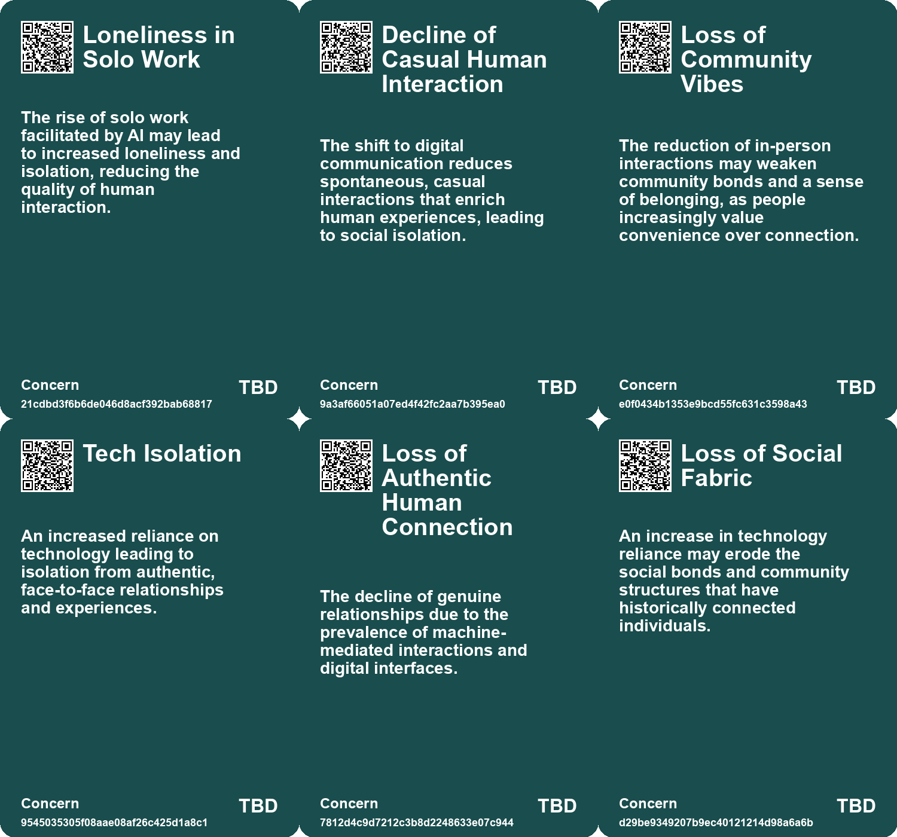
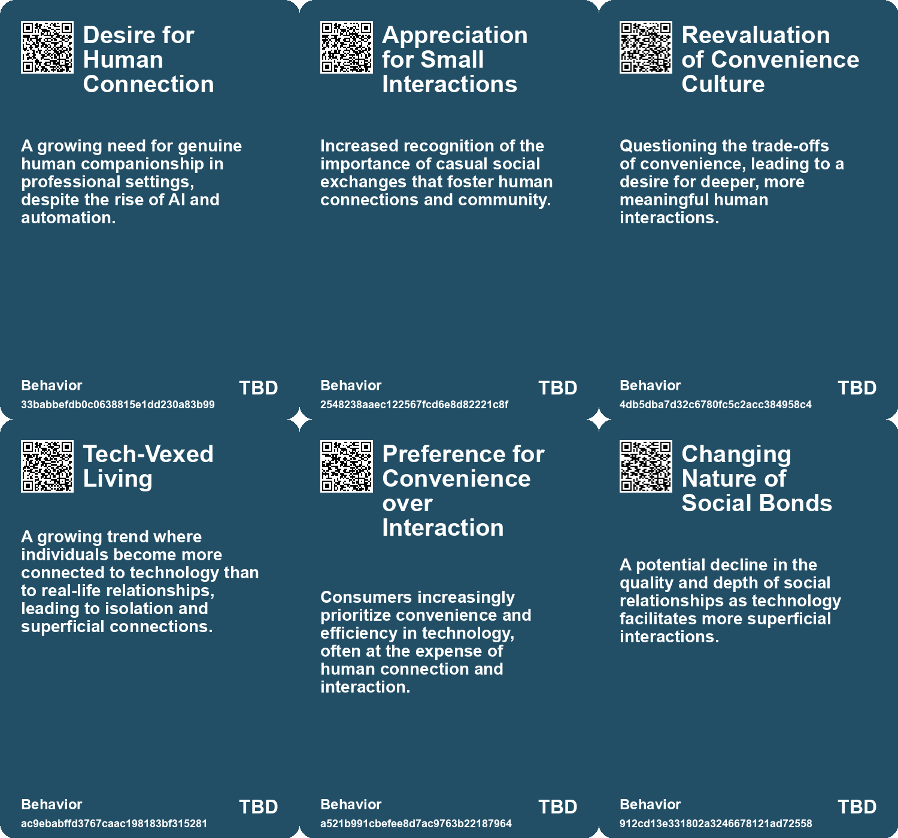
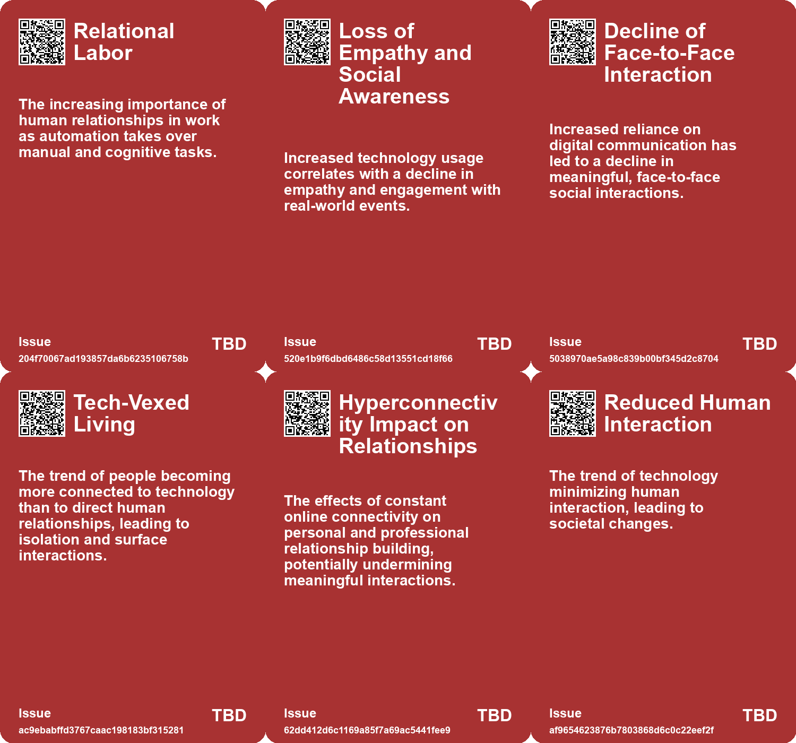
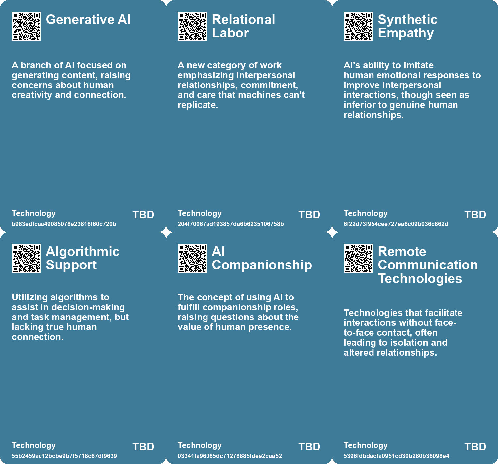

# *Topic*: Loss of Human Connection

# Summary

The growing trend of technology reducing human interaction raises significant concerns about its impact on society. Innovations such as online shopping, AI, and automated services prioritize convenience but risk diminishing empathy and understanding among individuals. As technology evolves, the essence of humanity, rooted in social interaction and cooperation, may be at stake.

Sociologist Sherry Turkle warns against the increasing reliance on AI chatbots for companionship. While these digital interactions offer convenience, they can undermine genuine human connections and exacerbate feelings of loneliness. Turkle calls for a reevaluation of how technology affects our values and relationships.

A report from the U.S. Surgeon General highlights a public health crisis of loneliness, with 58% of Americans feeling isolated. This crisis, particularly pronounced among younger generations, has mental health implications comparable to smoking and obesity. The report emphasizes the need for fostering meaningful relationships and suggests that technology companies and businesses should prioritize social health.

The use of artificial intelligence and virtual reality to connect with deceased loved ones raises ethical questions. A Korean documentary featuring a virtual recreation of a mother’s deceased daughter illustrates the therapeutic potential of such technology, while also highlighting concerns about addiction and the risk of remaining in a virtual world.

The decline of critical thinking and cognitive abilities in an AI-dominated era is alarming. Students increasingly outsource their writing and reasoning to AI, leading to a decline in literacy and comprehension skills. This trend threatens deep thinking capabilities essential for creativity and advanced reasoning, prompting calls for educational reform to foster cognitive engagement.

Kurt Vonnegut’s reflections on the importance of human interaction emphasize the value of simple, meaningful exchanges. He argues that modern conveniences have diminished casual social interactions, which are vital for a fulfilling life. The isolation experienced during the Covid lockdown underscores the significance of these small connections.

The emergence of social-emotional AI in education and mental health raises concerns about depersonalization. While affluent individuals may access personalized human services, those less fortunate often rely on AI, highlighting ethical issues of inequality in emotional support. A balanced integration of AI and human interaction is necessary to ensure equitable access to care.

The concept of "Everything as a Service" critiques the transactional nature of modern society. This mindset leads to dissatisfaction and outsourcing of personal agency, including emotional stability and confidence. The commodification of social issues and the manipulation of needs by media and advertising further complicate the search for fulfillment, emphasizing the importance of self-actualization.

The impact of AI on the labor market is significant, with predictions of job displacement and the need for retraining. While AI may drive economic growth, concerns about wage levels and the nature of work evolving from economic necessity to self-actualization persist. A thoughtful approach to AI development is essential to enhance human intelligence rather than diminish it.

The nostalgia for simpler times reflects a longing for limited options and deeper engagement. The constant connectivity and limitless choices of today can lead to distractions and a devaluation of time and creative labor. A norm of deep engagement with fewer things may be necessary to reclaim meaningful experiences in a technology-driven world.

# Seeds

|    | name                                   | description                                                                        | change                                                                             | 10-year                                                                                                  | driving-force                                                                                         |
|---:|:---------------------------------------|:-----------------------------------------------------------------------------------|:-----------------------------------------------------------------------------------|:---------------------------------------------------------------------------------------------------------|:------------------------------------------------------------------------------------------------------|
|  0 | Correlated Loneliness with Chatbot Use | Heavy usage of chatbots linked to feelings of loneliness and emotional dependence. | Shift from social media impact on mental health to chatbot effects.                | Loneliness may increase as individuals rely more on AI companions instead of human interactions.         | The desire for companionship and emotional support, leading to increased chatbot reliance.            |
|  1 | Rise of Emotional Dependency           | Users form emotional attachments to chatbots, risking real-world social skills.    | Shift from interacting with humans to developing bonds with AI.                    | People may develop less need for human relationships as chatbot interactions grow.                       | The enhanced emotional engagement offered by chatbots designed for companionship.                     |
|  2 | Nostalgia for Analog Interactions      | A longing for simple, face-to-face human interactions over digital communications. | Shift from valuing digital communication to appreciating in-person interactions.   | In 10 years, people may prioritize analog experiences, fostering deeper community connections.           | The desire for genuine human connection and the fulfillment it brings.                                |
|  3 | Tech-vexed Living                      | The rise of technology leads to isolation from real human connections.             | Shift from physical social interactions to technology-mediated relationships.      | Greater emotional disconnection in relationships, leading to societal challenges.                        | Increased reliance on technology for communication and entertainment.                                 |
|  4 | Societal Discontent with Automation    | Rising awareness of the consequences of automating human experiences.              | Shift from humanistic to machine-dominated experiences in various aspects of life. | A reevaluation of technology's role in personal fulfillment and authenticity.                            | Increasing concern about loss of humanity in favor of efficiency and automation.                      |
|  5 | Hyperconnectivity Impacting Networking | Hyperconnectivity is diminishing the quality of in-person networking experiences.  | Moving away from meaningful connections to superficial online interactions.        | Networking events may prioritize digital engagement over personal connections, changing their nature.    | The desire to remain connected online during in-person events drives this change.                     |
|  6 | Social Media as a Simulated Connection | Social media fosters a false sense of connection while reducing real interaction.  | Transition from genuine social interactions to superficial online engagements.     | In 10 years, social media might exacerbate feelings of isolation and dissatisfaction.                    | The pursuit of convenience and connectivity fuels the growth of online platforms.                     |
|  7 | Shift in Communication Norms           | Reduction of interactions to numbers affects human connections.                    | From rich, meaningful interactions to quantifiable, superficial engagements.       | Potential decline in deep interpersonal relationships and communication skills.                          | The rise of social media and its emphasis on metrics over personal connection.                        |
|  8 | Attention Economy                      | Human attention is commodified, impacting personal and societal relationships.     | Shift from meaningful engagement to superficial connectivity and availability.     | In ten years, personal relationships may suffer due to a continued prioritization of digital engagement. | Tech companies aim to maximize user engagement for profit, often at the cost of quality interactions. |
|  9 | Mental Health Concerns                 | Isolation and loneliness are rising due to digital technology's influence.         | Shift from community engagement to individual isolation exacerbated by technology. | In ten years, mental health issues related to loneliness may become a major public health crisis.        | Digital connectivity replaces physical interactions, leading to increased feelings of alienation.     |

# Concerns

|    | name                                | description                                                                                                                                            |
|---:|:------------------------------------|:-------------------------------------------------------------------------------------------------------------------------------------------------------|
|  0 | Loneliness in Solo Work             | The rise of solo work facilitated by AI may lead to increased loneliness and isolation, reducing the quality of human interaction.                     |
|  1 | Decline of Casual Human Interaction | The shift to digital communication reduces spontaneous, casual interactions that enrich human experiences, leading to social isolation.                |
|  2 | Loss of Community Vibes             | The reduction of in-person interactions may weaken community bonds and a sense of belonging, as people increasingly value convenience over connection. |
|  3 | Tech Isolation                      | An increased reliance on technology leading to isolation from authentic, face-to-face relationships and experiences.                                   |
|  4 | Loss of Authentic Human Connection  | The decline of genuine relationships due to the prevalence of machine-mediated interactions and digital interfaces.                                    |
|  5 | Loss of Social Fabric               | An increase in technology reliance may erode the social bonds and community structures that have historically connected individuals.                   |
|  6 | Loss of Offline Experience          | The decline in people who remember life before the internet may result in a loss of perspective on human interactions.                                 |
|  7 | Technological Dependency            | The growing reliance on technology may diminish critical thinking, focus, and personal autonomy, leading to a 'sickness' in human relationships.       |
|  8 | Loss of Human Connection            | The shift toward automation and digital interfaces can lead to a reduced sense of community and interpersonal relationships.                           |
|  9 | Value Misalignment                  | AI technology may lead society away from human values and authentic connections, necessitating urgent reassessment.                                    |

# Cards

## Concerns

## Behaviors

## Issue

## Technology

# Links

* [Exploring Technology's Impact: Insights from Michael Harris on Life Before and After the Internet](https://futures.kghosh.me/357214f864be2592efced782b93b25b3)
* [Reimagining Social Systems: The Role of AI in Enhancing Human Care and Management Consulting](https://futures.kghosh.me/58f70468586e816cc19aaf2bfbbf8f5b)
* [Exploring the Risks of Heavy Chatbot Use on Mental Health and Social Interactions](https://futures.kghosh.me/424dd84488f34cb7d735777fe34b584e)
* [The Impact of AI on Wages and Human Adaptation in the Workforce](https://futures.kghosh.me/faa0e4de05145c04c5d22a8449a70d95)
* [Addressing the Social Fitness Crisis: The Need for Connection in Modern Society](https://futures.kghosh.me/9aeeedec876dadd7664c8ac15af0b90e)
* [Navigating the Future of Work: Balancing AI, Humanity, and Connection in an Evolving Landscape](https://futures.kghosh.me/7b41f864312f447b7347166caa5e880c)
* [Exploring the Modern Entertainment Landscape and Its Societal Implications](https://futures.kghosh.me/c5c2c794f1426e6e307a9df3f9ff61f6)
* [Nostalgia for Simplicity: The Burden of Infinite Choice in Modern Life](https://futures.kghosh.me/7b316ebe449187b79e519a8c6d12a2cd)
* [The Decline of Human Thinking in the Age of AI: A Call for Educational Reform](https://futures.kghosh.me/1909e5d11ae6f5dc49eb87e739bb1885)
* [Exploring the Dangers of Outsourcing Happiness and Personal Fulfillment in Modern Society](https://futures.kghosh.me/a5c0ba498382a4edc0f2bf0d9653ad16)
* [The Emotional Impact of Losing Access to Virtual Worlds in Gaming](https://futures.kghosh.me/7ce06613470d821b81126a4378a0eb2e)
* [The Vital Role of Relational Labor in an Automated World](https://futures.kghosh.me/3a994ee1f7eb10c8a163639bed12fd77)
* [The Dangers of Relying on AI Chatbots for Companionship and Connection](https://futures.kghosh.me/729afaa8f8699c39b8d4b175d032fa41)
* [AI's Impact on Society: Job Displacement and the Need for Retraining](https://futures.kghosh.me/cf119665e47c7434e3e3c54dbbc585e3)
* [The Impact of Continuous Partial Attention on Networking and Relationships in a Digital World](https://futures.kghosh.me/417df5448432cb603f40dec77f469b87)
* [The Emotional Impact of Virtual Reality and AI in Grieving Process](https://futures.kghosh.me/f97f969e4aadfbae3dee287de4ab721d)
* [The Role of Social-Emotional AI: Bridging or Widening the Gap in Human Connection?](https://futures.kghosh.me/8e191b6221caa8d9f27b19268ab8a048)
* [The Impact of the Internet and AI on Human Cognition and Productivity](https://futures.kghosh.me/652fc7ec1f422e931bc5a9ba8011650a)
* [Understanding Polarization: Healing Our Relationship with Technology and Embracing Diverse Perspectives](https://futures.kghosh.me/c1bb890337ef382bfaa5720c9fd05134)
* [The Diminishing Role of Human Interaction in Modern Technology and Its Societal Implications](https://futures.kghosh.me/31491f2b50e77cc7c45e541a9b2915d7)
* [The Crisis in Education: Students as Victims of Smartphone Addiction and Tech Overreach](https://futures.kghosh.me/a5688e452658f03667dfc0fe392e1f1d)
* [Embracing Human Connection: Lessons from Kurt Vonnegut on Life's Simple Pleasures](https://futures.kghosh.me/0caea9bd56c3af1685f202dc7f22cc16)
* [The Importance of Authentic Experiences and Awe in a Tech-Dominated World](https://futures.kghosh.me/ce43c884bb8eefce9268368190014a48)