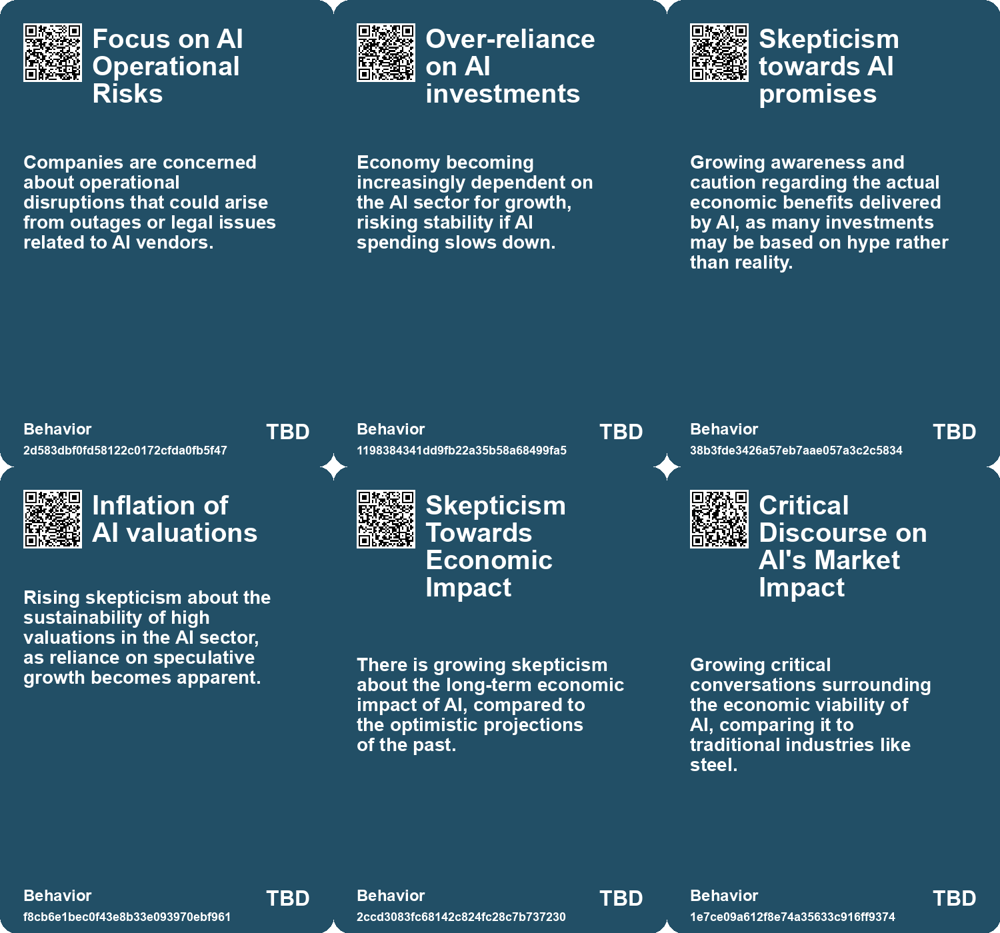
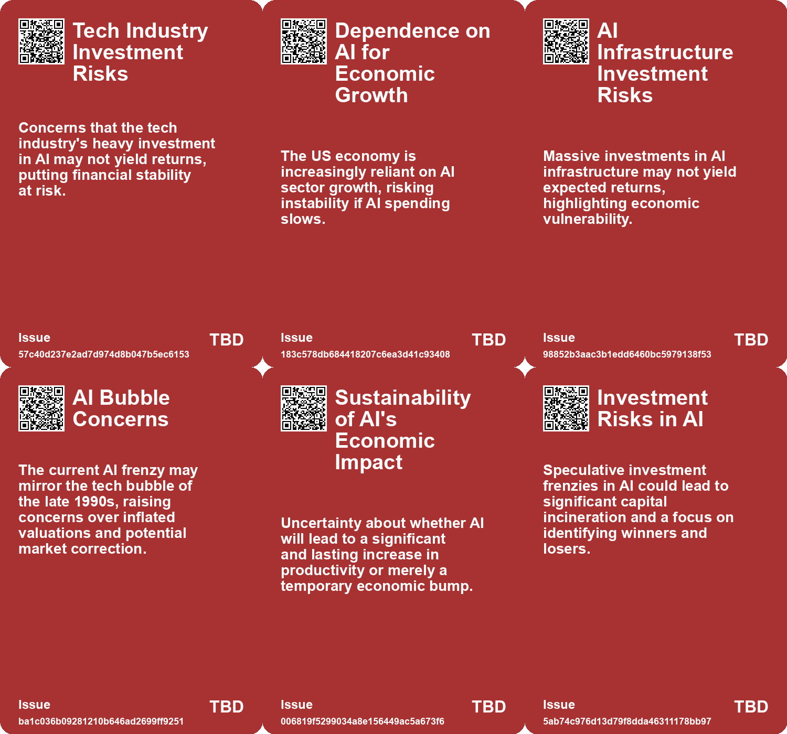

# *Topic*: Market Volatility and AI

# Summary

The rapid evolution of artificial intelligence (AI) is reshaping various sectors, raising both opportunities and concerns. A significant theme is the contrasting scenarios for AI's future. Some experts predict an economic singularity, where AI rapidly transforms job landscapes and economic structures. Others foresee a more gradual integration, similar to past technological advancements, hindered by costs and regulatory challenges. This divergence highlights the need for businesses to monitor key signals and adapt strategies rather than rely solely on predictions.

The impact of AI on the job market is another critical focus. While AI has the potential to drive economic growth and increase productivity, there are fears of job displacement, particularly in white-collar roles. Research indicates that only a fraction of tasks, especially those involving computer vision, are currently viable for automation. As AI continues to evolve, the nature of work may shift towards roles that prioritize human creativity and emotional intelligence.

Concerns about the financial implications of AI are also prominent. The CEO of Stability AI believes that AI's impact will surpass that of the pandemic, yet warns of challenges such as job displacement and the need for regulatory frameworks. The financial sector is particularly vulnerable, with warnings about herd behavior stemming from the widespread use of identical AI models by major institutions. This could lead to a market crisis if not properly managed.

The AI investment landscape mirrors past tech bubbles, with soaring valuations reminiscent of the late 1990s. Analysts question the sustainability of these high valuations, suggesting that the concentration of investments in a few major companies could lead to a government bailout rather than a market correction. This raises concerns about the long-term viability of the current AI boom and the lessons learned from previous economic bubbles.

In the realm of education, business schools are integrating AI into their curriculums to prepare graduates for a tech-driven job market. This includes developing specialized AI tools to teach soft skills and enhance leadership training. Employers increasingly value technology skills, emphasizing the importance of understanding AI's broader implications on the future of work.

The global economy is also being influenced by AI and climate change, with potential scenarios ranging from significant economic growth to contraction. A model from PwC outlines three possible futures, emphasizing the need for businesses to adapt to uncertainties and focus on sustainable practices. Geographic disparities may exacerbate these effects, with some regions benefiting from AI while others face challenges.

Finally, the ethical implications of AI are under scrutiny. Concerns about biased systems, environmental impacts, and the potential for misuse highlight the need for responsible AI deployment. As AI technology advances, the importance of trust and explainability becomes paramount in ensuring its positive integration into society. The call for greater regulatory oversight and ethical considerations is growing louder as the landscape continues to evolve.

# Seeds

|    | name                                     | description                                                                                        | change                                                                                         | 10-year                                                                                                        | driving-force                                                                                      |
|---:|:-----------------------------------------|:---------------------------------------------------------------------------------------------------|:-----------------------------------------------------------------------------------------------|:---------------------------------------------------------------------------------------------------------------|:---------------------------------------------------------------------------------------------------|
|  0 | Doubts About AI Valuations               | Investors are beginning to question the valuations of AI-focused companies.                        | Shift from high investor confidence to skepticism regarding profitability and business models. | AI companies may see market corrections and more realistic valuations driven by actual performance.            | Growing awareness of the disconnect between hype and tangible results in AI deployments.           |
|  1 | Shift in Financial Market Narratives     | Recent changes in reporting and outlooks in financial markets reflect unease about AI investments. | From uncritical acceptance of AI hype to a consensus that a bubble might be forming.           | Financial structures and narratives around AI investment could stabilize as expectations realign with reality. | Increased scrutiny of investment practices and demand for profitability in AI ventures.            |
|  2 | Model Agnosticism                        | There is an emerging trend towards flexibility in utilizing multiple AI models.                    | Moving from single-model dependency to a strategic multi-model approach.                       | Companies will leverage diverse AI models collaboratively, optimizing specific tasks more effectively.         | The need for customized solutions for varied operational challenges drives multi-model strategies. |
|  3 | Hype vs. Reality Discrepancy             | A growing disconnect between AI hype and actual performance, impacting investor sentiment.         | Transition from optimistic investment in AI to caution and reevaluation in spending.           | Tech investments may become more cautious and focused on proven technologies.                                  | Investor skepticism about AI's capabilities leads to more prudent investment practices.            |
|  4 | Potential AI Investment Bubble           | There's a risk of an investment bubble in AI if growth expectations are not met.                   | Economy may shift from optimism and investment in AI to skepticism and reduced funding.        | Possible correction in AI sector leading to lower investment and innovation, affecting economic stability.     | Massive capital investments based on speculative growth promises of AI.                            |
|  5 | AI-Driven Productivity Revolution        | AI is set to revolutionize productivity, potentially leading to substantial economic growth.       | Shifting from traditional productivity models to AI-enhanced, high-efficiency systems.         | In a decade, businesses may operate with vastly improved efficiency and economic output due to AI.             | The continuous advancement and integration of AI technologies across sectors.                      |
|  6 | AI's Long-term Economic Value            | Despite market fluctuations, AI is projected to create significant economic value in the future.   | From short-term speculation to recognition of AI's enduring impact on various sectors.         | AI could become a foundational technology, reshaping industries and economies over time.                       | Continued innovation and integration of AI technologies in everyday applications.                  |
|  7 | Potential for Financial Crisis           | Warnings of an inevitable financial crisis linked to AI reliance.                                  | Shift from stable financial environments to potential crises due to AI reliance.               | In 10 years, the financial landscape may be more crisis-prone due to AI dependencies.                          | Concerns over systemic risk associated with uniform AI decision-making.                            |
|  8 | Economic Volatility Due to AI Disruption | The transition to an AI-driven economy may lead to increased economic instability.                 | From stable economic conditions to volatility driven by rapid job loss and retraining needs.   | In ten years, economies may still be recovering from the shock of AI-related job displacement.                 | The rapid pace of AI integration into various sectors without adequate preparation.                |
|  9 | Systemic Risks of AI Integration         | The risks associated with automated processes failing due to AI dependence.                        | Growing awareness of the potential catastrophic failures from AI reliance.                     | Stricter regulations and safeguards in industries reliant on AI technologies.                                  | The need for safety and reliability in increasingly automated sectors.                             |

# Concerns

|    | name                                              | description                                                                                                                                               |
|---:|:--------------------------------------------------|:----------------------------------------------------------------------------------------------------------------------------------------------------------|
|  0 | Failures in Identifying Viable AI Business Models | Firms may struggle to find sustainable economic models amid inflated valuations and unrealistic projections for AI profitability.                         |
|  1 | Investor exposure to AI risks                     | Heavy investments in a limited number of AI companies increase financial risk for investors if the market corrects itself.                                |
|  2 | AI bubble potential                               | An unsustainable investment boom in AI could lead to a market correction, impacting the broader economy negatively.                                       |
|  3 | AI Frenzy Leading to Economic Disruption          | The current AI investment surge may create economic instability if it replicates past asset bubbles without sustainable profitability.                    |
|  4 | Job Displacement Risk                             | As AI systems improve, there's a significant risk of marketing managers and other professionals being rendered obsolete or having their roles diminished. |
|  5 | Revenue Discrepancy                               | The significant gap between expected AI revenues and actual growth raises concerns about the sustainability of AI businesses.                             |
|  6 | AI-Induced Financial Meltdown                     | Uniform use of AI models by financial institutions may lead to herd behavior, risking a chain reaction market failure.                                    |
|  7 | Concentration of AI Models and Tools              | Limited selection of AI models could result in all major players making similar decisions, exacerbating market volatility.                                |
|  8 | Ineffective Government Oversight                  | Historical inability of government to adequately regulate Wall Street raises concern over handling emerging AI technologies.                              |
|  9 | Rapid Pace of AI Disruption                       | The speed of AI development and its impact on industries may outpace society's ability to adapt, creating instability.                                    |

# Cards

## Concerns

## Behaviors

## Issue

## Technology

# Links

* [MIT Study Challenges AI Job Displacement Fears with Economic Viability Insights](https://futures.kghosh.me/89ee61cc0d9fa77ecb1eb4100622a53f)
* [The Impact of Generative AI and Autonomous Agents on Business Value Creation and Trust Issues](https://futures.kghosh.me/15d4ec180189ca1739398f516844cefb)
* [Stability AI's CEO Predicts AI Will Disrupt Society More Than the Pandemic](https://futures.kghosh.me/283ff70c63aed09ef2b0613f6acc2eb9)
* [AI's Impact on Society: Job Displacement and the Need for Retraining](https://futures.kghosh.me/cf119665e47c7434e3e3c54dbbc585e3)
* [Navigating the AI Economic Landscape: From $200B to $600B Challenges Ahead](https://futures.kghosh.me/98acd0f84df042843341ecfc66b2d312)
* [Exploring Two Competing Scenarios for AI's Future: Singularity vs. Normal Technology](https://futures.kghosh.me/2842c837bffa0314ba45bc9337a580c9)
* [Thriving in an AI Era: Embracing, Adapting, and Complementing Technology](https://futures.kghosh.me/23a3410059759ba4214235628d4ebd4b)
* [Examining the Current Landscape of AI and the Rise of Weekday Golf in Remote Work Culture](https://futures.kghosh.me/5d46b9591d2203474bd141244a31a464)
* [The Rise of AI Agent Marketplaces: A New Era for Small Businesses](https://futures.kghosh.me/3f3f736e1a4c0cb5bb016e789bcdc445)
* [SEC Chairman Warns AI Could Lead to Financial Crisis Without Regulation](https://futures.kghosh.me/c24651d7a89dbc792142e26a99579bfe)
* [The Security Risks of Rapid AI Integration: A Call for Caution and Awareness](https://futures.kghosh.me/b30a4282af9e53ca673438a8223d9525)
* [Concerns Over US Economy's Reliance on AI and Tech Investments Amidst Warning Signs](https://futures.kghosh.me/05d9675118f63fb25598f8279f334aea)
* [The Transformative Impact of AI on Jobs, Reality, and Economic Value Distribution](https://futures.kghosh.me/17cff4adea214f71c7a5eed15307b0e7)
* [Exploring the Similarities and Differences Between the 1990s Tech Bubble and Today's AI Frenzy](https://futures.kghosh.me/fb4c4ce722b5eb99ab866cf06e4fd108)
* [Understanding the AI Bubble: Risks, Rewards, and Potential Collapse](https://futures.kghosh.me/a66bbbd135358876d88cabfd0548511c)
* [The Transformative Impact of AI on Productivity and Entrepreneurship in 2023](https://futures.kghosh.me/a40580730388900810b4496ff9891dc9)
* [Analyzing AI's Impact on Wages and Employment: Two Diverging Pathways in the Future of Work](https://futures.kghosh.me/ef65b4ec6a48bf076171480f9ec6c8cc)
* [Future Economic Scenarios Shaped by AI and Climate Change: Insights from PwC](https://futures.kghosh.me/ff491e399856ef66ae24c238fd28e735)
* [Evaluating AI Effectiveness: The Need for Customized Assessments Beyond Standard Benchmarks](https://futures.kghosh.me/18de8dd66f7714385f35628458d7671a)
* [Corporate AI Adoption Declines Amidst Hype and Unmet Expectations](https://futures.kghosh.me/cb16766051fd44c1bf75b3a1c492cf4b)
* [The Impact of AI on Wages and Human Adaptation in the Workforce](https://futures.kghosh.me/faa0e4de05145c04c5d22a8449a70d95)
* [The Transformative Role of Generative AI in Supply Chain and Marketing Management](https://futures.kghosh.me/1b46caa07ff58af58c2e1cf51b86402d)
* [The Integration of AI in Business School Curriculums to Enhance Graduate Competitiveness](https://futures.kghosh.me/bc232b227c806ac26adf2b99fa4cff9d)
* [AI Risks Increasingly Acknowledged by S&P 500 Firms Amid Optimism on Business Opportunities](https://futures.kghosh.me/ffb77d0b4aee98b9deee7e41a3c1bbdf)
* [Exploring the Future of AI in Knowledge Ecosystems and Global Challenges](https://futures.kghosh.me/a9266018b458295480a07167310458a9)