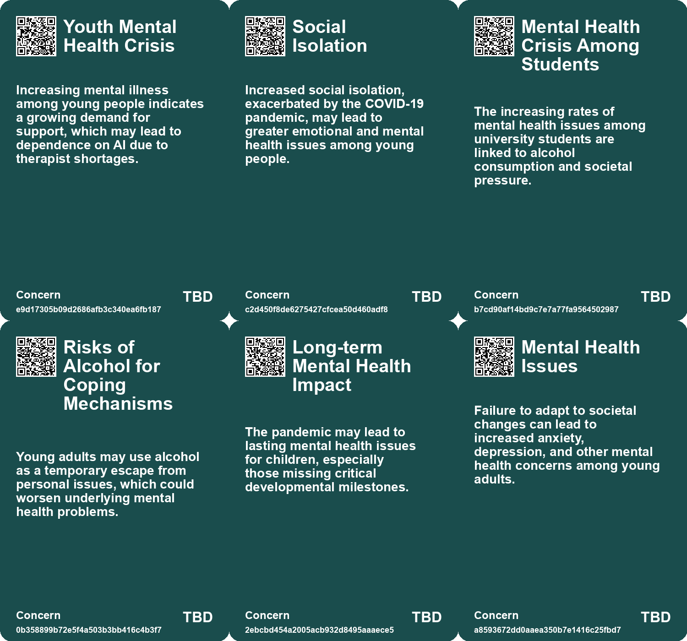
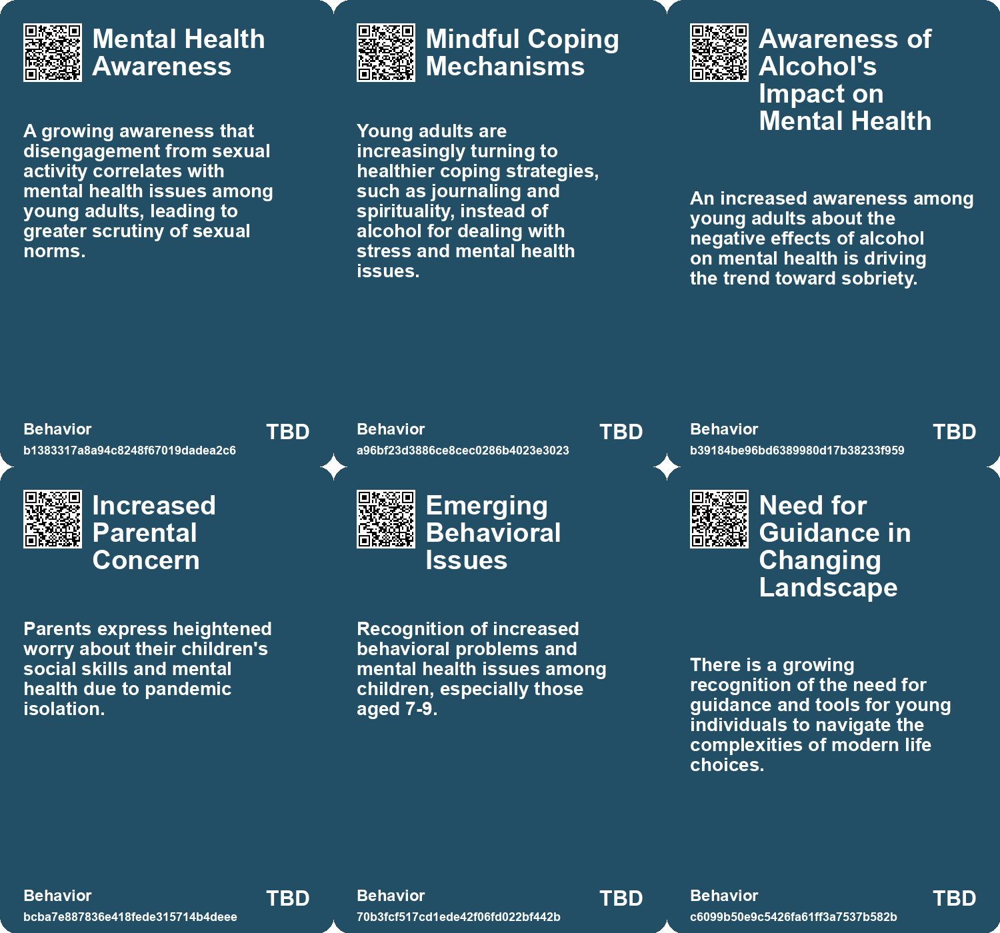
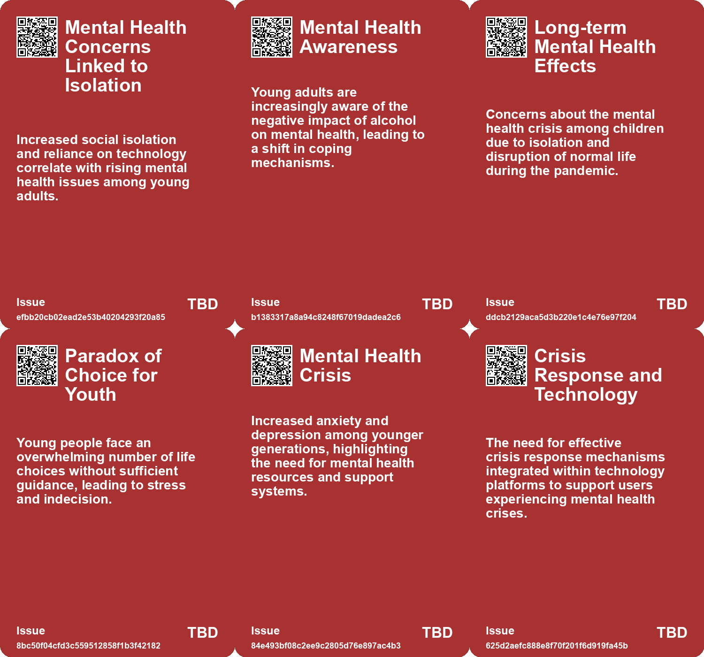
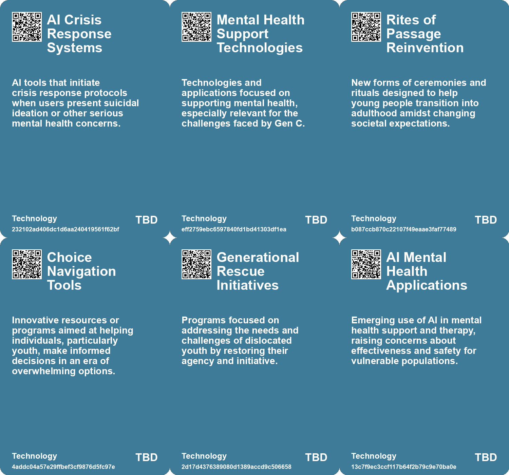

# *Topic*: Mental Health Crisis Among Youth

# Summary

The impact of technology on mental health is a pressing concern across various demographics. The rise of social media platforms, particularly TikTok, has been linked to increased feelings of isolation and anxiety among children and young adults. Reports indicate that children aged 5-7 are particularly vulnerable, with their screen time contributing to a decline in cognitive skills and emotional stability. Teachers express frustration over students' apathy and emotional volatility, attributing these issues to smartphone addiction and the constant stimulation of dopamine-driven interfaces. The trend of young people seeking AI chatbots for emotional support further complicates the landscape, as reliance on technology for mental health care raises questions about the adequacy of these solutions.

Loneliness is emerging as a significant public health crisis, with a substantial percentage of Americans reporting feelings of isolation. The U.S. Surgeon General's report emphasizes the necessity of fostering meaningful social connections to combat this growing issue. The beauty industry is responding to mental health concerns by prioritizing well-being in product offerings, reflecting a broader societal shift towards addressing emotional health.

The issue of homelessness is framed within the context of affordable housing, challenging common misconceptions that attribute homelessness to mental health or addiction. The focus on housing solutions as a primary driver for addressing homelessness highlights the need for systemic change in societal approaches to this crisis.

Female radicalization is another critical topic, particularly as young women engage with misogynistic content online. The rise of 'tradwife' culture illustrates how women can perpetuate harmful narratives while believing they are not contributing to violence. This calls for a deeper understanding of the societal factors that lead to female participation in extremist movements.

Emerging risks, particularly related to climate change, geopolitical instability, and cybersecurity, are increasingly concerning to experts and the public alike. Reports indicate a growing sense of vulnerability and a decline in confidence regarding public authorities' ability to manage these complex challenges. The insurance sector is identified as a crucial player in addressing these risks, emphasizing the need for a holistic approach to risk management.

The changing attitudes of younger generations towards work, education, and personal finance reflect a shift in priorities. Millennials and Gen Z are increasingly focused on mental well-being and personal fulfillment over traditional financial goals. This shift is evident in the rising trend of sobriety among young people, driven by concerns about self-image and mental health.

Finally, the decline in literacy and critical thinking skills across all age groups raises alarms about the long-term implications for society. The pervasive influence of smartphones and social media is believed to weaken attention spans and memory, making individuals more susceptible to manipulation. This trend underscores the need for a renewed focus on education that prioritizes practical skills and critical thinking to prepare future generations for the challenges ahead.

# Seeds

|    | name                                              | description                                                                                                             | change                                                                                                           | 10-year                                                                                                       | driving-force                                                                                              |
|---:|:--------------------------------------------------|:------------------------------------------------------------------------------------------------------------------------|:-----------------------------------------------------------------------------------------------------------------|:--------------------------------------------------------------------------------------------------------------|:-----------------------------------------------------------------------------------------------------------|
|  0 | Mental Health Crisis Among Youth                  | Mental illness rates, specifically among young people, are increasing in China, driving demand for accessible services. | Increased awareness and urgency surrounding mental health care from traditional methods to innovative solutions. | The mental health landscape may evolve significantly, focusing on preventive measures and accessible support. | The growing acknowledgment of mental health challenges contributes to innovation in therapeutic solutions. |
|  1 | Mental Health Awareness Impacting Intimacy        | Increased awareness of mental health affecting young people's approach to sex and relationships.                        | From prioritizing sex to prioritizing mental well-being and personal goals in relationships.                     | Improved mental health discourse will redefine sexual norms, focusing on consent and personal readiness.      | Emergence of mental health discussions influencing personal relationship dynamics and priorities.          |
|  2 | Rising Public Awareness of Tech's Impact          | Public recognition of the harmful effects of technology on the youth is growing.                                        | From ignorance to awareness about technology’s adverse effects on education.                                     | Increased advocacy for responsible technology use and education reform.                                       | The rise of grassroots movements highlighting tech-induced challenges in education.                        |
|  3 | Mental Health Crisis                              | The pandemic has exacerbated mental health issues in children and adolescents.                                          | Shift from general childhood challenges to a pronounced mental health crisis due to pandemic stressors.          | Long-term mental health impacts among Gen C could redefine support systems for future generations.            | Increasing awareness of mental health issues exacerbated by the pandemic's isolation and stress.           |
|  4 | Failure to Launch (FTL) Phenomenon                | Young men struggle to transition into adulthood, feeling lost and disconnected.                                         | Shift from clear rites of passage to a vague transition into adulthood.                                          | More personalized and supportive pathways for young men transitioning to adulthood are developed.             | Cultural shifts that challenge traditional male identity and the need for supportive structures.           |
|  5 | Political Polarization Awareness                  | Younger generations are growing up amid increasing political divides and global crises.                                 | Shift from stable political environments to one of heightened conflict and division.                             | Future governance might focus on bridging divides and addressing global challenges collaboratively.           | Historical context of political tension and a desire for reform from youth perspectives.                   |
|  6 | Youth Mental Health Crisis                        | Surge in mental health issues among high school students linked to social media use.                                    | From traditional mental health challenges to those exacerbated by technology.                                    | In 10 years, mental health interventions may increasingly involve AI tools.                                   | The urgent need for solutions to address rising mental health concerns in youth.                           |
|  7 | Mental Health Awareness                           | Gen Z openly discusses and seeks help for mental health issues.                                                         | Evolving societal attitudes towards mental health, reducing stigma.                                              | Mental health will be prioritized in workplaces and educational settings, influencing policies.               | Increased awareness and accessibility of mental health resources through technology.                       |
|  8 | Deteriorating Youth Mental Health                 | Youth mental health issues have escalated, especially post-2010, correlating with tech usage.                           | Mental health issues among youths have shifted from manageable to crisis level since 2010.                       | In a decade, mental health services might evolve to address the specific impacts of social media on youth.    | The overwhelming influence of digital media on daily life and mental well-being is a primary concern.      |
|  9 | Increased Awareness of Mental Health Data Privacy | Growing concerns about the privacy of mental health data among consumers and advocates.                                 | Shift from ignorance about data privacy to heightened awareness and demand for protections.                      | In 10 years, there may be stronger regulations and consumer advocacy for mental health data privacy.          | Public awareness and advocacy for mental health privacy rights are driving this change.                    |

# Concerns

|    | name                                       | description                                                                                                                                                               |
|---:|:-------------------------------------------|:--------------------------------------------------------------------------------------------------------------------------------------------------------------------------|
|  0 | Youth Mental Health Crisis                 | Increasing mental illness among young people indicates a growing demand for support, which may lead to dependence on AI due to therapist shortages.                       |
|  1 | Social Isolation                           | Increased social isolation, exacerbated by the COVID-19 pandemic, may lead to greater emotional and mental health issues among young people.                              |
|  2 | Mental Health Crisis Among Students        | The increasing rates of mental health issues among university students are linked to alcohol consumption and societal pressure.                                           |
|  3 | Risks of Alcohol for Coping Mechanisms     | Young adults may use alcohol as a temporary escape from personal issues, which could worsen underlying mental health problems.                                            |
|  4 | Long-term Mental Health Impact             | The pandemic may lead to lasting mental health issues for children, especially those missing critical developmental milestones.                                           |
|  5 | Mental Health Issues                       | Failure to adapt to societal changes can lead to increased anxiety, depression, and other mental health concerns among young adults.                                      |
|  6 | Mental Health Crisis                       | Increased levels of anxiety and depression among younger generations due to economic uncertainties and global challenges.                                                 |
|  7 | Deterioration of Mental Health Among Youth | The intersection of social media and AI chatbot usage might contribute to an overall decline in youth mental well-being, as highlighted by rising mental health concerns. |
|  8 | Inadequate Support Systems                 | The lack of comprehensive support systems for vulnerable populations, such as those with severe mental illness or addiction issues, exacerbating homelessness.            |
|  9 | Support Network Efficacy                   | Volunteers may struggle with emotional impacts due to lack of formal support, highlighting the need for structured mental health resources.                               |

# Cards

## Concerns

## Behaviors

## Issue

## Technology

# Links

* [Future Risks Report 2025: Increasing Global Crises and Emerging Risks Analysis](https://futures.kghosh.me/c5ecb012c90eddae1d46c1137e384c86)
* [Exploring the Risks of Heavy Chatbot Use on Mental Health and Social Interactions](https://futures.kghosh.me/424dd84488f34cb7d735777fe34b584e)
* [Denmark's Digital Mood Monitoring: A Boon or a Burden for Student Well-being?](https://futures.kghosh.me/17ac55c1f87675e075557fa4fa5ba14e)
* [Economic Challenges Faced by Millennials and Generation Z: A Deep Dive into Inequality and Instability](https://futures.kghosh.me/86001e4fb7b55397aece664afd67001a)
* [Addressing the Social Fitness Crisis: The Need for Connection in Modern Society](https://futures.kghosh.me/9aeeedec876dadd7664c8ac15af0b90e)
* [The Alarming Rise of TikTok Use Among Young Children and Its Impact on Mental Health](https://futures.kghosh.me/86de953915dd0ccbcfe0909f371f9f70)
* [Future Risks Report 2024: Key Findings on Emerging Global Challenges](https://futures.kghosh.me/caf29de5522a914887f9653f8edfd0a6)
* [The Rise of AI Chatbots in China's Mental Health Landscape: Opportunities and Risks](https://futures.kghosh.me/70e9fcd5fc1d2dd04ae1df8b2628194d)
* [Gen Z's Evolving Financial Mindset: Prioritizing Wellness Over Wealth Amid Economic Uncertainty](https://futures.kghosh.me/1b41206075bb58ef4a1bcb8a6d82ffc0)
* [Understanding Gen C: The Impact of COVID-19 on a New Generation of Children](https://futures.kghosh.me/a8f4138fbd48b06cdfde0106b7fed6c0)
* [Essential Strategies for Open Source Researchers to Protect Mental Health](https://futures.kghosh.me/ed4473b3a0fa1513b565081d8773b33e)
* [The Emotional Impact of Virtual Reality and AI in Grieving Process](https://futures.kghosh.me/f97f969e4aadfbae3dee287de4ab721d)
* [Declining Intelligence: A Widespread Trend Across Generations in the Age of Social Media](https://futures.kghosh.me/76bc01451eb69c84d19e73fa1ed386a7)
* [Understanding the Rise of Sobriety Among Young Adults: Trends and Reasons Behind Alcohol Avoidance](https://futures.kghosh.me/94960bd3c0ad4c594fd56651f4087128)
* [Understanding Gen Z: Perspectives on Work, Education, and Technology in a Changing World](https://futures.kghosh.me/644ce4dcf74e76970fd0526ca1abf551)
* [Understanding Polarization: Healing Our Relationship with Technology and Embracing Diverse Perspectives](https://futures.kghosh.me/c1bb890337ef382bfaa5720c9fd05134)
* [Lawsuit Filed Against Character.AI Over Harmful Chatbot Interactions with Minors](https://futures.kghosh.me/3c9ee72ba2741eaef9d4b922a8dd4670)
* [Emerging Global Risks: Climate Change, Geopolitical Tensions, and Technological Threats in 2025](https://futures.kghosh.me/c279f12eda98e732755a0f730b9d4d4b)
* [Understanding 'Failure to Launch': The Cultural and Economic Struggles of Young American Men](https://futures.kghosh.me/c6a3cc9fe503779d0ad2ec2c66aa7fb8)
* [The Decline of Higher Education: Generation Z's Shift Away from College](https://futures.kghosh.me/d64c4666be4d84f147f57055b74daa32)
* [Understanding Homelessness: The Critical Role of Housing Affordability in Addressing the Crisis](https://futures.kghosh.me/697dba113f3330775a4a451a3a663cb4)
* [Understanding the Decline of Sexual Activity Among Young Adults](https://futures.kghosh.me/41c5aaec77428f1d0c1fb17c83c853eb)
* [Exploring the Overlooked Issue of Female Radicalization in Modern Society](https://futures.kghosh.me/00344fccd0922ea64c011f2e3e163153)
* [The Crisis in Education: Students as Victims of Smartphone Addiction and Tech Overreach](https://futures.kghosh.me/a5688e452658f03667dfc0fe392e1f1d)
* [The Rise of PSYCARE: How Mental Health is Reshaping the Beauty Industry](https://futures.kghosh.me/b396d58ff64cbfdfe136c278b263ee5a)
* [Understanding the Risks of Data Brokers Selling Americans’ Mental Health Information](https://futures.kghosh.me/d7e132b0dc94474c05f6109c82cf9878)