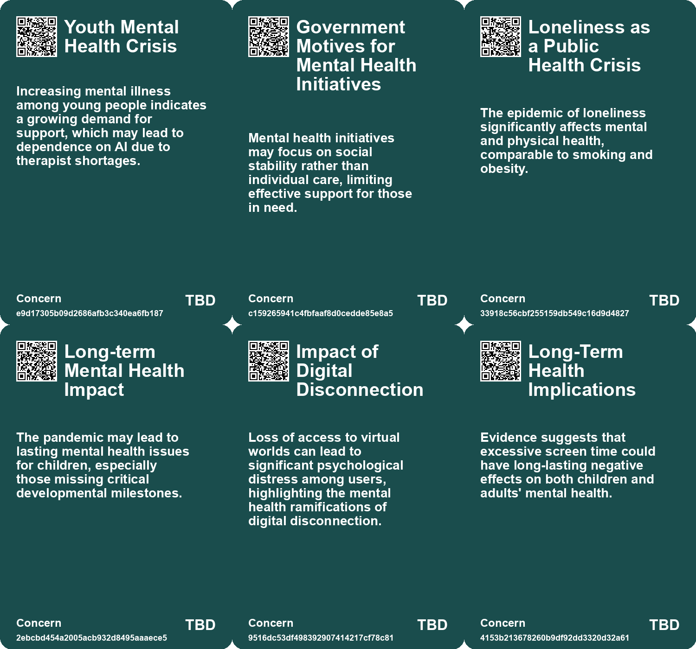
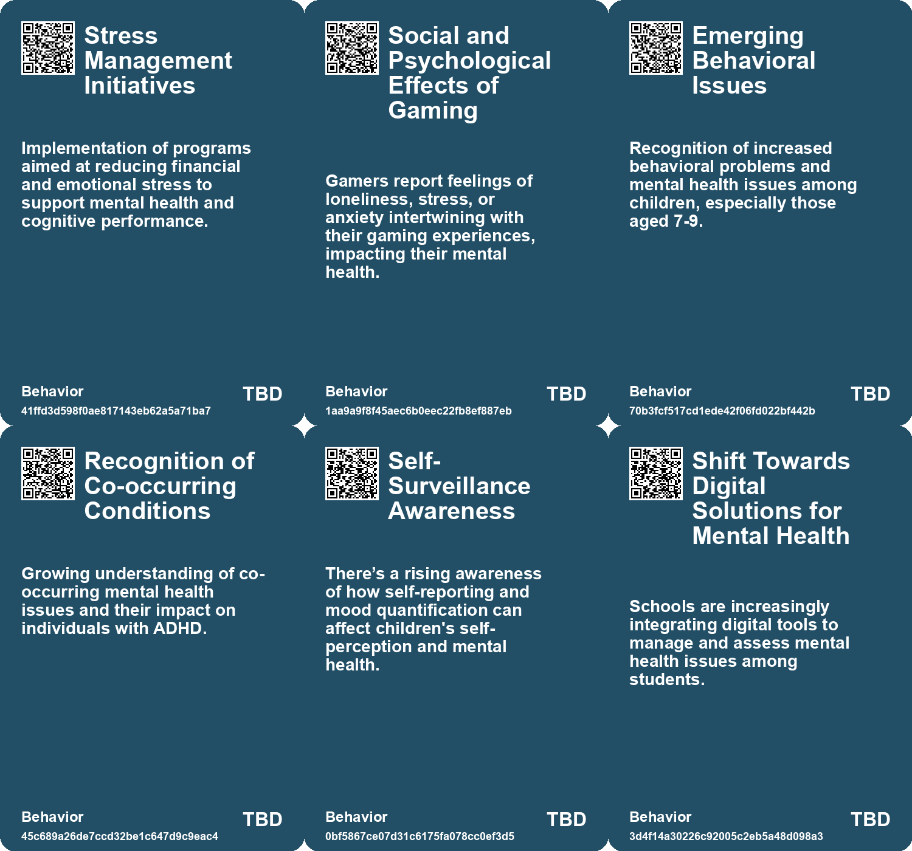
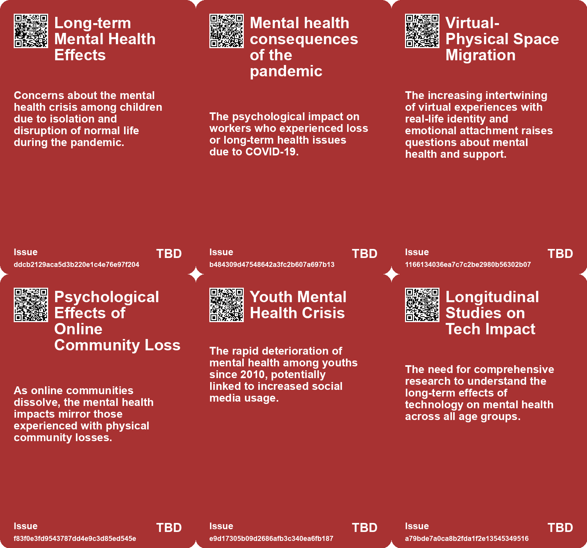
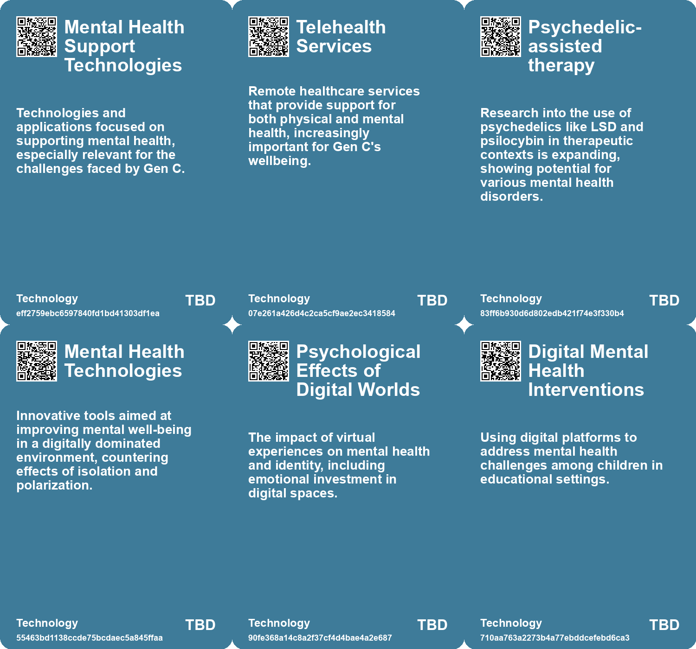

# *Topic*: Mental Health Impact

# Summary

Loneliness and Mental Health

A growing public health crisis of loneliness is affecting many Americans, with 58% reporting feelings of isolation. This issue is particularly pronounced among younger generations, leading to significant mental and emotional consequences. The U.S. Surgeon General's report emphasizes the need for social connections to enhance well-being, urging individuals and businesses to foster meaningful relationships. Meanwhile, studies from MIT Media Lab and OpenAI reveal that heavy chatbot usage can exacerbate feelings of loneliness and emotional dependence, particularly among frequent users. This trend mirrors earlier research on social media, suggesting that those who feel isolated may turn to technology for emotional support. 

The impact of mental health extends into various sectors, including the beauty industry, which is increasingly prioritizing well-being. Brands are responding to consumer demand for products that address stress and enhance mood, incorporating holistic treatments and community-building initiatives. In education, Danish teachers are using apps to monitor student well-being, though concerns arise about the implications of quantifying emotions and potential privacy issues.

Cognitive Impairment and Socioeconomic Factors

Poverty significantly affects cognitive performance, with malnutrition and financial stress leading to substantial declines in IQ. Poor diets can also hinder academic performance, perpetuating a cycle of poverty that limits opportunities. Addressing nutritional and financial stability is crucial for improving societal intelligence and overall well-being. The effects of long COVID further complicate this landscape, as individuals experience cognitive difficulties that may constrain employment and contribute to rising disability rates.

Technology's Role in Mental Health

The rise of AI chatbots for mental health support is notable, particularly among young people in China who seek these tools due to high therapy costs and societal stigma. While AI can provide round-the-clock assistance, concerns about reinforcing harmful thoughts without critical feedback persist. The lack of explicit regulations for AI therapy chatbots poses risks for users seeking emotional support. Additionally, a study indicates that heavy reliance on AI tools may lead to cognitive atrophy among knowledge workers, diminishing critical thinking skills.

Digital Worlds and Emotional Attachment

The emotional impact of losing access to digital worlds is evident in the case of Blizzard Activision's fallout with its Chinese distributor, resulting in the loss of World of Warcraft for millions. Players often form deep attachments to these virtual spaces, experiencing emotions akin to those felt in the physical world. This phenomenon highlights the significance of digital environments as social and emotional outlets.

Education and Technology

The education sector faces challenges as students struggle with apathy and emotional volatility linked to smartphone addiction and constant dopamine stimulation. Teachers report unprecedented declines in motivation and cognitive skills, raising alarms about the long-term effects of excessive screen time. The pandemic has further complicated these issues, leading to a generation of children, termed Gen C, who are navigating a landscape shaped by uncertainty and disruption.

Regulatory and Ethical Concerns

The data broker industry raises significant privacy concerns, particularly regarding the sale of sensitive mental health data. The lack of best practices and comprehensive federal privacy laws poses risks to individuals' privacy. Similarly, the integration of social-emotional AI in education and mental health raises ethical questions about the depersonalization of care and the unequal distribution of emotional support.

Neurodiversity and Inclusion

Roberto Moreno, a computer engineer with autism spectrum disorder, advocates for greater inclusion and support for neurodivergent individuals in the tech industry. His experiences highlight the importance of mentorship and clear regulations to prevent discrimination, emphasizing the need for organizations to create supportive environments for all engineers. 

The intersection of these themes underscores the complex landscape of mental health, technology, and societal challenges, revealing the urgent need for thoughtful approaches to foster well-being and inclusivity.

# Seeds

|    | name                                                         | description                                                                                                             | change                                                                                                           | 10-year                                                                                                       | driving-force                                                                                              |
|---:|:-------------------------------------------------------------|:------------------------------------------------------------------------------------------------------------------------|:-----------------------------------------------------------------------------------------------------------------|:--------------------------------------------------------------------------------------------------------------|:-----------------------------------------------------------------------------------------------------------|
|  0 | Mental Health Crisis Among Youth                             | Mental illness rates, specifically among young people, are increasing in China, driving demand for accessible services. | Increased awareness and urgency surrounding mental health care from traditional methods to innovative solutions. | The mental health landscape may evolve significantly, focusing on preventive measures and accessible support. | The growing acknowledgment of mental health challenges contributes to innovation in therapeutic solutions. |
|  1 | Chatbot Usage Patterns Indicating Mental Health Decline      | Identifying unhealthy usage patterns to mitigate mental health risks.                                                   | Shift from laissez-faire to proactive monitoring of user behaviors with chatbots.                                | Potential adoption of frameworks for monitoring emotional health related to chatbot use.                      | Growing recognition of technology’s responsibility for user well-being.                                    |
|  2 | Mental Health Crisis                                         | The pandemic has exacerbated mental health issues in children and adolescents.                                          | Shift from general childhood challenges to a pronounced mental health crisis due to pandemic stressors.          | Long-term mental health impacts among Gen C could redefine support systems for future generations.            | Increasing awareness of mental health issues exacerbated by the pandemic's isolation and stress.           |
|  3 | Deteriorating Youth Mental Health                            | Youth mental health issues have escalated, especially post-2010, correlating with tech usage.                           | Mental health issues among youths have shifted from manageable to crisis level since 2010.                       | In a decade, mental health services might evolve to address the specific impacts of social media on youth.    | The overwhelming influence of digital media on daily life and mental well-being is a primary concern.      |
|  4 | Increased Focus on Immersive Music Experiences               | Research supports the benefits of extended music listening sessions for mental health.                                  | Shift from short-duration music consumption to longer, immersive experiences.                                    | Music therapy may become a standard aspect of mental health treatment protocols.                              | Growing awareness of mental health and the therapeutic benefits of music.                                  |
|  5 | Increased Awareness of Mental Health in Open Source Research | Growing recognition of mental health impacts among open source researchers working with distressing content.            | Shifting from neglecting mental health to actively managing it in research contexts.                             | More structured support systems and resources for mental health in open source research environments.         | Rising cases of burnout and vicarious trauma among researchers due to graphic content exposure.            |
|  6 | Rise of Psychedelic Wellness                                 | Interest in psychedelics for mental health is influencing beauty and wellness sectors.                                  | From conventional treatments to exploring psychedelics for psychological benefits.                               | Psychedelic-inspired treatments will be integrated into beauty products, enhancing mental health support.     | The search for innovative solutions for mental health challenges.                                          |
|  7 | Increased Awareness of Mental Health Data Privacy            | Growing concerns about the privacy of mental health data among consumers and advocates.                                 | Shift from ignorance about data privacy to heightened awareness and demand for protections.                      | In 10 years, there may be stronger regulations and consumer advocacy for mental health data privacy.          | Public awareness and advocacy for mental health privacy rights are driving this change.                    |
|  8 | Consumer Demand for Privacy Protections                      | Growing consumer expectation for privacy in handling sensitive mental health information.                               | Shift from minimal consumer expectation of privacy to a demand for robust protections.                           | In 10 years, consumer rights regarding mental health data may be significantly strengthened.                  | Rising awareness of data privacy risks is motivating consumers to demand protections.                      |
|  9 | Potential for Data Breaches and Misuse                       | Increased likelihood of data breaches and misuse of sensitive mental health data.                                       | From limited awareness of data misuse risks to widespread concerns about breaches.                               | In a decade, there may be advanced security measures to protect mental health data.                           | The rise in cyber threats and data exploitation drives the need for better security.                       |

# Concerns

|    | name                                             | description                                                                                                                                                         |
|---:|:-------------------------------------------------|:--------------------------------------------------------------------------------------------------------------------------------------------------------------------|
|  0 | Youth Mental Health Crisis                       | Increasing mental illness among young people indicates a growing demand for support, which may lead to dependence on AI due to therapist shortages.                 |
|  1 | Government Motives for Mental Health Initiatives | Mental health initiatives may focus on social stability rather than individual care, limiting effective support for those in need.                                  |
|  2 | Loneliness as a Public Health Crisis             | The epidemic of loneliness significantly affects mental and physical health, comparable to smoking and obesity.                                                     |
|  3 | Long-term Mental Health Impact                   | The pandemic may lead to lasting mental health issues for children, especially those missing critical developmental milestones.                                     |
|  4 | Impact of Digital Disconnection                  | Loss of access to virtual worlds can lead to significant psychological distress among users, highlighting the mental health ramifications of digital disconnection. |
|  5 | Long-Term Health Implications                    | Evidence suggests that excessive screen time could have long-lasting negative effects on both children and adults' mental health.                                   |
|  6 | Increased psychological distress                 | High rates of psychological issues such as depression and anxiety among long COVID patients could affect their overall well-being and productivity.                 |
|  7 | Mental Health Challenges                         | Neurodivergent individuals are at a higher risk of developing mental health issues such as depression and anxiety due to societal pressures and stigma.             |
|  8 | Vicarious Trauma Awareness                       | Researchers face cumulative emotional distress from engaging with traumatic content, which can impact mental health and decision-making.                            |
|  9 | Support Network Efficacy                         | Volunteers may struggle with emotional impacts due to lack of formal support, highlighting the need for structured mental health resources.                         |

# Cards

## Concerns

## Behaviors

## Issue

## Technology

# Links

* [Roberto Moreno: Overcoming Autism Challenges to Achieve Engineering Success](https://futures.kghosh.me/c512e78d0c0fc39ed5798ecdae112f5d)
* [Exploring the Risks of Heavy Chatbot Use on Mental Health and Social Interactions](https://futures.kghosh.me/424dd84488f34cb7d735777fe34b584e)
* [Denmark's Digital Mood Monitoring: A Boon or a Burden for Student Well-being?](https://futures.kghosh.me/17ac55c1f87675e075557fa4fa5ba14e)
* [Addressing the Social Fitness Crisis: The Need for Connection in Modern Society](https://futures.kghosh.me/9aeeedec876dadd7664c8ac15af0b90e)
* [FDA Grants Breakthrough Therapy Status to LSD Formulation for Generalized Anxiety Disorder](https://futures.kghosh.me/ebd45e3db0b21a530b067b34fa6dadd3)
* [Exploring the Modern Entertainment Landscape and Its Societal Implications](https://futures.kghosh.me/c5c2c794f1426e6e307a9df3f9ff61f6)
* [The Alarming Rise of TikTok Use Among Young Children and Its Impact on Mental Health](https://futures.kghosh.me/86de953915dd0ccbcfe0909f371f9f70)
* [Future Risks Report 2024: Key Findings on Emerging Global Challenges](https://futures.kghosh.me/caf29de5522a914887f9653f8edfd0a6)
* [The Rise of AI Chatbots in China's Mental Health Landscape: Opportunities and Risks](https://futures.kghosh.me/70e9fcd5fc1d2dd04ae1df8b2628194d)
* [Understanding the Impact of ADHD on Adult Life Expectancy and Health Inequalities](https://futures.kghosh.me/9dd065aa4bf2010c6bff02b7592d65ea)
* [The Dangers of AI Reliance: Cognitive Atrophy and Critical Thinking Decline in Knowledge Workers](https://futures.kghosh.me/682e04f0b543e67738d8ffbb84fc50dd)
* [Groundbreaking Study Highlights the Role of Public Libraries in Enhancing Community Health and Well-Being](https://futures.kghosh.me/19172620f20b441d350579834f15a61a)
* [The Emotional Impact of Losing Access to Virtual Worlds in Gaming](https://futures.kghosh.me/7ce06613470d821b81126a4378a0eb2e)
* [Exploring the Impact of Long COVID on Employment and Disability Rates in the U.S.](https://futures.kghosh.me/0248f1b6d72f8bb9c984f24db0569a3f)
* [Essential Strategies for Open Source Researchers to Protect Mental Health](https://futures.kghosh.me/ed4473b3a0fa1513b565081d8773b33e)
* [Exploring Game Transfer Phenomenon: When Video Games Impact Reality](https://futures.kghosh.me/cb84d5c485fbaeeb34783dc5340cbf09)
* [The Emotional Impact of Virtual Reality and AI in Grieving Process](https://futures.kghosh.me/f97f969e4aadfbae3dee287de4ab721d)
* [The Role of Social-Emotional AI: Bridging or Widening the Gap in Human Connection?](https://futures.kghosh.me/8e191b6221caa8d9f27b19268ab8a048)
* [Understanding Gen C: The Impact of COVID-19 on a New Generation of Children](https://futures.kghosh.me/a8f4138fbd48b06cdfde0106b7fed6c0)
* [The Long-Term Impact of COVID-19 on the Workforce and Economy](https://futures.kghosh.me/e84dc9448d44d2624c060fc15bf5c096)
* [The Impact of Poverty on Cognitive Performance: Understanding the Links between Finances and Intelligence](https://futures.kghosh.me/2e671c014ba53b8b49159c3c5143c526)
* [Understanding Polarization: Healing Our Relationship with Technology and Embracing Diverse Perspectives](https://futures.kghosh.me/c1bb890337ef382bfaa5720c9fd05134)
* [Understanding Homelessness: The Critical Role of Housing Affordability in Addressing the Crisis](https://futures.kghosh.me/697dba113f3330775a4a451a3a663cb4)
* [The Crisis in Education: Students as Victims of Smartphone Addiction and Tech Overreach](https://futures.kghosh.me/a5688e452658f03667dfc0fe392e1f1d)
* [The Rise of PSYCARE: How Mental Health is Reshaping the Beauty Industry](https://futures.kghosh.me/b396d58ff64cbfdfe136c278b263ee5a)
* [Understanding the Risks of Data Brokers Selling Americans’ Mental Health Information](https://futures.kghosh.me/d7e132b0dc94474c05f6109c82cf9878)