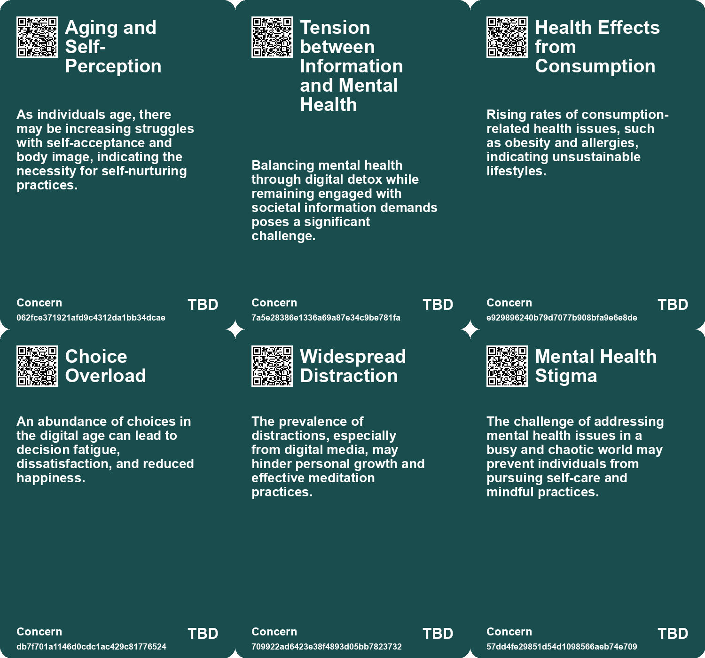
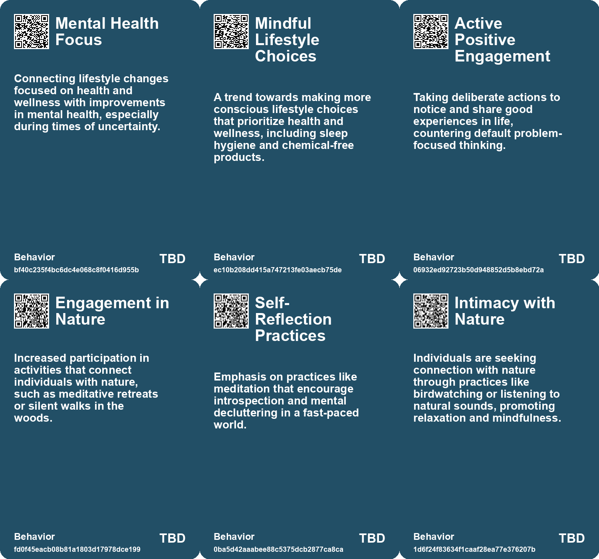
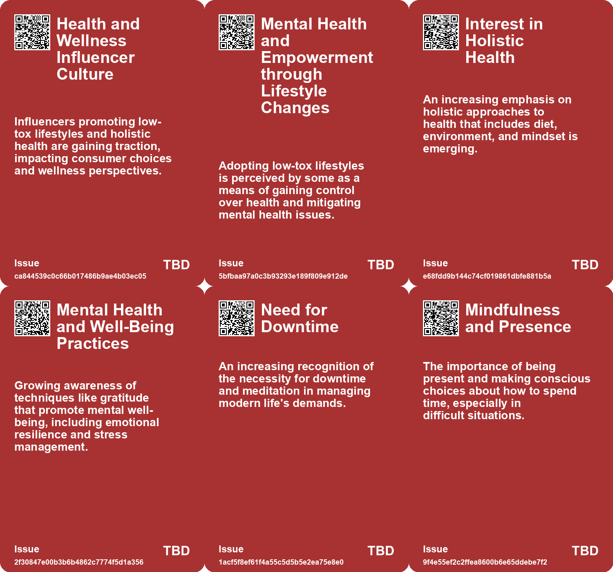
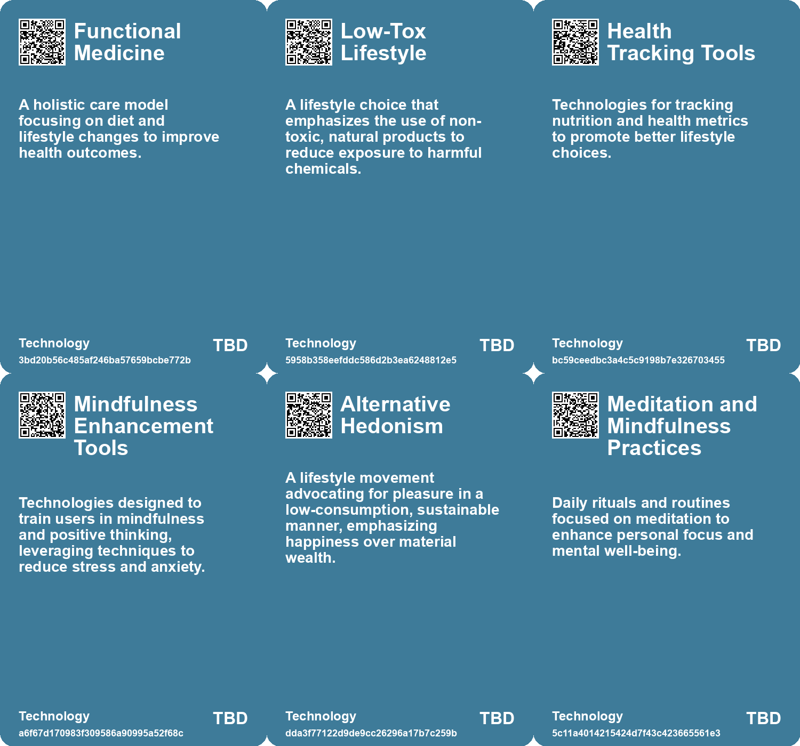

# *Topic*: Mindful Lifestyle Choices

# Summary

Attention and Mindfulness emerge as central themes across various discussions. The significance of reclaiming attention is highlighted as a pathway to mental clarity and personal freedom. Observing thoughts without judgment fosters a gentler engagement with the mind, allowing individuals to navigate complexity more meaningfully. This focus on mindfulness extends to learning, where a shift towards slow and deliberate education is advocated. The Slow Food movement serves as an inspiration for a more sustainable approach to learning, emphasizing self-reflection and the value of questions over mere answers.

The impact of technology on mental health and societal dynamics is another prominent theme. The challenges posed by constant overstimulation and the need for downtime are underscored, with practices like meditation recommended for restoring mental balance. The discussion extends to the cultural polarization exacerbated by digital technologies, particularly social media, suggesting a need for a philosophical shift towards prioritizing attention and embracing multiple perspectives.

Health and well-being are also focal points, with discussions on the importance of diet and lifestyle choices. The critique of the Standard American Diet emphasizes the need for nutrient-dense, locally sourced foods. The role of environmental toxins in health is addressed, advocating for proactive measures to reduce exposure. This theme of well-being intersects with the idea of kindness in the workplace, where fostering a positive culture is seen as essential, especially in times of uncertainty.

Career development and personal growth are explored through various lenses. The importance of aligning personal and organizational purposes is emphasized, along with the need for continuous learning and adaptability in a changing job landscape. The concept of "alive time" versus "dead time" encourages individuals to make the most of every moment, while the idea of Pursuit Mapping helps identify fulfilling personal and professional pursuits.

The commodification of experiences and the transactional nature of modern society are critiqued. The notion of "Everything as a Service" raises questions about the outsourcing of personal agency and fulfillment. This theme is echoed in discussions about the need for self-actualization and the importance of finding purpose from within, rather than relying on external validation.

Wandering and exploration are presented as vital for happiness and creativity. The benefits of engaging the senses and embracing the art of wandering are discussed, highlighting the negative effects of conformity and the importance of maintaining a sense of curiosity. This theme resonates with the call for deeper engagement with fewer things, countering the distractions of constant connectivity.

Finally, the challenges of navigating a culture of false urgency are addressed. The emphasis on prioritizing truly urgent tasks and creating space for deep work is crucial for enhancing productivity. Strategies for effective time management are suggested, underscoring the need for purposeful choices in an increasingly demanding environment.

# Seeds

|    | name                                    | description                                                                                                      | change                                                                                             | 10-year                                                                                                                     | driving-force                                                                                                |
|---:|:----------------------------------------|:-----------------------------------------------------------------------------------------------------------------|:---------------------------------------------------------------------------------------------------|:----------------------------------------------------------------------------------------------------------------------------|:-------------------------------------------------------------------------------------------------------------|
|  0 | Nature-Centric Retreats                 | Growing popularity of retreats emphasizing nature and simplicity for mental health benefits.                     | Transition from urban-centric experiences to nature-based wellness retreats as a norm.             | In ten years, expect a rise in eco-therapy practices and nature retreats as mainstream wellness solutions.                  | Desire for radical downtime and a connection to nature in a fast-paced digital world.                        |
|  1 | Mindfulness and Self-Care Practices     | Individuals are increasingly engaging in mindfulness and self-affirmation acts for self-care.                    | A movement from superficial self-care to deeper, intentional acts of self-nurture and mindfulness. | In ten years, self-care routines may become a normative part of daily life, integrated into work and personal environments. | The escalation of stress and anxiety levels in modern life necessitating effective self-care practices.      |
|  2 | Shift in Perspective on Time Management | A growing awareness of the importance of actively engaging with time rather than passively letting it slip away. | A transition from viewing time as simply passing to actively making the most of each moment.       | In 10 years, people may prioritize personal growth and continuous learning over traditional productivity metrics.           | The rise of mindfulness and self-improvement movements encourages individuals to take control of their time. |
|  3 | Shift towards alternative hedonism      | Emphasis on lifestyle changes that enhance happiness while reducing consumption.                                 | From a high-consumption lifestyle to one focused on well-being and reduced environmental impact.   | In ten years, society may prioritize leisure and community over material possessions, leading to a happier populace.        | Growing awareness of climate change and mental health issues drives the search for sustainable happiness.    |
|  4 | Viral Wisdom Movement                   | The trend of sharing wisdom and mindfulness practices through social media platforms.                            | Shift from traditional education to viral, engaging methods of sharing wisdom.                     | In 10 years, wisdom-sharing may dominate online content, shaping collective consciousness.                                  | The rise of digital platforms and desire for accessible personal growth resources.                           |
|  5 | Energy as a Scarce Resource             | Recognition that personal energy is finite and should guide life choices.                                        | From following societal expectations to prioritizing personal energy in decision-making.           | More people will consciously manage their energy, leading to healthier work-life balances.                                  | The rise of mental health awareness and the need for sustainable living.                                     |
|  6 | Rise of Mindfulness Practices           | Increasing interest in mindfulness and attention practices for mental clarity and peace.                         | Shift from chaotic, distracted living to a more mindful, focused way of life.                      | Mindfulness may become a standard practice in education and workplaces, enhancing overall mental well-being.                | Growing recognition of mental health importance and the need for effective stress management techniques.     |
|  7 | Simplification Trends                   | A movement towards simplifying thoughts and lifestyles to enhance clarity and focus.                             | Transition from complexity and overwhelm to simplicity and intentional living choices.             | Society may prioritize minimalism and essentialism, leading to less cluttered lives and minds.                              | Desire for clarity and peace in a fast-paced, overly complex world.                                          |
|  8 | Individual Agency in Mental Health      | Growing emphasis on personal responsibility for mental well-being through attention and practice.                | Shift from reliance on external solutions to self-directed mental health management.               | Individuals may increasingly adopt personalized mental health strategies, enhancing resilience.                             | Increased awareness of mental health issues and the need for self-care practices.                            |
|  9 | Mindfulness in Education                | The integration of mindfulness practices into learning environments.                                             | Transitioning from traditional educational models to those incorporating mindfulness.              | Mindfulness practices could become standard in classrooms, enhancing student well-being and focus.                          | Increased awareness of mental health issues related to fast-paced learning environments.                     |

# Concerns

|    | name                                          | description                                                                                                                                                 |
|---:|:----------------------------------------------|:------------------------------------------------------------------------------------------------------------------------------------------------------------|
|  0 | Aging and Self-Perception                     | As individuals age, there may be increasing struggles with self-acceptance and body image, indicating the necessity for self-nurturing practices.           |
|  1 | Tension between Information and Mental Health | Balancing mental health through digital detox while remaining engaged with societal information demands poses a significant challenge.                      |
|  2 | Health Effects from Consumption               | Rising rates of consumption-related health issues, such as obesity and allergies, indicating unsustainable lifestyles.                                      |
|  3 | Choice Overload                               | An abundance of choices in the digital age can lead to decision fatigue, dissatisfaction, and reduced happiness.                                            |
|  4 | Widespread Distraction                        | The prevalence of distractions, especially from digital media, may hinder personal growth and effective meditation practices.                               |
|  5 | Mental Health Stigma                          | The challenge of addressing mental health issues in a busy and chaotic world may prevent individuals from pursuing self-care and mindful practices.         |
|  6 | Misalignment of Intentions                    | Failure to align daily intentions with positive actions may lead to negative outcomes, affecting personal and collective growth.                            |
|  7 | Lack of Self-Awareness                        | Individuals may struggle with self-awareness in assessing their true interests and energy levels, complicating the process of choosing fulfilling pursuits. |
|  8 | Disconnection from the Present                | In a fast-paced world, people may struggle to remain mindful and engaged with the present moment, leading to a loss of meaningful experiences.              |
|  9 | Reinforcement of Negative Habits              | Without consistent practice of attention and mindfulness, old, unhelpful mental habits are likely to resurface, hindering progress.                         |

# Cards

## Concerns

## Behaviors

## Issue

## Technology

# Links

* [The Importance of Self-Management in Modern Careers: Insights from Peter Drucker](https://futures.kghosh.me/b76d6d3f8d4be2311caae40cce7b39a3)
* [Combating False Urgency: Strategies for a More Productive Work Culture](https://futures.kghosh.me/b4184f4b97d0fb3cd618ec7e7d8ed842)
* [Five Emerging Trends Transforming Business in the Coming Year](https://futures.kghosh.me/55bac03899915f25bf0b47fa4342472c)
* [The Importance of Kindness in the Workplace During Challenging Times](https://futures.kghosh.me/30ef1082d02491cac0f3331b1e684642)
* [Jay Shetty: Transforming Lives Through Intentions and Wisdom](https://futures.kghosh.me/38548b322684d1a81aa9ef61c7312cee)
* [Essential Career Lessons for Success Across Decades in Today’s Workforce](https://futures.kghosh.me/a06d27f1dd5a2328ba6aa8854abc5318)
* [Exploring the Dangers of Outsourcing Happiness and Personal Fulfillment in Modern Society](https://futures.kghosh.me/a5c0ba498382a4edc0f2bf0d9653ad16)
* [Finding Solace: The Importance of Nurturing Moments in Daily Life](https://futures.kghosh.me/86e3eac9b957c6312dc650384d3122dd)
* [Exploring Kate Soper’s Vision for Sustainable Living in 'Post-Growth Living'](https://futures.kghosh.me/71cbf82b85b58a6675d05308f8e1759e)
* [The Impact of Continuous Partial Attention on Networking and Relationships in a Digital World](https://futures.kghosh.me/417df5448432cb603f40dec77f469b87)
* [Essential Guide to Healthy Living: Recommendations for Diet, Sleep, and Toxin-Free Products](https://futures.kghosh.me/33d5bd130de3ed4bcee56e22497a8b4b)
* [Exploring the Modern Entertainment Landscape and Its Societal Implications](https://futures.kghosh.me/c5c2c794f1426e6e307a9df3f9ff61f6)
* [Rediscovering Silence: The Need for Downtime in a Noisy World](https://futures.kghosh.me/6baa5e7c702f9608bef8029fe7db9156)
* [Insights on Career Management: Navigating Work in a Changing Landscape](https://futures.kghosh.me/c722454183bad20fa287d966577d8b77)
* [Maximizing Life Returns: The Pursuit Mapping Exercise for Fulfillment and Success](https://futures.kghosh.me/7632526d8354e59e27adb52bd988d1aa)
* [Nostalgia for Simplicity: The Burden of Infinite Choice in Modern Life](https://futures.kghosh.me/7b316ebe449187b79e519a8c6d12a2cd)
* [Transforming Mindset: The Power of Gratitude in Daily Life](https://futures.kghosh.me/8031b79197d50ae36a919e29a2da045d)
* [Aligning Company and Employee Purposes: Insights from the Latest Newsletter](https://futures.kghosh.me/859cef9c04d564bfcee93db7b45be82e)
* [The Case Against Waldenponding: Embracing Digital Engagement Instead of Retreating](https://futures.kghosh.me/1f9f5c2997f105f07aba13ba1adb86e1)
* [Combating False Urgency: Strategies for a More Productive Work Culture](https://futures.kghosh.me/4ea057ebf3a14884754e7d3fe2566ce5)
* [Understanding Polarization: Healing Our Relationship with Technology and Embracing Diverse Perspectives](https://futures.kghosh.me/c1bb890337ef382bfaa5720c9fd05134)
* [Choosing Between Alive Time and Dead Time: Embracing Growth in Adversity](https://futures.kghosh.me/8d4bd0ce2d72299be0ce6e03d98f6f9e)
* [Reimagining Learning: Embracing Slow Learning in an Accelerated World](https://futures.kghosh.me/042cf62855760b54fa5a194db9e6cf11)
* [The Art of Attention: Cultivating Clarity and Freedom in Life](https://futures.kghosh.me/87a721a144cf24b41194484d535bcbc9)