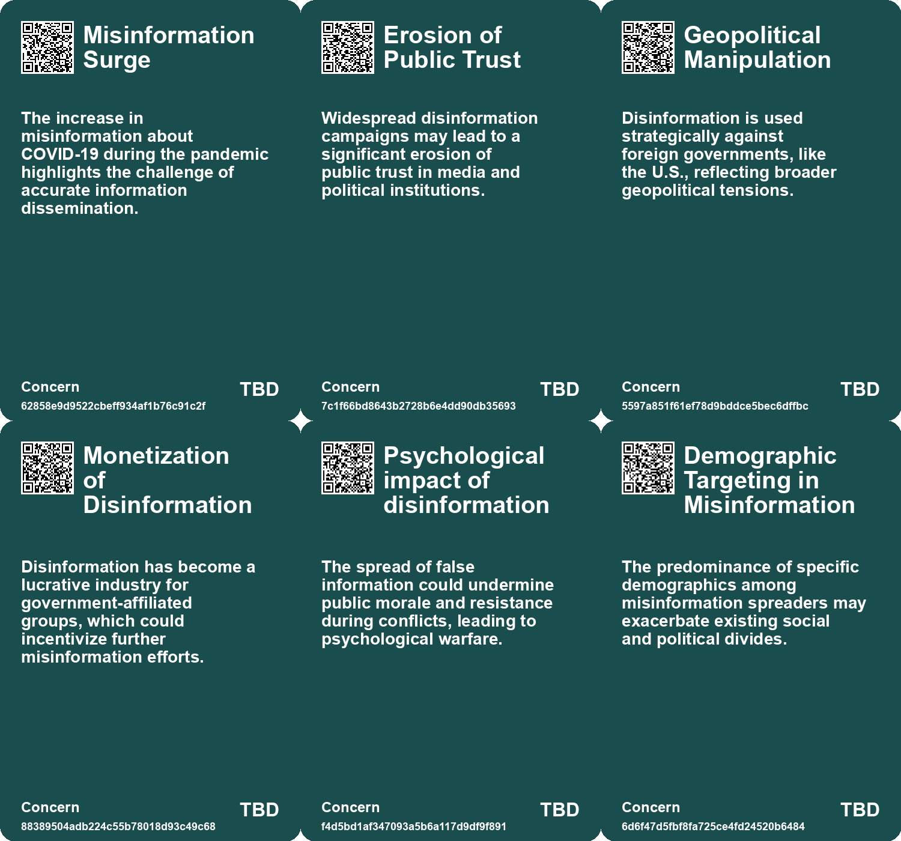
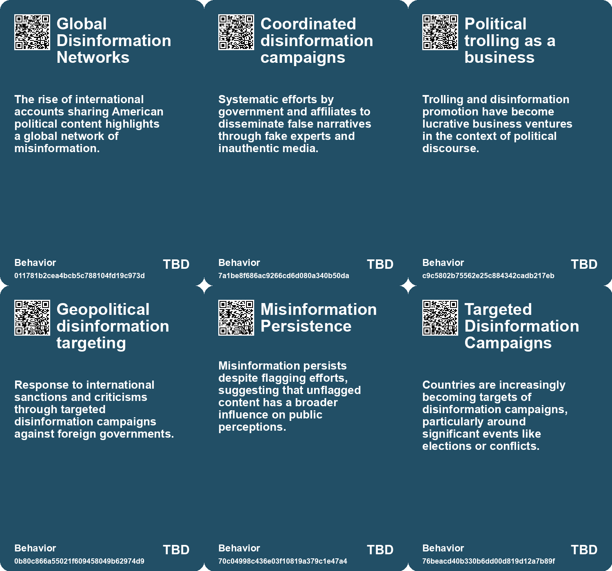
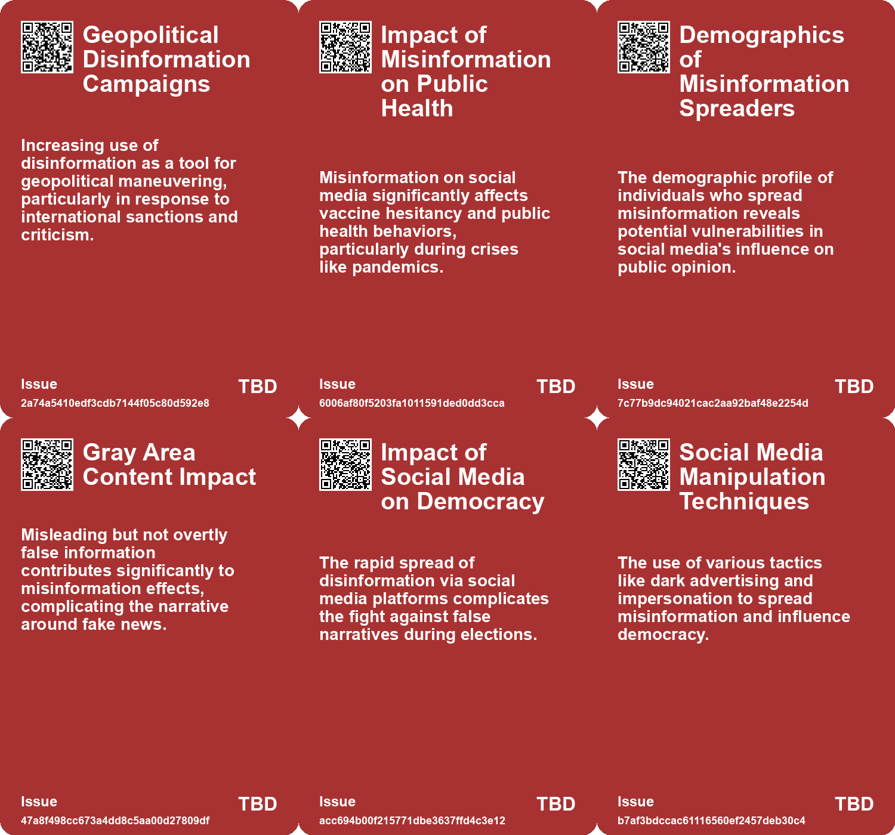
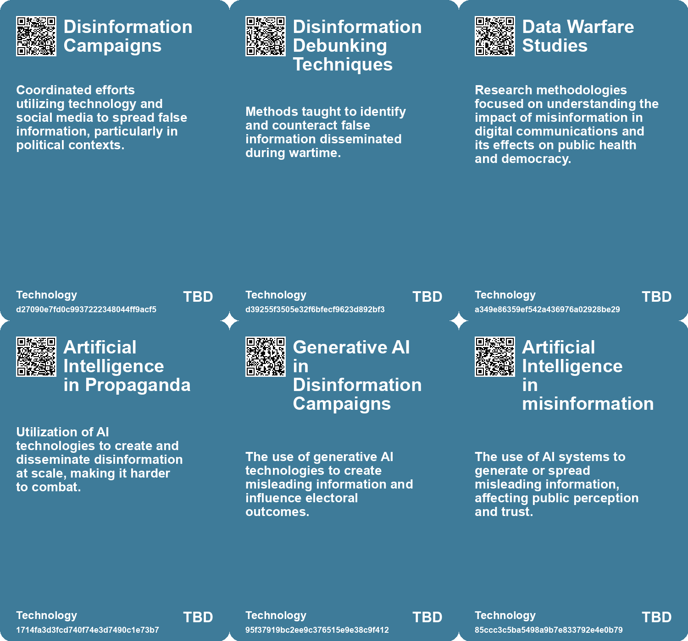

# *Topic*: Misinformation and Propaganda

# Summary

Misinformation continues to pose a significant threat to democracies worldwide, with various studies and reports highlighting its pervasive nature. Research published in the journal Science reveals that misinformation on social media can significantly reduce vaccination intent, particularly among older Republican women who are identified as key "supersharers" of false information. This trend is echoed in Bangladesh, where pro-government outlets utilize AI tools to create deepfake videos that spread disinformation against opposition parties. The government’s control over media and the use of disinformation as a political tool illustrate the intertwining of authoritarianism and misinformation.

In Finland, a proactive approach to combat misinformation is being implemented through educational reforms that integrate digital literacy and fact-checking into the school curriculum. This initiative aims to equip students with critical thinking skills necessary to navigate the complex media landscape. The success of this model suggests that similar strategies could be effective in other regions, including resource-poor settings.

The rise of synthetic media, including deepfakes, raises concerns about the authenticity of online content. A report from Europol warns that by 2026, a significant portion of online content could be artificially generated, creating new opportunities for misinformation. This is particularly relevant in the context of political campaigns, where AI-generated content can mislead voters, as seen with TikTok users being exposed to divisive and misleading videos.

Foreign influence operations remain a critical issue, with U.S. intelligence officials identifying Russia as the most active foreign power attempting to sway American politics. Reports indicate that Russian state-sponsored media employs AI tools to create fictitious personas for spreading disinformation. Meanwhile, Iranian state-backed hackers have utilized AI to conduct cyberattacks, demonstrating the evolving tactics of foreign adversaries in shaping public opinion.

Extremist groups are increasingly leveraging AI to disseminate propaganda and recruit members. Reports highlight the use of generative AI by neo-Nazis and other extremist factions to create harmful content at an unprecedented scale. This trend poses challenges for tech companies attempting to regulate online hate speech and misinformation.

The ethical implications of technology in warfare and politics are also under scrutiny. The Israeli Ministry of Defense's funding of research at MIT has sparked protests, raising questions about the role of academic institutions in military collaborations. Similarly, the Freedom Summit, which promoted anti-vaccine sentiments, reflects a growing distrust in modern medicine and the influence of alternative health philosophies.

Finally, the concept of "deep doubt" emerges as a response to the overwhelming presence of AI-generated content. This skepticism complicates the public's ability to discern truth from falsehood, leading to a broader crisis of trust in media. As misinformation continues to evolve, the need for effective countermeasures and public awareness becomes increasingly urgent.

# Seeds

|    | name                                   | description                                                                             | change                                                                                               | 10-year                                                                                                       | driving-force                                                                                           |
|---:|:---------------------------------------|:----------------------------------------------------------------------------------------|:-----------------------------------------------------------------------------------------------------|:--------------------------------------------------------------------------------------------------------------|:--------------------------------------------------------------------------------------------------------|
|  0 | Youth Involvement in Disinformation    | Young tech entrepreneurs are involved in promoting disinformation for income.           | Shift from youth engagement in positive tech initiatives to involvement in disinformation campaigns. | In 10 years, youth may see disinformation as a legitimate career path in tech.                                | The allure of quick financial gains from disinformation activities.                                     |
|  1 | Disinformation Concerns                | Growing concerns about disinformation driven by deepfake technology.                    | Shift from traditional disinformation tactics to sophisticated AI-generated misinformation.          | Information ecosystems will require new frameworks to combat and verify authenticity.                         | The ongoing battle against misinformation and the need for public awareness.                            |
|  2 | Rise of Supersharers                   | A small group of users, mainly older Republican women, dominate misinformation spread.  | Shift from widespread misinformation to concentrated misinformation sharing by a few individuals.    | Social media dynamics may shift, leading to stricter controls on influential users and content sharing.       | The need to control misinformation and its impact on public health and democracy.                       |
|  3 | AI and Disinformation                  | The rise of artificial intelligence is anticipated to accelerate disinformation spread. | From traditional disinformation methods to advanced AI-driven techniques for spreading falsehoods.   | AI may enable even more sophisticated and widespread disinformation campaigns.                                | Technological advancements in AI and social media are facilitating faster disinformation dissemination. |
|  4 | Exploitation of cognitive biases       | Groups exploit cognitive biases in humans to spread misinformation.                     | Shift from democratic discourse to manipulation through psychological tactics.                       | Democracy may struggle as misinformation becomes more sophisticated and widely accepted.                      | Increasing sophistication of technology and understanding of human psychology.                          |
|  5 | Misinformation Overload                | The rise of AI-generated content leads to an overwhelming volume of misinformation.     | Shift from occasional misinformation to a pervasive ocean of false information.                      | Society may struggle to discern truth in a landscape dominated by AI-generated misinformation.                | The ease of producing large volumes of content using AI tools encourages the spread of misinformation.  |
|  6 | AI as a Tool for Propaganda            | Nation-states leverage AI to create vast amounts of misleading content.                 | Shift from traditional misinformation to automated and sophisticated propaganda techniques.          | The landscape of information warfare may evolve, increasing the sophistication of misinformation campaigns.   | The strategic advantage gained from using AI to amplify propaganda efforts.                             |
|  7 | Adaptive Misinformation Tactics        | Misinformation tactics evolving to bypass social media safeguards and avoid detection.  | From blatant disinformation to more stealthy, blended approaches that mimic real users.              | In a decade, misinformation may become indistinguishable from authentic content, making regulation difficult. | The ongoing arms race between misinformation creators and platform regulators.                          |
|  8 | Rise of State-Sponsored Misinformation | Increased visibility and activity of state-sponsored disinformation campaigns.          | From sporadic and uncoordinated efforts to organized state-backed operations.                        | In 10 years, state-sponsored misinformation could become a norm in international relations.                   | The global geopolitical landscape and the role of information warfare in diplomacy.                     |
|  9 | Rise of Misinformation Awareness       | Increased awareness of misinformation spread through digital platforms.                 | Growing recognition of misinformation as a significant societal issue.                               | Stronger emphasis on digital literacy and critical evaluation of information sources.                         | The overwhelming volume of information available online necessitating discernment.                      |

# Concerns

|    | name                                    | description                                                                                                                              |
|---:|:----------------------------------------|:-----------------------------------------------------------------------------------------------------------------------------------------|
|  0 | Misinformation Surge                    | The increase in misinformation about COVID-19 during the pandemic highlights the challenge of accurate information dissemination.        |
|  1 | Erosion of Public Trust                 | Widespread disinformation campaigns may lead to a significant erosion of public trust in media and political institutions.               |
|  2 | Geopolitical Manipulation               | Disinformation is used strategically against foreign governments, like the U.S., reflecting broader geopolitical tensions.               |
|  3 | Monetization of Disinformation          | Disinformation has become a lucrative industry for government-affiliated groups, which could incentivize further misinformation efforts. |
|  4 | Psychological impact of disinformation  | The spread of false information could undermine public morale and resistance during conflicts, leading to psychological warfare.         |
|  5 | Demographic Targeting in Misinformation | The predominance of specific demographics among misinformation spreaders may exacerbate existing social and political divides.           |
|  6 | Manipulation via Information Warfare    | State-sponsored campaigns, particularly from Russia, aim to distort public opinion and undermine democracy through disinformation.       |
|  7 | Exploitation of Cognitive Biases        | Manipulation of psychological biases through disinformation can distort public perception and decision-making.                           |
|  8 | Proliferation of Misinformation         | The distribution of false information may lead to increased prejudices and societal division.                                            |
|  9 | Rise of Misinformation                  | The proliferation of fake news, conspiracy theories, and social media manipulation is eroding public trust and reality perception.       |

# Cards

## Concerns

## Behaviors

## Issue

## Technology

# Links

* [Addressing Threats to Democracy: Strategies for Resilience Against Misinformation and Manipulation](https://futures.kghosh.me/56d1a28746cd95ebaa3d62a4e1f91c3a)
* [U.S. DOJ Disrupts Russian Disinformation Network Using AI-Powered Bot Farm](https://futures.kghosh.me/1fbf07a918bb1e37ab2eb41365d6bbe2)
* [Finland's Innovative Approach to Combating Fake News Through Education](https://futures.kghosh.me/ad15fbe04bbe50ec3436c61403d19fca)
* [The Dual-edged Sword of AI: Misinformation and Societal Threats in the Age of Advanced Language Models](https://futures.kghosh.me/9787333cafcd0252d71a9bff845ad093)
* [Bangladesh's Disinformation Campaign: The Role of AI and Deep Fakes in Elections](https://futures.kghosh.me/299ee0a175c6ba617e28713566f23557)
* [FBI and International Partners Warn of Russian Disinformation Tool 'Meliorator'](https://futures.kghosh.me/b5e380f985e9f4ab5d96d4e7fa5d773d)
* [EU Study Reveals X (Twitter) Leads in Disinformation Among Social Media Platforms](https://futures.kghosh.me/5793d28b92e90a64b918cfaefad509db)
* [Meta's Content Moderation Overhaul: New Policies on Hate Speech and Fact-Checking](https://futures.kghosh.me/075e39f73c002ccb6f9dfdb851039870)
* [Google's Transition to Remote Work and the Evolution of Information Security](https://futures.kghosh.me/7a34820852cf03cbbdb1fb75ca3b629c)
* [The Impact of Supersharers on Vaccine Hesitancy and Fake News Spread on Social Media](https://futures.kghosh.me/091c0c86efbac50bd1354fbc72324198)
* [Exploring the Dangers of Manipulated Machine-Learning Models and Their Impacts on Society](https://futures.kghosh.me/4d1abdf7e702b559c6ccff847ce4d8d0)
* [The Freedom Summit: A Rallying Cry for Anti-Vaccine Sentiments and Medical Distrust](https://futures.kghosh.me/5bb4812db1abfd19da133a7139cbbac9)
* [Extremists in the US Exploit AI Tools for Hate Speech and Recruitment Efforts](https://futures.kghosh.me/922dd73d3cd60450863808b908f314d8)
* [Exploring the Rise of 'Deep Doubt' Amidst AI-Generated Media Content](https://futures.kghosh.me/97be17298986599d68a1642e4359d6d5)
* [Zohran Mamdani's Campaign: A Refreshing Approach to Politics Against Establishment Norms](https://futures.kghosh.me/9782d40f901a13851bd120672f254fc9)
* [Gaslighting: The Rise of a Term Reflecting Modern Deception and Misinformation](https://futures.kghosh.me/d4e40db973527ce595cc72255dc83220)
* [MIT's Controversial Ties to Israeli Military Funding and Student Protests](https://futures.kghosh.me/0d4171563ade773e41ab3c5949dccb52)
* [The Rising Threat of Generative AI in Extremist Propaganda and Child Exploitation](https://futures.kghosh.me/4aae935ffedd7227301fe1eb6647d69f)
* [Taiwan Prepares Citizens for Cyber Warfare Amid Chinese Threat](https://futures.kghosh.me/e99358609284de847f0d590948f5b265)
* [Understanding Polarization: Healing Our Relationship with Technology and Embracing Diverse Perspectives](https://futures.kghosh.me/c1bb890337ef382bfaa5720c9fd05134)
* [U.S. Intel: Russia Continues to Favor Trump in Election Influence Efforts](https://futures.kghosh.me/17319707c9c640b4b92b78f5fdfa61ae)
* [Iranian Hackers Use Deepfake Technology to Alter Media Narrative on Israel-Hamas Conflict](https://futures.kghosh.me/25f3ff23280cd27f74b3b60e9168d657)
* [Europol Report Warns of Rising AI-Generated Content and Disinformation Risks](https://futures.kghosh.me/8900fb75566c9d1b008c2e2c36f7a8e2)
* [OpenAI Discovers Abuse of Its AI Tools in Global Disinformation Campaigns by State Actors](https://futures.kghosh.me/038728d36aa4f09090b2d01ffe571ab4)
* [China's Disinformation Campaign in Taiwan Ahead of Presidential Elections](https://futures.kghosh.me/44ddf53ef211a729ca1a7fa394ac9f35)