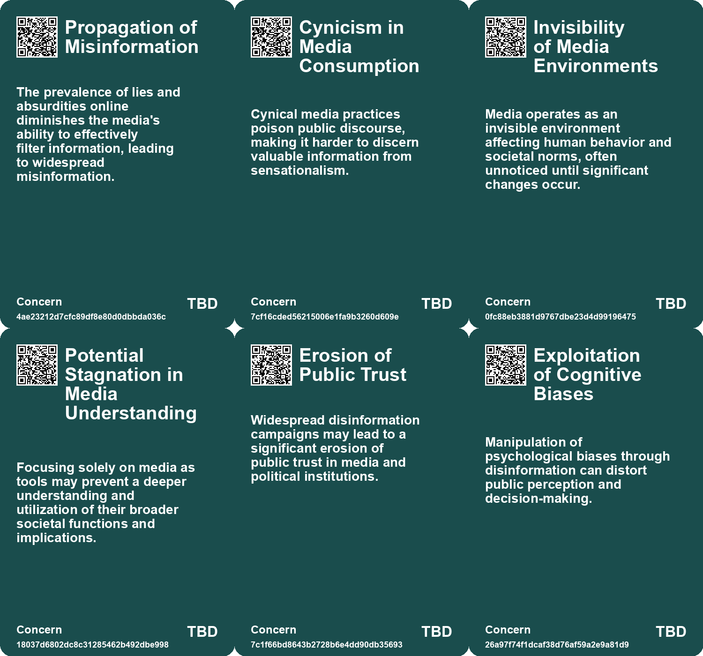
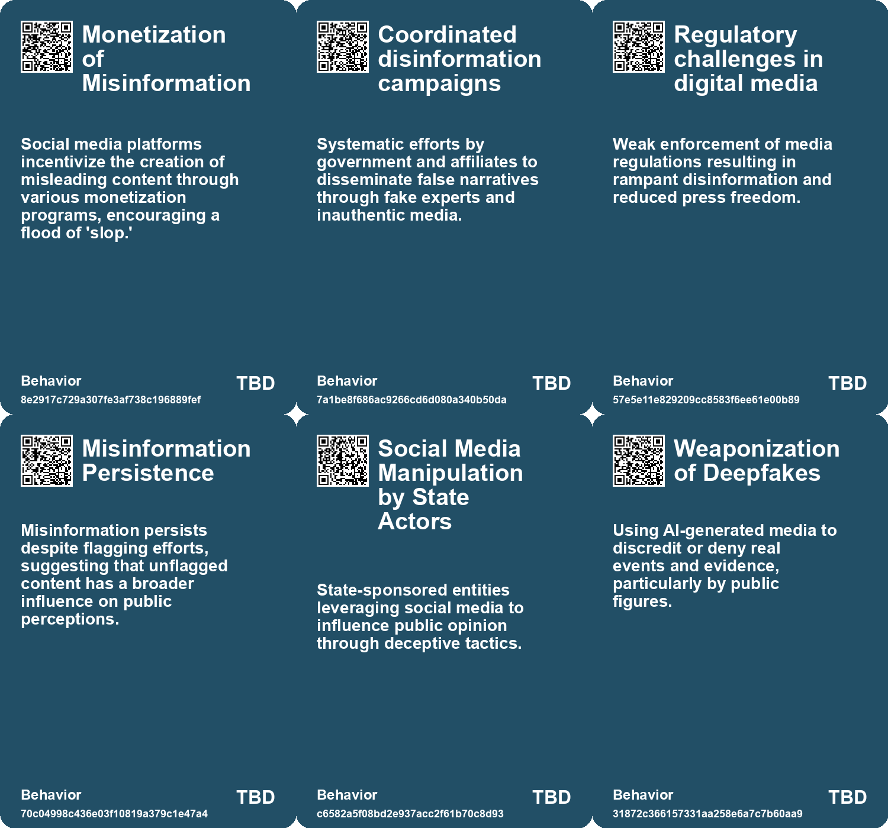
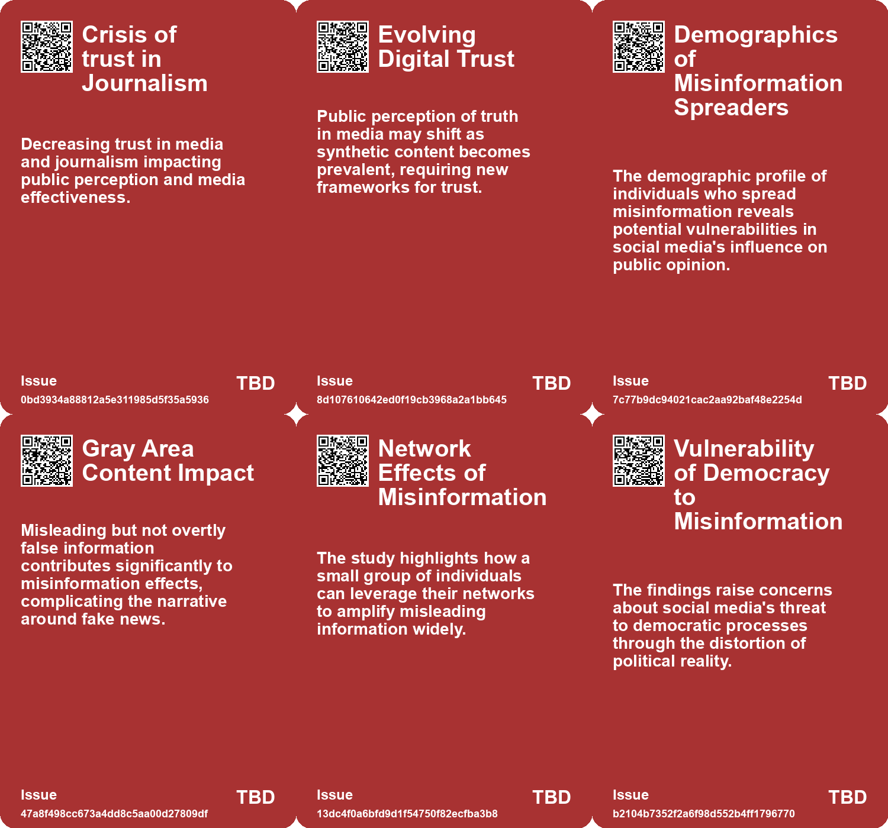
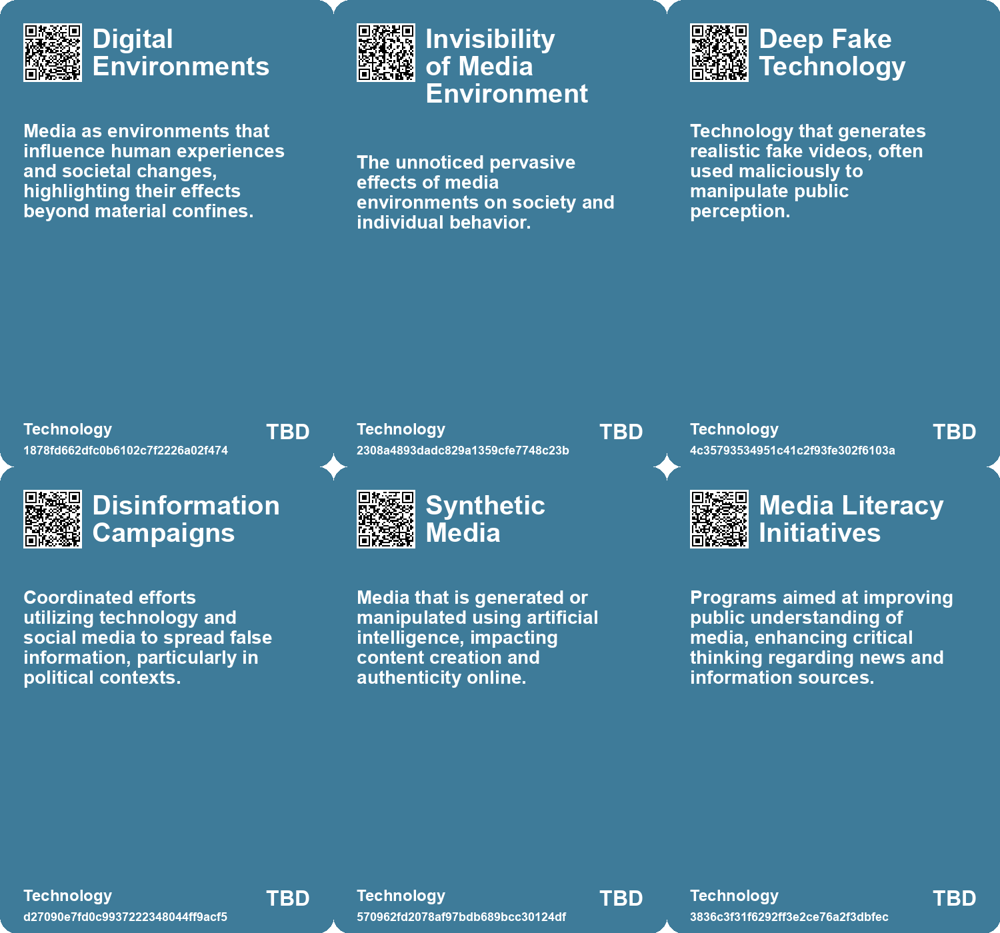

# *Topic*: Misrepresentation in Media

# Summary

The spread of misinformation remains a pressing concern, particularly in the context of social media. Studies reveal that a small group of "supersharers" significantly amplifies the reach of fake news, especially during critical events like elections. These individuals, often older and politically aligned, play a crucial role in shaping public perception and undermining trust in legitimate information sources. The rise of synthetic media, including deepfakes, further complicates this landscape, as it blurs the lines between reality and fabrication, leading to increased skepticism about the authenticity of digital content.

The phenomenon of "deep doubt" reflects a growing public wariness towards digital media, fueled by advancements in AI-generated imagery. This skepticism is not limited to social media; it extends to the broader media landscape, where the credibility of information is increasingly questioned. The concept of the "liar's dividend" illustrates how deceptive technologies can erode trust in genuine evidence, allowing misinformation to thrive.

In response to these challenges, some countries are taking proactive measures. Finland has integrated digital literacy and fact-checking into its school curriculum, aiming to equip students with the skills needed to navigate the complex media environment. This educational approach emphasizes critical thinking and encourages young people to become informed consumers of information. However, the effectiveness of such initiatives depends on adequate teacher training and support.

The role of technology companies in combating misinformation is under scrutiny. Meta's decision to halt political advertising in the EU highlights the tension between regulatory compliance and corporate interests. Critics argue that this move undermines transparency and accountability, raising concerns about the potential for unchecked misinformation on social media platforms. Similarly, a study by the European Commission found that X (formerly Twitter) has the highest proportion of disinformation among major social networks, prompting calls for stricter oversight.

The use of AI in disinformation campaigns is not limited to social media. Reports indicate that state-sponsored actors, such as those from Iran and Russia, are leveraging AI tools to create convincing fake content and manipulate public opinion. These tactics pose significant threats to democratic processes and public trust in media.

As the media landscape evolves, traditional media companies are adapting to the changing dynamics. The rise of brand publishing within investment banking illustrates a shift towards content creation as a means of enhancing corporate reputation. However, this trend raises questions about the authenticity of information and the potential for conflicts of interest.

The increasing prevalence of surveillance technology and the normalization of constant monitoring also raise critical privacy concerns. As cameras become ubiquitous, the volume of data generated necessitates the use of AI for analysis, yet this development outpaces the establishment of legal and ethical frameworks to protect individual privacy.

In this complex environment, the need for transparency, accountability, and media literacy is more urgent than ever. The interplay between technology, misinformation, and public perception underscores the challenges facing society as it navigates the digital age.

# Seeds

|    | name                                   | description                                                                                       | change                                                                                    | 10-year                                                                                                     | driving-force                                                                                                    |
|---:|:---------------------------------------|:--------------------------------------------------------------------------------------------------|:------------------------------------------------------------------------------------------|:------------------------------------------------------------------------------------------------------------|:-----------------------------------------------------------------------------------------------------------------|
|  0 | Potential for Increased Misinformation | Political voices not being amplified due to restrictions may lead misinformation spread.          | Greater spread of political misinformation unregulated by major platforms.                | Possibility of a fragmented political discourse without platform moderation or support.                     | The desire to avoid regulation may push companies to limit essential political communication.                    |
|  1 | Dynamic Media Environments             | Media are active processes that shape human experience and engagement.                            | Shift from passive consumption of media to active engagement in dynamic environments.     | In 10 years, media environments will heavily influence our social interactions and personal identities.     | The blending of technology with social behaviors drives engagement and transformation within media environments. |
|  2 | Invisibility of Media Effects          | Media environments often operate invisibly, influencing perceptions subtly.                       | Increased awareness of the hidden effects of media on society and individuals.            | In 10 years, people will develop better tools to understand and measure media's subtle influences.          | The need for digital literacy and critical thinking skills in an increasingly mediated world drives this change. |
|  3 | Trust in Digital Content Erosion       | Erosion of trust in online content as synthetic media becomes pervasive.                          | Shifting from trust in traditional media to skepticism towards digital content.           | Audiences will rely on verification tools and critical thinking to assess content authenticity.             | Increased awareness of misinformation and the capabilities of synthetic media.                                   |
|  4 | Deep Doubt Era                         | Increasing public skepticism towards the authenticity of media due to AI-generated content.       | Shift from trust in media to widespread skepticism about the authenticity of visuals.     | In 10 years, media consumption may prioritize transparency and verification tools over traditional sources. | The proliferation of advanced AI tools that enable easy creation of convincing fake media.                       |
|  5 | Liar's Dividend Recognition            | Recognition of the concept of 'liar's dividend' in public discourse regarding media authenticity. | From theoretical discussions to practical implications in everyday media consumption.     | Public and legal frameworks may develop robust methods to counteract the liar's dividend concept.           | Growing awareness of misinformation and the need for reliable information sources.                               |
|  6 | Deepfake Technology in Misinformation  | The use of deepfake technology to create deceptive news broadcasts.                               | Transition from traditional media manipulation to advanced AI-generated misinformation.   | Deepfake technology could become a standard tool in political and social manipulation campaigns.            | Advancements in AI and machine learning making deepfake creation accessible.                                     |
|  7 | Shift in Journalism Standards          | Major publications are prioritizing 'content' over traditional journalism ethics.                 | From quality journalism to clickbait-driven content creation.                             | Public trust in media may decline further, leading to alternative news sources emerging.                    | Audience engagement metrics increasingly dictate editorial decisions in media outlets.                           |
|  8 | Commercialization of Personal Image    | The rise of advertising led to the commodification of individual images without consent.          | From personal images being private to being used commercially without permission.         | In a decade, individuals may actively monetize their own likenesses in new ways.                            | The growth of influencer culture and digital branding changing how images are valued.                            |
|  9 | Crisis of Representation               | The exploitation of images sparked a crisis regarding representation and control.                 | From passive consumption of images to active discussions about representation and ethics. | In 10 years, representation in media may prioritize ethical considerations and consent.                     | Societal shifts toward equity and representation in media and advertising practices.                             |

# Concerns

|    | name                                         | description                                                                                                                                                 |
|---:|:---------------------------------------------|:------------------------------------------------------------------------------------------------------------------------------------------------------------|
|  0 | Invisibility of Media Environments           | Media operates as an invisible environment affecting human behavior and societal norms, often unnoticed until significant changes occur.                    |
|  1 | Potential Stagnation in Media Understanding  | Focusing solely on media as tools may prevent a deeper understanding and utilization of their broader societal functions and implications.                  |
|  2 | Erosion of Public Trust                      | Widespread disinformation campaigns may lead to a significant erosion of public trust in media and political institutions.                                  |
|  3 | Disinformation Proliferation                 | The rise of synthetic media could lead to widespread disinformation, making it hard to distinguish truth from falsehood.                                    |
|  4 | Media Literacy Challenges                    | Taiwan's struggle to counter disinformation highlights a potential gap in media literacy among the population, making them susceptible to false narratives. |
|  5 | Exploitation of Cognitive Biases             | Manipulation of psychological biases through disinformation can distort public perception and decision-making.                                              |
|  6 | Proliferation of Misinformation              | The distribution of false information may lead to increased prejudices and societal division.                                                               |
|  7 | Erosion of Trust in Media                    | The rise of AI-generated imagery leads to skepticism about the authenticity of all media, undermining trust in legitimate news and documentation.           |
|  8 | Misinformation and Bias in Financial Content | Increased brand publishing may lead to biased information that promotes the interests of banks over factual reporting.                                      |
|  9 | Erosion of Trust in Journalism               | Brand publishing initiatives could further blur the lines between journalism and marketing, undermining trust in traditional media.                         |

# Cards

## Concerns

## Behaviors

## Issue

## Technology

# Links

* [The Backlash Against Lina Khan: A Fight for Consumer Protection and Antitrust Reform](https://futures.kghosh.me/0e022693721e3552f32062f41e8c4f98)
* [The Evolving Role of Brand Publishing in Investment Banking and Media Landscape](https://futures.kghosh.me/02ee3cafff03f6aeedca8bd7ccac033a)
* [Meta Halts Political Ads in EU to Avoid New Transparency Regulations](https://futures.kghosh.me/014ce3100d6fcc7d160362d608f5c6fe)
* [The Dangers of Living Life as Entertainment in the Social Media Age](https://futures.kghosh.me/b5f05d364d78d7c80ea7e9d40e9831a2)
* [Finland's Innovative Approach to Combating Fake News Through Education](https://futures.kghosh.me/ad15fbe04bbe50ec3436c61403d19fca)
* [Bangladesh's Disinformation Campaign: The Role of AI and Deep Fakes in Elections](https://futures.kghosh.me/299ee0a175c6ba617e28713566f23557)
* [EU Study Reveals X (Twitter) Leads in Disinformation Among Social Media Platforms](https://futures.kghosh.me/5793d28b92e90a64b918cfaefad509db)
* [Understanding the Layers and Implications of Your Online Profile](https://futures.kghosh.me/f1d82c77bab293b0974aa46784ef1984)
* [The Risks of Media Companies Partnering with OpenAI and the Future of Journalism](https://futures.kghosh.me/8d5df588d3b5cdd4ed5409698923d765)
* [The Impact of Ubiquitous Surveillance Cameras on Society and Accountability](https://futures.kghosh.me/7790ecd5c227bae024a54ac5725ac978)
* [Exploring the Rise of 'Deep Doubt' Amidst AI-Generated Media Content](https://futures.kghosh.me/97be17298986599d68a1642e4359d6d5)
* [Exploring the Modern Entertainment Landscape and Its Societal Implications](https://futures.kghosh.me/c5c2c794f1426e6e307a9df3f9ff61f6)
* [Addressing Threats to Democracy: Strategies for Resilience Against Misinformation and Manipulation](https://futures.kghosh.me/56d1a28746cd95ebaa3d62a4e1f91c3a)
* [Europol Report Warns of Rising AI-Generated Content and Disinformation Risks](https://futures.kghosh.me/8900fb75566c9d1b008c2e2c36f7a8e2)
* [The Impact of Supersharers on Vaccine Hesitancy and Fake News Spread on Social Media](https://futures.kghosh.me/091c0c86efbac50bd1354fbc72324198)
* [Exploration de la Fatigue Informationnelle en France : Enquête et Impacts](https://futures.kghosh.me/ce346e8425de00a86fef1d4b7e1f9eaf)
* [The Impact of Kodak on Privacy Rights During the Gilded Age](https://futures.kghosh.me/87c5d006d2cedc1a29a15f278faab26d)
* [The Rise of Industrialized Sentiment Manipulation and the Need for Digital Identity Verification](https://futures.kghosh.me/344ece8d21b6241ead5160fe9a38742f)
* [Reimagining Media Companies: The Shift from Brands to Talent-Centric Models](https://futures.kghosh.me/be6ecdd999bc41789029c9d32a86c51b)
* [Pentagon's Purge of DEI Content Targets Thousands of Military Images and Posts](https://futures.kghosh.me/a12107fa34f6b87b9e3aa0d6a5c70501)
* [Understanding Media: The Impact of McLuhan's Insights on Technology and Human Experience](https://futures.kghosh.me/2393e91c693abbda88eab24cdd1c0a28)
* [China's Disinformation Campaign in Taiwan Ahead of Presidential Elections](https://futures.kghosh.me/44ddf53ef211a729ca1a7fa394ac9f35)
* [FBI and International Partners Warn of Russian Disinformation Tool 'Meliorator'](https://futures.kghosh.me/b5e380f985e9f4ab5d96d4e7fa5d773d)
* [Iranian Hackers Use Deepfake Technology to Alter Media Narrative on Israel-Hamas Conflict](https://futures.kghosh.me/25f3ff23280cd27f74b3b60e9168d657)
* [Meta's Content Moderation Overhaul: New Policies on Hate Speech and Fact-Checking](https://futures.kghosh.me/075e39f73c002ccb6f9dfdb851039870)