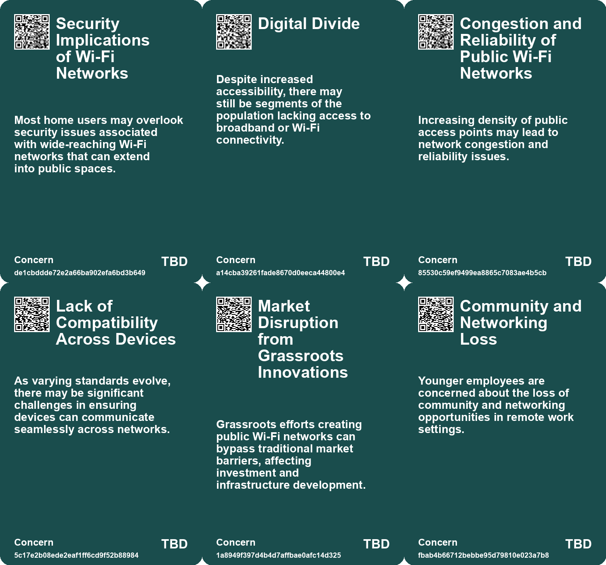
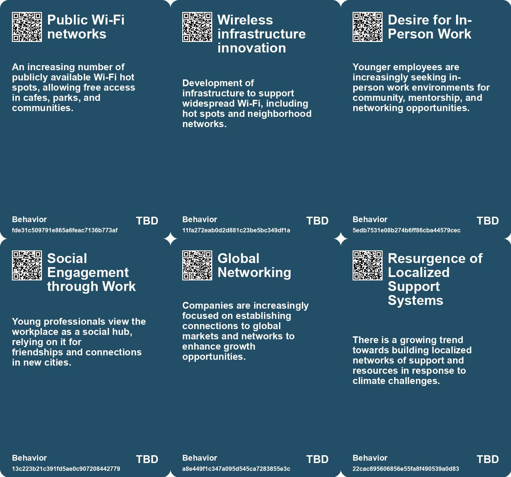
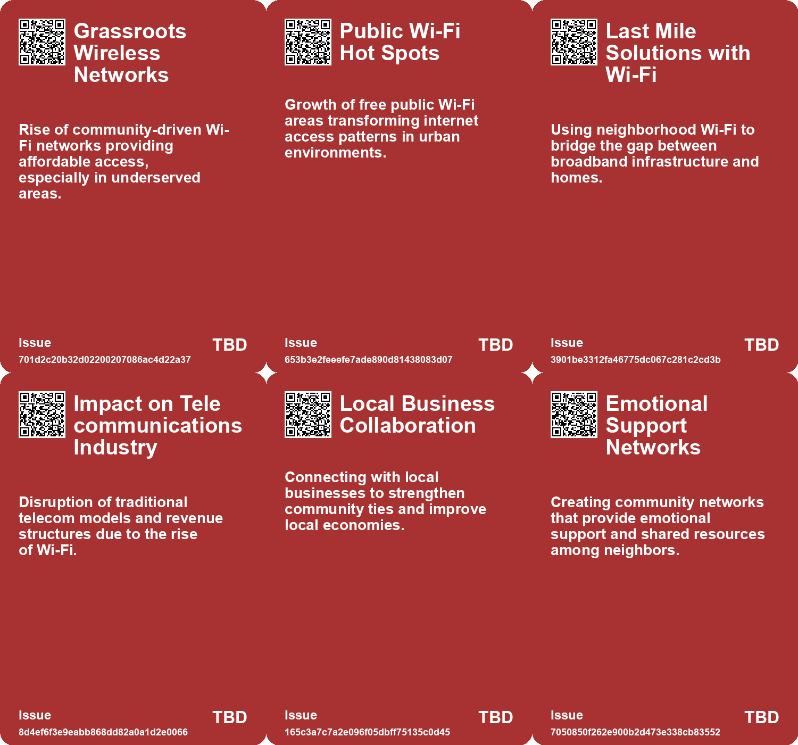
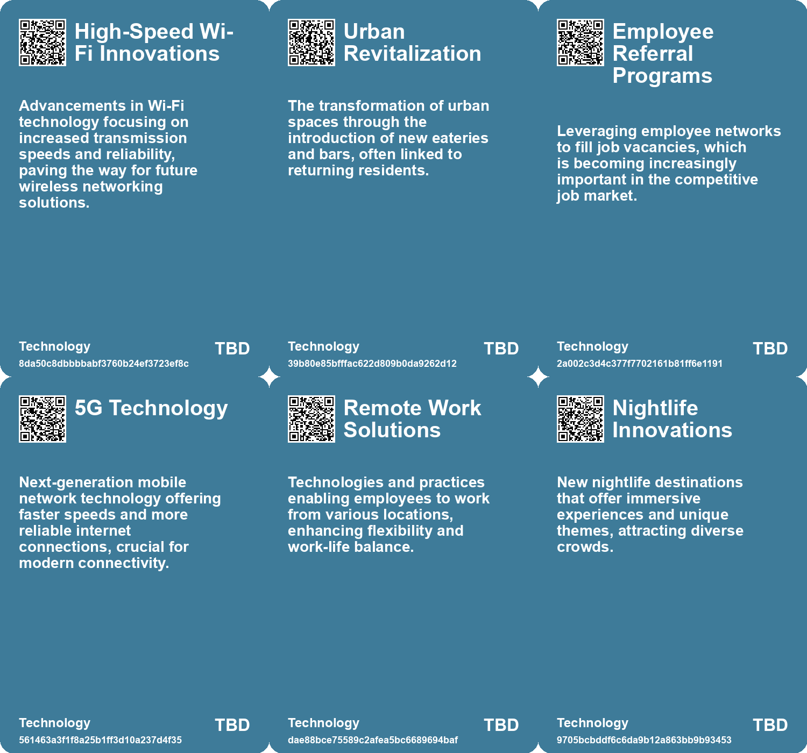

# *Topic*: Networking in New Locations

# Summary

The evolution of connectivity is a prominent theme, highlighted by the transformative impact of wireless Internet and Wi-Fi technology. This shift is reshaping how people communicate and access information, fostering grassroots movements that reduce reliance on traditional telecom companies. The future promises a more integrated use of Wi-Fi, potentially altering service models and enhancing competition in the wireless landscape.

The ongoing effects of the COVID-19 pandemic continue to influence work preferences, particularly among younger generations. Many young professionals express a strong desire for in-person office environments, valuing mentorship and social interaction. Companies face the challenge of accommodating diverse work preferences while navigating the complexities of remote, hybrid, and office-only models.

Concerns about national security are underscored by the risks associated with the collection and sale of location data by commercial data brokers. The exposure of sensitive military movements due to this data highlights vulnerabilities that could be exploited by adversaries. Calls for immediate legislative action emphasize the need to protect military personnel from surveillance threats.

The concept of public spaces is evolving, with libraries emerging as viable alternatives to coworking spaces like WeWork. Libraries are adapting to meet the needs of remote workers by offering amenities that foster community engagement. This shift reflects a broader trend of reimagining public spaces to enhance social interaction and collaboration.

Urbanization in China is accelerating, with plans to develop massive city clusters to accommodate a growing urban population. These clusters aim to enhance economic collaboration and address challenges related to overpopulation and pollution. The development of infrastructure, such as high-speed rail networks, is crucial to this strategy.

The impact of climate change is a pressing concern, with discussions focusing on the habitability of certain regions and the importance of community resilience. Building strong social ties is essential for adapting to climate-related challenges, as communities work together to navigate the complexities of a warming world.

Finally, the rise of geographic arbitrage reflects a growing trend among remote workers seeking to maximize savings by living in low-cost areas while earning income in stronger economies. This strategy emphasizes the importance of budgeting and financial planning, allowing individuals to achieve their financial goals while enjoying the benefits of remote work.

# Seeds

|    | name                                             | description                                                                                            | change                                                                                     | 10-year                                                                                                    | driving-force                                                                                           |
|---:|:-------------------------------------------------|:-------------------------------------------------------------------------------------------------------|:-------------------------------------------------------------------------------------------|:-----------------------------------------------------------------------------------------------------------|:--------------------------------------------------------------------------------------------------------|
|  0 | Public Wi-Fi Growth                              | Rise of open-access hotspots in public spaces, promoting community internet access.                    | Moves from private, subscription-based access to free public Wi-Fi networks.               | Widespread availability of free internet access in urban areas, empowering local communities.              | Need for connectivity in public spaces to enhance social and economic activities.                       |
|  1 | Revival of Neighborhood Gatherings               | Communities are increasingly reviving outdoor gatherings to foster connections among neighbors.        | From isolated individuals to more connected neighbors through intentional gatherings.      | Communities may prioritize social interaction and shared spaces as vital for social health.                | Growing awareness of isolation and the need for community support networks.                             |
|  2 | Hyperconnectivity Impacting Networking           | Hyperconnectivity is diminishing the quality of in-person networking experiences.                      | Moving away from meaningful connections to superficial online interactions.                | Networking events may prioritize digital engagement over personal connections, changing their nature.      | The desire to remain connected online during in-person events drives this change.                       |
|  3 | Local-Global Business Linkages                   | Communities are adapting to connect local businesses with global markets.                              | Shift from isolated local economies to integrated global networks.                         | In ten years, local economies may thrive through global partnerships and collaborations.                   | The need for local businesses to compete on a global scale drives this change.                          |
|  4 | Footloose Companies Attraction                   | Communities are working to attract companies that can easily relocate.                                 | Shift from stable, long-term businesses to attracting adaptable, global companies.         | In ten years, communities may prioritize flexibility and responsiveness in business attraction strategies. | Global mobility of companies necessitates communities to enhance their appeal and support.              |
|  5 | Demand for Higher Speed Internet                 | There is a growing demand for faster internet services in rural communities.                           | Shift from slow, unreliable internet options to high-speed fiber-optic connections.        | Rural areas will likely have access to high-speed internet comparable to urban centers.                    | Increased digital reliance for work, education, and entertainment drives demand for faster services.    |
|  6 | Flexibility in Job Hunting                       | Job hunting from afar has become normalized for many professionals.                                    | From in-person job searches to remote applications and interviews.                         | An increase in remote job opportunities available to a wider audience.                                     | The shift in workplace dynamics and increased remote job offerings.                                     |
|  7 | Expansion of Nightclubs and Entertainment Venues | New nightclubs are opening, revitalizing the nightlife scene with advanced technology and experiences. | Shifting from a dwindling nightlife scene to a resurgence of vibrant club culture.         | Nightlife will likely feature diverse venues with immersive experiences, attracting varied audiences.      | Demand for enhanced entertainment options and social experiences drives this trend.                     |
|  8 | Increased Security Concerns                      | Growing awareness of security and privacy risks in location-based services.                            | Shift from passive data collection to active measures for user opt-out options.            | Stricter regulations and user controls over data collection practices by tech companies.                   | Rising public concern over privacy violations and data misuse.                                          |
|  9 | Libraries as Coworking Spaces                    | Public libraries are evolving to serve as coworking hubs for remote workers and entrepreneurs.         | Shift from traditional library use to multifunctional coworking spaces and community hubs. | In 10 years, libraries may be primary spots for remote work and community engagement.                      | The increasing need for social connection and dedicated workspaces in a digital age drives this change. |

# Concerns

|    | name                                                | description                                                                                                                                    |
|---:|:----------------------------------------------------|:-----------------------------------------------------------------------------------------------------------------------------------------------|
|  0 | Security Implications of Wi-Fi Networks             | Most home users may overlook security issues associated with wide-reaching Wi-Fi networks that can extend into public spaces.                  |
|  1 | Digital Divide                                      | Despite increased accessibility, there may still be segments of the population lacking access to broadband or Wi-Fi connectivity.              |
|  2 | Congestion and Reliability of Public Wi-Fi Networks | Increasing density of public access points may lead to network congestion and reliability issues.                                              |
|  3 | Lack of Compatibility Across Devices                | As varying standards evolve, there may be significant challenges in ensuring devices can communicate seamlessly across networks.               |
|  4 | Market Disruption from Grassroots Innovations       | Grassroots efforts creating public Wi-Fi networks can bypass traditional market barriers, affecting investment and infrastructure development. |
|  5 | Community and Networking Loss                       | Younger employees are concerned about the loss of community and networking opportunities in remote work settings.                              |
|  6 | Dependence on Remote Work                           | The growth of geographic arbitrage increases reliance on remote work, which could be threatened by future policy changes or economic shifts.   |
|  7 | Job Market Volatility                               | Changes in employment policies regarding remote work may lead to instability for those who relocate for geographic arbitrage.                  |
|  8 | Need for Innovative Community Engagement            | Companies must explore innovative ways to foster community interactions and mitigate social isolation.                                         |
|  9 | Resource Limitations in Smaller Libraries           | Smaller libraries may struggle to accommodate an influx of remote workers due to limited space and resources.                                  |

# Cards

## Concerns

## Behaviors

## Issue

## Technology

# Links

* [Public Libraries Transforming into Coworking Spaces: Opportunities and Challenges Ahead](https://futures.kghosh.me/a5f42abeedcb79c5dbe8edfd4c3c03f4)
* [US Military Personnel's Movements Tracked, Raising National Security Concerns Over Data Brokers](https://futures.kghosh.me/7e7794e0d6f2756a70bafbdabb8f6767)
* [Apple and Starlink Respond to Geo-Location Privacy Concerns Raised by Research](https://futures.kghosh.me/9aeb3f6e38d687e4c1a4d696c31e54df)
* [Oma's Soep Launches Campaign to Combat Loneliness Through Grocery Store Interactions](https://futures.kghosh.me/d73cef2dc5d458ba6b4a61dff2997181)
* [Blank Street: Revolutionizing Coffee with Zero-Emission Carts and Affordable Prices in NYC](https://futures.kghosh.me/ad6334d8203e40ef0376165b2141e1d3)
* [Navigating Climate Change: The Need for Community Resilience and Social Trust](https://futures.kghosh.me/efa36dc9bd5ddc890866d4ab1e68e71f)
* [Jared Mauch's Success Story: Building a Rural FTTH ISP in Michigan](https://futures.kghosh.me/e6d593fc438de6602ae1dd4b5d404a05)
* [The Generational Divide in Work Preferences: Young Professionals Favor In-Office Jobs](https://futures.kghosh.me/5a10c88b2c7660dac07161b1f5089e57)
* [The Impact of Urban Design on Public Space Usage and Social Interaction](https://futures.kghosh.me/2f31d87f3801765f9645d092cadf513a)
* [The Decline of Third Places: Starbucks and the Erosion of Community Spaces](https://futures.kghosh.me/bc30310a2035fed3836262f834b92b9b)
* [Innovative Approaches to Public Space Transformation in U.S. Cities](https://futures.kghosh.me/465b809f2a993c634a1a239ca0cab476)
* [Rediscovering the Internet: Exploring Alternative Paths and Local Connections in Digital Spaces](https://futures.kghosh.me/6f8a5d927973f7315eafe2e8f7207e36)
* [The Impact of Continuous Partial Attention on Networking and Relationships in a Digital World](https://futures.kghosh.me/417df5448432cb603f40dec77f469b87)
* [The Revolutionary Impact of Wi-Fi Technology on Connectivity and Internet Access](https://futures.kghosh.me/b90f02b70000e48fa3273106b49d4452)
* [Exploring the Top Urban Trends for 2024: A Global Perspective from Time Out Editors](https://futures.kghosh.me/e326bf8ab0b424d515d0691f5eac1fd7)
* [Rethinking Public Space Design: Beyond Moveable Chairs](https://futures.kghosh.me/8c75c19d84e0d4aa8e1d1ea0420313a0)
* [Connecting Local Economies to Global Markets: Insights from Rosabeth Moss Kanter's Analysis](https://futures.kghosh.me/b0f9303688b3f36feafd21625c5d3461)
* [China's Urbanization Strategy: Building Sustainable City Clusters for 100 Million Inhabitants](https://futures.kghosh.me/36cc4bee50644b6ef53de008db24e0c4)
* [Challenges and Opportunities in the 2023 Cybersecurity Job Market: Insights and Strategies](https://futures.kghosh.me/0ab36af538bf262c85b73fa7e7bd657f)
* [U.S. and Allies Plan to Secure Submarine Cables, Excluding Chinese Technology](https://futures.kghosh.me/e80ec4d55a8fd9bddb711309f9cc1d25)
* [China's Urban Future: The Rise of City Clusters and Sustainable Development Strategies](https://futures.kghosh.me/2c6411450b93e8449beffcb00e58b39b)
* [Exploring the Homogenization of Urban Culture Through Coffee Shops and Bars Across America](https://futures.kghosh.me/4ab5b0cd09e7bc298ec4ac68816ae6b4)
* [Cybersecurity Incident Suspends Wifi at Multiple UK Train Stations Following Islamophobic Attack](https://futures.kghosh.me/969a8ca8682b0bd8599031797b56337f)
* [Google's Transition to Remote Work and the Evolution of Information Security](https://futures.kghosh.me/7a34820852cf03cbbdb1fb75ca3b629c)
* [Navigating the Climate Crisis: The Importance of Community and Social Trust in Adapting to Change](https://futures.kghosh.me/d1e5dc8cd0f7c34dede43f5429dded3d)
* [Transforming a San Francisco Neighborhood Through Simple Community Engagement Traditions](https://futures.kghosh.me/9caf76914f8aba33fd9d01d7be823a97)
* [Understanding Geographic Arbitrage: A Guide to Smart Relocation and Savings](https://futures.kghosh.me/1bebd9c22d66a412bc9dc0ff5b4b562e)