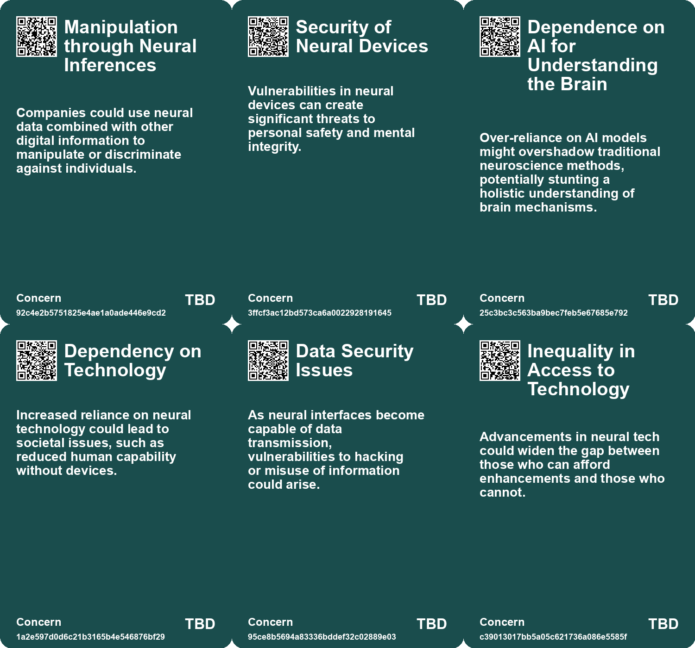
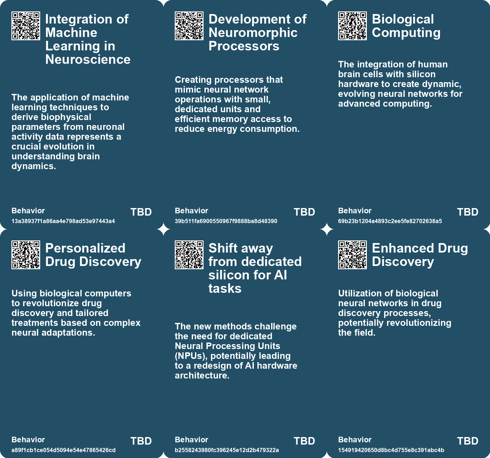
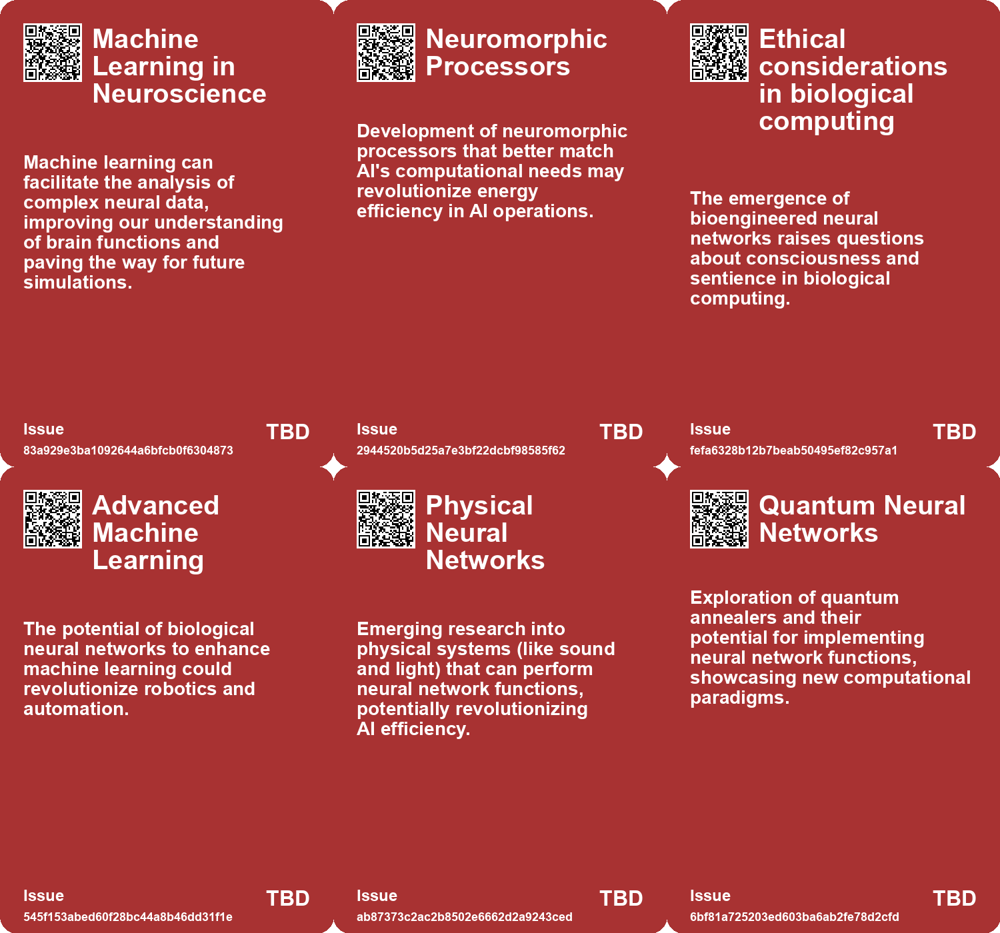
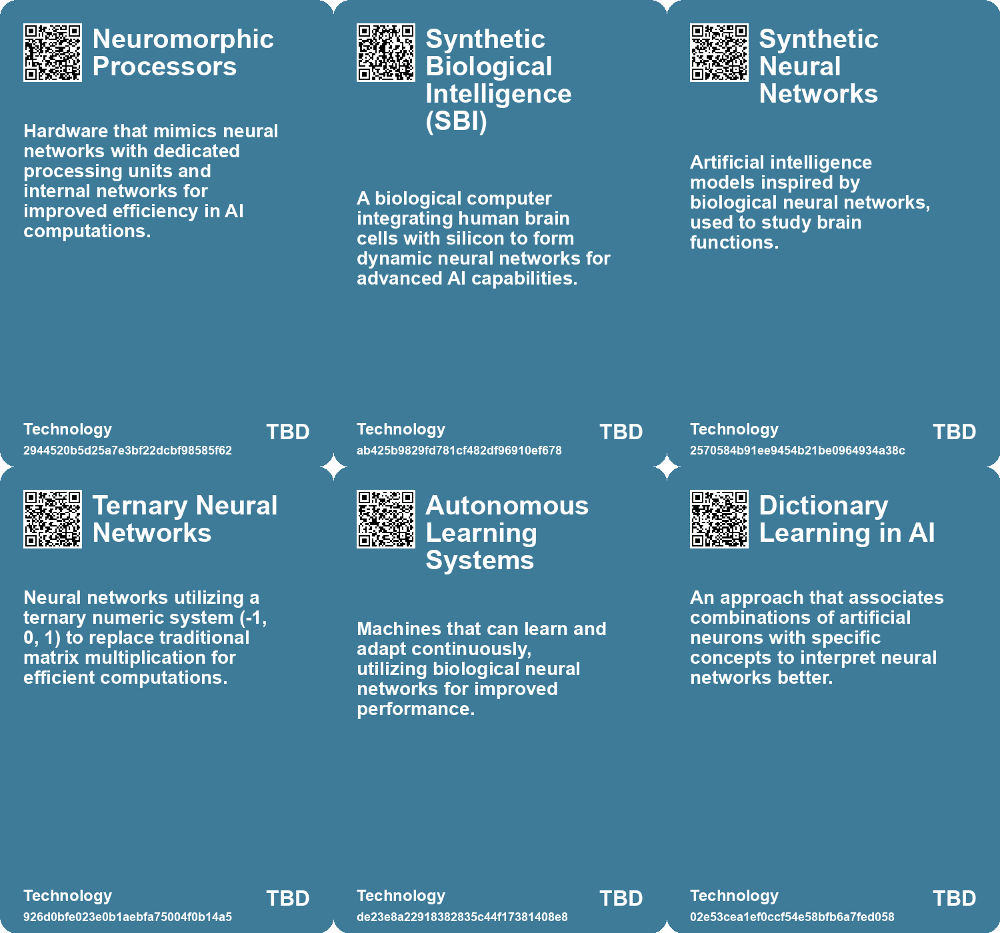

# *Topic*: Neural Networks

# Summary

The intersection of artificial intelligence and neuroscience is rapidly evolving, with significant advancements in understanding and enhancing human cognition. Researchers are leveraging AI models to decode brain activity, revealing insights into how the brain processes language. This approach has the potential to aid individuals who have lost the ability to communicate, showcasing AI's role in bridging gaps in human capabilities.

Biological computing is emerging as a transformative field, with innovations like the CL1 biological computer and the DishBrain chip, which integrates human brain cells with silicon technology. These systems demonstrate the potential for synthetic biological intelligence to revolutionize AI, offering energy-efficient alternatives to traditional computing. The DishBrain's ability to learn and play games highlights the possibilities of merging biological systems with machine learning.

Neurotechnology is advancing with brain-computer interfaces (BCIs) that translate brain activity into actionable outputs. Innovations such as dual-implant BCIs and wireless neural dust sensors are paving the way for improved prosthetics and treatments for neurological disorders. These technologies raise ethical concerns about privacy and cognitive liberty, prompting calls for regulation as they move closer to clinical applications.

The concept of neurodiversity in the workplace is gaining traction, emphasizing the value of diverse cognitive strategies in enhancing AI systems. Organizations that embrace neurodivergent individuals may find a competitive edge, as human creativity and unique problem-solving abilities complement the linear reasoning of AI.

AI's role in design and engineering is also noteworthy. Autodesk's neural CAD foundation models are set to transform digital design by allowing architects and engineers to create detailed models from simple sketches. This innovation could significantly enhance productivity in electronics design, particularly for complex wireless chips essential for 5G technology.

Concerns about the ethical implications of AI are prevalent, particularly regarding the biases inherent in large language models. Researchers are working to improve the interpretability of these models, aiming to enhance safety and reliability. The potential for AI to manipulate information raises alarms about the risks associated with its deployment in various sectors.

Finally, the future of work is being reshaped by AI, with a shift towards a more collaborative and innovative economy. The integration of AI into organizational structures is prompting a reevaluation of traditional hierarchies, allowing individuals to operate with greater autonomy and creativity. This evolution signifies a move towards a reciprocal economy where personal contributions are valued, fostering a culture of innovation and collaboration.

# Seeds

|    | name                                        | description                                                                                                  | change                                                                                                    | 10-year                                                                                                      | driving-force                                                                                                 |
|---:|:--------------------------------------------|:-------------------------------------------------------------------------------------------------------------|:----------------------------------------------------------------------------------------------------------|:-------------------------------------------------------------------------------------------------------------|:--------------------------------------------------------------------------------------------------------------|
|  0 | Increased Interest in Whole Brain Emulation | Growing efforts and interest in mapping and simulating entire neural systems, particularly simple organisms. | Shifting focus from unrealistic large-scale human simulations to feasible smaller brain projects.         | In a decade, this could lead to successful models of larger brains or new therapies for brain disorders.     | The scientific community's commitment to understanding brain function enhances research momentum.             |
|  1 | Growing Use of Machine Learning             | Machine learning techniques like symbolic regression increasingly assist in analyzing neuronal data.         | From manual data analysis to automated, precise methods in extracting neuronal connectivity.              | By 2035, machine learning could significantly accelerate our understanding of brain functions and disorders. | The intersection of neuroscience and artificial intelligence fuels breakthroughs in brain research.           |
|  2 | Neuromorphic Processor Advancements         | Development of neuromorphic processors tailored for neural network needs.                                    | Shift from traditional silicon processors to neuromorphic designs focusing on efficiency and performance. | In 10 years, neuromorphic processors might dominate AI hardware, significantly reducing energy consumption.  | The increasing energy demands of AI technologies drive innovation towards more efficient computing solutions. |
|  3 | Minimal Viable Brain Concept                | Research aimed at creating a simplified, functional brain model using biological neurons.                    | From complex traditional models to streamlined biological systems for intelligence research.              | Possibility of establishing more controllable and profound insights into neural functions and intelligence.  | Necessity to deepen understanding of brain functionality and its applications in AI and medicine.             |
|  4 | AI as Brain Study Tool                      | AI is being recognized as a valuable tool for studying neurological processes.                               | Transition from viewing AI as a metaphor to a practical model for brain research.                         | AI will play a central role in brain research, offering precise models of brain functions.                   | The need for improved methods to understand the complexities of human cognition.                              |
|  5 | New computational methods in AI             | Introduction of ternary systems and time-based computation changes how neural networks operate.              | From traditional multiplication methods to summing and time-based operations for AI models.               | Neural networks could be fundamentally restructured, leading to faster and more efficient AI capabilities.   | The continuous quest for improving AI performance while reducing resource use.                                |
|  6 | Mechanistic Interpretability in AI          | Efforts to reverse engineer neural networks to understand their outputs are gaining traction.                | Transitioning from ignorance to knowledge about how AI models generate specific outputs.                  | In a decade, AI models may be designed with built-in interpretability features for users.                    | The urgency to mitigate AI risks and biases motivates the push for mechanistic interpretability.              |
|  7 | AI Models as Cultural Mirrors               | AI models reflect cultural and societal concepts through their neural patterns.                              | Shifting from neutral data processing to AI reflecting societal values and biases.                        | In ten years, AI could actively promote positive cultural values and mitigate harmful biases.                | The awareness of AI's impact on society drives efforts to align AI with ethical standards.                    |
|  8 | Equilibrium Propagation                     | A new learning algorithm inspired by brain function, diverging from traditional backpropagation.             | Shift from conventional backpropagation to more brain-like learning methods.                              | Learning algorithms may evolve to resemble biological processes, enhancing AI capabilities.                  | Understanding brain functions motivates the development of more efficient learning techniques.                |
|  9 | Analog versus Digital Computing             | A growing belief that analog systems may surpass digital neural networks in processing capabilities.         | Potential shift in preference from digital to analog computing in AI development.                         | Analog systems could dominate the AI landscape, changing how we approach computing tasks.                    | The limitations of digital computation push researchers to explore analog alternatives.                       |

# Concerns

|    | name                                         | description                                                                                                                                            |
|---:|:---------------------------------------------|:-------------------------------------------------------------------------------------------------------------------------------------------------------|
|  0 | Manipulation through Neural Inferences       | Companies could use neural data combined with other digital information to manipulate or discriminate against individuals.                             |
|  1 | Security of Neural Devices                   | Vulnerabilities in neural devices can create significant threats to personal safety and mental integrity.                                              |
|  2 | Dependence on AI for Understanding the Brain | Over-reliance on AI models might overshadow traditional neuroscience methods, potentially stunting a holistic understanding of brain mechanisms.       |
|  3 | Dependency on Technology                     | Increased reliance on neural technology could lead to societal issues, such as reduced human capability without devices.                               |
|  4 | Data Security Issues                         | As neural interfaces become capable of data transmission, vulnerabilities to hacking or misuse of information could arise.                             |
|  5 | Inequality in Access to Technology           | Advancements in neural tech could widen the gap between those who can afford enhancements and those who cannot.                                        |
|  6 | Regulatory and Compliance Challenges         | The rapid development of neural technologies may outpace regulatory frameworks, leading to safety and efficacy concerns.                               |
|  7 | Dependency on Biological Computing           | Over-reliance on biological neural networks may pose risks if their functioning becomes compromised or uncontrollable.                                 |
|  8 | Error-prone Neural Networks                  | Despite advancements, neural networks may continue to yield significant errors, hindering their practical applications and safety in critical systems. |
|  9 | Computational Limits of Digital Systems      | As digital neural networks scale, they may become bogged down by excessive computations, risking obsolescence in comparison to analog systems.         |

# Cards

## Concerns

## Behaviors

## Issue

## Technology

# Links

* [Revolutionary Method Induces Learning by Directly Manipulating Brain Activity Patterns](https://futures.kghosh.me/608d74fa38b4490086705a9cef803a77)
* [AI Models Show Improved Performance in Theory of Mind Tests Compared to Humans](https://futures.kghosh.me/25cdc8c55ebb70b51b85134dc01e6efd)
* [Advancements in Ultrasonic Neural Dust Sensors for Real-Time Monitoring of Muscle and Nerve Activity](https://futures.kghosh.me/feadfd4aa3133e938a6f6e6d7d2c018e)
* [The Importance of Neurodiversity in the Evolving AI Workplace](https://futures.kghosh.me/8b9448d5e3ccb80914537d5e55424109)
* [Breakthrough in Biocomputing: Brainoware Combines AI with Human Brain Cells for Speech Recognition](https://futures.kghosh.me/fe93f7419799d1706b4e7ce0a6adcb40)
* [Adapting Organizational Structures to Embrace AI: Lessons from History and Future Directions](https://futures.kghosh.me/fd0f3b7a6783ba6a0fcd3a18c8241be5)
* [Innovative Advances in Neuromorphic Computing: Mimicking Neurons with Silicon Transistors](https://futures.kghosh.me/ed30d911e08e5dabc7996a90ed807274)
* [Thriving in an AI Era: Embracing, Adapting, and Complementing Technology](https://futures.kghosh.me/23a3410059759ba4214235628d4ebd4b)
* [AI Revolutionizes Wireless Chip Design: Faster, More Efficient, but Not Without Human Oversight](https://futures.kghosh.me/d9e8827672dc442e755c2bc8a0dc7e7d)
* [Anthropic Reveals New Insights into Large Language Models' Decision-Making Processes](https://futures.kghosh.me/c3a84557d73ca7b1e84a58166d7c3d51)
* [The Security Risks of Rapid AI Integration: A Call for Caution and Awareness](https://futures.kghosh.me/b30a4282af9e53ca673438a8223d9525)
* [Understanding the Inner Workings of Large Language Models: Anthropic's Groundbreaking Research](https://futures.kghosh.me/1ce486630ba069397f7aa5a574d83845)
* [UNSW Engineers Develop 'Optrodes' to Measure Neural Activity Using Light for Advanced Prosthetics](https://futures.kghosh.me/7aeb03c0771769ceb99c3085c141c1fe)
* [AI Enhances U.S. Cybersecurity Against Chinese Hacking Threats to Critical Infrastructure](https://futures.kghosh.me/cea16dfec561c12861cfadf0455880f1)
* [The Future of Brain-Computer Interfaces: Promise and Ethical Concerns](https://futures.kghosh.me/c6702f63f03fb731d83c81e00768b28d)
* [Monash University Develops DishBrain: A Semi-Biological Chip with Learning Capabilities](https://futures.kghosh.me/fcf584bddde6a0c4ccaf5ab8eadded1e)
* [Reimagining Work and Economy in an AI-Driven Future: A New Era of Individual Creativity](https://futures.kghosh.me/a839236b3565b219ecc8d9622d55dc55)
* [Exploring the Intelligence of Ecosystems and Biological Computing in Pond Brains](https://futures.kghosh.me/607bce5ceffd29c4ba8997068ebde091)
* [Autodesk Unveils Neural CAD Models to Transform Digital Design and Manufacturing](https://futures.kghosh.me/9893a49f51b6a7a21fee0c53a9bbaf67)
* [Understanding Neurosecurity: Protection for Neural Devices and User Behavior](https://futures.kghosh.me/70be08bc846223ea4b986fd5f9a69bcf)
* [Breakthrough in AI Efficiency: Running LLMs on Just 13 Watts by Eliminating Matrix Multiplication](https://futures.kghosh.me/4a9a8581c9a752497d69047d62378dea)
* [Cortical Labs Launches World's First Biological Computer: The CL1](https://futures.kghosh.me/c3e6ac3d2c8dcccbff885b74128c5536)
* [The Challenges and Advances in Simulating the C. elegans Brain Over 25 Years](https://futures.kghosh.me/32e91a01ba181534d1578186bfcc240a)
* [Advancements in Brain-Computer Interfaces: Exploring Non-Invasive Ultrasound Technology](https://futures.kghosh.me/32310a2097cecfb2b52a21a7c16fa9e8)
* [Recent Developments in AI Regulation and Technology: A Review of Key Initiatives and Critiques](https://futures.kghosh.me/a009ccdffaa59f53de56887aa19e6239)
* [AI's Role in Understanding the Human Brain: Breakthroughs in Language Processing](https://futures.kghosh.me/e43c70d1c8c34f4587722ef456132b41)
* [Exploring the Future of Neural Networks through Sound and Physical Systems](https://futures.kghosh.me/92fd13cc9ae2e437ede8175d350860ef)