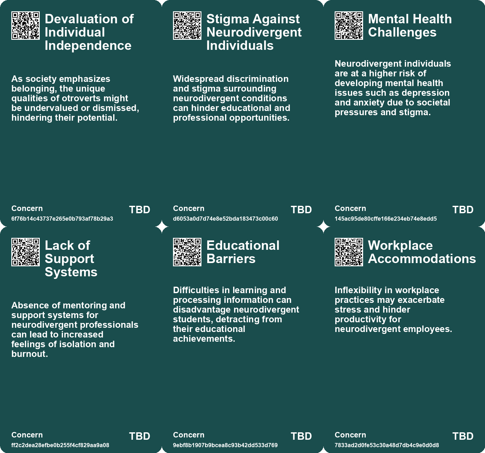
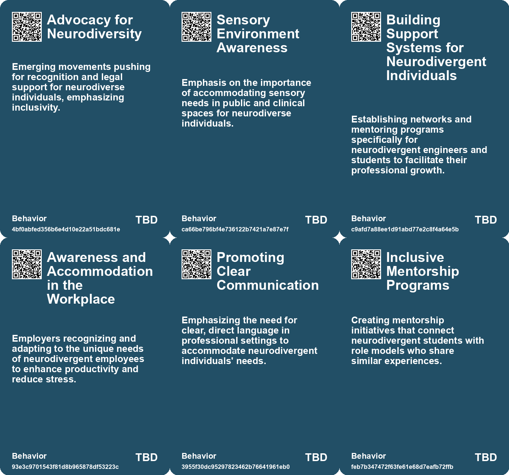
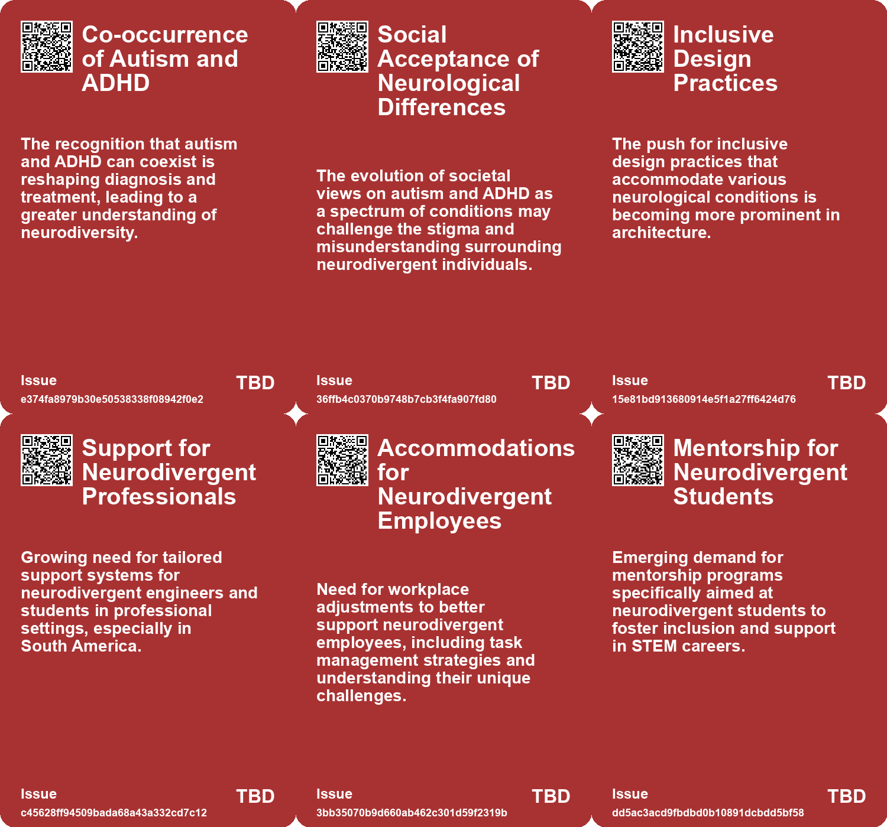
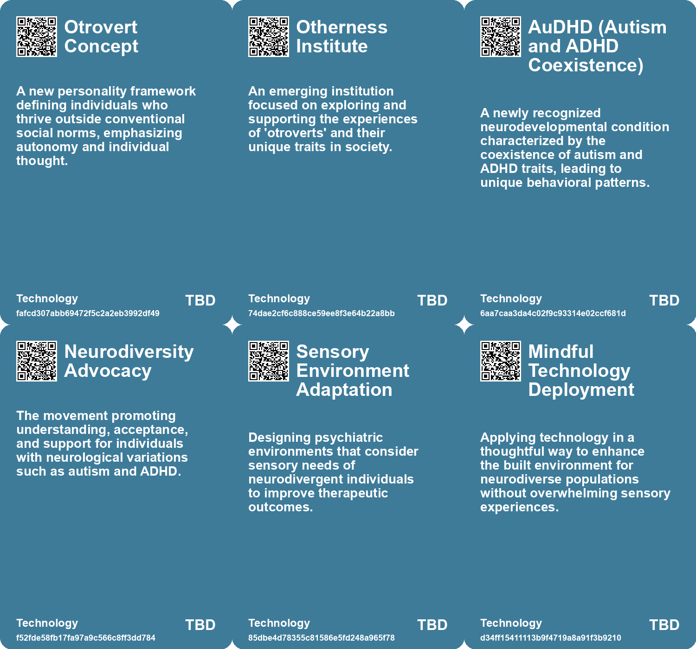

# *Topic*: Neurodivergent Expression & Inclusion

# Summary

The intersection of neurodiversity and technology is a prominent theme, highlighting the potential benefits of including neurodivergent individuals in various fields, particularly in artificial intelligence. Organizations that embrace neurodiversity may find themselves at a competitive advantage, as unique cognitive strategies can complement AI's linear reasoning. Personal stories, such as that of Roberto Moreno, illustrate the challenges faced by neurodivergent professionals and the importance of mentorship and support systems in fostering inclusion.

Designing for inclusivity emerges as another critical theme, particularly for individuals with autism and other invisible disabilities. The Autism ASPECTSS Design Index outlines essential criteria for creating environments that cater to the needs of autistic individuals, emphasizing the importance of sensory-friendly spaces. This focus on inclusive design extends to broader discussions about the need for universal design principles that consider the experiences of all users, regardless of their disabilities.

The evolving landscape of generative AI raises questions about creativity and the future of artistic professions. While AI offers new tools for artists, it also poses risks to their livelihoods by potentially homogenizing creative outputs. The concept of "The Great Same-ning" highlights concerns about the lack of diversity in AI-generated content, urging a thoughtful approach to using these technologies to enhance rather than diminish individual creativity.

The exploration of identity and belonging is another significant theme. The concept of "otroverts" describes individuals who thrive outside traditional social structures, finding fulfillment in deep, one-on-one connections rather than large group dynamics. This notion challenges societal norms around belonging and emphasizes the value of individuality. Similarly, the rise of the symbolic economy reflects how personal values and identity performance shape consumer behavior, with brands increasingly acting as moral authorities in a fragmented world.

The relationship between technology and education is also under scrutiny, as generative AI transforms traditional learning methods. Concerns about the implications of AI on knowledge acquisition highlight the need for educational systems to adapt to these changes. The role of individuals in driving this transformation is crucial, as they navigate the evolving landscape of learning and knowledge retrieval.

Metamorphosis, both in biological and metaphorical contexts, serves as a lens for understanding change. Recent studies on fruit flies reveal the dramatic rewiring of the brain during metamorphosis, raising questions about memory and identity. This theme resonates with discussions about the potential for AI to evolve and adapt, paralleling the biological processes that shape living organisms.

Finally, the exploration of sensitivity as a valuable trait underscores the importance of emotional awareness in both humans and ecosystems. The parallels drawn between human sensitivity and indicator species highlight the need for a deeper understanding of emotional and environmental connections. This perspective challenges societal views that often regard sensitivity as a flaw, instead recognizing its significance for survival and connection within the broader web of life.

# Seeds

|    | name                                               | description                                                                                             | change                                                                                                         | 10-year                                                                                                                                           | driving-force                                                                                                                   |
|---:|:---------------------------------------------------|:--------------------------------------------------------------------------------------------------------|:---------------------------------------------------------------------------------------------------------------|:--------------------------------------------------------------------------------------------------------------------------------------------------|:--------------------------------------------------------------------------------------------------------------------------------|
|  0 | Changing Medical Guidelines                        | Updating diagnostic criteria acknowledging the dual diagnosis of autism and ADHD is evolving.           | Shifting from outdated medical guidelines to more inclusive diagnostic criteria for ADHD and autism.           | Mental health professionals will routinely consider dual diagnoses as part of standard practice.                                                  | Pressure from research findings and community advocacy for better representation in diagnostic manuals.                         |
|  1 | Data-driven design assessments                     | Using collected data to evaluate the effectiveness of design strategies for neurodiverse individuals.   | From anecdotal evidence to data-backed design decisions.                                                       | Design strategies will be more effective and tailored based on empirical data from user experiences.                                              | The increasing importance of evidence-based design in architecture and urban planning.                                          |
|  2 | Expansion of ASPECTSS Design Index                 | The ASPECTSS Design Index has expanded to include more criteria beyond autism.                          | From a limited focus on autism to a broader inclusive design framework.                                        | Design practices will be more comprehensive, addressing various sensory and accessibility needs.                                                  | The push towards universal design principles that benefit all users.                                                            |
|  3 | Mentorship Programs for Neurodivergent Individuals | IEEE could create mentorship programs specifically for neurodivergent students.                         | Transition from generic mentorship programs to targeted initiatives for neurodivergent individuals.            | In 10 years, mentorship programs could be tailored to support neurodivergent students, enhancing their career development.                        | The need to address the unique challenges faced by neurodivergent individuals in STEM fields.                                   |
|  4 | Clear Communication in Professional Organizations  | Moreno suggests clearer regulations and bylaws to accommodate neurodivergent members.                   | Moving from ambiguous language and interpretations to clear and direct communication in professional settings. | In 10 years, professional organizations may adopt clearer communication practices, benefiting all members, especially neurodivergent individuals. | The recognition of communication barriers faced by neurodivergent individuals in professional environments.                     |
|  5 | Recognition of Neurodivergent Needs in Workplaces  | Employers are encouraged to accommodate neurodivergent employees' unique working styles.                | Shift from a one-size-fits-all approach to a more individualized understanding of employee needs.              | In 10 years, workplaces may implement more personalized employee accommodations, enhancing productivity and job satisfaction.                     | The increasing emphasis on diversity and inclusion in the workplace.                                                            |
|  6 | Use of Technology for Organization                 | Moreno recommends using tools like Kanban and Pomofocus for organization among neurodivergent students. | Transition from traditional organizational methods to technology-driven solutions for productivity.            | In 10 years, there may be widespread adoption of specialized apps and tools designed for neurodivergent individuals to enhance productivity.      | The rapid advancement of technology catering to diverse learning and working styles.                                            |
|  7 | Fluidity of Identity                               | Growing acceptance of diverse and contextual identities beyond generational labels.                     | Shift from fixed generational labels to recognizing diverse, evolving identities.                              | In ten years, identity will be seen as multifaceted and dynamic, shaping social interactions.                                                     | Desire for individual authenticity and complexity in self-identification.                                                       |
|  8 | Neurodiversity as a Competitive Advantage          | Organizations embracing neurodiversity may gain unique cognitive strategies.                            | Shift from traditional hiring practices to inclusive approaches that leverage diverse cognitive abilities.     | In ten years, companies prioritizing neurodiversity could outperform their peers in innovation and problem-solving.                               | The growing recognition of diverse cognitive strategies as crucial for addressing complex challenges in AI-driven environments. |
|  9 | Emerging Roles for Neurodivergent Individuals      | Neurodivergent individuals are taking on leadership roles in critical sectors like intelligence.        | Increasing acceptance and integration of neurodivergent individuals in leadership positions.                   | In ten years, neurodivergent leaders could be common in various sectors, influencing decision-making processes.                                   | The acknowledgment of unique skills among neurodivergent individuals in specialized fields such as intelligence and security.   |

# Concerns

|    | name                                         | description                                                                                                                                                    |
|---:|:---------------------------------------------|:---------------------------------------------------------------------------------------------------------------------------------------------------------------|
|  0 | Devaluation of Individual Independence       | As society emphasizes belonging, the unique qualities of otroverts might be undervalued or dismissed, hindering their potential.                               |
|  1 | Stigma Against Neurodivergent Individuals    | Widespread discrimination and stigma surrounding neurodivergent conditions can hinder educational and professional opportunities.                              |
|  2 | Mental Health Challenges                     | Neurodivergent individuals are at a higher risk of developing mental health issues such as depression and anxiety due to societal pressures and stigma.        |
|  3 | Lack of Support Systems                      | Absence of mentoring and support systems for neurodivergent professionals can lead to increased feelings of isolation and burnout.                             |
|  4 | Educational Barriers                         | Difficulties in learning and processing information can disadvantage neurodivergent students, detracting from their educational achievements.                  |
|  5 | Workplace Accommodations                     | Inflexibility in workplace practices may exacerbate stress and hinder productivity for neurodivergent employees.                                               |
|  6 | Miscommunication in Professional Settings    | Arbitrary language interpretations in professional documents can lead to misunderstandings for neurodivergent individuals, causing compliance issues.          |
|  7 | Overwhelming Environments                    | Sensory overload in various settings can significantly affect the well-being and performance of neurodivergent individuals.                                    |
|  8 | Potential for Oversimplification in Research | Grouping autistic individuals into only four subtypes may oversimplify the condition and overlook crucial individual differences, impacting care and research. |
|  9 | Neglecting Neurodiversity in Organizations   | Organizations may fail to recognize the value of neurodiversity, missing out on unique cognitive strategies that enhance creativity and problem-solving.       |

# Cards

## Concerns

## Behaviors

## Issue

## Technology

# Links

* [Roberto Moreno: Overcoming Autism Challenges to Achieve Engineering Success](https://futures.kghosh.me/c512e78d0c0fc39ed5798ecdae112f5d)
* [Exploring the Risks of Homogeneity in AI Generated Content and Its Impact on Creativity](https://futures.kghosh.me/9f228766187c6c10eeddbda5a6dbbe7b)
* [Exploring Insect Metamorphosis: Memory Loss and Brain Remodeling in Green Lacewings and Fruit Flies](https://futures.kghosh.me/25b20b3a3800f47c01aeec2e68e2af8f)
* [Study Reveals Four Distinct Subgroups of Autism Based on Genetic Variants](https://futures.kghosh.me/8223fe537c137ca8ad5a141ff30c46fc)
* [Understanding Otroverts: The Gift of Embracing Otherness and Freedom from Belonging](https://futures.kghosh.me/ca7b62daaef4ca0639c867620d8682e4)
* [Designing for Autism: A Comprehensive Approach to Inclusive Spaces](https://futures.kghosh.me/f4e5def07bc81aa4c6815cb7a529e44f)
* [Exploring the Future: How Technology Will Transform Society by 2034](https://futures.kghosh.me/8ef50cfd87ff3eedbc028932b07520b3)
* [A Comprehensive Taxonomy for Artificial General Intelligence Development Over 25 Years](https://futures.kghosh.me/848ae6771411e76eb554d6d4d2c8f07f)
* [The Future of Brain-Computer Interfaces: Promise and Ethical Concerns](https://futures.kghosh.me/c6702f63f03fb731d83c81e00768b28d)
* [Exploring the Intersection of Computation, Biology, and Consciousness with Claire L. Evans](https://futures.kghosh.me/455dc7f82448dc311103de117ab8646f)
* [Exploring Neophilia and the Value of Nuance in Life Experiences](https://futures.kghosh.me/bd85751af600abe8c39229eb4ba07c1c)
* [The Transformative Impact of Generative AI on Education and Knowledge Creation](https://futures.kghosh.me/8c536158a22b333c7f0be5f70630a353)
* [The Rise of the Symbolic Economy: Identity Through Consumption in a Globalized World](https://futures.kghosh.me/f836699644240599a4284c78b9ade0e1)
* [Unlocking Creativity Through Rhizomatic Thinking in Generative AI](https://futures.kghosh.me/33238862b7d7aebca1575d5d5d704f5c)
* [The Journey of AuDHD: Understanding Coexisting Autism and ADHD](https://futures.kghosh.me/a3758f60fb3b68b7712d6507d5cf0520)
* [The Shift to Offline Engagement: Emphasizing Exclusivity in Marketing Strategy](https://futures.kghosh.me/65551baaae23bcc5299a04882667bf50)
* [Exploring Collective Consciousness in a Future Driven by Mycelial Networks](https://futures.kghosh.me/9e74c32425eab87ba36167bfe05c8f2c)
* [Exploring RADAR's Resolutions: Ten Transformative Visions for 2023](https://futures.kghosh.me/0159774192872e1fdb6ebd7c80dbb9de)
* [Designing for Invisible Disabilities: The Importance of Inclusivity in Product Development](https://futures.kghosh.me/28af1e3d007d49741667ce0c19401620)
* [The Impact of Generative AI on Creative Professions and the Need for New Data Rights Frameworks](https://futures.kghosh.me/858dac884c8fe7dfa6fc0c2cf093e97f)
* [Exploring Underserved Markets: Opportunities in Tech for Overlooked Demographics](https://futures.kghosh.me/26ba39098b3b13effa1dc519e2bb689c)
* [Embracing Sensitivity: A Journey Through Personal and Environmental Awareness](https://futures.kghosh.me/c94b4b527962a011d4d17a4059841729)
* [The Importance of Neurodiversity in the Evolving AI Workplace](https://futures.kghosh.me/8b9448d5e3ccb80914537d5e55424109)
* [Exploring Language, Consciousness, and the Implications of AI Development](https://futures.kghosh.me/be997e3b990e47741f965552e6c37b79)
* [Evaluative Soliloquies: Robots Navigating Complex Human Interactions](https://futures.kghosh.me/b9ea5ee9727124d32792361b15af2499)
* [Exploring Insect Metamorphosis: Memory Loss and Brain Remodeling in Green Lacewings and Fruit Flies](https://futures.kghosh.me/bcf5820227220a93cb3923e1d8c64a6c)