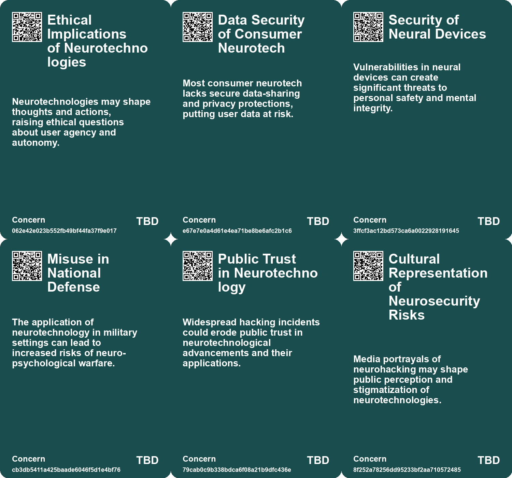
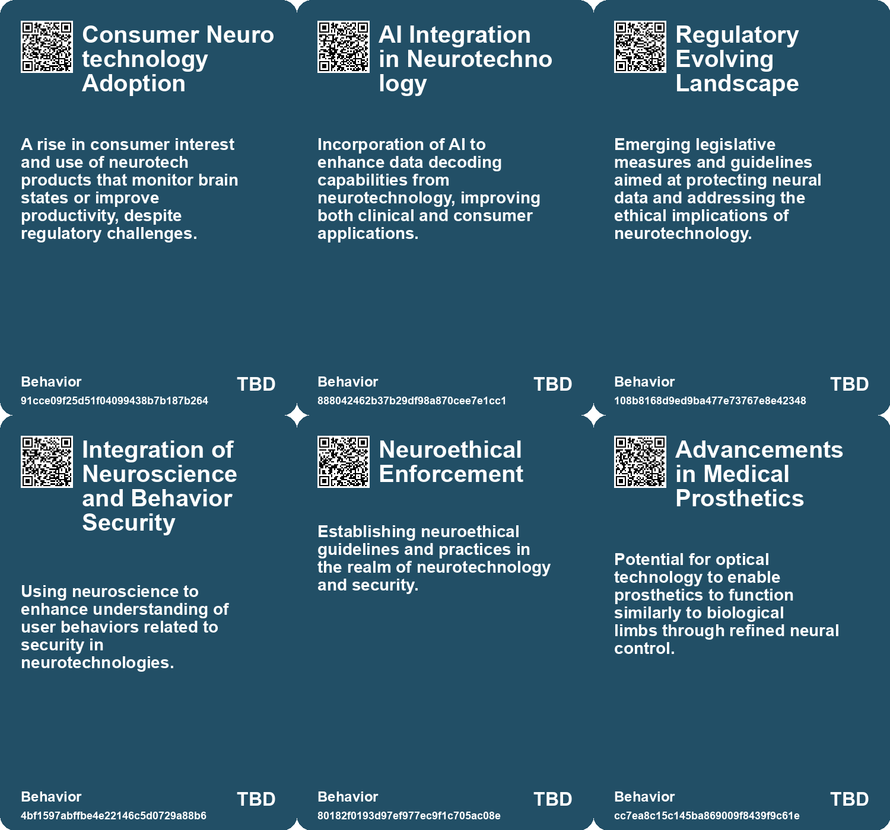
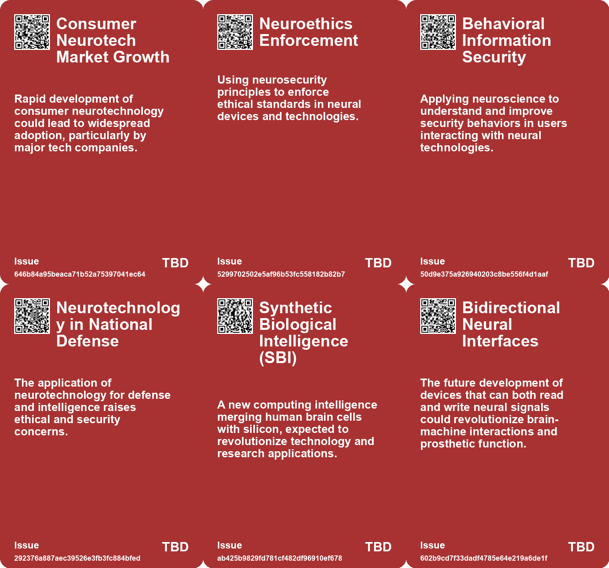
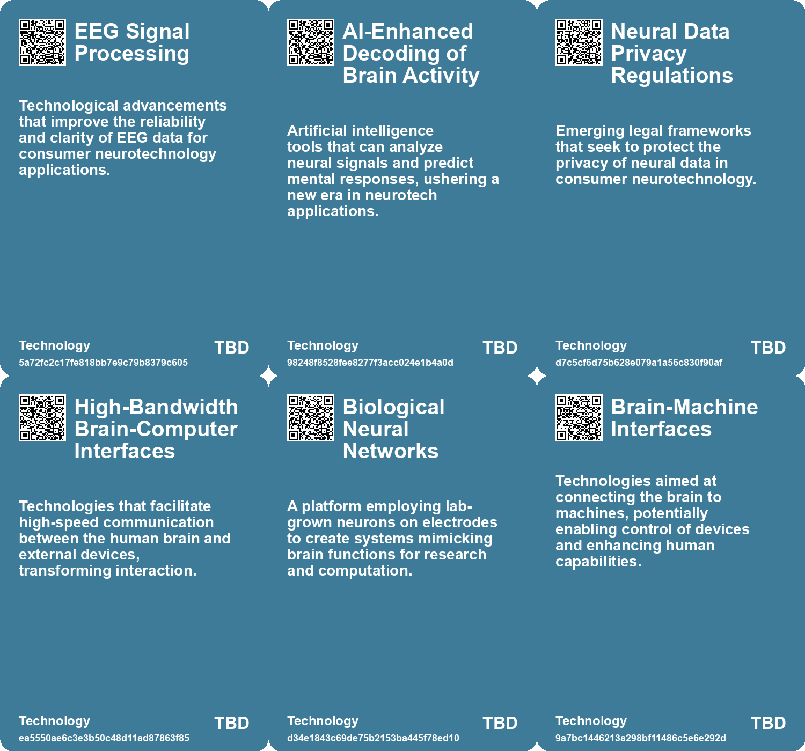

# *Topic*: Neurotechnology

# Summary

Neurosecurity is emerging as a critical field that combines computer science and neural engineering. It focuses on protecting neural devices to safeguard mental processes and free will. This area acts as a protective layer for the mind, similar to antivirus software for computers. Institutions like the Center for Neurotechnology Studies are leading efforts to address neurosecurity concerns, which have also found their way into popular culture, particularly in anime and literature.

Advancements in brain-computer interfaces (BCIs) are transforming the landscape of assistive technology. Nancy Smith, paralyzed from a car accident, regained her ability to create music through a dual-implant BCI that translates brain activity into musical notes. This technology is paving the way for more effective prosthetics, although ethical concerns about privacy and cognitive liberty are rising as consumer neurotech products become more prevalent. Researchers are also exploring non-invasive BCIs using functional ultrasound technology, which could enhance treatment for neurological disorders.

Innovations in measuring neural activity are also on the rise. Engineers at UNSW Sydney have developed optrodes that use light to measure neural signals, potentially revolutionizing medical technologies like nerve-operated prosthetics. These sensors address limitations of traditional electrodes, making them more effective for complex neural networks. Similarly, researchers at UC Berkeley have created wireless "neural dust" sensors that can monitor muscle and nerve signals, opening new avenues for bioelectronic treatments.

The intersection of AI and neuroscience is becoming increasingly significant. A recent study from Singapore and Hong Kong demonstrated the ability to reconstruct video content from brain activity, raising ethical concerns about privacy and surveillance. This mind-reading technology could aid individuals with communication difficulties but also poses risks to cognitive freedom. Additionally, AI models are being trained to decode brain scans, providing insights into language processing and potentially restoring communication for those who have lost the ability to speak.

The concept of learning through manipulating brain activity patterns is gaining traction. A collaborative research team has developed a method that allows individuals to learn new visual categories without conscious effort, utilizing real-time imaging and neurofeedback. This approach has implications for education and mental health treatment, enhancing our understanding of brain plasticity.

In the realm of robotics, researchers are exploring the potential for humans to control additional robotic limbs. By investigating neural signals and developing non-invasive methods to capture brain commands, the goal is to enhance human capabilities beyond natural limits. This research could lead to mind-controlled prosthetics that allow for more natural movement.

The integration of technology into daily life raises questions about privacy and autonomy. Innovations like wearable tech and biohybrid systems, such as the "Brainoware" developed at the University of Indiana Bloomington, highlight the potential for human biology to enhance computing capabilities. However, concerns about data privacy and the implications of technology on human relationships persist.

As digital superintelligence approaches, the potential for AI to enhance scientific progress and productivity is significant. However, challenges such as job displacement and equitable access to technology must be addressed. The evolving dynamics between humans and AI in the workplace emphasize the need for emotional presence and human connection amidst rapid technological advancements.

# Seeds

|    | name                                                 | description                                                                                 | change                                                                                              | 10-year                                                                                                             | driving-force                                                                                     |
|---:|:-----------------------------------------------------|:--------------------------------------------------------------------------------------------|:----------------------------------------------------------------------------------------------------|:--------------------------------------------------------------------------------------------------------------------|:--------------------------------------------------------------------------------------------------|
|  0 | Sci-Fi Influencing Real-World Technology             | Concepts from science fiction are being adapted into real-world technologies.               | From fiction to reality, where imaginative concepts become practical innovations.                   | Science fiction influences will continue shaping technological advancements and business strategies.                | Imagination and creativity in storytelling drive innovation and technological exploration.        |
|  1 | Emergence of Neurosecurity                           | Neurosecurity focuses on protecting neural devices from malicious interference.             | Shifting from general cybersecurity to specialized protection of neural technologies.               | Widespread implementation of neurosecurity measures in neural devices to prevent hacking.                           | Increasing use of neural implants and devices leading to heightened security concerns.            |
|  2 | Incorporation of Neuroscience in Behavioral Security | Application of neuroscience to improve user security behaviors.                             | From traditional behavioral security to an enhanced understanding through neuroscience.             | Users' security behaviors significantly improved due to insights from neuroscience applications.                    | Desire to enhance protective measures for personal data through neuroscience insights.            |
|  3 | Demo of Neural Network Adaptation                    | Demonstration of lab-grown neurons adapting and learning through stimulation.               | Advancement from static models to dynamic, adaptable biological networks.                           | Potential to innovate machine learning and AI systems with more organic learning processes.                         | Search for more advanced, efficient ways to replicate intelligence in machines.                   |
|  4 | Brain-Machine Interfaces                             | Growing interest in connecting the brain to external devices for various applications.      | Evolution from basic neural interfacing to sophisticated brain-machine interfaces.                  | Integration of brain-machine interfaces into daily life, enabling new capabilities.                                 | Ambition to enhance human capabilities and aid those with disabilities.                           |
|  5 | Biotech Investment in Neural Tech                    | Increased investment from companies in brain-computer interface technologies.               | Shift towards significant funding and research in neural interfacing technologies.                  | A robust market for neural interface technologies with multiple applications.                                       | Growing interest in the intersection of biotechnology and artificial intelligence.                |
|  6 | Advancements in Non-Invasive BCIs                    | Research into non-invasive brain-computer interfaces using ultrasound technology.           | Transitioning from invasive BCI surgeries to non-invasive ultrasound methods for brain interaction. | In 10 years, non-invasive BCIs may become commonplace, improving accessibility for neurological patients.           | The need for safer, long-lasting solutions for brain-computer interfacing drives this innovation. |
|  7 | Functional Ultrasound Technology                     | Using functional ultrasound to detect and interpret neuronal activity with high resolution. | From basic brain activity readings to detailed neuronal activity mapping through advanced imaging.  | In 10 years, functional ultrasound may revolutionize brain research and treatment modalities for various disorders. | Advancements in imaging technology and the quest for improved BCI efficacy are key motivators.    |
|  8 | DishBrain Development                                | Creation of a semi-biological computer chip using lab-grown brain cells.                    | Shift from traditional silicon-based computing to biological computing.                             | Biological computing could lead to more advanced, adaptable AI systems in various applications.                     | The pursuit of more efficient and intelligent computing systems.                                  |
|  9 | Cyborg Computer Development                          | Development of biohybrid computers combining AI with human brain cells.                     | Transition from traditional computing to biohybrid systems that incorporate human biology.          | In 10 years, we may see advanced biocomputers outperforming traditional systems in specific tasks.                  | The pursuit of energy-efficient computing solutions drives interest in biological integration.    |

# Concerns

|    | name                                           | description                                                                                                                    |
|---:|:-----------------------------------------------|:-------------------------------------------------------------------------------------------------------------------------------|
|  0 | Ethical Implications of Neurotechnologies      | Neurotechnologies may shape thoughts and actions, raising ethical questions about user agency and autonomy.                    |
|  1 | Data Security of Consumer Neurotech            | Most consumer neurotech lacks secure data-sharing and privacy protections, putting user data at risk.                          |
|  2 | Security of Neural Devices                     | Vulnerabilities in neural devices can create significant threats to personal safety and mental integrity.                      |
|  3 | Misuse in National Defense                     | The application of neurotechnology in military settings can lead to increased risks of neuro-psychological warfare.            |
|  4 | Public Trust in Neurotechnology                | Widespread hacking incidents could erode public trust in neurotechnological advancements and their applications.               |
|  5 | Cultural Representation of Neurosecurity Risks | Media portrayals of neurohacking may shape public perception and stigmatization of neurotechnologies.                          |
|  6 | Data Security Issues                           | As neural interfaces become capable of data transmission, vulnerabilities to hacking or misuse of information could arise.     |
|  7 | Inequality in Access to Technology             | Advancements in neural tech could widen the gap between those who can afford enhancements and those who cannot.                |
|  8 | Regulatory and Compliance Challenges           | The rapid development of neural technologies may outpace regulatory frameworks, leading to safety and efficacy concerns.       |
|  9 | Ethical Implications of Neural Monitoring      | Ethical issues surrounding the implications of constant neural and muscular monitoring and potential misuse of the technology. |

# Cards

## Concerns

## Behaviors

## Issue

## Technology

# Links

* [Revolutionary Method Induces Learning by Directly Manipulating Brain Activity Patterns](https://futures.kghosh.me/608d74fa38b4490086705a9cef803a77)
* [Advancements in Ultrasonic Neural Dust Sensors for Real-Time Monitoring of Muscle and Nerve Activity](https://futures.kghosh.me/feadfd4aa3133e938a6f6e6d7d2c018e)
* [Exploring the Future of Human Augmentation with Extra Robotic Limbs and Neural Control](https://futures.kghosh.me/faad51d1f885af1db9dee5e5ce52b46e)
* [The Importance of Neurodiversity in the Evolving AI Workplace](https://futures.kghosh.me/8b9448d5e3ccb80914537d5e55424109)
* [Breakthrough in Biocomputing: Brainoware Combines AI with Human Brain Cells for Speech Recognition](https://futures.kghosh.me/fe93f7419799d1706b4e7ce0a6adcb40)
* [Navigating the Future of Work: Balancing AI, Humanity, and Connection in an Evolving Landscape](https://futures.kghosh.me/7b41f864312f447b7347166caa5e880c)
* [Enhanced Games: Merging Science and Safety in Athletic Competitions](https://futures.kghosh.me/9786ba9f5842c13525de5cff9ee70d53)
* [Technologies of Hope: Navigating Pandemic Innovations and Their Societal Implications](https://futures.kghosh.me/d44d0c046d2ee3330a2d40cfccdfc0d3)
* [Innovative Advances in Neuromorphic Computing: Mimicking Neurons with Silicon Transistors](https://futures.kghosh.me/ed30d911e08e5dabc7996a90ed807274)
* [Roberto Moreno: Overcoming Autism Challenges to Achieve Engineering Success](https://futures.kghosh.me/c512e78d0c0fc39ed5798ecdae112f5d)
* [The Future of Wearable Technology: Merging Cyborg Lifestyles with Daily Life](https://futures.kghosh.me/a81c4775b91ccd0db3e1b84da893ac6f)
* [UNSW Engineers Develop 'Optrodes' to Measure Neural Activity Using Light for Advanced Prosthetics](https://futures.kghosh.me/7aeb03c0771769ceb99c3085c141c1fe)
* [Advancements in Mind-Reading Technology Raise Ethical Concerns About Privacy and Free Thought](https://futures.kghosh.me/95a515aafcc880230a55f57c5d902d3f)
* [The Diminishing Role of Human Interaction in Modern Technology and Its Societal Implications](https://futures.kghosh.me/31491f2b50e77cc7c45e541a9b2915d7)
* [The Future of Brain-Computer Interfaces: Promise and Ethical Concerns](https://futures.kghosh.me/c6702f63f03fb731d83c81e00768b28d)
* [OHMNI: The Fashion Revolution for Privacy and Autonomy in a Digital Age](https://futures.kghosh.me/6014545e533ca07e1307fbc35740f55a)
* [Exploring the Intersection of Technology and Sci-Fi: Insights on AI, Predictive Policing, and Drone Warfare](https://futures.kghosh.me/026209244953fa87db05ebd0105fb0c4)
* [Exploring the Future of Superintelligence and Its Impact on Humanity](https://futures.kghosh.me/8a7f0b887d1b9b17fc4f72a0815ec849)
* [Monash University Develops DishBrain: A Semi-Biological Chip with Learning Capabilities](https://futures.kghosh.me/fcf584bddde6a0c4ccaf5ab8eadded1e)
* [Exploring the Integration of AI in Daily Life and Business Innovations in Tech Trends 2025](https://futures.kghosh.me/0b0e772667a3f74d6364a71eb20bc913)
* [Understanding Neurosecurity: Protection for Neural Devices and User Behavior](https://futures.kghosh.me/70be08bc846223ea4b986fd5f9a69bcf)
* [The Threat of Authoritarian Intelligence: A Call for Responsible AI Development](https://futures.kghosh.me/0ba4fa557cd2aae4760bd7a2abca844e)
* [Cortical Labs Launches World's First Biological Computer: The CL1](https://futures.kghosh.me/c3e6ac3d2c8dcccbff885b74128c5536)
* [Advancements in Brain-Computer Interfaces: Exploring Non-Invasive Ultrasound Technology](https://futures.kghosh.me/32310a2097cecfb2b52a21a7c16fa9e8)
* [Recent Developments in AI Regulation and Technology: A Review of Key Initiatives and Critiques](https://futures.kghosh.me/a009ccdffaa59f53de56887aa19e6239)
* [AI's Role in Understanding the Human Brain: Breakthroughs in Language Processing](https://futures.kghosh.me/e43c70d1c8c34f4587722ef456132b41)
* [Exploring the Future of Neural Networks through Sound and Physical Systems](https://futures.kghosh.me/92fd13cc9ae2e437ede8175d350860ef)