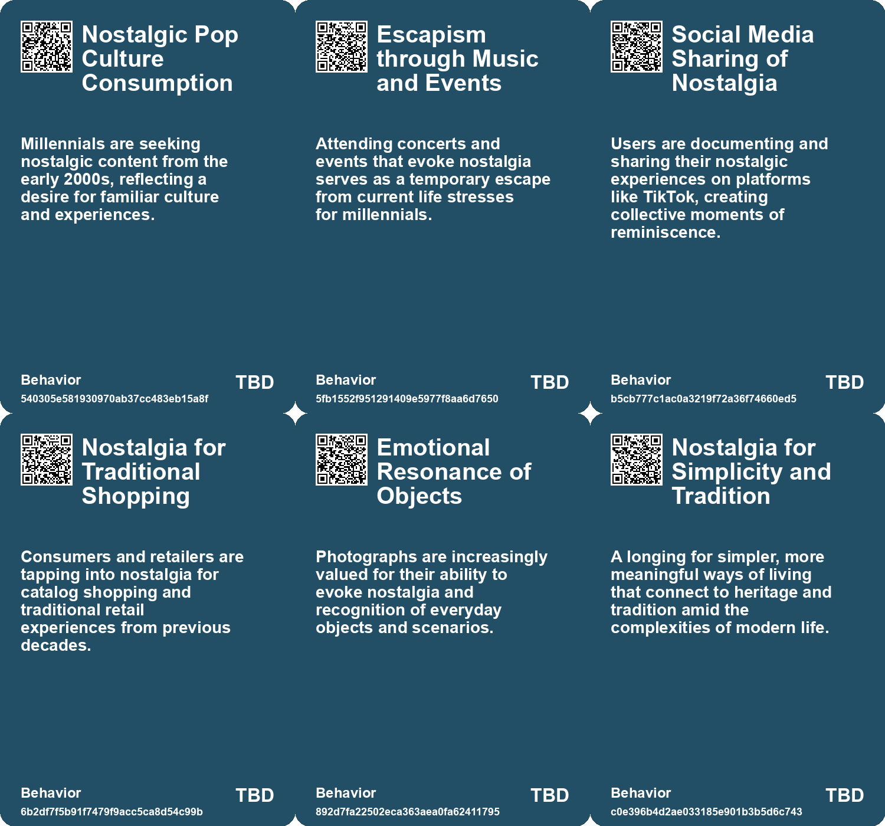
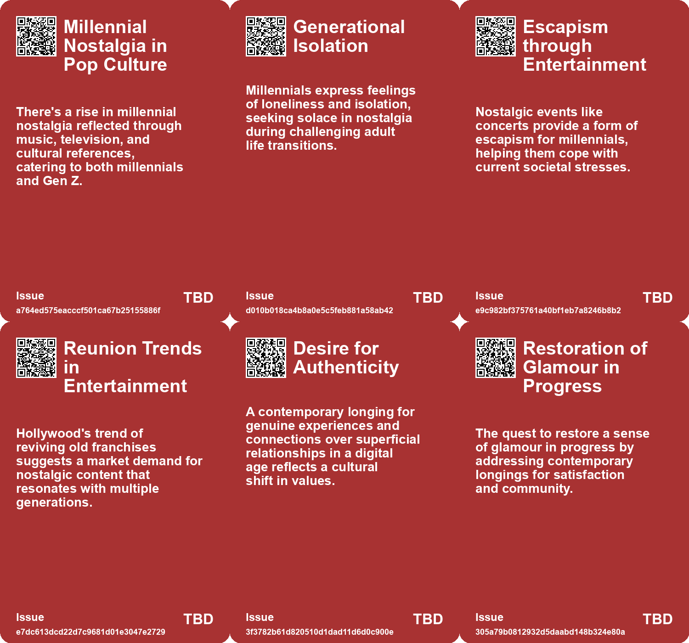
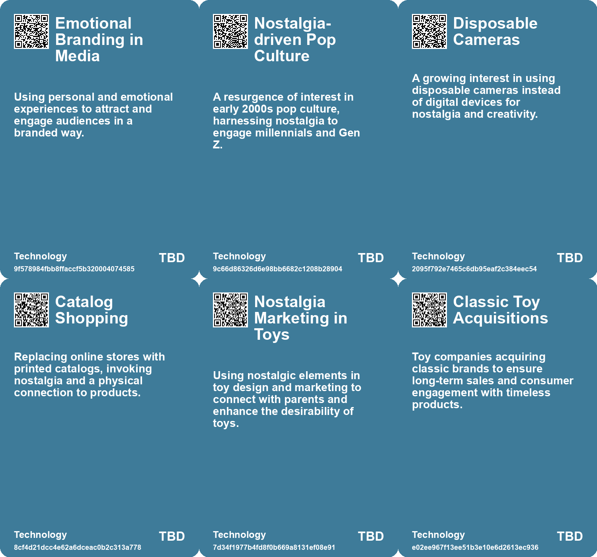

# *Topic*: Nostalgic Engagement

# Summary

Nostalgia is a powerful force shaping contemporary culture, as many individuals reflect on simpler times before the digital age took over. This longing for the past is evident in the resurgence of 1990s and early 2000s pop culture, with millennials and even Gen Z revisiting music, films, and experiences from that era. Events like Backstreet Boys concerts evoke feelings of escapism, while platforms like Neopets are rebranding to attract former users, highlighting a desire to reconnect with childhood joys.

In response to digital fatigue, younger generations are turning to retro technology. Gen Z is embracing "flip phone summer," opting for vintage devices like flip phones and disposable cameras to simplify their lives and reduce screen time. This trend reflects a broader movement towards analog experiences, as teens increasingly use CD players and iPod Nanos in schools, seeking authenticity in their interactions and media consumption.

The impact of technology on personal relationships is also a significant theme. The decline in teenage romantic relationships among Gen Z indicates a growing skepticism about love, influenced by media portrayals and a focus on self-sufficiency. This shift raises questions about vulnerability and emotional connections in a world where social media often commodifies personal experiences. The rise of "granfluencers" on platforms like TikTok challenges stereotypes of aging, showcasing the joys of later life and redefining narratives around relationships and community.

The preservation of memories and authenticity in photography is another area of exploration. As generative AI reshapes the landscape of image creation, the value of traditional photography, particularly Polaroid, is being reexamined. The desire for tangible, meaningful photographs contrasts with the fleeting nature of digital images, emphasizing the importance of capturing everyday moments.

Amidst these cultural shifts, the retail landscape is evolving. Malls are experiencing a resurgence as social hubs, blending shopping with dining and entertainment to attract younger consumers. This transformation reflects a desire for offline experiences in an age of digital fatigue, as retailers focus on creating meaningful interactions rather than solely driving online sales.

The conversation around marriage and parenthood is also changing. Young adults are increasingly hesitant to commit to traditional family structures, influenced by economic pressures and shifting societal norms. While some view this decline in marriage rates as concerning, others see it as a reflection of evolving priorities and values.

Finally, the intersection of technology and grief is becoming more pronounced. Virtual reality experiences that allow individuals to connect with deceased loved ones highlight the therapeutic potential of digital tools, while also raising ethical questions about addiction and the nature of memory. As society navigates these complex themes, the interplay between nostalgia, technology, and personal relationships continues to shape contemporary life.

# Seeds

|    | name                                        | description                                                                                 | change                                                                                               | 10-year                                                                                                                                    | driving-force                                                                                       |
|---:|:--------------------------------------------|:--------------------------------------------------------------------------------------------|:-----------------------------------------------------------------------------------------------------|:-------------------------------------------------------------------------------------------------------------------------------------------|:----------------------------------------------------------------------------------------------------|
|  0 | Millennial Nostalgia Surge                  | Millennials are increasingly consuming pop culture from their youth, focusing on nostalgia. | Shifting from modern entertainment to nostalgia-driven experiences.                                  | Mainstream culture may heavily feature 90s and early 2000s elements as staples in media.                                                   | The sense of isolation and nostalgia among millennials pushing for collective experiences.          |
|  1 | Millennial Escapism                         | Nostalgia acts as a form of escapism for millennials facing modern life challenges.         | From facing current socioeconomic pressures to finding respite in the past.                          | Nostalgic experiences may become vital coping mechanisms for younger generations.                                                          | Economic and social struggles highlighting the desire for simpler times.                            |
|  2 | Nostalgia in Tech Design                    | Technological nostalgia is influencing the design and creation of new products.             | Move from purely modern designs to those inspired by vintage technology.                             | Products may feature retro aesthetics paired with cutting-edge technology.                                                                 | Consumer interest in blending nostalgia with modern functionality.                                  |
|  3 | Printed Catalog Resurgence                  | Retailers are revisiting printed catalogs as a nostalgic and engaging shopping option.      | Move from digital-only platforms to mix physical catalogs for customer engagement.                   | Printed catalogs could become a primary marketing tool, enhancing customer experience and anticipation.                                    | Nostalgia for tactile shopping experiences and the desire for a more tangible connection.           |
|  4 | Nostalgia for Pre-Smartphone Era            | A longing for the past when communication was less invasive and more personal.              | Shift from face-to-face, spontaneous interactions to constant digital connectivity and surveillance. | In ten years, people may seek more offline experiences to reconnect with themselves and others.                                            | Desire for authentic connections and a break from overwhelming digital interactions.                |
|  5 | Desire for Authenticity                     | A growing yearning for genuine connections and experiences in a superficial digital age.    | Shift from superficial virtual relationships to deeper, authentic human connections.                 | In ten years, social interactions may prioritize authenticity, leading to a resurgence of local communities and face-to-face interactions. | The fatigue from the constant demands of the attention economy and virtual interactions.            |
|  6 | Nostalgia-Driven Toy Sales                  | Parents are increasingly opting for classic toys due to nostalgic memories.                 | Shift from trendy, flashy toys to classic, low-tech alternatives.                                    | Classic toys may dominate the market as parents seek nostalgic connections for their children.                                             | A desire to share childhood experiences with the next generation drives nostalgia-driven purchases. |
|  7 | Emotional Attachment to Digital Experiences | Users feel a strong emotional connection to their childhood digital experiences.            | Shift from casual gaming to deeply personal, nostalgic engagements.                                  | The gaming industry may prioritize emotional storytelling and nostalgic connections in game design.                                        | A cultural shift towards valuing emotional well-being and mental comfort in entertainment.          |
|  8 | Nostalgia for Past Eras                     | A growing trend of nostalgia for the aesthetics and lifestyles of the mid-20th century.     | From contemporary styles to a revival of styles reminiscent of the 1950s and 60s.                    | In ten years, cultural expressions may heavily draw from retro aesthetics, influencing fashion and design.                                 | A reaction to modern complexities, seeking simplicity and familiarity in past cultural expressions. |
|  9 | Nostalgia for Analog Experiences            | A yearning for simpler times without digital distractions.                                  | Shift from limited social interactions to overwhelming digital connectivity.                         | Increased appreciation for non-digital interactions and experiences, fostering deeper relationships.                                       | Desire for authenticity and meaningful connections in a hyper-connected world.                      |

# Concerns

|    | name                                            | description                                                                                                                                |
|---:|:------------------------------------------------|:-------------------------------------------------------------------------------------------------------------------------------------------|
|  0 | Escapism through Nostalgia                      | Millennials are increasingly using nostalgia as a form of escapism from current economic and social pressures.                             |
|  1 | Cultural Appropriation and Generational Mockery | There is a risk of generational misunderstandings as younger generations romanticize older culture after previously mocking it.            |
|  2 | Mental Health and Therapy Alternatives          | Nostalgia events are being seen as emotional healing substitutes, which may detract from professional mental health treatments.            |
|  3 | Commercialization of Nostalgia                  | The entertainment industry’s focus on nostalgia could stifle innovation and create a homogeneous cultural landscape.                       |
|  4 | Disconnected Legacy                             | The emotional disconnect from future descendants regarding ordinary life may undermine the significance of personal photography.           |
|  5 | Nostalgia and Toy Longevity                     | The enduring popularity of classic toys may fade as cultural connections weaken over generations, risking loss of play traditions.         |
|  6 | Market Dependence on Nostalgia                  | The reliance on nostalgia to attract users may not be sustainable in the long run. Risks include failing to engage newer generations.      |
|  7 | Community Management Challenges                 | Balancing the interests of a nostalgic community while fostering growth poses challenges that could alienate users.                        |
|  8 | Nostalgia vs Reality                            | The longing for past periods of beauty and connection may detract from appreciating the present reality.                                   |
|  9 | Nostalgia for Simplicity                        | There is a growing sentiment that the past simplicity of social interactions and media consumption was more fulfilling and less stressful. |

# Cards

## Concerns

## Behaviors

## Issue

## Technology

# Links

* [The Shift from E-commerce to In-Person Retail Experiences in Fashion](https://futures.kghosh.me/2db44f1091d08697f6f525dbe8740189)
* [The Dangers of Living Life as Entertainment in the Social Media Age](https://futures.kghosh.me/b5f05d364d78d7c80ea7e9d40e9831a2)
* [Future Trends Post-2024: Declining Democracies and Emerging Cultural Shifts](https://futures.kghosh.me/bd1b01636b1360716b5951e1cac42724)
* [Nostalgia for Simplicity: The Burden of Infinite Choice in Modern Life](https://futures.kghosh.me/7b316ebe449187b79e519a8c6d12a2cd)
* [Polaroid’s Shift: From Creativity to Authenticity in the Age of AI](https://futures.kghosh.me/ba6b48e83806da532c7578d24e914455)
* [Exploring the Modern Entertainment Landscape and Its Societal Implications](https://futures.kghosh.me/c5c2c794f1426e6e307a9df3f9ff61f6)
* [Exploring the Decline of Teenage Romantic Relationships Among Gen Z and Its Implications](https://futures.kghosh.me/c7e01bc4dbe5c20f9a8b8a4641169f94)
* [The Value of Everyday Photography: Capturing Life's Absurdities and Meaning](https://futures.kghosh.me/fa8e357b94207aab0654df7414934300)
* [The Enduring Appeal of Classic Toys Amidst Modern Trends and Nostalgia](https://futures.kghosh.me/dd9fc6f91eeb99cb289ba2e9f8af02f3)
* [The Emotional Impact of Losing Access to Virtual Worlds in Gaming](https://futures.kghosh.me/7ce06613470d821b81126a4378a0eb2e)
* [The Impact of Declining Marriage Rates on American Society and Community Involvement](https://futures.kghosh.me/7bba3b8d86e60b61318296779a9020c3)
* [Reviving Neopets: Nostalgia, Community Engagement, and Economic Challenges](https://futures.kghosh.me/c1dec8cd5e095e473a62ea58b92212fd)
* [Rediscovering Forgotten Tech: The Inspiration Found in Old Magazines and Innovations](https://futures.kghosh.me/4dd9b0678fe83452675db69875540e0b)
* [Gen Z Embraces Retro Technology for a More Authentic Summer Experience](https://futures.kghosh.me/d1f958e7158ad51d4b34b79c1e3c9a9f)
* [The Emotional Impact of Virtual Reality and AI in Grieving Process](https://futures.kghosh.me/f97f969e4aadfbae3dee287de4ab721d)
* [Nostalgia for Pre-Smartphone Era: A Reflection on Simpler Times](https://futures.kghosh.me/06ca8cfe66a96c99e2830d74b7493668)
* [Navigating Heritage and Modernity: The Burden of Inherited Beauty](https://futures.kghosh.me/2baeb72621db875c5f6c2133a93f33c8)
* [The Revival of Malls: How Gen Z is Reshaping Shopping Destinations](https://futures.kghosh.me/3c27a71013ec18bf55a80ae739105bd7)
* [Finding Connection and Beauty in Garry Winogrand's Photography: A Personal Reflection](https://futures.kghosh.me/ab6e3fcdacd5615fd45dda4664c395e5)
* [Teens Embrace Older Tech Amid School Smartphone Bans, Sparking Nostalgia and Socialization](https://futures.kghosh.me/2c00b2575d94795c1ea258a68f0cf8ea)
* [Exploring the Value and Preservation of Vintage Computing Technologies](https://futures.kghosh.me/2a98922fc3676ea6365782ce075cf589)
* [Granfluencers: Redefining Aging with Humor and Positivity on Social Media](https://futures.kghosh.me/11ceca954d07bbec1f31e6690744ac77)
* [Millennials Revel in Nostalgia as Pop Culture Makes a Comeback](https://futures.kghosh.me/159cf431f66fe4aa426b0f6f34fed6d3)
* [The Evolution of Progress: From Glamour to Disillusionment and the Search for Meaning](https://futures.kghosh.me/9ef585bb7bceabb83000fd0f321b144f)