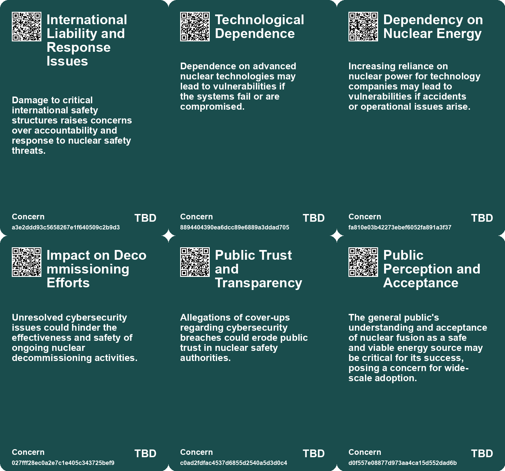
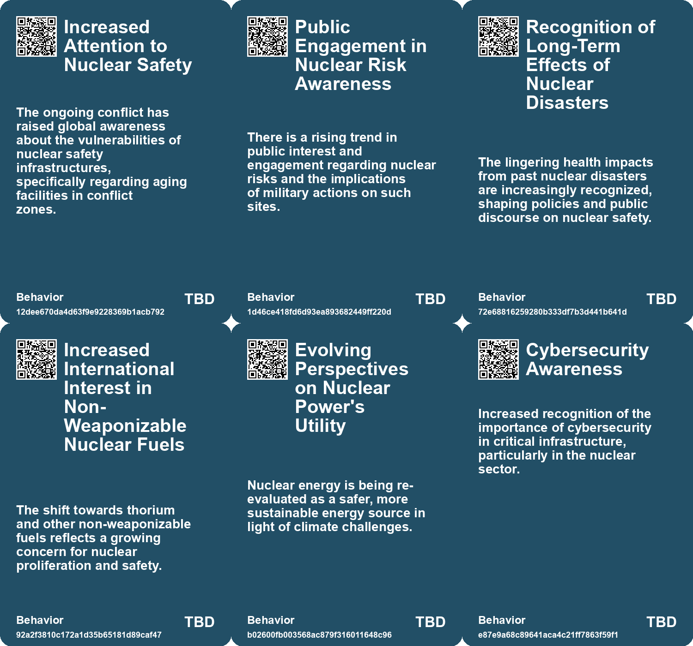
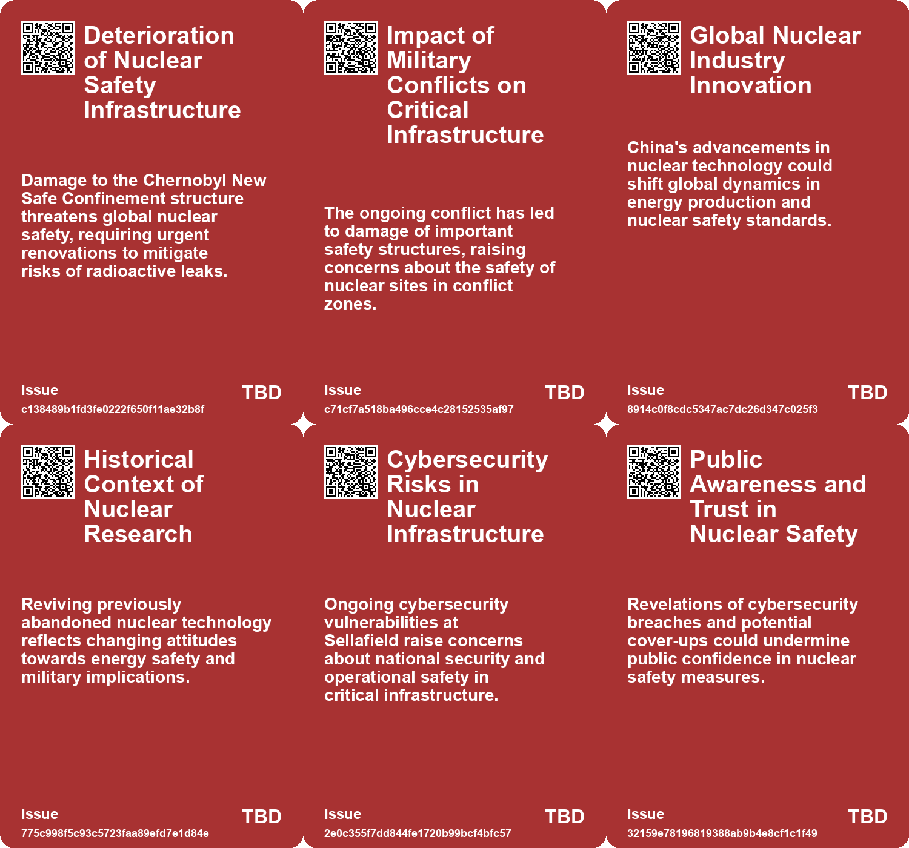
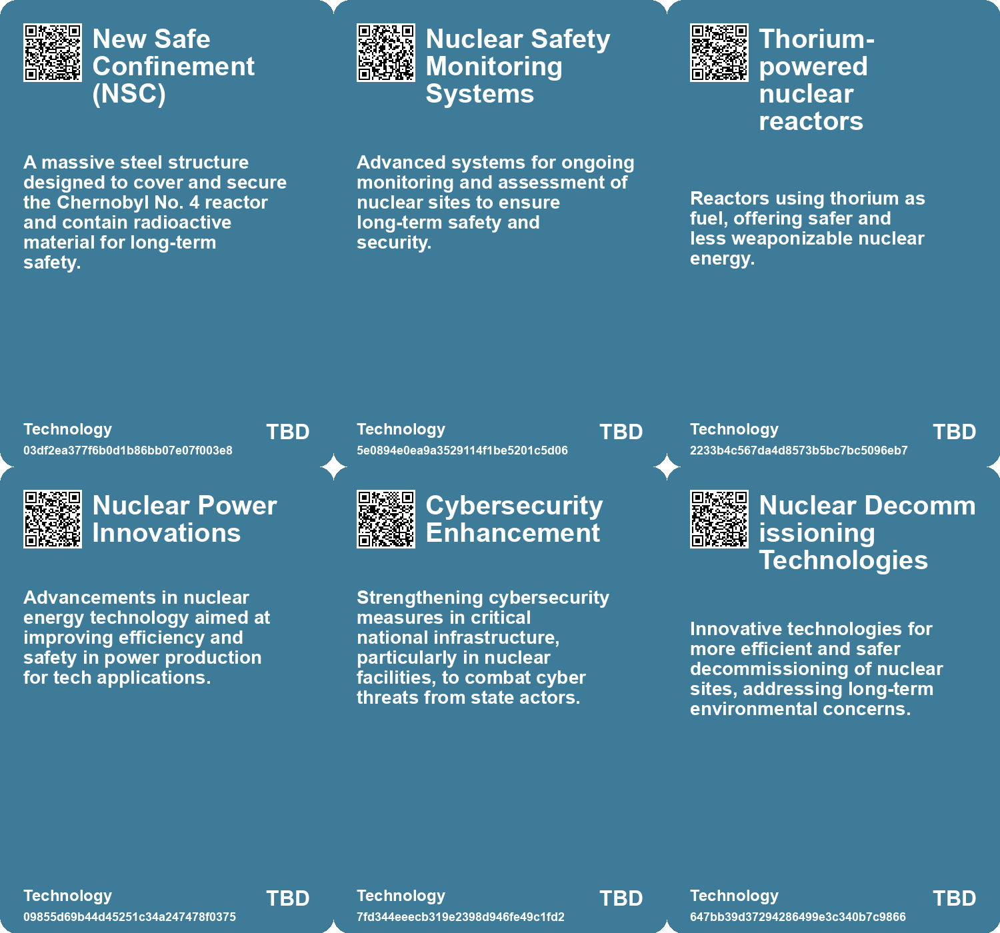

# *Topic*: Nuclear Safety and Security

# Summary

The intersection of nuclear technology and cybersecurity is increasingly prominent in global discussions. The International Atomic Energy Agency (IAEA) has raised alarms about the New Safe Confinement structure at the Chernobyl site, which has been compromised by a drone strike, losing its ability to contain radioactive waste. This situation underscores the ongoing risks associated with nuclear sites, particularly in conflict zones.

Cybersecurity threats are also a major concern, particularly in the UK, where the Sellafield nuclear site has been targeted by hackers linked to Russia and China. The breach has raised serious questions about the security of sensitive nuclear operations and the potential for catastrophic consequences. The UK government faces criticism for its inadequate cybersecurity measures, which leave critical national infrastructure vulnerable to attacks.

In response to energy demands and climate change, Sweden is pivoting towards nuclear energy, planning to construct multiple new reactors by the 2040s. This shift reflects a broader trend where countries are recognizing nuclear power as a viable alternative to fossil fuels, emphasizing its potential for clean energy production.

Meanwhile, advancements in nuclear technology continue to emerge. Japan has inaugurated the world's largest experimental nuclear fusion reactor, aiming to explore safe and carbon-free energy generation. Similarly, researchers in China have successfully operated a thorium-powered reactor, which is considered a safer alternative to traditional uranium-based systems. These developments highlight a global push towards innovative nuclear solutions.

The U.S. is also making strides in nuclear technology, with the Air Force planning to build a microreactor in Alaska to provide reliable energy for remote military bases. This initiative is part of a broader strategy to enhance energy resilience and reduce reliance on fossil fuels.

Concerns about cybersecurity extend beyond nuclear facilities. U.S. agencies have issued warnings about potential cyberattacks from Iranian-affiliated hackers targeting critical infrastructure, including energy and healthcare sectors. The advisory emphasizes the need for organizations to bolster their defenses against these threats.

Finally, the geopolitical landscape is shifting, with Western powers preparing to secure submarine communications cables against potential disruptions from Chinese firms. This initiative reflects growing concerns about data security and the influence of state actors in critical infrastructure. As nations navigate these complex challenges, the interplay between energy security, technological advancement, and cybersecurity remains a focal point of international discourse.

# Seeds

|    | name                                           | description                                                                                                   | change                                                                                                       | 10-year                                                                                                              | driving-force                                                                                                |
|---:|:-----------------------------------------------|:--------------------------------------------------------------------------------------------------------------|:-------------------------------------------------------------------------------------------------------------|:---------------------------------------------------------------------------------------------------------------------|:-------------------------------------------------------------------------------------------------------------|
|  0 | Increased Military Targeting of Infrastructure | Targeting of critical infrastructure such as nuclear sites in military conflicts is becoming more common.     | Changing from protected infrastructure to military targets in ongoing conflicts.                             | In ten years, critical infrastructure may require enhanced protection from military actions globally.                | Escalating military actions in conflict zones that disregard safety protocols.                               |
|  1 | International Collaboration on Nuclear Safety  | The Chernobyl Shelter Fund exemplifies unprecedented international collaboration on nuclear safety.           | Shift from national to international responsibility in nuclear safety protocols.                             | In ten years, global norms for nuclear safety could evolve from collective international efforts.                    | Global recognition of nuclear risks leading to cooperative international frameworks.                         |
|  2 | Global Nuclear Research Collaboration          | The public availability of US research on MSRs supports global collaboration in nuclear energy.               | Encouraging international cooperation in nuclear technology development and research.                        | Enhanced global collaboration could lead to accelerated advancements in nuclear energy technology.                   | Desire for shared knowledge to tackle climate change and energy security issues.                             |
|  3 | Foreign State Cyber Threats                    | Cyber-attacks from Russia and China are recognized as significant threats to the UK’s nuclear infrastructure. | Evolution of cyber threats from isolated incidents to systemic risks affecting national security.            | In 10 years, international relations may shift due to cybersecurity threats, impacting diplomatic ties.              | Geopolitical tensions drive the urgency to fortify national cyber defenses against foreign actors.           |
|  4 | Emerging Nuclear Battery Applications          | Nuclear batteries are increasingly being used in diverse applications like sensors and cybersecurity devices. | Transitioning from traditional batteries to nuclear batteries for low-energy devices across various sectors. | In 10 years, nuclear batteries could power a wide range of devices, enhancing performance and longevity.             | The need for reliable, long-lasting energy sources in extreme environments drives this change.               |
|  5 | Public Perception Shift on Nuclear Energy      | City Labs is educating the public on nuclear energy's safety and eco-friendliness.                            | Changing public opinion from fear of nuclear energy to acceptance and understanding of its benefits.         | In 10 years, public perception may shift significantly in favor of nuclear energy applications.                      | Increased education and transparency about nuclear technology and its advantages is essential.               |
|  6 | Real-time Monitoring in Nuclear Facilities     | Integration of advanced monitoring systems in nuclear reactors for enhanced safety and oversight.             | Shift from periodic manual checks to continuous real-time monitoring of reactor performance and safety.      | In ten years, nuclear plants may operate with fully automated, AI-driven monitoring systems ensuring maximum safety. | Technological advancements in AI and data analytics for improved operational safety and efficiency.          |
|  7 | Affordable Nuclear Energy Solutions            | Development of cost-effective nuclear energy systems for residential use.                                     | Move from expensive traditional energy systems to more affordable nuclear alternatives.                      | Nuclear energy may become a mainstream, cost-effective alternative to fossil fuels in residential areas.             | Economic pressures pushing for lower-cost, stable energy solutions amidst rising energy prices.              |
|  8 | Advanced Fail-Safe Mechanisms                  | Implementation of sophisticated safety features in nuclear reactor designs to prevent accidents.              | Evolution from basic safety protocols to advanced, automatic fail-safe systems.                              | Safety measures in nuclear reactors might fully automate, reducing human error in operational safety.                | Growing public concern for safety and regulatory demands for higher standards in nuclear energy.             |
|  9 | Sustainable Energy Innovations                 | Breakthrough designs in nuclear technology focusing on sustainability and efficiency.                         | Shift from traditional energy sources to innovative nuclear designs that prioritize sustainability.          | Nuclear technology may evolve towards even greener alternatives, integrating with renewable energy sources.          | Global emphasis on sustainability and the need to combat climate change through innovative energy solutions. |

# Concerns

|    | name                                        | description                                                                                                                                                                       |
|---:|:--------------------------------------------|:----------------------------------------------------------------------------------------------------------------------------------------------------------------------------------|
|  0 | International Liability and Response Issues | Damage to critical international safety structures raises concerns over accountability and response to nuclear safety threats.                                                    |
|  1 | Technological Dependence                    | Dependence on advanced nuclear technologies may lead to vulnerabilities if the systems fail or are compromised.                                                                   |
|  2 | Dependency on Nuclear Energy                | Increasing reliance on nuclear power for technology companies may lead to vulnerabilities if accidents or operational issues arise.                                               |
|  3 | Impact on Decommissioning Efforts           | Unresolved cybersecurity issues could hinder the effectiveness and safety of ongoing nuclear decommissioning activities.                                                          |
|  4 | Public Trust and Transparency               | Allegations of cover-ups regarding cybersecurity breaches could erode public trust in nuclear safety authorities.                                                                 |
|  5 | Public Perception and Acceptance            | The general public's understanding and acceptance of nuclear fusion as a safe and viable energy source may be critical for its success, posing a concern for wide-scale adoption. |
|  6 | Nuclear Reactor Safety and Reliability      | Potential risks associated with the reliability of new nuclear microreactor technology and its safety features.                                                                   |
|  7 | Impact on Local Communities                 | The introduction of nuclear technology could lead to public concerns and opposition from local communities regarding safety and environmental issues.                             |
|  8 | Reliance on Advanced Nuclear Technology     | Dependence on unproven advanced nuclear technologies could affect national security if the technology fails or does not perform as expected.                                      |
|  9 | Regulatory Compliance                       | Rigorous regulations exist for nuclear energy, and any lapses in compliance could result in severe legal and safety repercussions.                                                |

# Cards

## Concerns

## Behaviors

## Issue

## Technology

# Links

* [U.S. and Allies Plan to Secure Submarine Cables, Excluding Chinese Technology](https://futures.kghosh.me/e80ec4d55a8fd9bddb711309f9cc1d25)
* [Introducing the Enron Egg: A Compact and Safe Nuclear Energy Solution](https://futures.kghosh.me/dfb71549f97aeb8903d04389db76676a)
* [Biden Administration Unveils New Cybersecurity Strategy to Combat Growing Threats](https://futures.kghosh.me/1eaefdcf11b24d5f443b5f4e7645e0a5)
* [Urgent Warning: Threats from Iranian Cyber Hackers to U.S. Critical Infrastructure](https://futures.kghosh.me/605e2654bd3bbaa502827084ca7a44be)
* [White House Launches Initiative to Secure Open Source Software in Critical Infrastructure](https://futures.kghosh.me/925e58163f39d747785e0e85eeea0f25)
* [Sweden Transitions to Nuclear Energy, Abandoning 100% Renewable Goal](https://futures.kghosh.me/b9666c2bcb5131de1b2411be30bb4b44)
* [Safeguarding the UK's Energy Sector: The Cybersecurity Challenge in an AI Era](https://futures.kghosh.me/58871ce6d54ebbaf1ac529fa1376eb2a)
* [IAEA Reports Damage to Chernobyl's Protective Shield from Drone Strike, Urgent Repairs Recommended](https://futures.kghosh.me/62371bb1f0aa0de74b3e5880a7d981d7)
* [U.S. Air Force Plans First Nuclear Microreactor Pilot at Eielson Air Force Base in Alaska](https://futures.kghosh.me/edbef1e1c31b764b47d554fa131a5ea6)
* [The Legacy of Nuclear Testing: Searching for Low-Background Steel from Sunken Ships](https://futures.kghosh.me/fd957af83036959652ceb25c652a97c9)
* [EU and NATO Mobilize for Enhanced Drone Defense Amid Ongoing Russian Threats in Ukraine](https://futures.kghosh.me/3e4c925ac500834d9f4d986e418bcc26)
* [Google Partners with Kairos Power for Nuclear Energy to Power AI Data Centers](https://futures.kghosh.me/f9ef1fc984ab921e2f13d2c53db0a066)
* [UK Faces High Risk of Catastrophic Ransomware Attack Due to Poor Cybersecurity Investment](https://futures.kghosh.me/3de8b64ba20eb613a72b0479350b5e5b)
* [Growing Cybersecurity Threats to Water Infrastructure Demand Immediate Action and Collaboration](https://futures.kghosh.me/fb9b2211d0fcea8245837d9b34379d9f)
* [Betavolt Unveils World's First Mass-Produced Nuclear Battery Promising 50-Year Lifespan](https://futures.kghosh.me/5fc90d8f831294feee2acb99e8ae8f18)
* [US Alarmed by Russian Naval Activity Near Undersea Cables and Potential Sabotage Plans](https://futures.kghosh.me/3c468ac4c9f4d478a02b19e757939012)
* [Navigating the Complexities of Space Law in an Evolving Industry](https://futures.kghosh.me/d7322a8c1f0f439ffa3d07c93d4c2651)
* [China's New 1.5-Megawatt Reactor: A Leap Toward Nuclear-Powered Space Travel](https://futures.kghosh.me/8856b6ef7989be8f6866c6a7b5586215)
* [Understanding Neurosecurity: Protection for Neural Devices and User Behavior](https://futures.kghosh.me/70be08bc846223ea4b986fd5f9a69bcf)
* [China Achieves Landmark Success with Thorium-Powered Nuclear Reactor in Gobi Desert](https://futures.kghosh.me/c48f3a9b02f019354d70e1e43401525d)
* [Japan Launches World's Largest Experimental Nuclear Fusion Reactor, JT-60SA, to Explore Clean Energy Solutions](https://futures.kghosh.me/1c46960244111ec5f16e85701a85e602)
* [Investigation Reveals Cybersecurity Breaches at Sellafield Nuclear Site Linked to Foreign Hackers](https://futures.kghosh.me/052e0aef0ae4e13f4e2cd7de90495330)
* [Lawrence Livermore Laboratory Achieves Breakthrough in Nuclear Fusion Energy Generation](https://futures.kghosh.me/136f0479a4a508ee27ea66d38d8d2b41)
* [Exploring the Role of Nuclear Batteries in Modern Technology and Their Future Potential](https://futures.kghosh.me/652d55c3a9d87d258078986ba055b487)