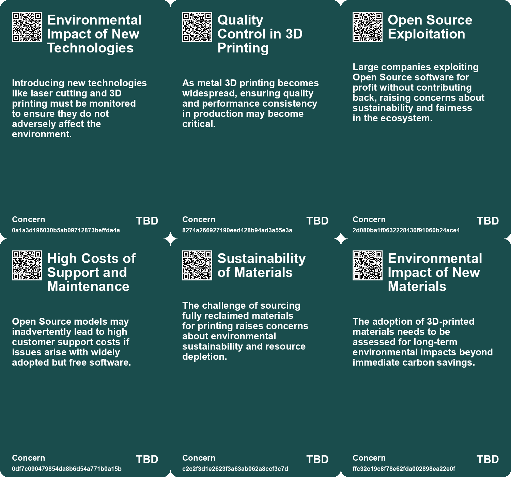
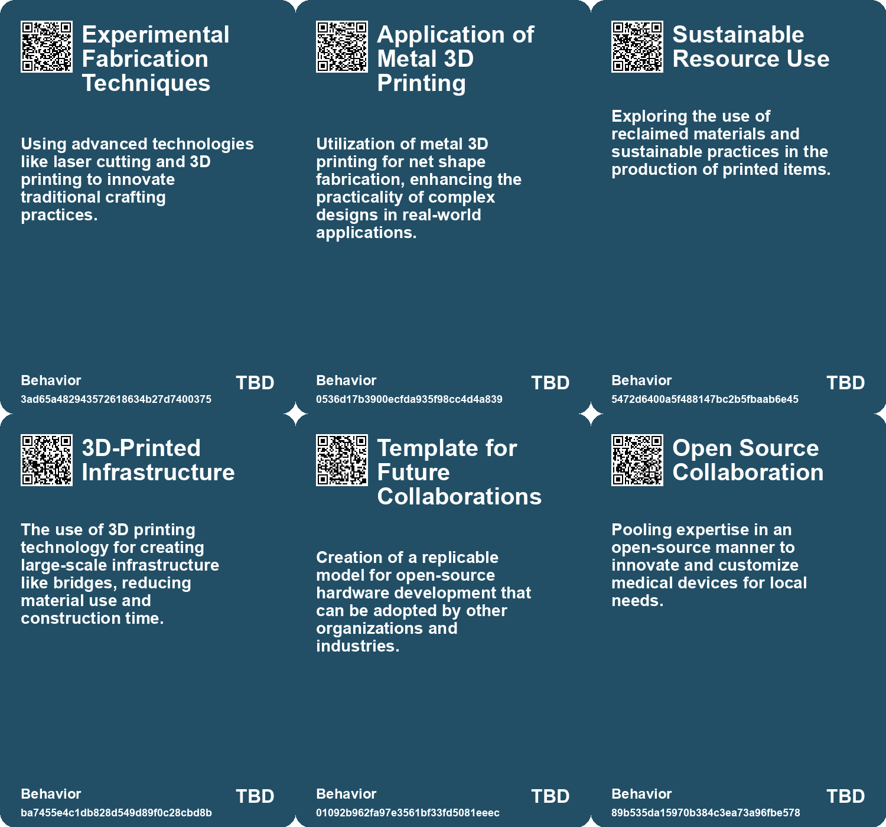
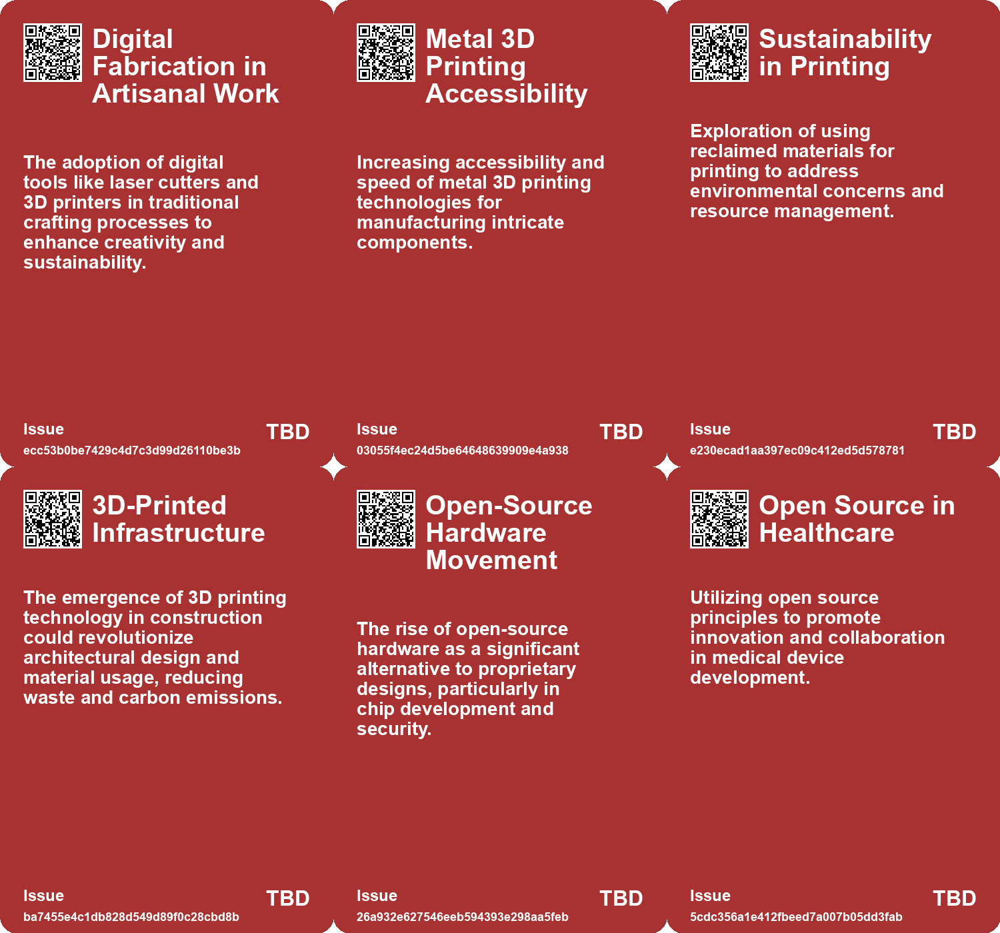
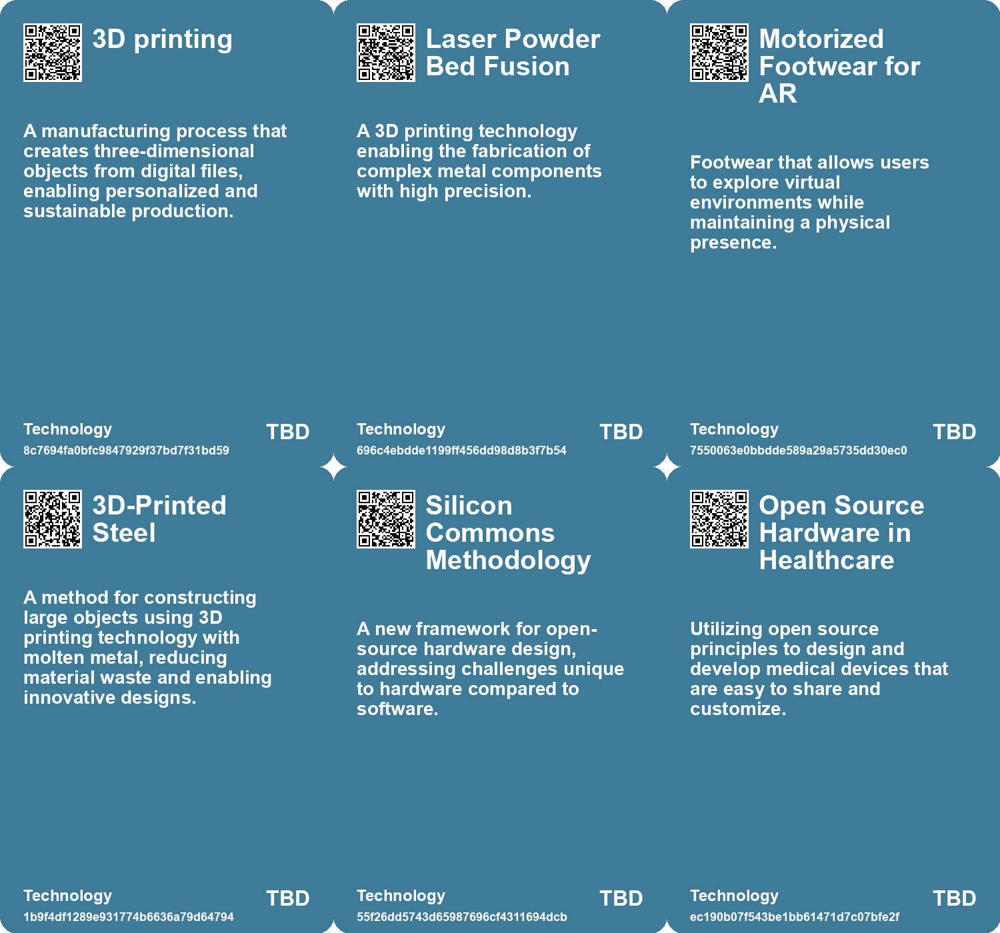

# *Topic*: Open Source, 3D Printable Footwear

# Summary

The intersection of technology and sustainability is increasingly evident in various sectors, from fashion to manufacturing. The launch of Syntilay, the first entirely AI-designed and 3D-printed footwear, exemplifies this trend. Priced at $149.99, these custom shoes aim to personalize the consumer experience while utilizing innovative design processes. Similarly, Stella McCartney's introduction of garments made from lab-grown Mylo™️ mushroom leather highlights a shift towards sustainable materials in fashion, reducing reliance on fossil fuels and promoting eco-friendly alternatives.

In manufacturing, Rapid Liquid Print is pioneering Gravity Free Manufacturing technology, which allows for mass customization and complex designs without traditional constraints. This method promises to reshape production capabilities across industries. The Open Source Imaging Initiative is also working to make medical imaging more accessible by developing open-source designs for MRI devices, aiming to reduce costs and enhance innovation in healthcare.

The integration of technology into everyday life is further explored through advancements in bioprinting and wearable tech. The Deep Tissue In Vivo Sound Printing (DISP) technique enables 3D printing of soft materials directly inside the body, offering less invasive treatment options for conditions like cancer. Meanwhile, the evolution of wearable technology is pushing the boundaries of human-machine interaction, with potential applications in augmented reality and social connectivity.

Open-source principles are gaining traction in the AI landscape, as seen in the coalition urging EU policymakers to protect open-source innovation amid the finalization of the EU AI Act. This movement emphasizes the importance of transparency and collaboration in AI development, countering the trend of proprietary systems. The release of DeepSeek's large language model under an MIT license further illustrates the shift towards open-source AI, challenging traditional deployment strategies and enhancing accessibility.

The exploration of new materials is also a significant theme. Researchers have developed a flexible, programmable microchip called Flex-RV, which operates without silicon, making it suitable for low-cost healthcare and wearable electronics. Additionally, a new class of all-ceramic material discovered at Northeastern University could revolutionize heat-emitting electronics, improving efficiency and design.

Lastly, the importance of visibility in production and manufacturing processes is underscored. The need to rethink supply chains and make the consequences of production visible is highlighted as a critical challenge for the 21st century. This call for transparency resonates across various sectors, from artisanal labor to industrial manufacturing, emphasizing the interconnectedness of technology, sustainability, and ethical practices in shaping the future.

# Seeds

|    | name                                         | description                                                                                               | change                                                                                                          | 10-year                                                                                                                  | driving-force                                                                                        |
|---:|:---------------------------------------------|:----------------------------------------------------------------------------------------------------------|:----------------------------------------------------------------------------------------------------------------|:-------------------------------------------------------------------------------------------------------------------------|:-----------------------------------------------------------------------------------------------------|
|  0 | Evolution of Metal 3D Printing Technology    | Emerging technologies in metal 3D printing making fabrication easier and faster.                          | Shift from traditional manufacturing to advanced 3D printing for intricate designs.                             | Metal 3D printing becomes standard in manufacturing, allowing for complex and efficient designs.                         | Need for rapid prototyping and customized manufacturing in various sectors.                          |
|  1 | Open-source Business Models                  | Growing interest in building businesses based on open-source principles.                                  | Transition from proprietary to collaborative and open business models.                                          | A rise in collaborative platforms and services that thrive on open-source contributions.                                 | Desire for innovation through collaboration and community engagement in business.                    |
|  2 | 3D-printed infrastructure                    | Emerging trend of using 3D printing technology for constructing infrastructure like bridges.              | Transitioning from traditional construction methods to additive manufacturing for structural components.        | Widespread adoption of 3D-printed materials in various infrastructure projects, reducing costs and environmental impact. | Advancements in additive manufacturing technology and a push for sustainable construction practices. |
|  3 | Silicon Commons Methodology                  | Development of a collaborative framework for open-source hardware design.                                 | Transition from traditional design methods to more decentralized and collaborative approaches.                  | In ten years, project collaboration in hardware could mirror open-source software communities.                           | Need for a structured governance model to facilitate collaboration among diverse partners.           |
|  4 | Community-Driven Innovation                  | Encouraging local customization of medical devices through community involvement and open-source designs. | Transitioning from one-size-fits-all devices to tailored solutions for local healthcare needs.                  | Increased innovation in medical technology, catering to specific regional health challenges.                             | The desire for localized solutions to meet diverse healthcare demands.                               |
|  5 | Regulatory Adaptation of Open Source Devices | Designing open-source prototypes to meet local regulatory standards for medical devices.                  | Moving from rigid regulatory compliance for commercial products to adaptable standards for open-source devices. | More open-source medical devices gaining regulatory approval, enhancing healthcare access.                               | The push for innovation while ensuring safety and effectiveness in medical technology.               |
|  6 | AI-Designed Footwear                         | The emergence of shoes designed entirely by AI technology.                                                | Shift from traditional shoe design methods to AI-generated designs.                                             | Widespread adoption of AI in fashion leading to personalized and innovative designs.                                     | Increasing consumer demand for personalization and unique products.                                  |
|  7 | 3D-Printing in Footwear                      | The use of 3D printing technology to create custom footwear.                                              | Transition from mass production to on-demand 3D-printed shoes for individual consumers.                         | Mainstream use of 3D printing in footwear allowing for mass customization and sustainability.                            | Advancements in 3D printing technology and consumer preference for custom fit.                       |
|  8 | Generational Shift in Entrepreneurship       | Young entrepreneurs like Ben Weiss leading innovative footwear companies.                                 | Emergence of younger leaders in traditional industries historically dominated by older generations.             | Younger entrepreneurs may redefine industries with fresh perspectives and tech-savvy approaches.                         | The rise of digital natives and their entrepreneurial ambitions.                                     |
|  9 | Collaborations in Footwear Design            | Influencers and brands partnering to create unique shoe designs.                                          | Shift from traditional brand-only designs to collaborative and influencer-driven products.                      | Increased collaboration may lead to diverse and innovative footwear options in the market.                               | The rise of social media influencers shaping consumer preferences and trends.                        |

# Concerns

|    | name                                      | description                                                                                                                                                |
|---:|:------------------------------------------|:-----------------------------------------------------------------------------------------------------------------------------------------------------------|
|  0 | Environmental Impact of New Technologies  | Introducing new technologies like laser cutting and 3D printing must be monitored to ensure they do not adversely affect the environment.                  |
|  1 | Quality Control in 3D Printing            | As metal 3D printing becomes widespread, ensuring quality and performance consistency in production may become critical.                                   |
|  2 | Open Source Exploitation                  | Large companies exploiting Open Source software for profit without contributing back, raising concerns about sustainability and fairness in the ecosystem. |
|  3 | High Costs of Support and Maintenance     | Open Source models may inadvertently lead to high customer support costs if issues arise with widely adopted but free software.                            |
|  4 | Sustainability of Materials               | The challenge of sourcing fully reclaimed materials for printing raises concerns about environmental sustainability and resource depletion.                |
|  5 | Environmental Impact of New Materials     | The adoption of 3D-printed materials needs to be assessed for long-term environmental impacts beyond immediate carbon savings.                             |
|  6 | Community Fragmentation                   | As open-source hardware grows, the potential for fragmentation within the developer community could hinder collaborative progress.                         |
|  7 | Regulatory Compliance Challenges          | Adapting open-source prototypes to meet local regulatory requirements may pose significant hurdles, affecting device legality and market entry.            |
|  8 | Environmental Impact of 3D Printing       | The production of footwear through 3D printing may have unknown ecological consequences due to materials used and waste produced.                          |
|  9 | Societal Pressure to Adopt Novelty Trends | The trend of ugly yet fashionable shoes may pressure consumers into purchasing non-traditional styles for social acceptance.                               |

# Cards

## Concerns

## Behaviors

## Issue

## Technology

# Links

* [Key Takeaways from OSPOS for Good 2024: The Role of Open Source in Sustainable Development](https://futures.kghosh.me/8dc0df9ec066b8cd1bca120998fc0f90)
* [Metaverse Standards Forum Launches to Promote Open Interoperability Standards in the Metaverse](https://futures.kghosh.me/860a73d350e4c3c2f2a63b06e61df132)
* [Stella McCartney's 20-Year Commitment: Introducing Mylo™️, Sustainable Mushroom Leather](https://futures.kghosh.me/babc175f444c7c8a095e0739f8ca9f96)
* [Innovative Eco-Friendly Sensors for Health Monitoring and Environmental Applications](https://futures.kghosh.me/0370fcd11fe23fc06dd8784115da238b)
* [DeepSeek-V3-0324 Launch: A Game-Changer in Open Source AI Technology](https://futures.kghosh.me/3ee955e2149cdab540660e9513852dfb)
* [Revolutionary Ultrasound Method Promises Safer, Less Invasive Surgical Procedures](https://futures.kghosh.me/bccb19f0e8600750a06777c4ccea673e)
* [The Future of Wearable Technology: Merging Cyborg Lifestyles with Daily Life](https://futures.kghosh.me/a81c4775b91ccd0db3e1b84da893ac6f)
* [Innovative 3D Printing Technique Revolutionizes In-Body Medical Applications](https://futures.kghosh.me/b650d2500235b72478de21bf9c0928ec)
* [Advancements in Titanium Multi-Topology Metamaterials for High-Temperature Applications](https://futures.kghosh.me/20bb9bd3a253c043a7eaee3a75d9c834)
* [Syntilay: The First AI-Designed 3D-Printed Sandal Set to Revolutionize Footwear](https://futures.kghosh.me/e2e799e3eec308b59d22e8dc9e0f72e7)
* [Northeastern Researchers Discover Thermoformable Ceramics for Electronics Cooling Solutions](https://futures.kghosh.me/bd35b1587de303b44a62d0e99fb749fc)
* [Empowering Artisanal Labor through Technology and Community Collaboration in Detroit](https://futures.kghosh.me/9069cc46631b516b7780b893c126086e)
* [OpenTitan Launches First Commercial Open-Source Silicon Chip with Built-in Security Features](https://futures.kghosh.me/ad7895e2affd5d3a30c8cfaca7f814ec)
* [Exploring the Rise of Open Source AI in Enterprises: Key Findings and Trends](https://futures.kghosh.me/0abf112a6559f5a14e4db206af1db78a)
* [Open-Source AI Leaders Urge EU to Protect Innovation in Upcoming AI Act](https://futures.kghosh.me/11bd695b887aa09dca79341f91ce6b82)
* [Innovative Lensless Camera Captures 3D Images with Single Exposure for Various Applications](https://futures.kghosh.me/8bb1226617cfc9b177ec5976f3716680)
* [Open Source Imaging Initiative: Making MRI Technology Affordable and Accessible Globally](https://futures.kghosh.me/180db5379fd2e3f464d754d6d2eb27cb)
* [Revolutionizing Civil Engineering: The World's First 3D-Printed Steel Bridge and Its Digital Twin Technology](https://futures.kghosh.me/73bdb86789ac19a60022e3bc5bb2b532)
* [Revolutionizing Electronics: The First Flexible Programmable Microchip Without Silicon](https://futures.kghosh.me/a4e006bf91f0a903f2362490ce71c7dd)
* [Understanding Open Source Businesses: A Guide to Pricing Models and Strategies](https://futures.kghosh.me/578c4ca8c38df5eb168308242e9ea711)
* [The Evolution of Open Source: Understanding AI Models and Community Perspectives](https://futures.kghosh.me/ab65e19023994f8f7774408b7a7cc920)
* [Print Object: An Annual Celebration of Analog Practices and Thoughtful Distribution](https://futures.kghosh.me/1c98afd188af29f3c99a822dad8a1d3a)
* [Exploring Cookies, Supply Chains, and Future Challenges in Technology and Consumption](https://futures.kghosh.me/fa27e27bdec01712d582ab0f61c95bac)
* [Mushrooms as Biodegradable Alternatives for Electronic Devices and Medical Implants](https://futures.kghosh.me/58b1d4282237f41c4a33e71179c1ea4b)