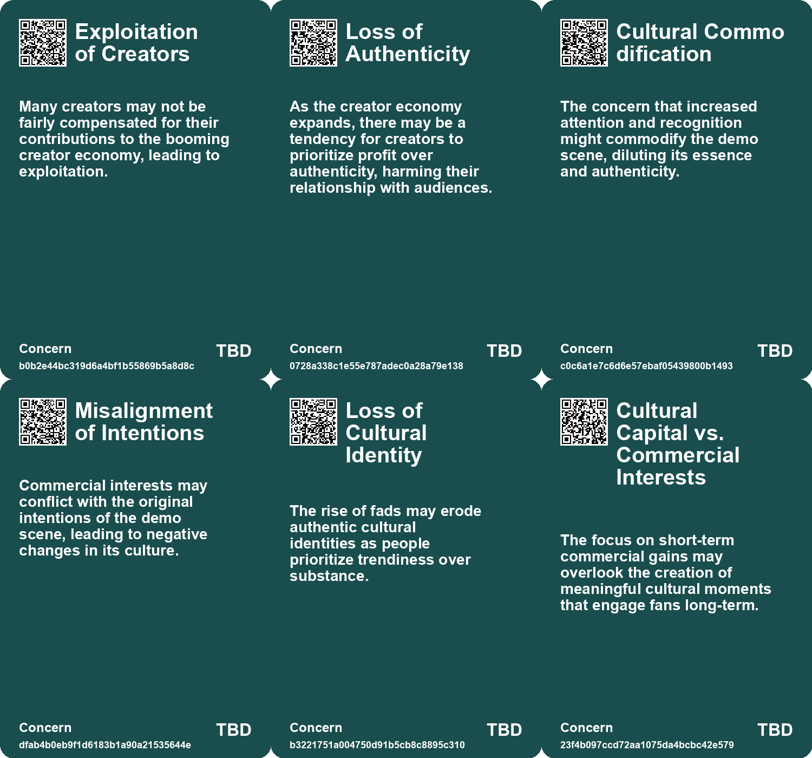
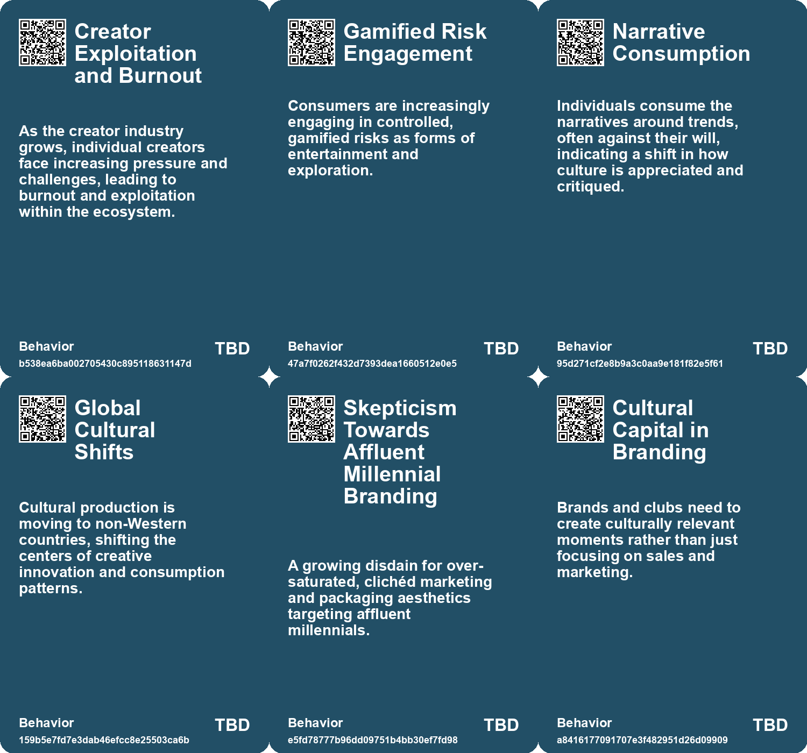
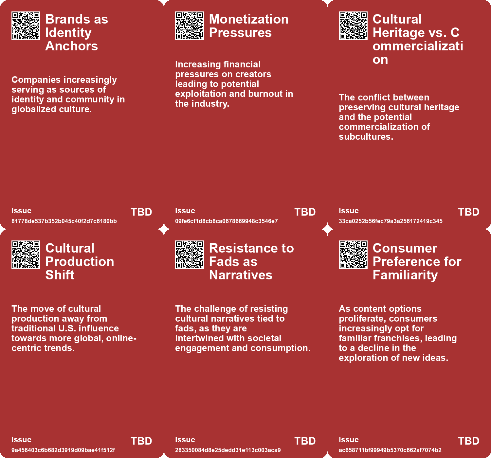
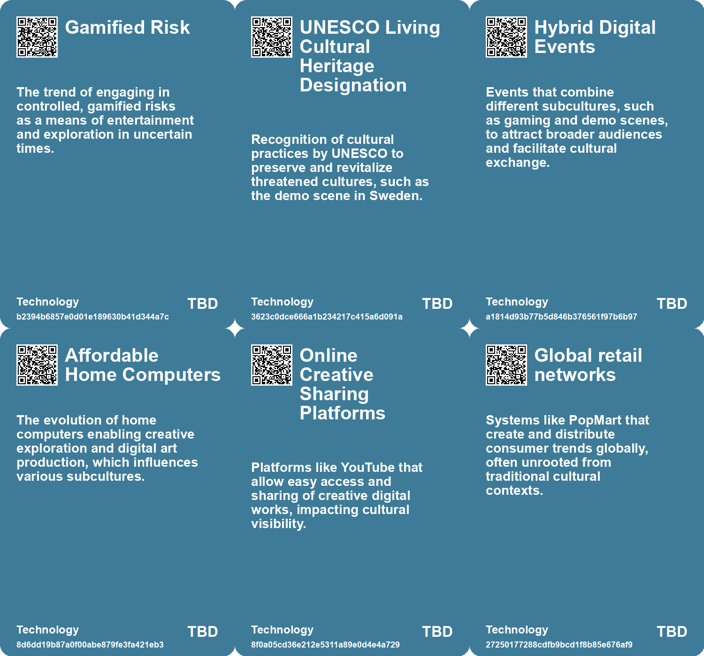

# *Topic*: Over-commercialization of Cultural Exp

# Summary

The landscape of governance is shifting, with a notable decline in democratic institutions and a rise in autocratic governance, particularly in the West. By 2040, this trend is expected to lead to fragmented global power dynamics and the emergence of new cultural movements. Concepts like Decorp Culture and Safety Culture will redefine consumer behavior, emphasizing minimalism and pleasure. Grassroots movements are anticipated to gain momentum as younger generations challenge existing systems, merging technological advancements with alternative spiritualities to create new societal norms.

In the realm of entertainment, a cultural oligopoly has emerged, dominated by a few major players. This consolidation stifles creativity, as the market is flooded with remakes and sequels, leaving little room for original content. Despite this, there remains potential for unique voices to thrive if consumers actively seek diverse offerings. The entertainment industry is also grappling with the impact of generative AI, which, while offering new opportunities, poses threats to traditional creative professions. The vast amount of online content serves as training data for AI, raising concerns about the exploitation of artists' work.

The rise of brand communities marks a significant shift in marketing strategies. Event marketers are increasingly focusing on community-driven approaches to foster deeper connections with consumers. Successful examples from major tech companies illustrate the importance of aligning event marketing with community engagement to enhance customer relationships. This trend reflects a broader cultural desire for authenticity and emotional connections, particularly among younger consumers who prioritize meaningful interactions over traditional brand loyalty.

Cultural trends are also evolving, with a growing emphasis on authenticity and deeper connections amid societal challenges. Consumers are gravitating towards brands that embody these values, revealing market opportunities for those willing to adapt. The fragmentation of culture, driven by the internet and AI, is democratizing content production, allowing for greater creativity but also leading to a splintering of popular culture. This shift necessitates a reevaluation of how brands engage with their audiences, as the demand for genuine experiences rises.

The creator economy is expanding rapidly, projected to reach $500 billion by 2027. However, this growth comes with hidden challenges, as creators face increasing pressure to develop personal brands and engage in self-promotion. The rise of influencer marketing has transformed brand strategies, but it often overshadows the toll this success takes on individual creators. The need for a more supportive framework that prioritizes artists' rights and well-being is becoming increasingly urgent.

In the context of societal issues, the concept of "Failure to Launch" highlights the struggles many young men face in transitioning to adulthood. This cultural phenomenon reflects a lack of clear developmental pathways and rituals, exacerbated by the fast-paced nature of modern life. Addressing these challenges requires a focus on providing young men with the tools to navigate their identities in a rapidly changing world.

Finally, the rise of corporate espionage poses significant risks across industries. As companies increasingly rely on digital platforms, protecting intellectual property has become more challenging. The sophistication of online hackers and the growth of the intangible economy necessitate proactive measures to safeguard trade secrets. Legislative protections have improved, but many firms still struggle to manage their intellectual assets effectively, highlighting the need for vigilance in an era of heightened competition and risk.

# Seeds

|    | name                                                    | description                                                                                             | change                                                                                                   | 10-year                                                                                                               | driving-force                                                                                  |
|---:|:--------------------------------------------------------|:--------------------------------------------------------------------------------------------------------|:---------------------------------------------------------------------------------------------------------|:----------------------------------------------------------------------------------------------------------------------|:-----------------------------------------------------------------------------------------------|
|  0 | Shift in Cultural Production Base                       | Cultural production is moving away from the U.S. to online-first trend-driven cultures.                 | A transition from U.S.-centric cultural production to global, primarily online-driven production.        | Expect to see a diverse range of cultural outputs originating from non-Western countries.                             | The rise of social media platforms promoting rapid trend cycles and global connectivity.       |
|  1 | Environmental Awareness through Indigenous Perspectives | Art reflects the connection between colonization and environmental degradation.                         | From general environmental discourse to focusing on Indigenous narratives and solutions.                 | Indigenous-led environmental initiatives may reshape conservation efforts globally.                                   | Urgent need to address climate change through historically rooted approaches.                  |
|  2 | Capitalism's Discontents                                | Increasing unease about rampant capitalism affecting communal experiences.                              | Shift from traditional communal experiences to isolated, capital-driven ones.                            | A society more fragmented by economic models prioritizing profit over community.                                      | Growing discontent with capitalism's impact on personal and communal well-being.               |
|  3 | Cultural Fragmentation                                  | The decline in shared cultural references amidst rising digital content.                                | Shifting from a shared mainstream culture to a highly diversified culture.                               | Cultural experiences will increasingly cater to niche interests over mainstream trends.                               | The internet and AI will continue to allow diverse content creation and distribution.          |
|  4 | Rethinking Football Branded Experience                  | Clubs must focus on cultural relevance and emotional connections over traditional marketing strategies. | Transition from traditional, passive fan engagement to authentic storytelling and emotional connections. | Football will prioritize genuine interactions and memorable moments over established rituals and passive consumption. | Gen Z fans demand cultural capital and emotional engagement in their football experiences.     |
|  5 | Changing Symbolism of Merchandise                       | Merchandise now represents cultural and aesthetic value rather than club legacy or loyalty.             | A transition to seeing merchandise as cultural statements rather than symbols of allegiance.             | Merchandise will be embraced for its cultural significance, transcending traditional club loyalty.                    | Fans prioritize aesthetics and cultural relevance over blind allegiance to clubs.              |
|  6 | Decline of Urban Artistic Scenius                       | Decrease in interconnected artistic communities due to rising real estate prices and technology.        | From vibrant, collaborative artistic environments to isolated, commodified cultural experiences.         | Artistic movements may fragment further, leading to a decline in shared cultural breakthroughs.                       | Economic pressures and technological changes affecting the arts and culture landscape.         |
|  7 | Cultural Prestige vs. Economic Output                   | UK leverages cultural prestige while economic productivity stagnates.                                   | Transition from a focus on soft power to a need for hard economic value creation.                        | In a decade, the UK may struggle with identity as soft power fails to sustain economic needs.                         | The need for economic resilience in the face of global competition pushes for reform.          |
|  8 | Cultural Criticism Decline                              | Reduction in professional cultural critics, replaced by influencers and user-generated content.         | Decline of traditional journalism and criticism in favor of influencer-led content creation.             | In 10 years, cultural criticism will be dominated by influencers, affecting the quality of art criticism.             | Economic pressures on media outlets are leading to layoffs and the rise of influencer culture. |
|  9 | Commodification of Self                                 | Individuals increasingly commodify their personal lives and identities for economic security.           | Transition from viewing self-promotion as negative to a necessity for survival in the modern economy.    | In 10 years, commodifying personal identity will be normalized as a standard practice for economic stability.         | The rise of social media and economic precarity has made self-commodification essential.       |

# Concerns

|    | name                                      | description                                                                                                                                             |
|---:|:------------------------------------------|:--------------------------------------------------------------------------------------------------------------------------------------------------------|
|  0 | Exploitation of Creators                  | Many creators may not be fairly compensated for their contributions to the booming creator economy, leading to exploitation.                            |
|  1 | Loss of Authenticity                      | As the creator economy expands, there may be a tendency for creators to prioritize profit over authenticity, harming their relationship with audiences. |
|  2 | Cultural Commodification                  | The concern that increased attention and recognition might commodify the demo scene, diluting its essence and authenticity.                             |
|  3 | Misalignment of Intentions                | Commercial interests may conflict with the original intentions of the demo scene, leading to negative changes in its culture.                           |
|  4 | Loss of Cultural Identity                 | The rise of fads may erode authentic cultural identities as people prioritize trendiness over substance.                                                |
|  5 | Cultural Capital vs. Commercial Interests | The focus on short-term commercial gains may overlook the creation of meaningful cultural moments that engage fans long-term.                           |
|  6 | Loss of Artistic Communities              | Rising costs and technology are disbanding urban cultural clusters, leading to stagnation of artistic innovation.                                       |
|  7 | Erosion of Cultural Consensus             | The fragmentation and commodification of subcultures may prevent the emergence of new artistic movements and shared creativity.                         |
|  8 | Authenticity vs. Commercialism            | The tension between creating authentic art and commercial viability pressures creators to compromise their artistic integrity.                          |
|  9 | Cultural Staleness in Entertainment       | The entertainment industry’s focus on commercial franchises limits creative expression and cultural diversity in film and media.                        |

# Cards

## Concerns

## Behaviors

## Issue

## Technology

# Links

* [Understanding 'Failure to Launch': The Cultural and Economic Struggles of Young American Men](https://futures.kghosh.me/c6a3cc9fe503779d0ad2ec2c66aa7fb8)
* [The Burden of Self-Promotion: Navigating Art in the Age of Personal Branding](https://futures.kghosh.me/2306b74e2c380b5208c7752bd78c4e12)
* [Exploring the Modern Entertainment Landscape and Its Societal Implications](https://futures.kghosh.me/c5c2c794f1426e6e307a9df3f9ff61f6)
* [The Impact of Generative AI on Creative Professions and the Need for New Data Rights Frameworks](https://futures.kghosh.me/858dac884c8fe7dfa6fc0c2cf093e97f)
* [Exploring the Cultural and Economic Impact of Fads Like Labubu in the 21st Century](https://futures.kghosh.me/be6b5b1f64e2a032cdef6417b4b84a7e)
* [The Fourth Era of Brand Communities: Integrating Events with Marketing Strategies](https://futures.kghosh.me/c179345a7154fb8f3f2f4209ed487406)
* [Understanding Economic Termites: Hidden Monopolies Driving Up Costs and Eroding Trust](https://futures.kghosh.me/ff9fdda9334a55cda4fd1788668b3e15)
* [Exploring Kate Soper’s Vision for Sustainable Living in 'Post-Growth Living'](https://futures.kghosh.me/71cbf82b85b58a6675d05308f8e1759e)
* [The Entertainment and Media Industry's Shift: Growth Challenges and Opportunities Ahead](https://futures.kghosh.me/c18691583943e0d2d1e217558293d06b)
* [The Rise of Cultural Oligopoly: A Call for Diversity in Media](https://futures.kghosh.me/317aa39c987f1d5e3509dbc5e50c8bb3)
* [Exploring Enshittification, Futures Thinking in Architecture, and the Decline of Urban Scenius](https://futures.kghosh.me/4c0323220b8e42ef6b79dd4d720ce80a)
* [The Creator Economy's Hidden Costs: Pressures Facing Modern Creators](https://futures.kghosh.me/27796e2cafeeaf48a8efbf2bb779b65d)
* [The Rise of the Symbolic Economy: Identity Through Consumption in a Globalized World](https://futures.kghosh.me/f836699644240599a4284c78b9ade0e1)
* [Exploring the Disconnection Between AI Promises and Reality at CES 2023](https://futures.kghosh.me/761a3d9b508c2a1db7a6c60d1be5ec98)
* [Exploring Futurism in Indigenous Art: Future Imaginaries Exhibit](https://futures.kghosh.me/d688ddddbb61a934e594c21b14d2aaf6)
* [Nostalgia for Simplicity: The Burden of Infinite Choice in Modern Life](https://futures.kghosh.me/7b316ebe449187b79e519a8c6d12a2cd)
* [Calibrating Future Experiences: Engaging Audiences Through Tailored Artefacts](https://futures.kghosh.me/60ca937aa44bdaf31b5128e3b4f01fe9)
* [The UK's Declining Geopolitical Relevance and Elite Inaction: A Historical Perspective](https://futures.kghosh.me/ca555520973a0e8519ff854da1de4d88)
* [Navigating the AI Revolution: Displacement, Authenticity, and Trust in Digital Content](https://futures.kghosh.me/19b33a2f2bd407e37ddde7951fd18ee8)
* [Exploring Cultural Fusion in Dance and Lessons from the Battle of Crecy](https://futures.kghosh.me/0eec94d49d73ca7a3669da31cea25e51)
* [Critique of Millennial Branding in Consumer Packaging and Its Impact](https://futures.kghosh.me/15c3e276ff4d0cdae6da27cb3d8431c5)
* [Gen Z Fans: The Driving Force Behind Football's Cultural Evolution and Club Rebranding Needs](https://futures.kghosh.me/9604795eab80d63958b4a94cd73d3a82)
* [Exploring the Cultural Trends Shaping Consumer Behavior in 2026](https://futures.kghosh.me/05be870bd93b19dc0390539dc923ae7b)
* [AI's Role in Fragmenting Culture and Software: A New Era of Creation](https://futures.kghosh.me/c25f207450d56b52443cc95f158d4138)
* [Future Trends Post-2024: Declining Democracies and Emerging Cultural Shifts](https://futures.kghosh.me/bd1b01636b1360716b5951e1cac42724)
* [The Demo Scene: A Cultural Legacy Facing Decline and Change](https://futures.kghosh.me/d81db4d6acedbfe1945cc1bb5e64d43e)