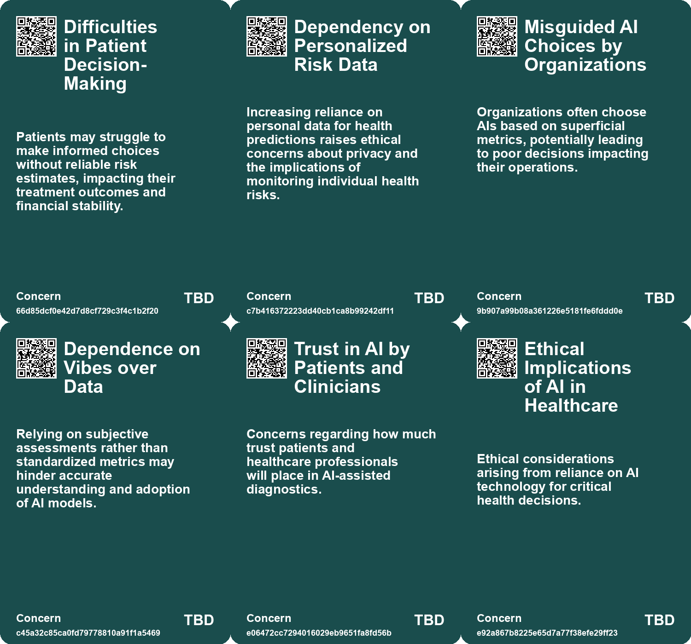
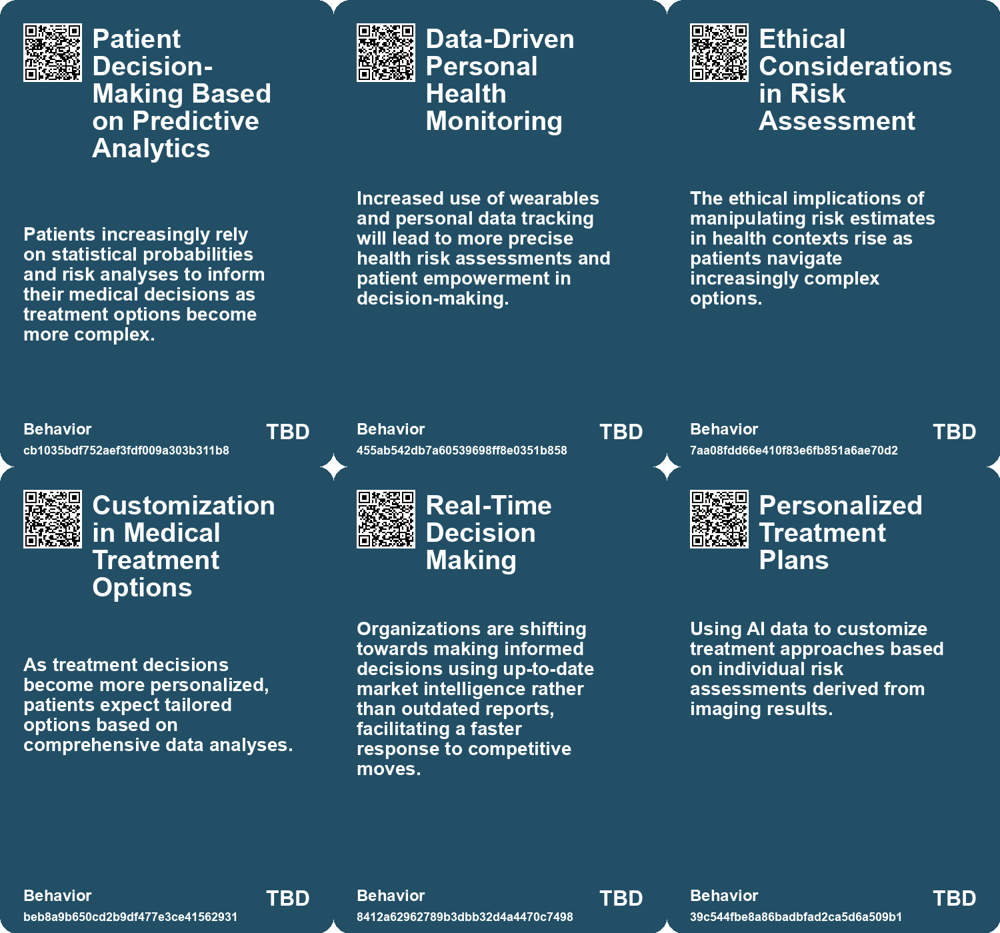
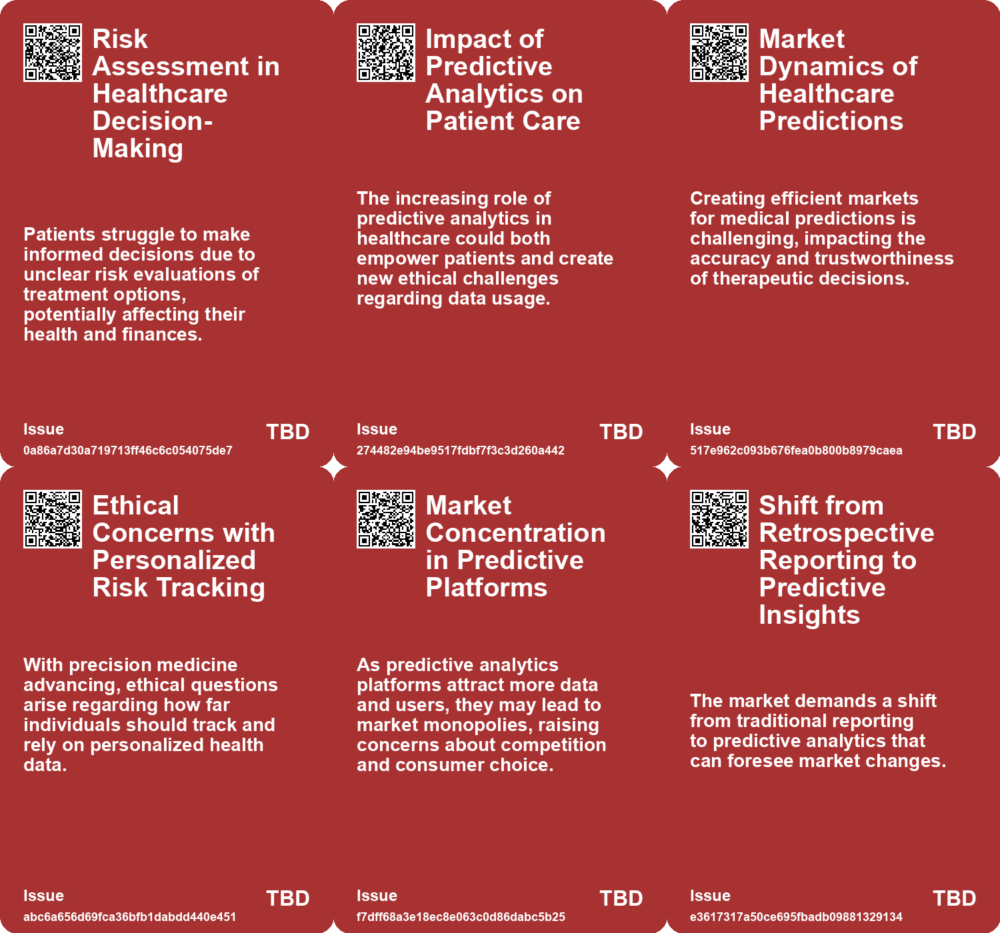
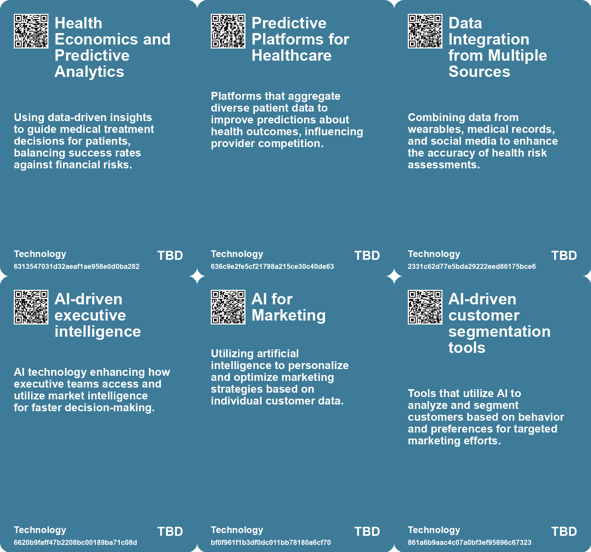

# *Topic*: Patient Decision-Making Based on Analytics

# Summary

The intersection of artificial intelligence (AI) and healthcare is a prominent theme, with various studies highlighting its potential to enhance patient outcomes. A Canadian study demonstrated that an AI-based early warning system significantly reduced unexpected deaths in hospitals. Similarly, a national trial in the U.S. is assessing AI's effectiveness in interpreting mammograms, aiming to improve breast cancer detection while minimizing patient anxiety. These initiatives underscore AI's role in supporting healthcare professionals rather than replacing them.

Generative AI is reshaping business operations, yet many organizations struggle with its implementation. A recent report revealed that a staggering 95% of enterprise AI pilots fail to deliver measurable business impact, primarily due to poor integration with existing workflows. Despite the challenges, generative AI offers opportunities for increased productivity, particularly in back-office functions. Companies are encouraged to adopt a human-first approach, augmenting rather than replacing human capabilities to avoid costly mistakes.

The use of AI in customer service is also gaining traction. Research indicates that AI tools can boost productivity among customer support agents, particularly benefiting less experienced workers. This technology not only enhances employee performance but also improves customer sentiment and retention. As businesses increasingly rely on AI, the need for effective training and integration becomes critical.

Data quality remains a significant concern across industries. Poor data quality can cost organizations millions annually, prompting the development of real-time intelligence platforms that provide executives with timely insights. These tools aim to enhance decision-making by delivering accurate and relevant information, addressing the challenges posed by outdated data.

The ethical implications of AI and data usage are under scrutiny. The Federal Trade Commission is investigating major companies for their use of customer data in dynamic pricing practices, raising questions about privacy and consumer protection. Additionally, the conversation around data participation emphasizes the need for transparency and consent, particularly as AI technologies evolve.

In the realm of marketing, customer-driven strategies are becoming essential. The rise of digital twins—virtual models of customers—enables hyper-personalization, allowing businesses to better understand and respond to individual needs. This shift towards personalized marketing is facilitated by AI-powered tools that optimize campaigns and enhance customer engagement.

Finally, the challenges of AI adoption are evident in the increasing number of project failures. A survey found that 42% of AI initiatives were abandoned in 2023, highlighting the need for organizations to learn from past mistakes. Embracing a culture of experimentation and collaboration can help businesses navigate the complexities of AI technology and drive successful outcomes.

# Seeds

|    | name                                          | description                                                                                                     | change                                                                                               | 10-year                                                                                              | driving-force                                                                                           |
|---:|:----------------------------------------------|:----------------------------------------------------------------------------------------------------------------|:-----------------------------------------------------------------------------------------------------|:-----------------------------------------------------------------------------------------------------|:--------------------------------------------------------------------------------------------------------|
|  0 | Competition in Health Prediction              | Emerging competition among prediction publishers is shaping health decision-making.                             | Shift from reliance on singular methods to diverse sources for health predictions.                   | Expect a wider range of predictive platforms influencing patient decisions and treatment options.    | The necessity for accurate health predictions to support informed patient choices in treatment.         |
|  1 | Personalized Risk Assessment Technology       | Technological advancements allow for personalized risk assessments of medical treatments.                       | Transition from generalized risk assessments to personalized and data-driven predictions.            | Increased integration of wearables and personal data could revolutionize proactive healthcare.       | Growing patient demand for tailored health information and preventative measures.                       |
|  2 | Consumer Accountability in Healthcare Choices | Patients may become more critical of health predictions and treatment choices.                                  | Shift towards active questioning of healthcare predictions and transparency in treatment results.    | A more informed patient base could lead to improved treatment negotiations and expectations.         | Growing awareness and skepticism about the accuracy of health risk assessments.                         |
|  3 | Patient-Centric AI Evaluation                 | Involving patient feedback in assessing AI's role in mammography.                                               | Moving from radiologist-centric evaluations to incorporating patient perspectives in AI assessments. | Patient engagement could redefine how AI tools are developed and assessed in clinical settings.      | Recognizing the importance of patient experiences and trust in AI applications in healthcare.           |
|  4 | AI Shaping Treatment Decisions                | AI analysis influences clinical decisions on patient treatments significantly.                                  | From clinical intuition to data-driven decision-making in patient care.                              | Treatment protocols will be increasingly personalized based on predictive analytics from AI.         | The need for evidence-based treatment plans to improve patient outcomes.                                |
|  5 | AI Early Warning Systems in Healthcare        | AI tools like Chartwatch are being developed to alert healthcare providers about patient deterioration earlier. | Shift from reactive to proactive healthcare interventions using AI technology.                       | Widespread adoption of AI tools could significantly reduce preventable deaths in hospitals globally. | The need for improved patient outcomes and efficiency in healthcare, especially amidst staff shortages. |
|  6 | Data-Driven Policy Making                     | The use of data science in understanding public feedback is gaining traction.                                   | Move from intuition-based policy making to data-informed decisions.                                  | Policies will increasingly rely on data analysis, leading to more evidence-based governance.         | The push for more effective and responsive governance fueled by data analytics.                         |
|  7 | Efficiency in Government Spending             | Potential savings from automating consultation analysis could be significant.                                   | Shift from high-cost manual analysis to efficient automated solutions.                               | Government consultation costs will be dramatically reduced, reallocating funds to other areas.       | Pressure to optimize government budgets and reduce wasteful spending.                                   |
|  8 | Data-Driven Insights Over Hype                | Businesses are recognizing the need for data-backed insights rather than hype-driven adoption of generative AI. | Shifting from hype-based to strategic, data-informed decision-making in AI utilization.              | By 2033, companies will rely heavily on custom research to inform their AI strategies.               | The need for businesses to differentiate themselves in a crowded market through informed choices.       |
|  9 | AI in Pricing Strategies                      | Rise of AI technologies influencing pricing decisions.                                                          | Shift from traditional pricing methods to AI-driven dynamic pricing models.                          | Widespread adoption of AI could lead to more personalized pricing but raise ethical concerns.        | Technological advancements and the competitive pressure to optimize pricing.                            |

# Concerns

|    | name                                     | description                                                                                                                                                   |
|---:|:-----------------------------------------|:--------------------------------------------------------------------------------------------------------------------------------------------------------------|
|  0 | Difficulties in Patient Decision-Making  | Patients may struggle to make informed choices without reliable risk estimates, impacting their treatment outcomes and financial stability.                   |
|  1 | Dependency on Personalized Risk Data     | Increasing reliance on personal data for health predictions raises ethical concerns about privacy and the implications of monitoring individual health risks. |
|  2 | Misguided AI Choices by Organizations    | Organizations often choose AIs based on superficial metrics, potentially leading to poor decisions impacting their operations.                                |
|  3 | Dependence on Vibes over Data            | Relying on subjective assessments rather than standardized metrics may hinder accurate understanding and adoption of AI models.                               |
|  4 | Trust in AI by Patients and Clinicians   | Concerns regarding how much trust patients and healthcare professionals will place in AI-assisted diagnostics.                                                |
|  5 | Ethical Implications of AI in Healthcare | Ethical considerations arising from reliance on AI technology for critical health decisions.                                                                  |
|  6 | Data Privacy Concerns                    | Using AI and large datasets for predictive analysis raises concerns about patient data privacy and security.                                                  |
|  7 | Dependence on AI in healthcare           | Overreliance on AI systems like Chartwatch may lead to decreased clinical judgment and intuition among healthcare providers.                                  |
|  8 | Vendor Reliability and Quality           | The risk of acquiring inaccurate or misleading data from vendors presents challenges in making informed investment decisions.                                 |
|  9 | Algorithmic Misinterpretation            | The danger that AI systems may misinterpret complex data and lead to poor strategic decision-making based on faulty analytics.                                |

# Cards

## Concerns

## Behaviors

## Issue

## Technology

# Links

* [Understanding the 95% AI Pilot Failure Rate and How to Achieve Success](https://futures.kghosh.me/381b17bbec6c2957fe0995c6813483d0)
* [Enhancing Cyber Insurance Accessibility and Affordability Through AI Innovations](https://futures.kghosh.me/724dfbad882cc57ee4e3526f4f43327b)
* [MIT Study Reveals High Failure Rate of Enterprise AI Implementations Due to Poor Integration](https://futures.kghosh.me/a6a18a39971f1bcdb555339c05b4dbc5)
* [Navigating Medical Choices and Risk Predictions in B. Pladek's "Yellow"](https://futures.kghosh.me/953333a1272ca4b87dcc2e3296fb861d)
* [Exploring Cookies, Supply Chains, and Future Challenges in Technology and Consumption](https://futures.kghosh.me/fa27e27bdec01712d582ab0f61c95bac)
* [AI Early Warning System Reduces Unexpected Hospital Deaths by 26% in Canadian Study](https://futures.kghosh.me/2626f231f7df229a68e93bd2a129f234)
* [Transforming Marketing with Customer Driven Strategies and Digital Twins](https://futures.kghosh.me/f5a86c6c3c113719814d2772bea54508)
* [Enhancing Government Consultations: AI Tool for Faster Analysis of Public Responses](https://futures.kghosh.me/a94061ecae4e2f9cf7ee7680b9bdeb5f)
* [Navigating Generative AI: The Importance of Custom Research for Effective Adoption](https://futures.kghosh.me/ed237776f4979a2104f62c4985fbeba8)
* [FTC Investigates Major Firms Over Surveillance Pricing Practices and Consumer Privacy Concerns](https://futures.kghosh.me/ff0593173e75f7c7e19b150fa4081609)
* [Unlocking the Potential of Generative AI: Strategies for Business Impact](https://futures.kghosh.me/cff1a5331e2a0947c902edfd1aa39f6a)
* [Navigating Decision-Making Challenges in an AI-Driven World: The Need for AAA Traits](https://futures.kghosh.me/c474eac8117547a89cac2c805652df9c)
* [Five Emerging Trends Transforming Business in the Coming Year](https://futures.kghosh.me/55bac03899915f25bf0b47fa4342472c)
* [Understanding the Three C’s of Data Participation: Context, Consent, and Control in AI](https://futures.kghosh.me/2251d443897c8e2b1369bb144d9252b5)
* [Evaluating AI Effectiveness: The Need for Customized Assessments Beyond Standard Benchmarks](https://futures.kghosh.me/18de8dd66f7714385f35628458d7671a)
* [Growing Use of Alternative Data Among Investors Amid Regulatory Scrutiny and Rising Costs](https://futures.kghosh.me/6df05418720b20b7f2cec0056111cae6)
* [Navigating the Challenges and Opportunities of Generative AI in Business](https://futures.kghosh.me/6a8633d1148eb442435b9f6bca735ad3)
* [Examining the Effects of AI on Knowledge Worker Performance: A Study with Boston Consulting Group](https://futures.kghosh.me/c63bd059cb529b72b00ecbdcd2f85268)
* [AI System Aims to Predict Heart Attack Risks and Save Lives in the UK](https://futures.kghosh.me/dead7bfcd66251606f35ea6015f2447c)
* [The AI Implementation Crisis: Emphasizing Human-AI Collaboration to Avoid Regret](https://futures.kghosh.me/6169720fb37bbac4dedfce5795d91cd5)
* [The Transformative Role of Generative AI in Supply Chain and Marketing Management](https://futures.kghosh.me/1b46caa07ff58af58c2e1cf51b86402d)
* [UC Davis Health Leads $16 Million Study on AI in Mammogram Interpretation for Breast Cancer Detection](https://futures.kghosh.me/846c0e3bad3cff41ac11609ecb907b14)
* [Embracing Active Participation: The Future of Marketing Strategy Beyond Research](https://futures.kghosh.me/f4f9579fbdccca76650636b6273a4870)
* [Introducing CEO Agent: Real-Time Intelligence for Executive Decision-Making](https://futures.kghosh.me/4961d6c22248006fc033daf3e45cf349)
* [Rising AI Project Failures Among Enterprises: Challenges and Insights for 2023](https://futures.kghosh.me/dff752bdc4a60d242f9040d19081c206)