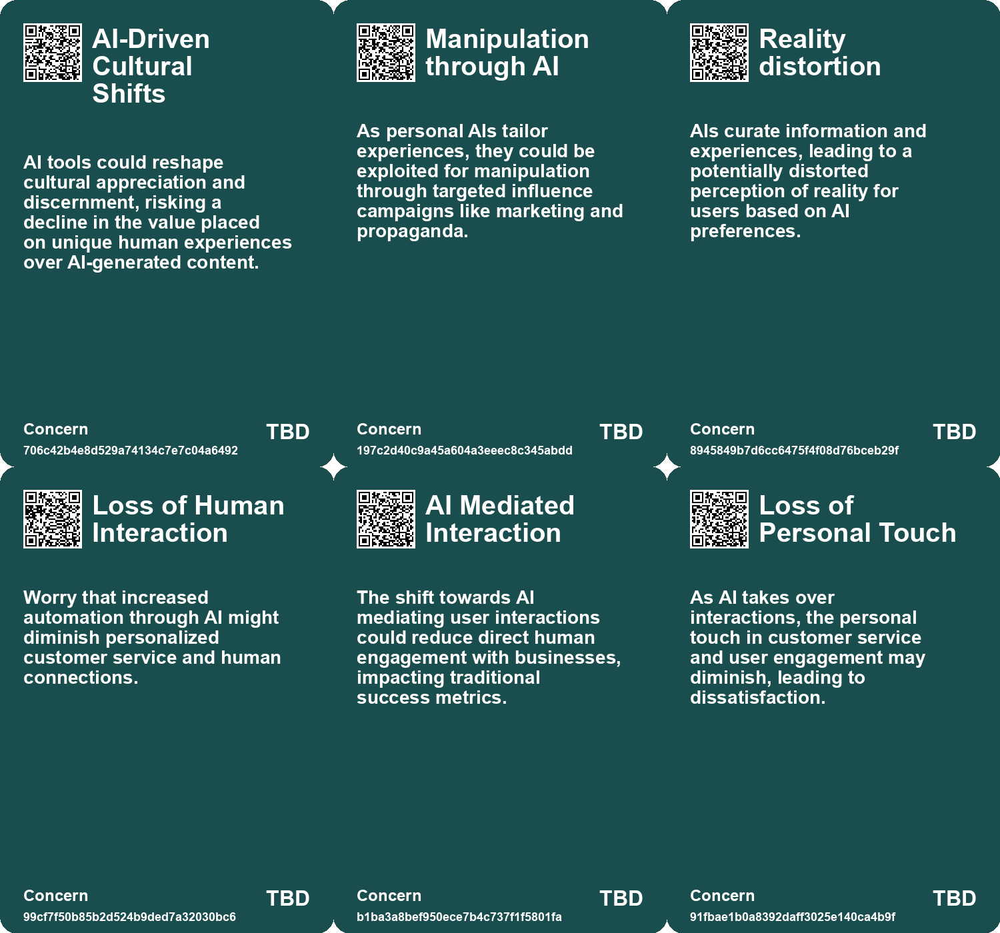
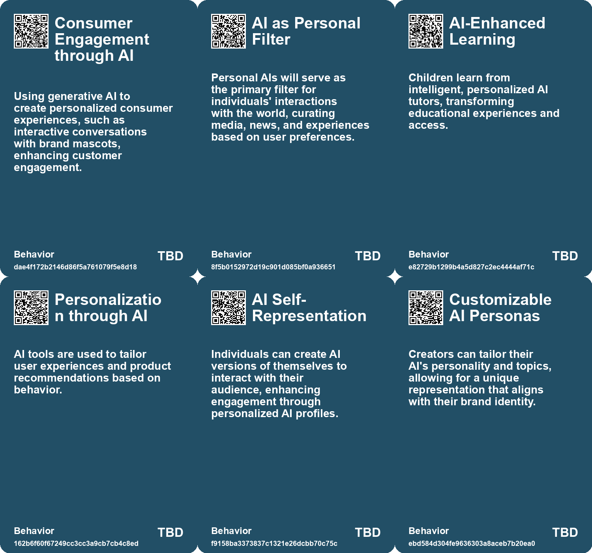
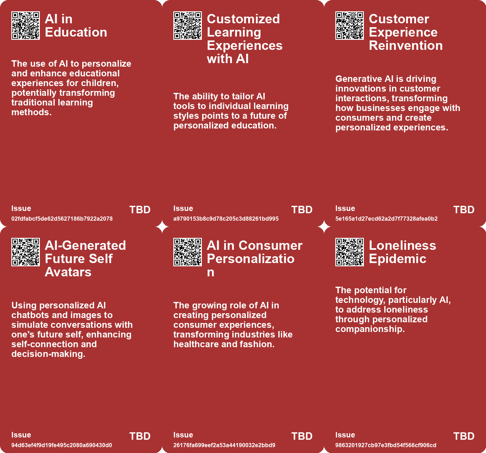
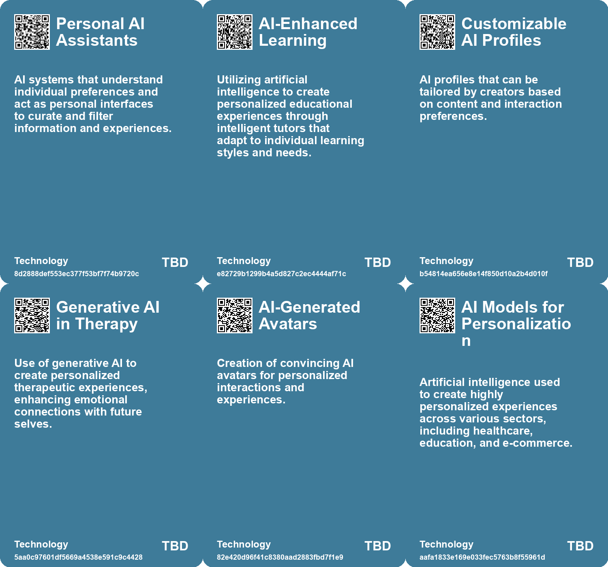

# *Topic*: Personalized AI Experiences

# Summary

The rise of personal AI assistants is reshaping how individuals interact with technology and the world around them. These assistants are expected to become primary interfaces, curating information and managing tasks based on extensive personal data. While they promise convenience, concerns about manipulation and security are paramount, as these AIs will filter reality and influence decision-making.

In education, AI is transforming learning experiences through personalized tutoring and interactive methods. The integration of AI in classrooms aims to enhance engagement and foster active learning, moving away from traditional educational paradigms. This shift highlights the potential for AI to democratize access to quality education, although careful implementation is necessary to avoid prioritizing profit over educational value.

Generative AI is making significant inroads in business, with companies exploring its potential to automate workflows and enhance productivity. The use of AI tools in customer support has shown promising results, particularly for less experienced workers, by improving efficiency and knowledge sharing. However, businesses face challenges in developing clear strategies for AI adoption and must balance the benefits with ethical considerations.

The concept of hyper-personalization is gaining traction, driven by advancements in AI technology. This trend reflects a cultural shift towards individualism, where tailored experiences are increasingly expected across various sectors, including healthcare and consumerism. While hyper-personalization can enhance user engagement, it raises questions about privacy and the implications of such tailored interactions.

AI companionship is emerging as a new phenomenon, with potential psychological impacts on users. The allure of AI companions may address feelings of loneliness but also poses risks of addiction and emotional detachment. Understanding the dynamics of these relationships is crucial for developing effective regulations that protect users while respecting personal freedoms.

In the realm of marketing, companies like Coca-Cola are leveraging generative AI to enhance creative campaigns. The integration of AI in marketing strategies aims to balance human creativity with technological capabilities, fostering innovation while addressing the challenges of effective implementation. This approach underscores the importance of maintaining human oversight in creative processes.

As AI continues to evolve, the demand for skilled professionals in AI-related roles is increasing. Business schools are adapting their curriculums to prepare graduates for a job market that increasingly values technology skills. This shift emphasizes the need for a comprehensive understanding of AI's impact on the future of work, ensuring that graduates are equipped to navigate an AI-driven landscape. 

The anticipated growth of AI hardware devices is set to further enhance the capabilities of AI technology. Companies are exploring new form factors and interactions, indicating a commitment to integrating AI into various industries. This ongoing innovation highlights the transformative potential of AI across sectors, from customer service to education, as organizations seek to harness its benefits while addressing associated challenges.

# Seeds

|    | name                               | description                                                                                | change                                                                                           | 10-year                                                                                                             | driving-force                                                                                   |
|---:|:-----------------------------------|:-------------------------------------------------------------------------------------------|:-------------------------------------------------------------------------------------------------|:--------------------------------------------------------------------------------------------------------------------|:------------------------------------------------------------------------------------------------|
|  0 | AI as Personal Gatekeeper          | Personal AIs will become the primary interface for accessing information and experiences.  | Shifting from direct human interaction to AI-mediated access to reality.                         | In 10 years, AI will dictate our media consumption and influence our perceptions of reality.                        | The increasing reliance on technology for personalized experiences and information curation.    |
|  1 | AI-Enhanced Decision Making        | Personal AIs will help users in making decisions by filtering and curating information.    | Transitioning from personal decision-making to AI-assisted choices.                              | In 10 years, decisions will heavily rely on AI recommendations based on user preferences.                           | The growing complexity of information leading to a need for assistance in decision-making.      |
|  2 | AI-enhanced learning               | The integration of AI in educational settings for personalized learning experiences.       | Shift from traditional, one-size-fits-all education to personalized, AI-driven learning methods. | In 10 years, education could be highly personalized, with AI tutors adapting to each child's unique learning style. | The desire for tailored educational experiences that cater to individual needs and preferences. |
|  3 | AI as a co-pilot in education      | AI acting as a personalized assistant in the learning process.                             | Shift from traditional teacher-led instruction to collaborative learning with AI support.        | In 10 years, AI could be a standard part of the educational experience, complementing human teachers.               | The increasing sophistication and user-friendliness of AI technologies.                         |
|  4 | AI Personalization                 | AI is increasingly used to tailor user experiences and product recommendations.            | Change from generic user experiences to highly personalized interactions.                        | User experiences will be uniquely customized, enhancing satisfaction and loyalty.                                   | The importance of customer retention and satisfaction in a saturated market.                    |
|  5 | Customized AI Interactions         | Creators can tailor AI responses based on personal content and preferences.                | Transition from generic AI interactions to personalized and context-aware dialogues.             | Ten years from now, AI interactions may become highly personalized and contextually relevant for each user.         | The need for more engaging and relevant online interactions in a crowded digital space.         |
|  6 | AI in Customer Engagement          | Businesses can use AI profiles for customer interaction and engagement.                    | Shift from direct human customer service to AI-mediated interactions.                            | AI may dominate customer engagement, altering the customer service landscape significantly.                         | The quest for efficiency and scalability in customer service operations.                        |
|  7 | AI's Role in Hyper-Personalization | AI is enabling unprecedented levels of personalization in various industries.              | From mass production to individualized experiences through AI technology.                        | AI will likely create a landscape where personalized interactions are the standard across sectors.                  | Technological advancements in AI and data analysis capabilities.                                |
|  8 | Rise of AI Personal Agents         | The development of AI-driven personal agents capable of understanding and assisting users. | Transitioning from simple bots to intelligent agents providing personalized assistance.          | In ten years, personal agents will manage daily tasks, making personal assistants nearly obsolete.                  | Advancements in AI technology enabling deep learning and natural language processing.           |
|  9 | Evolution of Learning Tools        | AI agents will revolutionize personalized learning experiences for students.               | Shifting from traditional tutoring to tailored AI-assisted education.                            | In ten years, all students could have access to personalized tutoring through AI agents.                            | The push for equitable education opportunities for all students.                                |

# Concerns

|    | name                                    | description                                                                                                                                                |
|---:|:----------------------------------------|:-----------------------------------------------------------------------------------------------------------------------------------------------------------|
|  0 | AI-Driven Cultural Shifts               | AI tools could reshape cultural appreciation and discernment, risking a decline in the value placed on unique human experiences over AI-generated content. |
|  1 | Manipulation through AI                 | As personal AIs tailor experiences, they could be exploited for manipulation through targeted influence campaigns like marketing and propaganda.           |
|  2 | Reality distortion                      | AIs curate information and experiences, leading to a potentially distorted perception of reality for users based on AI preferences.                        |
|  3 | Loss of Human Interaction               | Worry that increased automation through AI might diminish personalized customer service and human connections.                                             |
|  4 | AI Mediated Interaction                 | The shift towards AI mediating user interactions could reduce direct human engagement with businesses, impacting traditional success metrics.              |
|  5 | Loss of Personal Touch                  | As AI takes over interactions, the personal touch in customer service and user engagement may diminish, leading to dissatisfaction.                        |
|  6 | Reduction of individual agency          | Engaging with an AI version of a future self may undermine personal responsibility for decision-making.                                                    |
|  7 | Dependence on Technology for Well-being | Over-reliance on AI-driven personalization for mental health and relationships could lead to diminished coping skills and emotional resilience.            |
|  8 | Impact on Education                     | Questions about the future of education and personal development in the age of readily available AI assistance.                                            |
|  9 | Over-reliance on AI for Decision-Making | With AI empowering proactive assistance, there is a risk of consumers becoming overly reliant on AI for personal and critical decisions.                   |

# Cards

## Concerns

## Behaviors

## Issue

## Technology

# Links

* [Fiverr Empowers Freelancers with Custom AI Model Training and Tools](https://futures.kghosh.me/803d70f56f2a5bf094043fb0eb878fb4)
* [Revolutionizing Education: The Role of AI Tutors in Personalized Learning](https://futures.kghosh.me/8f4d495f94113bef7aed043ebceafebb)
* [The Impact of Generative AI and Autonomous Agents on Business Value Creation and Trust Issues](https://futures.kghosh.me/15d4ec180189ca1739398f516844cefb)
* [Innovative AI Hardware in 2024: Exploring New Form Factors and Applications](https://futures.kghosh.me/1f0a208e60ca217eb543648a46fe44ad)
* [Thriving in an AI Era: Embracing, Adapting, and Complementing Technology](https://futures.kghosh.me/23a3410059759ba4214235628d4ebd4b)
* [Addressing the Risks of AI Companionship: Addiction, Regulation, and Human Dignity](https://futures.kghosh.me/4611565d14a05789e2efc6fafc563f58)
* [The Shift to AI-Mediated Interactions: Implications for Businesses and APIs](https://futures.kghosh.me/416560fac9bedd69aa678761b51406a2)
* [Navigating Generative AI: The Importance of Custom Research for Effective Adoption](https://futures.kghosh.me/ed237776f4979a2104f62c4985fbeba8)
* [Apple's AI Innovations: Enhancing User Experience and Ecosystem Integration at WWDC](https://futures.kghosh.me/36fb34db6e6d559e27ceb9ff09d6f65b)
* [Unlocking the Potential of Generative AI: Strategies for Business Impact](https://futures.kghosh.me/cff1a5331e2a0947c902edfd1aa39f6a)
* [Harnessing Artificial Intelligence in the SaaS Industry: Benefits, Use Cases, and Future Trends](https://futures.kghosh.me/df59e2cf3380ffd9aeac9a3e01073300)
* [The Role of Personal AI Assistants as Interfaces to Reality and Their Implications](https://futures.kghosh.me/f6a4f1f9e66f99bd101dee7d6a800855)
* [Exploring the Impact of Hyper-Personalization in the Age of AI and Individualism](https://futures.kghosh.me/9ef1218bf5010b0780647b93d724b93b)
* [Exploring Emotional Connections with Future Selves Through AI Chatbots: Insights from MIT's Future You Project](https://futures.kghosh.me/65cf4789fa6df6abeb1b059b62894622)
* [The Future of AI Agents: Transforming Software Interaction and Society](https://futures.kghosh.me/f9ab247df033c3d903c94289a8687845)
* [Coca-Cola's Pioneering Journey with Generative AI in Marketing Campaigns](https://futures.kghosh.me/3d916d077334a1ce71d60e0186891709)
* [Navigating the AI Transformation in the Workplace: Opportunities and Challenges Ahead](https://futures.kghosh.me/cdb77fee7b2001c995ad4a078b38eb36)
* [Microsoft Launches Autonomous AI Agents to Boost Productivity and Improve Business Efficiency](https://futures.kghosh.me/ccb5695c1b392857d55b45a52b0b62e6)
* [Reflections on AI: Balancing Human Essence and Technological Advancement as the Year Ends](https://futures.kghosh.me/67e5f63a5ea04ad81ae4e5ef192811be)
* [Meta Launches AI Studio for Personalized AI Interactions on Instagram and the Web](https://futures.kghosh.me/d279f6fcd07339dc6675ad90b2e49c94)
* [Exploring the Transformative Impact of AI on Education and Children's Learning Experiences](https://futures.kghosh.me/adf886a1b9fd74281e0a43c3e7c70def)
* [The Role of Social-Emotional AI: Bridging or Widening the Gap in Human Connection?](https://futures.kghosh.me/8e191b6221caa8d9f27b19268ab8a048)
* [The Integration of AI in Business School Curriculums to Enhance Graduate Competitiveness](https://futures.kghosh.me/bc232b227c806ac26adf2b99fa4cff9d)