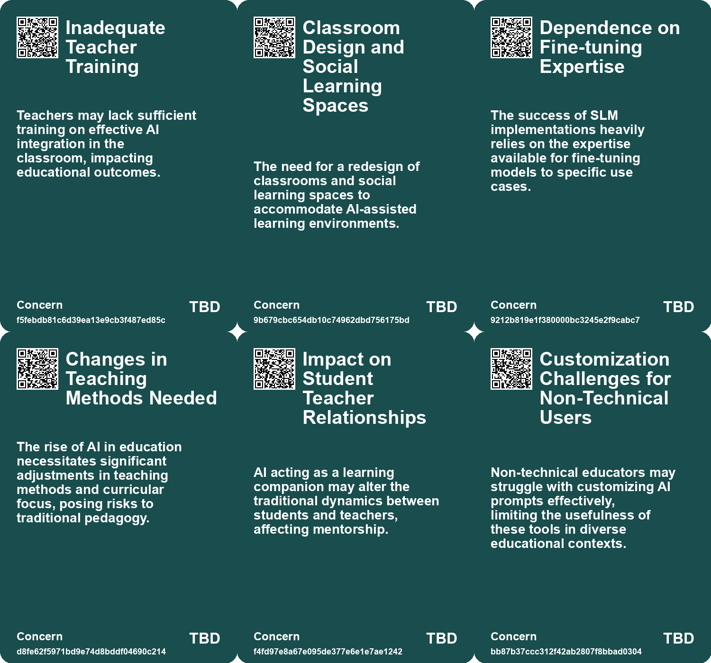
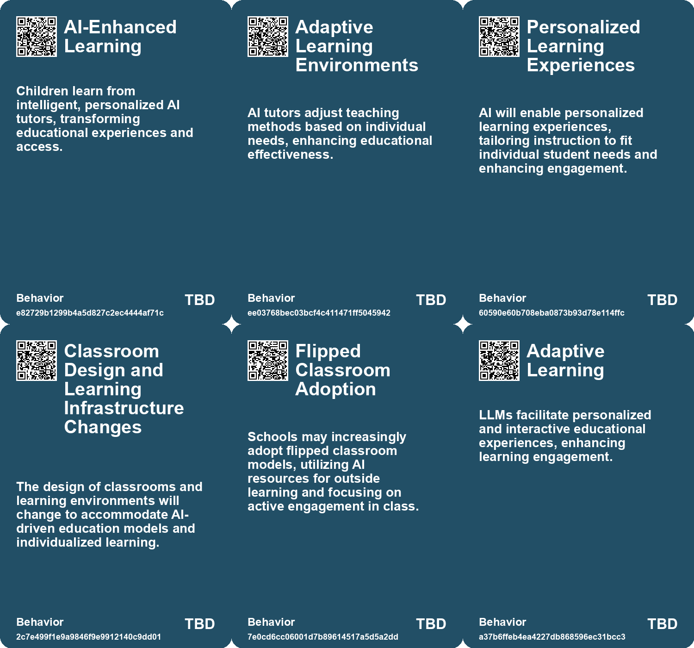
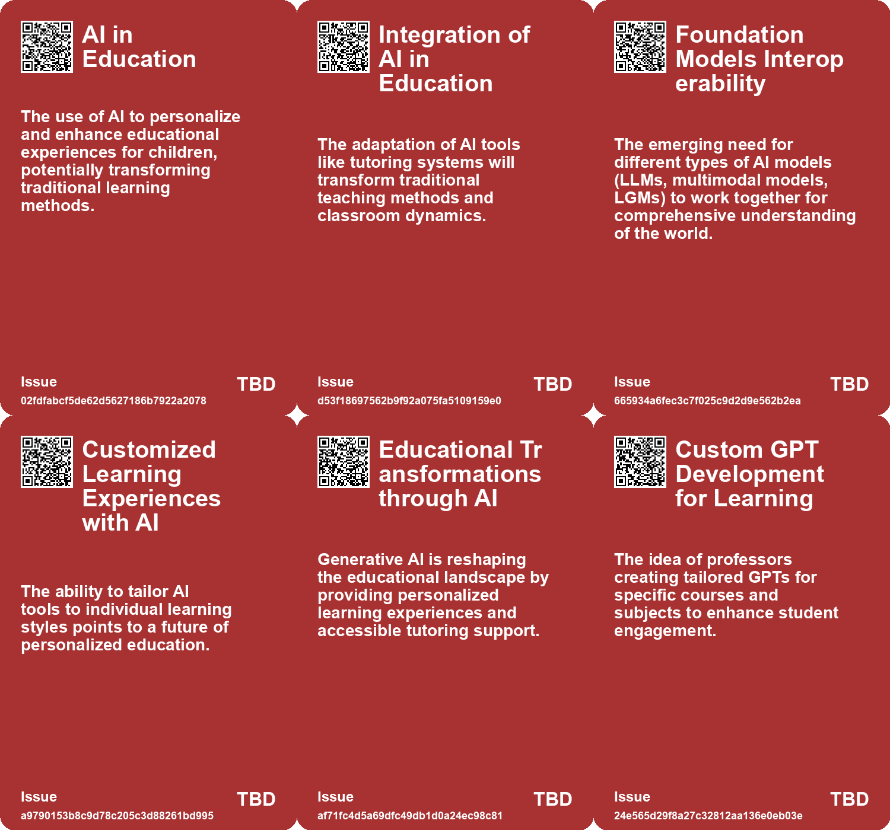
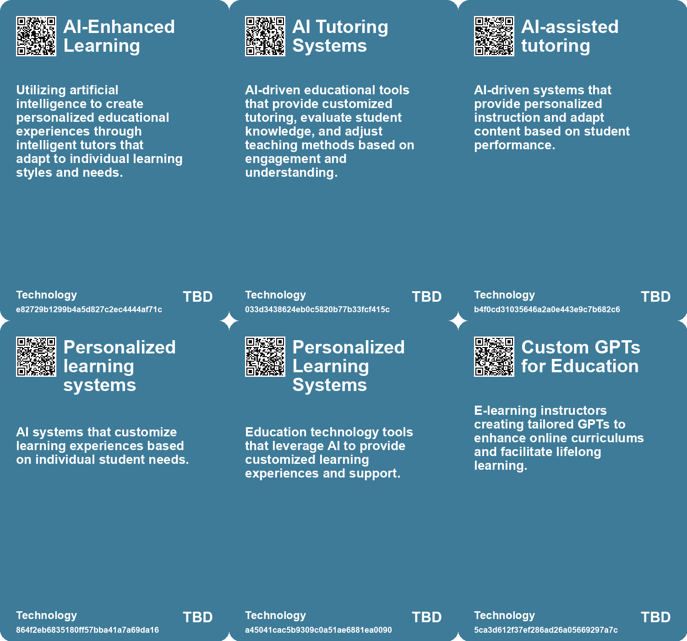

# *Topic*: Personalized Learning Models

# Summary

The integration of artificial intelligence (AI) in education is reshaping traditional learning paradigms. Personalized learning is gaining traction, with micro-schools and innovative teaching methods emphasizing active engagement over rote memorization. AI models, particularly large language models (LLMs), are being explored as tools for personalized tutoring, enhancing the learning experience by providing tailored support to students. However, the potential for AI to democratize education raises concerns about its implementation and the need for careful evaluation to ensure quality over profit.

The emergence of small language models (SLMs) is challenging the dominance of LLMs. SLMs offer advantages such as reduced costs, improved efficiency, and enhanced privacy. They are becoming increasingly relevant for specific applications, including chatbots and text generation, making them suitable for small businesses and startups. As organizations seek to leverage AI, the development of custom models tailored to specific industries is becoming a priority, with companies like OpenAI leading the way in providing fine-tuning services.

The role of AI in the workplace is evolving, with generative AI and autonomous agents poised to revolutionize business operations. These agents can automate workflows and execute tasks independently, significantly reducing labor costs. However, the integration of AI raises questions about intellectual property and the implications of digital immortality. Companies must prepare for the transformative impact of generative AI by adapting their technology architecture and workforce planning.

In the realm of knowledge management, the importance of curation and structured approaches to information is highlighted. As both humans and AI face challenges in processing vast amounts of data, organizations are encouraged to develop curated knowledge bases. This structured approach not only enhances decision-making but also addresses privacy concerns and promotes responsible AI usage.

The educational landscape is also grappling with the challenges posed by AI, particularly in the context of cheating and the effectiveness of traditional homework. The "Homework Apocalypse" underscores the need for educators to rethink assignments and adapt to the capabilities of AI. While AI presents threats to conventional practices, it also offers opportunities for innovative pedagogical approaches that can enhance learning experiences.

As AI continues to evolve, the balance between leveraging technology for efficiency and maintaining core skills becomes crucial. The reliance on AI tools for tasks such as writing raises concerns about superficial understanding and the decline of critical thinking. Educators and students alike must navigate the complexities of integrating AI into learning while fostering a deeper engagement with the material.

Finally, the potential of LLMs in various fields, including intelligence analysis and customer engagement, is being explored. These models can support the generation of expert-driven insights and enhance the customer journey. However, the need for safeguards and verification procedures remains paramount to ensure the responsible use of AI in these contexts.

# Seeds

|    | name                            | description                                                                                     | change                                                                                                  | 10-year                                                                                                                     | driving-force                                                                                                 |
|---:|:--------------------------------|:------------------------------------------------------------------------------------------------|:--------------------------------------------------------------------------------------------------------|:----------------------------------------------------------------------------------------------------------------------------|:--------------------------------------------------------------------------------------------------------------|
|  0 | LLMs as Learning Tools          | LLMs could serve as personalized tutors, enhancing understanding while tackling complex topics. | Moving from passive reliance on LLMs to active engagement with them as learning aids.                   | AI tutoring could revolutionize education by providing tailored feedback and scaffolding for deeper learning.               | The desire to maintain and improve learning efficiency amidst rapid tech advances drives this shift.          |
|  1 | AI-enhanced learning            | The integration of AI in educational settings for personalized learning experiences.            | Shift from traditional, one-size-fits-all education to personalized, AI-driven learning methods.        | In 10 years, education could be highly personalized, with AI tutors adapting to each child's unique learning style.         | The desire for tailored educational experiences that cater to individual needs and preferences.               |
|  2 | AI as a co-pilot in education   | AI acting as a personalized assistant in the learning process.                                  | Shift from traditional teacher-led instruction to collaborative learning with AI support.               | In 10 years, AI could be a standard part of the educational experience, complementing human teachers.                       | The increasing sophistication and user-friendliness of AI technologies.                                       |
|  3 | Personalized AI Assistants      | Growth of customized AI agents tailored to individual user needs in professional settings.      | Transitioning from generic AI tools to personalized assistants that enhance individual expertise.       | Every professional may have a tailored AI assistant, fundamentally changing team dynamics and workflows.                    | The need for efficiency and personalized support in increasingly complex work environments.                   |
|  4 | Emergence of Flipped Classrooms | Adoption of flipped classroom models due to AI's capabilities.                                  | From traditional teaching methods to flipped classrooms utilizing AI resources.                         | Classroom dynamics will shift towards more interactive and activity-based learning experiences.                             | The need for more effective teaching strategies that incorporate technology and AI.                           |
|  5 | Custom GPTs for Education       | Professors creating custom GPTs for engaging with educational content.                          | Shift from traditional teaching methods to AI-driven personalized learning experiences.                 | In ten years, AI chatbots will be standard tools in educational settings, offering tailored learning support.               | The need for personalized education and lifelong learning opportunities drives this trend.                    |
|  6 | Improvement of AI Technologies  | Continuous improvement of AI models for better educational support.                             | From error-prone AI applications to more accurate and reliable educational tools.                       | AI technologies will evolve to provide seamless and accurate educational assistance.                                        | The commitment to enhancing learning outcomes through advanced technology drives improvements.                |
|  7 | Collaboration in Learning       | Emerging collaborative efforts to redefine learning paradigms.                                  | Moving from isolated learning experiences to community-driven, collaborative learning.                  | Learning may become a more social, community-oriented process, enhancing engagement.                                        | The need for collective problem-solving in a rapidly changing world.                                          |
|  8 | Shift to Personalized Learning  | Growing emphasis on personalized education tailored to individual student needs.                | Education is shifting from standardized, one-size-fits-all models to personalized learning experiences. | In 10 years, personalized learning will be the standard approach in education, enabling tailored pathways for each student. | Advancements in AI and technology are enabling customized learning experiences for individual students.       |
|  9 | AI as a Learning Assistant      | AI models are being integrated as tutors for personalized student engagement.                   | The role of AI in education is transitioning from supplementary to essential in personalized learning.  | In the future, AI will be a commonplace tutor in classrooms, enhancing student interaction and understanding.               | The need for scalable, effective educational support drives the integration of AI into learning environments. |

# Concerns

|    | name                                             | description                                                                                                                                                            |
|---:|:-------------------------------------------------|:-----------------------------------------------------------------------------------------------------------------------------------------------------------------------|
|  0 | Inadequate Teacher Training                      | Teachers may lack sufficient training on effective AI integration in the classroom, impacting educational outcomes.                                                    |
|  1 | Classroom Design and Social Learning Spaces      | The need for a redesign of classrooms and social learning spaces to accommodate AI-assisted learning environments.                                                     |
|  2 | Dependence on Fine-tuning Expertise              | The success of SLM implementations heavily relies on the expertise available for fine-tuning models to specific use cases.                                             |
|  3 | Changes in Teaching Methods Needed               | The rise of AI in education necessitates significant adjustments in teaching methods and curricular focus, posing risks to traditional pedagogy.                       |
|  4 | Impact on Student Teacher Relationships          | AI acting as a learning companion may alter the traditional dynamics between students and teachers, affecting mentorship.                                              |
|  5 | Customization Challenges for Non-Technical Users | Non-technical educators may struggle with customizing AI prompts effectively, limiting the usefulness of these tools in diverse educational contexts.                  |
|  6 | Impact on Student Learning Dynamics              | The way AI changes student engagement and interaction in classrooms could unintentionally alter traditional learning dynamics and relationships.                       |
|  7 | Quality of AI-Curated Content                    | Concerns over the accuracy and bias of content generated by AI models for educational purposes.                                                                        |
|  8 | Standardization of Learning Approaches           | Using AI might push towards a one-size-fits-all model, disregarding individual learning preferences and styles.                                                        |
|  9 | Bias and Misuse of AI Models                     | Custom models may perpetuate or exacerbate biases inherent in training data, leading to ethical concerns and misuse in critical applications like legal or healthcare. |

# Cards

## Concerns

## Behaviors

## Issue

## Technology

# Links

* [Enhancing Large Language Models with Knowledge Graphs for Structured Data Processing](https://futures.kghosh.me/69aa55d97023850224f4426e6782bb8b)
* [OpenAI Expands Custom Model Program for Tailored AI Solutions to Enterprises](https://futures.kghosh.me/ac9b50cf8d5d5e463bb17c52509eb128)
* [Examining Automated Adversarial Attacks on Large Language Models and Their Implications for Safety](https://futures.kghosh.me/74c58b0ca359725b4a116ff765656c7c)
* [Preparing for the Homework Apocalypse: AI's Impact on Education and Assignments](https://futures.kghosh.me/233c5bf90c64ceefb0cde33233c3fe6e)
* [The Rise of Augmented Humans: Embracing AI in a Transformative Era](https://futures.kghosh.me/a8f2b9b3c07bd0f1d91784ff8b5ee5fc)
* [The Impact of Generative AI and Autonomous Agents on Business Value Creation and Trust Issues](https://futures.kghosh.me/15d4ec180189ca1739398f516844cefb)
* [Exploring the Transformative Impact of AI on Education and Children's Learning Experiences](https://futures.kghosh.me/adf886a1b9fd74281e0a43c3e7c70def)
* [Exploring the Transformative Impact of Generative AI: Key Use Cases and Insights](https://futures.kghosh.me/1444e93f4885b7537dc295249cf8403b)
* [AI Models Show Improved Performance in Theory of Mind Tests Compared to Humans](https://futures.kghosh.me/25cdc8c55ebb70b51b85134dc01e6efd)
* [AI's Impact on Education: Adaptation, Challenges, and Opportunities for Learning](https://futures.kghosh.me/ea74b217d36ec570bb432fb5aa679090)
* [The Impact of AI on Student Writing: A Teacher's Perspective on Leaving the Classroom](https://futures.kghosh.me/86cb668eb531243c4f8cd92b0d1d3821)
* [The Integration of AI in Business School Curriculums to Enhance Graduate Competitiveness](https://futures.kghosh.me/bc232b227c806ac26adf2b99fa4cff9d)
* [The Shift from Large to Small Language Models in AI Development and Applications](https://futures.kghosh.me/77fe6ce5d0591184b3fb41b6d2ef042a)
* [Voyager: A Revolutionary LLM-Powered Lifelong Learning Agent in Minecraft](https://futures.kghosh.me/8af9bffc11d191445956ffcef1627c38)
* [Exploring the Advantages of Small Language Models in AI Applications](https://futures.kghosh.me/15fc0056b0626400c8c4a874249e7f27)
* [Exploring Fine-Tuning and Retrieval-Augmented Generation for LLMs' Limitations](https://futures.kghosh.me/9fd8c7460fe2d17a54694de66ebd64ca)
* [The Dilemma of Learning vs. Efficiency in the Age of LLMs](https://futures.kghosh.me/d70de2a91caaafb093aebcad6ed8160f)
* [OpenAI's Ambitious Plans to Integrate AI Chatbots into Online Education](https://futures.kghosh.me/d3038dab94883cba191b52ecdb37245b)
* [OLMo: A Groundbreaking Open Language Model Framework for AI Research](https://futures.kghosh.me/51e3ea62151b1423eeea4393a4ab7abc)
* [Exploring the Impact of Large Language Models on OSINT Analysis and Workflows](https://futures.kghosh.me/5cf4407dc6fa3889e047c658e27c4ccf)
* [Navigating Information Overload: The Role of Knowledge Management and AI in Decision-Making](https://futures.kghosh.me/3e292858cf09bb02c3e254ede24744f6)
* [Exploring the Democratization of Innovation and Education Through AI and Prompting Techniques](https://futures.kghosh.me/d0726e79e1911eb62981138d30b7182a)
* [Revolutionizing Education: The Role of AI Tutors in Personalized Learning](https://futures.kghosh.me/8f4d495f94113bef7aed043ebceafebb)
* [Niantic's Vision for a Large Geospatial Model to Revolutionize AR and Spatial Computing](https://futures.kghosh.me/65e4c914b47f88920bb9442d4d102b67)
* [Rethinking Marketing Strategies in the Age of Large Language Models](https://futures.kghosh.me/fd41a4c0c492bbb77535e0a54ee09619)
* [Reimagining Learning: Embracing Slow Learning in an Accelerated World](https://futures.kghosh.me/042cf62855760b54fa5a194db9e6cf11)
* [Harnessing AI's Potential: The Importance of Expert Prompts Over Data Hoarding](https://futures.kghosh.me/52ec2cf0aebdc7af56249f1702652ebe)