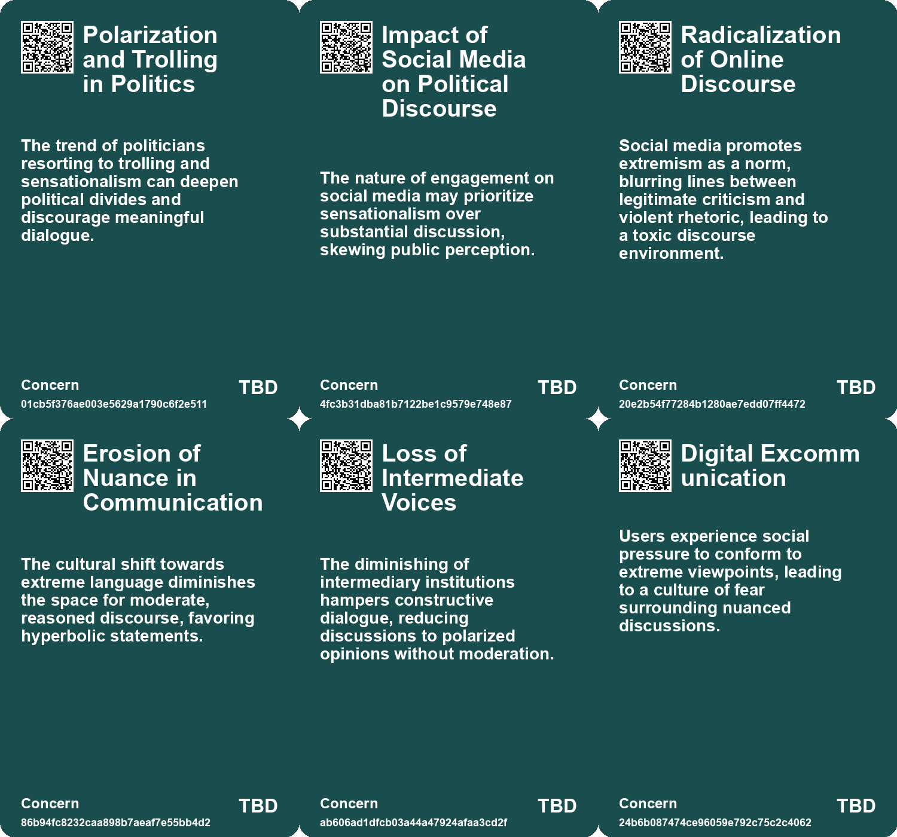
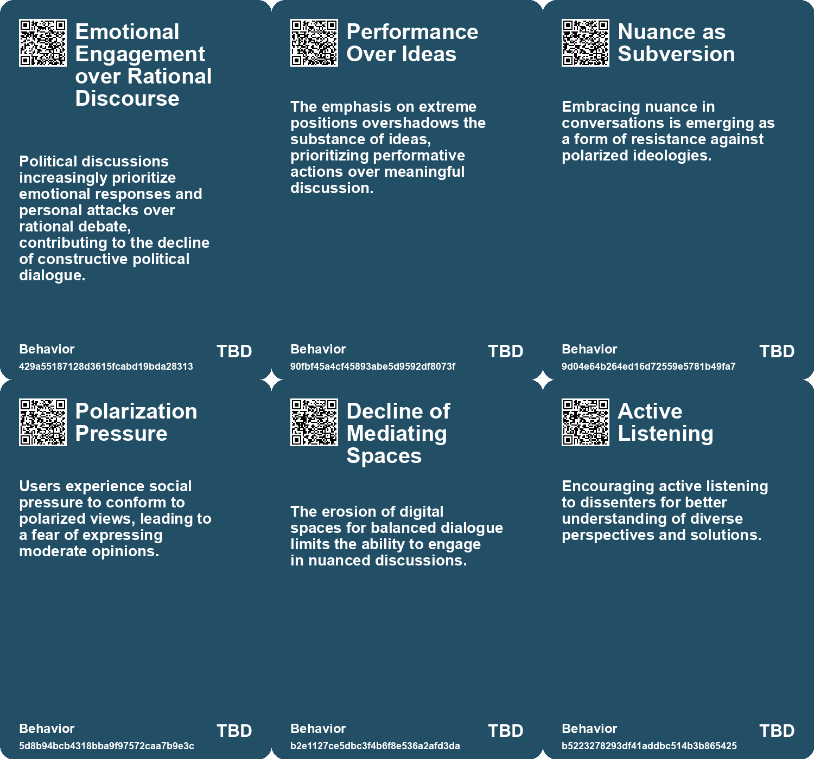
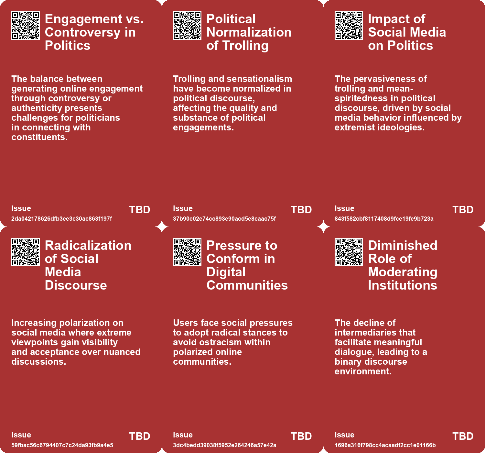
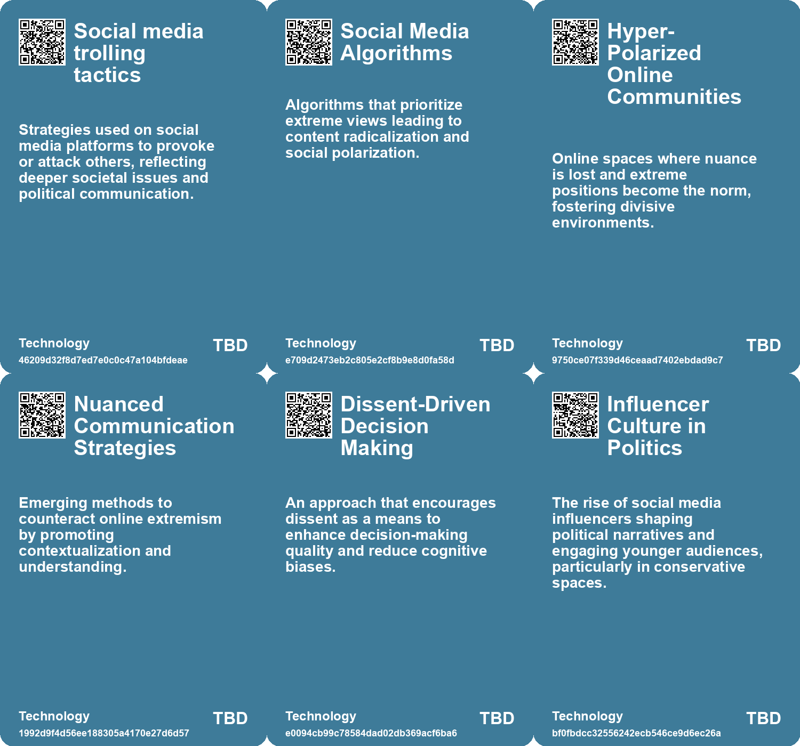

# *Topic*: Polarization of Discussions

# Summary

The intersection of technology and society remains a critical focus, with discussions highlighting both its detrimental effects and potential remedies. One perspective emphasizes the need for a cultural shift that prioritizes attention over availability, advocating for a Talmudic approach that encourages diverse viewpoints. This approach aims to counteract the polarization exacerbated by social media, which has been linked to the decline of democratic discourse. The rise of misinformation on these platforms poses significant threats, as studies reveal that a small group of individuals, termed "supersharers," disproportionately spreads fake news, undermining public trust and engagement.

Climate change emerges as another pressing theme, with various articles exploring the complex attitudes surrounding this global crisis. The need for deeper understanding and moral consideration in climate action is emphasized, alongside the importance of community resilience and social trust in addressing environmental challenges. The discussions highlight the shrinking habitability of certain regions and the necessity for effective energy policies to combat the impacts of climate change.

The role of dissent in decision-making is also underscored, with arguments for embracing diverse viewpoints to improve organizational outcomes. Research indicates that dissent can counter cognitive biases that hinder effective group decision-making, suggesting that fostering an environment where differing opinions are welcomed can lead to better results.

In the realm of politics, the decline of maturity in American political discourse is critiqued, with comparisons drawn to historical contexts. The current political landscape is characterized by juvenile behavior and a lack of accountability, which detracts from the dignity of governance. This decline is juxtaposed with the rise of populism, where common citizens challenge established elites, reflecting broader societal discontent and the complexities of managing conflicts between factions.

Corporate neutrality in political discourse is another significant topic, as leaders are urged to avoid alienating stakeholders by refraining from taking sides on contentious issues. This approach mirrors challenges faced by educational institutions regarding free expression and political engagement, suggesting that corporations can learn from these experiences.

The impact of misinformation extends beyond politics and climate change, affecting various sectors, including media and entertainment. The decline of quality in social media, termed "enshittification," is attributed to a lack of competition and regulation, prompting calls for a reimagining of user experiences. Additionally, the challenges faced by artists and the media industry highlight the need for innovative solutions to support creative communities.

Finally, the evolution of public space usage in urban environments is examined, revealing a decline in social interactions over the past few decades. Factors such as technology and demographic shifts contribute to this trend, raising concerns about economic segregation and the importance of designing inclusive public spaces that foster community engagement. The integration of digital literacy and fact-checking into education is presented as a proactive measure to combat misinformation, emphasizing the role of informed citizens in navigating the complexities of the modern world.

# Seeds

|    | name                                       | description                                                                                | change                                                                                               | 10-year                                                                                                 | driving-force                                                                                      |
|---:|:-------------------------------------------|:-------------------------------------------------------------------------------------------|:-----------------------------------------------------------------------------------------------------|:--------------------------------------------------------------------------------------------------------|:---------------------------------------------------------------------------------------------------|
|  0 | Radicalization of Online Discourse         | Online culture pushes users to adopt more extreme viewpoints for visibility.               | Shift from nuanced discussions to extreme, polarizing rhetoric online.                               | Online discussions may predominantly feature radical extremes, marginalizing moderate voices.           | Algorithms prioritize extreme content, leading users to conform for attention.                     |
|  1 | Pressure to Conform in Digital Communities | Users face pressure to adopt extreme viewpoints to avoid social ostracism.                 | From open discussion climates to environments that discourage moderation and complexity.             | Online platforms may cultivate echo chambers with little room for dissent or nuance.                    | Increased community policing and behavioral norms enforced through social validation.              |
|  2 | Erosion of Middle Grounds in Debate        | Spaces for moderate and nuanced debate are decreasing rapidly online.                      | Shift from balanced discussions to highly polarized binaries in public discourse.                    | Debate platforms may lack representation of moderate viewpoints, fostering division.                    | Popularity of radical content discouraging rational dialogue and nuanced perspectives.             |
|  3 | Subversion through Nuance as Resistance    | Introducing nuance as a counter-narrative to extremism becomes a revolutionary act.        | Transition from seeking attention via extremes to valuing thoughtful dialogue.                       | Possible resurgence of platforms valuing constructive discourse and complexity in interactions.         | Growing fatigue with radical extremism prompting a shift towards balanced communication.           |
|  4 | Embracing Dissent in Decision-Making       | Encouraging dissent can improve decision-making by countering groupthink and biases.       | Transitioning from valuing consensus to valuing dissent in organizational decision-making.           | Organizations will incorporate formal dissent channels to ensure comprehensive perspectives are heard.  | The need for better decision-making processes in increasingly complex environments.                |
|  5 | Diversity of Opinions in Leadership        | Leadership increasingly values diverse opinions through dissent.                           | Moving from homogenous decision-making to multi-faceted input in leadership structures.              | Leadership teams will be more diverse and inclusive, actively seeking dissenting views.                 | A shift towards equity and inclusion in organizational practices.                                  |
|  6 | Systematic Processing After Dissent        | Exposure to divergent opinions stimulates deeper cognitive processing.                     | From shallow conformity to deeper analytical discussions based on differing viewpoints.              | Workplaces will prioritize a culture that encourages critical thinking and dissent for better outcomes. | Demand for innovative solutions in competitive markets necessitates deeper analysis of ideas.      |
|  7 | Increasing Polarization                    | Global societies are experiencing heightened polarization in political and social beliefs. | Shift from diverse ideological acceptance to increasing intolerance of opposing views.               | In ten years, societies may become more fragmented, leading to isolated ideological communities.        | Digital technologies and social media algorithms are fueling personalized information consumption. |
|  8 | Digital Echo Chambers                      | Social media creates echo chambers that reinforce existing beliefs.                        | Transition from open discourse to insulated ideological bubbles, limiting exposure to diverse views. | In ten years, public discourse may become dominated by polarized and unchallenged narratives.           | Algorithms prioritize content that aligns with users' beliefs, diminishing diverse perspectives.   |
|  9 | Shifting Political Bias in AI Models       | OpenAI's ChatGPT shows a rightward shift in political bias over time.                      | From a perceived left-leaning bias to a measurable rightward shift in responses.                     | AI models may exhibit more diverse political biases, impacting user perception and trust.               | Increased scrutiny and interaction with users may influence AI political perspectives.             |

# Concerns

|    | name                                          | description                                                                                                                                                   |
|---:|:----------------------------------------------|:--------------------------------------------------------------------------------------------------------------------------------------------------------------|
|  0 | Polarization and Trolling in Politics         | The trend of politicians resorting to trolling and sensationalism can deepen political divides and discourage meaningful dialogue.                            |
|  1 | Impact of Social Media on Political Discourse | The nature of engagement on social media may prioritize sensationalism over substantial discussion, skewing public perception.                                |
|  2 | Radicalization of Online Discourse            | Social media promotes extremism as a norm, blurring lines between legitimate criticism and violent rhetoric, leading to a toxic discourse environment.        |
|  3 | Erosion of Nuance in Communication            | The cultural shift towards extreme language diminishes the space for moderate, reasoned discourse, favoring hyperbolic statements.                            |
|  4 | Loss of Intermediate Voices                   | The diminishing of intermediary institutions hampers constructive dialogue, reducing discussions to polarized opinions without moderation.                    |
|  5 | Digital Excommunication                       | Users experience social pressure to conform to extreme viewpoints, leading to a culture of fear surrounding nuanced discussions.                              |
|  6 | Ineffective Decision-Making Structures        | Traditional group discussions often fail to harness dissent effectively, resulting in unnecessary or biased decision-making processes.                        |
|  7 | Influencer Politics                           | Rise of political influencers shaping ideologies and mobilizing youth, potentially sidelining traditional political discourse.                                |
|  8 | Polarization of Society                       | Global trend of increasing political polarization, driven by digital communication methods, affecting democratic principles.                                  |
|  9 | Corporate Political Neutrality                | The shift towards political neutrality in corporations could limit free expression and diverse viewpoints, potentially stifling important social discussions. |

# Cards

## Concerns

## Behaviors

## Issue

## Technology

# Links

* [Exploring the Rise of Violence and Radicalization on Social Media Platforms](https://futures.kghosh.me/ea7f0f256ddb3e6e793a33690c8004ba)
* [The Unraveling of Progressive Politics: Economic Shifts and Growing Conflicts](https://futures.kghosh.me/f4ea5244ccafd654e5955673b0ee3976)
* [Exploring the Modern Entertainment Landscape and Its Societal Implications](https://futures.kghosh.me/c5c2c794f1426e6e307a9df3f9ff61f6)
* [Exploring Attitudes Towards Climate Change and the Planetary Crisis Through the Polak Game](https://futures.kghosh.me/8829c6584a9427158f32a38766b0e3b2)
* [Study Reveals Shift in Political Bias of ChatGPT Towards the Right](https://futures.kghosh.me/e14d5a2d51f4c178fed312dbbdf2ed05)
* [Exploring Strategic Principles for Leadership and Adaptability in Complex Systems](https://futures.kghosh.me/b4d66403e1bcfa256c757babc0b19c9d)
* [Navigating Climate Change: The Need for Community Resilience and Social Trust](https://futures.kghosh.me/efa36dc9bd5ddc890866d4ab1e68e71f)
* [The Decline of Political Maturity in America: A Call for Responsible Citizenship](https://futures.kghosh.me/ec5b543a174bedb5387b497cc449e5b9)
* [The Impact of Urban Design on Public Space Usage and Social Interaction](https://futures.kghosh.me/2f31d87f3801765f9645d092cadf513a)
* [The Vital Role of Dissent in Effective Decision-Making for Organizations](https://futures.kghosh.me/4ff63da3f7bc4da4e925370b5eb9bfbe)
* [Reimagining Futures Thinking: Addressing Critical Flaws and Embracing Transformation](https://futures.kghosh.me/670b7a7f03caef5935520a962c78dd5a)
* [Addressing Threats to Democracy: Strategies for Resilience Against Misinformation and Manipulation](https://futures.kghosh.me/56d1a28746cd95ebaa3d62a4e1f91c3a)
* [Exploring Enshittification, Futures Thinking in Architecture, and the Decline of Urban Scenius](https://futures.kghosh.me/4c0323220b8e42ef6b79dd4d720ce80a)
* [Zohran Mamdani's Campaign: A Refreshing Approach to Politics Against Establishment Norms](https://futures.kghosh.me/9782d40f901a13851bd120672f254fc9)
* [Finland's Innovative Approach to Combating Fake News Through Education](https://futures.kghosh.me/ad15fbe04bbe50ec3436c61403d19fca)
* [The Case for Corporate Neutrality: Lessons from Higher Education on Political Silence](https://futures.kghosh.me/3a1dd7fd549b2cb6e4e12aded772585c)
* [Youthful Conservatism: Celebrations and Shifts in Trump's Second Inauguration](https://futures.kghosh.me/072874a8428401d0b55b1c740a500dd1)
* [Global Experts' Pessimistic Outlook for the Next Decade: Key Survey Findings](https://futures.kghosh.me/4c1d4c91735e960e46ac534d9a90fc60)
* [The Impact of Supersharers on Vaccine Hesitancy and Fake News Spread on Social Media](https://futures.kghosh.me/091c0c86efbac50bd1354fbc72324198)
* [Understanding Polarization: Healing Our Relationship with Technology and Embracing Diverse Perspectives](https://futures.kghosh.me/c1bb890337ef382bfaa5720c9fd05134)
* [Understanding Populism: Its Rise, Characteristics, and Implications in Today's Politics](https://futures.kghosh.me/cd6a3016e9c9fa46f13d29ded245803a)
* [Transformative Changes from 2014 to Today: AI, Energy, and Nationalism](https://futures.kghosh.me/299248e05dbfb0ab57ae84fc170ee39a)
* [Navigating the Climate Crisis: The Importance of Community and Social Trust in Adapting to Change](https://futures.kghosh.me/d1e5dc8cd0f7c34dede43f5429dded3d)
* [The Backlash Against Lina Khan: A Fight for Consumer Protection and Antitrust Reform](https://futures.kghosh.me/0e022693721e3552f32062f41e8c4f98)