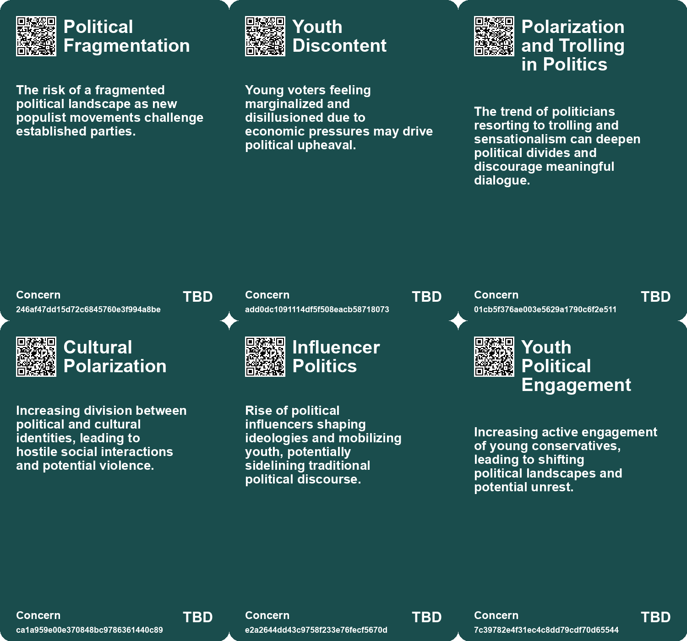
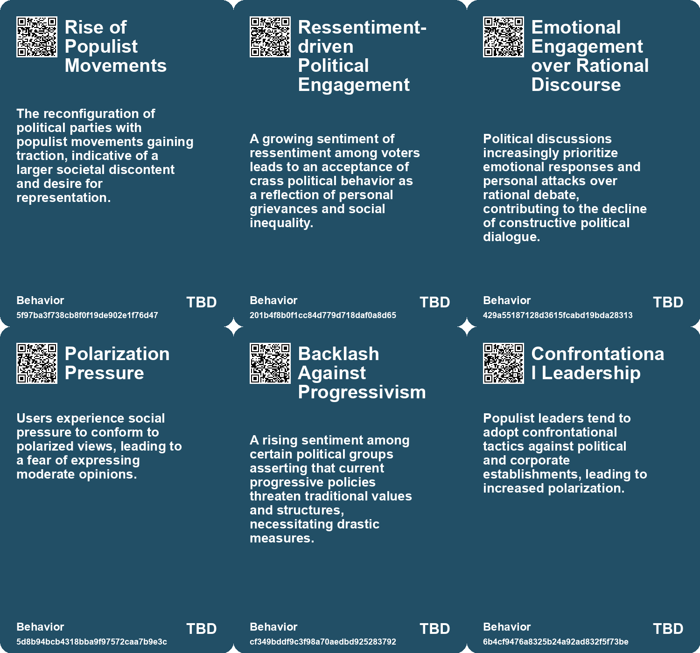
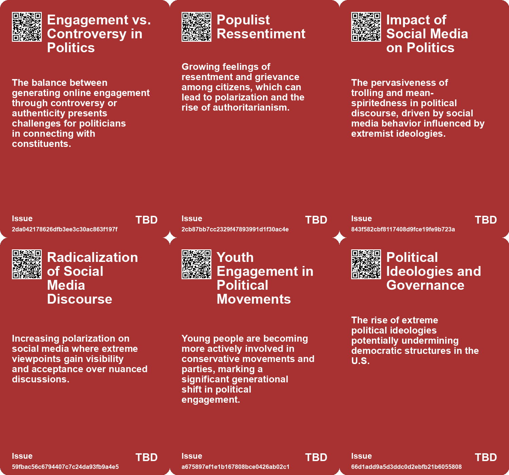
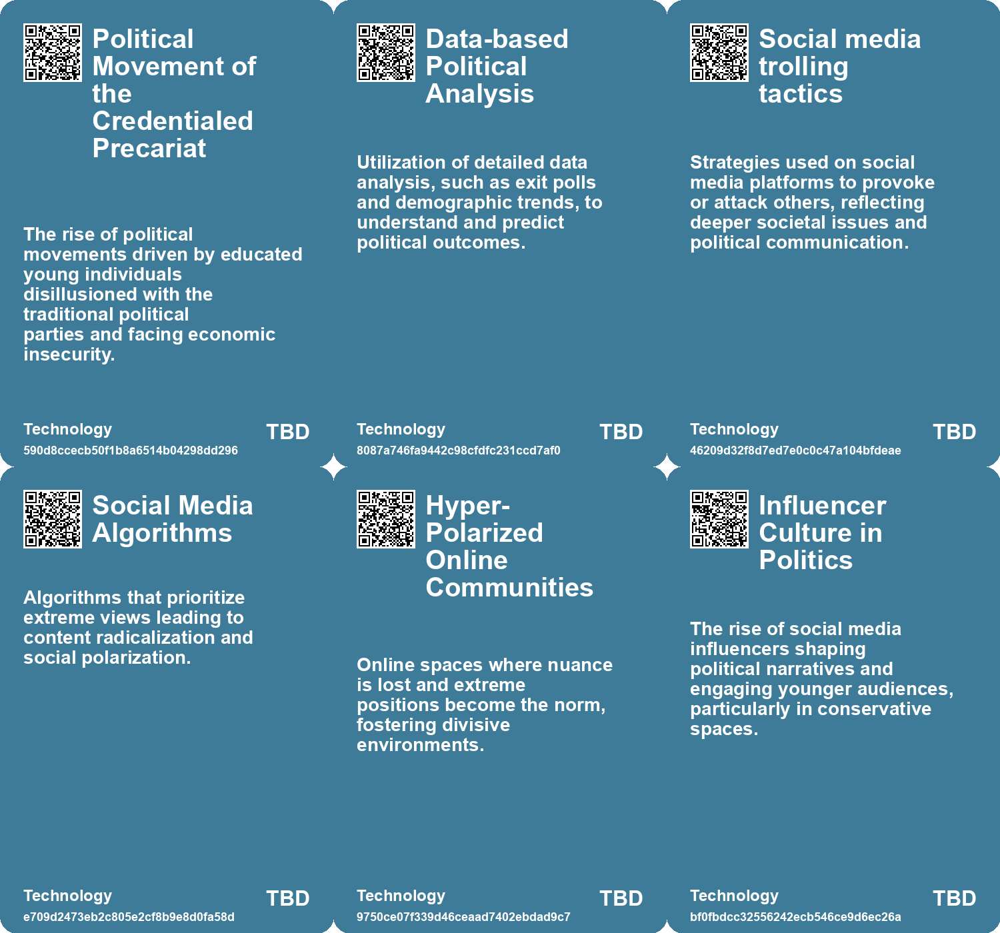

# *Topic*: Political Polarization

# Summary

Populism is a recurring theme in contemporary politics, characterized by a growing divide between the common populace and established elites. The rise of populist movements echoes historical patterns, with factors such as wealth gaps and nationalism driving this phenomenon. As populism gains traction, understanding its implications for future economic policies and international relations becomes essential.

Technology's impact on society is another significant concern. The proliferation of digital platforms has led to polarization and misinformation, particularly through social media. The Talmudic approach of considering multiple perspectives is proposed as a remedy to counteract the negative effects of technology. Additionally, the rise of generative AI raises questions about its role in political campaigns, with concerns about deep fakes and voter manipulation becoming increasingly relevant.

The state of democracy is under threat from groups adept at spreading misinformation and exploiting cognitive biases. These tactics undermine democratic processes, necessitating the development of strategies to promote transparency and media literacy. The importance of social cohesion and community resilience is emphasized as essential tools for navigating these challenges.

Climate change remains a pressing issue, with discussions focusing on the moral implications of our responses to the crisis. The need for community engagement and solidarity is highlighted as vital for addressing the impacts of climate change. The Polak Game is introduced as a method to visualize and discuss diverse attitudes toward climate action, encouraging deeper reflection on motivations behind these responses.

The political landscape is shifting, particularly among younger voters who feel disenfranchised by traditional parties. The rise of figures like Zohran Mamdani reflects a growing demand for authentic engagement and representation. This shift may lead to a more populist Democratic Party, mirroring trends seen in the Republican Party.

Economic challenges are also at the forefront, with a "casino economy" dominating discussions. The concentration of wealth and the struggles of the lower class highlight the disparities in recovery from economic downturns. The influence of addiction across various sectors is critiqued, linking it to broader societal issues and mental health crises.

Finally, the UK faces a unique set of challenges, marked by a decline in productivity and growth. The inability to address these issues reflects a breakdown of trust and competency within its institutions. As the country grapples with its identity and future, the need for a productive social order becomes increasingly urgent.

# Seeds

|    | name                                      | description                                                                                    | change                                                                                                       | 10-year                                                                                                   | driving-force                                                                                                    |
|---:|:------------------------------------------|:-----------------------------------------------------------------------------------------------|:-------------------------------------------------------------------------------------------------------------|:----------------------------------------------------------------------------------------------------------|:-----------------------------------------------------------------------------------------------------------------|
|  0 | Youth Political Shift                     | Younger voters increasingly supporting populist candidates over traditional party candidates.  | Transition from voting for mainstream candidates to supporting outsiders who represent their interests more. | Future elections may be dominated by candidates prioritizing youth and affordability issues.              | A younger generation disillusioned by traditional parties and seeking alignment with new ideologies.             |
|  1 | Populist Momentum in Politics             | Populism rising within mainstream parties, challenging traditional power structures.           | Shift from established political ideologies to populist movements that advocate for the underprivileged.     | Political landscapes could see more populist candidates emerging, reshaping party platforms and policies. | Growing economic precarity and disenfranchisement driving citizens to seek alternative political representation. |
|  2 | Decline of Civic Maturity                 | A noticeable decline in political maturity and civic responsibility among U.S. public figures. | Shift from perceived civic maturity to crass behavior in public life.                                        | In 10 years, American politics may evolve to embrace more superficial and immature public discourse.      | A culture of trolling and disdain for political decorum is driving this trend.                                   |
|  3 | Increasing Polarization                   | Global societies are experiencing heightened polarization in political and social beliefs.     | Shift from diverse ideological acceptance to increasing intolerance of opposing views.                       | In ten years, societies may become more fragmented, leading to isolated ideological communities.          | Digital technologies and social media algorithms are fueling personalized information consumption.               |
|  4 | Economic Voter Sentiment Shift            | Voter sentiment now heavily influenced by inflation, impacting party loyalty and performance.  | Shift from economic tolerance to intolerance, where inflation has a direct electoral consequence.            | Political parties will prioritize economic stability over ideology to maintain voter loyalty.             | Increasing public frustration with inflation and economic instability post-pandemic.                             |
|  5 | Gender Dynamics in Elections              | Significant generational gender differences in political sentiment following Trump's victory.  | Emerging gender-based voting patterns reflecting deeper societal issues around masculinity and feminism.     | Political narratives will increasingly consider gender dynamics, influencing campaign strategies.         | Evolving cultural perceptions of gender roles and expectations in society.                                       |
|  6 | Democratic Party's Elite Image            | Perception of Democrats as disconnected from working-class interests grows post-election.      | Shift from a working-class party to one perceived as catering to elites and corporate interests.             | Democratic strategies will likely focus on re-establishing connections with working-class voters.         | Economic disparities and dissatisfaction with elite-focused policies among voters.                               |
|  7 | Conflict Management in Populism           | Populism leads to increased conflict and disorder within countries.                            | From cooperative political environments to confrontational and exclusive dynamics.                           | Political systems may evolve to manage conflicts more effectively or become more authoritarian.           | The need for stability and order in response to increasing political polarization.                               |
|  8 | Class Warfare and Political Fragmentation | Increased conflict between wealthy oligarchs and progressive activists over welfare policies.  | From collaborative support for progressive causes to potential clashes over economic policies.               | Political alliances may splinter, leading to a fragmented political landscape.                            | The unsustainable nature of funding welfare initiatives amid economic decline.                                   |
|  9 | Impact of Facial Morphology on Perception | Facial features may influence public perception and behavior towards political beliefs.        | From subjective political identification to objective judgments based on appearance.                         | Facial appearance might increasingly shape social and political dynamics and interactions.                | Social psychology principles indicating that appearance influences perception and treatment.                     |

# Concerns

|    | name                                  | description                                                                                                                                     |
|---:|:--------------------------------------|:------------------------------------------------------------------------------------------------------------------------------------------------|
|  0 | Political Fragmentation               | The risk of a fragmented political landscape as new populist movements challenge established parties.                                           |
|  1 | Youth Discontent                      | Young voters feeling marginalized and disillusioned due to economic pressures may drive political upheaval.                                     |
|  2 | Polarization and Trolling in Politics | The trend of politicians resorting to trolling and sensationalism can deepen political divides and discourage meaningful dialogue.              |
|  3 | Loss of Intermediate Voices           | The diminishing of intermediary institutions hampers constructive dialogue, reducing discussions to polarized opinions without moderation.      |
|  4 | Cultural Polarization                 | Increasing division between political and cultural identities, leading to hostile social interactions and potential violence.                   |
|  5 | Influencer Politics                   | Rise of political influencers shaping ideologies and mobilizing youth, potentially sidelining traditional political discourse.                  |
|  6 | Youth Political Engagement            | Increasing active engagement of young conservatives, leading to shifting political landscapes and potential unrest.                             |
|  7 | Polarization of Society               | Global trend of increasing political polarization, driven by digital communication methods, affecting democratic principles.                    |
|  8 | Gender Dynamics in Politics           | Polarization between young men and women in political preferences reflects broader societal gender conflicts and could exacerbate divisions.    |
|  9 | Political Polarization                | Increasing division within political parties regarding economic policies and social issues could lead to governance challenges and instability. |

# Cards

## Concerns

## Behaviors

## Issue

## Technology

# Links

* [Exploring the Rise of Violence and Radicalization on Social Media Platforms](https://futures.kghosh.me/ea7f0f256ddb3e6e793a33690c8004ba)
* [The Interplay of Democracy, Work, and Economic Justice in Modern Society](https://futures.kghosh.me/43aa6ac3d82bbc19f0d66d5b2bb37897)
* [Zohran Mamdani's Victory: A Reflection of Rising Credentialed Precariat and Political Change in NYC](https://futures.kghosh.me/d0f1317e1dfd400f02933a3441c9faa1)
* [The Unraveling of Progressive Politics: Economic Shifts and Growing Conflicts](https://futures.kghosh.me/f4ea5244ccafd654e5955673b0ee3976)
* [Exploring Attitudes Towards Climate Change and the Planetary Crisis Through the Polak Game](https://futures.kghosh.me/8829c6584a9427158f32a38766b0e3b2)
* [Study Reveals Shift in Political Bias of ChatGPT Towards the Right](https://futures.kghosh.me/e14d5a2d51f4c178fed312dbbdf2ed05)
* [Addressing Generative AI Threats in the Upcoming UK General Election](https://futures.kghosh.me/9bcd0e8850a5de2296f414bfeeff7567)
* [Navigating Climate Change: The Need for Community Resilience and Social Trust](https://futures.kghosh.me/efa36dc9bd5ddc890866d4ab1e68e71f)
* [Understanding the Casino Economy: How Financialization Shapes Our Lives and Beliefs](https://futures.kghosh.me/f4ca03eca53c5d3b3ccc3dd5b1a9aeb4)
* [The Decline of Political Maturity in America: A Call for Responsible Citizenship](https://futures.kghosh.me/ec5b543a174bedb5387b497cc449e5b9)
* [Addressing Threats to Democracy: Strategies for Resilience Against Misinformation and Manipulation](https://futures.kghosh.me/56d1a28746cd95ebaa3d62a4e1f91c3a)
* [Russell Vought's Ideological War Against Government and the Rise of the Addiction Economy](https://futures.kghosh.me/619829bd081d7da919912e4f63d2549c)
* [Zohran Mamdani's Campaign: A Refreshing Approach to Politics Against Establishment Norms](https://futures.kghosh.me/9782d40f901a13851bd120672f254fc9)
* [The Shift from Political Engagement to Escapism in Post-Election America](https://futures.kghosh.me/ffdc204f7f00cafc0c71c5c32e83a713)
* [The UK's Declining Geopolitical Relevance and Elite Inaction: A Historical Perspective](https://futures.kghosh.me/ca555520973a0e8519ff854da1de4d88)
* [Youthful Conservatism: Celebrations and Shifts in Trump's Second Inauguration](https://futures.kghosh.me/072874a8428401d0b55b1c740a500dd1)
* [Global Experts' Pessimistic Outlook for the Next Decade: Key Survey Findings](https://futures.kghosh.me/4c1d4c91735e960e46ac534d9a90fc60)
* [Understanding Polarization: Healing Our Relationship with Technology and Embracing Diverse Perspectives](https://futures.kghosh.me/c1bb890337ef382bfaa5720c9fd05134)
* [Understanding Populism: Its Rise, Characteristics, and Implications in Today's Politics](https://futures.kghosh.me/cd6a3016e9c9fa46f13d29ded245803a)
* [Transformative Changes from 2014 to Today: AI, Energy, and Nationalism](https://futures.kghosh.me/299248e05dbfb0ab57ae84fc170ee39a)
* [AI and Facial Recognition: Predicting Political Orientation from Facial Features](https://futures.kghosh.me/3373ed6e78f39ee296b4005e8975592b)
* [U.S. Intel: Russia Continues to Favor Trump in Election Influence Efforts](https://futures.kghosh.me/17319707c9c640b4b92b78f5fdfa61ae)
* [Navigating the Climate Crisis: The Importance of Community and Social Trust in Adapting to Change](https://futures.kghosh.me/d1e5dc8cd0f7c34dede43f5429dded3d)
* [Exploring Six Narratives on Trump's 2024 Election Victory and Quincy Jones' Creative Philosophy](https://futures.kghosh.me/36a55767a1e538cce12f75e314c80bb8)