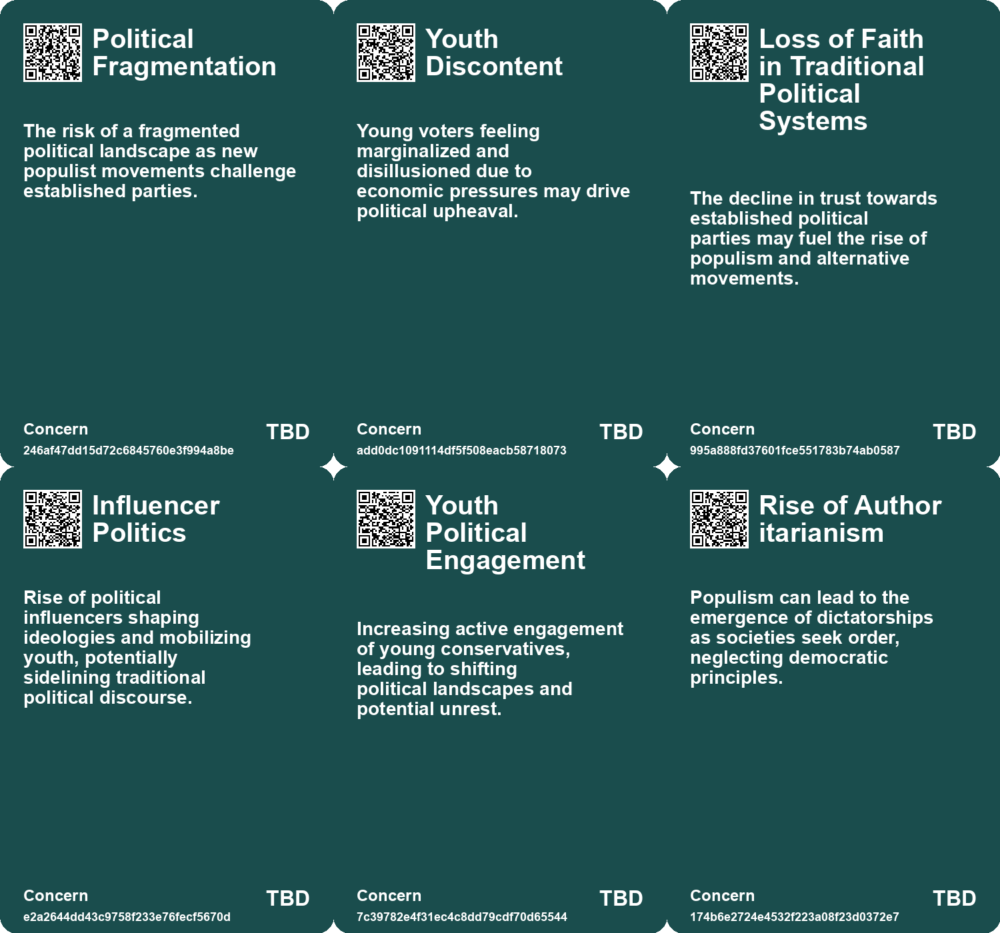
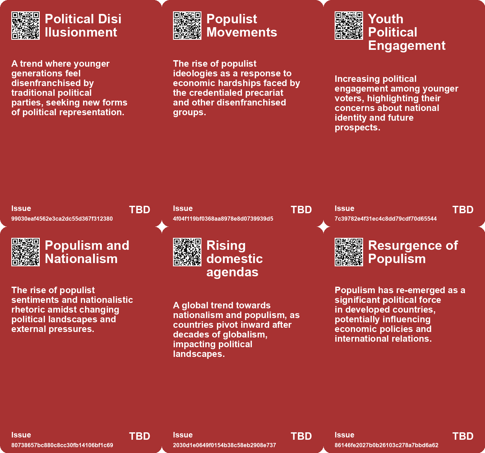
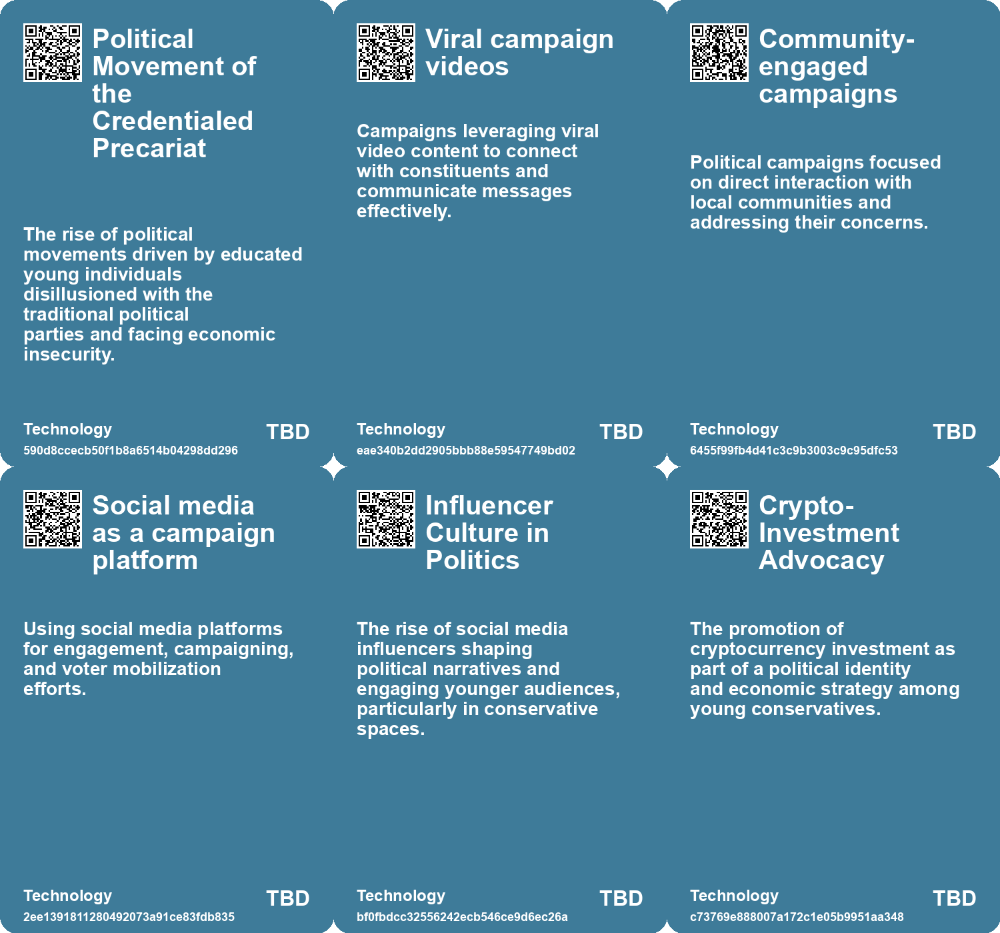

# *Topic*: Populist Political Engagement

# Summary

Populism is a significant theme in contemporary politics, characterized by a growing divide between the common populace and established elites. This phenomenon has seen a resurgence reminiscent of the 1930s, driven by factors such as wealth gaps, nationalism, and social unrest. As populist leaders gain traction, understanding their impact on economic policies and international relations becomes crucial. The management of conflicts between various factions is essential to maintain social order in this evolving landscape.

The challenges facing progressive politics are also notable. Influential figures in technology and media have supported progressive agendas, but the fragility of this support is becoming apparent. Traditional industries are thriving while tech firms struggle, leading to widening class distinctions and potential conflicts between leftist activists and wealthy elites. The financial pressures on urban areas favored by progressives further complicate this dynamic.

The importance of safeguarding democracy is underscored by the rise of private power that threatens democratic institutions. The concentration of this power, coupled with a decline in civic engagement, raises concerns about the future of political and economic democracy. Movements advocating for social justice and economic equality are emerging in response to these challenges, emphasizing the need for measures to reduce inequalities and revive democratic values.

Nonviolent protests have proven effective in driving political change, as evidenced by historical examples where a small percentage of the population engaged in peaceful demonstrations. The "3.5% rule" suggests that when this threshold is met, significant political shifts are likely. The success of nonviolent movements highlights the importance of unity and moral high ground in achieving social and political goals.

The influence of technology on society is a recurring concern. The rise of social media has contributed to polarization and misinformation, undermining democratic processes. To combat these issues, experts advocate for the development of public media platforms, media literacy strategies, and new regulations to promote transparency and accountability in digital spaces.

The political landscape is also shifting in response to changing demographics and economic realities. The rise of the "credentialed precariat" reflects the struggles of educated young individuals facing economic challenges. Their support for candidates like Zohran Mamdani signals a potential shift towards a more populist Democratic Party, mirroring trends seen in the Republican Party. This demographic's desire for representation and meaningful change may redefine American politics.

Finally, the ongoing impact of climate change is a pressing issue that affects communities and the environment. The need for social trust and cooperation is emphasized as regions become increasingly uninhabitable. Effective energy policies and community resilience are essential for addressing the challenges posed by a warming world. The call for collaborative approaches to climate change highlights the interconnectedness of social and environmental issues in contemporary discourse.

# Seeds

|    | name                               | description                                                                                           | change                                                                                                       | 10-year                                                                                                             | driving-force                                                                                                    |
|---:|:-----------------------------------|:------------------------------------------------------------------------------------------------------|:-------------------------------------------------------------------------------------------------------------|:--------------------------------------------------------------------------------------------------------------------|:-----------------------------------------------------------------------------------------------------------------|
|  0 | Youth Political Shift              | Younger voters increasingly supporting populist candidates over traditional party candidates.         | Transition from voting for mainstream candidates to supporting outsiders who represent their interests more. | Future elections may be dominated by candidates prioritizing youth and affordability issues.                        | A younger generation disillusioned by traditional parties and seeking alignment with new ideologies.             |
|  1 | Populist Momentum in Politics      | Populism rising within mainstream parties, challenging traditional power structures.                  | Shift from established political ideologies to populist movements that advocate for the underprivileged.     | Political landscapes could see more populist candidates emerging, reshaping party platforms and policies.           | Growing economic precarity and disenfranchisement driving citizens to seek alternative political representation. |
|  2 | Rise of Populism in Czech Politics | Populist figures gaining traction in Czech elections, indicating a shift in political landscape.      | Shift from a pro-Western coalition towards a more populist and potentially extremist government.             | Possible normalization of extreme political views and alliances in Czech governance.                                | Growing disillusionment with traditional parties and increased demand for populist rhetoric.                     |
|  3 | Resurgence of Populism             | Populism has surged in developed countries to its highest level since the 1930s.                      | From infrequent occurrences in developed countries to a significant political force.                         | Populism may reshape political landscapes, leading to more populist leaders and policies.                           | A growing discontent among the populace regarding wealth gaps and ineffective governance.                        |
|  4 | Populist Playbook                  | Historical analysis reveals a common template among past populist leaders.                            | Understanding of populism shifts from chaotic to a structured template for analysis.                         | Political analysts will use the populist template to predict future movements and leaders.                          | A desire for clarity in political trends and historical context to inform future predictions.                    |
|  5 | Conflict Management in Populism    | Populism leads to increased conflict and disorder within countries.                                   | From cooperative political environments to confrontational and exclusive dynamics.                           | Political systems may evolve to manage conflicts more effectively or become more authoritarian.                     | The need for stability and order in response to increasing political polarization.                               |
|  6 | Impact on Economic Policies        | Populism is expected to influence economic policies more than traditional methods.                    | From reliance on classic monetary and fiscal policies to populist-driven economic strategies.                | Future economies may prioritize populist policies like protectionism and nationalism.                               | Economic instability and public demand for immediate results from leadership.                                    |
|  7 | Media Influence by Populists       | Populist leaders often engage in controlling media narratives.                                        | From independent media to populist-controlled narratives that reinforce their agendas.                       | Media landscapes may become more polarized, with fewer independent voices and more propaganda.                      | A need for populist leaders to consolidate power and support through media control.                              |
|  8 | Global Populism Trends             | Increased international relations driven by populist confrontations.                                  | From cooperative international relations to confrontational stances between nations.                         | Global politics may see a rise in nationalist policies and reduced collaboration.                                   | Populist leaders’ need to unify domestic support through external conflicts.                                     |
|  9 | Growing Distrust in Institutions   | Workers exhibit increasing distrust towards institutions, paralleling political electoral abstention. | Shift from trust and engagement in institutions to a sense of disillusionment and disengagement.             | Potential rise in alternative governance models or community-led initiatives in response to institutional failures. | Continuous failure of traditional institutions to address people's needs and concerns.                           |

# Concerns

|    | name                                             | description                                                                                                                             |
|---:|:-------------------------------------------------|:----------------------------------------------------------------------------------------------------------------------------------------|
|  0 | Political Fragmentation                          | The risk of a fragmented political landscape as new populist movements challenge established parties.                                   |
|  1 | Youth Discontent                                 | Young voters feeling marginalized and disillusioned due to economic pressures may drive political upheaval.                             |
|  2 | Loss of Faith in Traditional Political Systems   | The decline in trust towards established political parties may fuel the rise of populism and alternative movements.                     |
|  3 | Influencer Politics                              | Rise of political influencers shaping ideologies and mobilizing youth, potentially sidelining traditional political discourse.          |
|  4 | Youth Political Engagement                       | Increasing active engagement of young conservatives, leading to shifting political landscapes and potential unrest.                     |
|  5 | Rise of Authoritarianism                         | Populism can lead to the emergence of dictatorships as societies seek order, neglecting democratic principles.                          |
|  6 | Increased Social Conflict                        | The confrontational nature of populist leaders can escalate tensions between different social and economic groups, leading to violence. |
|  7 | Economic Instability Caused by Populist Policies | Populist economic policies such as protectionism may lead to global economic instability and trade conflicts.                           |
|  8 | Manipulation of Media                            | Populist regimes may seek to control or manipulate media, limiting free speech and the dissemination of information.                    |
|  9 | Xenophobia and Cultural Isolation                | Populism often capitalizes on xenophobic sentiments, increasing cultural tensions and isolation from global perspectives.               |

# Cards

## Concerns

## Behaviors

## Issue

## Technology

# Links

* [Meta Halts Political Ads in EU to Avoid New Transparency Regulations](https://futures.kghosh.me/014ce3100d6fcc7d160362d608f5c6fe)
* [Addressing Threats to Democracy: Strategies for Resilience Against Misinformation and Manipulation](https://futures.kghosh.me/56d1a28746cd95ebaa3d62a4e1f91c3a)
* [Navigating the Climate Crisis: The Importance of Community and Social Trust in Adapting to Change](https://futures.kghosh.me/d1e5dc8cd0f7c34dede43f5429dded3d)
* [The Interplay of Democracy, Work, and Economic Justice in Modern Society](https://futures.kghosh.me/43aa6ac3d82bbc19f0d66d5b2bb37897)
* [Harvard Scholars Advocate for AI in Political Polling Amid Declining Human Engagement](https://futures.kghosh.me/1e5947176c3712200aba7c2dfb0db020)
* [Exploring Kate Soper’s Vision for Sustainable Living in 'Post-Growth Living'](https://futures.kghosh.me/71cbf82b85b58a6675d05308f8e1759e)
* [Youthful Conservatism: Celebrations and Shifts in Trump's Second Inauguration](https://futures.kghosh.me/072874a8428401d0b55b1c740a500dd1)
* [Transformative Changes from 2014 to Today: AI, Energy, and Nationalism](https://futures.kghosh.me/299248e05dbfb0ab57ae84fc170ee39a)
* [Exploring Six Narratives on Trump's 2024 Election Victory and Quincy Jones' Creative Philosophy](https://futures.kghosh.me/36a55767a1e538cce12f75e314c80bb8)
* [The Unraveling of Progressive Politics: Economic Shifts and Growing Conflicts](https://futures.kghosh.me/f4ea5244ccafd654e5955673b0ee3976)
* [The UK's Declining Geopolitical Relevance and Elite Inaction: A Historical Perspective](https://futures.kghosh.me/ca555520973a0e8519ff854da1de4d88)
* [The Decline of Political Maturity in America: A Call for Responsible Citizenship](https://futures.kghosh.me/ec5b543a174bedb5387b497cc449e5b9)
* [Understanding Populism: Its Rise, Characteristics, and Implications in Today's Politics](https://futures.kghosh.me/cd6a3016e9c9fa46f13d29ded245803a)
* [The Freedom Summit: A Rallying Cry for Anti-Vaccine Sentiments and Medical Distrust](https://futures.kghosh.me/5bb4812db1abfd19da133a7139cbbac9)
* [Zohran Mamdani's Victory: A Reflection of Rising Credentialed Precariat and Political Change in NYC](https://futures.kghosh.me/d0f1317e1dfd400f02933a3441c9faa1)
* [Zohran Mamdani's Campaign: A Refreshing Approach to Politics Against Establishment Norms](https://futures.kghosh.me/9782d40f901a13851bd120672f254fc9)
* [Innovative Approaches to Public Space Transformation in U.S. Cities](https://futures.kghosh.me/465b809f2a993c634a1a239ca0cab476)
* [The Impact of Declining Marriage Rates on American Society and Community Involvement](https://futures.kghosh.me/7bba3b8d86e60b61318296779a9020c3)
* [Navigating Climate Change: The Need for Community Resilience and Social Trust](https://futures.kghosh.me/efa36dc9bd5ddc890866d4ab1e68e71f)
* [Ziklag's $12 Million Strategy to Influence 2024 Election Through Voter Mobilization and Purging](https://futures.kghosh.me/4cf0dce2c4d4630ab2ab936ededf6c13)
* [Czech Elections: Populist Billionaire Babis Faces Challenges with Extreme Political Allies](https://futures.kghosh.me/d573ad4eee7d5a6a94bf0ad0457f0220)
* [Understanding Polarization: Healing Our Relationship with Technology and Embracing Diverse Perspectives](https://futures.kghosh.me/c1bb890337ef382bfaa5720c9fd05134)
* [U.S. Intel: Russia Continues to Favor Trump in Election Influence Efforts](https://futures.kghosh.me/17319707c9c640b4b92b78f5fdfa61ae)
* [Russell Vought's Ideological War Against Government and the Rise of the Addiction Economy](https://futures.kghosh.me/619829bd081d7da919912e4f63d2549c)