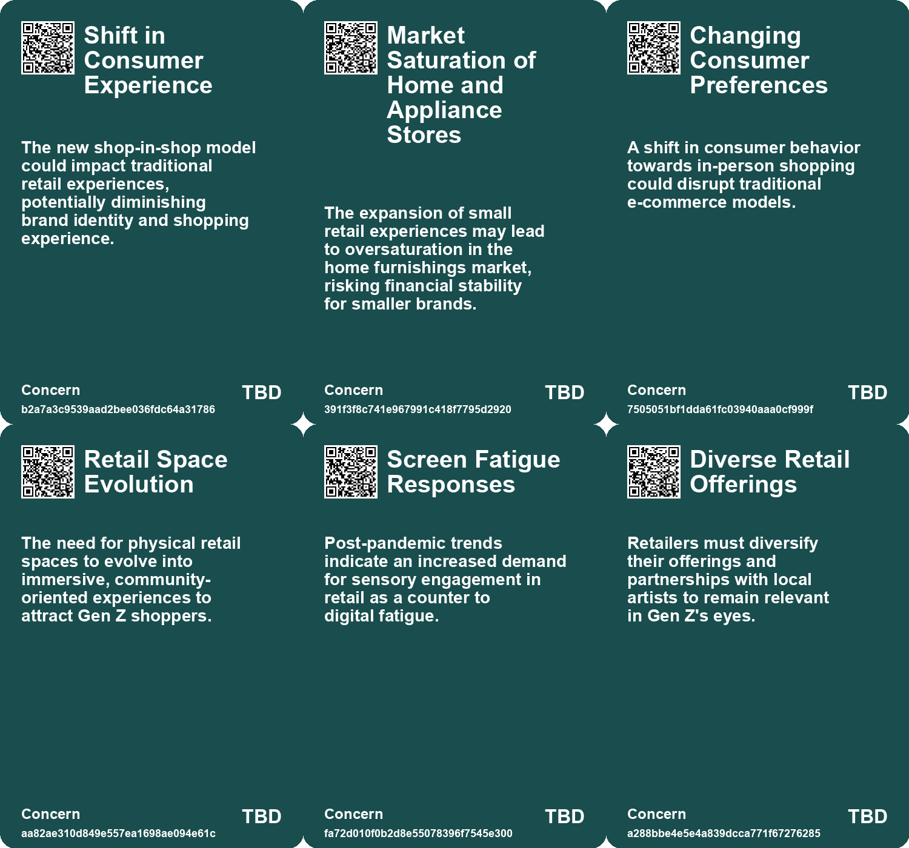
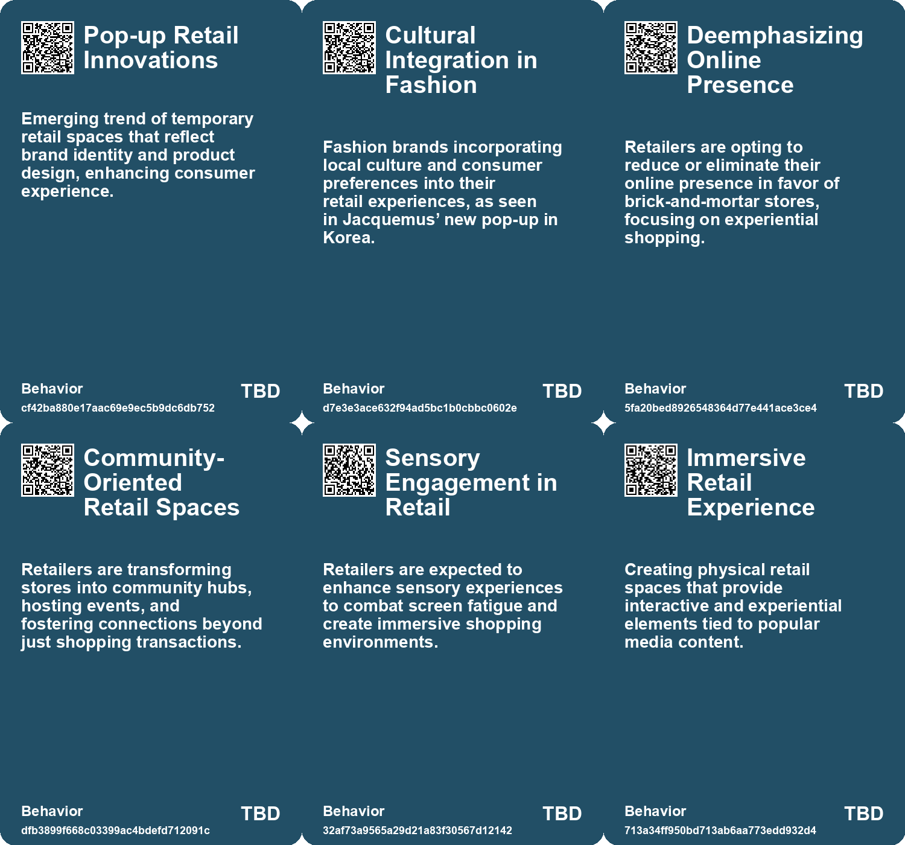
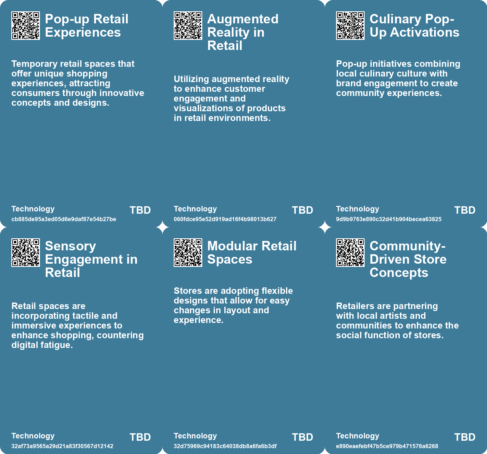

# *Topic*: Pop-up Retail Innovations

# Summary

The retail landscape is undergoing a significant transformation as brands pivot towards creating immersive offline experiences. Designers and retailers are responding to digital fatigue by fostering in-person interactions. Stores are embracing nostalgia, with some opting for printed catalogs instead of online shops. This shift emphasizes the importance of meaningful connections and curated environments that enhance the shopping journey.

Gen Z consumers are at the forefront of this change, favoring physical stores as social spaces to disconnect from digital distractions. Retailers are encouraged to adapt their offerings to cater to Gen Z's desire for community engagement and unique experiences. This demographic's preference for in-store shopping presents an opportunity for brands to create environments that resonate with their tastes and needs.

The resurgence of American malls reflects this trend, as they evolve from shopping centers to vibrant social hubs. Malls are integrating dining and entertainment options, leveraging social media and influencer marketing to attract younger shoppers. This blend of physical and digital engagement caters to the preferences of today’s consumers, particularly millennials and Gen Z.

Innovative retail collaborations are also emerging, such as Ikea's mini stores within Best Buy locations, which aim to provide convenient access to home design solutions. This partnership highlights the growing trend of brands seeking to enhance their physical presence while catering to consumer needs.

Pop-up retail experiences are gaining traction, exemplified by Jacquemus's temporary store in Seoul. This approach allows brands to create buzz and engage with local consumers through exclusive offerings. The rise of experiential retail underscores the importance of creating memorable interactions that resonate with shoppers.

Sustainability remains a critical theme, particularly in the fashion industry, where the resale market is booming. The demand for secondhand clothing is driven by a desire for sustainable shopping habits and the influence of social media platforms. Brands are increasingly recognizing the potential of resale as a viable business model, reflecting a shift towards more responsible consumer behavior.

The tech industry is also grappling with its own challenges, as the Consumer Electronics Show reveals a disconnect between the promises of AI technology and its current capabilities. This skepticism highlights the need for practical solutions that enhance human experiences rather than merely pushing for automation.

Urban innovation is being redefined through concepts like adaptive reuse, where existing structures are repurposed to meet contemporary needs. This approach not only addresses sustainability but also reflects a growing awareness of the importance of community and local engagement in shaping urban environments.

As brands navigate these overlapping themes, the focus remains on creating authentic connections with consumers, whether through immersive retail experiences, sustainable practices, or innovative urban solutions. The future of retail and technology lies in understanding and responding to the evolving preferences and values of today's consumers.

# Seeds

|    | name                             | description                                                                                           | change                                                                                    | 10-year                                                                                          | driving-force                                                                                        |
|---:|:---------------------------------|:------------------------------------------------------------------------------------------------------|:------------------------------------------------------------------------------------------|:-------------------------------------------------------------------------------------------------|:-----------------------------------------------------------------------------------------------------|
|  0 | AR Concepts in Fashion Marketing | The pop-up concept alludes to augmented reality marketing strategies.                                 | Moving from digital representations to physical manifestations in retail.                 | Augmented reality could integrate deeper into retail, enhancing in-store experiences.            | The demand for blending digital and physical shopping experiences.                                   |
|  1 | Mini Retail Formats              | The emergence of smaller retail formats signals a change in consumer shopping behaviors.              | A shift from large, warehouse-style stores to more accessible mini-format stores.         | Smaller retail formats may dominate, catering to urban consumers who prefer convenience.         | The trend towards urbanization and minimalistic living spaces influencing retail space requirements. |
|  2 | Consumer Experience Innovation   | New showroom environments signify a shift towards enhancing customer experiences in retail.           | Retail focuses more on consumer engagement rather than just product sales.                | Innovative shopping experiences will redefine customer interactions in retail spaces.            | Consumer demand for personalized and immersive shopping experiences continues to rise.               |
|  3 | Focus on Customer Experience     | Retailers are prioritizing an immersive and tailored shopping experience over e-commerce convenience. | Shift from transactional e-commerce models to experiential brick-and-mortar environments. | Retail stores may transform into experiential spaces where products and experiences coalesce.    | Recognition that emotional connections enhance consumer satisfaction and brand loyalty.              |
|  4 | Sensory Engagement in Retail     | Retailers are focusing on creating immersive, sensory-rich shopping environments.                     | From traditional retail to experiences that engage multiple senses in-store.              | Shops will become experiential spaces prioritizing sensory engagement and community connection.  | Consumer fatigue from digital experiences and a desire for tactile interactions.                     |
|  5 | Diverse Retail Experiences       | Gen Z is driving the diversification of retail spaces beyond traditional formats.                     | From uniform retail experiences to diverse, multi-purpose spaces that engage consumers.   | Retail environments will be dynamic, offering varied experiences beyond mere transactions.       | The need for unique and personalized shopping experiences in a post-pandemic world.                  |
|  6 | Influencer Culture Impact        | Influencers are increasingly shaping retail choices and driving foot traffic to malls.                | Retail experiences are now designed to be visually appealing for social media sharing.    | Influencers will play a central role in marketing strategies and mall designs.                   | The rise of social media and the desire for shareable experiences.                                   |
|  7 | Partnerships with Street Vendors | New business models to support existing street vendors with technology and resources.                 | Move from isolated street vending to collaborative models that support vendor income.     | Street vendors might operate with improved equipment and technology, enhancing their businesses. | Need for better support and resources for immigrant street vendors.                                  |
|  8 | Product Innovation               | Convenience stores regularly introducing new products to attract customers.                           | From static product ranges to dynamic offerings that change weekly.                       | Konbini may continually evolve their product lines to stay relevant.                             | Intense competition requiring differentiation and consumer engagement.                               |
|  9 | Brand Collaborations             | Convenience stores partnering with fashion brands for exclusive products.                             | Introduction of branded clothing lines within convenience stores.                         | Konbini might transform into lifestyle brands offering diverse product ranges.                   | Seeking new revenue streams and attracting younger customers.                                        |

# Concerns

|    | name                                           | description                                                                                                                                          |
|---:|:-----------------------------------------------|:-----------------------------------------------------------------------------------------------------------------------------------------------------|
|  0 | Environmental Concerns of Fast Fashion         | The rise of pop-up stores and ephemeral retail may contribute to increased waste and environmental degradation due to overproduction.                |
|  1 | Shift in Consumer Experience                   | The new shop-in-shop model could impact traditional retail experiences, potentially diminishing brand identity and shopping experience.              |
|  2 | Market Saturation of Home and Appliance Stores | The expansion of small retail experiences may lead to oversaturation in the home furnishings market, risking financial stability for smaller brands. |
|  3 | Retail Space Evolution                         | The need for physical retail spaces to evolve into immersive, community-oriented experiences to attract Gen Z shoppers.                              |
|  4 | Screen Fatigue Responses                       | Post-pandemic trends indicate an increased demand for sensory engagement in retail as a counter to digital fatigue.                                  |
|  5 | Diverse Retail Offerings                       | Retailers must diversify their offerings and partnerships with local artists to remain relevant in Gen Z's eyes.                                     |
|  6 | Experience over Transaction                    | There's a growing expectation for retailers to provide memorable experiences rather than just transactional interactions.                            |
|  7 | Brand Dominance                                | The increasing trend of streaming services like Netflix dominating retail spaces could overshadow traditional retail experiences.                    |
|  8 | Cultural Shifts in Consumer Behavior           | As Gen Z seeks social experiences over traditional shopping, malls must continuously evolve to meet changing preferences.                            |
|  9 | Dependence on Innovation                       | As traditional models plateau, convenience stores must innovate constantly; failure to do so could result in losing market relevance.                |

# Cards

## Concerns

## Behaviors

## Issue

## Technology

# Links

* [The Revival of Malls: How Gen Z is Reshaping Shopping Destinations](https://futures.kghosh.me/3c27a71013ec18bf55a80ae739105bd7)
* [The Rise of Secondhand Shopping Amid Economic Challenges: A Sustainable Trend](https://futures.kghosh.me/6e8eeaf2acd0e96acb4d43a085c483e1)
* [Zara Launches New Mobile App Feature 'Travel Mode' to Enhance Customer Experience](https://futures.kghosh.me/3a9c3099b0f5f788365717fd31a89fc8)
* [Netflix Launches Immersive Retail Experience at The Grove in Los Angeles](https://futures.kghosh.me/69ac0a51474dc55424e5281c7b649cad)
* [Oma's Soep Launches Campaign to Combat Loneliness Through Grocery Store Interactions](https://futures.kghosh.me/d73cef2dc5d458ba6b4a61dff2997181)
* [Exploring Underserved Markets: Opportunities in Tech for Overlooked Demographics](https://futures.kghosh.me/26ba39098b3b13effa1dc519e2bb689c)
* [Ikea to Launch Mini Retail Stores Inside Best Buy Across Southern US](https://futures.kghosh.me/0198eb4a02c8657e740a9d9efb5a1a35)
* [Blank Street: Revolutionizing Coffee with Zero-Emission Carts and Affordable Prices in NYC](https://futures.kghosh.me/ad6334d8203e40ef0376165b2141e1d3)
* [The Future of Wearable Technology: Merging Cyborg Lifestyles with Daily Life](https://futures.kghosh.me/a81c4775b91ccd0db3e1b84da893ac6f)
* [Understanding Gen Z Shopping Preferences: The Shift Towards Community and Experience in Retail](https://futures.kghosh.me/adc1258885aa937c5350875662ee892f)
* [Tredje Natur's Innovative Floating Car Parks Address Urban Flooding Challenges](https://futures.kghosh.me/fa32383d80fb8bdbed6465119f33fe4b)
* [The Resale Revolution: Redefining Fashion Through Sustainable Practices and Technology](https://futures.kghosh.me/8a1754f1df4fcfa417f1facfd72eebe0)
* [Jacquemus Unveils Giant Pop-Up Store in Seoul Featuring the Bambimou Bag.](https://futures.kghosh.me/94961e2c9317c22e226d4861726c131b)
* [The Shift to Offline Engagement: Emphasizing Exclusivity in Marketing Strategy](https://futures.kghosh.me/65551baaae23bcc5299a04882667bf50)
* [Exploration des Futurs Possibles pour les Villes Numériques : Quatre Typologies Innovantes](https://futures.kghosh.me/72e5a64ac4cd53212ecf3efd96335b04)
* [Five Emerging Trends Transforming Business in the Coming Year](https://futures.kghosh.me/55bac03899915f25bf0b47fa4342472c)
* [Exploring the Disconnection Between AI Promises and Reality at CES 2023](https://futures.kghosh.me/761a3d9b508c2a1db7a6c60d1be5ec98)
* [Exploring the Future: How Technology Will Transform Society by 2034](https://futures.kghosh.me/8ef50cfd87ff3eedbc028932b07520b3)
* [Critique of Millennial Branding in Consumer Packaging and Its Impact](https://futures.kghosh.me/15c3e276ff4d0cdae6da27cb3d8431c5)
* [The Urgent Need for Adaptive Reuse in Architecture Today](https://futures.kghosh.me/cf7cc3361b8139c51e3e97835a2da4e4)
* [Exploring the Top Urban Trends for 2024: A Global Perspective from Time Out Editors](https://futures.kghosh.me/e326bf8ab0b424d515d0691f5eac1fd7)
* [Nike ouvre une cantine traditionnelle à Guangzhou pour les runners](https://futures.kghosh.me/f3aaa063b003fe33ab2a2f3fb9a0a0d8)
* [Future Trends Post-2024: Declining Democracies and Emerging Cultural Shifts](https://futures.kghosh.me/bd1b01636b1360716b5951e1cac42724)
* [The Evolution of Japan's Convenience Stores: From Uncertainty to Essential Community Hubs](https://futures.kghosh.me/28359736d11dd6bdeac2ce5a1947f469)
* [Exploring Cookies, Supply Chains, and Future Challenges in Technology and Consumption](https://futures.kghosh.me/fa27e27bdec01712d582ab0f61c95bac)
* [Exploring the $100 Trillion Potential of B2B Marketplaces and Their Innovation](https://futures.kghosh.me/50aefdd8b2bffa1bb84f8460c7b559c2)
* [The Shift from E-commerce to In-Person Retail Experiences in Fashion](https://futures.kghosh.me/2db44f1091d08697f6f525dbe8740189)