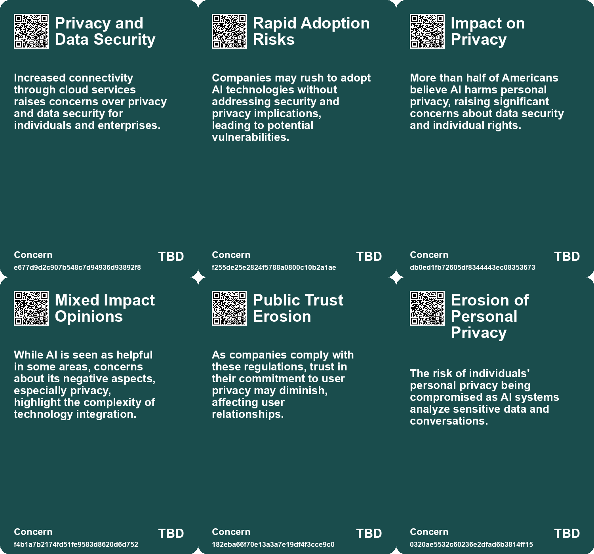
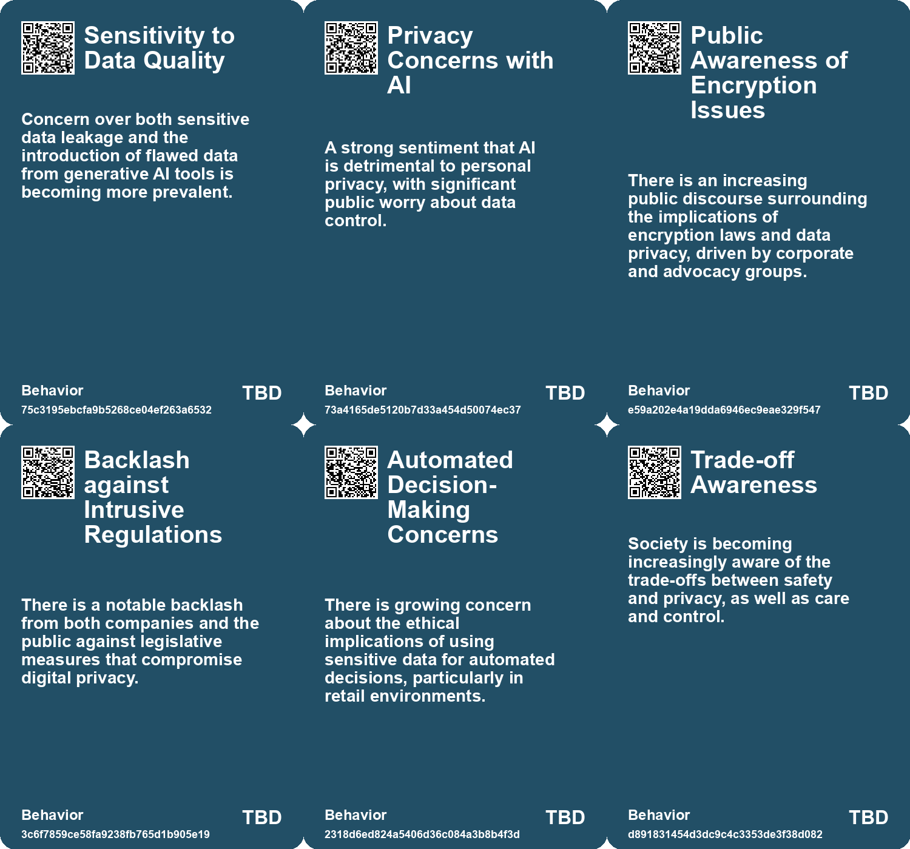
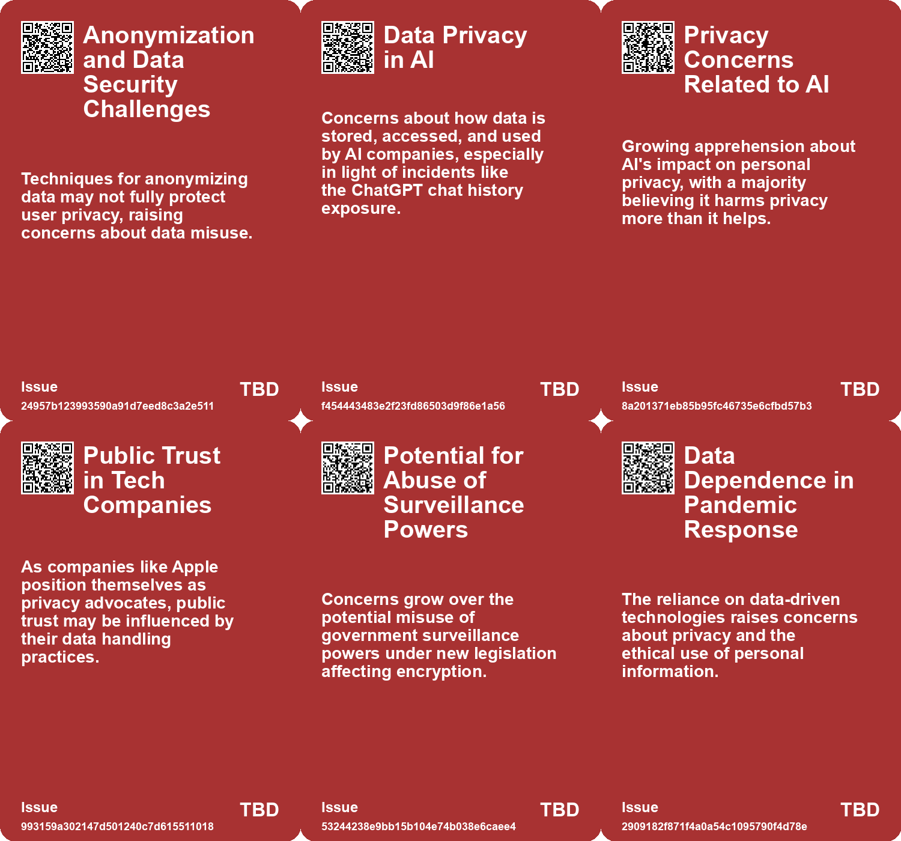
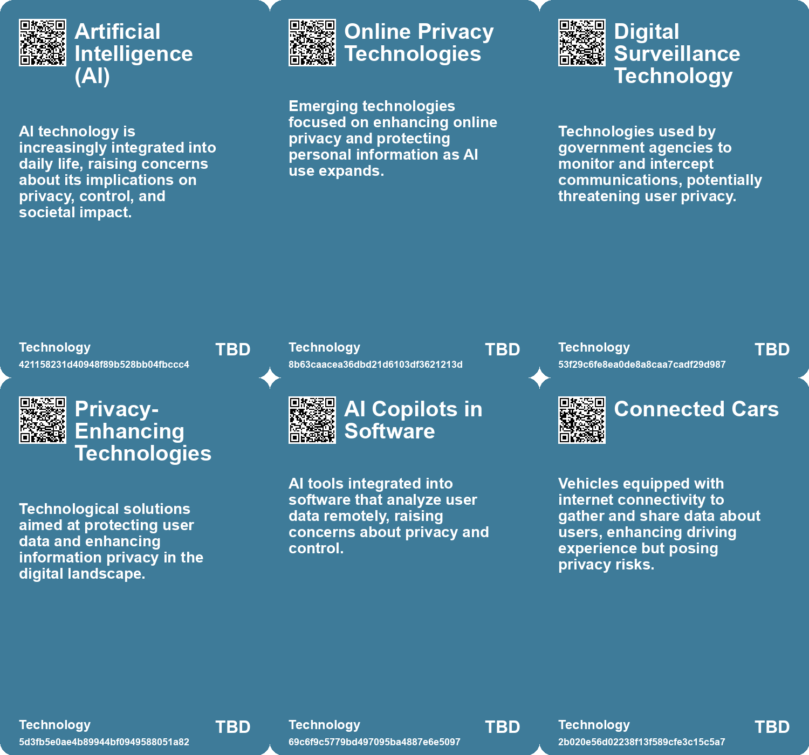

# *Topic*: Privacy Concerns in Technology

# Summary

The increasing prevalence of cameras in society raises significant concerns about privacy and accountability. With the rapid growth of surveillance technologies, including small cameras and AI-driven analysis, the volume of video data has become overwhelming. This shift has outpaced existing social norms and legal frameworks, leading to a pressing need for discussions about the implications of constant surveillance.

Connected cars are another area of concern, as they collect vast amounts of sensitive data about drivers, including personal information and location. Privacy advocates warn of potential abuses, such as stalking and discrimination in insurance rates. The Federal Trade Commission is actively addressing these issues, emphasizing the importance of data security and the necessity for companies to implement robust privacy safeguards.

The automotive industry faces scrutiny for its data collection practices, with many car brands receiving warnings for inadequate privacy measures. Most brands collect more personal data than necessary and often share it with third parties, leaving consumers with little control over their information. This situation highlights the urgent need for stronger privacy regulations in the automotive sector.

As artificial intelligence continues to evolve, public sentiment is shifting. A recent survey indicates that a majority of Americans are more concerned than excited about AI's growing role in daily life. Concerns about privacy and the potential for misinformation are prevalent, particularly as the 2024 election approaches. The need for regulation and guidelines to ensure responsible AI development is becoming increasingly clear.

The intersection of AI and data privacy presents complex challenges. Organizations are grappling with how to leverage AI for productivity while managing the risks associated with data leakage and inconsistent software performance. Employees often use AI tools without disclosing their usage, raising questions about transparency and the distribution of productivity gains.

The impact of technology on human interaction is also a critical theme. Innovations that reduce face-to-face communication may undermine social understanding and empathy. As technology continues to evolve, the essence of humanity—social interaction—could be at risk.

Finally, the ethical implications of data scraping and the potential for mass surveillance through AI are significant concerns. The automation of data analysis can lower the barriers to spying, raising alarms about privacy and the chilling effects of constant monitoring. The need for government regulation to protect individual rights in the face of advancing technology is becoming increasingly urgent.

# Seeds

|    | name                                 | description                                                                                               | change                                                                                                 | 10-year                                                                                                                    | driving-force                                                                                                  |
|---:|:-------------------------------------|:----------------------------------------------------------------------------------------------------------|:-------------------------------------------------------------------------------------------------------|:---------------------------------------------------------------------------------------------------------------------------|:---------------------------------------------------------------------------------------------------------------|
|  0 | Consumer Demand for Privacy Features | Consumers are beginning to expect privacy controls similar to those on smartphones in their vehicles.     | Shifting from minimal privacy options to robust consumer control over data sharing in vehicles.        | In ten years, vehicles may feature advanced privacy controls that empower users to manage their data.                      | The success of privacy-focused companies, like Apple, will influence consumer expectations in the auto sector. |
|  1 | Stalking and Data Misuse Risks       | Concerns about connected car data being used for stalking or insurance discrimination.                    | Transition from benign use of data to awareness of potential abuse and harm.                           | In 10 years, there may be stringent laws to protect individuals from data misuse.                                          | Rising awareness of personal safety and privacy issues related to technology.                                  |
|  2 | Ethical Dilemmas in Health Tech      | Emerging ethical concerns surrounding health monitoring technologies.                                     | Shift from uncritical adoption of health tech to scrutiny of privacy and ethical implications.         | In ten years, there will be established frameworks for ethical use of health technologies.                                 | Public awareness and advocacy for privacy rights and ethical standards.                                        |
|  3 | Data Ownership and Privacy           | Concerns about who owns and controls data collected from devices.                                         | Control over personal data shifting from corporations to individuals and regulatory bodies.            | More individuals owning their data, leading to new business models and privacy protections.                                | Growing awareness and activism around data privacy rights.                                                     |
|  4 | Privacy Norms Evolving               | Social norms regarding privacy are struggling to keep up with technological advancements in surveillance. | Societal understanding of privacy is shifting from a more private past to an openly monitored present. | In ten years, new social norms may emerge that redefine acceptable levels of surveillance and privacy.                     | Cultural adaptation to technology influences evolving norms around surveillance and privacy.                   |
|  5 | Backlash Against Data Extraction     | Users are increasingly frustrated with mandatory data-sharing policies by tech companies.                 | Shift from passive data sharing to active resistance against intrusive data collection practices.      | Users may demand more transparent and ethical data-sharing practices from tech companies, leading to stricter regulations. | The growing awareness and concern over privacy and data rights among users.                                    |
|  6 | Emotional Responses to AI            | People experience discomfort and fear regarding AI and data usage.                                        | From dismissing emotional responses to recognizing their importance in policy discussions.             | Policymaking may increasingly incorporate emotional and psychological dimensions of user experiences with AI.              | The recognition of the significant emotional impact of technology on individuals and communities.              |
|  7 | Increased Data Control Awareness     | Users are becoming more aware of their rights regarding data control.                                     | Shift from ignorance of data rights to proactive engagement in data protection.                        | Users may have more tools and resources to manage their data and assert their rights effectively.                          | The growing emphasis on digital rights and user empowerment in the tech landscape.                             |
|  8 | Privacy Concerns in Modern Vehicles  | The collection of personal data by car manufacturers raises significant privacy issues for consumers.     | Shift from vehicles as private spaces to data-collecting devices that invade personal privacy.         | Vehicles may be regulated to limit data collection, leading to greater consumer control over personal data.                | Growing consumer awareness and demand for privacy protections in technology.                                   |
|  9 | Public Perception of Privacy         | Public understanding of what constitutes privacy is evolving and often underestimated.                    | Change from a clear understanding of privacy to a more ambiguous perception among users.               | People may have a diminished sense of privacy, accepting invasive practices as normal.                                     | The ubiquity of social media and online sharing, leading to a blurring of privacy boundaries.                  |

# Concerns

|    | name                              | description                                                                                                                                             |
|---:|:----------------------------------|:--------------------------------------------------------------------------------------------------------------------------------------------------------|
|  0 | Privacy and Data Security         | Increased connectivity through cloud services raises concerns over privacy and data security for individuals and enterprises.                           |
|  1 | Rapid Adoption Risks              | Companies may rush to adopt AI technologies without addressing security and privacy implications, leading to potential vulnerabilities.                 |
|  2 | Impact on Privacy                 | More than half of Americans believe AI harms personal privacy, raising significant concerns about data security and individual rights.                  |
|  3 | Mixed Impact Opinions             | While AI is seen as helpful in some areas, concerns about its negative aspects, especially privacy, highlight the complexity of technology integration. |
|  4 | Public Trust Erosion              | As companies comply with these regulations, trust in their commitment to user privacy may diminish, affecting user relationships.                       |
|  5 | Erosion of Personal Privacy       | The risk of individuals' personal privacy being compromised as AI systems analyze sensitive data and conversations.                                     |
|  6 | Surveillance vs. Privacy          | The implementation of pandemic technologies raises concerns about increased surveillance and the erosion of individual privacy rights.                  |
|  7 | Data Ownership and Privacy        | Concerns about who owns data collected by companies, especially in the context of advanced technologies like electric vehicles and social media.        |
|  8 | Data Misuse and Misrepresentation | Concerns about how shared personal data may transform into a commodified dataset without proper context or oversight.                                   |
|  9 | Surveillance Technology Growth    | The rise of surveillance technologies that utilize scraped data, raising concerns over privacy and civil liberties.                                     |

# Cards

## Concerns

## Behaviors

## Issue

## Technology

# Links

* [Understanding the Complex Landscape of Connected Vehicle Data and Privacy Concerns](https://futures.kghosh.me/fe7e41280ce4475f799785a436070868)
* [Public Concern About Artificial Intelligence Grows Amid Mixed Opinions on Its Impact](https://futures.kghosh.me/c3876ee8e1b4e0d9e38edf15caaa5521)
* [Apple's Stand Against U.K. Surveillance Proposals: A Threat to Encryption and User Privacy](https://futures.kghosh.me/592f0831eeefa9761ae385bc25f166a0)
* [Rising Tensions in U.S.-China AI Development and Regulatory Challenges Ahead](https://futures.kghosh.me/3c87907a359edc6a80187a597d0c3074)
* [Exploring Cookies, Supply Chains, and Future Challenges in Technology and Consumption](https://futures.kghosh.me/fa27e27bdec01712d582ab0f61c95bac)
* [Bruce Schneier Warns of AI-Enabled Mass Spying and Its Implications for Privacy](https://futures.kghosh.me/63d7953ba75cf8b2b87f70ff0775f6b3)
* [Understanding the Three C’s of Data Participation: Context, Consent, and Control in AI](https://futures.kghosh.me/2251d443897c8e2b1369bb144d9252b5)
* [Navigating the Risks of Generative AI: Data Privacy and Intellectual Property Challenges](https://futures.kghosh.me/3c44301c056cd97da8e2fee49627b03e)
* [The Impact of Ubiquitous Surveillance Cameras on Society and Accountability](https://futures.kghosh.me/7790ecd5c227bae024a54ac5725ac978)
* [The Alarming Privacy Issues of Modern Cars: A Deep Dive into Data Collection and Consent](https://futures.kghosh.me/d36bfc24eaef43d38c611b9c8d2491d0)
* [Exploring the Ethical Implications and Legal Challenges of Data Scraping Practices](https://futures.kghosh.me/2703e9bdcf4fd2ee2214fd78aa4064dc)
* [Enterprise Risks of Data Leaks Through Generative AI Applications: Insights and Recommendations](https://futures.kghosh.me/8db2a36589f876d68d47c64440d9b91c)
* [Privacy Risks of Connected Cars: FTC's Ongoing Efforts to Protect Consumers](https://futures.kghosh.me/cc8016bef53cadd0aadec4626a406982)
* [Technologies of Hope: Navigating Pandemic Innovations and Their Societal Implications](https://futures.kghosh.me/d44d0c046d2ee3330a2d40cfccdfc0d3)
* [Understanding Polarization: Healing Our Relationship with Technology and Embracing Diverse Perspectives](https://futures.kghosh.me/c1bb890337ef382bfaa5720c9fd05134)
* [The Threat of Authoritarian Intelligence: A Call for Responsible AI Development](https://futures.kghosh.me/0ba4fa557cd2aae4760bd7a2abca844e)
* [Google's Transition to Remote Work and the Evolution of Information Security](https://futures.kghosh.me/7a34820852cf03cbbdb1fb75ca3b629c)
* [Navigating the Dilemma of AI Integration in Organizations: Embracing Secret Cyborgs for Innovation](https://futures.kghosh.me/c42a95f16678ed3834840d48f8e775a3)
* [The Diminishing Role of Human Interaction in Modern Technology and Its Societal Implications](https://futures.kghosh.me/31491f2b50e77cc7c45e541a9b2915d7)
* [OpenAI CEO Highlights AI Risks to Election Integrity and Calls for Regulation](https://futures.kghosh.me/fd96f58595786b0820cca21394223a66)
* [Public-Private Partnerships in AI: Risks and Societal Implications](https://futures.kghosh.me/6264095641147fe54800b8f03723f381)