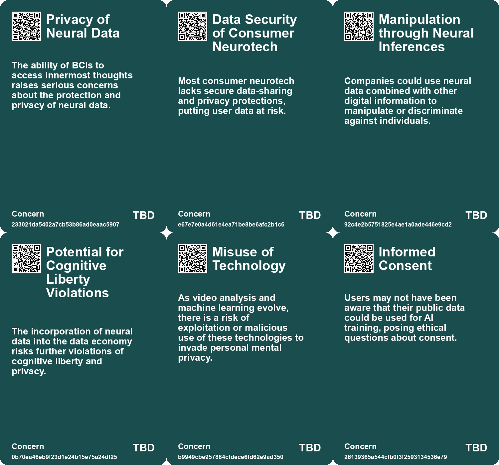
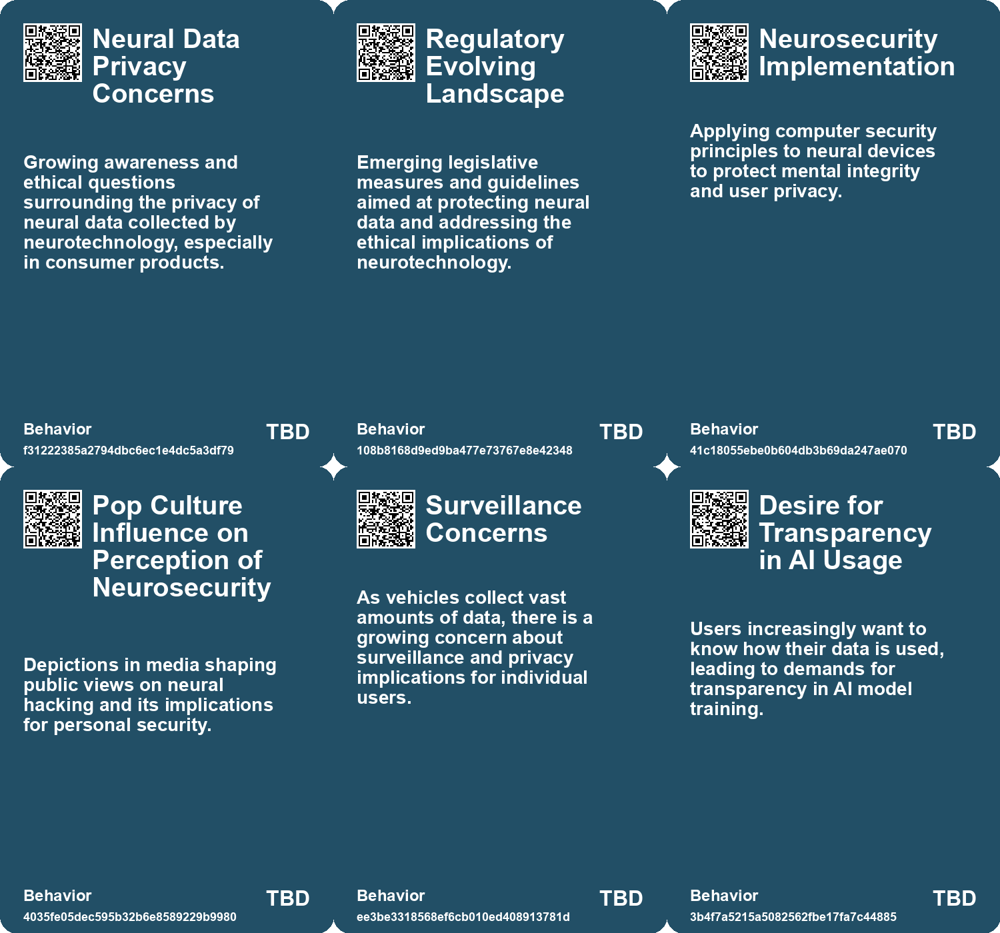
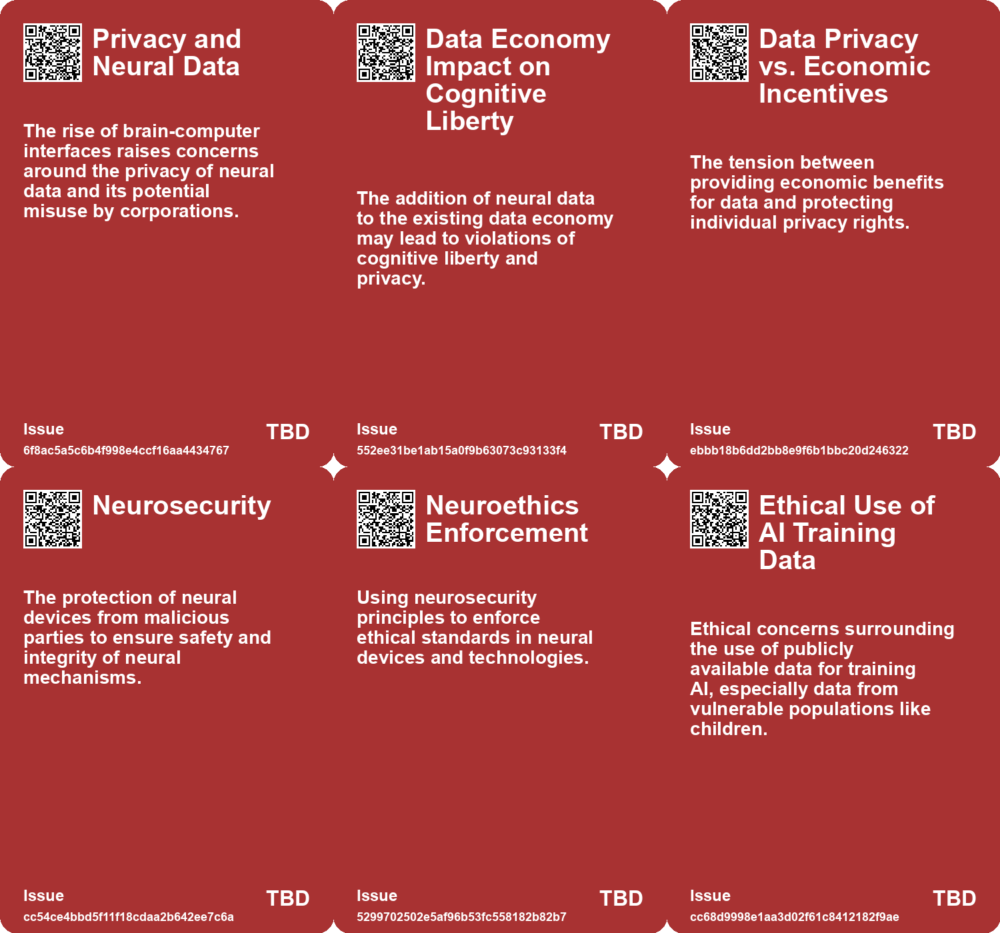
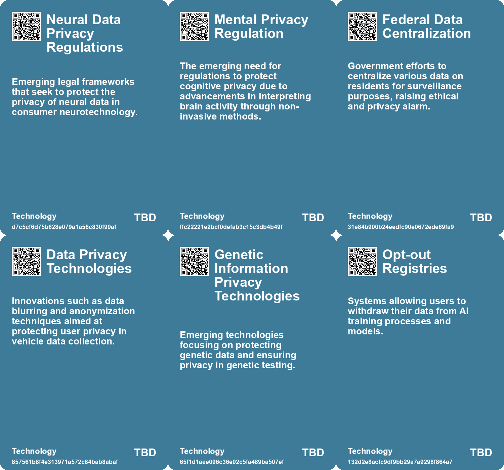

# *Topic*: Privacy of Neural Data

# Summary

Data privacy and ownership are increasingly pressing issues in the digital age. The rise of generative AI has led to significant concerns about data leakage, with reports indicating that a notable percentage of employee prompts to AI tools contain sensitive information. Chief Information Security Officers are urged to implement strict policies to protect confidential data while navigating the complexities of AI usage. The challenge is compounded by the prevalence of unauthorized AI applications, which can exacerbate data security risks.

The concept of data ownership is gaining traction, as seen in Brazil's innovative pilot program that allows citizens to manage and profit from their digital footprints. This initiative aims to empower individuals but raises concerns about accessibility and the potential exploitation of vulnerable populations. Critics warn that treating data as a commodity could undermine personal privacy, highlighting the delicate balance between monetization and protection.

The automotive industry is facing scrutiny over its extensive data collection practices. Connected cars gather vast amounts of personal information, including location and biometrics, raising alarms about privacy violations. Advocacy groups are calling for clearer regulations to protect consumer data, as many car brands have been found to share personal information without adequate transparency. The lack of control over personal data in this sector is alarming, prompting demands for stronger privacy safeguards.

Neurosecurity is emerging as a critical field, focusing on the protection of neural devices and the ethical implications of their use. As technology advances, concerns about cognitive liberty and the potential for surveillance grow. The intersection of neuroscience and data privacy is becoming increasingly relevant, especially as brain-computer interfaces and mind-reading technologies develop. Ethical considerations must be addressed to ensure that individuals' mental processes remain secure.

The use of AI in mental health care presents both opportunities and risks. While AI could provide personalized support, privacy concerns arise regarding the handling of sensitive information. The potential for government surveillance and data exploitation in therapeutic contexts raises alarms about the confidentiality of mental health discussions. Critics argue that AI therapy lacks the necessary privacy protections, making it a risky option for those seeking help.

The data broker industry is under fire for its practices involving sensitive mental health information. Reports reveal that data brokers are selling and exchanging this data with minimal oversight, posing significant risks to individuals' privacy. The lack of best practices and regulatory frameworks highlights the urgent need for comprehensive federal privacy laws to protect vulnerable populations.

Finally, the implications of AI-generated content and copyright law are becoming increasingly contentious. As companies like OpenAI utilize publicly shared data for training their models, concerns about data exploitation and the rights of content creators are rising. The clash between current copyright laws and the realities of AI-generated content underscores the need for clear guidelines to navigate this evolving landscape.

# Seeds

|    | name                                              | description                                                                                  | change                                                                                          | 10-year                                                                                                   | driving-force                                                                                         |
|---:|:--------------------------------------------------|:---------------------------------------------------------------------------------------------|:------------------------------------------------------------------------------------------------|:----------------------------------------------------------------------------------------------------------|:------------------------------------------------------------------------------------------------------|
|  0 | Ethical Concerns in Neurotechnology               | Expanding BCI technology raises ethical issues concerning neural data privacy.               | Growing concern over how neural data is accessed, shared, and used by corporations.             | Stricter regulations and frameworks established to protect users' neural data privacy and prevent misuse. | Public demand for transparency and accountability from tech companies handling sensitive neural data. |
|  1 | Legislative Action on Neural Data Privacy         | Emerging laws are beginning to protect neural activity data from misuse by companies.        | Movement from unregulated consumer products to legislative frameworks safeguarding neural data. | Comprehensive global standards in place to protect citizens’ mental data and rights associated with it.   | Growing public awareness of privacy rights and the potential for data misuse in neurotechnology.      |
|  2 | Psychological data commodification                | Personal mental health data from AI chatbots might be exploited for commercial benefits.     | Transition from personal data privacy to potential monetization of sensitive user info.         | Consumers may be resigned to having their psychological profiles used for profit.                         | Demand for data monetization in corporate technology sectors.                                         |
|  3 | Emergence of Neurosecurity                        | Neurosecurity focuses on protecting neural devices from malicious interference.              | Shifting from general cybersecurity to specialized protection of neural technologies.           | Widespread implementation of neurosecurity measures in neural devices to prevent hacking.                 | Increasing use of neural implants and devices leading to heightened security concerns.                |
|  4 | Technological Advancements in Data Anonymization  | Companies are promoting advanced methods for anonymizing user data to protect privacy.       | Shifting from basic data handling practices to sophisticated anonymization techniques.          | In a decade, anonymization technologies may evolve to ensure greater protection of user data in vehicles. | The desire to maintain consumer trust and comply with privacy regulations will drive tech innovation. |
|  5 | AI Transparency Demands                           | There’s a growing call for transparency regarding AI training data and processes.            | Shift from opaque AI systems to more transparent practices in AI training.                      | In a decade, transparency might become a legal requirement for AI systems concerning data sources.        | Public pressure and regulatory requirements for accountability in AI technology.                      |
|  6 | Increased scrutiny on data transfer practices     | Regulatory bodies show heightened concern about data anonymisation and pseudonymisation.     | Shift from lenient data transfer practices to stricter scrutiny and regulations.                | In 10 years, data transfer will be heavily regulated, ensuring higher privacy standards.                  | Growing public demand for data privacy and protection against misuse.                                 |
|  7 | Potential for re-identification                   | Concerns arise about the ability to re-identify individuals from supposedly anonymised data. | Move from perceived anonymity in data to potential risks of individual identification.          | In 10 years, methods to re-identify individuals may become more sophisticated, challenging privacy laws.  | Technological advancements in data analytics and machine learning.                                    |
|  8 | Surveillance and Privacy Concerns                 | The use of brain imaging technologies raises significant privacy and surveillance issues.    | Growing concerns over personal privacy as mind-reading technology becomes more prevalent.       | Stricter regulations may emerge to protect individual privacy against mind-reading technologies.          | Public awareness and advocacy for human rights lead to demands for privacy safeguards.                |
|  9 | Increased Awareness of Mental Health Data Privacy | Growing concerns about the privacy of mental health data among consumers and advocates.      | Shift from ignorance about data privacy to heightened awareness and demand for protections.     | In 10 years, there may be stronger regulations and consumer advocacy for mental health data privacy.      | Public awareness and advocacy for mental health privacy rights are driving this change.               |

# Concerns

|    | name                                       | description                                                                                                                                          |
|---:|:-------------------------------------------|:-----------------------------------------------------------------------------------------------------------------------------------------------------|
|  0 | Privacy of Neural Data                     | The ability of BCIs to access innermost thoughts raises serious concerns about the protection and privacy of neural data.                            |
|  1 | Data Security of Consumer Neurotech        | Most consumer neurotech lacks secure data-sharing and privacy protections, putting user data at risk.                                                |
|  2 | Manipulation through Neural Inferences     | Companies could use neural data combined with other digital information to manipulate or discriminate against individuals.                           |
|  3 | Potential for Cognitive Liberty Violations | The incorporation of neural data into the data economy risks further violations of cognitive liberty and privacy.                                    |
|  4 | Privacy Violations in Neuroscience         | The potential for malicious actors to access and misuse personal neural data, compromising individual privacy.                                       |
|  5 | Informed Consent                           | Users may not have been aware that their public data could be used for AI training, posing ethical questions about consent.                          |
|  6 | Invasive Data Collection Practices         | The increasing mandatory collection of personal data for AI training without informed consent raises ethical concerns about privacy and user rights. |
|  7 | Data Misuse and Misrepresentation          | Concerns about how shared personal data may transform into a commodified dataset without proper context or oversight.                                |
|  8 | Data Privacy Risks in Technology           | Despite advancements in privacy-enhancing technologies, there are still concerns about potential data breaches and misuse.                           |
|  9 | Ethical Implications of Data Sharing       | The balance between privacy and the need for data sharing in various sectors raises ethical concerns.                                                |

# Cards

## Concerns

## Behaviors

## Issue

## Technology

# Links

* [The Alarming Privacy Issues of Modern Cars: A Deep Dive into Data Collection and Consent](https://futures.kghosh.me/d36bfc24eaef43d38c611b9c8d2491d0)
* [Understanding the Complex Landscape of Connected Vehicle Data and Privacy Concerns](https://futures.kghosh.me/fe7e41280ce4475f799785a436070868)
* [Understanding the Risks of Data Brokers Selling Americans’ Mental Health Information](https://futures.kghosh.me/d7e132b0dc94474c05f6109c82cf9878)
* [EU Approves New Data Transfer Deal with the U.S. Amid Ongoing Privacy Concerns](https://futures.kghosh.me/bef6f36725097d0c16289eca2eb18df4)
* [Investigation Reveals Extensive Driver Data Collection by Major Car Brands in Australia](https://futures.kghosh.me/62c61eaa138e1224c7ca89ac43a85b1e)
* [Understanding the Layers and Implications of Your Online Profile](https://futures.kghosh.me/f1d82c77bab293b0974aa46784ef1984)
* [The Troubling Future of 23andMe and Customer Genetic Data Privacy](https://futures.kghosh.me/c0420b6b9397d9b1d827755ca35b91ec)
* [Privacy Risks of Connected Cars: FTC's Ongoing Efforts to Protect Consumers](https://futures.kghosh.me/cc8016bef53cadd0aadec4626a406982)
* [Enterprise Risks of Data Leaks Through Generative AI Applications: Insights and Recommendations](https://futures.kghosh.me/8db2a36589f876d68d47c64440d9b91c)
* [Advancements in Mind-Reading Technology Raise Ethical Concerns About Privacy and Free Thought](https://futures.kghosh.me/95a515aafcc880230a55f57c5d902d3f)
* [The Future of Brain-Computer Interfaces: Promise and Ethical Concerns](https://futures.kghosh.me/c6702f63f03fb731d83c81e00768b28d)
* [OHMNI: The Fashion Revolution for Privacy and Autonomy in a Digital Age](https://futures.kghosh.me/6014545e533ca07e1307fbc35740f55a)
* [Understanding Ownership and Privacy Implications of Tesla's Data Collection Practices](https://futures.kghosh.me/aa8144a7a9cdc5baa399df0daa112f75)
* [Zoom's Terms Update: Customer Data Utilization for AI Training Without Opt-Out Option](https://futures.kghosh.me/3b96c74f728c6281fc7f1a045a5befc7)
* [Understanding the Three C’s of Data Participation: Context, Consent, and Control in AI](https://futures.kghosh.me/2251d443897c8e2b1369bb144d9252b5)
* [Understanding Neurosecurity: Protection for Neural Devices and User Behavior](https://futures.kghosh.me/70be08bc846223ea4b986fd5f9a69bcf)
* [Exploring Callisto and the Role of Privacy-Enhancing Technologies in Combating Sexual Assault](https://futures.kghosh.me/e37681e9430b42da8833c0133e69c45d)
* [Brazil Introduces World’s First Data Ownership Pilot, Enabling Citizens to Profit from Their Digital Footprints](https://futures.kghosh.me/38207f22024a6cf01b4671ffe08e9a2d)
* [The Privacy Risks of AI Therapy in a Surveillance State](https://futures.kghosh.me/2a493a65f2f08559abd0c9f29816530b)
* [Meta Confirms Use of Public Facebook and Instagram Data for AI Training Since 2007](https://futures.kghosh.me/d39ec90910c047d0471d5f8e1f4d0ad4)
* [Navigating the Risks of Generative AI: Data Privacy and Intellectual Property Challenges](https://futures.kghosh.me/3c44301c056cd97da8e2fee49627b03e)
* [Understanding Google's Pseudonymisation vs Anonymisation in Data Handling](https://futures.kghosh.me/903096f9f71209541fb6fabd6220b72b)
* [OpenAI Faces GDPR Compliance Challenges Over ChatGPT's Inaccurate Data Handling](https://futures.kghosh.me/a583c1f70f546abab9c9213685cd2a9e)
* [Exploring Cookies, Supply Chains, and Future Challenges in Technology and Consumption](https://futures.kghosh.me/fa27e27bdec01712d582ab0f61c95bac)